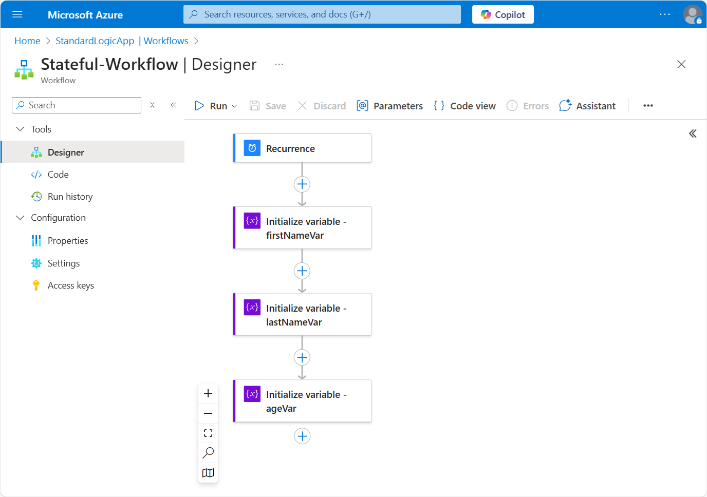
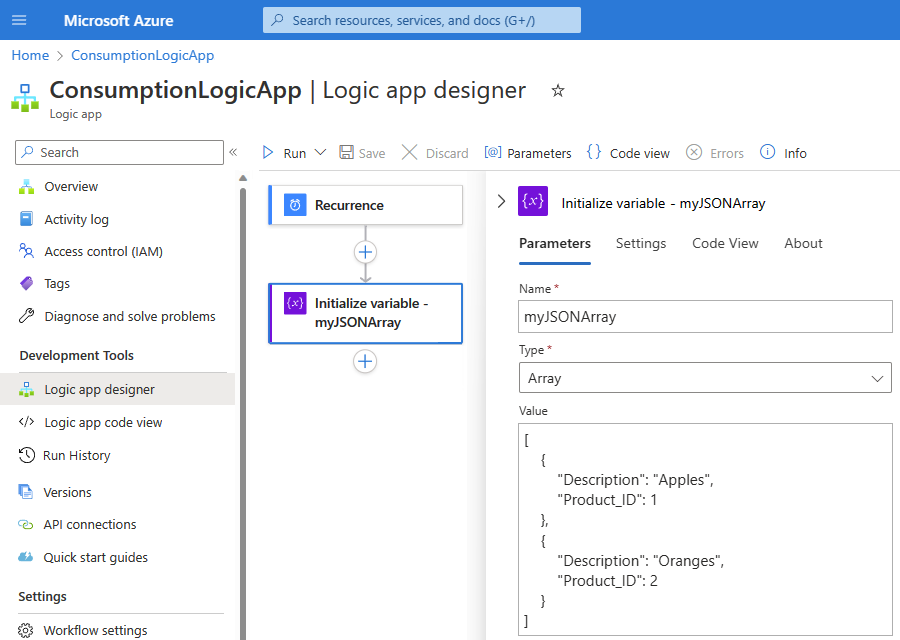
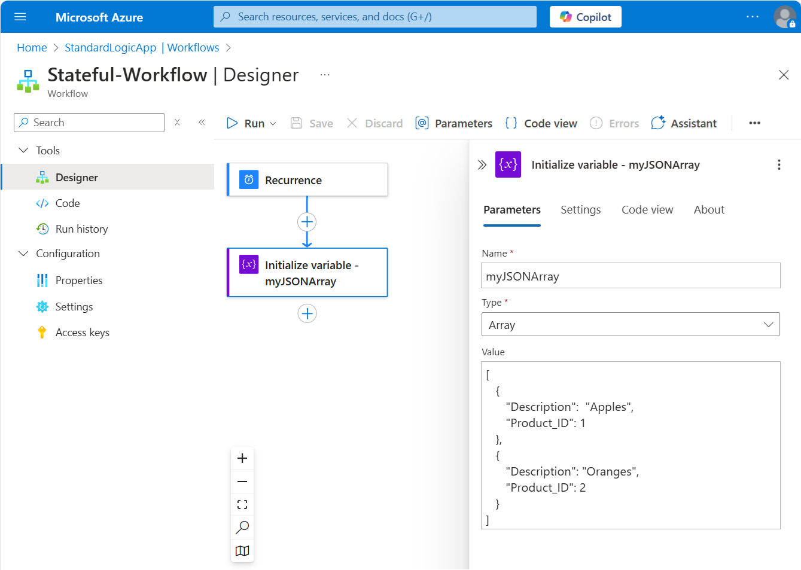
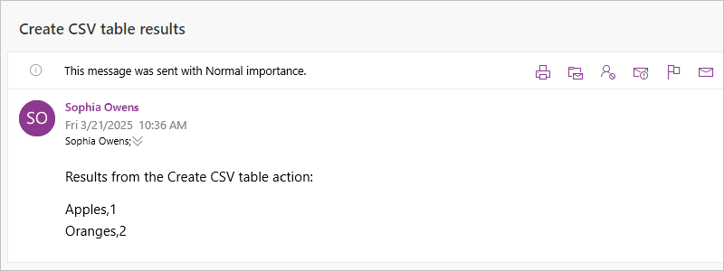
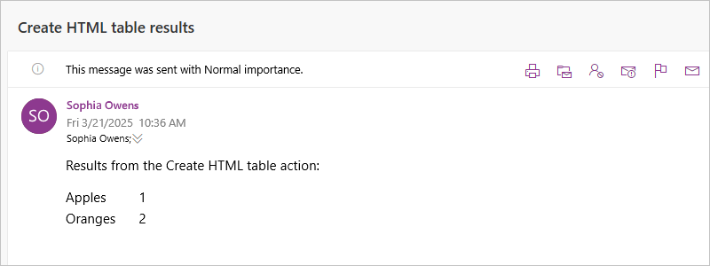

# Perform data operations in Azure Logic Apps

[!INCLUDE [logic-apps-sku-consumption-standard](../../includes/logic-apps-sku-consumption-standard.md)]

This how-to guide shows how you can work with data in your logic app workflow in the following ways:

* Create a string or JavaScript Object Notation (JSON) object from multiple inputs that have different data types. You can then use this string as a single input, rather than repeatedly entering the same inputs.
* Create user-friendly tokens from JavaScript Object Notation (JSON) object properties so that you can easily use those properties in your workflow.
* Create an HTML or CSV table from an array.
* Create an array from another array based on a specified filter or condition.
* Create an array based on the specified properties for all the items in another array.
* Create a string from all the items in an array and separate those items using a specified character.

For other ways to work with data, review the [data manipulation functions](workflow-definition-language-functions-reference.md) that Azure Logic Apps provides.

## Prerequisites

* An Azure account and subscription. If you don't have a subscription, [sign up for a free Azure account](https://azure.microsoft.com/free/?WT.mc_id=A261C142F).

* The logic app workflow where you want to perform the data operation. This workflow must already have a [trigger](logic-apps-overview.md#logic-app-concepts) as the first step in your workflow. Both Consumption and Standard logic app workflows support the data operations described in this guide.

  All data operations are available only as actions. So, before you can use these actions, your workflow must already start with a trigger and include any other actions required to create the outputs that you want to use in the data operation.

## Data operation actions

The following sections summarize the data operations you can use and are organized based on the source data types that the operations work on, but each description appears alphabetically.

### JSON actions

The following actions help you work with data in JavaScript Object Notation (JSON) format.

| Action | Description |
|--------|-------------|
| [**Compose**](#compose-action) | Create a message, or string, from multiple inputs that can have various data types. You can then use this string as a single input, rather than repeatedly entering the same inputs. For example, you can create a single JSON message from various inputs. |
| [**Parse JSON**](#parse-json-action) | Create user-friendly data tokens for properties in JSON content so that you can more easily use the properties in your logic apps. |

To create more complex JSON transformations, see [Perform advanced JSON transformations with Liquid templates](../logic-apps/logic-apps-enterprise-integration-liquid-transform.md).

### Array actions

The following actions help you work with data in arrays.

| Action | Description |
|--------|-------------|
| [**Create CSV table**](#create-csv-table-action) | Create a comma-separated value (CSV) table from an array. |
| [**Create HTML table**](#create-html-table-action) | Create an HTML table from an array. |
| [**Filter array**](#filter-array-action) | Create an array subset from an array based on the specified filter or condition. |
| [**Join**](#join-action) | Create a string from all the items in an array and separate each item with the specified character. |
| [**Select**](#select-action) | Create an array from the specified properties for all the items in a different array. |

<a name="compose-action"></a>

## Compose action

To construct a single output such as a JSON object from multiple inputs, use the action named **Compose**. Your inputs can have various types such as integers, Booleans, arrays, JSON objects, and any other native type that Azure Logic Apps supports, for example, binary and XML. You can then use the output in actions that follow after the **Compose** action. The **Compose** action also helps you avoid repeatedly entering the same inputs while you build your logic app's workflow.

For example, you can construct a JSON message from multiple variables, such as string variables that store people's first names and last names, and an integer variable that stores people's ages. In this example, the **Compose** action accepts the following inputs:

`{ "age": <ageVar>, "fullName": "<lastNameVar>, <firstNameVar>" }`

and creates the following output:

`{"age":35,"fullName":"Owens,Sophia"}`

To try the **Compose** action, follow these steps by using the workflow designer. Or, if you prefer working in the code view editor, you can copy the example **Compose** and **Initialize variable** action definitions from this guide into your own logic app's underlying workflow definition: [Data operation code examples - Compose](../logic-apps/logic-apps-data-operations-code-samples.md#compose-action-example). For more information about the **Compose** action in the underlying JSON workflow definition, see the [Compose action](logic-apps-workflow-actions-triggers.md#compose-action).

### [Consumption](#tab/consumption)

1. In the [Azure portal](https://portal.azure.com), Visual Studio, or Visual Studio Code, open your logic app workflow in the designer.

   This example uses the Azure portal and a sample workflow with the **Recurrence** trigger followed by several **Initialize variable** actions. These actions are set up to create two string variables and an integer variable.

   

1. In your workflow where you want to create the output, follow one of these steps: 

   * To add an action under the last step, select **New step**.

   * To add an action between steps, move your mouse over the connecting arrow so the plus sign (**+**) appears. Select the plus sign, and then select **Add an action**.

1. Under the **Choose an operation** search box, select **Built-in**. In the search box, enter **compose**.

1. From the actions list, select the action named **Compose**.

   

1. In the **Inputs** box, enter the inputs to use for creating the output.

   For this example, select inside the **Inputs** box, which opens the dynamic content list. From that list, select the previously created variables:

   

   The following screenshot shows the finished example **Compose** action: 

   

1. Save your workflow. On the designer toolbar, select **Save**.

### [Standard](#tab/standard)

1. In the [Azure portal](https://portal.azure.com) or Visual Studio Code, open your logic app workflow in the designer.

   This example uses the Azure portal and a sample workflow with the **Recurrence** trigger followed by several **Initialize variable** actions. These actions are set up to create two string variables and an integer variable.

   

1. In your workflow where you want to create the output, follow one of these steps: 

   * To add an action under the last step, select the plus sign (**+**), and then select **Add an action**.

   * To add an action between steps, select the plus sign (**+**) between those steps, and then select **Add an action**.

1. After the connector gallery opens, [follow these general steps to find the **Data Operations** action named **Compose**](create-workflow-with-trigger-or-action.md?tabs=standard#add-an-action-to-run-a-task).

   > [!NOTE]
   >
   > If the connector results box shows the message that **We couldn't find any results for compose**, 
   > you get this result because the connector name is actually **Data Operations**, not **Compose**, 
   > which is the action name.

1. After the action information box opens, in the **Inputs** box, enter the inputs to use for creating the output.

   For this example, select inside the **Inputs** box, and then select the lightning icon, which opens the dynamic content list. From that list, select the previously created variables:

   

   The following screenshot shows the finished example **Compose** action: 

   

1. Save your workflow. On the designer toolbar, select **Save**.

---

### Test your workflow

To confirm whether the **Compose** action creates the expected results, send yourself a notification that includes output from the **Compose** action.

#### [Consumption](#tab/consumption)

1. In your workflow, add an action that can send you the results from the **Compose** action.

   This example continues by using the Office 365 Outlook action named **Send an email**.

1. In this action, for each box where you want the results to appear, select inside each box, which opens the dynamic content list. From that list, under the **Compose** action, select **Outputs**.

   For this example, the result appears in the email's body, so add the **Outputs** field to the **Body** box.

   

1. Save your workflow, and then manually run your workflow. On the designer toolbar, select **Run Trigger** > **Run**.

#### [Standard](#tab/standard)

1. In your workflow, add an action that can send you the results from the **Compose** action.

   This example continues by using the Office 365 Outlook action named **Send an email**.

1. In this action, for each box where you want the results to appear, select inside each box, and then select the lightning icon, which opens the dynamic content list. From that list, under the **Compose** action, select **Outputs**.

   > [!NOTE]
   >
   > If the dynamic content list shows the message that **We can't find any outputs to match this input format**, 
   > select **See more** next to the **Compose** label in the list.
   >
   > 

   For this example, the result appears in the email's body, so add the **Outputs** field to the **Body** box.

   

1. Save your workflow, and then manually run your workflow. On the workflow navigation menu, select **Overview** > **Run Trigger** > **Run**.

---

If you used the Office 365 Outlook action, you get a result similar to the following screenshot:


<a name="create-csv-table-action"></a>

## Create CSV table action

To create a comma-separated value (CSV) table that has the properties and values from JavaScript Object Notation (JSON) objects in an array, use the action named **Create CSV table**. You can then use the resulting table in actions that follow the **Create CSV table** action.

To try the  **Create CSV table** action, follow these steps by using the workflow designer. Or, if you prefer working in the code view editor, you can copy the example **Create CSV table** and **Initialize variable** action definitions from this guide into your own logic app's underlying workflow definition: [Data operation code examples - Create CSV table](logic-apps-data-operations-code-samples.md#create-csv-table-action-example). For more information about the **Create CSV table** action in the underlying JSON workflow definition, see the [Table action](logic-apps-workflow-actions-triggers.md#table-action).

### [Consumption](#tab/consumption)

1. In the [Azure portal](https://portal.azure.com), Visual Studio, or Visual Studio Code, open your logic app workflow in the designer.

   This example uses the Azure portal and a sample workflow with the **Recurrence** trigger followed by an **Initialize variable** action. The action is set up to create a variable where the initial value is an array that has some properties and values in JSON format.

   

1. In your workflow where you want to create the CSV table, follow one of these steps: 

   * To add an action under the last step, select **New step**.

   * To add an action between steps, move your mouse over the connecting arrow so the plus sign (**+**) appears. Select the plus sign, and then select **Add an action**.

1. Under the **Choose an operation** search box, select **Built-in**. In the search box, enter **create csv table**.

1. From the actions list, select the action named **Create CSV table**.

   

1. In the **From** box, enter the array or expression to use for creating the table.

   For this example, select inside the **From** box, which opens the dynamic content list. From that list, select the previously created variable:

   

   > [!NOTE]
   >
   > To create user-friendly tokens for the properties in JSON objects so that you can select 
   > those properties as inputs, use the action named [Parse JSON](#parse-json-action) 
   > before you use the **Create CSV table** action.

   The following screenshot shows the finished example **Create CSV table** action:

   

1. Save your workflow. On the designer toolbar, select **Save**.

### [Standard](#tab/standard)

1. In the [Azure portal](https://portal.azure.com) or Visual Studio Code, open your logic app workflow in the designer.

   This example uses the Azure portal and a sample workflow with the **Recurrence** trigger followed by an **Initialize variable** action. The action is set up to create a variable where the initial value is an array that has some properties and values in JSON format.

   

1. In your workflow where you want to create the output, follow one of these steps:

   * To add an action under the last step, select the plus sign (**+**), and then select **Add an action**.

   * To add an action between steps, select the plus sign (**+**) between those steps, and then select **Add an action**.

1. After the connector gallery opens, [follow these general steps to find the **Data Operations** action named **Create CSV table**](create-workflow-with-trigger-or-action.md?tabs=standard#add-an-action-to-run-a-task).

1. After the action information box appears, in the **From** box, enter the array or expression to use for creating the table.

   For this example, select inside the **From** box, and then select the lightning icon, which opens the dynamic content list. From that list, select the previously created variable:

   

   > [!NOTE]
   >
   > To create user-friendly tokens for the properties in JSON objects so that you can select 
   > those properties as inputs, use the action named [Parse JSON](#parse-json-action) 
   > before you use the **Create CSV table** action.

   The following screenshot shows the finished example **Create CSV table** action:

   

1. Save your workflow. On the designer toolbar, select **Save**.

---

### Customize table format

By default, the **Columns** property is set to automatically create the table columns based on the array items. To specify custom headers and values, follow these steps:

1. If the **Columns** property doesn't appear in the action information box, from the **Add new parameters** list, select **Columns**.

1. Open the **Columns** list, and select **Custom**.

1. In the **Header** property, specify the custom header text to use instead.

1. In the **Value** property, specify the custom value to use instead.

To return values from the array, you can use the [`item()` function](workflow-definition-language-functions-reference.md#item) with the **Create CSV table** action. In a `For_each` loop, you can use the [`items()` function](workflow-definition-language-functions-reference.md#items).

For example, suppose you want table columns that have only the property values and not the property names from an array. To return only these values, follow these steps for working in designer view or in code view.

This example returns the following result:

```text
Apples,1
Oranges,2
```

#### Work in designer view

In the **Create CSV table** action, keep the **Header** column empty. On each row in the **Value** column, dereference each array property that you want. Each row under **Value** returns all the values for the specified array property and becomes a column in your table.

##### [Consumption](#tab/consumption)

1. For each array property that you want, in the **Value** column, select inside the edit box, which opens the dynamic content list.

1. From that list, select **Expression** to open the expression editor instead.

1. In the expression editor, enter the following expression but replace `<array-property-name>` with the array property name for the value that you want.

   Syntax: `item()?['<array-property-name>']`

   Examples:

   * `item()?['Description']`
   * `item()?['Product_ID']`

   

1. Repeat the preceding steps for each array property. When you're done, your action looks similar to the following example:

   

1. To resolve expressions into more descriptive versions, switch to code view and back to designer view, and then reopen the collapsed action:

   The **Create CSV table** action now appears similar to the following example:

   

##### [Standard](#tab/standard)

1. For each array property that you want, in the **Value** column, select inside the edit box, and then select the function icon, which opens the expression editor. Make sure that the **Function** list appears selected.

1. In the expression editor, enter the following expression but replace `<array-property-name>` with the array property name for the value that you want. When you're done with each expression, select **Add**.

   Syntax: `item()?['<array-property-name>']`

   Examples:

   * `item()?['Description']`
   * `item()?['Product_ID']`

   

1. Repeat the preceding steps for each array property. When you're done, your action looks similar to the following example:

   

---

#### Work in code view

In the action's JSON definition, within the `columns` array, set the `header` property to an empty string. For each `value` property, dereference each array property that you want.

1. From the designer, switch to code view.

   * **Consumption**: On the designer toolbar, select **Code view**.
   * **Standard**: On the workflow navigation menu, under **Developer**, select **Code**.

1. In the code editor, find the action's `columns` array. For each column of array values that you want, add an empty `header` property and the following expression for the `value` property:

   Syntax:

   ```json
   {
      "header": "",
      "value": "@item()?['<array-property-name>']"
   }
   ```

   Example:

   ```json
   "Create_CSV_table": {
      "inputs": {
         "columns": [
            { 
               "header": "",
               "value": "@item()?['Description']"
            },
            { 
               "header": "",
               "value": "@item()?['Product_ID']"
            }
         ],
         "format": "CSV",
         "from": "@variables('myJSONArray')"
      }
   }
   ```

1. Switch back to designer view to review the results.

### Test your workflow

To confirm whether the **Create CSV table** action creates the expected results, send yourself a notification that includes output from the **Create CSV table** action.

#### [Consumption](#tab/consumption)

1. In your workflow, add an action that can send you the results from the **Create CSV table** action.

   This example continues by using the Office 365 Outlook action named **Send an email**.

1. In this action, for each box where you want the results to appear, select inside the box, which opens the dynamic content list. Under the **Create CSV table** action, select **Output**.

   

   > [!NOTE]
   >
   > If the dynamic content list shows the message that **We can't find any outputs to match this input format**, 
   > select **See more** next to the **Create CSV table** label in the list.
   >
   > 

1. Save your workflow, and then manually run your workflow. On the designer toolbar, select **Run Trigger** > **Run**.

#### [Standard](#tab/standard)

1. In your workflow, add an action that can send you the results from the **Create CSV table** action.

   This example continues by using the Office 365 Outlook action named **Send an email**.

1. In this action, for each box where you want the results to appear, select inside each box, which opens the dynamic content list. From that list, under the **Create CSV table** action, select **Output**.

   

   > [!NOTE]
   >
   > If the dynamic content list shows the message that **We can't find any outputs to match this input format**, 
   > select **See more** next to the **Create CSV table** label in the list.
   >
   > 

1. Save your workflow, and then manually run your workflow. On the workflow navigation menu, select **Overview** > **Run Trigger** > **Run**.

---

If you used the Office 365 Outlook action, you get a result similar to the following screenshot:



> [!NOTE]
>
> If your table is returned with incorrect formatting, see [how to check your table data formatting](#format-table-data).

<a name="create-html-table-action"></a>

## Create HTML table action

To create an HTML table that has the properties and values from JavaScript Object Notation (JSON) objects in an array, use the **Create HTML table** action. You can then use the resulting table in actions that follow the **Create HTML table** action.

To try the **Create HTML table** action, follow these steps by using the workflow designer. Or, if you prefer working in the code view editor, you can copy the example **Create HTML table** and **Initialize variable** action definitions from this guide into your own logic app's underlying workflow definition: [Data operation code examples - Create HTML table](logic-apps-data-operations-code-samples.md#create-html-table-action-example). For more information about the **Create HTML table** action in the underlying JSON workflow definition, see the [Table action](logic-apps-workflow-actions-triggers.md#table-action).

### [Consumption](#tab/consumption)

1. In the [Azure portal](https://portal.azure.com), Visual Studio, or Visual Studio Code, open your logic app workflow in the designer.

   This example uses the Azure portal and a sample workflow with the **Recurrence** trigger followed by an **Initialize variable** action. The action is set up to create a variable where the initial value is an array that has some properties and values in JSON format.

   

1. In your workflow where you want to create an HTML table, follow one of these steps:

   * To add an action under the last step, select **New step**.

   * To add an action between steps, move your mouse over the connecting arrow so the plus sign (**+**) appears. Select the plus sign, and then select **Add an action**.

1. Under the **Choose an operation** search box, select **Built-in**. In the search box, enter **create html table**.

1. From the actions list, select the action named **Create HTML table**.

   

1. In the **From** box, enter the array or expression to use for creating the table.

   For this example, select inside the **From** box, which opens the dynamic content list. From that list, select the previously created variable:

   

   > [!NOTE]
   >
   > To create user-friendly tokens for the properties in JSON objects so that you can select 
   > those properties as inputs, use the action named [Parse JSON](#parse-json-action) 
   > before you use the **Create HTML table** action.

   The following screenshot shows the finished example **Create HTML table** action:

   

1. Save your workflow. On the designer toolbar, select **Save**.

### [Standard](#tab/standard)

1. In the [Azure portal](https://portal.azure.com) or Visual Studio Code, open your logic app workflow in the designer.

   This example uses the Azure portal and a sample workflow with the **Recurrence** trigger followed by an **Initialize variable** action. The action is set up to create a variable where the initial value is an array that has some properties and values in JSON format.

   

1. In your workflow where you want to create the output, follow one of these steps:

   * To add an action under the last step, select the plus sign (**+**), and then select **Add an action**.

   * To add an action between steps, select the plus sign (**+**) between those steps, and then select **Add an action**.

1. After the connector gallery opens, [follow these general steps to find the **Data Operations** action named **Create HTML table**](create-workflow-with-trigger-or-action.md?tabs=standard#add-an-action-to-run-a-task).

1. After the action information box appears, in the **From** box, enter the array or expression to use for creating the table.

   For this example, select inside the **From** box, and then select the lightning icon, which opens the dynamic content list. From that list, select the previously created variable:

   

   > [!NOTE]
   >
   > To create user-friendly tokens for the properties in JSON objects so that you can select 
   > those properties as inputs, use the action named [Parse JSON](#parse-json-action) 
   > before you use the **Create CSV table** action.

   The following screenshot shows the finished example **Create HTML table** action:

   

1. Save your workflow. On the designer toolbar, select **Save**.

---

### Customize table format

By default, the **Columns** property is set to automatically create the table columns based on the array items. To specify custom headers and values, follow these steps:

1. Open the **Columns** list, and select **Custom**.

1. In the **Header** property, specify the custom header text to use instead.

1. In the **Value** property, specify the custom value to use instead.

To return values from the array, you can use the [`item()` function](workflow-definition-language-functions-reference.md#item) with the **Create HTML table** action. In a `For_each` loop, you can use the [`items()` function](workflow-definition-language-functions-reference.md#items).

For example, suppose you want table columns that have only the property values and not the property names from an array. To return only these values, follow these steps for working in designer view or in code view.

This example returns the following result:

```text
Apples,1
Oranges,2
```

#### Work in designer view

In the **Create HTML table** action, keep the **Header** column empty. On each row in the **Value** column, dereference each array property that you want. Each row under **Value** returns all the values for the specified array property and becomes a column in your table.

##### [Consumption](#tab/consumption)

1. For each array property that you want, in the **Value** column, select inside the edit box, which opens the dynamic content list.

1. From that list, select **Expression** to open the expression editor instead.

1. In the expression editor, enter the following expression, but replace `<array-property-name>` with the array property name for the value that you want, and then select **OK**. For more information, see [**item()** function](workflow-definition-language-functions-reference.md#item).

   Syntax: `item()?['<array-property-name>']`

   Examples:

   * `item()?['Description']`
   * `item()?['Product_ID']`

   

1. Repeat the preceding steps for each array property. When you're done, your action looks similar to the following example:

   

1. To resolve expressions into more descriptive versions, switch to code view and back to designer view, and then reopen the collapsed action:

   The **Create HTML table** action now appears similar to the following example:

   

##### [Standard](#tab/standard)

1. For each array property that you want, in the **Value** column, select inside the edit box, and then select the function icon, which opens the expression editor.

1. In the expression editor, enter the following expression, but replace `<array-property-name>` with the array property name for the value that you want, and then select **Add**. For more information, see [**item()** function](workflow-definition-language-functions-reference.md#item).

   Syntax: `item()?['<array-property-name>']`

   Examples:

      * `item()?['Description']`
      * `item()?['Product_ID']`

   

1. Repeat the preceding steps for each array property. When you're done, your action looks similar to the following example:

   

---

#### Work in code view

In the action's JSON definition, within the `columns` array, set the `header` property to an empty string. For each `value` property, dereference each array property that you want.

1. From the designer, switch to code view.

   * **Consumption**: On the designer toolbar, select **Code view**.
   * **Standard**: On the workflow navigation menu, under **Developer**, select **Code**.

1. In the code editor, find the action's `columns` array. For each column of array values that you want, add an empty `header` property and the following expression for the `value` property:

   Syntax:

   ```json
   {
      "header": "",
      "value": "@item()?['<array-property-name>']"
   }
   ```

   Example:

   ```json
   "Create_HTML_table": {
      "inputs": {
         "columns": [
            { 
               "header": "",
               "value": "@item()?['Description']"
            },
            { 
               "header": "",
               "value": "@item()?['Product_ID']"
            }
         ],
         "format": "HTML",
         "from": "@variables('myJSONArray')"
      }
   }
   ```

1. Switch back to designer view to review the results.

### Test your workflow

To confirm whether the **Create HTML table** action creates the expected results, send yourself a notification that includes output from the **Create HTML table** action.

#### [Consumption](#tab/consumption)

1. In your workflow, add an action that can send you the results from the **Create HTML table** action.

   This example continues by using the Office 365 Outlook action named **Send an email**.

1. In this action, for each box where you want the results to appear, select inside each box, which opens the dynamic content list. From that list, under the **Create HTML table** action, select **Output**.

   

   > [!NOTE]
   >
   > * If the dynamic content list shows the message that **We can't find any outputs to match this input format**, 
   > select **See more** next to the **Create HTML table** label in the list.
   >
   >   
   >
   > * When you include the HTML table output in an email action, make sure that you set the **Is HTML** property 
   > to **Yes** in the email action's advanced options. That way, the email action correctly formats the HTML table. 
   > However, if your table is returned with incorrect formatting, see [how to check your table data formatting](#format-table-data).

1. Save your workflow, and then manually run your workflow. On the designer toolbar, select **Run Trigger** > **Run**.

#### [Standard](#tab/standard)

1. In your workflow, add an action that can send you the results from the **Create HTML table** action.

   This example continues by using the Office 365 Outlook action named **Send an email**.

1. In this action, for each box where you want the results to appear, select inside each box, and then select the lightning icon, which opens the dynamic content list. From that list, under the **Create HTML table** action, select **Output**.

   

   > [!NOTE]
   >
   > If the dynamic content list shows the message that **We can't find any outputs to match this input format**, 
   > select **See more** next to the **Create HTML table** label in the list.
   >
   > 

1. Save your workflow, and then manually run your workflow. On the workflow navigation menu, select **Overview** > **Run Trigger** > **Run**.

---

If you used the Office 365 Outlook action, you get a result similar to the following screenshot:



<a name="filter-array-action"></a>

## Filter array action

To create a subset array from an existing array where the subset items meet specific criteria, use the **Filter array** action. You can then use resulting filtered array in actions that follow the **Filter array** action.

To try the **Filter array** action, follow these steps by using the workflow designer. Or, if you prefer working in the code view editor, you can copy the example **Filter array** and **Initialize variable** action definitions from this guide into your own logic app's underlying workflow definition: [Data operation code examples - Filter array](logic-apps-data-operations-code-samples.md#filter-array-action-example). For more information about the **Filter array** action in the underlying JSON workflow definition, see the [Query action](logic-apps-workflow-actions-triggers.md#query-action).

> [!NOTE]
>
> Any filter text that you use in your condition is case sensitive. Also, this action 
> can't change the format or components of items in the array.
>
> For actions to use the array output from the **Filter array** action, either those 
> actions must accept arrays as input, or you might have to transform the output array 
> into another compatible format.
>
> If you call an HTTP endpoint and receive a JSON response, use the 
> [**Parse JSON** action](#parse-json-action) to process the JSON response. 
> Otherwise, the **Filter array** action can read only the response body 
> and not the structure of the JSON payload.

### [Consumption](#tab/consumption)

1. In the [Azure portal](https://portal.azure.com), Visual Studio, or Visual Studio Code, open your logic app workflow in the designer.

   This example uses the Azure portal and a sample workflow with the **Recurrence** trigger followed by an **Initialize variable** action. The action is set up to create where the initial value is an array that has some sample integer values.

   > [!NOTE]
   >
   > Although this example uses a simple integer array, this action is especially useful for JSON 
   > object arrays where you can filter based on the objects' properties and values.

   

1. In your workflow where you want to create the filtered array, follow one of these steps:

   * To add an action under the last step, select **New step**.

   * To add an action between steps, move your mouse over the connecting arrow so the plus sign (**+**) appears. Select the plus sign, and then select **Add an action**.

1. Under the **Choose an operation** search box, select **Built-in**. In the search box, enter **filter array**.

1. From the actions list, select the action named **Filter array**.

   

1. In the **From** box, enter the array or expression to use as the filter.

   For this example, select the **From** box, which opens the dynamic content list. From that list, select the previously created variable:

   

1. For the condition, specify the array items to compare, select the comparison operator, and specify the comparison value.

   This example uses the [**item()** function](workflow-definition-language-functions-reference.md#item) to access each item in the array, while the **Filter array** action searches for array items where the value is greater than one. The following screenshot shows the finished example **Filter array** action:

   

1. Save your workflow. On the designer toolbar, select **Save**.

### [Standard](#tab/standard)

1. In the [Azure portal](https://portal.azure.com) or Visual Studio Code, open your logic app workflow in the designer.

   This example uses the Azure portal and a sample workflow with the **Recurrence** trigger followed by an **Initialize variable** action. The action is set up to create where the initial value is an array that has some sample integer values.

   > [!NOTE]
   >
   > Although this example uses a simple integer array, this action is especially useful for JSON 
   > object arrays where you can filter based on the objects' properties and values.

   

1. In your workflow where you want to create the filtered array, follow one of these steps:

   * To add an action under the last step, select the plus sign (**+**), and then select **Add an action**.

   * To add an action between steps, select the plus sign (**+**) between those steps, and then select **Add an action**.

1. After the connector gallery opens, [follow these general steps to find the **Data Operations** action named **Filter array**](create-workflow-with-trigger-or-action.md?tabs=standard#add-an-action-to-run-a-task).

1. After the action information box appears, in the **From** box, enter the array or expression to use as the filter.

   For this example, select inside the **From** box, and then select the lightning icon, which opens the dynamic content list. From that list, select the previously created variable:

   

1. For the condition, specify the array items to compare, select the comparison operator, and specify the comparison value.

   This example uses the [**item()** function](workflow-definition-language-functions-reference.md#item) to access each item in the array, while the **Filter array** action searches for array items where the value is greater than one. The following screenshot shows the finished example **Filter array** action:

   

1. Save your workflow. On the designer toolbar, select **Save**.

---

### Test your workflow

To confirm whether **Filter array** action creates the expected results, send yourself a notification that includes output from the **Filter array** action.

#### [Consumption](#tab/consumption)

1. In your workflow, add an action that can send you the results from the **Filter array** action.

   This example continues by using the Office 365 Outlook action named **Send an email**.

1. In this action, complete the following steps:

   1. For each box where you want the results to appear, select inside each box, which opens the dynamic content list.

   1. From that list, select **Expression** to open the expression editor instead.

   1. To get the array output from the **Filter array** action, enter the following expression, which uses the [**actionBody()** function](workflow-definition-language-functions-reference.md#actionBody) with the **Filter array** action name, and then select **OK**.

      `actionBody('Filter_array')`

      

      The resolved expression specifies to show the outputs from the **Filter_array** action in the email body when sent:

      

1. Save your workflow, and then manually run your workflow. On the designer toolbar, select **Run Trigger** > **Run**.

#### [Standard](#tab/standard)

1. In your workflow, add an action that can send you the results from the **Filter array** action.

1. In this action, complete the following steps:

   1. For each box where you want the results to appear, select inside box, and then select the function icon, which opens the expression editor. Make sure that the **Function** list appears selected.

   1. To get the array output from the **Filter array** action, enter the following expression, which uses the [**actionBody()** function](workflow-definition-language-functions-reference.md#actionBody) with the **Filter array** action name, and then select **OK**.

      `actionBody('Filter_array')`

      

      The resolved expression specifies to show the outputs from the **Filter_array** action in the email body when sent:

      

1. Save your workflow, and then manually run your workflow. On the workflow navigation menu, select **Overview** > **Run Trigger** > **Run**.

---

If you used the Office 365 Outlook action, you get a result similar to the following screenshot:


<a name="join-action"></a>

## Join action

To create a string that has all the items from an array and separate those items with a specific delimiter character, use the **Join** action. You can then use the string in actions that follow the **Join** action.

To try the **Join** action, follow these steps by using the workflow designer. Or, if you prefer working in the code view editor, you can copy the example **Join** and **Initialize variable** action definitions from this guide into your own logic app's underlying workflow definition: [Data operation code examples - Join](logic-apps-data-operations-code-samples.md#join-action-example). For more information about the **Join** action in your underlying workflow definition, see the [Join action](logic-apps-workflow-actions-triggers.md#join-action).

### [Consumption](#tab/consumption)

1. In the [Azure portal](https://portal.azure.com), Visual Studio, or Visual Studio Code, open your logic app workflow in the designer.

   This example uses the Azure portal and a sample workflow with the **Recurrence** trigger followed by an **Initialize variable** action. This action is set up to create a variable where the initial value is an array that has some sample integer values.

   

1. In your workflow where you want to create the string from an array, follow one of these steps:

   * To add an action under the last step, select **New step**.

   * To add an action between steps, move your mouse over the connecting arrow so the plus sign (**+**) appears. Select the plus sign, and then select **Add an action**.

1. Under the **Choose an operation** search box, select **Built-in**. In the search box, enter **join**.

1. From the actions list, select the action named **Join**.

   

1. In the **From** box, enter the array that has the items you want to join as a string.

   For this example, select inside the **From** box, which opens the dynamic content list. From that list, select the previously created variable:  

   

1. In the **Join with** box, enter the character to use for separating each array item.

   This example uses a colon (**:**) as the separator.

   

1. Save your workflow. On the designer toolbar, select **Save**.

### [Standard](#tab/standard)

1. In the [Azure portal](https://portal.azure.com) or Visual Studio Code, open your logic app workflow in the designer.

   This example uses the Azure portal and a sample workflow with the **Recurrence** trigger followed by an **Initialize variable** action. The action is set up to create where the initial value is an array that has some sample integer values.

   

1. In your workflow where you want to create the filtered array, follow one of these steps:

   * To add an action under the last step, select the plus sign (**+**), and then select **Add an action**.

   * To add an action between steps, select the plus sign (**+**) between those steps, and then select **Add an action**.

1. After the connector gallery opens, [follow these general steps to find the **Data Operations** action named **Join**](create-workflow-with-trigger-or-action.md?tabs=standard#add-an-action-to-run-a-task).

1. After the action information box appears, in the **From** box, enter the array that has the items you want to join as a string.

   For this example, select inside the **From** box, and then select the lightning icon, which opens the dynamic content list. From that list, select the previously created variable:

   

1. In the **Join with** box, enter the character to use for separating each array item.

   This example uses a colon (**:**) as the separator.

   

1. Save your workflow. On the designer toolbar, select **Save**.

---

### Test your workflow

To confirm whether the **Join** action creates the expected results, send yourself a notification that includes output from the **Join** action.

#### [Consumption](#tab/consumption)

1. In your workflow, add an action that can send you the results from the **Join** action.

   This example continues by using the Office 365 Outlook action named **Send an email**.

1. In this action, for each box where you want the results to appear, select inside each box, which opens the dynamic content list. From that list, under the **Join** action, select **Output**.

   

   > [!NOTE]
   >
   > If the dynamic content list shows the message that **We can't find any outputs to match this input format**, 
   > select **See more** next to the **Join** label in the list.
   >
   > 

1. Save your workflow, and then manually run your workflow. On the designer toolbar, select **Run Trigger** > **Run**.

#### [Standard](#tab/standard)

1. In your workflow, add an action that can send you the results from the **Join** action.

   This example continues by using the Office 365 Outlook action named **Send an email**.

1. In this action, for each box where you want the results to appear, select inside each box, which opens the dynamic content list. From that list, under the **Join** action, select **Output**.

   

   > [!NOTE]
   >
   > If the dynamic content list shows the message that **We can't find any outputs to match this input format**, 
   > select **See more** next to the **Join** label in the list.
   >
   > 

1. Save your workflow, and then manually run your workflow. On the workflow navigation menu, select **Overview** > **Run Trigger** > **Run**.

---

If you used the Office 365 Outlook action, you get a result similar to the following screenshot:


<a name="parse-json-action"></a>

## Parse JSON action

To reference or access properties in JavaScript Object Notation (JSON) content, you can create user-friendly fields or tokens for those properties by using the **Parse JSON** action. That way, you can select those properties from the dynamic content list when you specify inputs for subsequent actions in your workflow. For this action, you can either provide a JSON schema or generate a JSON schema from your sample JSON content or payload.

To try the **Parse JSON** action, follow these steps by using the workflow designer. Or, if you prefer working in the code view editor, you can copy the example **Parse JSON** and **Initialize variable** action definitions from this guide into your own logic app's underlying workflow definition: [Data operation code examples - Parse JSON](logic-apps-data-operations-code-samples.md#parse-json-action-example). 
For more information about this action in your underlying workflow definition, see [Parse JSON action](logic-apps-workflow-actions-triggers.md).

### [Consumption](#tab/consumption)

1. In the [Azure portal](https://portal.azure.com), Visual Studio, or Visual Studio Code, open your logic app workflow in the designer.

   This example uses the Azure portal and a sample workflow with a **Recurrence** trigger followed by an **Initialize variable** action. This action is set up to create a variable whose initial value is the following JSON object with properties and values:

   ```json
   {
       "Member": {
           "Email": "Sophia.Owen@fabrikam.com",
           "FirstName": "Sophia",
           "LastName": "Owen"
       }
   }
   ```

   

1. In your workflow where you want to parse the JSON object, follow one of these steps:

   * To add an action under the last step, select **New step**.
   
   * To add an action between steps, move your mouse over the connecting arrow so the plus sign (**+**) appears. Select the plus sign, and then select **Add an action**.

1. Under the **Choose an operation** search box, select **Built-in**. In the search box, enter **parse json**.

1. From the actions list, select the action named **Parse JSON**.

   

1. In the **Content** box, enter the JSON object that you want to parse.

   For this example, select inside the **Content** box, which opens the dynamic content list. From that list, select the previously created variable:

   

1. In the **Schema** box, enter the JSON schema that describes the JSON object, or *payload*, that you want to parse.

   For this example, use the following schema for the sample JSON object:

   ```json
   {
       "type": "object",
       "properties": {
           "Member": {
               "type": "object",
               "properties": {
                   "Email": {
                       "type": "string"
                   },
                   "FirstName": {
                       "type": "string"
                   },
                   "LastName": {
                       "type": "string"
                   }
               }
           }
       }
   }
   ```

   

   If you don't have a schema, you can generate the schema from the JSON object:

   1. In the **Parse JSON** action, under the **Schema** box, select **Use sample payload to generate schema**.

   1. In the **Enter or paste a sample JSON payload** box, enter the JSON content or object, and then select **Done**, for example:

      ```json
      {
          "Member": {
             "Email": "Sophia.Owen@fabrikam.com",
             "FirstName": "Sophia",
             "LastName": "Owen"
          }
      }
      ```

      

1. Save your workflow. On the designer toolbar, select **Save**.

### [Standard](#tab/standard)

1. In the [Azure portal](https://portal.azure.com) or Visual Studio Code, open your logic app workflow in the designer.

   This example uses the Azure portal and a sample workflow with a **Recurrence** trigger followed by an **Initialize variable** action. This action is set up to create a variable whose initial value is the following JSON object with properties and values:

   ```json
   {
       "Member": {
           "Email": "Sophia.Owen@fabrikam.com",
           "FirstName": "Sophia",
           "LastName": "Owen"
       }
   }
   ```

   

1. In your workflow where you want to parse the JSON object, follow one of these steps:

   * To add an action under the last step, select the plus sign (**+**), and then select **Add an action**.
   
   * To add an action between steps, select the plus sign (**+**) between those steps, and then select **Add an action**.

1. After the connector gallery opens, [follow these general steps to find the **Data Operations** action named **Parse JSON**](create-workflow-with-trigger-or-action.md?tabs=standard#add-an-action-to-run-a-task).

1. After the action information box appears, in the **Content** box, enter the JSON object that you want to parse.

   For this example, select inside the **Content** box, and then select the lightning icon, which opens the dynamic content list. From that list, select the previously created variable:

   

1. In the **Schema** box, enter the JSON schema that describes the JSON object, or *payload*. that you want to parse.

   For this example, use the following schema for the sample JSON object:

   ```json
   {
       "type": "object",
       "properties": {
           "Member": {
               "type": "object",
               "properties": {
                   "Email": {
                       "type": "string"
                   },
                   "FirstName": {
                       "type": "string"
                   },
                   "LastName": {
                       "type": "string"
                   }
               }
           }
       }
   }
   ```

   

   If you don't have a schema, you can generate the schema from the JSON object:

   1. In the **Parse JSON** action, under the **Schema** box, select **Use sample payload to generate schema**.

   1. In the **Enter or paste a sample JSON payload** box, enter the JSON content or object, and then select **Done**, for example:

      ```json
      {
          "Member": {
             "Email": "Sophia.Owen@fabrikam.com",
             "FirstName": "Sophia",
             "LastName": "Owen"
          }
      }
      ```

      

1. Save your workflow. On the designer toolbar, select **Save**.

---

### Test your workflow

To confirm whether the **Parse JSON** action creates the expected results, send yourself a notification that includes output from the **Parse JSON** action.

#### [Consumption](#tab/consumption)

1. In your workflow, add an action that can send you the results from the **Parse JSON** action.

   This example continues by using the Office 365 Outlook action named **Send an email**.

1. In this action, for each edit box where you want the results to appear, select inside each box, which opens the dynamic content list. From that list, under the **Parse JSON** action, you can now select the properties from the parsed JSON object.

   This example selects the following properties: **FirstName**, **LastName**, and **Email**

   

   > [!NOTE]
   >
   > If the dynamic content list shows the message that **We can't find any outputs to match this input format**, 
   > select **See more** next to the **Parse JSON** label in the list.
   >
   > 

   When you're done, the **Send an email** action looks similar to the following example:

   

1. Save your workflow, and then manually run your workflow. On the designer toolbar, select **Run Trigger** > **Run**.

#### [Standard](#tab/standard)

1. In your workflow, add an action that can send you the results from the **Parse JSON** action.

   This example continues by using the Office 365 Outlook action named **Send an email**.

1. In this action, for each box where you want the results to appear, select inside each edit box, which opens the dynamic content list. From that list, under the **Parse JSON** action, you can now select the properties from the parsed JSON object.

   This example selects the following properties: **FirstName**, **LastName**, and **Email**

   

   > [!NOTE]
   >
   > If the dynamic content list shows the message that **We can't find any outputs to match this input format**, 
   > select **See more** next to the **Parse JSON** label in the list.
   >
   > 

   When you're done, the **Send an email** action looks similar to the following example:

   

1. Save your workflow, and then manually run your workflow. On the workflow navigation menu, select **Overview** > **Run Trigger** > **Run**.

---

If you used the Office 365 Outlook action, you get a result similar to the following screenshot:


<a name="select-action"></a>

## Select action

To create an array that contains JSON objects built from the values in an existing array, use the **Select** action. For example, you can create a JSON object for each value in an integer array by specifying the properties that each JSON object must have and mapping the values from the source array to those properties.

Although you can change the component JSON objects, the output array always has the same number of items as the source array. To use the output array from the **Select** action, subsequent actions must either accept arrays as input, or you might have to transform the output array into another compatible format.

To try the **Select** action, follow these steps by using the workflow designer. Or, if you prefer working in the code view editor, you can copy the example **Select** and **Initialize variable** action definitions from this guide into your own logic app's underlying workflow definition: [Data operation code examples - Select](../logic-apps/logic-apps-data-operations-code-samples.md#select-action-example). For more information about this action in your underlying workflow definition, see [Select action](logic-apps-workflow-actions-triggers.md#select-action).

### [Consumption](#tab/consumption)

1. In the [Azure portal](https://portal.azure.com), Visual Studio, or Visual Studio Code, open your logic app workflow in the designer.

   This example uses the Azure portal and a sample workflow with the **Recurrence** trigger followed by an **Initialize variable** action. The action is set up for create a variable where the initial value is an array that has some sample integers.

   

1. In your workflow where you want to create the JSON object array, follow one of these steps: 

   * To add an action under the last step, select **New step**.

   * To add an action between steps, move your mouse over the connecting arrow so the plus sign (**+**) appears. Select the plus sign, and then select **Add an action**.

1. Under the **Choose an operation** search box, select **Built-in**. In the search box, enter **select**.

1. From the actions list, select the action named **Select**.

   

1. In the **From** box, enter the source array that you want to use.

   For this example, select inside the **From** box, which opens the dynamic content list. From that list, select the previously created variable:

   

1. For the **Map** property, in the left column, enter a property name to describe all the values in the source array.

   This example uses **Product_ID** as the property name for the integer values in the source array. So, each value, for example, **1**, **2**, **3**, and **4**, is a product ID.

1. In the right column, enter an expression that specifies the value in the source array for the property name in the left column.

   This example uses the [**item()** function](workflow-definition-language-functions-reference.md#item) to iterate through and access each item in the array.

   1. Select inside the right column, which opens the dynamic content list.

   1. From that list, select **Expression** to open the expression editor instead.

   1. In the expression editor, enter the function named **item()**, and then select **OK**.

   

   The **Select** action now appears similar to the following example:

   

1. Save your workflow. On the designer toolbar, select **Save**.

### [Standard](#tab/standard)

1. In the [Azure portal](https://portal.azure.com) or Visual Studio Code, open your logic app workflow in the designer.

   This example uses the Azure portal and a sample workflow with the **Recurrence** trigger followed by an **Initialize variable** action. The action is set up for create a variable where the initial value is an array that has some sample integers.

   

1. In your workflow where you want to create the JSON object array, follow one of these steps: 

   * To add an action under the last step, select the plus sign (**+**), and then select **Add an action**.

   * To add an action between steps, select the plus sign (**+**) between those steps, and then select **Add an action**.

1. After the connector gallery opens, [follow these general steps to find the **Data Operations** action named **Select**](create-workflow-with-trigger-or-action.md?tabs=standard#add-an-action-to-run-a-task).

1. After the action information box appears, in the **From** box, enter the source array that you want to use.

   For this example, select inside the **From** box, and then select the lightning icon, which opens the dynamic content list. From that list, select the previously created variable:

   

1. For the **Map** property, in the left column, enter a property name to describe all the values in the source array.

   This example uses **Product_ID** as the property name for the integer values in the source array. So, each value, for example, **1**, **2**, **3**, and **4**, is a product ID.

1. In the right column, enter an expression that specifies the value in the source array for the property name in the left column.

   This example uses the [`item()` function](workflow-definition-language-functions-reference.md#item) to iterate through and access each item in the array.

   1. Select inside the right column, and then select the function icon, which opens the expression editor. Make sure that the **Function** list appears selected.

   1. In the expression editor, enter the function named **item()**, and then select **Add**.

   

   The **Select** action now appears similar to the following example:

   

1. Save your workflow. On the designer toolbar, select **Save**.

---

### Test your workflow

To confirm whether the **Select** action creates the expected results, send yourself a notification that includes output from the **Select** action.

#### [Consumption](#tab/consumption)

1. In your workflow, add an action that can send you the results from the **Select** action.

   This example continues by using the Office 365 Outlook action named **Send an email**.

1. In this action, complete the following steps:

   1. For each box where you want the results to appear, select inside each box, which opens the dynamic content list.

   1. From that list, select **Expression** to open the expression editor instead.

   1. To get the array output from the **Select** action, enter the following expression, which uses the [**actionBody()** function](workflow-definition-language-functions-reference.md#actionBody) with the **Select** action name, and select **OK**:

      `actionBody('Select')`

      

      The resolved expression specifies to show the outputs from the **Select** action in the email body when sent:

      

   When you're done, the **Send an email** action looks similar to the following example:

1. Save your workflow, and then manually run your workflow. On the designer toolbar, select **Run Trigger** > **Run**.

#### [Standard](#tab/standard)

1. In your workflow, add an action that can send you the results from the **Select** action.

1. In this action, complete the following steps:

   1. For each box where you want the results to appear, select inside each box, and then select the function icon, which opens the expression editor. Make sure that the **Function** list appears selected.

   1. To get the array output from the **Select** action, enter the following expression, which uses the [**actionBody()** function](workflow-definition-language-functions-reference.md#actionBody) with the **Select** action name, and select **OK**:

      `actionBody('Select')`

      

      The resolved expression specifies to show the outputs from the **Filter_array** action in the email body when sent:

      

1. Save your workflow, and then manually run your workflow. On the workflow navigation menu, select **Overview** > **Run Trigger** > **Run**.

---

If you used the Office 365 Outlook action, you get a result similar to the following screenshot:


## Troubleshooting

### Format table data

If your [CSV table](#create-csv-table-action) or [HTML table](#create-html-table-action) is returned with incorrect formatting, make sure your input data has line breaks between rows. 

Incorrect formatting:

```text
Fruit,Number Apples,1 Oranges,2
```

Correct formatting:

```text
Fruit,Number
Apples,1
Oranges,2
```

To add line breaks between rows, add one of the following expressions to your table:

```text
replace(body('Create_CSV_table'),'','<br/>')
```

```text
replace(body('Create_HTML_table'),'','<br/>')
```

For example: 

```json
{
	"Send_an_email_": {
		"inputs": {
			"body": {
				"Body": "<p>Results from Create CSV table action:<br/>\n<br/>\n<br/>\n@{replace(body('Create_CSV_table'),'\r\n','<br/>')}</p>",
				"Subject": "Create CSV table results",
				"To": "sophia.owen@fabrikam.com"
			}
		}
	}
}
```
## Next steps

* [Managed connectors for Azure Logic Apps](../connectors/managed.md)
* [Built-in connectors for Azure Logic Apps](../connectors/built-in.md)
