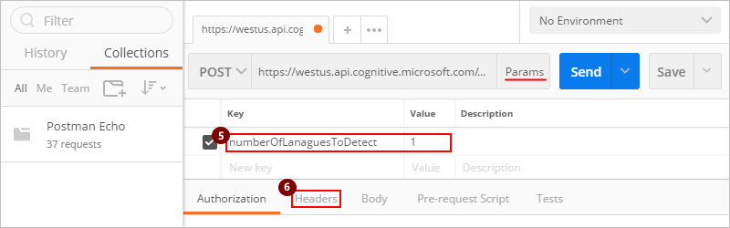

# Describe custom connectors with Postman for logic apps

[Postman](https://www.getpostman.com/) makes API development faster and easier. 
This tutorial shows how to create a [Postman collection](https://www.getpostman.com/docs/postman/collections/creating_collections) 
by using the Azure Cognitive Services [Text Analytics API](https://azure.microsoft.com/services/cognitive-services/text-analytics/) as an example. 
This API identifies the language, sentiment, and key phrases in text that you pass 
to the API. You can then use your Postman collection to easily create 
[custom connectors](../logic-apps/logic-apps-register-custom-api-connector.md) 
for Azure Logic Apps.

## Prerequisites

* If you're new to Postman, 
[install the Postman app](https://www.getpostman.com/apps).

* An Azure subscription. If you don't have a subscription, 
you can start with a [free Azure account](https://azure.microsoft.com/free/). 
Otherwise, sign up for a [Pay-As-You-Go subscription](https://azure.microsoft.com/pricing/purchase-options/).

* If you have an Azure subscription, sign up for the Text Analytics APIs by following the 
[Task 1 steps here](../cognitive-services/text-analytics/quick-start.md). 

## Create a Postman collection

Postman collections help you organize and group related API requests. 
Before you can create a collection, create an HTTP request for your API. 
For this tutorial, the example uses the [Detect Language API](https://westus.dev.cognitive.microsoft.com/docs/services/TextAnalytics.V2.0/operations/56f30ceeeda5650db055a3c7).

### Create an HTTP request for your API

1. Open the Postman app so that you can create an [HTTP request](https://www.getpostman.com/docs/postman/sending_api_requests/requests) 
for your API endpoint. For more information, see the Postman's [Requests documentation](https://www.getpostman.com/docs/postman/sending_api_requests/requests).

   1. On the **Builder** tab, select the HTTP method, 
   enter the request URL for your API endpoint, 
   and select an authorization protocol, if any. 
   When you're ready, choose **Params**.

      For this tutorial, you can use these settings in this example:

      

      |Parameter|Suggested value| 
      |:--------|:----| 
      |**HTTP method**|POST| 
      |**Request URL**| https://westus.api.cognitive.microsoft.com/text/analytics/v2.0/languages| | 
      |**Authorization**|"No Auth"| | 
      ||| 

   2. Now you can enter key-value pairs to use as query or path parameters 
   in the request URL. Postman combines these items together into a query string.
   When you're done, choose **Headers**.

      

      |Parameter|Suggested value| 
      |:--------|:----| 
      |**Params**|**Key**: "numberOfLanguagesToDetect" </br>**Value**: "1"| 
      ||| 

   3. Enter key-value pairs for the request header. 
   For the header name, enter any string you want. For common HTTP headers, 
   you can select from the dropdown list. When you're done, choose **Body**. 
   
      

      |Parameter|Value| 
      |:--------|:----|    
      |**Headers**|**Key**: "Ocp-Apim-Subscription-Key", **Value**: *your-API-subscription-key*, which you can find in your Cognitive Services account </br>**Key**: "Content-Type", **Value**: "application/json"| 
      ||| 

   4. Enter content that you want to send in the request body. 
   To check that the request works by getting a response back, choose **Send**. 
   
      

      |Parameter|Value| 
      |:--------|:----|    
      |**Body**|```{"documents": [{ "id": "1", "text": "Hello World"}]}```| | 
      ||| 

      The response field contains the full response from the API, 
      including the result or an error, if any occurred.

      

2. After you've checked that your request works, 
save your request to a Postman collection. 

   1. Under **Save Request**, provide a **Request Name** 
   and optionally, a **Request description**. 

      > [!NOTE]
      > Your custom connector uses these values later. 
      > So, make sure that you provide the same values that 
      > you later use for your custom API's operation summary and description.

   2. Choose **+ Create Collection** and provide a collection name. 
   Choose the check mark, which creates a collection folder, 
   then choose **Save to *your-Postman-collection-name***.

      

### Save the request response

After you've saved your request, you can save the response. 
That way, the response appears as an example when you load the request later.

1. Above the response window, choose **Save Response**. 

   

   Custom connectors support only one response per request. 
   If you save multiple responses per request, only the first one is used.

2. Provide a name for your example, and choose **Save Example**.

3. Continue building your Postman collection with any additional requests and responses.

### Export your Postman collection

1. When you're done, export your collection to a JSON file.

   

2. Choose the **Collection v1** export format, 
and browse to the locatio where you want to save the JSON file.

   
   
You can now use this Postman collection for creating a custom connector in Logic Apps. 
After you export the collection, import the JSON file. **APPLIES TO LOGIC APPS?**

> [!IMPORTANT]
> **DOES THIS APPLY TO LOGIC APPS??**
> When you create a custom connector from a Postman collection, 
> make sure that you remove the `Content-type` header from actions and triggers. 
> Logic Apps automatically adds this header. Also, you should define authentication headers, 
> such as `Ocp-Apim-Subscription-Key` in the **Security** section **FLOW ONLY? - WHAT SECURITY SECTION?**,
> and remove them from actions and triggers.

For more information, see [Register and use custom APIs (connectors) in Logic Apps](../logic-apps/logic-apps-register-custom-api-connector.md).

## Next steps


