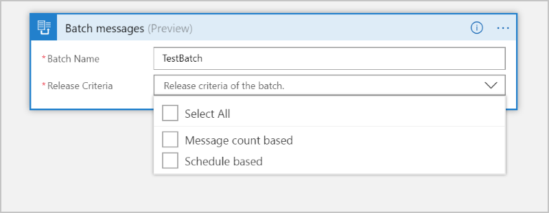
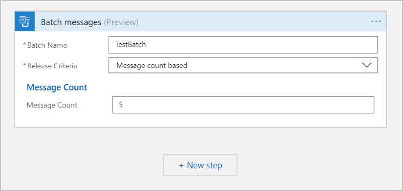

---
title: Batch process EDI messages as a group or collection - Azure Logic Apps | Microsoft Docs
description: Send EDI messages for batch processing in logic apps
keywords: batch, batch process, batch encode
author: divswa
manager: jeconnoc
editor: ''
services: logic-apps
documentationcenter: ''

ms.assetid: 
ms.service: logic-apps
ms.workload: na
ms.tgt_pltfrm: na
ms.devlang: na
ms.topic: article
ms.date: 09/21/2017
ms.author: LADocs; estfan; divswa
---

# Send X12 messages in batch to trading partners

In business to business (B2B) scenarios, partners often exchange messages in groups or batches. To send messages in groups or batches to trading partners, you can create a batch with multiple items and then use the X12 batch action to process those items as a batch.

Batching for X12 messages, like other messages, uses a batch trigger and action. Also for X12, the batch goes through an X12 Encode step before going to the partner or any other destination. For more information about the batch trigger and action, see [Batch process messages](logic-apps-batch-process-send-receive-messages.md).

This topic shows you how you can process X12 messages as a batch by performing these tasks:
* [Create a logic app that receives items and creates a batch](#receiver). This "receiver" logic app performs these actions:
 
   * Specifies the batch name and release criteria to meet before releasing the items as a batch.

   * Processes or encodes the items in the batch using the specified X12 agreement or partner identities.

* [Create a logic app that sends items to a batch](#sender). This "sender" logic app specifies where to send items for batching, which must be an existing receiver logic app.

## Prerequisites

To follow this example, you need these items:

* An Azure subscription. If you don't have a subscription, you can 
[start with a free Azure account](https://azure.microsoft.com/free/). 
Otherwise, you can [sign up for a Pay-As-You-Go subscription](https://azure.microsoft.com/pricing/purchase-options/).

* An [integration account](logic-apps-enterprise-integration-create-integration-account.md) that's already defined and associated with your Azure subscription

* At least two [partners](logic-apps-enterprise-integration-partners.md) that you've defined in your integration account. Make sure that each partner uses the X12 (Standard Carrier Alpha Code) qualifier in the partner's properties as a business identity.

* An [X12 agreement](logic-apps-enterprise-integration-x12.md) that's already defined in your integration account

## Create a logic app that receives X12 messages and creates a batch

Before you can send messages to a batch, you must first create a "receiver" logic app with the **Batch** trigger. 
That way, you can select this receiver logic app when you create the sender logic app. 
For the receiver, you specify the batch name, release criteria, X12 agreement, and other settings. 

1. In the [Azure portal](https://portal.azure.com), create a logic app with this name: "BatchX12Messages".

1. In Logic Apps Designer, add the **Batch** trigger, which starts your logic app workflow. In the search box, enter "batch" as your filter. 
Select this trigger: **Batch – Batch messages**

   

1. Provide a name for the batch, 
and specify criteria for releasing the batch, for example:

   * **Batch Name**: The name used to identify the batch, which is "TestBatch" in this example.

   * **Release Criteria**: The batch release criteria, which can be based on the message count, schedule, or both.
   
     

   * **Message Count**: The number of messages to hold as a batch 
   before releasing for processing, which is "5" in this example.

     

   * **Schedule**: The batch release schedule for processing, which is "every 10 minutes" in this example.

     

1. Add another action that encodes the grouped or batches messages, and creates an X12 batched message. 

   a. Choose **+ New step** > **Add an action**.

   b. In the search box, enter "X12 batch" as your filter and select an action for **X12 - Batch Encode**. Like the X12 Encode connector, there's multiple variations for batch encoding action. You can select either of them.

   
   
1. Set the properties for the action you just added.

   * In the **Name of X12 agreement** box, select the agreement from the drop-down list. If your list is empty, make sure that you created a connection to your integration account.

   * In the **BatchName** box, select the **Batch Name** field from the dynamic content list.
   
   * In the **PartitionName** box, select the **Partition Name** field from the dynamic content list.

   * In the **Items** box, select the **Batched Items** from the dynamic content list.

   

1. For testing purposes, add an HTTP action for sending the batched message to [Request Bin service](https://requestbin.fullcontact.com/). 

   1. Enter "HTTP" as your filter in the search box. Select this action: **HTTP - HTTP**
    
      

   1. From the **Method** list, select **POST**. For the **Uri** box, generate a URI for your request bin and enter that URI. In the 
   **Body** box, when the dynamic list opens, select the **Body** field under the **Batch encode by agreement name** section. If you don't see **Body**, choose **See more** next to **Batch encode by agreement name**.

      

1.  Now that you created a receiver logic app, save your logic app.

    

    > [!IMPORTANT]
    > A partition has a limit of 5,000 messages or 80 MB. 
    > If either condition is met, the batch might be released, 
    > even when the user-defined condition is not met.

## Create a logic app that sends X12 messages to a batch

Now create one or more logic apps that send items to the 
batch defined by the receiver logic app. For the sender, 
you specify the receiver logic app and batch name, message content, 
and any other settings. You can optionally provide a unique partition
key to divide the batch into subsets to collect items with that key.

Sender logic apps need to know where to send items, while receiver logic apps don't need to know anything about the senders.

1. Create another logic app with this name: "X12MessageSender". Add this trigger to your logic app: **Request / Response - Request** 
   
   

1. Add a new step for sending messages to a batch.

   1. Choose **+ New step** > **Add an action**.

   1. In the search box, enter "batch" as your filter. 

1. Select this action: **Send messages to batch – Choose a Logic Apps workflow with batch trigger**

   

1. Now select your "BatchX12Messages" logic app that you previously created, which now appears as an action.

   

   > [!NOTE]
   > The list also shows any other logic apps that have batch triggers.

1. Set the batch properties.

   * **Batch Name**: The batch name defined by the receiver logic app, 
   which is "TestBatch" in this example and is validated at runtime.

     > [!IMPORTANT]
     > Make sure that you don't change the batch name, 
     > which must match the batch name that's specified by the receiver logic app.
     > Changing the batch name causes the sender logic app to fail.

   * **Message Content**: The message content that you want to send to the batch
   
   

1. Save your logic app. Your sender logic app now looks similar to this example:

   

## Test your logic apps

To test your batching solution, 
post X12 messages to your sender logic app from [Postman](https://www.getpostman.com/postman) or similar tool. 
Soon, you should start getting X12 messages, either as a batch of five items or every 10 minutes, in your request bin - 
all with the same partition key.

## Next steps

* [Process messages as batches](logic-apps-batch-process-send-receive-messages.md) 
* [Build a serverless app in Visual Studio with Azure Logic Apps and Functions](../logic-apps/logic-apps-serverless-get-started-vs.md)
* [Exception handling and error logging for logic apps](../logic-apps/logic-apps-scenario-error-and-exception-handling.md)
