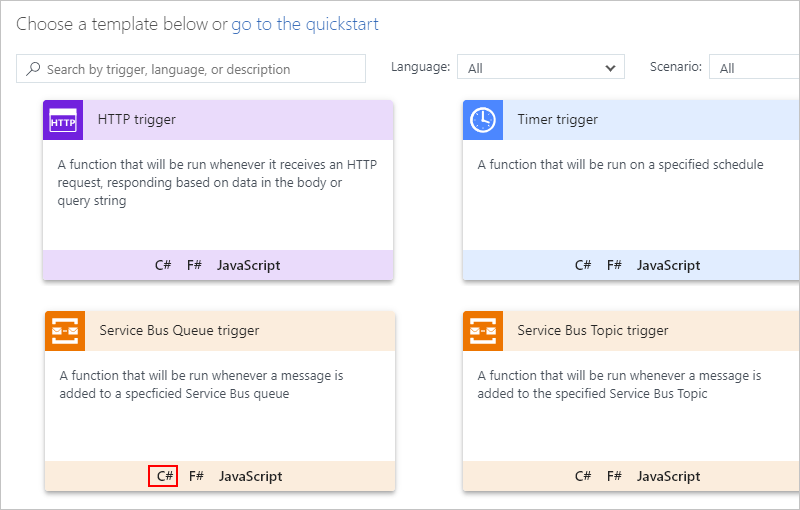

# Scenario: Trigger logic apps with Azure Functions and Azure Service Bus

You can use Azure Functions to create a trigger for a logic app 
when you need to deploy a long-running listener or task. For example, 
you can create a function that listens in on a queue and then 
immediately fire a logic app as a push trigger.

## Prerequisites

* An Azure subscription. If you don't have an Azure subscription, 
<a href="https://azure.microsoft.com/free/" target="_blank">sign up for a free Azure account</a>. 

* Basic knowledge about [how to create logic apps](../logic-apps/quickstart-create-first-logic-app-workflow.md) 

* Before you can create an Azure function, 
[create a function app](../azure-functions/functions-create-function-app-portal.md).

## Create logic app

In this example, you have a function running for 
each logic app that needs to be triggered. 
First, create a logic app that has an HTTP request trigger. 
The function calls that endpoint whenever a queue message is received.  

1. Sign in to the [Azure portal](https://portal.azure.com), 
and create blank logic app. 

   If you're new to logic apps, review 
   [Quickstart: Create your first logic app](../logic-apps/quickstart-create-first-logic-app-workflow.md).

1. In the search box, enter "http request". 
Under the triggers list, select this trigger: 
**When a HTTP request is received**

   

1. For the **Request** trigger, you can optionally 
enter a JSON schema for use with the queue message. 
JSON schemas help the Logic App Designer understand 
the structure of the input data and makes outputs 
easier for you to select throughout the workflow. 

   To specify a schema, enter the schema in the 
   **Request Body JSON Schema** box, for example: 

   

   If you don't have a schema, but you have a sample payload in JSON format, 
   you can generate a schema from that payload.

   1. In the Request trigger, choose 
   **Use sample payload to generate schema**.

   1. Under **Enter or paste a sample JSON payload**, 
   enter your sample payload, and then choose **Done**.
      
      

   This sample payload generates this schema that appears in the trigger:

   ```json
   {
      "type": "object",
      "properties": {
         "address": {
            "type": "object",
            "properties": {
               "number": {
                  "type": "integer"
               },
               "street": {
                  "type": "string"
               },
               "city": {
                  "type": "string"
               },
               "postalCode": {
                  "type": "integer"
               },
               "country": {
                  "type": "string"
               }
            }
         }
      }
   }
   ```

1. Add any other actions you want to happen after receiving the queue message. 

   For example, you can send an email with the Office 365 Outlook connector.

1. Save your logic app, which generates the 
callback URL for the trigger in this logic app. 
This URL appears in the **HTTP POST URL** property.

   

## Create Azure function

Next, create the function that acts as the trigger and listens to the queue. 

1. In the Azure portal, open and expand your function app, if not already open. 

1. Under your function app name, expand **Functions**. 
On the **Functions** pane, choose **New function**. 
Select this template: **Service Bus Queue trigger - C#**
   
   

1. Provide a name for your trigger, and then configure the 
connection to the Service Bus queue, which uses the Azure 
Service Bus SDK `OnMessageReceive()` listener.

1. Write a basic function to call the previously created logic app endpoint by using the queue message as a trigger, for example: 
   
   ```CSharp
   using System;
   using System.Threading.Tasks;
   using System.Net.Http;
   using System.Text;
   
   private static string logicAppUri = @"https://prod-05.westus.logic.azure.com:443/.........";
   
   public static void Run(string myQueueItem, TraceWriter log)
   {
       log.Info($"C# ServiceBus queue trigger function processed message: {myQueueItem}");

       using (var client = new HttpClient())
       {
           var response = client.PostAsync(logicAppUri, new StringContent(myQueueItem, Encoding.UTF8, "application/json")).Result;
       }
   }
   ```

   This example uses the `application/json` message content type, 
   but you can change this type as necessary.

1. To test the function, add a queue message by using a tool such as the [Service Bus Explorer](https://github.com/paolosalvatori/ServiceBusExplorer). 

   The logic app triggers immediately after the 
   function receives the message.

## Get support

* For questions, visit the [Azure Logic Apps forum](https://social.msdn.microsoft.com/Forums/en-US/home?forum=azurelogicapps).
* To submit or vote on feature ideas, visit the [Logic Apps user feedback site](http://aka.ms/logicapps-wish).

