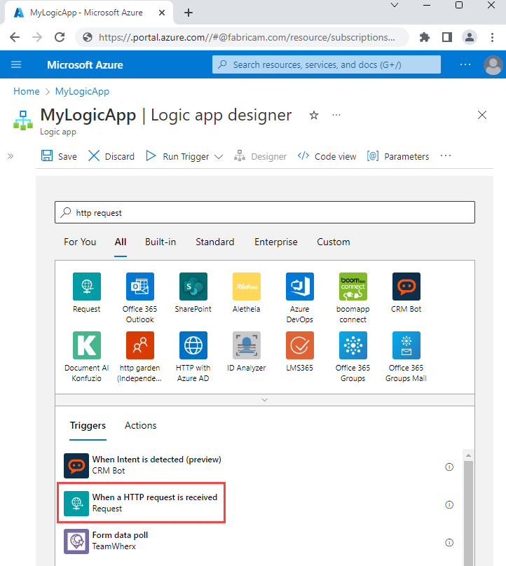
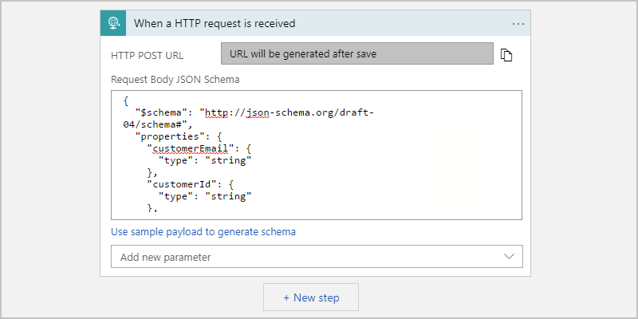
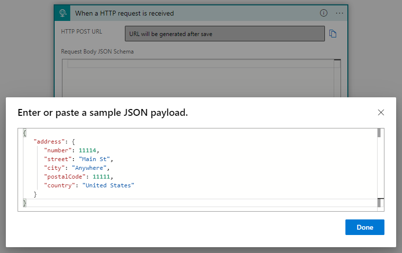
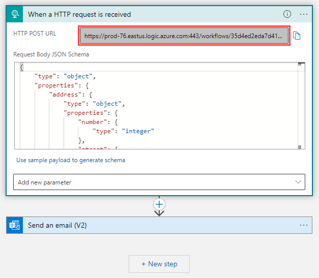
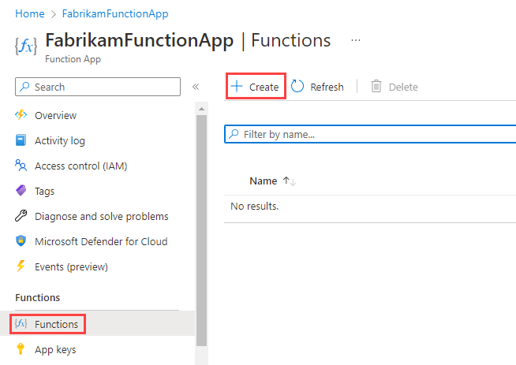
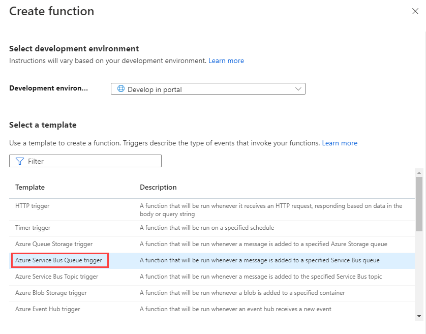
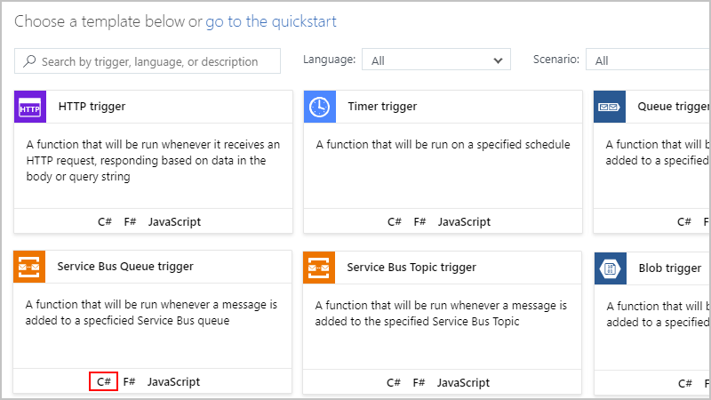

# Call or trigger logic apps by using Azure Functions and Azure Service Bus

You can use [Azure Functions](../azure-functions/functions-overview.md) to trigger a logic app when you need to deploy a long-running listener or task. For example, you can create an Azure function that listens in on an [Azure Service Bus](../service-bus-messaging/service-bus-messaging-overview.md) queue and immediately fires a logic app as a push trigger.

## Prerequisites

* An Azure subscription. If you don't have an Azure subscription, [sign up for a free Azure account](https://azure.microsoft.com/free/).

* An Azure Service Bus namespace. If you don't have a namespace, [create your namespace first](../service-bus-messaging/service-bus-create-namespace-portal.md).

* An Azure function app, which is a container for Azure functions. If you don't have a function app, [create your function app first](../azure-functions/functions-create-first-azure-function.md), and make sure that you select .NET as the runtime stack.

* Basic knowledge about [how to create logic apps](../logic-apps/quickstart-create-first-logic-app-workflow.md)

## Create logic app

For this scenario, you have a function running each logic app that you want to trigger. First, create a logic app that starts with an HTTP request trigger. The function calls that endpoint whenever a queue message is received.

1. Sign in to the [Azure portal](https://portal.azure.com), and create blank logic app.

   If you're new to logic apps, review [Quickstart: Create your first logic app](../logic-apps/quickstart-create-first-logic-app-workflow.md).

1. In the search box, enter `http request`. From the triggers list, select the **When a HTTP request is received** trigger.

   

   With the Request trigger, you can optionally enter a JSON schema to use with the queue message. JSON schemas help the Logic App Designer understand the structure for the input data, and make the outputs easier for you to use in your workflow.

1. To specify a schema, enter the schema in the **Request Body JSON Schema** box, for example:

   

   If you don't have a schema, but you have a sample payload in JSON format, you can generate a schema from that payload.

   1. In the Request trigger, select **Use sample payload to generate schema**.

   1. Under **Enter or paste a sample JSON payload**, enter your sample payload, and then select **Done**.

      

   This sample payload generates this schema that appears in the trigger:

   ```json
   {
      "type": "object",
      "properties": {
         "address": {
            "type": "object",
            "properties": {
               "number": {
                  "type": "integer"
               },
               "street": {
                  "type": "string"
               },
               "city": {
                  "type": "string"
               },
               "postalCode": {
                  "type": "integer"
               },
               "country": {
                  "type": "string"
               }
            }
         }
      }
   }
   ```

1. Add any other actions that you want to run after receiving the queue message.

   For example, you can send an email with the Office 365 Outlook connector.

1. Save your logic app, which generates the callback URL for the trigger in this logic app. Later, you use this callback URL in the code for the Azure Service Bus Queue trigger.

   The callback URL appears in the **HTTP POST URL** property.

   

## Create Azure function

Next, create the function that acts as the trigger and listens to the queue.

1. In the Azure portal, open and expand your function app, if not already open. 

1. Under your function app name, expand **Functions**. On the **Functions** pane, select **New function**.

   

1. Select this template based on whether you created a new function app where you selected .NET as the runtime stack, or you're using an existing function app.

   * For new function apps, select this template: **Service Bus Queue trigger**

     

   * For an existing function app, select this template: **Service Bus Queue trigger - C#**

     

1. On the **Azure Service Bus Queue trigger** pane, provide a name for your trigger, and set up the **Service Bus connection** for the queue, which uses the Azure Service Bus SDK `OnMessageReceive()` listener, and select **Create**.

1. Write a basic function to call the previously created logic app endpoint by using the queue message as a trigger. Before you write your function, review these considerations:

   * This example uses the `application/json` message content type, but you can change this type as necessary.
   
   * Due to possible concurrently running functions, high volumes, or heavy loads, avoid instantiating the [HTTPClient class](https://docs.microsoft.com/dotnet/api/system.net.http.httpclient) with the `using` statement and directly creating HTTPClient instances per request. For more information, see [Use HttpClientFactory to implement resilient HTTP requests](https://docs.microsoft.com/dotnet/architecture/microservices/implement-resilient-applications/use-httpclientfactory-to-implement-resilient-http-requests#issues-with-the-original-httpclient-class-available-in-net-core).
   
   * If possible, reuse the instance of HTTP clients. For more information, see [Manage connections in Azure Functions](../azure-functions/manage-connections.md).

   This example uses the [`Task.Run` method](https://docs.microsoft.com/dotnet/api/system.threading.tasks.task.run) in [asynchronous](https://docs.microsoft.com/dotnet/csharp/language-reference/keywords/async) mode. For more information, see [Asynchronous programming with async and await](https://docs.microsoft.com/dotnet/csharp/programming-guide/concepts/async/).

   ```csharp
   using System;
   using System.Threading.Tasks;
   using System.Net.Http;
   using System.Text;

   // Can also fetch from App Settings or environment variable
   private static string logicAppUri = @"https://prod-05.westus.logic.azure.com:443/workflows/<remaining-callback-URL>";

   // Reuse the instance of HTTP clients if possible: https://docs.microsoft.com/azure/azure-functions/manage-connections
   private static HttpClient httpClient = new HttpClient();

   public static async Task Run(string myQueueItem, TraceWriter log) 
   {
      log.Info($"C# ServiceBus queue trigger function processed message: {myQueueItem}");
      var response = await httpClient.PostAsync(logicAppUri, new StringContent(myQueueItem, Encoding.UTF8, "application/json")); 
   }
   ```

1. To test the function, add a queue message by using a tool such as the [Service Bus Explorer](https://github.com/paolosalvatori/ServiceBusExplorer).

   The logic app triggers immediately after the function receives the message.

## Next steps

* [Call, trigger, or nest workflows by using HTTP endpoints](../logic-apps/logic-apps-http-endpoint.md)
