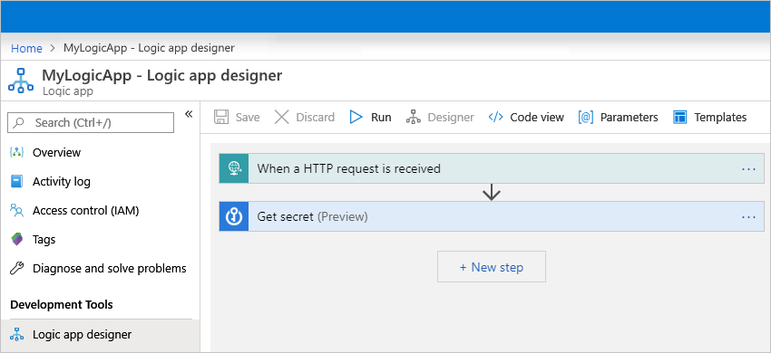
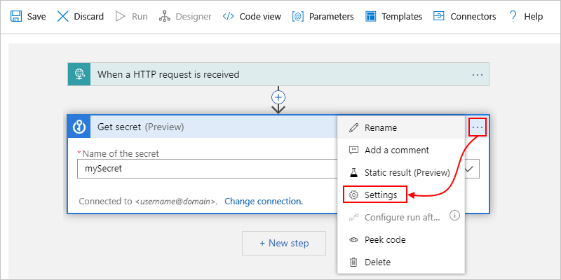
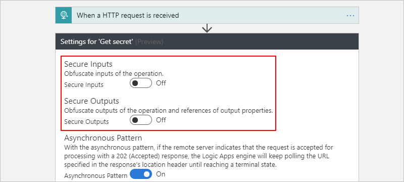
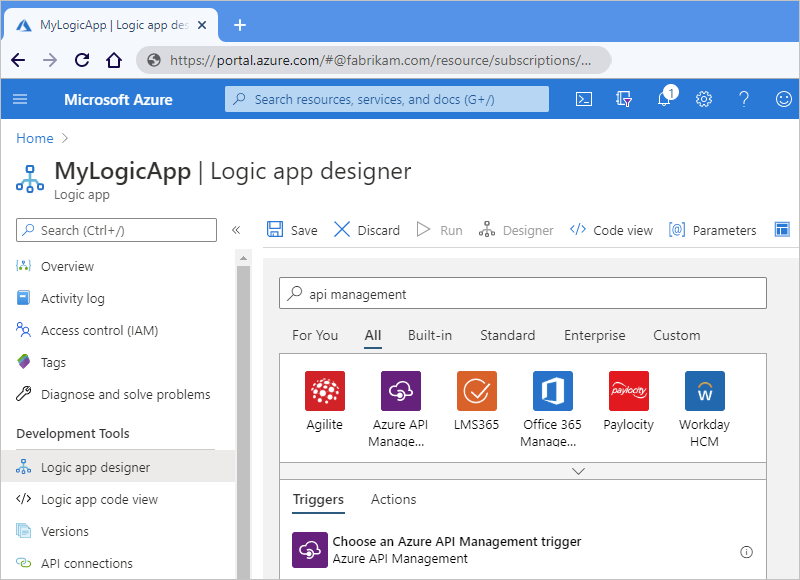
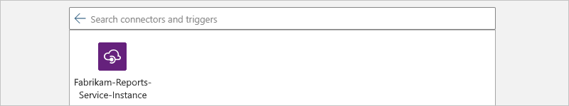

# Secure access and data in Azure Logic Apps

To control access and protect sensitive data in Azure Logic Apps, you can set up security for these areas:

* [Access to request-based triggers](#secure-triggers)
* [Access to logic app operations](#secure-operations)
* [Access to run history inputs and outputs](#secure-run-history)
* [Access to parameter inputs](#secure-action-parameters)
* [Access to services and systems called from logic apps](#secure-outbound-requests)
* [Block creating connections for specific connectors](#block-connections)

<a name="secure-triggers"></a>

## Access to request-based triggers

If your logic app uses a request-based trigger, which receives incoming calls or requests, such as the [Request](../connectors/connectors-native-reqres.md) or [Webhook](../connectors/connectors-native-webhook.md) trigger, you can limit access so that only authorized clients can call your logic app. All requests received by a logic app are encrypted and secured with Transport Layer Security (TLS) protocol, previously known as Secure Sockets Layer (SSL).

Here are options that can help you secure access to this trigger type:

* [Generate shared access signatures](#sas)
* [Enable Azure Active Directory Open Authentication (Azure AD OAuth)](#enable-oauth)
* [Restrict inbound IP addresses](#restrict-inbound-ip-addresses)
* [Add Azure Active Directory Open Authentication (Azure AD OAuth) or other security](#add-authentication)

<a name="sas"></a>

### Generate shared access signatures (SAS)

Every request endpoint on a logic app has a [Shared Access Signature (SAS)](https://docs.microsoft.com/rest/api/storageservices/constructing-a-service-sas) in the endpoint's URL, which follows this format:

`https://<request-endpoint-URI>sp=<permissions>sv=<SAS-version>sig=<signature>`

Each URL contains the `sp`, `sv`, and `sig` query parameter as described in this table:

| Query parameter | Description |
|-----------------|-------------|
| `sp` | Specifies permissions for the permitted HTTP methods to use. |
| `sv` | Specifies the SAS version to use for generating the signature. |
| `sig` | Specifies the signature to use for authenticating access to the trigger. This signature is generated by using the SHA256 algorithm with a secret access key on all the URL paths and properties. Never exposed or published, this key is kept encrypted and stored with the logic app. Your logic app authorizes only those triggers that contain a valid signature created with the secret key. |
|||

For more information about securing access with SAS, see these sections in this topic:

* [Regenerate access keys](#access-keys)
* [Create expiring callback URLs](#expiring-urls)
* [Create URLs with primary or secondary key](#primary-secondary-key)

<a name="access-keys"></a>

#### Regenerate access keys

To generate a new security access key at any time, use the Azure REST API or Azure portal. All previously generated URLs that use the old key are invalidated and no longer have authorization to trigger the logic app. The URLs that you retrieve after regeneration are signed with the new access key.

1. In the [Azure portal](https://portal.azure.com), open the logic app that has the key you want to regenerate.

1. On the logic app's menu, under **Settings**, select **Access Keys**.

1. Select the key that you want to regenerate and finish the process.

<a name="expiring-urls"></a>

#### Create expiring callback URLs

If you share the endpoint URL for a request-based trigger with other parties, you can generate callback URLs that use specific keys and have expiration dates. That way, you can seamlessly roll keys or restrict access to triggering your logic app based on a specific timespan. To specify an expiration date for a URL, use the [Logic Apps REST API](https://docs.microsoft.com/rest/api/logic/workflowtriggers), for example:

```http
POST /subscriptions/<Azure-subscription-ID>/resourceGroups/<Azure-resource-group-name>/providers/Microsoft.Logic/workflows/<workflow-name>/triggers/<trigger-name>/listCallbackUrl?api-version=2016-06-01
```

In the body, include the `NotAfter`property by using a JSON date string. This property returns a callback URL that's valid only until the `NotAfter` date and time.

<a name="primary-secondary-key"></a>

#### Create URLs with primary or secondary secret key

When you generate or list callback URLs for a request-based trigger, you can specify the key to use for signing the URL. To generate a URL that's signed by a specific key, use the [Logic Apps REST API](https://docs.microsoft.com/rest/api/logic/workflowtriggers), for example:

```http
POST /subscriptions/<Azure-subscription-ID>/resourceGroups/<Azure-resource-group-name>/providers/Microsoft.Logic/workflows/<workflow-name>/triggers/<trigger-name>/listCallbackUrl?api-version=2016-06-01
```

In the body, include the `KeyType` property as either `Primary` or `Secondary`. This property returns a URL that's signed by the specified security key.

<a name="enable-oauth"></a>

### Enable Azure Active Directory OAuth

If your logic app starts with a [Request trigger](../connectors/connectors-native-reqres.md), you can enable [Azure Active Directory Open Authentication](../active-directory/develop/about-microsoft-identity-platform.md) (Azure AD OAuth) by creating an authorization policy for inbound calls to the Request trigger. Before you enable this authentication, review these considerations:

* An inbound call to your logic app can use only one authorization scheme, either Azure AD OAuth or [Shared Access Signatures (SAS)](#sas). Only [Bearer-type](../active-directory/develop/active-directory-v2-protocols.md#tokens) authorization schemes are supported for OAuth tokens, which are supported only for the Request trigger.

* Your logic app is limited to a maximum number of authorization policies. Each authorization policy also has a maximum number of [claims](../active-directory/develop/developer-glossary.md#claim). For more information, see [Limits and configuration for Azure Logic Apps](../logic-apps/logic-apps-limits-and-config.md#authentication-limits).

* An authorization policy must include at least the **Issuer** claim, which has a value that starts with `https://sts.windows.net/` or `https://login.microsoftonline.com/` (OAuth V2) as the Azure AD issuer ID. For more information about access tokens, see [Microsoft identity platform access tokens](../active-directory/develop/access-tokens.md).

To enable Azure AD OAuth, follow these steps to add one or more authorization policies to your logic app.

1. In the [Azure portal](https://portal.microsoft.com), find and open your logic app in the Logic App Designer.

1. On the logic app menu, under **Settings**, select **Authorization**. After the Authorization pane opens, select **Add policy**.

   

1. Provide information about the authorization policy by specifying the [claim types](../active-directory/develop/developer-glossary.md#claim) and values that your logic app expects in the authentication token presented by each inbound call to the Request trigger:

   

   | Property | Required | Description |
   |----------|----------|-------------|
   | **Policy name** | Yes | The name that you want to use for the authorization policy |
   | **Claims** | Yes | The claim types and values that your logic app accepts from inbound calls. Here are the available claim types: <p><p>- **Issuer** <br>- **Audience** <br>- **Subject** <br>- **JWT ID** (JSON Web Token ID) <p><p>At the minimum, the **Claims** list must include the **Issuer** claim, which has a value that starts with the `https://sts.windows.net/` or `https://login.microsoftonline.com/` as the Azure AD issuer ID. For more information about these claim types, see [Claims in Azure AD security tokens](../active-directory/azuread-dev/v1-authentication-scenarios.md#claims-in-azure-ad-security-tokens). You can also specify your own claim type and value. |
   |||

1. To add another claim, select from these options:

   * To add another claim type, select **Add standard claim**, select the claim type, and specify the claim value.

   * To add your own claim, select **Add custom claim**, and specify the custom claim value.

1. To add another authorization policy, select **Add policy**. Repeat the previous steps to set up the policy.

1. When you're done, select **Save**.

Your logic app is now set up to use Azure AD OAuth for authorizing inbound requests. When your logic app receives an inbound request that includes an authentication token, Azure Logic Apps compares the token's claims against the claims in each authorization policy. If a match exists between the token's claims and all the claims in at least one policy, authorization succeeds for the inbound request. The token can have more claims than the number specified by the authorization policy.

For example, suppose that your logic app has an authorization policy that requires two claim types, Issuer and Audience. This sample decoded [access token](../active-directory/develop/access-tokens.md) includes both those claim types:

```json
{
   "aud": "https://management.core.windows.net/",
   "iss": "https://sts.windows.net/<Azure-AD-issuer-ID>/",
   "iat": 1582056988,
   "nbf": 1582056988,
   "exp": 1582060888,
   "_claim_names": {
      "groups": "src1"
   },
   "_claim_sources": {
      "src1": {
         "endpoint": "https://graph.windows.net/7200000-86f1-41af-91ab-2d7cd011db47/users/00000-f433-403e-b3aa-7d8406464625d7/getMemberObjects"
    }
   },
   "acr": "1",
   "aio": "AVQAq/8OAAAA7k1O1C2fRfeG604U9e6EzYcy52wb65Cx2OkaHIqDOkuyyr0IBa/YuaImaydaf/twVaeW/etbzzlKFNI4Q=",
   "amr": [
      "rsa",
      "mfa"
   ],
   "appid": "c44b4083-3bb0-00001-b47d-97400853cbdf3c",
   "appidacr": "2",
   "deviceid": "bfk817a1-3d981-4dddf82-8ade-2bddd2f5f8172ab",
   "family_name": "Sophia Owen",
   "given_name": "Sophia Owen (Fabrikam)",
   "ipaddr": "167.220.2.46",
   "name": "sophiaowen",
   "oid": "3d5053d9-f433-00000e-b3aa-7d84041625d7",
   "onprem_sid": "S-1-5-21-2497521184-1604012920-1887927527-21913475",
   "puid": "1003000000098FE48CE",
   "scp": "user_impersonation",
   "sub": "KGlhIodTx3XCVIWjJarRfJbsLX9JcdYYWDPkufGVij7_7k",
   "tid": "72f988bf-86f1-41af-91ab-2d7cd011db47",
   "unique_name": "SophiaOwen@fabrikam.com",
   "upn": "SophiaOwen@fabrikam.com",
   "uti": "TPJ7nNNMMZkOSx6_uVczUAA",
   "ver": "1.0"
}
```

<a name="restrict-inbound-ip"></a>

### Restrict inbound IP addresses

Along with Shared Access Signature (SAS), you might want to specifically limit the clients that can call your logic app. For example, if you manage your request endpoint by using [Azure API Management](../api-management/api-management-key-concepts.md), you can restrict your logic app to accept requests only from the IP address for the [API Management service instance that you create](../api-management/get-started-create-service-instance.md).

#### Restrict inbound IP ranges in Azure portal

1. In the [Azure portal](https://portal.azure.com), open your logic app in the Logic App Designer.

1. On your logic app's menu, under **Settings**, select **Workflow settings**.

1. Under **Access control configuration** > **Allowed inbound IP addresses**, select **Specific IP ranges**.

1. Under **IP ranges for triggers**, specify the IP address ranges that the trigger accepts.

   A valid IP range uses these formats: *x.x.x.x/x* or *x.x.x.x-x.x.x.x*

If you want your logic app to trigger only as a nested logic app, from the **Allowed inbound IP addresses** list, select **Only other Logic Apps**. This option writes an empty array to your logic app resource. That way, only calls from the Logic Apps service (parent logic apps) can trigger the nested logic app.

> [!NOTE]
> Regardless of IP address, you can still run a logic app that has a request-based trigger by using the 
> [Logic Apps REST API: Workflow Triggers - Run](https://docs.microsoft.com/rest/api/logic/workflowtriggers/run) 
> request or by using API Management. However, this scenario still requires [authentication](../active-directory/develop/authentication-scenarios.md) 
> against the Azure REST API. All events appear in the Azure Audit Log. Make sure that you set access control policies accordingly.

#### Restrict inbound IP ranges in Azure Resource Manager template

If you [automate deployment for logic apps by using Resource Manager templates](../logic-apps/logic-apps-azure-resource-manager-templates-overview.md), you can specify the IP ranges in *x.x.x.x/x* or *x.x.x.x-x.x.x.x* format by using the `accessControl` section and by including the `triggers` and `actions` sections in your logic app's resource definition, for example:

```json
{
   "$schema": "https://schema.management.azure.com/schemas/2015-01-01/deploymentTemplate.json#",
   "contentVersion": "1.0.0.0",
   "parameters": {},
   "variables": {},
   "resources": [
      {
         "name": "[parameters('LogicAppName')]",
         "type": "Microsoft.Logic/workflows",
         "location": "[parameters('LogicAppLocation')]",
         "tags": {
            "displayName": "LogicApp"
         },
         "apiVersion": "2016-06-01",
         "properties": {
            "definition": {
               <workflow-definition>
            },
            "parameters": {
            },
            "accessControl": {
               "triggers": {
                  "allowedCallerIpAddresses": [
                     {
                        "addressRange": "192.168.12.0/23"
                     }
                  ]
               },
               "actions": {
                  "allowedCallerIpAddresses:" : []
               }
            },
            "endpointsConfiguration": {}
         }
      }
   ],
   "outputs": {}
}
```

<a name="add-authentication"></a>

### Add Azure Active Directory Open Authentication or other security

To add more [authentication](../active-directory/develop/authentication-scenarios.md) protocols to your logic app, consider using the [Azure API Management](../api-management/api-management-key-concepts.md) service. This service helps you expose your logic app as an API and offers rich monitoring, security, policy, and documentation for any endpoint. API Management can expose a public or private endpoint for your logic app. To authorize access to this endpoint, you can use [Azure Active Directory Open Authentication](#azure-active-directory-oauth-authentication) (Azure AD OAuth), [client certificate](#client-certificate-authentication), or other security standards for authorizing access to that endpoint. When API Management receives a request, the service sends the request to your logic app, also making any necessary transformations or restrictions along the way. To let only API Management trigger your logic app, you can use your logic app's inbound IP range settings.

<a name="secure-operations"></a>

## Access to logic app operations

You can permit only specific users or groups to run specific tasks, such as managing, editing, and viewing logic apps. To control their permissions, use [Azure Role-Based Access Control (RBAC)](../role-based-access-control/role-assignments-portal.md) so that you can assign customized or built-in roles to the members in your Azure subscription:

* [Logic App Contributor](../role-based-access-control/built-in-roles.md#logic-app-contributor): Lets you manage logic apps, but you can't change access to them.

* [Logic App Operator](../role-based-access-control/built-in-roles.md#logic-app-operator): Lets you read, enable, and disable logic apps, but you can't edit or update them.

To prevent others from changing or deleting your logic app, you can use [Azure Resource Lock](../azure-resource-manager/management/lock-resources.md). This capability prevents others from changing or deleting production resources.

<a name="secure-run-history"></a>

## Access to run history data

During a logic app run, all the data is [encrypted during transit](../security/fundamentals/encryption-overview.md#encryption-of-data-in-transit) by using Transport Layer Security (TLS) and [at rest](../security/fundamentals/encryption-atrest.md). When your logic app finishes running, you can view the history for that run, including the steps that ran along with the status, duration, inputs, and outputs for each action. This rich detail provides insight into how your logic app ran and where you might start troubleshooting any problems that arise.

When you view your logic app's run history, Logic Apps authenticates your access and then provides links to the inputs and outputs for the requests and responses for each run. However, for actions that handle any passwords, secrets, keys, or other sensitive information, you want to prevent others from viewing and accessing that data. For example, if your logic app gets a secret from [Azure Key Vault](../key-vault/general/overview.md) to use when authenticating an HTTP action, you want to hide that secret from view.

To control access to the inputs and outputs in your logic app's run history, you have these options:

* [Restrict access by IP address range](#restrict-ip).

  This option helps you secure access to run history based on the requests from a specific IP address range.

* [Secure data in run history by using obfuscation](#obfuscate).

  In many triggers and actions, you can secure the inputs, outputs, or both in a logic app's run history.

<a name="restrict-ip"></a>

### Restrict access by IP address range

You can limit access to the inputs and outputs in your logic app's run history so that only requests from specific IP address ranges can view that data. For example, to block anyone from accessing inputs and outputs, specify an IP address range such as `0.0.0.0-0.0.0.0`. Only a person with administrator permissions can remove this restriction, which provides the possibility for "just-in-time" access to your logic app's data. You can specify the IP ranges to restrict either by using the Azure portal or in an Azure Resource Manager template that you use for logic app deployment.

#### Restrict IP ranges in Azure portal

1. In the Azure portal, open your logic app in the Logic App Designer.

1. On your logic app's menu, under **Settings**, select **Workflow settings**.

1. Under **Access control configuration** > **Allowed inbound IP addresses**, select **Specific IP ranges**.

1. Under **IP ranges for contents**, specify the IP address ranges that can access content from inputs and outputs. 

   A valid IP range uses these formats: *x.x.x.x/x* or *x.x.x.x-x.x.x.x*

#### Restrict IP ranges in Azure Resource Manager template

If you [automate deployment for logic apps by using Resource Manager templates](../logic-apps/logic-apps-azure-resource-manager-templates-overview.md), you can specify the IP ranges by using the `accessControl` section with the `contents` section in your logic app's resource definition, for example:

``` json
{
   "$schema": "https://schema.management.azure.com/schemas/2015-01-01/deploymentTemplate.json#",
   "contentVersion": "1.0.0.0",
   "parameters": {},
   "variables": {},
   "resources": [
      {
         "name": "[parameters('LogicAppName')]",
         "type": "Microsoft.Logic/workflows",
         "location": "[parameters('LogicAppLocation')]",
         "tags": {
            "displayName": "LogicApp"
         },
         "apiVersion": "2016-06-01",
         "properties": {
            "definition": {<workflow-definition>},
            "parameters": {},
            "accessControl": {
               "contents": {
                  "allowedCallerIpAddresses": [
                     {
                        "addressRange": "192.168.12.0/23"
                     },
                     {
                        "addressRange": "2001:0db8::/64"
                     }
                  ]
               }
            }
         }
      }
   ],
   "outputs": {}
}
```

<a name="obfuscate"></a>

### Secure data in run history by using obfuscation

Many triggers and actions have settings to secure inputs, outputs, or both from a logic app's run history. Before using these settings to help you secure this data, [review these considerations](#obfuscation-considerations).

#### Secure inputs and outputs in the designer

1. In the [Azure portal](https://portal.azure.com), open your logic app in the Logic App Designer.

   

1. On the trigger or action where you want to secure sensitive data, select the ellipses (**...**) button, and then select **Settings**.

   

1. Turn on either **Secure Inputs**, **Secure Outputs**, or both. When you're finished, select **Done**.

   

   The action or trigger now shows a lock icon in the title bar.

   

   Tokens that represent secured outputs from previous actions also show lock icons. For example, when you select such an output from the dynamic content list to use in an action, that token shows a lock icon.

   

1. After the logic app runs, you can view the history for that run.

   1. On the logic app's **Overview** pane, select the run that you want to view.

   1. On the **Logic app run** pane, expand the actions that you want to review.

      If you chose to obscure both inputs and outputs, those values now appear hidden.

      

<a name="secure-data-code-view"></a>

#### Secure inputs and outputs in code view

In the underlying trigger or action definition, add or update the `runtimeConfiguration.secureData.properties` array with either or both of these values:

* `"inputs"`: Secures inputs in run history.
* `"outputs"`: Secures outputs in run history.

Here are some [considerations to review](#obfuscation-considerations) when you use these settings to help you secure this data.

```json
"<trigger-or-action-name>": {
   "type": "<trigger-or-action-type>",
   "inputs": {
      <trigger-or-action-inputs>
   },
   "runtimeConfiguration": {
      "secureData": {
         "properties": [
            "inputs",
            "outputs"
         ]
      }
   },
   <other-attributes>
}
```

<a name="obfuscation-considerations"></a>

#### Considerations when securing inputs and outputs

* When you obscure the inputs or outputs on a trigger or action, Logic Apps doesn't send the secured data to Azure Log Analytics. Also, you can't add [tracked properties](../logic-apps/monitor-logic-apps-log-analytics.md#extend-data) to that trigger or action for monitoring.

* The [Logic Apps API for handling workflow history](https://docs.microsoft.com/rest/api/logic/) doesn't return secured outputs.

* To secure outputs from an action that obscures inputs or explicitly obscures outputs, manually turn on **Secure Outputs** in that action.

* Make sure that you turn on **Secure Inputs** or **Secure Outputs** in downstream actions where you expect the run history to obscure that data.

  **Secure Outputs setting**

  When you manually turn on **Secure Outputs** in a trigger or action, Logic Apps hides these outputs in the run history. If a downstream action explicitly uses these secured outputs as inputs, Logic Apps hides this action's inputs in the run history, but *doesn't enable* the action's **Secure Inputs** setting.

  

  The Compose, Parse JSON, and Response actions has only the **Secure Inputs** setting. When turned on, the setting also hides these actions' outputs. If these actions explicitly use the upstream secured outputs as inputs, Logic Apps hides these actions' inputs and outputs, but *doesn't enable* these actions' **Secure Inputs** setting. If a downstream action explicitly uses the hidden outputs from the Compose, Parse JSON, or Response actions as inputs, Logic Apps *doesn't hide this downstream action's inputs or outputs*.

  

  **Secure Inputs setting**

  When you manually turn on **Secure Inputs** in a trigger or action, Logic Apps hides these inputs in the run history. If a downstream action explicitly uses the visible outputs from that trigger or action as inputs, Logic Apps hides this downstream action's inputs in the run history, but *doesn't enable* **Secure Inputs** in this action and doesn't hide this action's outputs.

  

  If the Compose, Parse JSON, and Response actions explicitly use the visible outputs from the trigger or action that has the secured inputs, Logic Apps hides these actions' inputs and outputs, but *doesn't enable* these action's **Secure Inputs** setting. If a downstream action explicitly uses the hidden outputs from the Compose, Parse JSON, or Response actions as inputs, Logic Apps *doesn't hide this downstream action's inputs or outputs*.

  

<a name="secure-action-parameters"></a>

## Access to parameter inputs

If you deploy across different environments, consider parameterizing the values in your workflow definition that vary based on those environments. That way, you can avoid hard-coded data by using an [Azure Resource Manager template](../azure-resource-manager/templates/overview.md) to deploy your logic app, protect sensitive data by defining secured parameters, and pass that data as separate inputs through the [template's parameters](../azure-resource-manager/templates/template-parameters.md) by using a [parameter file](../azure-resource-manager/templates/parameter-files.md).

For example, if you authenticate HTTP actions with [Azure Active Directory Open Authentication](#azure-active-directory-oauth-authentication) (Azure AD OAuth), you can define and obscure the parameters that accept the client ID and client secret that are used for authentication. To define these parameters in your logic app, use the `parameters` section in your logic app's workflow definition and Resource Manager template for deployment. To help secure parameter values that you don't want shown when editing your logic app or viewing run history, define the parameters by using the `securestring` or `secureobject` type and use encoding as necessary. Parameters that have this type aren't returned with the resource definition and aren't accessible when viewing the resource after deployment. To access these parameter values during runtime, use the `@parameters('<parameter-name>')` expression inside your workflow definition. This expression is evaluated only at runtime and is described by the [Workflow Definition Language](../logic-apps/logic-apps-workflow-definition-language.md).

> [!NOTE]
> If you use a parameter in a request header or body, that parameter might be visible when you view your logic app's 
> run history and outgoing HTTP request. Make sure that you also set your content access policies accordingly. 
> You can also use [obfuscation](#obfuscate) to hide inputs and outputs in your run history. Authorization headers 
> are never visible through inputs or outputs. So if a secret is used there, that secret isn't retrievable.

For more information, see these sections in this topic:

* [Secure parameters in workflow definitions](#secure-parameters-workflow)
* [Secure data in run history by using obfuscation](#obfuscate)

If you [automate deployment for logic apps by using Resource Manager templates](../logic-apps/logic-apps-azure-resource-manager-templates-overview.md), you can define secured [template parameters](../azure-resource-manager/templates/template-parameters.md), which are evaluated at deployment, by using the `securestring` and `secureobject` types. To define template parameters, use your template's top level `parameters` section, which is separate and different from your workflow definition's `parameters` section. To provide the values for template parameters, use a separate [parameter file](../azure-resource-manager/templates/parameter-files.md).

For example, if you use secrets, you can define and use secured template parameters that retrieve those secrets from [Azure Key Vault](../key-vault/general/overview.md) at deployment. You can then reference the key vault and secret in your parameter file. For more information, see these topics:

* [Pass sensitive values at deployment by using Azure Key Vault](../azure-resource-manager/templates/key-vault-parameter.md)
* [Secure parameters in Azure Resource Manager templates](#secure-parameters-deployment-template) later in this topic

<a name="secure-parameters-workflow"></a>

### Secure parameters in workflow definitions

To protect sensitive information in your logic app's workflow definition, use secured parameters so this information isn't visible after you save your logic app. For example, suppose you have an HTTP action requires basic authentication, which uses a username and password. In the workflow definition, the `parameters` section defines the `basicAuthPasswordParam` and `basicAuthUsernameParam` parameters by using the `securestring` type. The action definition then references these parameters in the `authentication` section.

```json
"definition": {
   "$schema": "https://schema.management.azure.com/providers/Microsoft.Logic/schemas/2016-06-01/workflowdefinition.json#",
   "actions": {
      "HTTP": {
         "type": "Http",
         "inputs": {
            "method": "GET",
            "uri": "https://www.microsoft.com",
            "authentication": {
               "type": "Basic",
               "username": "@parameters('basicAuthUsernameParam')",
               "password": "@parameters('basicAuthPasswordParam')"
            }
         },
         "runAfter": {}
      }
   },
   "parameters": {
      "basicAuthPasswordParam": {
         "type": "securestring"
      },
      "basicAuthUsernameParam": {
         "type": "securestring"
      }
   },
   "triggers": {
      "manual": {
         "type": "Request",
         "kind": "Http",
         "inputs": {
            "schema": {}
         }
      }
   },
   "contentVersion": "1.0.0.0",
   "outputs": {}
}
```

<a name="secure-parameters-deployment-template"></a>

### Secure parameters in Azure Resource Manager templates

A [Resource Manager template](../logic-apps/logic-apps-azure-resource-manager-templates-overview.md) for a logic app has multiple `parameters` sections. To protect passwords, keys, secrets, and other sensitive information, define secured parameters at the template level and workflow definition level by using the `securestring` or `secureobject` type. You can then store these values in [Azure Key Vault](../key-vault/general/overview.md) and use the [parameter file](../azure-resource-manager/templates/parameter-files.md) to reference the key vault and secret. Your template then retrieves that information at deployment. For more information, see [Pass sensitive values at deployment by using Azure Key Vault](../azure-resource-manager/templates/key-vault-parameter.md).

Here is more information about these `parameters` sections:

* At the template's top level, a `parameters` section defines the parameters for the values that the template uses at *deployment*. For example, these values can include connection strings for a specific deployment environment. You can then store these values in a separate [parameter file](../azure-resource-manager/templates/parameter-files.md), which makes changing these values easier.

* Inside your logic app's resource definition, but outside your workflow definition, a `parameters` section specifies the values for your workflow definition's parameters. In this section, you can assign these values by using template expressions that reference your template's parameters. These expressions are evaluated at deployment.

* Inside your workflow definition, a `parameters` section defines the parameters that your logic app uses at runtime. You can then reference these parameters inside your logic app's workflow by using workflow definition expressions, which are evaluated at runtime.

This example template that has multiple secured parameter definitions that use the `securestring` type:

| Parameter name | Description |
|----------------|-------------|
| `TemplatePasswordParam` | A template parameter that accepts a password that is then passed to the workflow definition's `basicAuthPasswordParam` parameter |
| `TemplateUsernameParam` | A template parameter that accepts a username that is then passed to the workflow definition's `basicAuthUserNameParam` parameter |
| `basicAuthPasswordParam` | A workflow definition parameter that accepts the password for basic authentication in an HTTP action |
| `basicAuthUserNameParam` | A workflow definition parameter that accepts the username for basic authentication in an HTTP action |
|||

```json
{
   "$schema": "https://schema.management.azure.com/schemas/2015-01-01/deploymentTemplate.json#",
   "contentVersion": "1.0.0.0",
   "parameters": {
      "LogicAppName": {
         "type": "string",
         "minLength": 1,
         "maxLength": 80,
         "metadata": {
            "description": "Name of the Logic App."
         }
      },
      "TemplatePasswordParam": {
         "type": "securestring"
      },
      "TemplateUsernameParam": {
         "type": "securestring"
      },
      "LogicAppLocation": {
         "type": "string",
         "defaultValue": "[resourceGroup().location]",
         "allowedValues": [
            "[resourceGroup().location]",
            "eastasia",
            "southeastasia",
            "centralus",
            "eastus",
            "eastus2",
            "westus",
            "northcentralus",
            "southcentralus",
            "northeurope",
            "westeurope",
            "japanwest",
            "japaneast",
            "brazilsouth",
            "australiaeast",
            "australiasoutheast",
            "southindia",
            "centralindia",
            "westindia",
            "canadacentral",
            "canadaeast",
            "uksouth",
            "ukwest",
            "westcentralus",
            "westus2"
         ],
         "metadata": {
            "description": "Location of the Logic App."
         }
      }
   },
   "variables": {},
   "resources": [
      {
         "name": "[parameters('LogicAppName')]",
         "type": "Microsoft.Logic/workflows",
         "location": "[parameters('LogicAppLocation')]",
         "tags": {
            "displayName": "LogicApp"
         },
         "apiVersion": "2016-06-01",
         "properties": {
            "definition": {
               "$schema": "https://schema.management.azure.com/providers/Microsoft.Logic/schemas/2016-0601/workflowdefinition.json#",
               "actions": {
                  "HTTP": {
                     "type": "Http",
                     "inputs": {
                        "method": "GET",
                        "uri": "https://www.microsoft.com",
                        "authentication": {
                           "type": "Basic",
                           "username": "@parameters('basicAuthUsernameParam')",
                           "password": "@parameters('basicAuthPasswordParam')"
                        }
                     },
                  "runAfter": {}
                  }
               },
               "parameters": {
                  "basicAuthPasswordParam": {
                     "type": "securestring"
                  },
                  "basicAuthUsernameParam": {
                     "type": "securestring"
                  }
               },
               "triggers": {
                  "manual": {
                     "type": "Request",
                     "kind": "Http",
                     "inputs": {
                        "schema": {}
                     }
                  }
               },
               "contentVersion": "1.0.0.0",
               "outputs": {}
            },
            "parameters": {
               "basicAuthPasswordParam": {
                  "value": "[parameters('TemplatePasswordParam')]"
               },
               "basicAuthUsernameParam": {
                  "value": "[parameters('TemplateUsernameParam')]"
               }
            }
         }
      }
   ],
   "outputs": {}
}
```

<a name="secure-outbound-requests"></a>

## Access to services and systems called from logic apps

Here are some ways that you can help secure endpoints that receive calls or requests from your logic app:

* Add authentication to outbound requests.

  When you work with an HTTP-based trigger or action that makes outbound calls, such as HTTP, HTTP + Swagger, or Webhook, you can add authentication to the request that's sent by your logic app. For example, you can select these authentication types:

  * [Basic authentication](#basic-authentication)

  * [Client certificate authentication](#client-certificate-authentication)

  * [Active Directory OAuth authentication](#azure-active-directory-oauth-authentication)

  * [Managed identity authentication](#managed-identity-authentication)
  
  For more information, see [Add authentication to outbound calls](#add-authentication-outbound) later in this topic.

* Restrict access from logic app IP addresses.

  All calls to endpoints from logic apps originate from specific designated IP addresses that are based on your logic apps' regions. You can add filtering that accepts requests only from those IP addresses. To get these IP addresses, see [Limits and configuration for Azure Logic Apps](logic-apps-limits-and-config.md#configuration).

* Improve security for connections to on-premises systems.

  Azure Logic Apps provides integration with these services to help provide more secure and reliable on-premises communication.

  * On-premises data gateway

    Many managed connectors in Azure Logic Apps facilitate secured connections to on-premises systems, such as File System, SQL, SharePoint, and DB2. The gateway sends data from on-premises sources on encrypted channels through the Azure Service Bus. All traffic originates as secured outbound traffic from the gateway agent. Learn [how the on-premises data gateway works](logic-apps-gateway-install.md#gateway-cloud-service).

  * Connect through Azure API Management

    [Azure API Management](../api-management/api-management-key-concepts.md) provides on-premises connection options, such as site-to-site virtual private network and [ExpressRoute](../expressroute/expressroute-introduction.md) integration for secured proxy and communication to on-premises systems. If you have an API that provides access to your on-premises system, and you exposed that API by creating an [API Management service instance](../api-management/get-started-create-service-instance.md), you can call that API in your logic app's workflow by selecting the built-in API Management trigger or action in the Logic App Designer.

    > [!NOTE]
    > The connector shows only those API Management services where you have permissions to view and connect, 
    > but doesn't show consumption-based API Management services.

    1. In the Logic App Designer, enter `api management` in the search box. Choose the step based on whether you're adding a trigger or an action:<p>

       * If you're adding a trigger, which is always the first step in your workflow, select **Choose an Azure API Management trigger**.

       * If you're adding an action, select **Choose an Azure API Management action**.

       This example adds a trigger:

       

    1. Select your previously created API Management service instance.

       

    1. Select the API call to use.

       

<a name="add-authentication-outbound"></a>

## Add authentication to outbound calls

HTTP and HTTPS endpoints support various kinds of authentication. On some triggers and actions that you use for sending outbound calls or requests to these endpoints, you can specify an authentication type. In the Logic App Designer, triggers and actions that support choosing an authentication type have an **Authentication** property. However, this property might not always appear by default. In these cases, on the trigger or action, open the **Add new parameter** list, and select **Authentication**.

> [!IMPORTANT]
> To protect sensitive information that your logic app handles, use secured parameters and encode data as necessary. 
> For more information about using and securing parameters, see [Access to parameter inputs](#secure-action-parameters).

This table identifies the authentication types that are available on the triggers and actions where you can select an authentication type:

| Authentication type | Availability |
|---------------------|--------------|
| [Basic](#basic-authentication) | Azure API Management, Azure App Services, HTTP, HTTP + Swagger, HTTP Webhook |
| [Client Certificate](#client-certificate-authentication) | Azure API Management, Azure App Services, HTTP, HTTP + Swagger, HTTP Webhook |
| [Active Directory OAuth](#azure-active-directory-oauth-authentication) | Azure API Management, Azure App Services, Azure Functions, HTTP, HTTP + Swagger, HTTP Webhook |
| [Raw](#raw-authentication) | Azure API Management, Azure App Services, Azure Functions, HTTP, HTTP + Swagger, HTTP Webhook |
| [Managed identity](#managed-identity-authentication) | Azure API Management, Azure App Services, Azure Functions, HTTP, HTTP + Swagger, HTTP Webhook |
|||

<a name="basic-authentication"></a>

### Basic authentication

If the [Basic](../active-directory-b2c/secure-rest-api.md) option is available, specify these property values:

| Property (designer) | Property (JSON) | Required | Value | Description |
|---------------------|-----------------|----------|-------|-------------|
| **Authentication** | `type` | Yes | Basic | The authentication type to use |
| **Username** | `username` | Yes | <*user-name*>| The user name for authenticating access to the target service endpoint |
| **Password** | `password` | Yes | <*password*> | The password for authenticating access to the target service endpoint |
||||||

When you use [secured parameters](#secure-action-parameters) to handle and secure sensitive information, for example, in an [Azure Resource Manager template for automating deployment](../logic-apps/logic-apps-azure-resource-manager-templates-overview.md), you can use expressions to access these parameter values at runtime. This example HTTP action definition specifies the authentication `type` as `Basic` and uses the [parameters() function](../logic-apps/workflow-definition-language-functions-reference.md#parameters) to get the parameter values:

```json
"HTTP": {
   "type": "Http",
   "inputs": {
      "method": "GET",
      "uri": "@parameters('endpointUrlParam')",
      "authentication": {
         "type": "Basic",
         "username": "@parameters('userNameParam')",
         "password": "@parameters('passwordParam')"
      }
  },
  "runAfter": {}
}
```

<a name="client-certificate-authentication"></a>

### Client Certificate authentication

If the [Client Certificate](../active-directory/authentication/active-directory-certificate-based-authentication-get-started.md) option is available, specify these property values:

| Property (designer) | Property (JSON) | Required | Value | Description |
|---------------------|-----------------|----------|-------|-------------|
| **Authentication** | `type` | Yes | **Client Certificate** <br>or <br>`ClientCertificate` | The authentication type to use. You can manage certificates with [Azure API Management](../api-management/api-management-howto-mutual-certificates.md). <p></p>**Note**: Custom connectors don't support certificate-based authentication for both inbound and outbound calls. |
| **Pfx** | `pfx` | Yes | <*encoded-pfx-file-content*> | The base64-encoded content from a Personal Information Exchange (PFX) file <p><p>To convert the PFX file into base64-encoded format, you can use PowerShell by following these steps: <p>1. Save the certificate content into a variable: <p>   `$pfx_cert = get-content 'c:\certificate.pfx' -Encoding Byte` <p>2. Convert the certificate content by using the `ToBase64String()` function and save that content to a text file: <p>   `[System.Convert]::ToBase64String($pfx_cert) | Out-File 'pfx-encoded-bytes.txt'` |
| **Password** | `password`| No | <*password-for-pfx-file*> | The password for accessing the PFX file |
|||||

When you use [secured parameters](#secure-action-parameters) to handle and secure sensitive information, for example, in an [Azure Resource Manager template for automating deployment](../logic-apps/logic-apps-azure-resource-manager-templates-overview.md), you can use expressions to access these parameter values at runtime. This example HTTP action definition specifies the authentication `type` as `ClientCertificate` and uses the [parameters() function](../logic-apps/workflow-definition-language-functions-reference.md#parameters) to get the parameter values:

```json
"HTTP": {
   "type": "Http",
   "inputs": {
      "method": "GET",
      "uri": "@parameters('endpointUrlParam')",
      "authentication": {
         "type": "ClientCertificate",
         "pfx": "@parameters('pfxParam')",
         "password": "@parameters('passwordParam')"
      }
   },
   "runAfter": {}
}
```

For more information about securing services by using client certificate authentication, see these topics:

* [Improve security for APIs by using client certificate authentication in Azure API Management](../api-management/api-management-howto-mutual-certificates-for-clients.md)
* [Improve security for back-end services by using client certificate authentication in Azure API Management](../api-management/api-management-howto-mutual-certificates.md)
* [Improve security for your RESTfuL service by using client certificates](../active-directory-b2c/secure-rest-api.md)
* [Certificate credentials for application authentication](../active-directory/develop/active-directory-certificate-credentials.md)
* [Use a TLS/SSL certificate in your code in Azure App Service](../app-service/configure-ssl-certificate-in-code.md)

<a name="azure-active-directory-oauth-authentication"></a>

### Azure Active Directory Open Authentication

On Request triggers, you can use [Azure Active Directory Open Authentication](../active-directory/develop/about-microsoft-identity-platform.md) (Azure AD OAuth), for authenticating incoming calls after you [set up Azure AD authorization policies](#enable-oauth) for your logic app. For all other triggers and actions that provide the **Active Directory OAuth** authentication type for you to select, specify these property values:

| Property (designer) | Property (JSON) | Required | Value | Description |
|---------------------|-----------------|----------|-------|-------------|
| **Authentication** | `type` | Yes | **Active Directory OAuth** <br>or <br>`ActiveDirectoryOAuth` | The authentication type to use. Logic Apps currently follows the [OAuth 2.0 protocol](../active-directory/develop/v2-overview.md). |
| **Authority** | `authority` | No | <*URL-for-authority-token-issuer*> | The URL for the authority that provides the authentication token. By default, this value is `https://login.windows.net`. |
| **Tenant** | `tenant` | Yes | <*tenant-ID*> | The tenant ID for the Azure AD tenant |
| **Audience** | `audience` | Yes | <*resource-to-authorize*> | The resource that you want to use for authorization, for example, `https://management.core.windows.net/` |
| **Client ID** | `clientId` | Yes | <*client-ID*> | The client ID for the app requesting authorization |
| **Credential Type** | `credentialType` | Yes | Certificate <br>or <br>Secret | The credential type that the client uses for requesting authorization. This property and value don't appear in your logic app's underlying definition, but determines the properties that appear for the selected credential type. |
| **Secret** | `secret` | Yes, but only for the "Secret" credential type | <*client-secret*> | The client secret for requesting authorization |
| **Pfx** | `pfx` | Yes, but only for the "Certificate" credential type | <*encoded-pfx-file-content*> | The base64-encoded content from a Personal Information Exchange (PFX) file |
| **Password** | `password` | Yes, but only for the "Certificate" credential type | <*password-for-pfx-file*> | The password for accessing the PFX file |
|||||

When you use [secured parameters](#secure-action-parameters) to handle and secure sensitive information, for example, in an [Azure Resource Manager template for automating deployment](../logic-apps/logic-apps-azure-resource-manager-templates-overview.md), you can use expressions to access these parameter values at runtime. This example HTTP action definition specifies the authentication `type` as `ActiveDirectoryOAuth`, the credential type as `Secret`, and uses the [parameters() function](../logic-apps/workflow-definition-language-functions-reference.md#parameters) to get the parameter values:

```json
"HTTP": {
   "type": "Http",
   "inputs": {
      "method": "GET",
      "uri": "@parameters('endpointUrlParam')",
      "authentication": {
         "type": "ActiveDirectoryOAuth",
         "tenant": "@parameters('tenantIdParam')",
         "audience": "https://management.core.windows.net/",
         "clientId": "@parameters('clientIdParam')",
         "credentialType": "Secret",
         "secret": "@parameters('secretParam')"
     }
   },
   "runAfter": {}
}
```

<a name="raw-authentication"></a>

### Raw authentication

If the **Raw** option is available, you can use this authentication type when you have to use [authentication schemes](https://iana.org/assignments/http-authschemes/http-authschemes.xhtml) that don't follow the [OAuth 2.0 protocol](https://oauth.net/2/). With this type, you manually create the authorization header value that you send with the outgoing request, and specify that header value in your trigger or action.

For example, here is a sample header for an HTTPS request that follows the [OAuth 1.0 protocol](https://tools.ietf.org/html/rfc5849):

```text
Authorization: OAuth realm="Photos",
   oauth_consumer_key="dpf43f3p2l4k3l03",
   oauth_signature_method="HMAC-SHA1",
   oauth_timestamp="137131200",
   oauth_nonce="wIjqoS",
   oauth_callback="http%3A%2F%2Fprinter.example.com%2Fready",
   oauth_signature="74KNZJeDHnMBp0EMJ9ZHt%2FXKycU%3D"
```

In the trigger or action that supports raw authentication, specify these property values:

| Property (designer) | Property (JSON) | Required | Value | Description |
|---------------------|-----------------|----------|-------|-------------|
| **Authentication** | `type` | Yes | Raw | The authentication type to use |
| **Value** | `value` | Yes | <*authorization-header-value*> | The authorization header value to use for authentication |
||||||

When you use [secured parameters](#secure-action-parameters) to handle and secure sensitive information, for example, in an [Azure Resource Manager template for automating deployment](../logic-apps/logic-apps-azure-resource-manager-templates-overview.md), you can use expressions to access these parameter values at runtime. This example HTTP action definition specifies the authentication `type` as `Raw`, and uses the [parameters() function](../logic-apps/workflow-definition-language-functions-reference.md#parameters) to get the parameter values:

```json
"HTTP": {
   "type": "Http",
   "inputs": {
      "method": "GET",
      "uri": "@parameters('endpointUrlParam')",
      "authentication": {
         "type": "Raw",
         "value": "@parameters('authHeaderParam')"
      }
   },
   "runAfter": {}
}
```

<a name="managed-identity-authentication"></a>

### Managed identity authentication

If the [Managed Identity](../active-directory/managed-identities-azure-resources/overview.md) option is available, your logic app can use the system-assigned identity or a *single* manually created user-assigned identity for authenticating access to other resources that are protected by Azure Active Directory (Azure AD) without signing in. Azure manages this identity for you and helps you secure your credentials because you don't have to provide or rotate secrets. Learn more about [Azure services that support managed identities for Azure AD authentication](../active-directory/managed-identities-azure-resources/services-support-managed-identities.md#azure-services-that-support-azure-ad-authentication).

1. Before your logic app can use a managed identity, follow the steps in [Authenticate access to Azure resources by using managed identities in Azure Logic Apps](../logic-apps/create-managed-service-identity.md). These steps enable the managed identity on your logic app and set up that identity's access to the target Azure resource.

1. Before an Azure function can use a managed identity, first [enable authentication for Azure functions](../logic-apps/logic-apps-azure-functions.md#enable-authentication-for-azure-functions).

1. In the trigger or action where you want to use the managed identity, specify these property values:

   | Property (designer) | Property (JSON) | Required | Value | Description |
   |---------------------|-----------------|----------|-------|-------------|
   | **Authentication** | `type` | Yes | **Managed Identity** <br>or <br>`ManagedServiceIdentity` | The authentication type to use |
   | **Managed Identity** | `identity` | Yes | * **System Assigned Managed Identity** <br>or <br>`SystemAssigned` <p><p>* <*user-assigned-identity-name*> | The managed identity to use |
   | **Audience** | `audience` | Yes | <*target-resource-ID*> | The resource ID for the target resource that you want to access. <p>For example, `https://storage.azure.com/` makes the [access tokens](../active-directory/develop/access-tokens.md) for authentication valid for all storage accounts. However, you can also specify a root service URL, such as `https://fabrikamstorageaccount.blob.core.windows.net` for a specific storage account. <p>**Note**: The **Audience** property might be hidden in some triggers or actions. To make this property visible, in the trigger or action, open the **Add new parameter** list, and select **Audience**. <p><p>**Important**: Make sure that this target resource ID *exactly matches* the value that Azure AD expects, including any required trailing slashes. So, the `https://storage.azure.com/` resource ID for all Azure Blob Storage accounts requires a trailing slash. However, the resource ID for a specific storage account doesn't require a trailing slash. To find these resource IDs, see [Azure services that support Azure AD](../active-directory/managed-identities-azure-resources/services-support-managed-identities.md#azure-services-that-support-azure-ad-authentication). |
   |||||

   When you use [secured parameters](#secure-action-parameters) to handle and secure sensitive information, for example, in an [Azure Resource Manager template for automating deployment](../logic-apps/logic-apps-azure-resource-manager-templates-overview.md), you can use expressions to access these parameter values at runtime. This example HTTP action definition specifies the authentication `type` as `ManagedServiceIdentity` and uses the [parameters() function](../logic-apps/workflow-definition-language-functions-reference.md#parameters) to get the parameter values:

   ```json
   "HTTP": {
      "type": "Http",
      "inputs": {
         "method": "GET",
         "uri": "@parameters('endpointUrlParam')",
         "authentication": {
            "type": "ManagedServiceIdentity",
            "identity": "SystemAssigned",
            "audience": "https://management.azure.com/"
         },
      },
      "runAfter": {}
   }
   ```

<a name="block-connections"></a>

## Block creating connections

If your organization doesn't permit connecting to specific resources by using their connectors in Azure Logic Apps, you can [block the capability to create those connections](../logic-apps/block-connections-connectors.md) for specific connectors in logic app workflows by using [Azure Policy](../governance/policy/overview.md). For more information, see [Block connections created by specific connectors in Azure Logic Apps](../logic-apps/block-connections-connectors.md).

## Next steps

* [Automate deployment for Azure Logic Apps](../logic-apps/logic-apps-azure-resource-manager-templates-overview.md)  
* [Monitor logic apps](../logic-apps/monitor-logic-apps-log-analytics.md)  
* [Diagnose logic app failures and issues](../logic-apps/logic-apps-diagnosing-failures.md)  
* [Automate logic app deployment](../logic-apps/logic-apps-azure-resource-manager-templates-overview.md)
