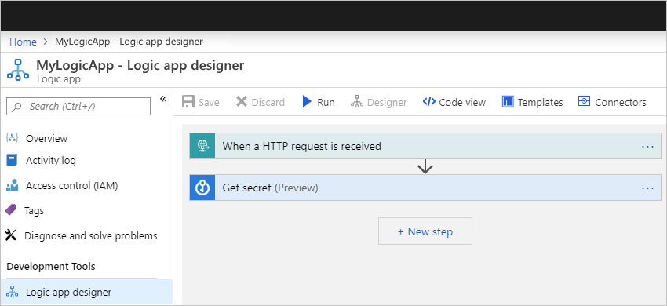
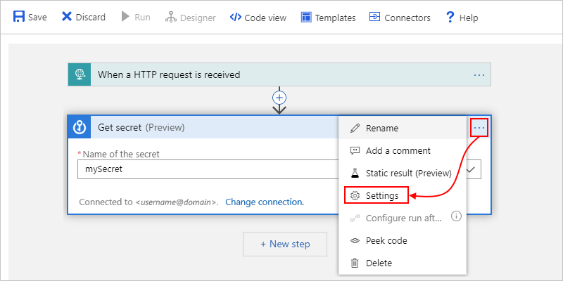
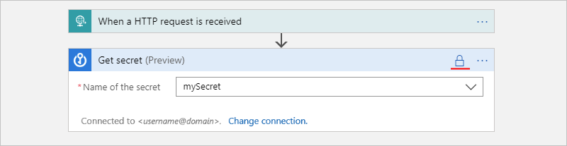
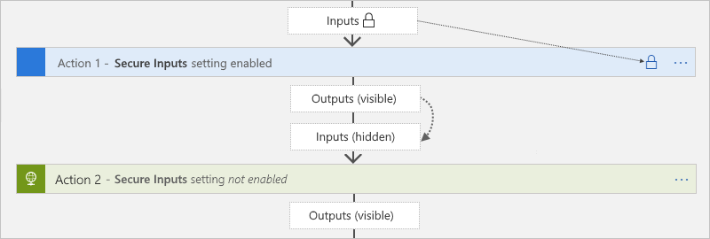

# Secure access and data in Azure Logic Apps

To control access and protect data in Azure Logic Apps, you can set up security in these areas:

* [Access to HTTP request triggers](#secure-triggers)
* [Access to logic app operations](#secure-operations)
* [Access to run history inputs and outputs](#secure-run-history)
* [Access to parameter inputs](#secure-action-parameters)
* [Access to services and systems called from logic apps](#secure-requests)

<a name="secure-triggers"></a>

## Access to HTTP request triggers

When your logic app uses an HTTP request-based trigger, such as the [Request](../connectors/connectors-native-reqres.md) or [Webhook](../connectors/connectors-native-webhook.md) trigger, you can limit access so that only authorized clients can start your logic app. All requests received by a logic app are encrypted and secured with Secure Sockets Layer (SSL) protocol. 

Here are the ways that you can secure access to this trigger type:

* [Generate shared access signatures](#sas)
* [Restrict incoming IP addresses](#restrict-incoming-ip-addresses)
* [Add Azure Active Directory, OAuth, or other security](#add-authentication)

<a name="sas"></a>

### Generate shared access signatures (SAS)

Every request endpoint on a logic app has a [Shared Access Signature (SAS)](https://docs.microsoft.com/rest/api/storageservices/constructing-a-service-sas) in the endpoint's URL, which follows this format:

`https://<request-endpoint-URI>sp=<permissions>sv=<SAS-version>sig=<signature>`

Each URL contains an `sp`, `sv`, and `sig` query parameter as described in this table:

| Query parameter | Description |
|-----------------|-------------|
| `sp` | Specifies permissions for the permitted HTTP methods to use. |
| `sv` | Specifies the SAS version to use for generating the signature. |
| `sig` | Specifies the signature to use for authenticating access to the trigger. This signature is generated by using the SHA256 algorithm with a secret access key on all the URL paths and properties. Never exposed or published, this key is kept encrypted and stored with the logic app. Your logic app authorizes only those triggers that contain a valid signature created with the secret key. |
|||

For more information about securing access with Shared Access Signature, see these sections in this topic:

* [Regenerate access keys](#access-keys)
* [Create expiring callback URLs](#expiring-urls)
* [Create URLs with primary or secondary key](#primary-secondary-key)

<a name="access-keys"></a>

#### Regenerate access keys

To generate a new secure access key at any time, use the Azure REST API or Azure portal. All previously generated URLs that use the old key are invalidated and no longer have authorization to trigger the logic app. The URLs that you retrieve after regeneration are signed with the new access key.

1. In the Azure portal, open the logic app that has the key you want to regenerate.

1. On the logic app's menu, under **Settings**, select **Access Keys**.

1. Select the key you want to regenerate and finish the process.

<a name="expiring-urls"></a>

#### Create expiring callback URLs

If you share the endpoint URL for an HTTP request-based trigger with other parties, you can generate callback URLs that use specific keys and have expiration dates. That way, you can seamlessly roll keys or restrict access to triggering your logic app based on a specific timespan. To specify an expiration date for a URL, use the [Logic Apps REST API](https://docs.microsoft.com/rest/api/logic/workflowtriggers), for example:

``` http
POST /subscriptions/<Azure-subscription-ID>/resourceGroups/<Azure-resource-group-name>/providers/Microsoft.Logic/workflows/<workflow-name>/triggers/<trigger-name>/listCallbackUrl?api-version=2016-06-01
```

In the body, include the `NotAfter`property by using a JSON date string. This property returns a callback URL that's valid only until the `NotAfter` date and time.

<a name="primary-secondary-key"></a>

#### Create URLs with primary or secondary secret key

When you generate or list callback URLs for HTTP request-based triggers, you can specify the key to use for signing the URL. To generate a URL that's signed by a specific key, use the [Logic Apps REST API](https://docs.microsoft.com/rest/api/logic/workflowtriggers), for example:

``` http
POST /subscriptions/<Azure-subscription-ID>/resourceGroups/<Azure-resource-group-name>/providers/Microsoft.Logic/workflows/<workflow-name>/triggers/<trigger-name>/listCallbackUrl?api-version=2016-06-01
```

In the body, include the `KeyType` property as either `Primary` or `Secondary`. This property returns a URL that's signed by the specified secure key.

<a name="restrict-incoming-ip"></a>

### Restrict incoming IP addresses

Along with Shared Access Signature, you might want to limit the specific clients that can call your logic app. For example, if you manage your request endpoint by using Azure API Management, you can restrict your logic app to accept requests only from the IP address for the API Management instance.

#### Restrict incoming IP ranges in Azure portal

1. In the Azure portal, open your logic app in the Logic App Designer.

1. On your logic app's menu, under **Settings**, select **Workflow settings**.

1. Under **Access control configuration** > **Allowed inbound IP addresses**, select **Specific IP ranges**.

1. Under **IP ranges for triggers**, specify the IP address ranges that the trigger accepts.

   A valid IP range uses these formats: *x.x.x.x/x* or *x.x.x.x-x.x.x.x*

If you want your logic app to trigger only as a nested logic app, from the **Allowed inbound IP addresses** list, select **Only other Logic Apps**. This option writes an empty array to your logic app resource. That way, only calls from the Logic Apps service (parent logic apps) can trigger the nested logic app.

> [!NOTE]
> Regardless of IP address, you can still run a logic app that has an HTTP request-based trigger 
> by using `/triggers/<trigger-name>/run` through the Azure REST API or through API Management. 
> However, this scenario still requires authentication against the Azure REST API. 
> All events appear in the Azure Audit Log. Make sure that you set access control policies accordingly.

#### Restrict incoming IP ranges in Azure Resource Manager template

If you automate logic app deployments by using an [Azure Resource Manager template](../logic-apps/logic-apps-create-deploy-template.md), you can specify the IP ranges by using the `accessControl` section with the `triggers` section in your logic app's resource definition, for example:

``` json
{
   "$schema": "https://schema.management.azure.com/schemas/2015-01-01/deploymentTemplate.json#",
   "contentVersion": "1.0.0.0",
   "parameters": {},
   "variables": {},
   "resources": [
      {
         "name": "[parameters('LogicAppName')]",
         "type": "Microsoft.Logic/workflows",
         "location": "[parameters('LogicAppLocation')]",
         "tags": {
            "displayName": "LogicApp"
         },
         "apiVersion": "2016-06-01",
         "properties": {
            "definition": {<workflow-definition>},
            "parameters": {},
            "accessControl": {
               "triggers": {
                  "allowedCallerIpAddresses": [
                     {
                        "addressRange": "192.168.12.0/23"
                     },
                     {
                        "addressRange": "2001:0db8::/64"
                     }
                  ]
               }
            }
         }
      }
   ],
   "outputs": {}
}
```

<a name="add-authentication"></a>

### Add Azure Active Directory, OAuth, or other security

To add more authorization protocols to your logic app, consider using [Azure API Management](../api-management/api-management-key-concepts.md). This service gives you the capability to expose your logic app as an API and offers rich monitoring, security, policy, and documentation for any endpoint. API Management can expose a public or private endpoint for your logic app, which can then use Azure Active Directory, OAuth, certificate, or other security standards. When API Management receives a request, the service sends the request to your logic app, also making any necessary transformations or restrictions along the way. To let only API Management trigger your logic app, you can use your logic app's incoming IP range settings.

<a name="secure-operations"></a>

## Access to logic app operations

You can permit only specific users or groups to run specific operations, such as managing, editing, and viewing logic apps. To control their permissions, use [Azure Role-Based Access Control (RBAC)](../role-based-access-control/role-assignments-portal.md) to assign customized or built-in roles to members in your Azure subscription:

* [Logic App Contributor](../role-based-access-control/built-in-roles.md#logic-app-contributor): Lets you manage logic apps, but you can't change access to them.

* [Logic App Operator](../role-based-access-control/built-in-roles.md#logic-app-operator): Lets you read, enable, and disable logic apps, but you can't edit or update them.

To prevent others from changing or deleting your logic app, you can use [Azure Resource Lock](../azure-resource-manager/resource-group-lock-resources.md), which prevents others from changing or deleting production resources.

<a name="secure-run-history"></a>

## Access to run history data

During a logic app run, all the data is encrypted during transit by using [Transit Layer Security (TLS)](https://azure.microsoft.com/updates/app-service-and-functions-hosted-apps-can-now-update-tls-versions/) and at [rest](../security/fundamentals/encryption-atrest.md). When your logic app finishes running, you can view the history for that run, including the steps that ran along with the status, duration, inputs, and outputs for each action. This rich detail provides insight into how your logic app ran and where you might start troubleshooting any problems that arise.

When you access your logic app's run history, Logic Apps authenticates your access and provides links to the inputs and outputs from the requests and responses in your logic app's run. However, for actions that handle any passwords, secrets, keys, or other sensitive information, you want to prevent others from viewing and accessing that data. For example, if your logic app gets a secret from [Azure Key Vault](../key-vault/key-vault-whatis.md) to use when authenticating an HTTP action, you want to hide that secret from view.

To control access to the inputs and outputs in your logic app's run history, you have these options:

* [Restrict access by IP address range](#restrict-ip).

  This option lets you secure access to run history based on the requests from a specific IP address range.

* [Hide data from run history by using obfuscation](#obfuscate).

  In many triggers and actions, you can hide their inputs, outputs, or both from a logic app's run history.

<a name="restrict-ip"></a>

### Restrict access by IP address range

You can limit access to the inputs and outputs in your logic app's run history so that only requests from specific IP address ranges can view that data. For example, to block anyone from accessing inputs and outputs, specify an IP address range such as `0.0.0.0-0.0.0.0`. Only a person with administrator permissions can remove this restriction, which provides the possibility for "just-in-time" access to your logic app's data. You can specify the IP ranges to restrict either by using the Azure portal or in an Azure Resource Manager template that you use for logic app deployment.

#### Restrict IP ranges in Azure portal

1. In the Azure portal, open your logic app in the Logic App Designer.

1. On your logic app's menu, under **Settings**, select **Workflow settings**.

1. Under **Access control configuration** > **Allowed inbound IP addresses**, select **Specific IP ranges**.

1. Under **IP ranges for contents**, specify the IP address ranges that can access content from inputs and outputs. 

   A valid IP range uses these formats: *x.x.x.x/x* or *x.x.x.x-x.x.x.x*

#### Restrict IP ranges in Azure Resource Manager template

If you automate logic app deployments by using an [Azure Resource Manager template](../logic-apps/logic-apps-create-deploy-template.md), you can specify the IP ranges by using the `accessControl` section with the `contents` section in your logic app's resource definition, for example:

``` json
{
   "$schema": "https://schema.management.azure.com/schemas/2015-01-01/deploymentTemplate.json#",
   "contentVersion": "1.0.0.0",
   "parameters": {},
   "variables": {},
   "resources": [
      {
         "name": "[parameters('LogicAppName')]",
         "type": "Microsoft.Logic/workflows",
         "location": "[parameters('LogicAppLocation')]",
         "tags": {
            "displayName": "LogicApp"
         },
         "apiVersion": "2016-06-01",
         "properties": {
            "definition": {<workflow-definition>},
            "parameters": {},
            "accessControl": {
               "contents": {
                  "allowedCallerIpAddresses": [
                     {
                        "addressRange": "192.168.12.0/23"
                     },
                     {
                        "addressRange": "2001:0db8::/64"
                     }
                  ]
               }
            }
         }
      }
   ],
   "outputs": {}
}
```

<a name="obfuscate"></a>

### Hide data from run history by using obfuscation

Many triggers and actions have settings to hide inputs, outputs, or both from a logic app's run history. Here are some [considerations to review](#obfuscation-considerations) when you use these settings to secure this data.

#### Secure inputs and outputs in the designer

1. If your logic app isn't already open in the [Azure portal](https://portal.azure.com), open your logic app in the Logic App Designer.

   

1. On the trigger or action where you want to secure data, select the ellipses (**...**) button, and then select **Settings**.

   

1. Turn on either **Secure Inputs**, **Secure Outputs**, or both. When you're finished, select **Done**.

   

   The action or trigger now shows a lock icon in the title bar.

   

   Tokens that represent secured outputs from previous actions also show lock icons. For example, when you select such an output from the dynamic content list to use in an action, that token shows a lock icon.

   

1. After the logic app runs, you can view the history for that run.

   1. On the logic app's **Overview** pane, select the run that you want to view.

   1. On the **Logic app run** pane, expand the actions that you want to review.

      If you chose to secure both inputs and outputs, those values now appear hidden.

      

<a name="secure-data-code-view"></a>

#### Secure inputs and outputs in code view

In the underlying trigger or action definition, add or update the `runtimeConfiguration.secureData.properties` array with either or both of these values:

* `"inputs"`: Secures inputs in run history.
* `"outputs"`: Secures outputs in run history.

Here are some [considerations to review](#obfuscation-considerations) when you use these settings to secure this data.

```json
"<trigger-or-action-name>": {
   "type": "<trigger-or-action-type>",
   "inputs": {
      <trigger-or-action-inputs>
   },
   "runtimeConfiguration": {
      "secureData": {
         "properties": [
            "inputs",
            "outputs"
         ]
      }
   },
   <other-attributes>
}
```

<a name="obfuscation-considerations"></a>

#### Considerations when hiding inputs and outputs

* When you secure the inputs or outputs on a trigger or action, Logic Apps doesn't send the secured data to Azure Log Analytics. Also, you can't add [tracked properties](logic-apps-monitor-your-logic-apps.md#azure-diagnostics-event-settings-and-details) to that trigger or action for monitoring.

* The [Logic Apps API for handling workflow history](https://docs.microsoft.com/rest/api/logic/) doesn't return secured outputs.

* In an action where you secure inputs or that explicitly uses secured outputs, and this action returns a response with outputs that include this secured data, you have to manually turn on **Secure Outputs** in this action to secure these outputs.

* Make sure that you turn on **Secure Inputs** or **Secure Outputs** in downstream actions where you expect the run history to secure that data.

  **Secure Outputs setting**

  When you manually turn on **Secure Outputs** in a trigger or action, Logic Apps secures these outputs in the run history. If a downstream action explicitly uses these secured outputs as inputs, Logic Apps hides this action's inputs in the run history, but *doesn't enable* the action's **Secure Inputs** setting.

  

  The Compose, Parse JSON, and Response actions has only the **Secure Inputs** setting. When turned on, the setting also hides these actions' outputs. If these actions explicitly use the upstream secured outputs as inputs, Logic Apps hides these actions' inputs and outputs, but *doesn't enable* these actions' **Secure Inputs** setting. If a downstream action explicitly uses the hidden outputs from the Compose, Parse JSON, or Response actions as inputs, Logic Apps *doesn't hide this downstream action's inputs or outputs*.

  

  **Secure Inputs setting**

  When you manually turn on **Secure Inputs** in a trigger or action, Logic Apps secures these inputs in the run history. If a downstream action explicitly uses the visible outputs from that trigger or action as inputs, Logic Apps hides this downstream action's inputs in the run history, but *doesn't enable* **Secure Inputs** in this action and doesn't hide this action's outputs.

  

  If the Compose, Parse JSON, and Response actions explicitly use the visible outputs from the trigger or action that has the secured inputs, Logic Apps hides these actions' inputs and outputs, but *doesn't enable* these action's **Secure Inputs** setting. If a downstream action explicitly uses the hidden outputs from the Compose, Parse JSON, or Response actions as inputs, Logic Apps *doesn't hide this downstream action's inputs or outputs*.

  

<a name="secure-action-parameters"></a>

## Access to parameter inputs

If you deploy across different environments, consider parameterizing the values in your workflow definition that vary based on those environments. That way, you can use an [Azure Resource Manager template](../azure-resource-manager/resource-group-authoring-templates.md#parameters) to deploy your logic app, protect sensitive information by defining secured parameters, and provide those parameter inputs separately through the template's parameters by using a [parameter file](../azure-resource-manager/resource-group-template-deploy.md#pass-parameter-values).

For example, if you authenticate HTTP actions with [Azure Active Directory](../logic-apps/logic-apps-workflow-actions-triggers.md#connector-authentication), you can define and secure the parameters that accept the client ID and client secret used for authentication. To define these parameters for your logic app, use the `parameters` section inside your logic app's workflow definition. To protect parameter values that you don't want shown when editing your logic app or viewing run history, define the parameters by using the `securestring` or `secureobject` type and use encoding as necessary. Parameters that have this type aren't returned with the resource definition and aren't accessible when viewing the resource after deployment. To access these parameter values during runtime, use the `@parameters('<parameter-name>')` expression inside your workflow definition. This expression is evaluated only at runtime and is described by the [Workflow Definition Language](../logic-apps/logic-apps-workflow-definition-language.md).

> [!NOTE]
> If you use a parameter in an HTTP request's headers or body, that parameter might be visible when you view your 
> logic app's run history and outgoing HTTP request. Make sure that you also set your content access policies accordingly. 
> Authorization headers are never visible through inputs or outputs. So if a secret is used there, that secret isn't retrievable.

For more information, see [Secure parameters in workflow definitions](#secure-parameters-workflow) later in this topic.

When you automate deployments with [Azure Resource Manager templates](../azure-resource-manager/resource-group-authoring-templates.md#parameters), you can define secured template parameters, which are evaluated at deployment, by using the `securestring` and `secureobject` types. To define template parameters, use your template's top level `parameters` section, which is separate and different than your workflow definition's `parameters` section. To provide the values for template parameters, use a separate [parameter file](../azure-resource-manager/resource-group-template-deploy.md#pass-parameter-values).

For example, if you use secrets, you can define and use secured template parameters that retrieve those secrets from [Azure Key Vault](../key-vault/key-vault-whatis.md) at deployment. You can then reference the key vault and secret in your parameter file. For more information, see these topics:

* [Use Azure Key Vault to pass secure parameter values at deployment](../azure-resource-manager/resource-manager-keyvault-parameter.md)
* [Secure parameters in Azure Resource Manager templates](#secure-parameters-deployment-template) later in this topic

<a name="secure-parameters-workflow"></a>

### Secure parameters in workflow definitions

To protect sensitive information in your logic app's workflow definition, use secured parameters so this information isn't visible after you save your logic app. For example, suppose you have an HTTP action requires basic authentication, which uses a username and password. In the workflow definition, the `parameters` section defines the `basicAuthPasswordParam` and `basicAuthUsernameParam` parameters by using the `securestring` type. The action definition then references these parameters in the `authentication` section.

```json
"definition": {
   "$schema": "https://schema.management.azure.com/providers/Microsoft.Logic/schemas/2016-06-01/workflowdefinition.json#",
   "actions": {
      "HTTP": {
         "type": "Http",
         "inputs": {
            "method": "GET",
            "uri": "https://www.microsoft.com",
            "authentication": {
               "type": "Basic",
               "username": "@parameters('basicAuthUsernameParam')",
               "password": "@parameters('basicAuthPasswordParam')"
            }
         },
         "runAfter": {}
      }
   },
   "parameters": {
      "basicAuthPasswordParam": {
         "type": "securestring"
      },
      "basicAuthUsernameParam": {
         "type": "securestring"
      }
   },
   "triggers": {
      "manual": {
         "type": "Request",
         "kind": "Http",
         "inputs": {
            "schema": {}
         }
      }
   },
   "contentVersion": "1.0.0.0",
   "outputs": {}
}
```

<a name="secure-parameters-deployment-template"></a>

### Secure parameters in Azure Resource Manager templates

A Resource Manager template for a logic app has multiple `parameters` sections. To protect passwords, keys, secrets, and other sensitive information, define secured parameters at the template level and workflow definition level by using the `securestring` or `secureobject` type. You can then store these values in [Azure Key Vault](../key-vault/key-vault-whatis.md) and use the [parameter file](../azure-resource-manager/resource-group-template-deploy.md#pass-parameter-values) to reference the key vault and secret. Your template then retrieves that information at deployment. For more information, see [Use Azure Key Vault to pass secure parameter values at deployment](../azure-resource-manager/resource-manager-keyvault-parameter.md).

Here is more information about these `parameters` sections:

* At the template's top level, a `parameters` section defines the parameters for the values that the template uses at *deployment*. For example, these values can include connection strings for a specific deployment environment. You can then store these values in a separate [parameter file](../azure-resource-manager/resource-group-template-deploy.md#pass-parameter-values), which makes changing these values easier.

* Inside your logic app's resource definition, but outside your workflow definition, a `parameters` section specifies the values for your workflow definition's parameters. In this section, you can assign these values by using template expressions that reference your template's parameters. These expressions are evaluated at deployment.

* Inside your workflow definition, a `parameters` section defines the parameters that your logic app uses at runtime. You can then reference these parameters inside your logic app's workflow by using workflow definition expressions, which are evaluated at runtime.

This example template that has multiple secured parameter definitions that use the `securestring` type:

| Parameter name | Description |
|----------------|-------------|
| `TemplatePasswordParam` | A template parameter that accepts a password that is then passed to the workflow definition's `basicAuthPasswordParam` parameter |
| `TemplatePasswordParam` | A template parameter that accepts a username that is then passed to the workflow definition's `basicAuthUserNameParam` parameter |
| `basicAuthPasswordParam` | A workflow definition parameter that accepts the password for basic authentication in an HTTP action |
| `basicAuthUserNameParam` | A workflow definition parameter that accepts the username for basic authentication in an HTTP action |
|||

```json
{
   "$schema": "https://schema.management.azure.com/schemas/2015-01-01/deploymentTemplate.json#",
   "contentVersion": "1.0.0.0",
   "parameters": {
      "LogicAppName": {
         "type": "string",
         "minLength": 1,
         "maxLength": 80,
         "metadata": {
            "description": "Name of the Logic App."
         }
      },
      "TemplatePasswordParam": {
         "type": "securestring"
      },
      "TemplateUsernameParam": {
         "type": "securestring"
      },
      "LogicAppLocation": {
         "type": "string",
         "defaultValue": "[resourceGroup().location]",
         "allowedValues": [
            "[resourceGroup().location]",
            "eastasia",
            "southeastasia",
            "centralus",
            "eastus",
            "eastus2",
            "westus",
            "northcentralus",
            "southcentralus",
            "northeurope",
            "westeurope",
            "japanwest",
            "japaneast",
            "brazilsouth",
            "australiaeast",
            "australiasoutheast",
            "southindia",
            "centralindia",
            "westindia",
            "canadacentral",
            "canadaeast",
            "uksouth",
            "ukwest",
            "westcentralus",
            "westus2"
         ],
         "metadata": {
            "description": "Location of the Logic App."
         }
      }
   },
   "variables": {},
   "resources": [
      {
         "name": "[parameters('LogicAppName')]",
         "type": "Microsoft.Logic/workflows",
         "location": "[parameters('LogicAppLocation')]",
         "tags": {
            "displayName": "LogicApp"
         },
         "apiVersion": "2016-06-01",
         "properties": {
            "definition": {
               "$schema": "https://schema.management.azure.com/providers/Microsoft.Logic/schemas/2016-0601/workflowdefinition.json#",
               "actions": {
                  "HTTP": {
                     "type": "Http",
                     "inputs": {
                        "method": "GET",
                        "uri": "https://www.microsoft.com",
                        "authentication": {
                           "type": "Basic",
                           "username": "@parameters('basicAuthUsernameParam')",
                           "password": "@parameters('basicAuthPasswordParam')"
                        }
                     },
                  "runAfter": {}
                  }
               },
               "parameters": {
                  "basicAuthPasswordParam": {
                     "type": "securestring"
                  },
                  "basicAuthUsernameParam": {
                     "type": "securestring"
                  }
               },
               "triggers": {
                  "manual": {
                     "type": "Request",
                     "kind": "Http",
                     "inputs": {
                        "schema": {}
                     }
                  }
               },
               "contentVersion": "1.0.0.0",
               "outputs": {}
            },
            "parameters": {
               "basicAuthPasswordParam": {
                  "value": "[parameters('TemplatePasswordParam')]"
               },
               "basicAuthUsernameParam": {
                  "value": "[parameters('TemplateUsernameParam')]"
               }
            }
         }
      }
   ],
   "outputs": {}
}
```

<a name="secure-requests"></a>

## Access to services and systems called from logic apps

Here are some ways that you can secure endpoints where your logic app needs access to send requests:

* Add authentication on outbound requests.

  When you work with an HTTP, HTTP + Swagger (Open API), or Webhook action, you can add authentication to the request sent by your logic app. For example, you can use basic authentication, certificate authentication, or Azure Active Directory authentication. For more information, see [Authenticate triggers or actions](../logic-apps/logic-apps-workflow-actions-triggers.md#connector-authentication).

* Restrict access from logic app IP addresses.

  All calls to endpoints from logic apps originate from specific designated IP addresses that are based on your logic apps' regions. You can add filtering that accepts requests only from those IP addresses. To get these IP addresses, see [Limits and configuration for Azure Logic Apps](logic-apps-limits-and-config.md#configuration).

* Authenticate and access resources as managed identities.

  To access resources in other Azure Active Directory (Azure AD) tenants, your logic app can authenticate your identity without signing in by using a managed identity (formerly known as Managed Service Identity or MSI), rather than credentials or secrets. Azure manages this identity for you and helps secure your credentials because you don't have to provide or rotate secrets. For more information about how to set up and use a system-assigned managed identity for your logic app, see [Authenticate and access resources with managed identities in Azure Logic Apps](../logic-apps/create-managed-service-identity.md).

* Secure connections to on-premises systems.

  Azure Logic Apps provides integration with these services for secure and reliable on-premises communication.

  * On-premises data gateway

    Many managed connectors in Azure Logic Apps provide secure connections to on-premises systems, such as File System, SQL, SharePoint, and DB2. The gateway sends data from on-premises sources on encrypted channels through the Azure Service Bus. All traffic originates as secure outbound traffic from the gateway agent. Learn [how the on-premises data gateway works](logic-apps-gateway-install.md#gateway-cloud-service).

  * Connect through Azure API Management

    [Azure API Management](../api-management/api-management-key-concepts.md) provides on-premises connection options, such as site-to-site virtual private network and ExpressRoute integration for secured proxy and communication to on-premises systems. From your logic app's workflow in the Logic App Designer, you can select an API that's exposed by API Management, which provides quick access to on-premises systems.

## Next steps

* [Create deployment templates](logic-apps-create-deploy-template.md)  
* [Monitor your logic apps](logic-apps-monitor-your-logic-apps.md)  
* [Diagnose logic app failures and issues](logic-apps-diagnosing-failures.md)  
* [Automate logic app deployment](logic-apps-azure-resource-manager-templates-overview.md)
