# Secure access and data in Azure Logic Apps

Azure Logic Apps relies on [Azure Storage](../storage/index.yml) to store and automatically [encrypt data at rest](../security/fundamentals/encryption-atrest.md). This encryption protects your data and helps you meet your organizational security and compliance commitments. By default, Azure Storage uses Microsoft-managed keys to encrypt your data. For more information, review [Azure Storage encryption for data at rest](../storage/common/storage-service-encryption.md).

To further control access and protect sensitive data in Azure Logic Apps, you can set up more security in these areas:

* [Access to logic app operations](#secure-operations)
* [Access to run history inputs and outputs](#secure-run-history)
* [Access to parameter inputs](#secure-action-parameters)
* [Authentication types for triggers and actions that support authentication](#authentication-types-supported-triggers-actions)
* [Access for inbound calls to request-based triggers](#secure-inbound-requests)
* [Access for outbound calls to other services and systems](#secure-outbound-requests)
* [Block creating connections for specific connectors](#block-connections)
* [Isolation guidance for logic apps](#isolation-logic-apps)
* [Azure Security Baseline for Azure Logic Apps](../logic-apps/security-baseline.md)

For more information about security in Azure, review these topics:

* [Azure encryption overview](../security/fundamentals/encryption-overview.md)
* [Azure Data Encryption-at-Rest](../security/fundamentals/encryption-atrest.md)
* [Microsoft cloud security benchmark](/security/benchmark/azure/introduction)

<a name="secure-operations"></a>

## Access to logic app operations

For Consumption logic apps only, before you can create or manage logic apps and their connections, you need specific permissions, which are provided through roles using [Azure role-based access control (Azure RBAC)](../role-based-access-control/role-assignments-portal.md). You can also set up permissions so that only specific users or groups can run specific tasks, such as managing, editing, and viewing logic apps. To control their permissions, you can assign built-in or customized roles to members who have access to your Azure subscription. Azure Logic Apps has the following specific roles:

* [Logic App Contributor](../role-based-access-control/built-in-roles.md#logic-app-contributor): Lets you manage logic apps, but you can't change access to them.

* [Logic App Operator](../role-based-access-control/built-in-roles.md#logic-app-operator): Lets you read, enable, and disable logic apps, but you can't edit or update them.

* [Contributor](../role-based-access-control/built-in-roles.md#contributor): Grants full access to manage all resources, but doesn't allow you to assign roles in Azure RBAC, manage assignments in Azure Blueprints, or share image galleries.

  For example, suppose you have to work with a logic app that you didn't create and authenticate connections used by that logic app's workflow. Your Azure subscription requires Contributor permissions for the resource group that contains that logic app resource. If you create a logic app resource, you automatically have Contributor access.

To prevent others from changing or deleting your logic app, you can use [Azure Resource Lock](../azure-resource-manager/management/lock-resources.md). This capability prevents others from changing or deleting production resources. For more information about connection security, review [Connection configuration in Azure Logic Apps](../connectors/introduction.md#connection-configuration) and [Connection security and encryption](../connectors/introduction.md#connection-security-encryption).

<a name="secure-run-history"></a>

## Access to run history data

During a logic app run, all the data is [encrypted during transit](../security/fundamentals/encryption-overview.md#encryption-of-data-in-transit) by using Transport Layer Security (TLS) and [at rest](../security/fundamentals/encryption-atrest.md). When your logic app finishes running, you can view the history for that run, including the steps that ran along with the status, duration, inputs, and outputs for each action. This rich detail provides insight into how your logic app ran and where you might start troubleshooting any problems that arise.

When you view your logic app's run history, Azure Logic Apps authenticates your access and then provides links to the inputs and outputs for the requests and responses for each run. However, for actions that handle any passwords, secrets, keys, or other sensitive information, you want to prevent others from viewing and accessing that data. For example, if your logic app gets a secret from [Azure Key Vault](../key-vault/general/overview.md) to use when authenticating an HTTP action, you want to hide that secret from view.

To control access to the inputs and outputs in your logic app's run history, you have these options:

* [Restrict access by IP address range](#restrict-ip).

  This option helps you secure access to run history based on the requests from a specific IP address range.

* [Secure data in run history by using obfuscation](#obfuscate).

  In many triggers and actions, you can secure the inputs, outputs, or both in a logic app's run history.

<a name="restrict-ip"></a>

### Restrict access by IP address range

You can limit access to the inputs and outputs in the run history for your logic app workflows so that only requests from specific IP address ranges can view that data.

For example, to block anyone from accessing inputs and outputs, specify an IP address range such as `0.0.0.0-0.0.0.0`. Only a person with administrator permissions can remove this restriction, which provides the possibility for "just-in-time" access to data in your logic app workflows. A valid IP range uses these formats: *x.x.x.x/x* or *x.x.x.x-x.x.x.x*

To specify the allowed IP ranges, follow these steps for either the Azure portal or your Azure Resource Manager template:

#### [Portal](#tab/azure-portal)

##### Consumption workflows

1. In the [Azure portal](https://portal.azure.com), open your logic app workflow in the designer.

1. On your logic app's menu, under **Settings**, select **Workflow settings**.

1. Under **Access control configuration** > **Allowed inbound IP addresses**, select **Specific IP ranges**.

1. Under **IP ranges for contents**, specify the IP address ranges that can access content from inputs and outputs.

##### Standard workflows

1. In the [Azure portal](https://portal.azure.com), open your logic app resource.

1. On the logic app menu, under **Settings**, select **Networking**.

1. In the **Inbound Traffic** section, select **Access restriction**.

1. Create one or more rules to either **Allow** or **Deny** requests from specific IP ranges. You can also use the HTTP header filter settings and forwarding settings.

   For more information, see [Blocking inbound IP addresses in Azure Logic Apps (Standard)](https://www.serverlessnotes.com/docs/block-inbound-ip-addresses-in-azure-logic-apps-standard).

#### [Resource Manager Template](#tab/azure-resource-manager)

#### Consumption workflows

In your ARM template, specify the IP ranges by using the `accessControl` section with the `contents` section in your logic app's resource definition, for example:

``` json
{
   "$schema": "https://schema.management.azure.com/schemas/2015-01-01/deploymentTemplate.json#",
   "contentVersion": "1.0.0.0",
   "parameters": {},
   "variables": {},
   "resources": [
      {
         "name": "[parameters('LogicAppName')]",
         "type": "Microsoft.Logic/workflows",
         "location": "[parameters('LogicAppLocation')]",
         "tags": {
            "displayName": "LogicApp"
         },
         "apiVersion": "2016-06-01",
         "properties": {
            "definition": {<workflow-definition>},
            "parameters": {},
            "accessControl": {
               "contents": {
                  "allowedCallerIpAddresses": [
                     {
                        "addressRange": "192.168.12.0/23"
                     },
                     {
                        "addressRange": "2001:0db8::/64"
                     }
                  ]
               }
            }
         }
      }
   ],
   "outputs": {}
}
```

##### Standard workflows

In your ARM template, specify the allowed inbound IP address ranges in your logic app's resource definition by using the `Microsoft.Web/sites/config` section. In this section, under `properties`, add the `ipSecurityRestrictions` section, and use the `ipAddress`, `action="Deny" | "Allow"`, `tag=Default`, `priority`, and `name="Ports"` sections to define a rule and set the `ipAddress` to the allowed IP range in *x.x.x.x/x* or *x.x.x.x-x.x.x.x* format, for example:

```json
{
   "type": "Microsoft.Web/sites/config",
   "apiVersion": "2022-09-01",
   "name": "[concat(parameters('sites_My_Standard_Logic_App_name'), '/web')]",
   "location": "West US",
   "dependsOn": [
      "[resourceId('Microsoft.Web/sites', parameters('sites_My_Standard_Logic_App_name'))]"
   ],
   "tags": {
      "hidden-link: /app-insights-resource-id": "/subscriptions/{subscriptionID}/resourceGroups/Standard-RG/providers/Microsoft.Insights/components/My-Standard-Logic-App"
   },
   "properties": {
      "numberOfWorkers": 1,
      "defaultDocuments": [
         "Default.htm",
         "Default.html",
         "Default.asp",
         "index.htm",
         "index.html",
         "iisstart.htm",
         "default.aspx",
         "index.php"
      ],
      "netFrameworkVersion": "v6.0",
      "requestTracingEnabled": false,
      "remoteDebuggingEnabled": false,
      "httpLoggingEnabled": false,
      "acrUseManagedIdentityCreds": false,
      "logsDirectorySizeLimit": 35,
      "detailedErrorLoggingEnabled": false,
      "publishingUsername": "$My-Standard-Logic-App",
      "scmType": "None",
      "use32BitWorkerProcess": false,
      "webSocketsEnabled": false,
      "alwaysOn": false,
      "managedPipelineMode": "Integrated",
      "virtualApplications": [
         {
            "virtualPath": "/",
            "physicalPath": "site\\wwwroot",
            "preloadEnabled": false
         }
      ],
      "loadBalancing": "LeastRequests",
      "experiments": {
         "rampUpRules": []
      },
      "autoHealEnabled": false,
      "vnetRouteAllEnabled": false,
      "vnetPrivatePortsCount": 0,
      "publicNetworkAccess": "Enabled",
      "cors": {
         "supportCredentials": false
      },
      "localMySqlEnabled": false,
      "managedServiceIdentityId": 3065,
      "ipSecurityRestrictions": [
         {
            "ipAddress": "208.130.0.0/16",
            "action": "Deny",
            "tag": "Default",
            "priority": 100,
            "name": "Ports"
         },
         {
            "ipAddress": "Any",
            "action": "Deny",
            "priority": 2147483647,
            "name": "Deny all",
            "description": "Deny all access"
         }
      ],
      "ipSecurityRestrictionsDefaultAction": "Deny",
      "scmIpSecurityRestrictions": [
         {
            "ipAddress": "Any",
            "action": "Allow",
            "priority": 2147483647,
            "name": "Allow all",
            "description": "Allow all access"
         }
      ],
      "scmIpSecurityRestrictionsDefaultAction": "Allow",
      "scmIpSecurityRestrictionsUseMain": false,
      "http20Enabled": false,
      "minTlsVersion": "1.2",
      "scmMinTlsVersion": "1.2",
      "ftpsState": "FtpsOnly",
      "preWarmedInstanceCount": 1,
      "functionAppScaleLimit": 0,
      "functionsRuntimeScaleMonitoringEnabled": true,
      "minimumElasticInstanceCount": 1,
      "azureStorageAccounts": {}
   }
},
```

---

<a name="obfuscate"></a>

### Secure data in run history by using obfuscation

Many triggers and actions have settings to secure inputs, outputs, or both from a logic app's run history. All *[managed connectors](/connectors/connector-reference/connector-reference-logicapps-connectors) and [custom connectors](/connectors/custom-connectors/)* support these options. However, the following [built-in operations](../connectors/built-in.md) ***don't support these options***:

| Secure Inputs - Unsupported | Secure Outputs - Unsupported |
|-----------------------------|------------------------------|
| Append to array variable <br>Append to string variable <br>Decrement variable <br>For each <br>If <br>Increment variable <br>Initialize variable <br>Recurrence <br>Scope <br>Set variable <br>Switch <br>Terminate <br>Until | Append to array variable <br>Append to string variable <br>Compose <br>Decrement variable <br>For each <br>If <br>Increment variable <br>Initialize variable <br>Parse JSON <br>Recurrence <br>Response <br>Scope <br>Set variable <br>Switch <br>Terminate <br>Until <br>Wait |

#### Considerations for securing inputs and outputs

Before using these settings to help you secure this data, review these considerations:

* When you obscure the inputs or outputs on a trigger or action, Azure Logic Apps doesn't send the secured data to Azure Log Analytics. Also, you can't add [tracked properties](monitor-workflows-collect-diagnostic-data.md#other-destinations) to that trigger or action for monitoring.

* The [Azure Logic Apps API for handling workflow history](/rest/api/logic/) doesn't return secured outputs.

* To secure outputs from an action that obscures inputs or explicitly obscures outputs, manually turn on **Secure Outputs** in that action.

* Make sure that you turn on **Secure Inputs** or **Secure Outputs** in downstream actions where you expect the run history to obscure that data.

  **Secure Outputs setting**

  When you manually turn on **Secure Outputs** in a trigger or action, Azure Logic Apps hides these outputs in the run history. If a downstream action explicitly uses these secured outputs as inputs, Azure Logic Apps hides this action's inputs in the run history, but *doesn't enable* the action's **Secure Inputs** setting.

  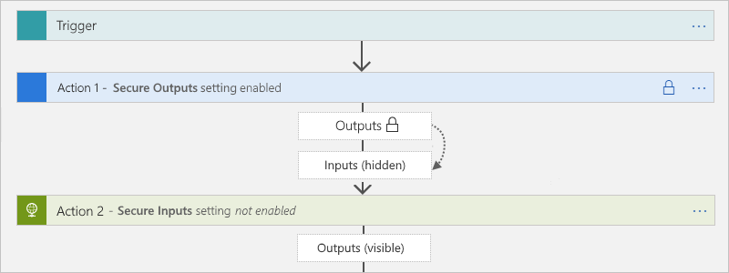

  The Compose, Parse JSON, and Response actions has only the **Secure Inputs** setting. When turned on, the setting also hides these actions' outputs. If these actions explicitly use the upstream secured outputs as inputs, Azure Logic Apps hides these actions' inputs and outputs, but *doesn't enable* these actions' **Secure Inputs** setting. If a downstream action explicitly uses the hidden outputs from the Compose, Parse JSON, or Response actions as inputs, Azure Logic Apps *doesn't hide this downstream action's inputs or outputs*.

  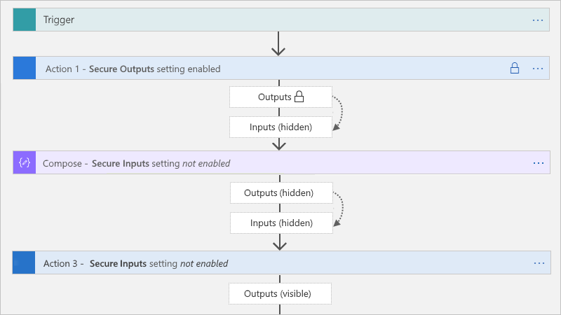

  **Secure Inputs setting**

  When you manually turn on **Secure Inputs** in a trigger or action, Azure Logic Apps hides these inputs in the run history. If a downstream action explicitly uses the visible outputs from that trigger or action as inputs, Azure Logic Apps hides this downstream action's inputs in the run history, but *doesn't enable* **Secure Inputs** in this action and doesn't hide this action's outputs.

  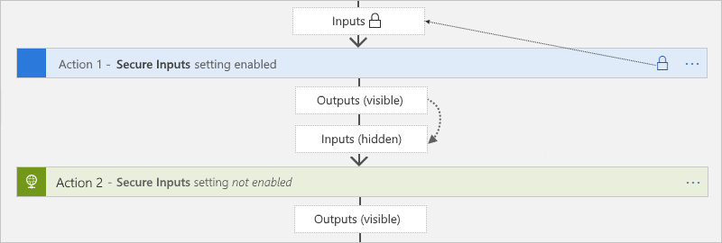

  If the Compose, Parse JSON, and Response actions explicitly use the visible outputs from the trigger or action that has the secured inputs, Azure Logic Apps hides these actions' inputs and outputs, but *doesn't enable* these action's **Secure Inputs** setting. If a downstream action explicitly uses the hidden outputs from the Compose, Parse JSON, or Response actions as inputs, Azure Logic Apps *doesn't hide this downstream action's inputs or outputs*.

  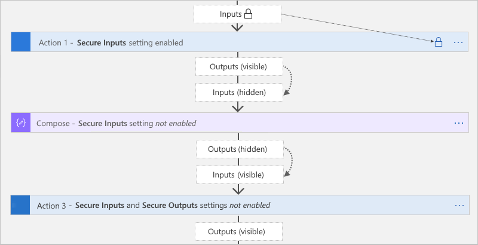

#### Secure inputs and outputs in the designer

1. In the [Azure portal](https://portal.azure.com), open your logic app workflow in the designer.

1. Based on your logic app resource type, follow these steps on the trigger or action where you want to secure sensitive data:

   **Consumption workflows**

   In the trigger or action's upper right corner, select the ellipses (**...**) button, and select **Settings**.

    [  ](./media/logic-apps-securing-a-logic-app/open-action-trigger-settings-consumption.png#lightbox)

   **Standard workflows**

   On the designer, select the trigger or action to open the information pane. On the **Settings** tab, expand **Security**.

   [ 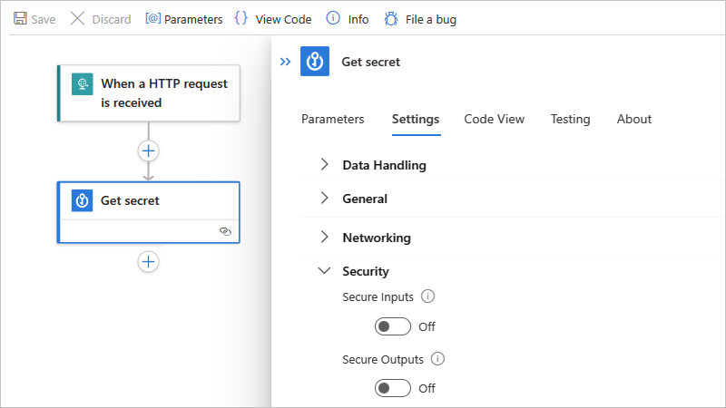 ](./media/logic-apps-securing-a-logic-app/open-action-trigger-settings-standard.png#lightbox)

1. Turn on either **Secure Inputs**, **Secure Outputs**, or both. For Consumption workflows, make sure to select **Done**.

   **Consumption workflows**

   [  ](./media/logic-apps-securing-a-logic-app/turn-on-secure-inputs-outputs-consumption.png#lightbox)

   The trigger or action now shows a lock icon in the title bar.

   [ ](./media/logic-apps-securing-a-logic-app/lock-icon-action-trigger-title-bar-consumption.png#lightbox)

   **Standard workflows**

   [ 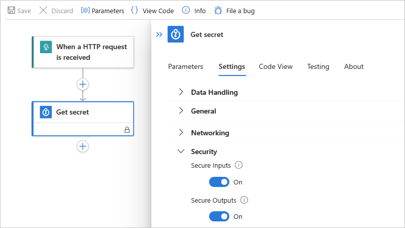 ](./media/logic-apps-securing-a-logic-app/turn-on-secure-inputs-outputs-standard.png#lightbox)

   Tokens that represent secured outputs from previous actions also show lock icons. For example, in a subsequent action, after you select a token for a secured output from the dynamic content list, that token shows a lock icon.

   **Consumption workflows**

   [ 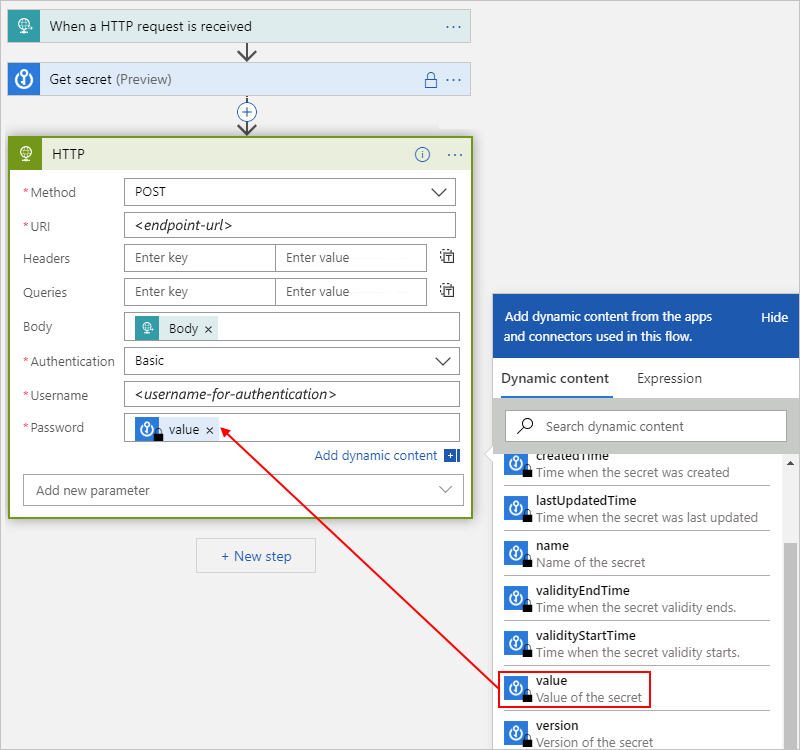 ](./media/logic-apps-securing-a-logic-app/select-secured-token-consumption.png#lightbox)

   **Standard workflows**

   [ 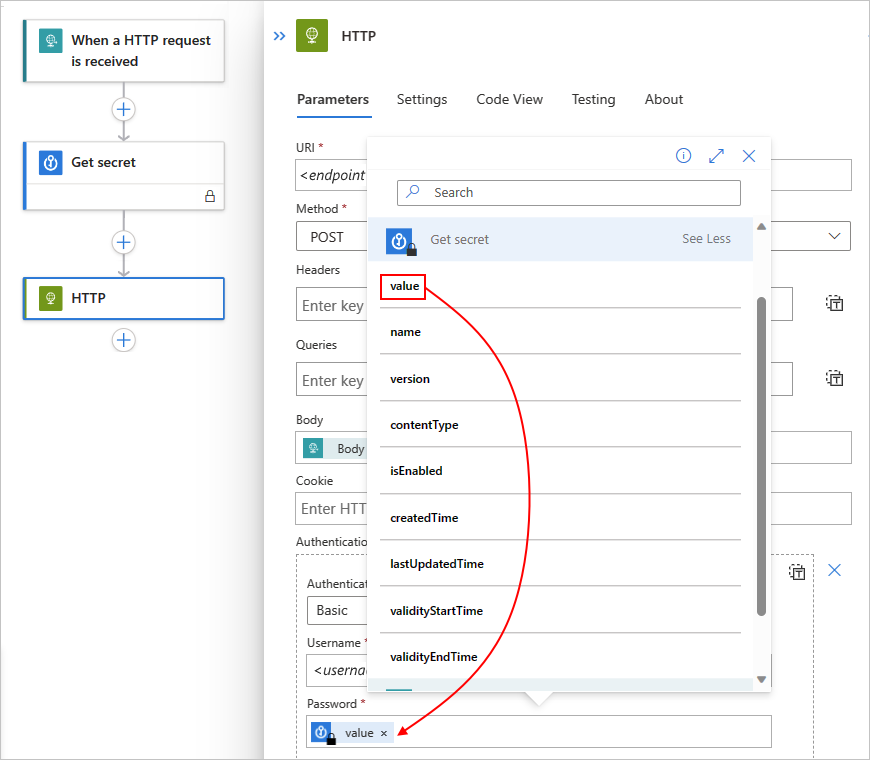 ](./media/logic-apps-securing-a-logic-app/select-secured-token-standard.png#lightbox)

1. After the workflow runs, you can view the history for that run.

   **Consumption workflows**

   1. On the logic app menu, select **Overview**. Under **Runs history**, select the run that you want to view.

   1. On the **Logic app run** pane, expand and select the actions that you want to review.

      If you chose to hide both inputs and outputs, those values now appear hidden.

      [ 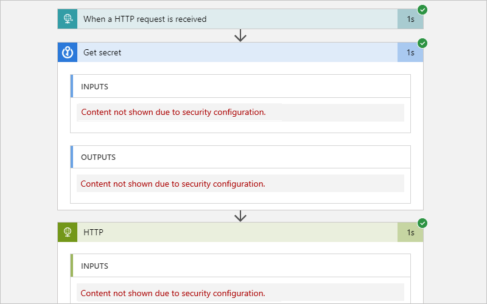 ](./media/logic-apps-securing-a-logic-app/hidden-data-run-history-consumption.png#lightbox)

   **Standard workflows**

   1. On the workflow menu, select **Overview**. Under **Run History**, select the run that you want to view.

   1. On the workflow run history pane, select the actions that you want to review.

      If you chose to hide both inputs and outputs, those values now appear hidden.

      [ 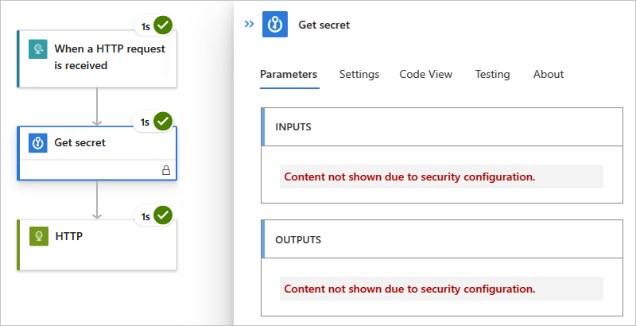](./media/logic-apps-securing-a-logic-app/hidden-data-run-history-standard.png#lightbox)

<a name="secure-data-code-view"></a>

#### Secure inputs and outputs in code view

In the underlying trigger or action definition, add or update the `runtimeConfiguration.secureData.properties` array with either or both of these values:

* `"inputs"`: Secures inputs in run history.
* `"outputs"`: Secures outputs in run history.

```json
"<trigger-or-action-name>": {
   "type": "<trigger-or-action-type>",
   "inputs": {
      <trigger-or-action-inputs>
   },
   "runtimeConfiguration": {
      "secureData": {
         "properties": [
            "inputs",
            "outputs"
         ]
      }
   },
   <other-attributes>
}
```

<a name="secure-action-parameters"></a>

## Access to parameter inputs

If you deploy across different environments, consider parameterizing the values in your workflow definition that vary based on those environments. That way, you can avoid hard-coded data by using an [Azure Resource Manager template](../azure-resource-manager/templates/overview.md) to deploy your logic app, protect sensitive data by defining secured parameters, and pass that data as separate inputs through the [template's parameters](../azure-resource-manager/templates/parameters.md) by using a [parameter file](../azure-resource-manager/templates/parameter-files.md).

For example, if you authenticate HTTP actions with [OAuth with Microsoft Entra ID](#azure-active-directory-oauth-authentication), you can define and obscure the parameters that accept the client ID and client secret that are used for authentication. To define these parameters in your logic app workflow, use the `parameters` section in your logic app's workflow definition and Resource Manager template for deployment. To help secure parameter values that you don't want shown when editing your logic app or viewing run history, define the parameters by using the `securestring` or `secureobject` type and use encoding as necessary. Parameters that have this type aren't returned with the resource definition and aren't accessible when viewing the resource after deployment. To access these parameter values during runtime, use the `@parameters('<parameter-name>')` expression inside your workflow definition. This expression is evaluated only at runtime and is described by the [Workflow Definition Language](../logic-apps/logic-apps-workflow-definition-language.md).

> [!NOTE]
> If you use a parameter in a request header or body, that parameter might be visible 
> when you view your workflow's run history and outgoing HTTP request. Make sure that 
> you also set your content access policies accordingly. You can also use 
> [obfuscation](#obfuscate) to hide inputs and outputs in your run history. 
> By default, `Authorization` headers aren't visible through inputs or outputs. 
> So if a secret is used there, that secret isn't retrievable.

For more information, review these sections in this topic:

* [Secure parameters in workflow definitions](#secure-parameters-workflow)
* [Secure data in run history by using obfuscation](#obfuscate)

If you [automate deployment for logic apps by using Resource Manager templates](../logic-apps/logic-apps-azure-resource-manager-templates-overview.md), you can define secured [template parameters](../azure-resource-manager/templates/parameters.md), which are evaluated at deployment, by using the `securestring` and `secureobject` types. To define template parameters, use your template's top level `parameters` section, which is separate and different from your workflow definition's `parameters` section. To provide the values for template parameters, use a separate [parameter file](../azure-resource-manager/templates/parameter-files.md).

For example, if you use secrets, you can define and use secured template parameters that retrieve those secrets from [Azure Key Vault](../key-vault/general/overview.md) at deployment. You can then reference the key vault and secret in your parameter file. For more information, review these topics:

* [Pass sensitive values at deployment by using Azure Key Vault](../azure-resource-manager/templates/key-vault-parameter.md)
* [Secure parameters in Azure Resource Manager templates](#secure-parameters-deployment-template) later in this topic

<a name="secure-parameters-workflow"></a>

### Secure parameters in workflow definitions (Consumption workflow)

To protect sensitive information in your logic app's workflow definition, use secured parameters so this information isn't visible after you save your logic app workflow. For example, suppose you have an HTTP action requires basic authentication, which uses a username and password. In the workflow definition, the `parameters` section defines the `basicAuthPasswordParam` and `basicAuthUsernameParam` parameters by using the `securestring` type. The action definition then references these parameters in the `authentication` section.

```json
"definition": {
   "$schema": "https://schema.management.azure.com/providers/Microsoft.Logic/schemas/2016-06-01/workflowdefinition.json#",
   "actions": {
      "HTTP": {
         "type": "Http",
         "inputs": {
            "method": "GET",
            "uri": "https://www.microsoft.com",
            "authentication": {
               "type": "Basic",
               "username": "@parameters('basicAuthUsernameParam')",
               "password": "@parameters('basicAuthPasswordParam')"
            }
         },
         "runAfter": {}
      }
   },
   "parameters": {
      "basicAuthPasswordParam": {
         "type": "securestring"
      },
      "basicAuthUsernameParam": {
         "type": "securestring"
      }
   },
   "triggers": {
      "manual": {
         "type": "Request",
         "kind": "Http",
         "inputs": {
            "schema": {}
         }
      }
   },
   "contentVersion": "1.0.0.0",
   "outputs": {}
}
```

<a name="secure-parameters-deployment-template"></a>

### Secure parameters in Azure Resource Manager templates (Consumption workflow)

A [Resource Manager template](../logic-apps/logic-apps-azure-resource-manager-templates-overview.md) for a logic app resource and workflow has multiple `parameters` sections. To protect passwords, keys, secrets, and other sensitive information, define secured parameters at the template level and workflow definition level by using the `securestring` or `secureobject` type. You can then store these values in [Azure Key Vault](../key-vault/general/overview.md) and use the [parameter file](../azure-resource-manager/templates/parameter-files.md) to reference the key vault and secret. Your template then retrieves that information at deployment. For more information, review [Pass sensitive values at deployment by using Azure Key Vault](../azure-resource-manager/templates/key-vault-parameter.md).

This list includes more information about these `parameters` sections:

* At the template's top level, a `parameters` section defines the parameters for the values that the template uses at *deployment*. For example, these values can include connection strings for a specific deployment environment. You can then store these values in a separate [parameter file](../azure-resource-manager/templates/parameter-files.md), which makes changing these values easier.

* Inside your logic app's resource definition, but outside your workflow definition, a `parameters` section specifies the values for your workflow definition's parameters. In this section, you can assign these values by using template expressions that reference your template's parameters. These expressions are evaluated at deployment.

* Inside your workflow definition, a `parameters` section defines the parameters that your logic app workflow uses at runtime. You can then reference these parameters inside your logic app's workflow by using workflow definition expressions, which are evaluated at runtime.

This example template that has multiple secured parameter definitions that use the `securestring` type:

| Parameter name | Description |
|----------------|-------------|
| `TemplatePasswordParam` | A template parameter that accepts a password that is then passed to the workflow definition's `basicAuthPasswordParam` parameter |
| `TemplateUsernameParam` | A template parameter that accepts a username that is then passed to the workflow definition's `basicAuthUserNameParam` parameter |
| `basicAuthPasswordParam` | A workflow definition parameter that accepts the password for basic authentication in an HTTP action |
| `basicAuthUserNameParam` | A workflow definition parameter that accepts the username for basic authentication in an HTTP action |
|||

```json
{
   "$schema": "https://schema.management.azure.com/schemas/2015-01-01/deploymentTemplate.json#",
   "contentVersion": "1.0.0.0",
   "parameters": {
      "LogicAppName": {
         "type": "string",
         "minLength": 1,
         "maxLength": 80,
         "metadata": {
            "description": "Name of the Logic App."
         }
      },
      "TemplatePasswordParam": {
         "type": "securestring"
      },
      "TemplateUsernameParam": {
         "type": "securestring"
      },
      "LogicAppLocation": {
         "type": "string",
         "defaultValue": "[resourceGroup().location]",
         "allowedValues": [
            "[resourceGroup().location]",
            "eastasia",
            "southeastasia",
            "centralus",
            "eastus",
            "eastus2",
            "westus",
            "northcentralus",
            "southcentralus",
            "northeurope",
            "westeurope",
            "japanwest",
            "japaneast",
            "brazilsouth",
            "australiaeast",
            "australiasoutheast",
            "southindia",
            "centralindia",
            "westindia",
            "canadacentral",
            "canadaeast",
            "uksouth",
            "ukwest",
            "westcentralus",
            "westus2"
         ],
         "metadata": {
            "description": "Location of the Logic App."
         }
      }
   },
   "variables": {},
   "resources": [
      {
         "name": "[parameters('LogicAppName')]",
         "type": "Microsoft.Logic/workflows",
         "location": "[parameters('LogicAppLocation')]",
         "tags": {
            "displayName": "LogicApp"
         },
         "apiVersion": "2016-06-01",
         "properties": {
            "definition": {
               "$schema": "https://schema.management.azure.com/providers/Microsoft.Logic/schemas/2016-06-01/workflowdefinition.json#",
               "actions": {
                  "HTTP": {
                     "type": "Http",
                     "inputs": {
                        "method": "GET",
                        "uri": "https://www.microsoft.com",
                        "authentication": {
                           "type": "Basic",
                           "username": "@parameters('basicAuthUsernameParam')",
                           "password": "@parameters('basicAuthPasswordParam')"
                        }
                     },
                  "runAfter": {}
                  }
               },
               "parameters": {
                  "basicAuthPasswordParam": {
                     "type": "securestring"
                  },
                  "basicAuthUsernameParam": {
                     "type": "securestring"
                  }
               },
               "triggers": {
                  "manual": {
                     "type": "Request",
                     "kind": "Http",
                     "inputs": {
                        "schema": {}
                     }
                  }
               },
               "contentVersion": "1.0.0.0",
               "outputs": {}
            },
            "parameters": {
               "basicAuthPasswordParam": {
                  "value": "[parameters('TemplatePasswordParam')]"
               },
               "basicAuthUsernameParam": {
                  "value": "[parameters('TemplateUsernameParam')]"
               }
            }
         }
      }
   ],
   "outputs": {}
}
```

<a name="authentication-types-supported-triggers-actions"></a>

## Authentication types for connectors that support authentication

The following table identifies the authentication types that are available on the connector operations where you can select an authentication type:

| Authentication type | Logic app & supported connectors |
|---------------------|----------------------------------|
| [Basic](#basic-authentication) | Azure API Management, Azure App Services, HTTP, HTTP + Swagger, HTTP Webhook |
| [Client Certificate](#client-certificate-authentication) | Azure API Management, Azure App Services, HTTP, HTTP + Swagger, HTTP Webhook |
| [Active Directory OAuth](#azure-active-directory-oauth-authentication) | - **Consumption**: Azure API Management, Azure App Services, Azure Functions, HTTP, HTTP + Swagger, HTTP Webhook <br><br>- **Standard**: Azure Automation, Azure Blob Storage, Azure Event Hubs, Azure Queues, Azure Service Bus, Azure Tables, HTTP, HTTP Webhook, SQL Server |
| [Raw](#raw-authentication) | Azure API Management, Azure App Services, Azure Functions, HTTP, HTTP + Swagger, HTTP Webhook |
| [Managed identity](#managed-identity-authentication) | **Built-in connectors**: <br><br>- **Consumption**: Azure API Management, Azure App Services, Azure Functions, HTTP, HTTP Webhook <br><br>- **Standard**: Azure Automation, Azure Blob Storage, Azure Event Hubs, Azure Queues, Azure Service Bus, Azure Tables, HTTP, HTTP Webhook, SQL Server <br><br>**Note**: Currently, most [built-in, service provider-based connectors](/azure/logic-apps/connectors/built-in/reference/) don't support selecting user-assigned managed identities for authentication. <br><br>**Managed connectors**: Microsoft Entra ID Protection, Azure App Service, Azure Automation, Azure Blob Storage, Azure Container Instance, Azure Cosmos DB, Azure Data Explorer, Azure Data Factory, Azure Data Lake, Azure Event Grid, Azure Event Hubs, Azure IoT Central V2, Azure IoT Central V3, Azure Key Vault, Azure Log Analytics, Azure Queues, Azure Resource Manager, Azure Service Bus, Azure Sentinel, Azure Table Storage, Azure VM, HTTP with Microsoft Entra ID, SQL Server |

<a name="secure-inbound-requests"></a>

## Access for inbound calls to request-based triggers

Inbound calls that a logic app receives through a request-based trigger, such as the [Request](../connectors/connectors-native-reqres.md) trigger or [HTTP Webhook](../connectors/connectors-native-webhook.md) trigger, support encryption and are secured with [Transport Layer Security (TLS) 1.2 at minimum](https://en.wikipedia.org/wiki/Transport_Layer_Security), previously known as Secure Sockets Layer (SSL). Azure Logic Apps enforces this version when receiving an inbound call to the Request trigger or a callback to the HTTP Webhook trigger or action. If you get TLS handshake errors, make sure that you use TLS 1.2. For more information, review [Solving the TLS 1.0 problem](/security/solving-tls1-problem).

For inbound calls, use the following cipher suites:

* TLS_ECDHE_ECDSA_WITH_AES_256_GCM_SHA384
* TLS_ECDHE_ECDSA_WITH_AES_128_GCM_SHA256
* TLS_ECDHE_RSA_WITH_AES_256_GCM_SHA384
* TLS_ECDHE_RSA_WITH_AES_128_GCM_SHA256
* TLS_ECDHE_ECDSA_WITH_AES_256_CBC_SHA384
* TLS_ECDHE_ECDSA_WITH_AES_128_CBC_SHA256
* TLS_ECDHE_RSA_WITH_AES_256_CBC_SHA384
* TLS_ECDHE_RSA_WITH_AES_128_CBC_SHA256

> [!NOTE]
> For backward compatibility, Azure Logic Apps currently supports some older cipher suites. However, *don't use* older cipher suites when you develop new apps because such suites *might not* be supported in the future. 
>
> For example, you might find the following cipher suites if you inspect the TLS handshake messages while using the Azure Logic Apps service or by using a security tool on your logic app's URL. Again, *don't use* these older suites:
>
>
> * TLS_ECDHE_ECDSA_WITH_AES_256_CBC_SHA
> * TLS_ECDHE_ECDSA_WITH_AES_128_CBC_SHA
> * TLS_ECDHE_RSA_WITH_AES_256_CBC_SHA
> * TLS_ECDHE_RSA_WITH_AES_128_CBC_SHA
> * TLS_RSA_WITH_AES_256_GCM_SHA384
> * TLS_RSA_WITH_AES_128_GCM_SHA256
> * TLS_RSA_WITH_AES_256_CBC_SHA256
> * TLS_RSA_WITH_AES_128_CBC_SHA256
> * TLS_RSA_WITH_AES_256_CBC_SHA
> * TLS_RSA_WITH_AES_128_CBC_SHA
> * TLS_RSA_WITH_3DES_EDE_CBC_SHA

The following list includes more ways that you can limit access to triggers that receive inbound calls to your logic app so that only authorized clients can call your logic app:

* [Generate shared access signatures (SAS)](#sas)
* [Enable OAuth with Microsoft Entra ID](#enable-oauth)
* [Expose your logic app with Azure API Management](#azure-api-management)
* [Restrict inbound IP addresses](#restrict-inbound-ip-addresses)

<a name="sas"></a>

### Generate shared access signatures (SAS)

Every request endpoint on a logic app has a [Shared Access Signature (SAS)](/rest/api/storageservices/constructing-a-service-sas) in the endpoint's URL, which follows this format:

`https://<request-endpoint-URI>sp=<permissions>sv=<SAS-version>sig=<signature>`

Each URL contains the `sp`, `sv`, and `sig` query parameter as described in this table:

| Query parameter | Description |
|-----------------|-------------|
| `sp` | Specifies permissions for the allowed HTTP methods to use. |
| `sv` | Specifies the SAS version to use for generating the signature. |
| `sig` | Specifies the signature to use for authenticating access to the trigger. This signature is generated by using the SHA256 algorithm with a secret access key on all the URL paths and properties. This key is kept encrypted, stored with the logic app, and is never exposed or published. Your logic app authorizes only those triggers that contain a valid signature created with the secret key. |
|||

Inbound calls to a request endpoint can use only one authorization scheme, either SAS or [OAuth with Microsoft Entra ID](#enable-oauth). Although using one scheme doesn't disable the other scheme, using both schemes at the same time causes an error because the service doesn't know which scheme to choose.

For more information about securing access with SAS, review these sections in this topic:

* [Regenerate access keys](#access-keys)
* [Create expiring callback URLs](#expiring-urls)
* [Create URLs with primary or secondary key](#primary-secondary-key)

<a name="access-keys"></a>

#### Regenerate access keys

To generate a new security access key at any time, use the Azure REST API or Azure portal. All previously generated URLs that use the old key are invalidated and no longer have authorization to trigger the logic app. The URLs that you retrieve after regeneration are signed with the new access key.

1. In the [Azure portal](https://portal.azure.com), open the logic app that has the key you want to regenerate.

1. On the logic app's menu, under **Settings**, select **Access Keys**.

1. Select the key that you want to regenerate and finish the process.

<a name="expiring-urls"></a>

#### Create expiring callback URLs

If you share the endpoint URL for a request-based trigger with other parties, you can generate callback URLs that use specific keys and have expiration dates. That way, you can seamlessly roll keys or restrict access to triggering your logic app based on a specific timespan. To specify an expiration date for a URL, use the [Azure Logic Apps REST API](/rest/api/logic/workflowtriggers), for example:

```http
POST /subscriptions/<Azure-subscription-ID>/resourceGroups/<Azure-resource-group-name>/providers/Microsoft.Logic/workflows/<workflow-name>/triggers/<trigger-name>/listCallbackUrl?api-version=2016-06-01
```

In the body, include the `NotAfter`property by using a JSON date string. This property returns a callback URL that's valid only until the `NotAfter` date and time.

<a name="primary-secondary-key"></a>

#### Create URLs with primary or secondary secret key

When you generate or list callback URLs for a request-based trigger, you can specify the key to use for signing the URL. To generate a URL that's signed by a specific key, use the [Logic Apps REST API](/rest/api/logic/workflowtriggers), for example:

```http
POST /subscriptions/<Azure-subscription-ID>/resourceGroups/<Azure-resource-group-name>/providers/Microsoft.Logic/workflows/<workflow-name>/triggers/<trigger-name>/listCallbackUrl?api-version=2016-06-01
```

In the body, include the `KeyType` property as either `Primary` or `Secondary`. This property returns a URL that's signed by the specified security key.

<a name="enable-oauth"></a>

<a name='enable-azure-active-directory-open-authentication-azure-ad-oauth'></a>

### Enable Microsoft Entra ID Open Authentication (Microsoft Entra ID OAuth)

In a Consumption logic app workflow that starts with a request-based trigger, you can authenticate inbound calls sent to the endpoint created by that trigger by enabling [Microsoft Entra ID OAuth](../active-directory/develop/index.yml). To set up this authentication, [define or add an authorization policy at the logic app level](#enable-azure-ad-inbound). This way, inbound calls use [OAuth access tokens](../active-directory/develop/access-tokens.md) for authorization.

When your logic app workflow receives an inbound request that includes an OAuth access token, Azure Logic Apps compares the token's claims against the claims specified by each authorization policy. If a match exists between the token's claims and all the claims in at least one policy, authorization succeeds for the inbound request. The token can have more claims than the number specified by the authorization policy.

In a Standard logic app workflow that starts with the Request trigger (but not a webhook trigger), you can use the Azure Functions provision for authenticating inbound calls sent to the endpoint created by that trigger by using a managed identity. This provision is also known as "**Easy Auth**". For more information, review [Trigger workflows in Standard logic apps with Easy Auth](https://techcommunity.microsoft.com/t5/integrations-on-azure-blog/trigger-workflows-in-standard-logic-apps-with-easy-auth/ba-p/3207378).

<a name='considerations-before-you-enable-azure-ad-oauth'></a>

#### Considerations before you enable Microsoft Entra ID OAuth

* An inbound call to the request endpoint can use only one authorization scheme, either OAuth with Microsoft Entra ID or [Shared Access Signature (SAS)](#sas). Although using one scheme doesn't disable the other scheme, using both schemes at the same time causes an error because Azure Logic Apps doesn't know which scheme to choose.

* Azure Logic Apps supports either the [bearer type](../active-directory/develop/active-directory-v2-protocols.md#tokens) or [proof-of-possession type (Consumption logic app only)](/entra/msal/dotnet/advanced/proof-of-possession-tokens) authorization schemes for Microsoft Entra ID OAuth access tokens. However, the `Authorization` header for the access token must specify either the `Bearer` type or `PoP` type. For more information about how to get and use a PoP token, see [Get a Proof of Possession (PoP) token](#get-pop).

* Your logic app resource is limited to a maximum number of authorization policies. Each authorization policy also has a maximum number of [claims](../active-directory/develop/developer-glossary.md#claim). For more information, review [Limits and configuration for Azure Logic Apps](../logic-apps/logic-apps-limits-and-config.md#authentication-limits).

* An authorization policy must include at least the **Issuer** claim, which has a value that starts with either `https://sts.windows.net/` or `https://login.microsoftonline.com/` (OAuth V2) as the Microsoft Entra issuer ID.

  For example, suppose that your logic app resource has an authorization policy that requires two claim types, **Audience** and **Issuer**. This sample [payload section](../active-directory/develop/access-token-claims-reference.md#payload-claims) for a decoded access token includes both claim types where `aud` is the **Audience** value and `iss` is the **Issuer** value:

  ```json
  {
      "aud": "https://management.core.windows.net/",
      "iss": "https://sts.windows.net/<Azure-AD-issuer-ID>/",
      "iat": 1582056988,
      "nbf": 1582056988,
      "exp": 1582060888,
      "_claim_names": {
         "groups": "src1"
      },
      "_claim_sources": {
         "src1": {
            "endpoint": "https://graph.windows.net/7200000-86f1-41af-91ab-2d7cd011db47/users/00000-f433-403e-b3aa-7d8406464625d7/getMemberObjects"
         }
      },
      "acr": "1",
      "aio": "AVQAq/8OAAAA7k1O1C2fRfeG604U9e6EzYcy52wb65Cx2OkaHIqDOkuyyr0IBa/YuaImaydaf/twVaeW/etbzzlKFNI4Q=",
      "amr": [
         "rsa",
         "mfa"
      ],
      "appid": "c44b4083-3bb0-00001-b47d-97400853cbdf3c",
      "appidacr": "2",
      "deviceid": "bfk817a1-3d981-4dddf82-8ade-2bddd2f5f8172ab",
      "family_name": "Sophia Owen",
      "given_name": "Sophia Owen (Fabrikam)",
      "ipaddr": "167.220.2.46",
      "name": "sophiaowen",
      "oid": "3d5053d9-f433-00000e-b3aa-7d84041625d7",
      "onprem_sid": "S-1-5-21-2497521184-1604012920-1887927527-21913475",
      "puid": "1003000000098FE48CE",
      "scp": "user_impersonation",
      "sub": "KGlhIodTx3XCVIWjJarRfJbsLX9JcdYYWDPkufGVij7_7k",
      "tid": "72f988bf-86f1-41af-91ab-2d7cd011db47",
      "unique_name": "SophiaOwen@fabrikam.com",
      "upn": "SophiaOwen@fabrikam.com",
      "uti": "TPJ7nNNMMZkOSx6_uVczUAA",
      "ver": "1.0"
   }
   ```

<a name='enable-azure-ad-oauth-as-the-only-option-to-call-a-request-endpoint'></a>

#### Enable Microsoft Entra ID OAuth as the only option to call a request endpoint

1. Set up your Request or HTTP webhook trigger with the capability to check the OAuth access token by [following the steps to include the 'Authorization' header in the Request or HTTP webhook trigger outputs](#include-auth-header).

   > [!NOTE]
   >
   > This step makes the `Authorization` header visible in the 
   > workflow's run history and in the trigger's outputs.

1. In the [Azure portal](https://portal.azure.com), open your Consumption logic app workflow in the designer.

1. On the trigger, in the upper right corner, select the ellipses (**...**) button, and then select **Settings**.

1. Under **Trigger Conditions**, select **Add**. In the trigger condition box, enter either of the following expressions, based on the token type you want to use, and select **Done**.

   `@startsWith(triggerOutputs()?['headers']?['Authorization'], 'Bearer')`

   -or-

   `@startsWith(triggerOutputs()?['headers']?['Authorization'], 'PoP')`

If you call the trigger endpoint without the correct authorization, the run history just shows the trigger as `Skipped` without any message that the trigger condition has failed.

<a name="get-pop"></a>

#### Get a Proof-of-Possession (PoP) token

The Microsoft Authentication Library (MSAL) libraries provide PoP tokens for you to use. If the logic app workflow that you want to call requires a PoP token, you can get this token using the MSAL libraries. The following samples show how to acquire PoP tokens:

* [A .NET Core daemon console application calling a protected Web API with its own identity](https://github.com/Azure-Samples/active-directory-dotnetcore-daemon-v2/tree/master/2-Call-OwnApi)

* [SignedHttpRequest aka PoP (Proof of Possession)](https://github.com/AzureAD/azure-activedirectory-identitymodel-extensions-for-dotnet/wiki/SignedHttpRequest-aka-PoP-(Proof-of-Possession))

To use the PoP token with your Consumption logic app, follow the next section to [set up OAuth with Microsoft Entra ID](#enable-azure-ad-inbound).

<a name="enable-azure-ad-inbound"></a>

<a name='enable-azure-ad-oauth-for-your-consumption-logic-app-resource'></a>

#### Enable Microsoft Entra ID OAuth for your Consumption logic app resource

Follow these steps for either the Azure portal or your Azure Resource Manager template:

<a name="define-authorization-policy-portal"></a>

#### [Portal](#tab/azure-portal)

In the [Azure portal](https://portal.azure.com), add one or more authorization policies to your logic app:

1. In the [Azure portal](https://portal.microsoft.com), open your logic app in the workflow designer.

1. On the logic app menu, under **Settings**, select **Authorization**. After the Authorization pane opens, select **Add policy**.

   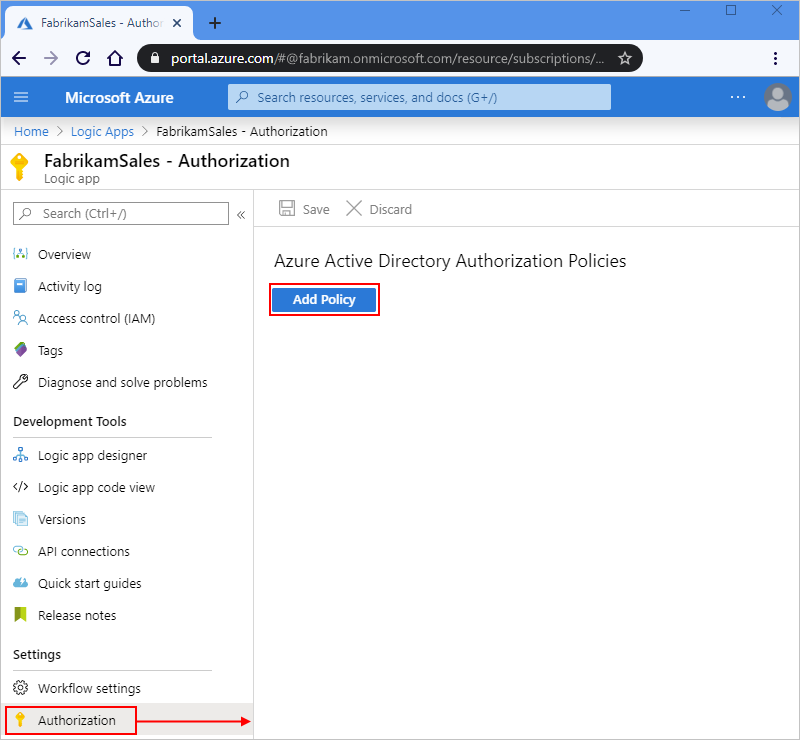

1. Provide information about the authorization policy by specifying the [claim types](../active-directory/develop/developer-glossary.md#claim) and values that your logic app expects in the access token presented by each inbound call to the Request trigger:

   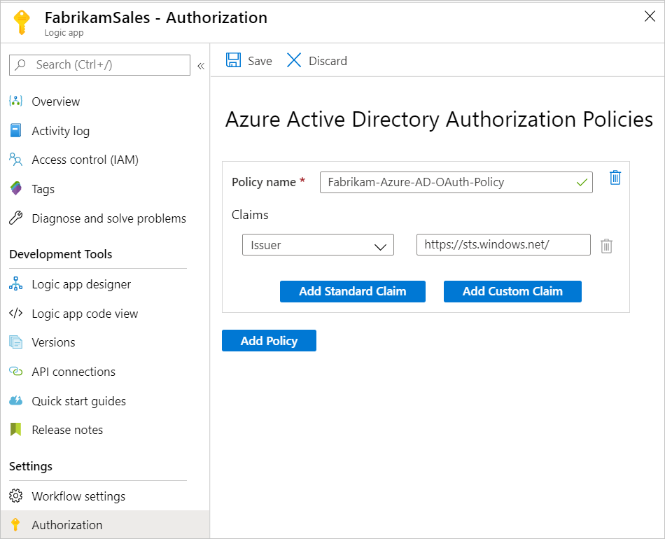

   | Property | Required | Type | Description |
   |----------|----------|------|-------------|
   | **Policy name** | Yes | String | The name that you want to use for the authorization policy |
   | **Policy type** | Yes | String | Either **AAD** for bearer type tokens or **AADPOP** for Proof-of-Possession type tokens. |
   | **Claims** | Yes | String | A key-value pair that specifies the claim type and value that the workflow's Request trigger expects in the access token presented by each inbound call to the trigger. You can add any standard claim you want by selecting **Add standard claim**. To add a claim that's specific to a PoP token, select **Add custom claim**. <br><br>Available standard claim types: <br><br>- **Issuer** <br>- **Audience** <br>- **Subject** <br>- **JWT ID** (JSON Web Token identifier) <br><br>Requirements: <br><br>- At a minimum, the **Claims** list must include the **Issuer** claim, which has a value that starts with `https://sts.windows.net/` or `https://login.microsoftonline.com/` as the Microsoft Entra issuer ID. <br><br>- Each claim must be a single string value, not an array of values. For example, you can have a claim with **Role** as the type and **Developer** as the value. You can't have a claim that has **Role** as the type and the values set to **Developer** and **Program Manager**. <br><br>- The claim value is limited to a [maximum number of characters](logic-apps-limits-and-config.md#authentication-limits). <br><br>For more information about these claim types, review [Claims in Microsoft Entra security tokens](../active-directory/develop/security-tokens.md#json-web-tokens-and-claims). You can also specify your own claim type and value. |

   The following example shows the information for a PoP token:

   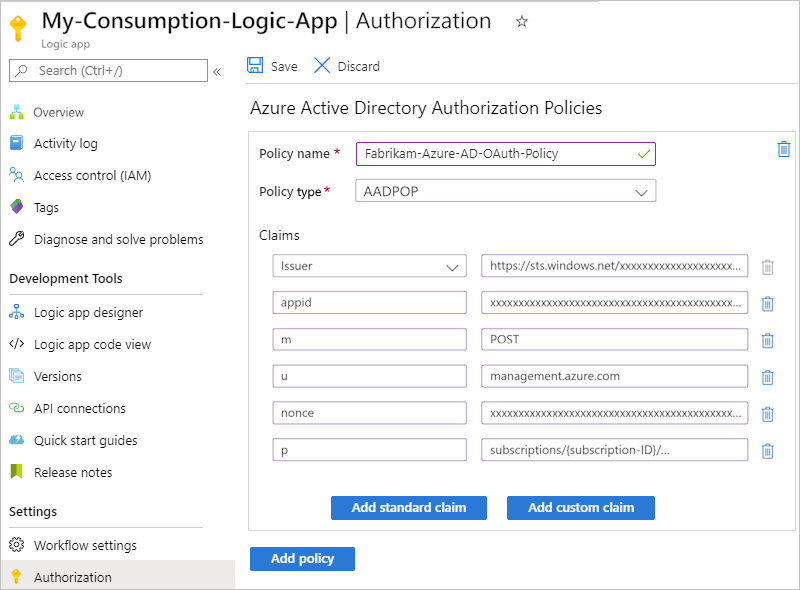

1. To add another claim, select from these options:

   * To add another claim type, select **Add standard claim**, select the claim type, and specify the claim value.

   * To add your own claim, select **Add custom claim**. For more information, review [how to provide optional claims to your app](../active-directory/develop/active-directory-optional-claims.md). Your custom claim is then stored as a part of your JWT ID; for example, `"tid": "72f988bf-86f1-41af-91ab-2d7cd011db47"`. 

1. To add another authorization policy, select **Add policy**. Repeat the previous steps to set up the policy.

1. When you're done, select **Save**.

1. To include the `Authorization` header from the access token in the request-based trigger outputs, review [Include 'Authorization' header in request and HTTP webhook trigger outputs](#include-auth-header).

Workflow properties such as policies don't appear in your workflow's code view in the Azure portal. To access your policies programmatically, call the following API through Azure Resource Manager: `https://management.azure.com/subscriptions/{Azure-subscription-ID}/resourceGroups/{Azure-resource-group-name}/providers/Microsoft.Logic/workflows/{your-workflow-name}?api-version=2016-10-01&_=1612212851820`. Make sure that you replace the placeholder values for your Azure subscription ID, resource group name, and workflow name.

<a name="define-authorization-policy-template"></a>

#### [Resource Manager Template](#tab/azure-resource-manager)

In your ARM template, define an authorization policy following these steps and syntax below:

1. In the `properties` section for your [logic app's resource definition](../logic-apps/logic-apps-azure-resource-manager-templates-overview.md#logic-app-resource-definition), add an `accessControl` object, if none exists, that contains a `triggers` object.

   For more information about the `accessControl` object, review [Restrict inbound IP ranges in Azure Resource Manager template](#restrict-inbound-ip-template) and [Microsoft.Logic workflows template reference](/azure/templates/microsoft.logic/2019-05-01/workflows).

1. In the `triggers` object, add an `openAuthenticationPolicies` object that contains the `policies` object where you define one or more authorization policies.

1. Provide a name for authorization policy, set the policy type to `AAD`, and include a `claims` array where you specify one or more claim types.

   At a minimum, the `claims` array must include the Issuer claim type where you set the claim's `name` property to `iss` and set the `value` to start with `https://sts.windows.net/` or `https://login.microsoftonline.com/` as the Microsoft Entra issuer ID. For more information about these claim types, review [Claims in Microsoft Entra security tokens](../active-directory/develop/security-tokens.md#json-web-tokens-and-claims). You can also specify your own claim type and value.

1. To include the `Authorization` header from the access token in the request-based trigger outputs, review [Include 'Authorization' header in request trigger outputs](#include-auth-header).

Here's the syntax to follow:

```json
"resources": [
   {
      // Start logic app resource definition
      "properties": {
         "state": "<Enabled-or-Disabled>",
         "definition": {<workflow-definition>},
         "parameters": {<workflow-definition-parameter-values>},
         "accessControl": {
            "triggers": {
               "openAuthenticationPolicies": {
                  "policies": {
                     "<policy-name>": {
                        "type": "AAD",
                        "claims": [
                           {
                              "name": "<claim-name>",
                              "value": "<claim-value>"
                           }
                        ]
                     }
                  }
               }
            },
         },
      },
      "name": "[parameters('LogicAppName')]",
      "type": "Microsoft.Logic/workflows",
      "location": "[parameters('LogicAppLocation')]",
      "apiVersion": "2016-06-01",
      "dependsOn": [
      ]
   }
   // End logic app resource definition
],
```

---

<a name="include-auth-header"></a>

#### Include 'Authorization' header in Request or HTTP webhook trigger outputs

For logic apps that [enable OAuth with Microsoft Entra ID](#enable-oauth) for authorizing inbound calls to access request-based triggers, you can enable the Request trigger or HTTP Webhook trigger outputs to include the `Authorization` header from the OAuth access token. In the trigger's underlying JSON definition, add and set the `operationOptions` property to `IncludeAuthorizationHeadersInOutputs`. Here's an example for the Request trigger:

```json
"triggers": {
   "manual": {
      "inputs": {
         "schema": {}
      },
      "kind": "Http",
      "type": "Request",
      "operationOptions": "IncludeAuthorizationHeadersInOutputs"
   }
}
```

For more information, review these topics:

* [Schema reference for trigger and action types - Request trigger](../logic-apps/logic-apps-workflow-actions-triggers.md#request-trigger)
* [Schema reference for trigger and action types - HTTP Webhook trigger](../logic-apps/logic-apps-workflow-actions-triggers.md#http-webhook-trigger)
* [Schema reference for trigger and action types - Operation options](../logic-apps/logic-apps-workflow-actions-triggers.md#operation-options)

<a name="azure-api-management"></a>

### Expose your logic app with Azure API Management

For more authentication protocols and options, consider exposing your logic app workflow as an API by using Azure API Management. This service provides rich monitoring, security, policy, and documentation capabilities for any endpoint. API Management can expose a public or private endpoint for your logic app. To authorize access to this endpoint, you can use OAuth with Microsoft Entra ID, client certificate, or other security standards. When API Management receives a request, the service sends the request to your logic app and makes any necessary transformations or restrictions along the way. To let only API Management call your logic app workflow, you can [restrict your logic app's inbound IP addresses](#restrict-inbound-ip).

For more information, review the following documentation:

* [About API Management](../api-management/api-management-key-concepts.md)
* [Protect a web API backend in Azure API Management by using OAuth 2.0 authorization with Microsoft Entra ID](../api-management/api-management-howto-protect-backend-with-aad.md)
* [Secure APIs using client certificate authentication in API Management](../api-management/api-management-howto-mutual-certificates-for-clients.md)
* [API Management authentication policies](../api-management/api-management-authentication-policies.md)

<a name="restrict-inbound-ip"></a>

### Restrict inbound IP addresses

Along with Shared Access Signature (SAS), you might want to specifically limit the clients that can call your logic app workflow. For example, if you manage your request endpoint by using [Azure API Management](../api-management/api-management-key-concepts.md), you can restrict your logic app workflow to accept requests only from the IP address for the [API Management service instance that you create](../api-management/get-started-create-service-instance.md).

Regardless of any IP addresses that you specify, you can still run a logic app workflow that has a request-based trigger by using the [Logic Apps REST API: Workflow Triggers - Run](/rest/api/logic/workflowtriggers/run) request or by using API Management. However, this scenario still requires [authentication](../active-directory/develop/authentication-vs-authorization.md) against the Azure REST API. All events appear in the Azure Audit Log. Make sure that you set access control policies accordingly.

To restrict the inbound IP addresses for your logic app workflow, follow the corresponding steps for either the Azure portal or your Azure Resource Manager template. A valid IP range uses these formats: *x.x.x.x/x* or *x.x.x.x-x.x.x.x*

<a name="restrict-inbound-ip-portal"></a>

#### [Portal](#tab/azure-portal)

In the Azure portal, IP address restriction affects both triggers *and* actions, contrary to the description in the portal under **Allowed inbound IP addresses**. To set up this filter separately for triggers and for actions, use the `accessControl` object in an Azure Resource Manager template for your logic app resource or the [Azure Logic Apps REST API: Workflow - Create Or Update operation](/rest/api/logic/workflows/createorupdate).

##### Consumption workflows

1. In the [Azure portal](https://portal.azure.com), open your logic app in the workflow designer.

1. On your logic app's menu, under **Settings**, select **Workflow settings**.

1. In the **Access control configuration** section, under **Allowed inbound IP addresses**, choose the path for your scenario:

   * To make your workflow callable using the [**Azure Logic Apps** built-in action](../logic-apps/logic-apps-http-endpoint.md), but only as a nested workflow, select **Only other Logic Apps**. This option works *only* when you use the **Azure Logic Apps** action to call the nested workflow.

     This option writes an empty array to your logic app resource and requires that only calls from parent workflows that use the built-in **Azure Logic Apps** action can trigger the nested workflow.

   * To make your workflow callable using the HTTP action, but only as a nested workflow, select **Specific IP ranges**. When the **IP ranges for triggers** box appears, enter the parent workflow's [outbound IP addresses](../logic-apps/logic-apps-limits-and-config.md#outbound). A valid IP range uses these formats: *x.x.x.x/x* or *x.x.x.x-x.x.x.x*

     > [!NOTE]
     > If you use the **Only other Logic Apps** option and the HTTP action to call your nested workflow, 
     > the call is blocked, and you get a "401 Unauthorized" error.

   * For scenarios where you want to restrict inbound calls from other IPs, when the **IP ranges for triggers** box appears, specify the IP address ranges that the trigger accepts. A valid IP range uses these formats: *x.x.x.x/x* or *x.x.x.x-x.x.x.x*

1. Optionally, under **Restrict calls to get input and output messages from run history to the provided IP addresses**, you can specify the IP address ranges for inbound calls that can access input and output messages in run history.

##### Standard workflows

1. In the [Azure portal](https://portal.azure.com), open your logic app resource.

1. On the logic app menu, under **Settings**, select **Networking**.

1. In the **Inbound Traffic** section, select **Access restriction**.

1. Create one or more rules to either **Allow** or **Deny** requests from specific IP ranges. You can also use the HTTP header filter settings and forwarding settings. A valid IP range uses these formats: *x.x.x.x/x* or *x.x.x.x-x.x.x.x*

   For more information, see [Blocking inbound IP addresses in Azure Logic Apps (Standard)](https://www.serverlessnotes.com/docs/block-inbound-ip-addresses-in-azure-logic-apps-standard).

<a name="restrict-inbound-ip-template"></a>

#### [Resource Manager Template](#tab/azure-resource-manager)

##### Consumption workflows 

In your ARM template, specify the allowed inbound IP address ranges in your logic app's resource definition by using the `accessControl` section. In this section, use the `triggers`, `actions`, and the optional `contents` sections as appropriate by including the `allowedCallerIpAddresses` section with the `addressRange` property and set the property value to the allowed IP range in *x.x.x.x/x* or *x.x.x.x-x.x.x.x* format.

* If your nested logic app workflow uses the **Only other Logic Apps** option, which permits inbound calls only from other logic app workflows that use the built-in Azure Logic Apps action, set the `allowedCallerIpAddresses` property to an empty array (**[]**), and *omit* the `addressRange` property.

* If your nested logic app workflow uses the **Specific IP ranges** option for other inbound calls, such as other logic app workflows that use the HTTP action, include the `allowedCallerIpAddresses` section, and set the `addressRange` property to the allowed IP range.

This example shows a logic app resource definition for a nested workflow that permits inbound calls only from other logic app workflows that use the built-in Azure Logic Apps action:

```json
{
   "$schema": "https://schema.management.azure.com/schemas/2015-01-01/deploymentTemplate.json#",
   "contentVersion": "1.0.0.0",
   "parameters": {},
   "variables": {},
   "resources": [
      {
         "name": "[parameters('LogicAppName')]",
         "type": "Microsoft.Logic/workflows",
         "location": "[parameters('LogicAppLocation')]",
         "tags": {
            "displayName": "LogicApp"
         },
         "apiVersion": "2016-06-01",
         "properties": {
            "definition": {
               <workflow-definition>
            },
            "parameters": {
            },
            "accessControl": {
               "triggers": {
                  "allowedCallerIpAddresses": []
               },
               "actions": {
                  "allowedCallerIpAddresses": []
               },
               // Optional
               "contents": {
                  "allowedCallerIpAddresses": []
               }
            },
            "endpointsConfiguration": {}
         }
      }
   ],
   "outputs": {}
}
```

This example shows a logic app resource definition for a nested workflow that permits inbound calls from logic app workflows that use the HTTP action:

```json
{
   "$schema": "https://schema.management.azure.com/schemas/2015-01-01/deploymentTemplate.json#",
   "contentVersion": "1.0.0.0",
   "parameters": {},
   "variables": {},
   "resources": [
      {
         "name": "[parameters('LogicAppName')]",
         "type": "Microsoft.Logic/workflows",
         "location": "[parameters('LogicAppLocation')]",
         "tags": {
            "displayName": "LogicApp"
         },
         "apiVersion": "2016-06-01",
         "properties": {
            "definition": {
               <workflow-definition>
            },
            "parameters": {
            },
            "accessControl": {
               "triggers": {
                  "allowedCallerIpAddresses": [
                     {
                        "addressRange": "192.168.12.0/23"
                     }
                  ]
               },
               "actions": {
                  "allowedCallerIpAddresses": [
                     {
                        "addressRange": "192.168.12.0/23"
                     }
                  ]
               }
            },
            "endpointsConfiguration": {}
         }
      }
   ],
   "outputs": {}
}
```

##### Standard workflows

In your ARM template, specify the allowed inbound IP address ranges in your logic app's resource definition by using the `Microsoft.Web/sites/config` section. In this section, under `properties`, add the `ipSecurityRestrictions` section, and use the `ipAddress`, `action="Deny" | "Allow"`, `tag=Default`, `priority`, and `name="Ports"` sections to define a rule and set the `ipAddress` to the allowed IP range in *x.x.x.x/x* or *x.x.x.x-x.x.x.x* format, for example:

```json
{
   "type": "Microsoft.Web/sites/config",
   "apiVersion": "2022-09-01",
   "name": "[concat(parameters('sites_My_Standard_Logic_App_name'), '/web')]",
   "location": "West US",
   "dependsOn": [
      "[resourceId('Microsoft.Web/sites', parameters('sites_My_Standard_Logic_App_name'))]"
   ],
   "tags": {
      "hidden-link: /app-insights-resource-id": "/subscriptions/{subscriptionID}/resourceGroups/Standard-RG/providers/Microsoft.Insights/components/My-Standard-Logic-App"
   },
   "properties": {
      "numberOfWorkers": 1,
      "defaultDocuments": [
         "Default.htm",
         "Default.html",
         "Default.asp",
         "index.htm",
         "index.html",
         "iisstart.htm",
         "default.aspx",
         "index.php"
      ],
      "netFrameworkVersion": "v6.0",
      "requestTracingEnabled": false,
      "remoteDebuggingEnabled": false,
      "httpLoggingEnabled": false,
      "acrUseManagedIdentityCreds": false,
      "logsDirectorySizeLimit": 35,
      "detailedErrorLoggingEnabled": false,
      "publishingUsername": "$My-Standard-Logic-App",
      "scmType": "None",
      "use32BitWorkerProcess": false,
      "webSocketsEnabled": false,
      "alwaysOn": false,
      "managedPipelineMode": "Integrated",
      "virtualApplications": [
         {
            "virtualPath": "/",
            "physicalPath": "site\\wwwroot",
            "preloadEnabled": false
         }
      ],
      "loadBalancing": "LeastRequests",
      "experiments": {
         "rampUpRules": []
      },
      "autoHealEnabled": false,
      "vnetRouteAllEnabled": false,
      "vnetPrivatePortsCount": 0,
      "publicNetworkAccess": "Enabled",
      "cors": {
         "supportCredentials": false
      },
      "localMySqlEnabled": false,
      "managedServiceIdentityId": 3065,
      "ipSecurityRestrictions": [
         {
            "ipAddress": "208.130.0.0/16",
            "action": "Deny",
            "tag": "Default",
            "priority": 100,
            "name": "Ports"
         },
         {
            "ipAddress": "Any",
            "action": "Deny",
            "priority": 2147483647,
            "name": "Deny all",
            "description": "Deny all access"
         }
      ],
      "ipSecurityRestrictionsDefaultAction": "Deny",
      "scmIpSecurityRestrictions": [
         {
            "ipAddress": "Any",
            "action": "Allow",
            "priority": 2147483647,
            "name": "Allow all",
            "description": "Allow all access"
         }
      ],
      "scmIpSecurityRestrictionsDefaultAction": "Allow",
      "scmIpSecurityRestrictionsUseMain": false,
      "http20Enabled": false,
      "minTlsVersion": "1.2",
      "scmMinTlsVersion": "1.2",
      "ftpsState": "FtpsOnly",
      "preWarmedInstanceCount": 1,
      "functionAppScaleLimit": 0,
      "functionsRuntimeScaleMonitoringEnabled": true,
      "minimumElasticInstanceCount": 1,
      "azureStorageAccounts": {}
   }
},
```

---

<a name="secure-outbound-requests"></a>

## Access for outbound calls to other services and systems

Based on the target endpoint's capability, outbound calls sent by the [HTTP trigger or HTTP action](../connectors/connectors-native-http.md), support encryption and are secured with [Transport Layer Security (TLS) 1.0, 1.1, or 1.2](https://en.wikipedia.org/wiki/Transport_Layer_Security), previously known as Secure Sockets Layer (SSL). Azure Logic Apps negotiates with the target endpoint over using the highest possible version that's supported. For example, if the target endpoint supports 1.2, the HTTP trigger or action uses 1.2 first. Otherwise, the connector uses the next highest supported version.

This list includes information about TLS/SSL self-signed certificates:

* For Consumption logic app workflows in the multi-tenant Azure Logic Apps environment, HTTP operations don't permit self-signed TLS/SSL certificates. If your logic app makes an HTTP call to a server and presents a TLS/SSL self-signed certificate, the HTTP call fails with a `TrustFailure` error.

* For Standard logic app workflows in the single-tenant Azure Logic Apps environment, HTTP operations support self-signed TLS/SSL certificates. However, you have to complete a few extra steps for this authentication type. Otherwise, the call fails. For more information, review [TLS/SSL certificate authentication for single-tenant Azure Logic Apps](../connectors/connectors-native-http.md#tlsssl-certificate-authentication).

  If you want to use client certificate or OAuth with Microsoft Entra ID with the "Certificate" credential type instead, you still have to complete a few extra steps for this authentication type. Otherwise, the call fails. For more information, review [Client certificate or OAuth with Microsoft Entra ID with the "Certificate" credential type for single-tenant Azure Logic Apps](../connectors/connectors-native-http.md#client-certificate-authentication).

Here are more ways that you can help secure endpoints that handle calls sent from your logic app workflows:

* [Add authentication to outbound requests](#add-authentication-outbound).

  When you use the HTTP trigger or action to send outbound calls, you can add authentication to the request that's sent by your logic app. For example, you can select these authentication types:

  * [Basic authentication](#basic-authentication)

  * [Client certificate authentication](#client-certificate-authentication)

  * [Active Directory OAuth authentication](#azure-active-directory-oauth-authentication)

  * [Managed identity authentication](#managed-identity-authentication)

* Restrict access from logic app workflow IP addresses.

  All calls to endpoints from logic app workflows originate from specific designated IP addresses that are based on your logic apps' regions. You can add filtering that accepts requests only from those IP addresses. To get these IP addresses, review [Limits and configuration for Azure Logic Apps](logic-apps-limits-and-config.md#firewall-ip-configuration).

* Improve security for connections to on-premises systems.

  Azure Logic Apps provides integration with these services to help provide more secure and reliable on-premises communication.

  * On-premises data gateway

    Many managed connectors in Azure Logic Apps facilitate secured connections to on-premises systems, such as File System, SQL, SharePoint, and DB2. The gateway sends data from on-premises sources on encrypted channels through the Azure Service Bus. All traffic originates as secured outbound traffic from the gateway agent. Learn [how the on-premises data gateway works](logic-apps-gateway-install.md#gateway-cloud-service).

  * Connect through Azure API Management

    [Azure API Management](../api-management/api-management-key-concepts.md) provides on-premises connection options, such as site-to-site virtual private network and [ExpressRoute](../expressroute/expressroute-introduction.md) integration for secured proxy and communication to on-premises systems. If you have an API that provides access to your on-premises system, and you exposed that API by creating an [API Management service instance](../api-management/get-started-create-service-instance.md), you can call that API in your logic app's workflow by selecting the built-in API Management trigger or action in the workflow designer.

    > [!NOTE]
    > The connector shows only those API Management services where you have permissions to view and connect,
    > but doesn't show consumption-based API Management services.

    Based on your logic app resource type, follow the corresponding steps:

    **Consumption workflows**

    1. On the workflow designer, under the search box, select **Built-in**. In the search box, find the built-in connector named **API Management**.

    1. Based on whether you're adding a trigger or an action, select the following operation:

       * Trigger: Select **Choose an Azure API Management trigger**.

       * Action: Select **Choose an Azure API Management action**.

       The following example adds a trigger:

       [ 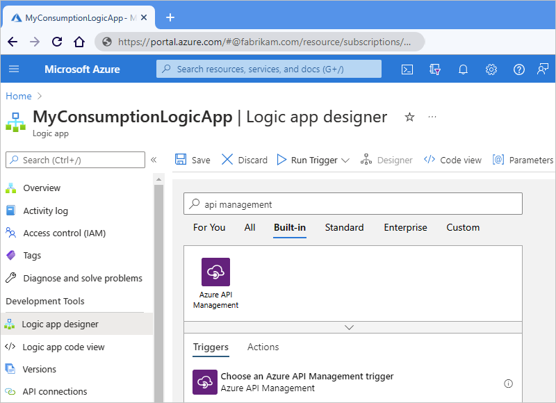 ](./media/logic-apps-securing-a-logic-app/select-api-management-consumption.png#lightbox)

    1. Select your previously created API Management service instance.

    1. Select the API operation to call.

       [ 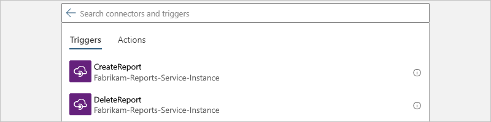 ](./media/logic-apps-securing-a-logic-app/select-api-consumption.png#lightbox)

    **Standard workflows**

    In Standard workflows, the **API Management** built-in connector provides only an action, not a trigger.

    1. On the workflow designer, either at the end of your workflow or between steps, select **Add an action**.

    1. After the **Add an action** pane opens, under the search box, from the **Runtime** list, select **In-App** to show only built-in connectors. Select the built-in action named **Call an Azure API Management API**.

       [ 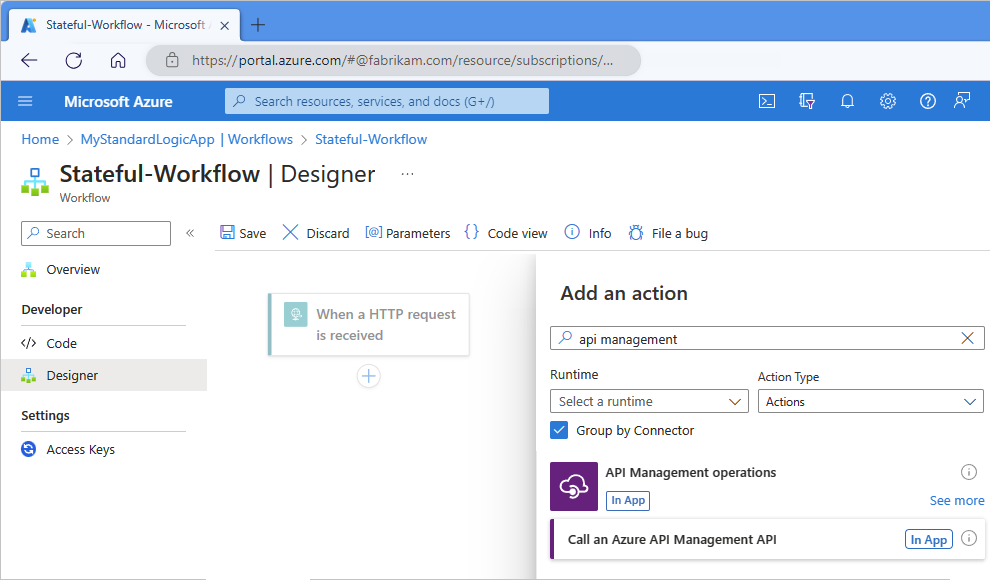 ](./media/logic-apps-securing-a-logic-app/select-api-management-standard.png#lightbox)

    1. Select your previously created API Management service instance.

    1. Select the API to call. If your connection is new, select **Create New**.

       [ 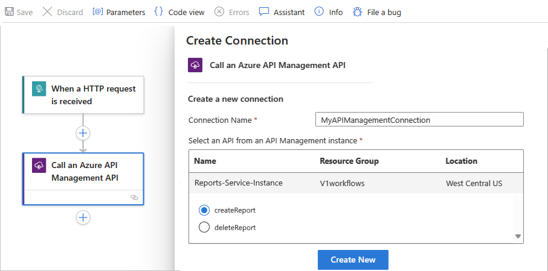 ](./media/logic-apps-securing-a-logic-app/select-api-standard.png#lightbox)

<a name="add-authentication-outbound"></a>

### Add authentication to outbound calls

HTTP and HTTPS endpoints support various kinds of authentication. On some triggers and actions that you use for sending outbound calls or requests to these endpoints, you can specify an authentication type. In the workflow designer, triggers and actions that support choosing an authentication type have an **Authentication** property. However, this property might not always appear by default. In these cases, on the trigger or action, open the **Add new parameter** list, and select **Authentication**.

> [!IMPORTANT]
> To protect sensitive information that your logic app handles, use secured parameters and encode data as necessary.
> For more information about using and securing parameters, review [Access to parameter inputs](#secure-action-parameters).

<a name="basic-authentication"></a>

#### Basic authentication

If the [Basic](../active-directory-b2c/secure-rest-api.md) option is available, specify these property values:

| Property (designer) | Property (JSON) | Required | Value | Description |
|---------------------|-----------------|----------|-------|-------------|
| **Authentication** | `type` | Yes | Basic | The authentication type to use |
| **Username** | `username` | Yes | <*user-name*>| The user name for authenticating access to the target service endpoint |
| **Password** | `password` | Yes | <*password*> | The password for authenticating access to the target service endpoint |

When you use [secured parameters](#secure-action-parameters) to handle and secure sensitive information, for example, in an [Azure Resource Manager template for automating deployment](../logic-apps/logic-apps-azure-resource-manager-templates-overview.md), you can use expressions to access these parameter values at runtime. This example HTTP action definition specifies the authentication `type` as `Basic` and uses the [parameters() function](../logic-apps/workflow-definition-language-functions-reference.md#parameters) to get the parameter values:

```json
"HTTP": {
   "type": "Http",
   "inputs": {
      "method": "GET",
      "uri": "@parameters('endpointUrlParam')",
      "authentication": {
         "type": "Basic",
         "username": "@parameters('userNameParam')",
         "password": "@parameters('passwordParam')"
      }
  },
  "runAfter": {}
}
```

<a name="client-certificate-authentication"></a>

#### Client Certificate authentication

If the [Client Certificate](../active-directory/authentication/active-directory-certificate-based-authentication-get-started.md) option is available, specify these property values:

| Property (designer) | Property (JSON) | Required | Value | Description |
|---------------------|-----------------|----------|-------|-------------|
| **Authentication** | `type` | Yes | **Client Certificate** <br>or <br>`ClientCertificate` | The authentication type to use. You can manage certificates with [Azure API Management](../api-management/api-management-howto-mutual-certificates.md). <p></p>**Note**: Custom connectors don't support certificate-based authentication for both inbound and outbound calls. |
| **Pfx** | `pfx` | Yes | <*encoded-pfx-file-content*> | The base64-encoded content from a Personal Information Exchange (PFX) file <p><p>To convert the PFX file into base64-encoded format, you can use PowerShell 7 by following these steps: <p>1. Save the certificate content into a variable: <p>   `$pfx_cert = [System.IO.File]::ReadAllBytes('c:\certificate.pfx')` <p>2. Convert the certificate content by using the `ToBase64String()` function and save that content to a text file: <p>   `[System.Convert]::ToBase64String($pfx_cert) | Out-File 'pfx-encoded-bytes.txt'` <p><p>**Troubleshooting**: If you use the `cert mmc/PowerShell` command, you might get this error: <p><p>`Could not load the certificate private key. Please check the authentication certificate password is correct and try again.` <p><p>To resolve this error, try converting the PFX file to a PEM file and back again by using the `openssl` command: <p><p>`openssl pkcs12 -in certificate.pfx -out certificate.pem` <br>`openssl pkcs12 -in certificate.pem -export -out certificate2.pfx` <p><p>Afterwards, when you get the base64-encoded string for the certificate's newly converted PFX file, the string now works in Azure Logic Apps. |
| **Password** | `password`| No | <*password-for-pfx-file*> | The password for accessing the PFX file |
|||||

When you use [secured parameters](#secure-action-parameters) to handle and secure sensitive information, for example, in an [Azure Resource Manager template for automating deployment](../logic-apps/logic-apps-azure-resource-manager-templates-overview.md), you can use expressions to access these parameter values at runtime. This example HTTP action definition specifies the authentication `type` as `ClientCertificate` and uses the [parameters() function](../logic-apps/workflow-definition-language-functions-reference.md#parameters) to get the parameter values:

```json
"HTTP": {
   "type": "Http",
   "inputs": {
      "method": "GET",
      "uri": "@parameters('endpointUrlParam')",
      "authentication": {
         "type": "ClientCertificate",
         "pfx": "@parameters('pfxParam')",
         "password": "@parameters('passwordParam')"
      }
   },
   "runAfter": {}
}
```

> [!IMPORTANT]
> If you have a **Logic App (Standard)** resource in single-tenant Azure Logic Apps, 
> and you want to use an HTTP operation with a TSL/SSL certificate, client certificate, 
> or Microsoft Entra ID Open Authentication (Microsoft Entra ID OAuth) with the `Certificate` 
> credential type, make sure to complete the extra setup steps for this authentication type. 
> Otherwise, the call fails. For more information, review 
> [Authentication in single-tenant environment](../connectors/connectors-native-http.md#single-tenant-authentication).

For more information about securing services by using client certificate authentication, review these topics:

* [Improve security for APIs by using client certificate authentication in Azure API Management](../api-management/api-management-howto-mutual-certificates-for-clients.md)
* [Improve security for back-end services by using client certificate authentication in Azure API Management](../api-management/api-management-howto-mutual-certificates.md)
* [Improve security for your RESTfuL service by using client certificates](../active-directory-b2c/secure-rest-api.md)
* [Certificate credentials for application authentication](../active-directory/develop/active-directory-certificate-credentials.md)
* [Use a TLS/SSL certificate in your code in Azure App Service](../app-service/configure-ssl-certificate-in-code.md)

<a name="azure-active-directory-oauth-authentication"></a>

<a name='azure-active-directory-open-authentication'></a>

#### Microsoft identity platform

On Request triggers, you can use [Microsoft identity platform](../active-directory/develop/index.yml), for authenticating incoming calls after you [set up Microsoft Entra authorization policies](#enable-oauth) for your logic app. For all other triggers and actions that provide the **Active Directory OAuth** authentication type for you to select, specify these property values:

| Property (designer) | Property (JSON) | Required | Value | Description |
|---------------------|-----------------|----------|-------|-------------|
| **Authentication** | `type` | Yes | **Active Directory OAuth** <br>or <br>`ActiveDirectoryOAuth` | The authentication type to use. Azure Logic Apps currently follows the [OAuth 2.0 protocol](../active-directory/develop/v2-overview.md). |
| **Authority** | `authority` | No | <*URL-for-authority-token-issuer*> | The URL for the authority that provides the access token, such as `https://login.microsoftonline.com/` for Azure global service regions. For other national clouds, review [Microsoft Entra authentication endpoints - Choosing your identity authority](../active-directory/develop/authentication-national-cloud.md#azure-ad-authentication-endpoints). |
| **Tenant** | `tenant` | Yes | <*tenant-ID*> | The tenant ID for the Microsoft Entra tenant |
| **Audience** | `audience` | Yes | <*resource-to-authorize*> | The resource that you want to use for authorization, for example, `https://management.core.windows.net/` |
| **Client ID** | `clientId` | Yes | <*client-ID*> | The client ID for the app requesting authorization |
| **Credential Type** | `credentialType` | Yes | Certificate <br>or <br>Secret | The credential type that the client uses for requesting authorization. This property and value don't appear in your logic app's underlying definition, but determines the properties that appear for the selected credential type. |
| **Secret** | `secret` | Yes, but only for the "Secret" credential type | <*client-secret*> | The client secret for requesting authorization |
| **Pfx** | `pfx` | Yes, but only for the "Certificate" credential type | <*encoded-pfx-file-content*> | The base64-encoded content from a Personal Information Exchange (PFX) file |
| **Password** | `password` | Yes, but only for the "Certificate" credential type | <*password-for-pfx-file*> | The password for accessing the PFX file |

When you use [secured parameters](#secure-action-parameters) to handle and secure sensitive information, for example, in an [Azure Resource Manager template for automating deployment](../logic-apps/logic-apps-azure-resource-manager-templates-overview.md), you can use expressions to access these parameter values at runtime. This example HTTP action definition specifies the authentication `type` as `ActiveDirectoryOAuth`, the credential type as `Secret`, and uses the [parameters() function](../logic-apps/workflow-definition-language-functions-reference.md#parameters) to get the parameter values:

```json
"HTTP": {
   "type": "Http",
   "inputs": {
      "method": "GET",
      "uri": "@parameters('endpointUrlParam')",
      "authentication": {
         "type": "ActiveDirectoryOAuth",
         "tenant": "@parameters('tenantIdParam')",
         "audience": "https://management.core.windows.net/",
         "clientId": "@parameters('clientIdParam')",
         "credentialType": "Secret",
         "secret": "@parameters('secretParam')"
     }
   },
   "runAfter": {}
}
```

> [!IMPORTANT]
> If you have a **Logic App (Standard)** resource in single-tenant Azure Logic Apps, 
> and you want to use an HTTP operation with a TSL/SSL certificate, client certificate, 
> or OAuth with Microsoft Entra ID with the `Certificate` 
> credential type, make sure to complete the extra setup steps for this authentication type. 
> Otherwise, the call fails. For more information, review 
> [Authentication in single-tenant environment](../connectors/connectors-native-http.md#single-tenant-authentication).

<a name="raw-authentication"></a>

#### Raw authentication

If the **Raw** option is available, you can use this authentication type when you have to use [authentication schemes](https://iana.org/assignments/http-authschemes/http-authschemes.xhtml) that don't follow the [OAuth 2.0 protocol](https://oauth.net/2/). With this type, you manually create the authorization header value that you send with the outgoing request, and specify that header value in your trigger or action.

The following example shows a sample header for an HTTPS request that follows the [OAuth 1.0 protocol](https://tools.ietf.org/html/rfc5849):

```text
Authorization: OAuth realm="Photos",
   oauth_consumer_key="dpf43f3p2l4k3l03",
   oauth_signature_method="HMAC-SHA1",
   oauth_timestamp="137131200",
   oauth_nonce="wIjqoS",
   oauth_callback="http%3A%2F%2Fprinter.example.com%2Fready",
   oauth_signature="74KNZJeDHnMBp0EMJ9ZHt%2FXKycU%3D"
```

In the trigger or action that supports raw authentication, specify these property values:

| Property (designer) | Property (JSON) | Required | Value | Description |
|---------------------|-----------------|----------|-------|-------------|
| **Authentication** | `type` | Yes | Raw | The authentication type to use |
| **Value** | `value` | Yes | <*authorization-header-value*> | The authorization header value to use for authentication |

When you use [secured parameters](#secure-action-parameters) to handle and secure sensitive information, for example, in an [Azure Resource Manager template for automating deployment](../logic-apps/logic-apps-azure-resource-manager-templates-overview.md), you can use expressions to access these parameter values at runtime. This example HTTP action definition specifies the authentication `type` as `Raw`, and uses the [parameters() function](../logic-apps/workflow-definition-language-functions-reference.md#parameters) to get the parameter values:

```json
"HTTP": {
   "type": "Http",
   "inputs": {
      "method": "GET",
      "uri": "@parameters('endpointUrlParam')",
      "authentication": {
         "type": "Raw",
         "value": "@parameters('authHeaderParam')"
      }
   },
   "runAfter": {}
}
```

<a name="managed-identity-authentication"></a>

#### Managed identity authentication

When the [managed identity](../active-directory/managed-identities-azure-resources/overview.md) option is available on the [trigger or action that supports managed identity authentication](#authentication-types-supported-triggers-actions), your logic app can use this identity for authenticating access to Azure resources that are protected by Microsoft Entra ID, rather than credentials, secrets, or Microsoft Entra tokens. Azure manages this identity for you and helps you secure your credentials because you don't have to manage secrets or directly use Microsoft Entra tokens. Learn more about [Azure services that support managed identities for Microsoft Entra authentication](../active-directory/managed-identities-azure-resources/services-support-managed-identities.md#azure-services-that-support-azure-ad-authentication).

* The **Logic App (Consumption)** resource type can use the system-assigned identity or a *single* manually created user-assigned identity.

* The **Logic App (Standard)** resource type supports having the [system-assigned managed identity *and* multiple user-assigned managed identities](create-managed-service-identity.md) enabled at the same time, though you still can only select one identity to use at any time.

  > [!NOTE]
  > By default, the system-assigned identity is already enabled to authenticate connections at run time. 
  > This identity differs from the authentication credentials or connection string that you use when you 
  > create a connection. If you disable this identity, connections won't work at run time. To view 
  > this setting, on your logic app's menu, under **Settings**, select **Identity**.

1. Before your logic app can use a managed identity, follow the steps in [Authenticate access to Azure resources by using managed identities in Azure Logic Apps](create-managed-service-identity.md). These steps enable the managed identity on your logic app and set up that identity's access to the target Azure resource.

1. Before an Azure function can use a managed identity, first [enable authentication for Azure functions](logic-apps-azure-functions.md#enable-authentication-functions).

1. In the trigger or action that supports using a managed identity, provide this information:

   **Built-in triggers and actions**

   | Property (designer) | Property (JSON) | Required | Value | Description |
   |---------------------|-----------------|----------|-------|-------------|
   | **Authentication** | `type` | Yes | **Managed Identity** <br>or <br>`ManagedServiceIdentity` | The authentication type to use |
   | **Managed Identity** | `identity` | No | <*user-assigned-identity-ID*> | The user-assigned managed identity to use. **Note**: Don't include this property when using the system-assigned managed identity. |
   | **Audience** | `audience` | Yes | <*target-resource-ID*> | The resource ID for the target resource that you want to access. <p>For example, `https://storage.azure.com/` makes the [access tokens](../active-directory/develop/access-tokens.md) for authentication valid for all storage accounts. However, you can also specify a root service URL, such as `https://fabrikamstorageaccount.blob.core.windows.net` for a specific storage account. <p>**Note**: The **Audience** property might be hidden in some triggers or actions. To make this property visible, in the trigger or action, open the **Add new parameter** list, and select **Audience**. <p><p>**Important**: Make sure that this target resource ID *exactly matches* the value that Microsoft Entra ID expects, including any required trailing slashes. So, the `https://storage.azure.com/` resource ID for all Azure Blob Storage accounts requires a trailing slash. However, the resource ID for a specific storage account doesn't require a trailing slash. To find these resource IDs, review [Azure services that support Microsoft Entra ID](../active-directory/managed-identities-azure-resources/services-support-managed-identities.md#azure-services-that-support-azure-ad-authentication). |

   When you use [secured parameters](#secure-action-parameters) to handle and secure sensitive information, for example, in an [Azure Resource Manager template for automating deployment](../logic-apps/logic-apps-azure-resource-manager-templates-overview.md), you can use expressions to access these parameter values at runtime. For example, this HTTP action definition specifies the authentication `type` as `ManagedServiceIdentity` and uses the [parameters() function](../logic-apps/workflow-definition-language-functions-reference.md#parameters) to get the parameter values:

   ```json
   "HTTP": {
      "type": "Http",
      "inputs": {
         "method": "GET",
         "uri": "@parameters('endpointUrlParam')",
         "authentication": {
            "type": "ManagedServiceIdentity",
            "audience": "https://management.azure.com/"
         },
      },
      "runAfter": {}
   }
   ```

   **Managed connector triggers and actions**

   | Property (designer) | Required | Value | Description |
   |---------------------|----------|-------|-------------|
   | **Connection name** | Yes | <*connection-name*> ||
   | **Managed identity** | Yes | **System-assigned managed identity** <br>or <br> <*user-assigned-managed-identity-name*> | The authentication type to use |

<a name="block-connections"></a>

## Block creating connections

If your organization doesn't permit connecting to specific resources by using their connectors in Azure Logic Apps, you can [block the capability to create those connections](../logic-apps/block-connections-connectors.md) for specific connectors in logic app workflows by using [Azure Policy](../governance/policy/overview.md). For more information, review [Block connections created by specific connectors in Azure Logic Apps](../logic-apps/block-connections-connectors.md).

<a name="isolation-logic-apps"></a>

## Isolation guidance for logic apps

You can use Azure Logic Apps in [Azure Government](../azure-government/documentation-government-welcome.md) supporting all impact levels in the regions described by the [Azure Government Impact Level 5 Isolation Guidance](../azure-government/documentation-government-impact-level-5.md). To meet these requirements, Azure Logic Apps supports the capability for you to create and run workflows in an environment with dedicated resources so that you can reduce the performance impact by other Azure tenants on your logic apps and avoid sharing computing resources with other tenants.

* To run your own code or perform XML transformation, [create and call an Azure function](../logic-apps/logic-apps-azure-functions.md), rather than use the [inline code capability](../logic-apps/logic-apps-add-run-inline-code.md) or provide [assemblies to use as maps](../logic-apps/logic-apps-enterprise-integration-maps.md), respectively. Also, set up the hosting environment for your function app to comply with your isolation requirements.

  For example, to meet Impact Level 5 requirements, create your function app with the [App Service plan](../azure-functions/dedicated-plan.md) using the [**Isolated** pricing tier](../app-service/overview-hosting-plans.md) along with an [App Service Environment (ASE)](../app-service/environment/intro.md) that also uses the **Isolated** pricing tier. In this environment, function apps run on dedicated Azure virtual machines and dedicated Azure virtual networks, which provide network isolation on top of compute isolation for your apps and maximum scale-out capabilities.

  For more information, review the following documentation:

  * [Azure App Service plans](../app-service/overview-hosting-plans.md)
  * [Azure Functions networking options](../azure-functions/functions-networking-options.md)
  * [Azure Dedicated Hosts for virtual machines](../virtual-machines/dedicated-hosts.md)
  * [Virtual machine isolation in Azure](../virtual-machines/isolation.md)
  * [Deploy dedicated Azure services into virtual networks](../virtual-network/virtual-network-for-azure-services.md)

* Based on whether you have Consumption or Standard logic app workflows, you have these options:

  * Standard logic app workflows can privately and securely communicate with an Azure virtual network through private endpoints that you set up for inbound traffic and virtual network integration for outbound traffic. For more information, review [Secure traffic between virtual networks and single-tenant Azure Logic Apps using private endpoints](secure-single-tenant-workflow-virtual-network-private-endpoint.md).

  * Consumption logic app workflows can run in an [integration service environment (ISE)](connect-virtual-network-vnet-isolated-environment-overview.md) where they can use dedicated resources and access resources protected by an Azure virtual network. However, the ISE resource retires on August 31, 2024, due to its dependency on Azure Cloud Services (classic), which retires at the same time.

    > [!IMPORTANT]
    > Some Azure virtual networks use private endpoints ([Azure Private Link](../private-link/private-link-overview.md)) 
    > for providing access to Azure PaaS services, such as Azure Storage, Azure Cosmos DB, or Azure SQL Database, 
    > partner services, or customer services that are hosted on Azure.
    >
    > If you want to create Consumption logic app workflows that need access to virtual networks with private endpoints, 
  > you *must create and run your Consumption workflows in an ISE*. Or, you can create Standard workflows instead, 
  > which don't need an ISE. Instead, your workflows can communicate privately and securely with virtual networks 
  > by using private endpoints for inbound traffic and virtual network integration for outbound traffic. For more information, see 
  > [Secure traffic between virtual networks and single-tenant Azure Logic Apps using private endpoints](secure-single-tenant-workflow-virtual-network-private-endpoint.md).

For more information about isolation, review the following documentation:

* [Isolation in the Azure Public Cloud](../security/fundamentals/isolation-choices.md)
* [Security for highly sensitive IaaS apps in Azure](/azure/architecture/reference-architectures/n-tier/high-security-iaas)

## Next steps

* [Azure security baseline for Azure Logic Apps](../logic-apps/security-baseline.md)
* [Automate deployment for Azure Logic Apps](../logic-apps/logic-apps-azure-resource-manager-templates-overview.md)
* [Monitor logic apps](monitor-workflows-collect-diagnostic-data.md)
