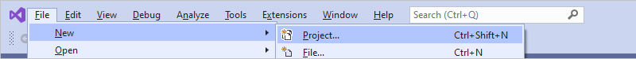
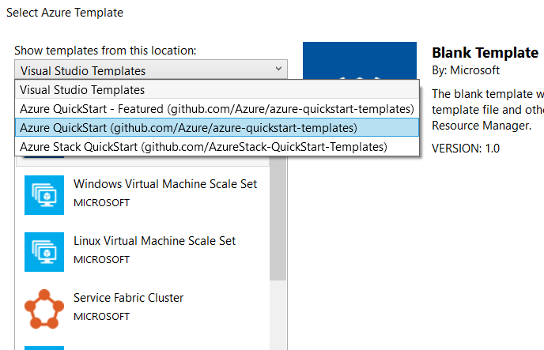
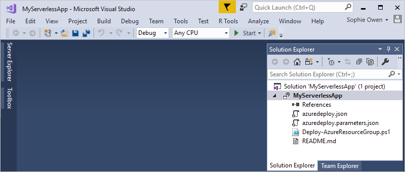
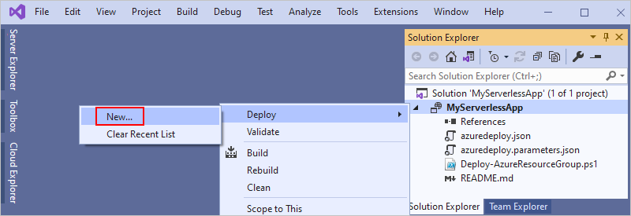
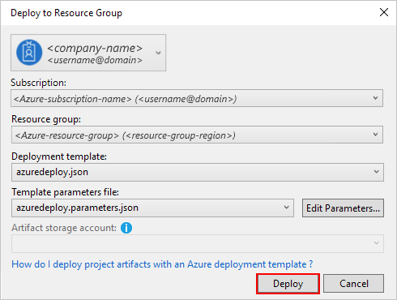
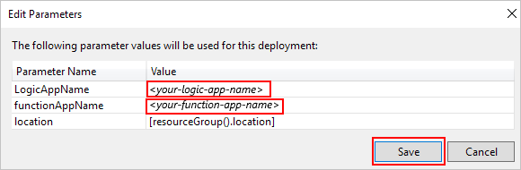
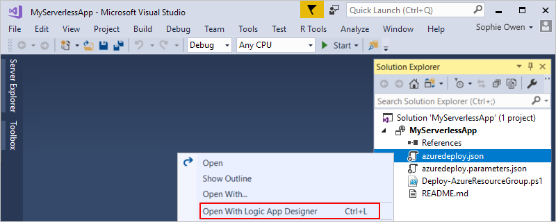
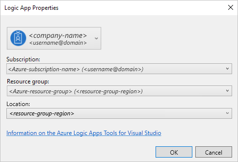
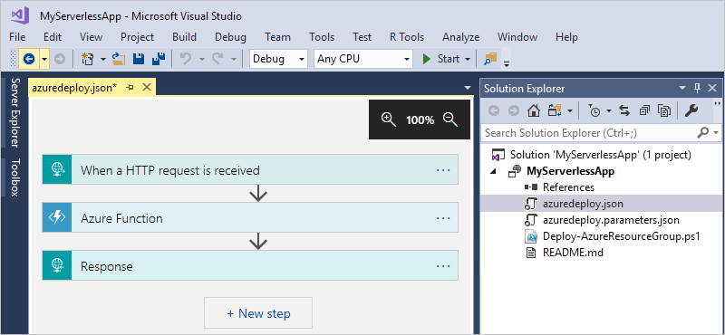

# Build your first serverless app by using Azure Logic Apps and Azure Functions in Visual Studio

You can quickly develop and deploy cloud apps by using the 
serverless tools and capabilities in Azure, such as 
[Azure Logic Apps](../logic-apps/logic-apps-overview.md) 
and [Azure Functions](../azure-functions/functions-overview.md). 
This article shows how to start building a serverless app, 
which uses a logic app that calls an Azure function, in Visual Studio. 
To learn more about serverless solutions in Azure, see 
[Azure Serverless with Functions and Logic Apps](../logic-apps/logic-apps-serverless-overview.md).

## Prerequisites

To build a serverless app in Visual Studio, you need:

* An Azure subscription. If you don't have an Azure subscription, 
[sign up for a free Azure account](https://azure.microsoft.com/free/).

* The following tools. If you don't have them already, download and install them.

  * [Visual Studio 2019, 2017, or 2015 (Community or other edition)](https://aka.ms/download-visual-studio). 
  This quickstart uses Visual Studio Community 2017, which is free.

    > [!IMPORTANT]
    > When you install Visual Studio 2019 or 2017, make sure 
    > that you select the **Azure development** workload.

  * [Microsoft Azure SDK for .NET (version 2.9.1 or later)](https://azure.microsoft.com/downloads/). 
  Learn more about [Azure SDK for .NET](https://docs.microsoft.com/dotnet/azure/dotnet-tools?view=azure-dotnet).

  * [Azure PowerShell](https://github.com/Azure/azure-powershell#installation).

  * Azure Logic Apps Tools for the Visual Studio version you want:

    * [Visual Studio 2019](https://aka.ms/download-azure-logic-apps-tools-visual-studio-2019)

    * [Visual Studio 2017](https://aka.ms/download-azure-logic-apps-tools-visual-studio-2017)

    * [Visual Studio 2015](https://aka.ms/download-azure-logic-apps-tools-visual-studio-2015)
  
    You can either download and install Azure Logic Apps Tools 
    directly from the Visual Studio Marketplace, or learn 
    [how to install this extension from inside Visual Studio](https://docs.microsoft.com/visualstudio/ide/finding-and-using-visual-studio-extensions). 
    Make sure that you restart Visual Studio after you finish installing.

  * [Azure Functions Core Tools](https://www.npmjs.com/package/azure-functions-core-tools) 
  for locally debugging Functions.

* Access to the web while using the embedded Logic App Designer.

  The designer requires an internet connection to create resources in Azure 
  and to read the properties and data from connectors in your logic app. 
  For example, if you use the Dynamics CRM Online connector, 
  the designer checks your CRM instance for available 
  default and custom properties.

## Create a resource group project

To get started, create an 
[Azure Resource Group project](../azure-resource-manager/templates/create-visual-studio-deployment-project.md) 
for your serverless app. In Azure, you create resources within a *resource group*, 
which is a logical collection you use for organizing, managing, and deploying 
resources for an entire app as a single asset. For a serverless app in Azure, 
your resource group includes resources for both Azure Logic Apps and Azure Functions. 
Learn more about [Azure resource groups and resources](../azure-resource-manager/management/overview.md).

1. Start Visual Studio and sign in by using your Azure account.

1. On the **File** menu, select **New** > **Project**.

   

1. Under **Installed**, select **Visual C#** or **Visual Basic**. 
Then, select **Cloud** > **Azure Resource Group**.

   > [!NOTE]
   > If the **Cloud** category or **Azure Resource Group** project doesn't exist, 
   > make sure that you installed the Azure SDK for Visual Studio.

   If you're using Visual Studio 2019, follow these steps:

   1. In the **Create a new project** box, select the 
   **Azure Resource Group** project template for either 
   Visual C# or Visual Basic, and then select **Next**.

   1. Provide the name and other project information that you want to use for the Azure resource group. When you're done, select **Create**.

1. Give your project a name and a location, and then select **OK**.

   Visual Studio prompts you to select a template from the templates list. 
   This example uses an Azure QuickStart template so that you can build a serverless 
   app that includes a logic app and a call to an Azure function.

   > [!TIP]
   > In scenarios where you don't want to predeploy your solution 
   > into an Azure resource group, you can use the blank **Logic App** 
   > template, which just creates an empty logic app.

1. From the **Show templates from this location** list, 
select **Azure QuickStart (github.com/Azure/azure-quickstart-templates)**.

1. In the search box, enter "logic-app" as your filter. 
From the results, select the **101-logic-app-and-function-app** template.

   

   Visual Studio creates and opens a solution for your resource group project. 
   The Azure QuickStart template that you selected creates a deployment template 
   named azuredeploy.json inside your resource group project. This deployment 
   template includes the definition for a simple logic app that is triggered by an 
   HTTP request, calls an Azure function, and returns the result as an HTTP response.

   

1. Next, deploy your solution to Azure. You must do this before you can open 
the deployment template and review the resources for your serverless app.

## Deploy your solution

Before you can open your logic app in the Logic App Designer in Visual Studio, 
you must have an Azure resource group that's already deployed in Azure. The designer 
can then create connections to resources and services in your logic app. For this task, 
follow these steps to deploy your solution from Visual Studio to the Azure portal:

1. In Solution Explorer, from your resource project's shortcut menu, 
select **Deploy** > **New**.

   

1. If they're not already selected, select your Azure subscription and the
resource group to which you want to deploy. Then, select **Deploy**.

   

1. If the **Edit Parameters** box appears, provide the resource names 
to use for your logic app and your Azure function app at deployment, 
and then save your settings. Make sure you use a globally unique name 
for your function app.

   

   When Visual Studio starts deployment to your specified resource group, 
   your solution's deployment status appears in the Visual Studio **Output** window. 
   After deployment finishes, your logic app is live in the Azure portal.

## Edit your logic app in Visual Studio

To edit your logic app after deployment, open your logic app by using the Logic App Designer in Visual Studio.

1. In Solution Explorer, from the shortcut menu of the azuredeploy.json file, 
select **Open With Logic App Designer**.

   

   > [!TIP]
   > If you don't have this command in Visual Studio 2019, check that you have the latest updates for Visual Studio.

1. After the **Logic App Properties** box appears, 
under **Subscription**, select your Azure subscription if it's not already selected. Under **Resource Group**, 
select the resource group and location where you deployed your solution, 
and then select **OK**.

   

   After the Logic App Designer opens, you can continue adding steps or change the workflow, and save your updates.

   

## Create your Azure Functions project

To create your Functions project and function by using JavaScript, 
Python, F#, PowerShell, Batch, or Bash, follow the steps in 
[Work with Azure Functions Core Tools](../azure-functions/functions-run-local.md). 
To develop your Azure function by using C# inside your solution, 
use a C# class library by following the steps in 
[Publish a .NET class library as a Function App](https://blogs.msdn.microsoft.com/appserviceteam/2017/03/16/publishing-a-net-class-library-as-a-function-app/).

## Deploy functions from Visual Studio

Your deployment template deploys any Azure functions that you have in your solution 
from the Git repo that's specified by variables in the azuredeploy.json file. 
If you create and author your Functions project in your solution, you can check 
that project into Git source control (for example, GitHub or Azure DevOps) 
and then update the `repo` variable so that the template deploys your Azure function.

## Manage logic apps and view run history

For logic apps already deployed in Azure, you can still edit, 
manage, view run history for, and disable those apps from Visual Studio.

1. From the **View** menu in Visual Studio, open **Cloud Explorer**.

1. Under **All subscriptions**, select the Azure subscription 
associated with the logic apps that you want to manage, and then select **Apply**.

1. Under **Logic Apps**, select your logic app. From that app's shortcut menu, 
select **Open with Logic App Editor**.

   > [!TIP]
   > If you don't have this command in Visual Studio 2019, check that you have the latest updates for Visual Studio.

You can now download the already published logic app into your resource group project. 
So, although you might have started a logic app in the Azure portal, you can still import 
and manage that app in Visual Studio. For more information, see 
[Manage logic apps with Visual Studio](../logic-apps/manage-logic-apps-with-visual-studio.md).

## Next steps

* [Manage logic apps with Visual Studio](manage-logic-apps-with-visual-studio.md)
