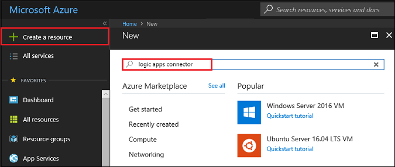
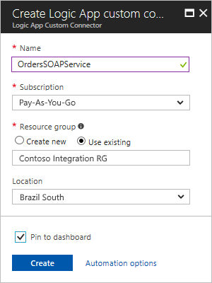
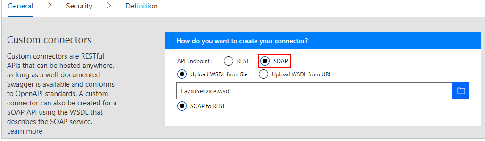
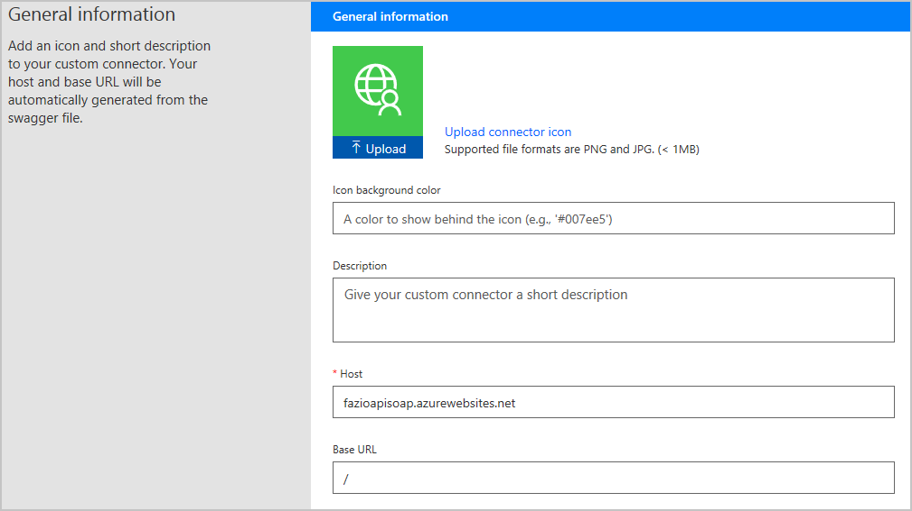
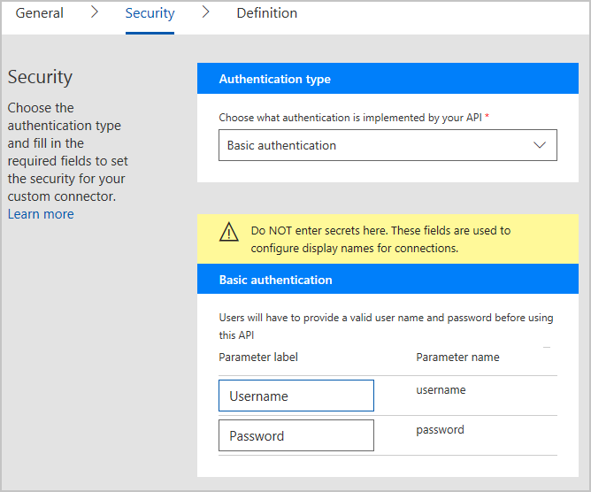
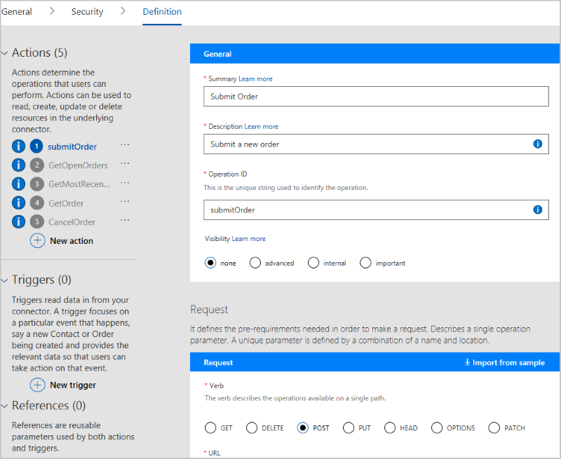
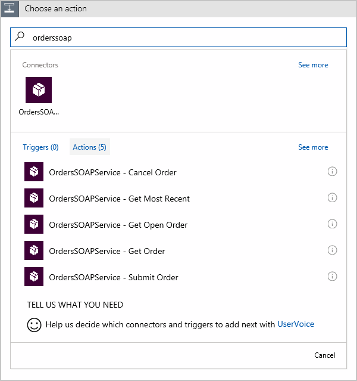

# SOAP connector overview

Custom connectors allow you to call APIs, services and systems that aren't available as prebuilt connectors. In this document we will cover how you can build a custom connector using WSDL that describes your SOAP service. The SOAP connector has its own triggers and actions and can be used like prebuilt connectors in your logic app workflows to integrate with SOAP services.

## Prerequisites

To register your soap connector, you need these items:

* An Azure subscription. If you don't have a subscription, 
you can start with a [free Azure account](https://azure.microsoft.com/free/). 
Otherwise, sign up for a [Pay-As-You-Go subscription](https://azure.microsoft.com/pricing/purchase-options/).

* Any item here:
  * A URL to an WSDL that defines your SOAP service
  * A WSDL file that defines your SOAP service

  For this tutorial, you can use our example 
  [Orders SOAP Serrvice](http://fazioapisoap.azurewebsites.net/FazioService.svc?singleWsdl).

* A WSDL file that define your SOAP service and the APIs

  For this tutorial, you can use the 
  [sample Azure Resources Manager OpenAPI file](http://pwrappssamples.blob.core.windows.net/samples/AzureResourceManager.json).

* Optional: An image to use as an icon for your custom connector

* The host location for your API

## 1. Create your connector

1. In the Azure portal, on the main Azure menu, choose **New**. 
In the search box, enter "logic apps connector" as your filter, 
and press Enter.

   

2. From the results list, choose **Logic Apps Connector** > **Create**.

   

3. Provide details for registering your connector 
as described in the table. When you're done, 
choose **Pin to dashboard** > **Create**.

   

   | Property | Suggested value | Description | 
   | -------- | --------------- | ----------- | 
   | **Name** | *soap-connector-name* | Provide a name for your connector. | 
   | **Subscription** | *Azure-subscription-name* | Select your Azure subscription. | 
   | **Resource group** | *Azure-resource-group-name* | Create or select an Azure group for organizing your Azure resources. | 
   | **Location** | *deployment-region* | Select a deployment region for your connector. | 
   |||| 

   After Azure deploys your connector, 
   the custom connector menu opens automatically. 
   If not, choose your custom connector from the Azure dashboard.

## 2. Define your connector

Now specify the WSDL file or URL for creating your connector, 
the authentication that your connector uses, 
the actions and triggers that your custom connector provides, 
and parameters that actions and triggers can use.

### 2a. Specify the WSDL file or URL for your connector

1. In your connector's menu, if not already selected, 
choose **Logic Apps Connector**. In the toolbar, choose **Edit**.

   

2. Choose **General** so that you can provide the details 
in these tables for creating, securing, and defining the 
actions and triggers for your soap connector.

   1. For **Custom connectors**, select **API Endpoint** as **SOAP** 
   so you can provide the WSDL file that describes your API.

      

      | Option | Format |Description | 
      | ------ | ------ | ----------- | 
      | **Upload WSDL from file** | *WSDL-file* | Browse to the location for your WSDL file, and select that file. | 
      | **Upload WSDL from URL** | http://*path-to-wsdl-file* | Provide the URL for your service's WSDL file. | 
      | **SOAP to REST** | *choose the radio button* | Transform APIs in SOAP service into REST APIs. | 
      |||| 

   2. For **General information**, upload an icon for your connector. 
   Typically, the **Description**, **Host**, and **Base URL** fields 
   are automatically populated from your WSDL file. 
   But if they're not, add this information as described in the table, 
   and choose **Continue**. 

      

      | Option or setting | Format | Description | 
      | ----------------- | ------ | ----------- | 
      | **Upload Icon** | *png-or-jpg-file-under-1-MB* | An icon that represents your connector 
Color: Preferably a white logo against a color background. 
Dimensions: A ~160 pixel logo inside a 230 pixel square | 
      | **Icon background color** | *icon-brand-color-hexadecimal-code* | 
The color behind your icon that matches the background color in your icon file. 
Format: Hexadecimal. For example, #007ee5 represents the color blue. | 
      | **Description** | *connector-description* | Provide a short description for your connector. | 
      | **Host** | *connector-host* | Provide the host domain for your SOAP service. | 
      | **Base URL** | *connector-base-URL* | Provide the base URL for your SOAP service. | 
      |||| 

### 2b. Describe the authentication that your connector uses

1. Now choose **Security** so you can review or describe the authentication 
that your connector uses. Authentication makes sure that your users' 
identities flow appropriately between your service and any clients.

   By default **No Authentication** is selected in the **Authnetication Type** for your connector.
   Choose **Edit** if you want to change the authentication to **Basic Authentication**.

   

   
2. To save your connector after entering the security information, 
at the top of the page, choose **Update connector**, 
then choose **Continue**. 

### 2c. Review, update, or define actions and triggers for your connector

1. Now choose **Definition** so you can review, edit, 
or define new actions and triggers that users can add to their workflows.

   Actions and triggers are based on the operations defined in your OpenWSDL file , which automatically populate the **Definition** page 
   and include the request and response values. So, if the required operations 
   already appear here, you can go to the next step in the registration 
   process without making changes on this page.

   

2. Optionally, if you want to edit existing actions and triggers, 
or add new ones, [continue with these steps](logic-apps-custom-connector-register.md).

## 3. Finish creating your connector

When you're ready, choose **Update Connector** so you can deploy your connector. 

Congratulations! Now when you create a logic app, 
you can find your connector in Logic Apps Designer, 
and add that connector to your logic app.

## Share your connector with other Logic Apps users

Registered but uncertified custom connectors work like 
Microsoft-managed connectors, but are visible and available 
*only* to the connector's author and users who have the same 
Azure Active Directory tenant and Azure subscription 
for logic apps in the region where those apps are deployed. 
Although sharing is optional, you might have scenarios where 
you want to share your connectors with other users. 

> [!IMPORTANT]
> If you share a connector, others might start to depend on that connector. 
> ***Deleting your connector deletes all connections to that connector.***
 
To share your connector with external users outside these boundaries, 
for example, with all Logic Apps users, 
[submit your connector for Microsoft certification](../logic-apps/custom-connector-submit-certification.md).

## FAQ

**Q:** Are there any limits for custom connectors?  
**A:** Yes, see the [custom connector limits here](../logic-apps/logic-apps-limits-and-config.md#custom-connector-limits).

## Get support

* For support with development and onboarding, 
or to request features that aren't available in the registration wizard, 
contact [condevhelp@microsoft.com](mailto:condevhelp@microsoft.com).
Microsoft monitors this account for developer questions and problems, 
and routes them to the appropriate team.

* To ask or answer questions, or see what other Azure Logic Apps users are doing, 
visit the [Azure Logic Apps forum](https://social.msdn.microsoft.com/Forums/en-US/home?forum=azurelogicapps).

* To help improve Logic Apps, vote on or submit ideas at the 
[Logic Apps user feedback site](http://aka.ms/logicapps-wish). 

## Next steps

* [Optional: Certify your connector](../logic-apps/custom-connector-submit-certification.md)
* [Custom connector FAQ](../logic-apps/custom-connector-faq.md)