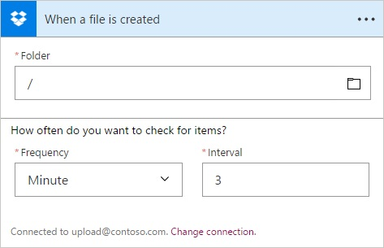
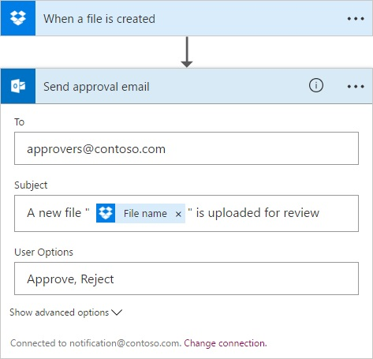
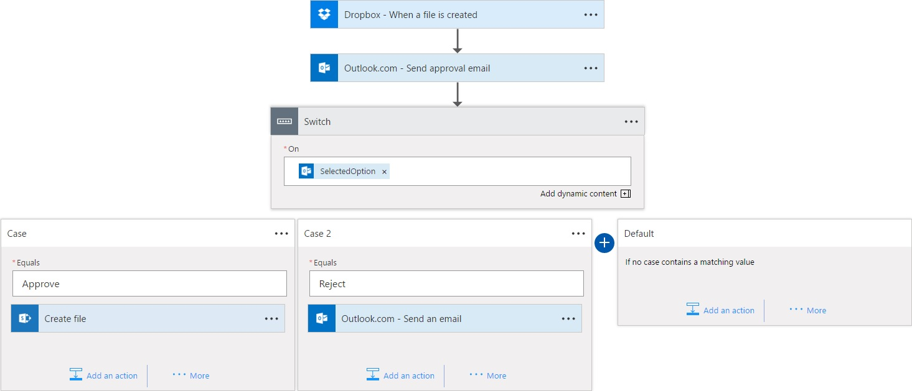

# Perform different actions in logic apps with a switch statement

When authoring a workflow, you often have to take different actions based on the value of an object or expression. 
For example, you might want your logic app to behave differently based on the status code of an HTTP request, 
or an option selected in an email.

You can use a switch statement to implement these scenarios. Your logic app can evaluate a token or expression, 
and choose the case with the same value to execute the specified actions. Only one case should match the switch statement.

> [!TIP]
> Like all programming languages, switch statements support only equality operators. 
> If you need other relational operators, such as "greater than", use a condition statement.
> To ensure deterministic execution behavior, cases must contain a unique and static value instead of dynamic tokens or expression.

## Prerequisites

- An active Azure subscription. If you don't have an active Azure subscription, 
[create a free account](https://azure.microsoft.com/free/), or try [Logic Apps for free](https://tryappservice.azure.com/).
- [Basic knowledge about logic apps](logic-apps-what-are-logic-apps.md)

## Add a switch statement to your workflow

To show how a switch statement works, this example creates a logic app that monitors files uploaded to Dropbox. 
When the new files are uploaded, the logic app sends email to an approver who chooses whether to transfer those files to SharePoint. 
The app uses a switch statement that performs different actions based on the value that the approver selects.

1. Create a logic app, and select this trigger: **Dropbox - When a file is created**.

   

2. Under the trigger, add this action: **Outlook.com - Send approval email**

   > [!TIP]
   > Logic apps also support sending approval email scenarios from an Office 365 Outlook account.

   - If you don't have an existing connection, you're prompted to create one.
   - Fill in the required fields. For example, under **To**, specify the email address for sending the approver email.
   - Under **User Options**, enter `Approve, Reject`.

   

3. Add a switch statement.

   - Select **+ New step** > **... More** > **Add a switch case**. 
   - Now we want to select the action to perform based on the `SelectedOptions` output from the *Send approval email* action. 
   You can find this field in the **Add dynamic content** selector.
   - Use *Case 1* to handle when the approver selects `Approve`.
     - If approved, copy the original file to SharePoint Online with the [**SharePoint Online - Create file** action](../connectors/connectors-create-api-sharepointonline.md).
     - Add another action within the case to notify users that a new file is available on SharePoint.
   - Add another case to handle when user selects `Reject`.
     - If rejected, send a notification email informing other approvers that the file is rejected and no further action is required.
   - `SelectedOptions` provides only two options, so we can leave the **Default** case empty.

   

   > [!NOTE]
   > A switch statement needs at least one case in addition to the default case.

4. After the switch statement, delete the original file uploaded to Dropbox 
by adding this action: **Dropbox - Delete file**

5. Save your logic app. Test your app by uploading a file to Dropbox. 
You should receive an approval email shortly. Select an option, and observe the behavior.

   > [!TIP]
   > Check out how to [monitor your logic apps](logic-apps-monitor-your-logic-apps.md).

## Understand the code behind switch statements

Now that you successfully created a logic app using a switch statement, 
let's look at the code definition behind the switch statement.

```json
"Switch": {
	"type": "Switch",
	"expression": "@body('Send_approval_email')?['SelectedOption']",
	"cases": {
		"Case 1" : {
			"case" : "Approved",
			"actions" : {}
		},
		"Case 2" : {
			"case" : "Rejected",
			"actions" : {}
		}
	},
	"default": {
		"actions": {}
	},
	"runAfter": {
		"Send_approval_email": [
			"Succeeded"
		]
	}
}
```

* `"Switch"` is the name of the switch statement, which you can rename for readability. 
* `"type": "Switch"` indicates that the action is a switch statement. 
* `"expression"` is the approver's selected option in this example 
and is evaluated against each case declared later in the definition. 
* `"cases"` can contain any number of cases. For each case, `"Case *"` 
is the default name of the case, which you can rename for readability. 
`"case"` specifies the case label, which the switch expression uses for comparison, 
and must be a constant and unique value. If none of the cases match the switch expression, 
actions under `"default"` are executed.

## Get help

To ask questions, answer questions, and see what other Azure Logic Apps users are doing, 
visit the [Azure Logic Apps forum](https://social.msdn.microsoft.com/Forums/en-US/home?forum=azurelogicapps).

To help improve Azure Logic Apps and connectors, vote on or submit ideas at the 
[Azure Logic Apps user feedback site](http://aka.ms/logicapps-wish).

## Next steps

- Learn how to [add conditions](logic-apps-use-logic-app-features.md)
- Learn about [error and exception handling](logic-apps-exception-handling.md)
- Explore more [workflow language capabilities](logic-apps-author-definitions.md)