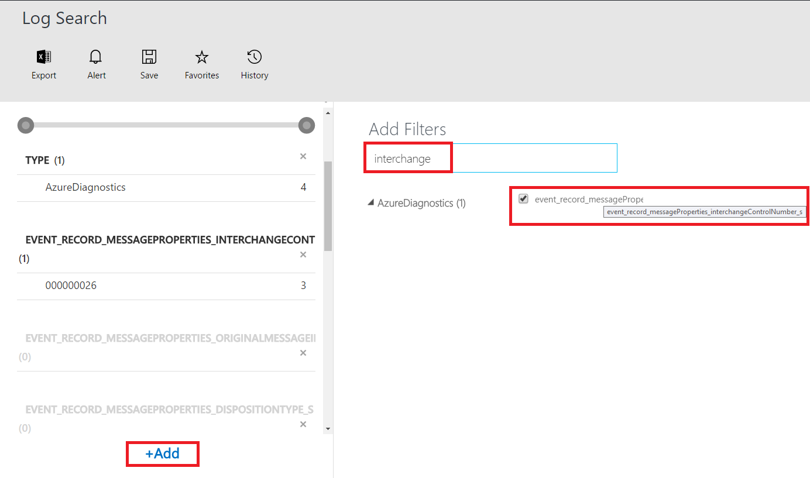
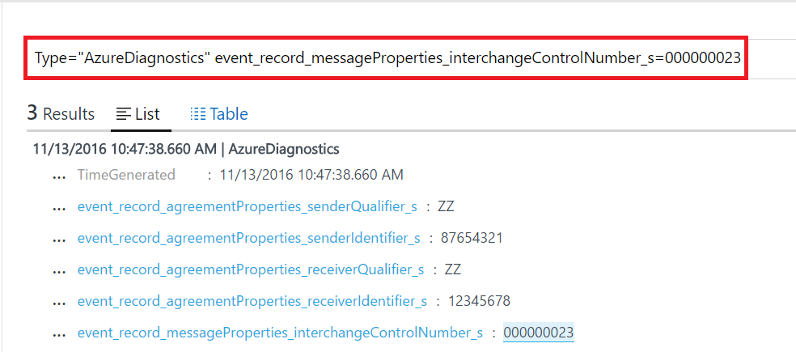
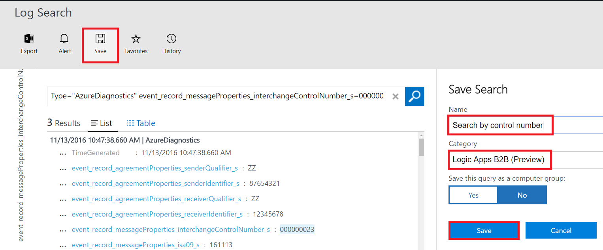
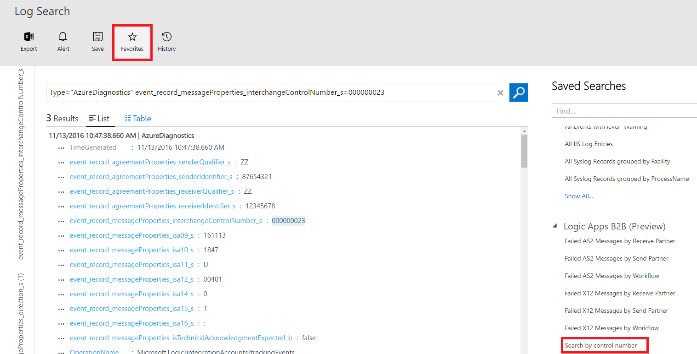
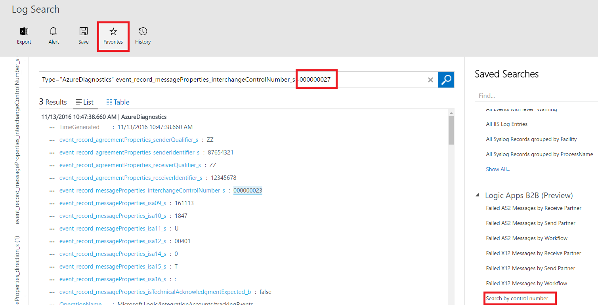

# Track B2B messages in the Operations Management Suite portal by using a query
To track business-to-business (B2B) messages in the Operations Management Suite portal, you can create a query that filters data for a specific interchange control number.

## Prereqs

For debugging and for more detailed diagnostics information, turn on diagnostics in your [integration account](logic-apps-monitor-b2b-message.md) for your [logic apps](../logic-apps/logic-apps-monitor-your-logic-apps.md#azure-diagnostics-and-alerts) that have X12 connectors. Then, do the steps to [publish diagnostic data](../logic-apps/logic-apps-track-b2b-messages-omsportal.md) to the Operations Management Suite portal.

## Search for an interchange control number

1. On the start page, select **Log Search**.  

2. In the search box, type **Type="AzureDiagnostics"**. To filter data, select **Add**.  

3. Type **interchange**, select **event_record_messageProperties_interchangeControlNumber_s**, and then select **Add**.  

4. Select the control number that you want to filter data for, and then select **Apply**.  

5. Find the query that you created to filter data for the selected control number.   

6. Type a name for the query, and then save it.   

7. To view the query, and to use it in future searches, select **Favorites**.  

8. You can update the query to search for a new interchange control number.  

## Next steps
* Learn more about [custom tracking schemas](logic-apps-track-integration-account-custom-tracking-schema.md).   
* Learn more about [AS2 tracking schemas](logic-apps-track-integration-account-as2-tracking-schemas.md).    
* Learn more about [X12 tracking schemas](logic-apps-track-integration-account-x12-tracking-schema.md).  
* Learn more about the [Enterprise Integration Pack](../logic-apps/logic-apps-enterprise-integration-overview.md).
