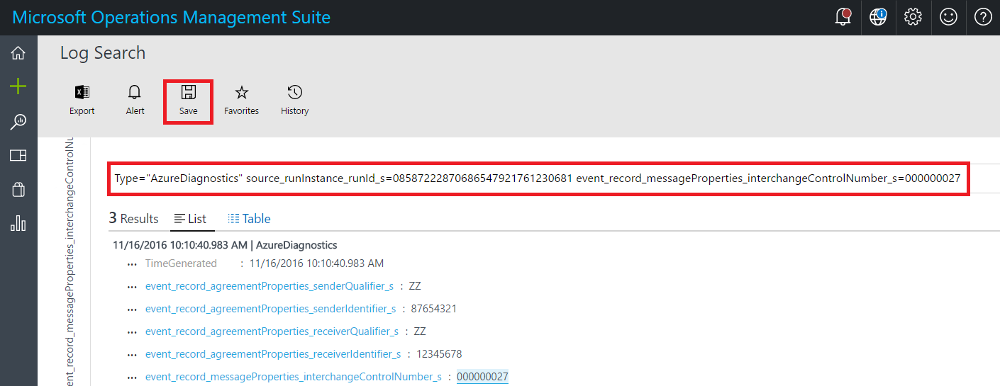
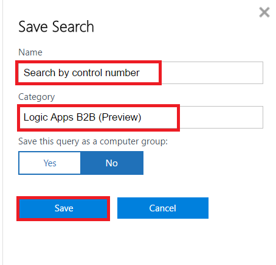
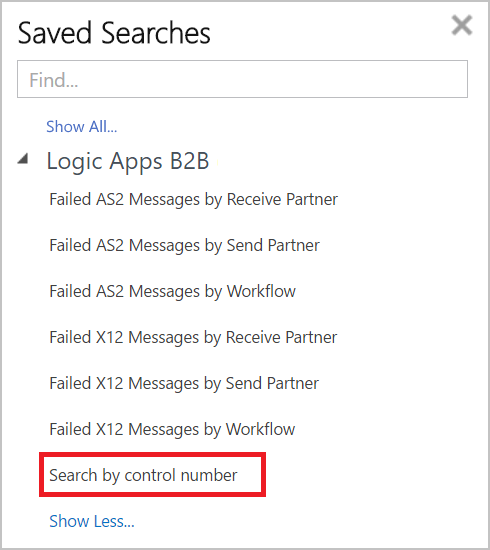
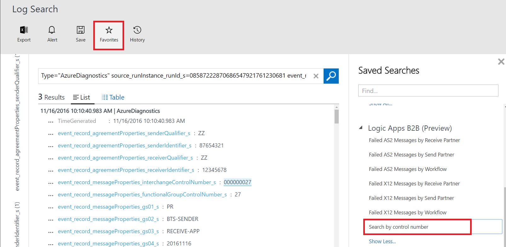

# Query for B2B messages in the Operations Management Suite portal

To find business-to-business (B2B) messages that you're tracking with 
[Azure Log Analytics](../log-analytics/log-analytics-overview.md) 
in the [Operations Management Suite (OMS)](../operations-management-suite/operations-management-suite-overview.md), 
you can create queries that filter actions based on specific criteria, 
for example, an interchange control number.

## Requirements

* A logic app that's set up with monitoring and logging for debugging and diagnostics. 
Learn [how to create a logic app](../logic-apps/logic-apps-create-a-logic-app.md) 
and [how to set up monitoring and logging for that logic app](../logic-apps/logic-apps-monitor-your-logic-apps.md#azure-diagnostics-and-alerts).

* An integration account that's set up with monitoring and logging for debugging and diagnostics. 
Learn [how to create an integration account](logic-apps-enterprise-integration-create-integration-account.md) 
and [how to set up monitoring and logging for that account](logic-apps-monitor-b2b-message.md).

* If you haven't already, [publish diagnostic data to Log Analytics](logic-apps-track-b2b-messages-omsportal.md) in OMS. 

## Create a query in the Operations Management Suite portal

You can either create a query on the Log Search page after

* [Follow the steps for tracking and viewing message status and details](logic-apps-track-b2b-messages-omsportal.md#message-status-details) in the OMS portal 
until you've opened the **Log Search** page for the actions that you want to filter.

   1. To create queries manually on the **Log Search** page, 
   in the search box, enter `Type="AzureDiagnostics"` plus the 
   columns and values that you want to use as query filters.

   1.    

1. On the **Log Search** page, create a query. 

    a. In the search box, enter `Type="AzureDiagnostics"`, 
    then choose **+ Add** so you can add a filter.
    
   

When you're ready, choose **Save**.

2. On the **Save Search** pane, add a name and category for your query. 
When you're done, choose **Save**.

   

3. To view the query, choose **Favorites**.

   

   

## Run a saved query in the Operations Management Suite portal

* In the log search, select **favorites** to view saved queries.  To view query results, select a query.

## Search for an interchange control number

1. On the OMS home page, choose **Log Search**.

   

2. In the search box, type **Type="AzureDiagnostics"**. To filter data, select **Add**.  

3. Type **interchange**, select **event_record_messageProperties_interchangeControlNumber_s**, and then select **Add**.  

4. Select the control number that you want to filter data for, and then select **Apply**.  

5. Find the query that you created to filter data for the selected control number.   

6. Type a name for the query, and then save it.   

7. To view the query, and to use it in future searches, select **Favorites**.  

8. You can update the query to search for a new interchange control number.  

## Next steps
* Learn more about [custom tracking schemas](logic-apps-track-integration-account-custom-tracking-schema.md).   
* Learn more about [AS2 tracking schemas](logic-apps-track-integration-account-as2-tracking-schemas.md).    
* Learn more about [X12 tracking schemas](logic-apps-track-integration-account-x12-tracking-schema.md).  
* Learn more about the [Enterprise Integration Pack](../logic-apps/logic-apps-enterprise-integration-overview.md).
