# Create queries for tracking AS2, X12, and EDIFACT messages in Log Analytics for Azure Logic Apps

To find the AS2, X12, or EDIFACT messages that you're tracking with 
[Azure Log Analytics](../log-analytics/log-analytics-overview.md), 
you can create queries that filter actions based on specific criteria. 
For example, you can find messages based on a specific interchange control number.

## Requirements

* A logic app that's set up with diagnostics logging. 
Learn [how to create a logic app](../logic-apps/quickstart-create-first-logic-app-workflow.md) 
and [how to set up logging for that logic app](../logic-apps/logic-apps-monitor-your-logic-apps.md#azure-diagnostics).

* An integration account that's set up with monitoring and logging. 
Learn [how to create an integration account](../logic-apps/logic-apps-enterprise-integration-create-integration-account.md) 
and [how to set up monitoring and logging for that account](../logic-apps/logic-apps-monitor-b2b-message.md).

* If you haven't already, [publish diagnostic data to Log Analytics](../logic-apps/logic-apps-track-b2b-messages-omsportal.md) 
and [set up message tracking in Log Analytics](../logic-apps/logic-apps-track-b2b-messages-omsportal.md).

> [!NOTE]
> After you've met the previous requirements, 
> you should have a workspace in Log Analytics. 
> You should use the same workspace for tracking 
> your B2B communication in Log Analytics. 
>  
> If you don't have a Log Analytics workspace, 
> learn [how to create a Log Analytics workspace](../log-analytics/log-analytics-quick-create-workspace.md).

## Create message queries with filters in Log Analytics

This example shows how you can find messages based on their interchange control number.

> [!TIP] 
> If you know your Log Analytics workspace name, go to your workspace home page 
(`https://{your-workspace-name}.portal.mms.microsoft.com`), 
> and start at Step 4. Otherwise, start at Step 1.

1. In the [Azure portal](https://portal.azure.com), choose **All Services**. 
Search for "log analytics", and then choose **Log Analytics** as shown here:

   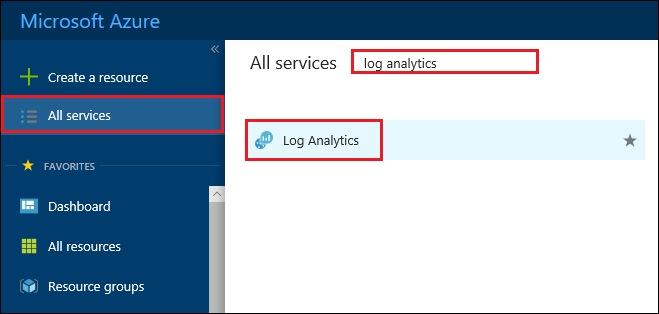

2. Under **Log Analytics**, find and select your Log Analytics workspace.

   

3. Under **Management**, choose **Log Search**.

   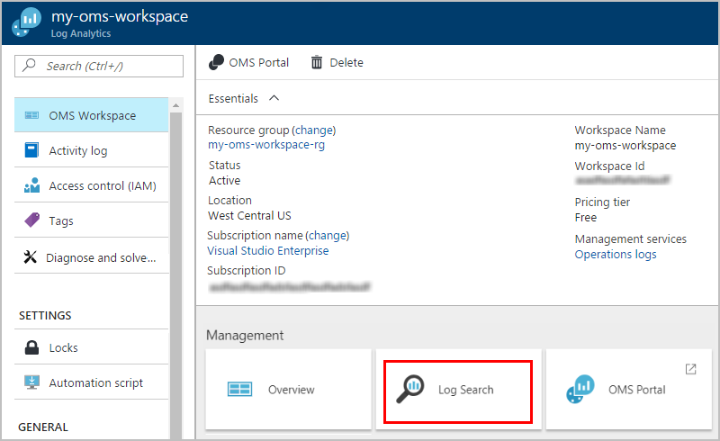

4. In the search box, enter a field that you want to find, and press **Enter**. 
When you start typing, Log Analytics shows you possible matches and operations that you can use. 
Learn more about [how to find data in Log Analytics](../log-analytics/log-analytics-log-searches.md).

   This example searches for events with **Type=AzureDiagnostics**.

   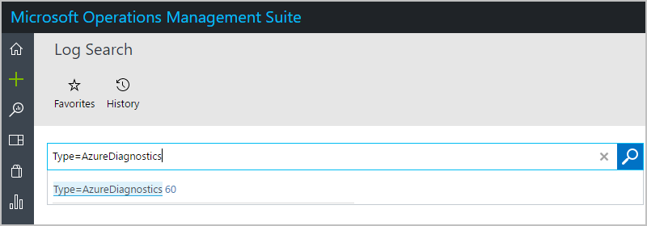

5. In the left bar, choose the timeframe that you want to view. 
To add a filter to your query, choose **+Add**.

   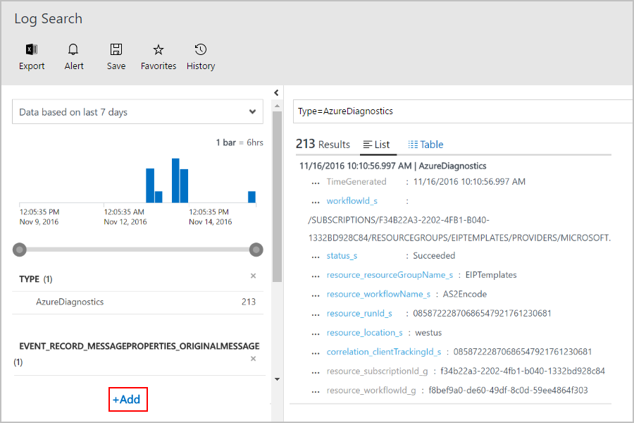

6. Under **Add Filters**, enter the filter name so you can find the filter you want. 
Select the filter, and choose **+Add**.

   To find the interchange control number, this example searches for the word "interchange", 
   and selects **event_record_messageProperties_interchangeControlNumber_s** as the filter.

   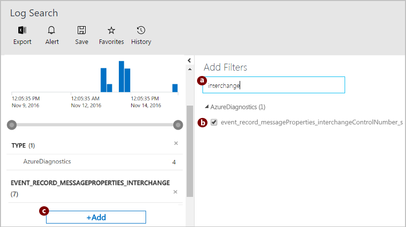

7. In the left bar, select the filter value that you want to use, and choose **Apply**.

   This example selects the interchange control number for the messages we want.

   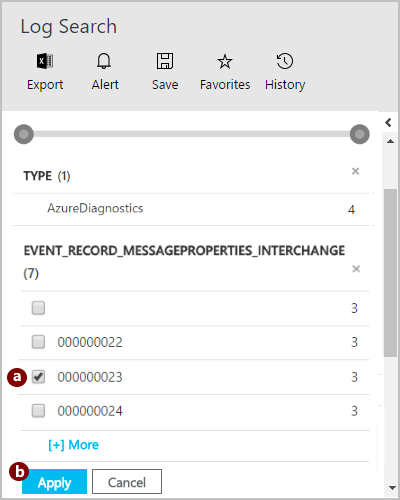

8. Now return to the query that you're building. 
Your query has been updated with your selected filter event and value. 
Your previous results are now filtered too.

    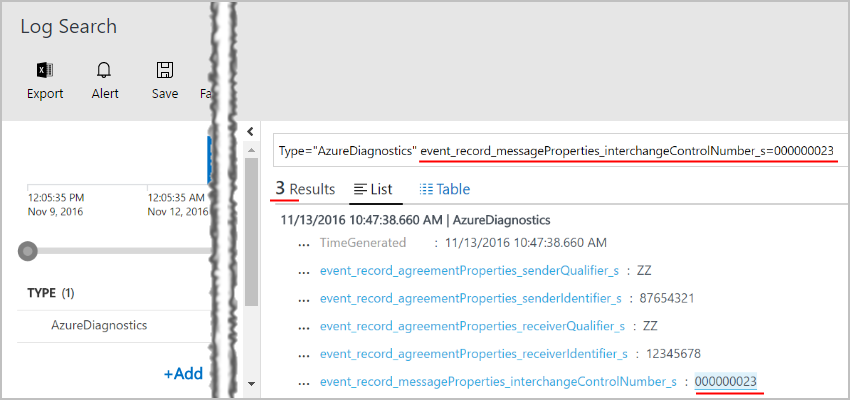

## Save your query for future use

1. From your query on the **Log Search** page, choose **Save**. 
Give your query a name, select a category, and choose **Save**.

   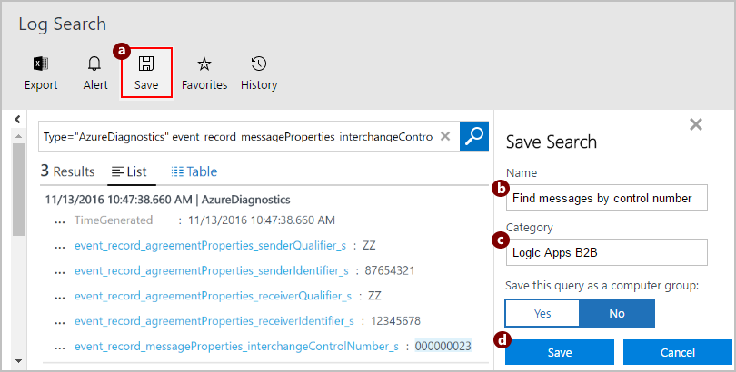

2. To view your query, choose **Favorites**.

   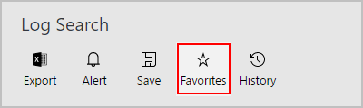

3. Under **Saved Searches**, 
select your query so that you can view the results. 
To update the query so you can find different results, edit the query.

   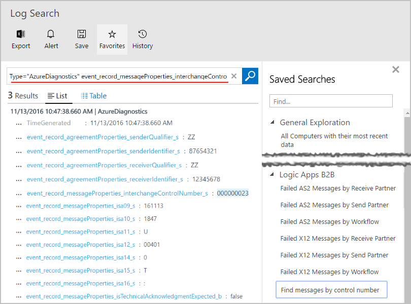

## Find and run saved queries in Log Analytics

1. Open your Log Analytics workspace home page (`https://{your-workspace-name}.portal.mms.microsoft.com`), 
and choose **Log Search**.

   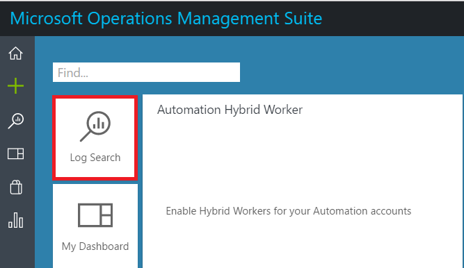

   -or-

   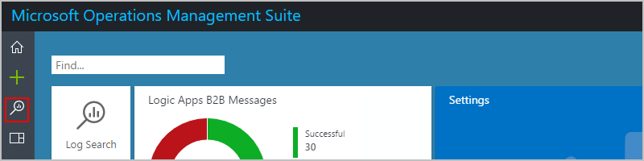

2. On the **Log Search** home page, choose **Favorites**.

   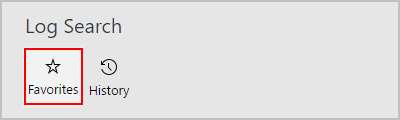

3. Under **Saved Searches**, 
select your query so that you can view the results. 
To update the query so you can find different results, edit the query.

   

## Next steps

* [AS2 tracking schemas](../logic-apps/logic-apps-track-integration-account-as2-tracking-schemas.md)
* [X12 tracking schemas](../logic-apps/logic-apps-track-integration-account-x12-tracking-schema.md)
* [Custom tracking schemas](../logic-apps/logic-apps-track-integration-account-custom-tracking-schema.md)