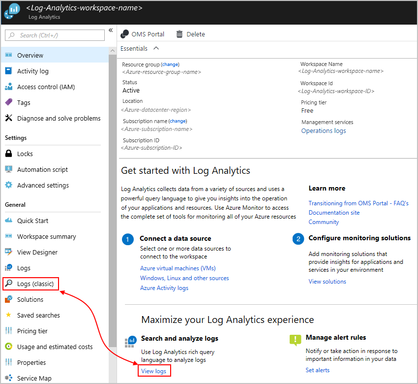
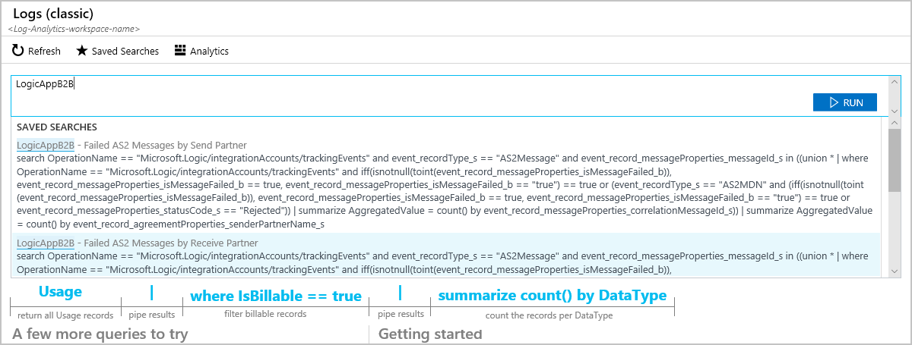
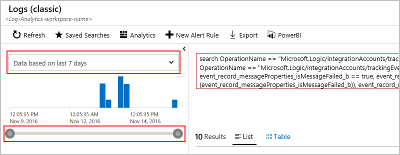
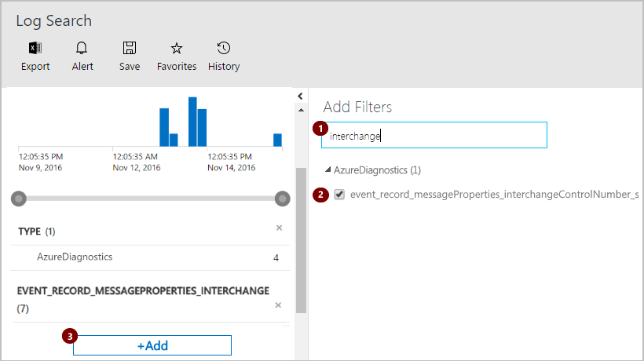
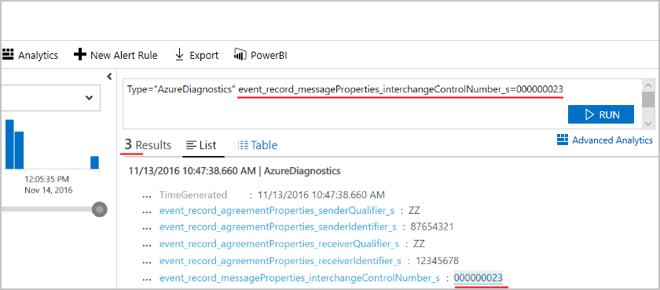
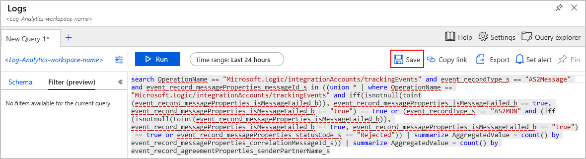
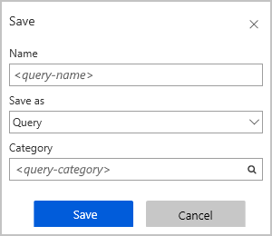
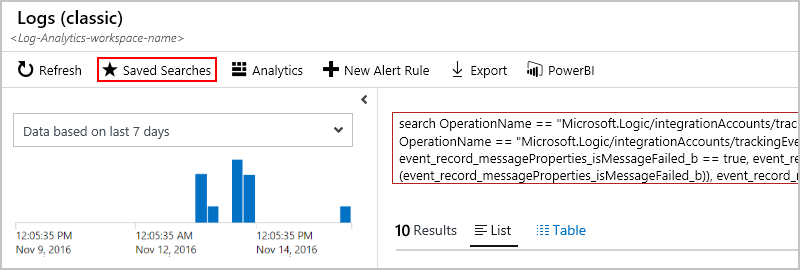
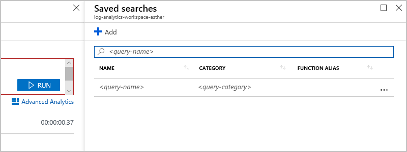

# Create tracking queries for B2B messages in Azure Monitor logs for Azure Logic Apps

To find AS2, X12, or EDIFACT messages that you're tracking with 
[Azure Monitor logs](../log-analytics/log-analytics-overview.md), 
you can create queries that filter actions based on specific criteria. 
For example, you can find messages based on a specific interchange control number.

> [!NOTE]
> This page previously described steps for how to perform these tasks 
> with the Microsoft Operations Management Suite (OMS), which is 
> [retiring in January 2019](../azure-monitor/platform/oms-portal-transition.md), 
> replaces those steps with Azure Log Analytics instead. 

[!INCLUDE [azure-monitor-log-analytics-rebrand](../../includes/azure-monitor-log-analytics-rebrand.md)]

## Prerequisites

* A logic app that's set up with diagnostics logging. Learn 
[how to create a logic app](quickstart-create-first-logic-app-workflow.md) 
and [how to set up logging for that logic app](../logic-apps/logic-apps-monitor-your-logic-apps.md#azure-diagnostics).

* An integration account that's set up with monitoring and logging. Learn 
[how to create an integration account](../logic-apps/logic-apps-enterprise-integration-create-integration-account.md) 
and [how to set up monitoring and logging for that account](../logic-apps/logic-apps-monitor-b2b-message.md).

* If you haven't already, [publish diagnostic data to Azure Monitor logs](../logic-apps/logic-apps-track-b2b-messages-omsportal.md) 
and [set up message tracking in Azure Monitor logs](../logic-apps/logic-apps-track-b2b-messages-omsportal.md).

## Create queries with filters

To find messages based on specific properties or values, 
you can create queries that use filters. 

1. In the [Azure portal](https://portal.azure.com), 
select **All services**. In the search box, 
find "log analytics", and select **Log Analytics**.

   

1. Under **Log Analytics**, find and 
select your Log Analytics workspace. 

   

1. On your workspace menu, under **General**, 
select either **Logs (classic)** or **Logs**. 

   This example shows how to use the classic Logs view. 
   If you choose **View logs** in the 
   **Maximize your Log Analytics experience** section, 
   under **Search and analyze logs**, 
   you get the **Logs (classic view)**. 

   

1. In the query edit box, start typing the field name you want to find. 
When you start typing, the query editor shows the possible matches 
and operations you can use. After you create your query, choose **Run** 
or press the Enter key.

   This example searches for matches on **LogicAppB2B**. 
   Learn more about [how to find data in Azure Monitor logs](../log-analytics/log-analytics-log-searches.md).

   

1. To change the timeframe you want to view, in the left pane, 
select from the duration list or drag the slider. 

   

1. To add a filter to your query, choose **Add**. 

   

1. Under **Add Filters**, enter filter name you want to find. 
If you find the filter, select that filter. In the left pane, 
choose **Add** again.

   For example, here is a different query that searches on 
   **Type=="AzureDiagnostics"** events and finds results 
   based on the interchange control number by selecting the 
   **event_record_messageProperties_interchangeControlNumber_s** filter.

   

   After you choose **Add**, your query is updated with 
   your selected filter event and value. 
   Your previous results are now filtered too. 

   For example, this query searches for **Type=="AzureDiagnostics"** 
   and finds results based on an interchange control number by using the 
   **event_record_messageProperties_interchangeControlNumber_s** filter.

   

## Save query

To save your query in **Logs (classic)** view, follow these steps:

1. From your query on the **Logs (classic)** page, choose **Analytics**. 

   

1. On the query toolbar, choose **Save**.

   

1. Provide the details about your query, 
for example, give your query a name, select **Query**, 
and provide a category name. When you're done, choose **Save**.

   

1. To view saved queries, go back to the query page. 
On the query toolbar, choose **Saved Searches**.

   

1. Under **Saved Searches**, select your query so you can view the results. 

   

   To update the query so you can find different results, edit the query.

## Find and run saved queries

1. In the [Azure portal](https://portal.azure.com), 
select **All services**. In the search box, 
find "log analytics", and select **Log Analytics**.

   

1. Under **Log Analytics**, find and 
select your Log Analytics workspace. 

   

1. On your workspace menu, under **General**, 
select either **Logs (classic)** or **Logs**. 

   This example shows how to use the classic Logs view. 

1. After the query page opens, on the query toolbar, 
choose **Saved Searches**.

   

1. Under **Saved Searches**, select your query so you can view the results. 

    

   The query runs automatically, but if the query doesn't run for any reason,
   in the query editor, choose **Run**.

## Next steps

* [AS2 tracking schemas](../logic-apps/logic-apps-track-integration-account-as2-tracking-schemas.md)
* [X12 tracking schemas](../logic-apps/logic-apps-track-integration-account-x12-tracking-schema.md)
* [Custom tracking schemas](../logic-apps/logic-apps-track-integration-account-custom-tracking-schema.md)