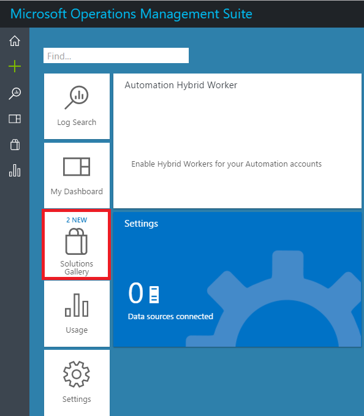
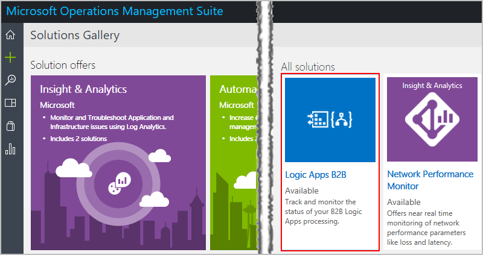
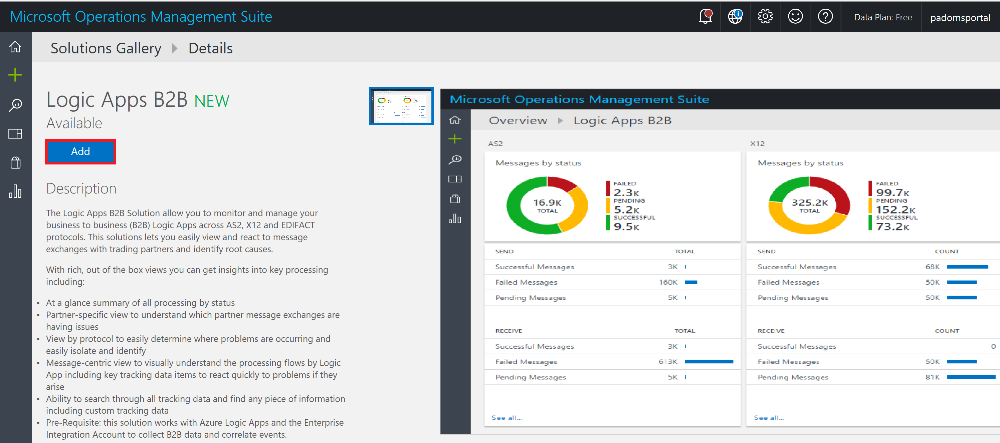
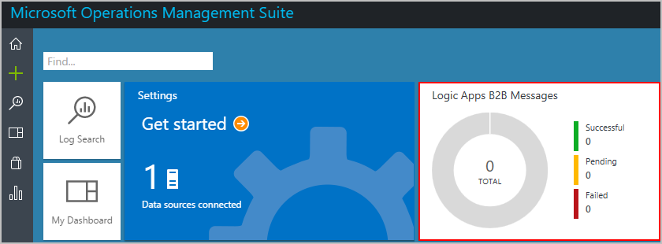
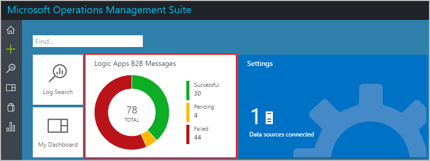

# Track AS2, X12, and EDIFACT messages in the Operations Management Suite (OMS) with Azure Log Analytics

When you set up B2B communication in your integration account 
between two running business processes or applications, 
those entities can exchange messages with each other. 
To check whether these messages are processed correctly, 
you can use [Azure Log Analytics](../log-analytics/log-analytics-overview.md) 
in the [Operations Management Suite (OMS)](../operations-management-suite/operations-management-suite-overview.md). 
Log Analytics monitors your cloud and on-premises environments to help you 
maintain their ability and performance. For example, you can use 
these web-based tracking capabilities to track your messages:

* Message count and status
* Acknowledgments status
* Correlate messages with acknowledgments
* Detailed error descriptions for failures
* Search capabilities

## Requirements

* A logic app that's set up with diagnostics logging. 
Learn [how to create a logic app](logic-apps-create-a-logic-app.md) 
and [how to set up logging for that logic app](logic-apps-monitor-your-logic-apps.md#azure-diagnostics).

* An integration account that's set up with monitoring and logging. 
Learn [how to create an integration account](logic-apps-enterprise-integration-create-integration-account.md) 
and [how to set up monitoring and logging for that account](logic-apps-monitor-b2b-message.md).

* If you haven't already, [publish diagnostic data to Log Analytics](logic-apps-track-b2b-messages-omsportal.md) in OMS.

* An OMS workspace for [Azure Log Analytics](../log-analytics/log-analytics-overview.md). 
Learn more about [how to create this workspace](../log-analytics/log-analytics-get-started.md). 

## Add the Logic Apps B2B solution to Operations Management Suite (OMS)

To have OMS track B2B messages for your logic app, 
you must add the **Logic Apps B2B** solution to the OMS portal. 
Learn more about [adding solutions to OMS](../log-analytics/log-analytics-get-started.md).

1. In the [Azure portal](https://portal.azure.com), choose **More Services**. 
Search for "log analytics", and then choose **Log Analytics** as shown here:

   

2. Under **Log Analytics**, find and select your OMS workspace. 

   

3. Choose **OMS Portal**.

   

4. After the Microsoft Operations Management Suite portal home page opens, 
choose **Solutions Gallery**.    

   

5. Choose **Logic Apps B2B**.     

   

6. Under **Logic Apps B2B**, choose **Add**.

   

   On the OMS home page, the tile for **Logic Apps B2B Messages** now appears. 
   This tile updates the message count when your B2B messages are processed.

   

## Track message status and details in the Operations Management Suite portal

1. After your B2B messages are processed, you can view the status and details for those messages. On the OMS home page, choose the **Logic Apps B2B Messages** tile.

   

2. After the message status dashboard appears, 
you can view more details for a specific message type, 
which shows data based on a single day. 
Choose the tile for **AS2**, **X12**, or **EDIFACT**.

   

   The message list for your chosen tile appears. 
   To export the message list, choose **Download**. For example: 

   

   > [!TIP]
   > To find the descriptions for message list properties, 
   > see [Message list property descriptions](#message-list-property-descriptions).

4. To view all the actions that have the same run ID, 
   select a row in the message list. 

5. On the **Log Search** page, you can sort these actions by column, 
or search for specific results.

   

   * To search results with prebuilt queries, choose **Favorites**.

   * Learn [how to build queries by adding filters](logic-apps-track-b2b-messages-omsportal-query-filter-control-number.md). 
   Or learn more about [how to find data with log searches in Log Analytics](../log-analytics/log-analytics-log-searches.md).

   * To change query in the search box, update the query with the 
   columns and values that you want to use as filters.

## Message list property descriptions

#### AS2 message list property descriptions

| Property | Description |
| --- | --- |
| Sender | The guest partner that is set up in the **Receive Settings**, or the host partner that is set up in the **Send Settings** for an AS2 agreement |
| Receiver | The host partner that is set up in the **Receive Settings**, or the guest partner that is set up in the **Send Settings** for an AS2 agreement |
| Logic App | The logic app where the AS2 actions are set up |
| Status | AS2 message status  Success = Received or sent a valid AS2 message, no MDN is set up  Success = Received or sent a valid AS2 message, MDN is set up and received, or MDN is sent  Failed = Received an invalid AS2 message, no MDN is set up  Pending = Received or sent a valid AS2 message, MDN is set up, and MDN is expected |
| Ack | MDN message status  Accepted = Received or sent a positive MDN  Pending = Waiting to receive or send an MDN  Rejected = Received or sent a negative MDN  Not Required = MDN is not set up in the agreement |
| Direction | The AS2 message direction |
| Correlation ID | The ID that correlates all the triggers and actions in a logic app |
| Message ID |  The AS2 message ID from the AS2 message headers |
| Timestamp | The time when the AS2 action processed the message |

#### X12 message list property descriptions

| Property | Description |
| --- | --- |
| Sender | The guest partner that is set up in the **Receive Settings**, or the host partner that is set up in the **Send Settings** for an X12 agreement |
| Receiver | The host partner that is set up in the **Receive Settings**, or the guest partner that is set up in the **Send Settings** for an X12 agreement |
| Logic App | The logic app where the X12 actions are set up |
| Status | The X12 message status  Success = Received or sent a valid X12 message, no functional ack is set up  Success = Received or sent a valid X12 message, functional ack is set up and received, or a functional ack is sent  Failed = Received or sent an invalid X12 message  Pending = Received or sent a valid X12 message, functional ack is set up, and a functional ack is expected |
| Ack | Functional Ack (997) status  Accepted = Received or sent a positive functional ack  Rejected = Received or sent a negative functional ack  Pending = Expecting a functional ack but not received  Pending = Generated a functional ack but can't send to partner  Not Required = Functional ack is not set up |
| Direction | The X12 message direction |
| Correlation ID | The ID that correlates all the triggers and actions in a logic app |
| Msg type | The EDI X12 message type |
| ICN | The Interchange Control Number for the X12 message |
| TSCN | The Transactional Set Control Number for the X12 message |
| Timestamp | The time when the X12 action processed the message |

#### EDIFACT message list property descriptions

| Property | Description |
| --- | --- |
| Sender | The guest partner that is set up in the **Receive Settings**, or the host partner that is set up in the **Send Settings** for an EDIFACT agreement |
| Receiver | The host partner that is set up in the **Receive Settings**, or the guest partner that is set up in the **Send Settings** for an EDIFACT agreement |
| Logic App | The logic app where the EDIFACT actions are set up |
| Status | The EDIFACT message status  Success = Received or sent a valid EDIFACT message, no functional ack is set up  Success = Received or sent a valid EDIFACT message, functional ack is set up and received, or a functional ack is sent  Failed = Received or sent an invalid EDIFACT message  Pending = Received or sent a valid EDIFACT message, functional ack is set up, and a functional ack is expected |
| Ack | Functional Ack (997) status  Accepted = Received or sent a positive functional ack  Rejected = Received or sent a negative functional ack  Pending = Expecting a functional ack but not received  Pending = Generated a functional ack but can't send to partner  Not Required = Functional Ack is not set up |
| Direction | The EDIFACT message direction |
| Correlation ID | The ID that correlates all the triggers and actions in a logic app |
| Msg type | The EDIFACT message type |
| ICN | The Interchange Control Number for the EDIFACT message |
| TSCN | The Transactional Set Control Number for the EDIFACT message |
| Timestamp | The time when the EDIFACT action processed the message |

## Next steps

* [Track B2B messages with queries in Operations Management Suite](logic-apps-track-b2b-messages-omsportal-query-filter-control-number.md)
* [Custom tracking schemas](logic-apps-track-integration-account-custom-tracking-schema.md)
* [AS2 tracking schemas](logic-apps-track-integration-account-as2-tracking-schemas.md)
* [X12 tracking schemas](logic-apps-track-integration-account-x12-tracking-schema.md)
* [Learn more about the Enterprise Integration Pack](logic-apps-enterprise-integration-overview.md)
