# Track B2B communication with Azure Log Analytics

After you set up B2B communication between two running business processes 
or applications through your integration account, 
those entities can exchange messages with each other. 
To check whether these messages are processed correctly, 
you can track AS2, X12, and EDIFACT messages with 
[Azure Log Analytics](../log-analytics/log-analytics-overview.md). 
For example, you can use these web-based tracking capabilities 
for tracking messages:

* Message count and status
* Acknowledgments status
* Correlate messages with acknowledgments
* Detailed error descriptions for failures
* Search capabilities

## Requirements

* A logic app that's set up with diagnostics logging. 
Learn [how to create a logic app](quickstart-create-first-logic-app-workflow.md) 
and [how to set up logging for that logic app](../logic-apps/logic-apps-monitor-your-logic-apps.md#azure-diagnostics).

* An integration account that's set up with monitoring and logging. 
Learn [how to create an integration account](../logic-apps/logic-apps-enterprise-integration-create-integration-account.md) 
and [how to set up monitoring and logging for that account](../logic-apps/logic-apps-monitor-b2b-message.md).

* If you haven't already, [publish diagnostic data to Log Analytics](../logic-apps/logic-apps-track-b2b-messages-omsportal.md).

> [!NOTE]
> After you've met the previous requirements, 
> you should have a workspace in Log Analytics. 
> You should use the same workspace for tracking 
> your B2B communication in Log Analytics. 
>  
> If you don't have a Log Analytics workspace, 
> learn [how to create a Log Analytics workspace](../log-analytics/log-analytics-quick-create-workspace.md).

## Add the Logic Apps B2B solution to Log Analytics

To have Log Analytics track B2B messages for your logic app, 
you must add the **Logic Apps B2B** solution to the OMS portal. 
Learn more about [adding solutions to Log Analytics](../log-analytics/log-analytics-quick-create-workspace.md).

1. In the [Azure portal](https://portal.azure.com), choose **All Services**. 
Search for "log analytics", and then choose **Log Analytics** as shown here:

   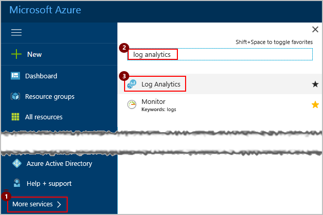

2. Under **Log Analytics**, find and select your Log Analytics workspace. 

   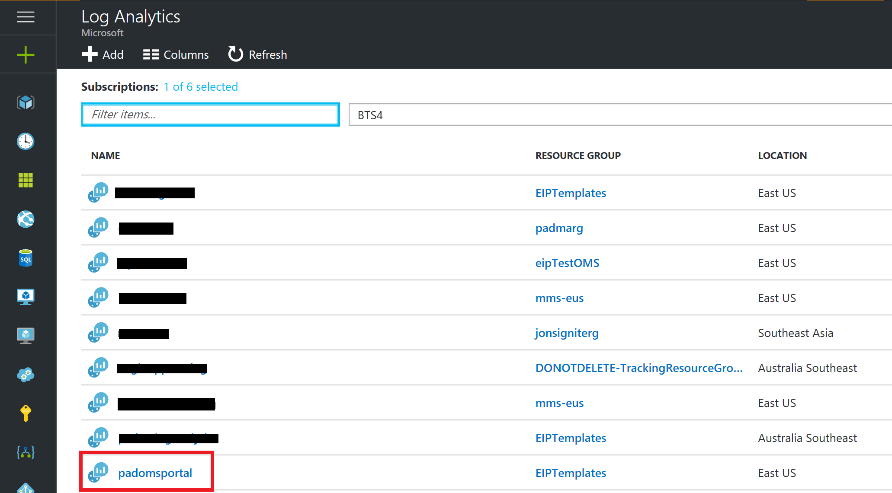

3. Under **Management**, choose **Overview**.

   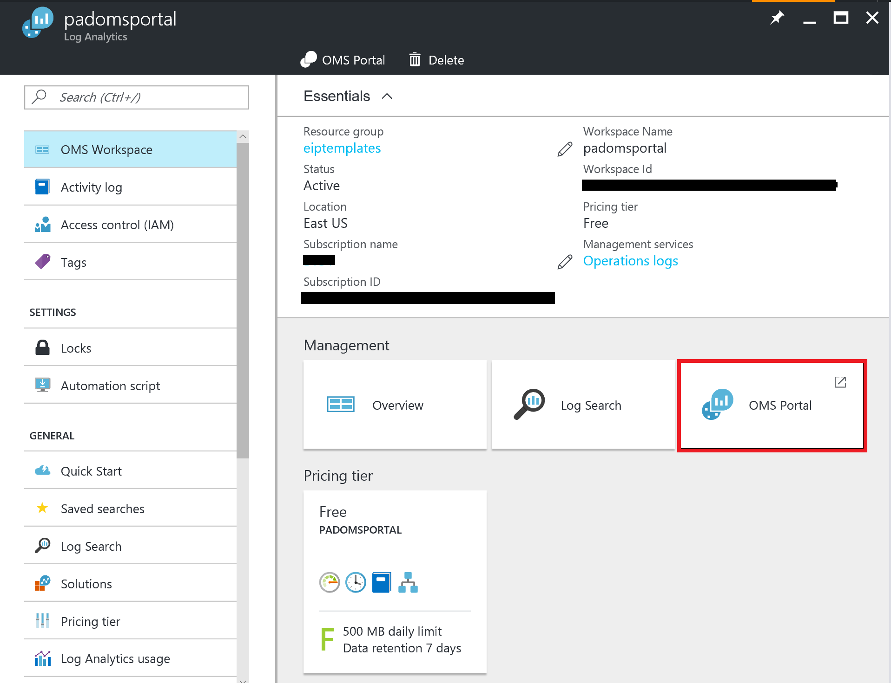

4. After the home page opens, choose **Add** to install Logic Apps B2B solution.    
   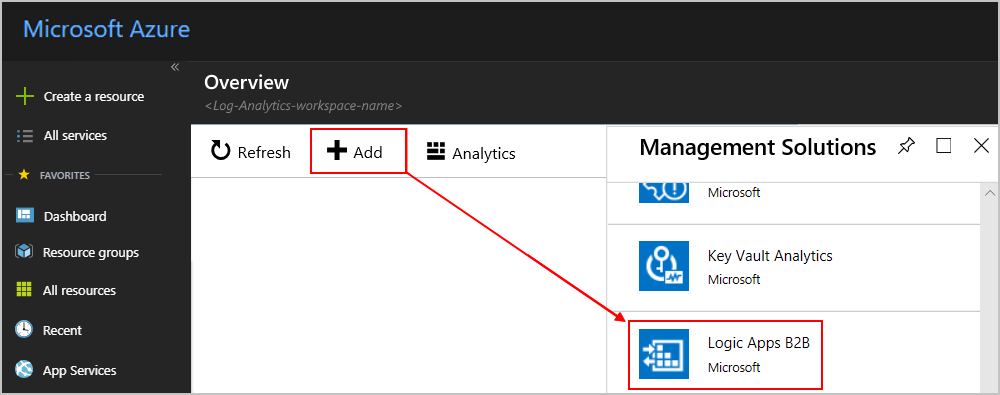

5. Under **Management Solutions**, find and Create **Logic Apps B2B** solution.     
   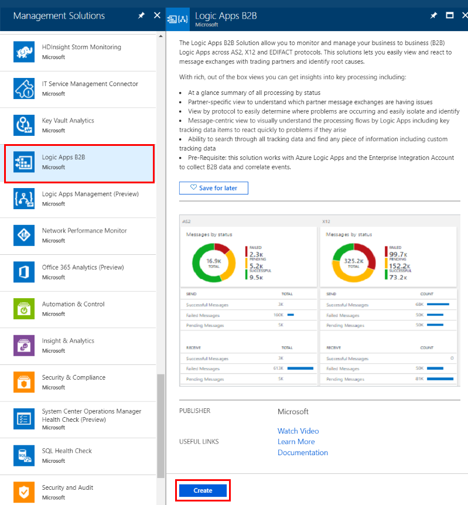

   On the home page, the tile for **Logic Apps B2B Messages** now appears. 
   This tile updates the message count when your B2B messages are processed.

## Track message status and details in Log Analytics

1. After your B2B messages are processed, 
you can view the status and details for those messages. 
On the Overview page, choose the **Logic Apps B2B Messages** tile.

   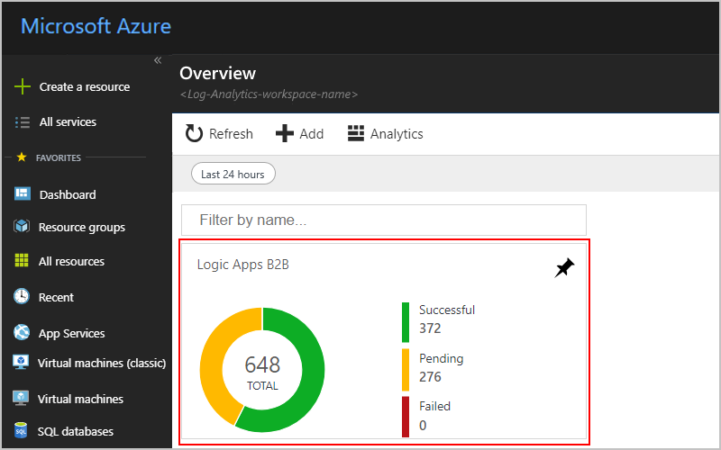

   > [!NOTE]
   > By default, the **Logic Apps B2B Messages** tile 
   > shows data based on a single day. 
   > To change the data scope to a different interval, 
   > choose the scope control at the top of the page:
   > 
   > 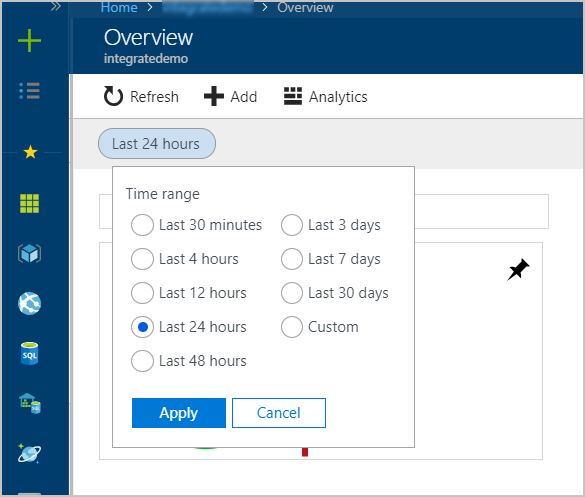
   >

2. After the message status dashboard appears, 
you can view more details for a specific message type, 
which shows data based on a single day. 
Choose the tile for **AS2**, **X12**, or **EDIFACT**.

   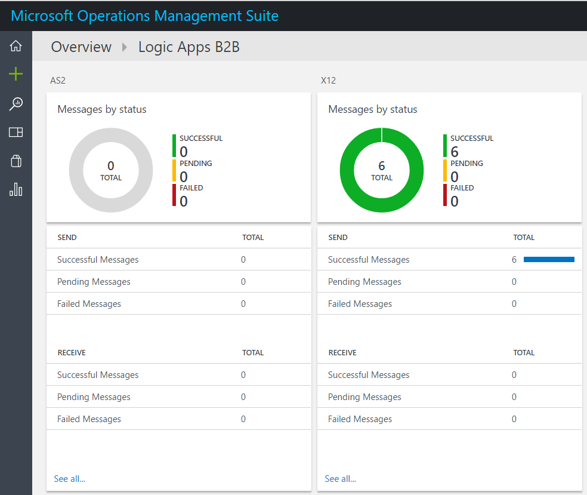

   A list of messages appears for your chosen tile. 
   To learn more about the properties for each message type, 
   see these message property descriptions:

   * [AS2 message properties](#as2-message-properties)
   * [X12 message properties](#x12-message-properties)
   * [EDIFACT message properties](#EDIFACT-message-properties)

   For example, here's what an AS2 message list might look like:

   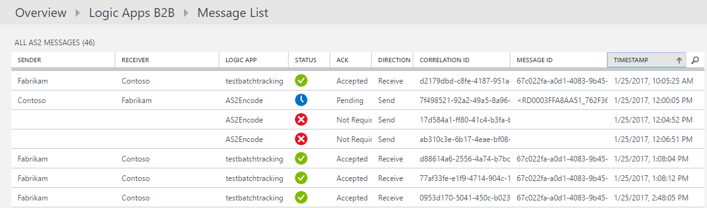

3. To view or export the inputs and outputs for specific messages, 
select those messages, and choose **Download**. When you're prompted, 
save the .zip file to your local computer, and then extract that file. 

   The extracted folder includes a folder for each selected message. 
   If you set up acknowledgements, 
   the message folder also includes files with acknowledgement details. 
   Each message folder has at least these files: 
   
   * Human-readable files with the input payload and output payload details
   * Encoded files with the inputs and outputs

   For each message type, you can find the folder and file name formats here:

   * [AS2 folder and file name formats](#as2-folder-file-names)
   * [X12 folder and file name formats](#x12-folder-file-names)
   * [EDIFACT folder and file name formats](#edifact-folder-file-names)

   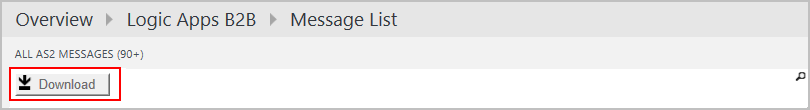

4. To view all actions that have the same run ID, 
on the **Log Search** page, choose a message from the message list.

   You can sort these actions by column, or search for specific results.

   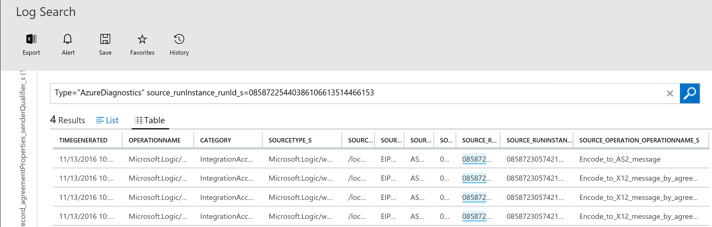

   * To search results with prebuilt queries, choose **Favorites**.

   * Learn [how to build queries by adding filters](logic-apps-track-b2b-messages-omsportal-query-filter-control-number.md). 
   Or learn more about [how to find data with log searches in Log Analytics](../log-analytics/log-analytics-log-searches.md).

   * To change query in the search box, update the query with the 
   columns and values that you want to use as filters.

## Property descriptions and name formats for AS2, X12, and EDIFACT messages

For each message type, here are the property descriptions 
and name formats for downloaded message files.

### AS2 message property descriptions

Here are the property descriptions for each AS2 message.

| Property | Description |
| --- | --- |
| Sender | The guest partner specified in **Receive Settings**, or the host partner specified in **Send Settings** for an AS2 agreement |
| Receiver | The host partner specified in **Receive Settings**, or the guest partner specified in **Send Settings** for an AS2 agreement |
| Logic App | The logic app where the AS2 actions are set up |
| Status | The AS2 message status  Success = Received or sent a valid AS2 message. No MDN is set up.  Success = Received or sent a valid AS2 message. MDN is set up and received, or MDN is sent.  Failed = Received an invalid AS2 message. No MDN is set up.  Pending = Received or sent a valid AS2 message. MDN is set up, and MDN is expected. |
| Ack | The MDN message status  Accepted = Received or sent a positive MDN.  Pending = Waiting to receive or send an MDN.  Rejected = Received or sent a negative MDN.  Not Required = MDN is not set up in the agreement. |
| Direction | The AS2 message direction |
| Correlation ID | The ID that correlates all the triggers and actions in a logic app |
| Message ID | The AS2 message ID from the AS2 message headers |
| Timestamp | The time when the AS2 action processed the message |
|          |             |

### AS2 name formats for downloaded message files

Here are the name formats for each downloaded AS2 message folder and files.

| Folder or file | Name format |
| :------------- | :---------- |
| Message folder | [sender]\_[receiver]\_AS2\_[correlation-ID]\_[message-ID]\_[timestamp] |
| Input, output, and if set up, acknowledgement files | **Input payload**: [sender]\_[receiver]\_AS2\_[correlation-ID]\_input_payload.txt 
**Output payload**: [sender]\_[receiver]\_AS2\_[correlation-ID]\_output\_payload.txt 

**Inputs**: [sender]\_[receiver]\_AS2\_[correlation-ID]\_inputs.txt 

**Outputs**: [sender]\_[receiver]\_AS2\_[correlation-ID]\_outputs.txt |
|          |             |

### X12 message property descriptions

Here are the property descriptions for each X12 message.

| Property | Description |
| --- | --- |
| Sender | The guest partner specified in **Receive Settings**, or the host partner specified in **Send Settings** for an X12 agreement |
| Receiver | The host partner specified in **Receive Settings**, or the guest partner specified in **Send Settings** for an X12 agreement |
| Logic App | The logic app where the X12 actions are set up |
| Status | The X12 message status  Success = Received or sent a valid X12 message. No functional ack is set up.  Success = Received or sent a valid X12 message. Functional ack is set up and received, or a functional ack is sent.  Failed = Received or sent an invalid X12 message.  Pending = Received or sent a valid X12 message. Functional ack is set up, and a functional ack is expected. |
| Ack | Functional Ack (997) status  Accepted = Received or sent a positive functional ack.  Rejected = Received or sent a negative functional ack.  Pending = Expecting a functional ack but not received.  Pending = Generated a functional ack but can't send to partner.  Not Required = Functional ack is not set up. |
| Direction | The X12 message direction |
| Correlation ID | The ID that correlates all the triggers and actions in a logic app |
| Msg type | The EDI X12 message type |
| ICN | The Interchange Control Number for the X12 message |
| TSCN | The Transaction Set Control Number for the X12 message |
| Timestamp | The time when the X12 action processed the message |
|          |             |

### X12 name formats for downloaded message files

Here are the name formats for each downloaded X12 message folder and files.

| Folder or file | Name format |
| :------------- | :---------- |
| Message folder | [sender]\_[receiver]\_X12\_[interchange-control-number]\_[global-control-number]\_[transaction-set-control-number]\_[timestamp] |
| Input, output, and if set up, acknowledgement files | **Input payload**: [sender]\_[receiver]\_X12\_[interchange-control-number]\_input_payload.txt 
**Output payload**: [sender]\_[receiver]\_X12\_[interchange-control-number]\_output\_payload.txt 

**Inputs**: [sender]\_[receiver]\_X12\_[interchange-control-number]\_inputs.txt 

**Outputs**: [sender]\_[receiver]\_X12\_[interchange-control-number]\_outputs.txt |
|          |             |

### EDIFACT message property descriptions

Here are the property descriptions for each EDIFACT message.

| Property | Description |
| --- | --- |
| Sender | The guest partner specified in **Receive Settings**, or the host partner specified in **Send Settings** for an EDIFACT agreement |
| Receiver | The host partner specified in **Receive Settings**, or the guest partner specified in **Send Settings** for an EDIFACT agreement |
| Logic App | The logic app where the EDIFACT actions are set up |
| Status | The EDIFACT message status  Success = Received or sent a valid EDIFACT message. No functional ack is set up.  Success = Received or sent a valid EDIFACT message. Functional ack is set up and received, or a functional ack is sent.  Failed = Received or sent an invalid EDIFACT message  Pending = Received or sent a valid EDIFACT message. Functional ack is set up, and a functional ack is expected. |
| Ack | Functional Ack (997) status  Accepted = Received or sent a positive functional ack.  Rejected = Received or sent a negative functional ack.  Pending = Expecting a functional ack but not received.  Pending = Generated a functional ack but can't send to partner.  Not Required = Functional Ack is not set up. |
| Direction | The EDIFACT message direction |
| Correlation ID | The ID that correlates all the triggers and actions in a logic app |
| Msg type | The EDIFACT message type |
| ICN | The Interchange Control Number for the EDIFACT message |
| TSCN | The Transaction Set Control Number for the EDIFACT message |
| Timestamp | The time when the EDIFACT action processed the message |
|          |               |

### EDIFACT name formats for downloaded message files

Here are the name formats for each downloaded EDIFACT message folder and files.

| Folder or file | Name format |
| :------------- | :---------- |
| Message folder | [sender]\_[receiver]\_EDIFACT\_[interchange-control-number]\_[global-control-number]\_[transaction-set-control-number]\_[timestamp] |
| Input, output, and if set up, acknowledgement files | **Input payload**: [sender]\_[receiver]\_EDIFACT\_[interchange-control-number]\_input_payload.txt 
**Output payload**: [sender]\_[receiver]\_EDIFACT\_[interchange-control-number]\_output\_payload.txt 

**Inputs**: [sender]\_[receiver]\_EDIFACT\_[interchange-control-number]\_inputs.txt 

**Outputs**: [sender]\_[receiver]\_EDIFACT\_[interchange-control-number]\_outputs.txt |
|          |             |

## Next steps

* [Query for B2B messages in Log Analytics](../logic-apps/logic-apps-track-b2b-messages-omsportal-query-filter-control-number.md)
* [AS2 tracking schemas](../logic-apps/logic-apps-track-integration-account-as2-tracking-schemas.md)
* [X12 tracking schemas](../logic-apps/logic-apps-track-integration-account-x12-tracking-schema.md)
* [Custom tracking schemas](../logic-apps/logic-apps-track-integration-account-custom-tracking-schema.md)