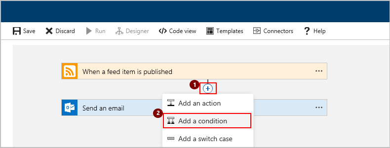
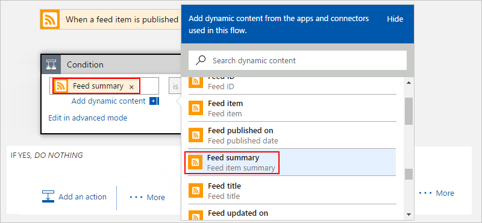
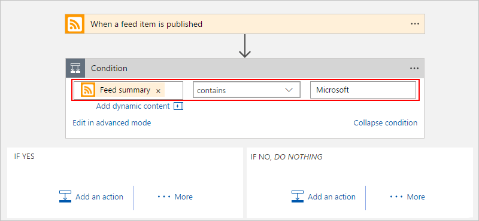
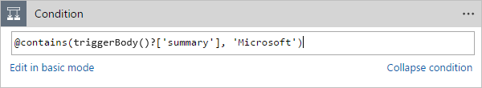
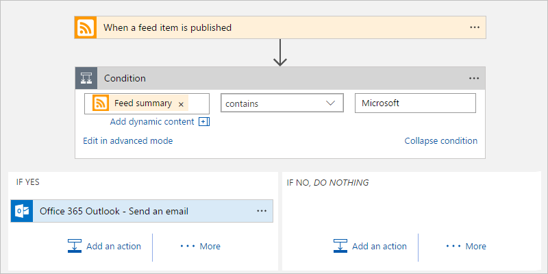
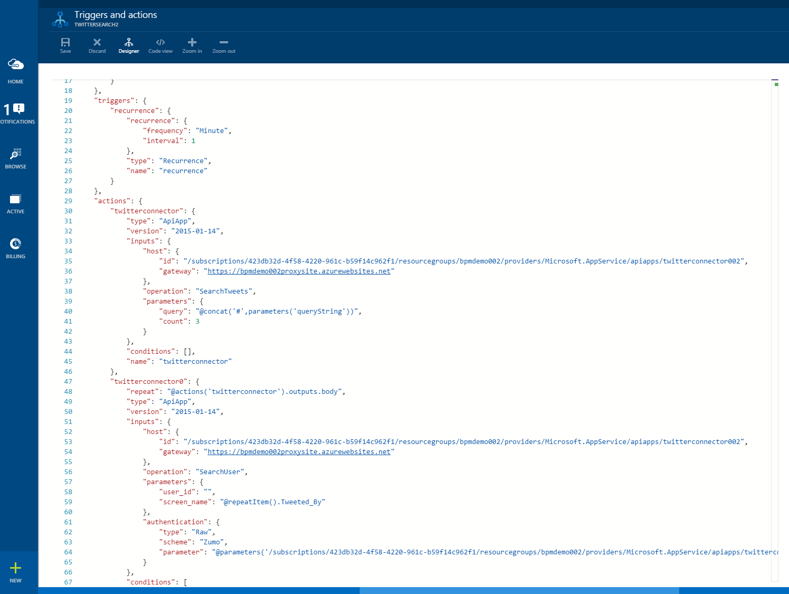

# Use Logic Apps features

In a [previous topic](../logic-apps/logic-apps-create-a-logic-app.md), 
you created your first logic app. To control your logic app's workflow, 
you can specify different paths for your logic app to run and how to 
process data in arrays, collections, and batches. You can include these 
elements in your logic app workflow:

* Conditions and [switch statements](../logic-apps/logic-apps-switch-case.md) 
let your logic app run different actions based on whether specific conditions are met.

* [Loops](../logic-apps/logic-apps-loops-and-scopes.md) let your logic app run steps repeatedly. 
For example, you can repeat actions over an array only when a specific condition 
is met when you use a For_each loop. Or you can repeat actions until a condition 
is met when you use an Until loop.

* [Scopes](../logic-apps/logic-apps-loops-and-scopes.md) let you group series 
of actions together, for example, to implement exception handling.

* [Debatching](../logic-apps/logic-apps-loops-and-scopes.md) lets your logic app start separate workflows for items in an array when you use the SplitOn command.

This topic introduces other concepts for building your logic app:

* Code view to edit an existing logic app
* Options for starting a workflow

## Add a condition to your logic app

To have your logic app run steps only when data meets specific criteria, you can add a condition that compares data in the workflow against specific fields or values.

For example, suppose you have a logic app that sends you too many emails 
for posts on a website's RSS feed. You can add a condition so that your 
logic app sends email only when the new post belongs to a specific category.

1. In the [Azure portal](https://portal.azure.com), 
find and open your logic app in Logic App Designer.

2. Add a condition to the workflow location that you want. 

   To add the condition between existing steps in the logic app workflow, 
   move the pointer over the arrow where you want to add the condition. 
   Choose the **plus sign** (**+**), then choose **Add a condition**. For example:

   

   > [!NOTE]
   > If you want to add a condition at the end of your current workflow, 
   > go to the bottom of your logic app, and choose **+ New step**.

3. Now define the condition. Specify the source field that you want to evaluate, 
the operation to perform, and the target value or field. 
To add existing fields to your condition, choose from the **Add dynamic content list**.

   For example:

   

   Here's the complete condition:

   

   > [!TIP]
   > To define the condition in code, choose **Edit in advanced mode**. 
   > For example:
   > 
   > 

4. Under **IF YES** and **IF NO**, add the steps to perform based 
on whether the condition is met.

   For example:

   

   > [!TIP]
   > You can drag existing actions into the **IF YES** and **IF NO** paths.

5. When you're done, save your logic app.

Now you get emails only when the posts meet your condition.

## Repeat actions over a list with forEach

The forEach loop specifies an array to repeat an action over. 
If it is not an array, the flow fails. For example, 
if you have action1 that outputs an array of messages, 
and you want to send each message, 
you can include this forEach statement in the properties of your action: 
`forEach : "@action('action1').outputs.messages"`

## Edit the code definition for a logic app

Although you have the Logic App Designer, 
you can directly edit the code that defines a logic app.

1. On the command bar, choose **Code view**.

    A full editor opens and shows the definition you edited.

    

	In the text editor, you can copy and paste any number 
	of actions within the same logic app or between logic apps. 
	You can also easily add or remove entire sections from the definition, 
	and you can also share definitions with others.

2. To save your edits, choose **Save**.

## Parameters

Some Logic Apps capabilities are available only in code view, 
for example, parameters. Parameters make it easy to reuse 
values throughout your logic app. For example, if you have 
an email address that you want use in several actions, 
you should define that email address as a parameter.

Parameters are good for pulling out values that you are likely to change a lot. 
They are especially useful when you need to override parameters in different environments. To learn how to override parameters based on environment, 
see [Author logic app definitions](../logic-apps/logic-apps-author-definitions.md) and [REST API documentation](https://docs.microsoft.com/rest/api/logic).

This example shows how to update your existing logic app 
so that you can use parameters for the query term.

1. In code view, find the `parameters : {}` object, 
and add a topic object:

		"currentFeedUrl" : {
			"type" : "string",
			"defaultValue" : "http://rss.cnn.com/rss/cnn_topstories.rss"
		}

2. Go to the `When_a_feed-item_is_published` action, 
find the `queries` section, and replace the query value with 
: `"feedUrl": "#@{parameters('currentFeedUrl')}"` 

	To join two or more strings, you can also use the `concat` function. 
	For example, `"@concat('#',parameters('currentFeedUrl'))"` 
	works the same as the above.

3.	When you're done, choose **Save**. 

	Now you change the website's RSS feed by 
	passing a different URL through the `currentFeedURL` property.

Learn more about [how to Author logic app definitions](../logic-apps/logic-apps-author-definitions.md).

## Start logic app workflows

You have different options for starting the workflow defined in your logic app. 
You can always start a workflow on-demand in the [Azure portal].

### Recurrence triggers

A recurrence trigger runs at an interval that you specify. 
When the trigger has conditional logic, the trigger 
determines whether the workflow needs to run. 
A trigger indicates the workflow should run 
by returning a `200` status code. 
When the workflow doesn't need to run, 
the trigger returns a `202` status code.

### Callback using REST APIs

To start a workflow, services can call a logic app endpoint. 
To start this kind of logic app on-demand, 
choose **Run now** on the command bar. 
See [Start workflows by calling logic app endpoints as triggers](../logic-apps/logic-apps-http-endpoint.md). 

<!-- Shared links -->
[Azure portal]: https://portal.azure.com
