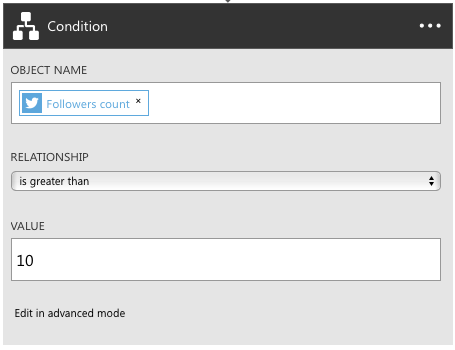

# Use Logic Apps features
In the [previous topic](../logic-apps/logic-apps-create-a-logic-app.md), 
you created your first logic app. 
Now you'll build a fuller process with Azure Logic Apps. 
This topic introduces the following new Azure Logic Apps concepts:

* Conditional logic, which executes an action only when a certain condition is met.
* Code view to edit an existing logic app.
* Options for starting a workflow.

Before you complete this topic, you should complete the steps in [Create a new logic app](../logic-apps/logic-apps-create-a-logic-app.md). In the [Azure portal], browse to your logic app and click **Triggers and Actions** in the summary to edit the logic app definition.

## Reference material
You may find the following documents useful:

* [Management and runtime REST APIs](https://msdn.microsoft.com/library/azure/mt643787.aspx) - including how to invoke Logic apps directly
* [Language reference](https://msdn.microsoft.com/library/azure/mt643789.aspx) - a comprehensive list of all supported functions/expressions
* [Trigger and action types](https://msdn.microsoft.com/library/azure/mt643939.aspx) - the different types of actions and the inputs they take
* [Overview of App Service](../app-service/app-service-value-prop-what-is.md) - description of what components to choose when to build a solution

## Add conditional logic to your logic app

Although your logic app's original flow works, we could improve some areas.

### Conditional

Your first logic app might result in you getting too many emails. 
The following steps add conditional logic so that you receive email 
only when the tweet comes from someone with a specific number of followers.

0. In the Logic App Designer, choose **New Step** (+) > **Add an action**.
0.	Find and add the **Get User** action for Twitter.
0. To get the information about the Twitter user, 
find and add the **Tweeted by** field from the trigger.

	

0. Choose **New Step** (+) > **Add a condition**.
0. To filter on the number of followers that users have, 
under **Object name**, choose **Add dynamic content**. 
0.	In the search box, find and add the **Followers count** field.
0. Under **Relationship**, select **is greater than**.
0. In the **Value** box, enter the number of followers you want users to have.

	

0. Finally, drag the **Send email** box into the **If Yes** box. 

Now you get emails only when the follower count meets your condition.

## Repeat actions over a list with forEach

The forEach loop specifies an array to repeat an action over. 
If it is not an array, the flow fails. For example, 
if you have action1 that outputs an array of messages, 
and you want to send each message, 
you can include this forEach statement in the properties of your action: 
`forEach : "@action('action1').outputs.messages"`

## Edit the code definition for a logic app

Although you have the Logic App Designer, 
you can directly edit the code that defines a logic app.

1. On the command bar, choose **Code view**.

    A full editor opens and shows the definition you edited.

    

	In the text editor, you can copy and paste any number 
	of actions within the same logic app or between logic apps. 
	You can also easily add or remove entire sections from the definition, 
	and you can also share definitions with others.

2. To save your edits, choose **Save**.

### Parameters

Some Logic Apps capabilities are available only in code view, 
for example, parameters. Parameters make it easy to reuse 
values throughout your logic app. For example, if you have 
an email address that you want use in several actions, 
you should define that email address as a parameter.

Parameters are good for pulling out values that you are likely to change a lot. 
They are especially useful when you need to override parameters in different environments. 
To learn how to override parameters based on environment, 
see the [REST API documentation](https://docs.microsoft.com/rest/api/logic).

This example shows how to update your existing logic app 
so that you can use parameters for the query term.

1. In code view, find the `parameters : {}` object, 
and add a topic object:

		"topic" : {
			"type" : "string",
			"defaultValue" : "MicrosoftAzure"
		}

2. Go to the `twitterconnector` action, find the query value, 
and replace that value with `#@{parameters('topic')}`. 

	To join two or more strings, you can also use the `concat` function. 
	For example, 	`@concat('#',parameters('topic'))` works the same as the above.

3.	When you're done, choose **Save**. 

	Now every hour, you get new tweets 
	that have more than five retweets 
	delivered to a folder called **tweets** in your Dropbox.

To learn more about Logic App definitions, see 
[author Logic App definitions](../logic-apps/logic-apps-author-definitions.md).

## Start logic app workflows

You have different options for starting the workflow defined in your logic app. 
You can always start a workflow on-demand in the [Azure portal].

### Recurrence triggers

A recurrence trigger runs at an interval that you specify. 
When the trigger has conditional logic, the trigger 
determines whether the workflow needs to run. 
A trigger indicates the workflow should run 
by returning a `200` status code. 
When the workflow doesn't need to run, 
the trigger returns a `202` status code.

### Callback using REST APIs

To start a workflow, services can call a logic app endpoint. 
To start this kind of logic app on-demand, 
choose **Run now** on the command bar. 
See [Start workflows by calling logic app endpoints as triggers](../logic-apps/logic-apps-http-endpoint.md). 

<!-- Shared links -->
[Azure portal]: https://portal.azure.com
