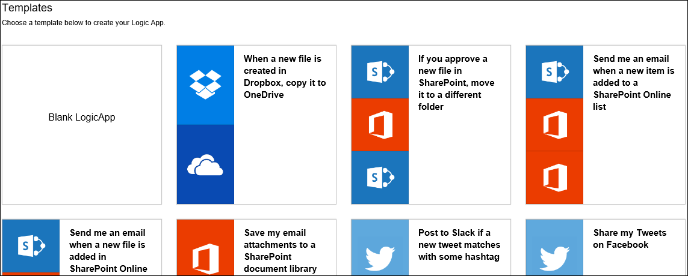
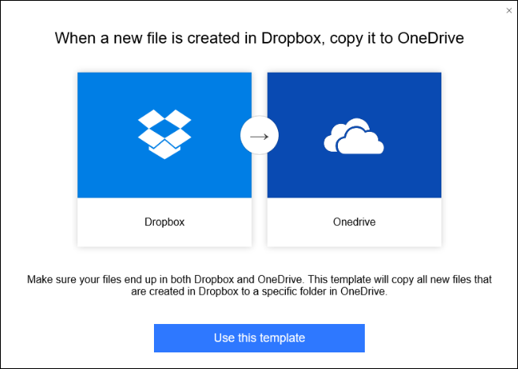
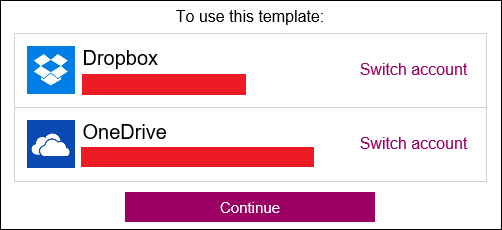
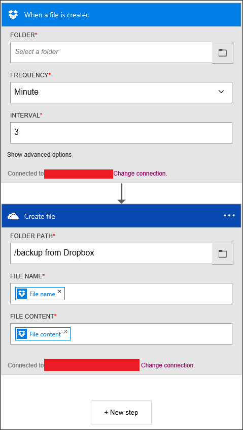
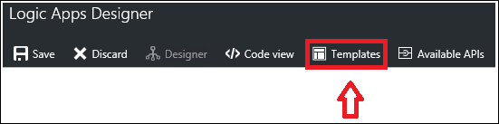
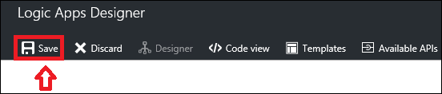

# Configure a workflow using a pre-built template or pattern to get started quickly

## What are logic app templates
A logic app template is a pre-built logic app that you can use to quickly get started creating your own workflow. 

These templates are a good way to discover various patterns that can be built using logic apps. You can either use these templates as-is or modify them to fit your scenario.

## Overview of available templates
There are many available templates currently published in the logic app platform. Some example categories, as well as the type of connectors used in them, are listed below.

### Enterprise cloud templates
Templates that integrate Dynamics CRM, Salesforce, Box, Azure Blob, and other connectors for your enterprise cloud needs. Some examples of what can be done with these templates include organizing your leads and backing up your corporate file data.

### Enterprise integration pack templates
Configurations of VETER (validate, extract, transform, enrich, route) pipelines, receiving an X12 EDI document over AS2 and transforming it to XML, as well as X12 and AS2 message handling.

### Protocol pattern templates
These templates consist of logic apps that contain protocol patterns such as request-response over HTTP as well as integrations across FTP and SFTP. Use these as they exist, or as a basis for creating more complex protocol patterns.  

### Personal productivity templates
Patterns to help improve personal productivity include templates that set daily reminders, turn important work items into to-do lists, and automate lengthy tasks down to a single user approval step.

### Consumer cloud templates
Simple templates that integrate with social media services such as Twitter, Slack, and email, ultimately capable of strengthening social media marketing initiatives. These also include templates such as cloudy copying, which can help increase productivity by saving time spent on traditionally repetitive tasks. 

## How to create a logic app using a template
To get started using a logic app template, go into the logic app designer. If you're entering the designer by opening an existing logic app, the logic app automatically loads in your designer view. However, if you're creating a new logic app, you see the screen below.  
   

From this screen, you can either choose to start with a blank logic app or a pre-built template. If you select one of the templates, you are provided with additional information. In this example, we use the *When a new file is created in Dropbox, copy it to OneDrive* template.  
   

If you choose to use the template, just select the *use this template* button. You'll be asked to sign in to your accounts based on which connectors the template utilizes. Or, if you've previously established a connection with these connectors, you can select continue as seen below.  
   

After establishing the connection and selecting *continue*, the logic app opens in designer view.  
   

In the example above, as is the case with many templates, some of the mandatory property fields may be filled out within the connectors; however, some might still require a value before being able to properly deploy the logic app. If you try to deploy without entering some of the missing fields, you'll be notified with an error message.

If you wish to return to the template viewer, select the *Templates* button in the top navigation bar. By switching back to the template viewer, you lose any unsaved progress. Prior to switching back into template viewer, you'll see a warning message notifying you of this.  
   

## How to deploy a logic app created from a template
Once you have loaded your template and made any desired changes, select the save button in the upper left corner. This saves and publishes your logic app.  
   

If you would like more information on how to add more steps into an existing logic app template, or make edits in general, read more at [Create a logic app](../logic-apps/logic-apps-create-a-logic-app.md).

