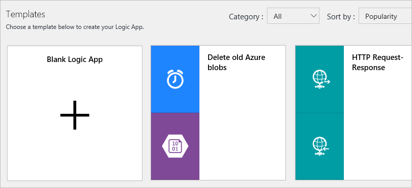

# Build logic app workflows from prebuilt templates

To get you started faster with creating workflows, 
Logic Apps provides templates that are prebuilt logic apps. 
Not only can you use these templates for building workflows, 
but you can also discover commonly-used patterns. 
You can use these templates as provided or edit them to fit your scenario.

For example, here are some template categories:

| Template type | Description | 
| ------------- | ----------- | 
| Enterprise cloud templates | For integrating Azure Blob, Dynamics CRM, Salesforce, Box, and includes other connectors for your enterprise cloud needs. For example, you can use these templates to organize business leads or back up your corporate file data. | 
| Personal productivity templates | Improve personal productivity by setting daily reminders, turning important work items into to-do lists, and automating lengthy tasks down to a single user approval step. | 
| Consumer cloud templates | For integrating social media services such as Twitter, Slack, and email. Useful for strengthening social media marketing initiatives. These templates also include tasks such as cloud copying, which increase productivity by saving time on traditionally repetitive tasks. | 
| Enterprise integration pack templates | For configuring VETER (validate, extract, transform, enrich, route) pipelines, receiving an X12 EDI document over AS2 and transforming to XML, and handling X12, EDIFACT, and AS2 messages. | 
| Protocol pattern templates | For implementing protocol patterns such as request-response over HTTP and integrations across FTP and SFTP. Use these templates as provided, or build on them for complex protocol patterns. | 
||| 

If you don't have an Azure subscription, 
[sign up for a free Azure account](https://azure.microsoft.com/free/) before you begin. For more information about building a logic app, see [Create a logic app](../logic-apps/logic-apps-create-a-logic-app.md).

## Create a new logic app from a template

1. If you haven't already, sign in to the [Azure portal](https://portal.azure.com "Azure portal").

2. From the main Azure menu, choose 
**New** > **Enterprise Integration** > **Logic App**.

   

3. Create your logic app with the settings in the table under this image:

   

   | Setting | Suggested value | Description | 
   | ------- | --------------- | ----------- | 
   | **Name** | *your-logic-app-name* | Provide a unique logic app name. | 
   | **Subscription** | *your-Azure-subscription-name* | Select the Azure subscription that you want to use. | 
   | **Resource group** | *your-Azure-resource-group-name* | Create or select an [Azure resource group](../azure-resource-manager/resource-group-overview.md) for organizing related Azure resources. | 
   | **Location** | *your-Azure-datacenter-region* | Select the datacenter region for deploying your logic app, for example, West US. | 
   | **Log Analytics** | Off | Turn on diagnostic logging for your logic app, but for this quickstart, keep the **Off** setting. | 
   |||| 

4. When you're ready, select **Pin to dashboard**. 
That way, your logic app automatically appears on 
your Azure dashboard and opens after deployment. 
Choose **Create**.

   > [!NOTE]
   > If you don't want to pin your logic app, 
   > you must manually find and open your logic app 
   > after deployment so you can continue.

   After Azure deploys your logic app, the Logic Apps Designer 
   opens and shows a page with an introduction video. 
   Under the video, you can find templates for common logic app patterns. 
   This quickstart builds your logic app from scratch. 

5. Scroll past the introduction video and common triggers to **Templates**. 
Choose a prebuilt template. For example:

   

   > [!TIP]
   > To create your logic app from scratch, choose **Blank Logic App**.

   When you select a prebuilt template, 
   you can view more information about that template. 
   For example:

   

6. To continue with the selected template, 
choose **Use this template**. 

7. Based on the connectors used by the template, 
you might have to sign in with your credentials, 
or create connections for any services or systems 
referenced by that template. To create a connection, 
provide a name for your connection and if required, 
select the resource that you want to use.

   If you have already have these connections, 
   you can choose **Continue**.

   

   Your logic app now opens and appears in the Logic Apps Designer.

   > [!TIP]
   > To return to the template viewer, choose **Templates** 
   > on the designer toolbar. This action discards any unsaved changes, 
   > so a warning message appears.

8. Continue building your logic app.

> [!NOTE] 
> Many templates include connectors that might have 
> already pre-populated required properties. 
> However, some templates might still require that you provide 
> values before you can properly deploy the logic app. 
> If you try to deploy without completing the missing property fields, 
> you get an error message. 

## Update an existing logic app with a template

1. In the [Azure portal](https://portal.azure.com "Azure portal"), 
find and open your logic app in th Logic App Designer.

2. On the designer toolbar, choose **Templates**. 
This action discards any unsaved changes, 
so a warning message appears so you can confirm 
that you want to conitnue. To confirm, choose **OK**. 

   

3. Scroll past the introduction video and common triggers to **Templates**. 
Choose a prebuilt template. For example:

   

   When you select a prebuilt template, 
   you can view more information about that template. 
   For example:

   

4. To continue with the selected template, 
choose **Use this template**. 

5. Based on the connectors used by the template, 
you might have to sign in with your credentials, 
or create connections for any services or systems 
referenced by that template. To create a connection, 
provide a name for your connection and if required, 
select the resource that you want to use.

   If you have already have these connections, 
   you can choose **Continue**.

   

   Your logic app now opens and appears in the Logic Apps Designer.

8. Continue building your logic app. 

   > [!TIP]
   > If you haven't saved your changes, you can discard your work 
   > and return to your previous logic app. On the designer toolbar, 
   > choose **Discard**.

> [!NOTE] 
> Many templates include connectors that might have 
> already pre-populated required properties. 
> However, some templates might still require that you provide 
> values before you can properly deploy the logic app. 
> If you try to deploy without completing the missing property fields, 
> you get an error message.

## Deploy a logic app created from a template

After you make your changes to the template, 
you can save your changes, which also publishes your logic app. 

On the designer toolbar, choose **Save**.

  

## Next steps

Learn about building logic apps through examples, 
scenarios, customer stories, and walkthroughs.

> [!div class="nextstepaction"]
> [Review logic app examples, scenarios, and walkthroughs](../logic-apps/logic-apps-examples-and-scenarios.md)