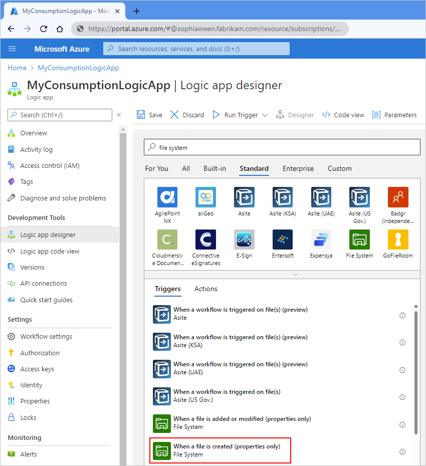
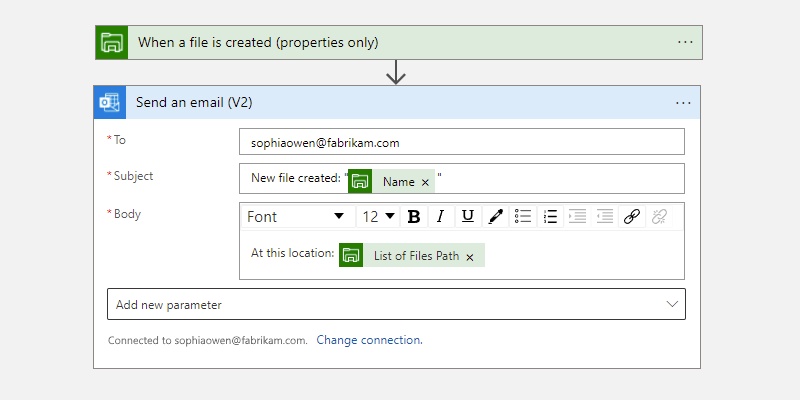
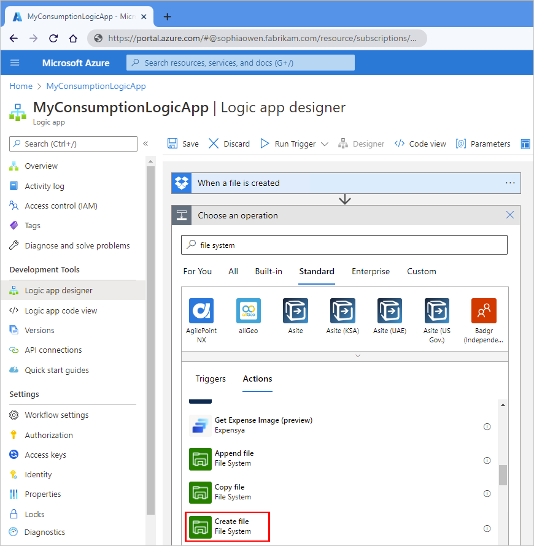
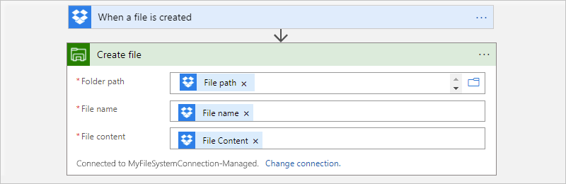
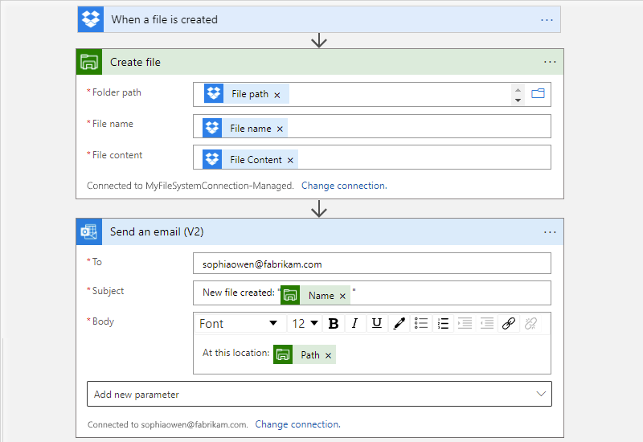

# Connect to on-premises file systems from Azure Logic Apps

[!INCLUDE [logic-apps-sku-consumption](../../includes/logic-apps-sku-consumption.md)]

With the File System connector, you can create automated integration workflows in Azure Logic Apps that manage files on an on-premises file share, for example:

- Create, get, append, update, and delete files.
- List files in folders or root folders.
- Get file content and metadata.

This article shows how to connect to an on-premises file system through an example scenario where you copy a file from a Dropbox account to a file share, and then send an email. If you're new to logic apps, review [What is Azure Logic Apps?](../logic-apps/logic-apps-overview.md).

## Limitations

- The File System connector currently supports only Windows file systems on Windows operating systems.
- Mapped network drives aren't supported.
- If you have to use the on-premises data gateway, your gateway installation and file system server must exist in the same Windows domain. For more information, review [Install on-premises data gateway for Azure Logic Apps](logic-apps-gateway-install.md) and [Connect to on-premises data sources from Azure Logic Apps](logic-apps-gateway-connection.md).

## Connector reference

For connector-specific technical information, such as triggers, actions, and limits as described by the connector's Swagger file, see the [connector's reference page](/connectors/filesystem/).

> [!NOTE]
>
> If your logic app runs in an integration service environment (ISE), and you use this connector's ISE version, 
> review [ISE message limits](logic-apps-limits-and-config.md#message-size-limits) and 
> [Access to Azure virtual networks with an integration service environment](connect-virtual-network-vnet-isolated-environment-overview.md).

## Prerequisites

* An Azure account and subscription. If you don't have an Azure subscription, [sign up for a free Azure account](https://azure.microsoft.com/free/?WT.mc_id=A261C142F).

* To create the connection to your file system, different requirements apply based on your logic app and the hosting environment:

  - For Consumption logic app workflows in multi-tenant Azure Logic Apps, the *managed* File System connector requires that you use the on-premises data gateway resource in Azure to securely connect and access on-premises systems. After you install the on-premises data gateway and create the data gateway resource in Azure, you can select the data gateway resource when you create the connection to your file system from your workflow. For more information, review the following documentation:

    - [Managed connectors in Azure Logic Apps](../connectors/managed.md)
    - [Install on-premises data gateway for Azure Logic Apps](logic-apps-gateway-install.md)
    - [Connect to on-premises data sources from Azure Logic Apps](logic-apps-gateway-connection.md)

  - For logic app workflows in an integration service environment (ISE), you can use the connector's ISE version, which doesn't require the data gateway resource.

* Access to the computer that has the file system you want to use. For example, if you install the data gateway on the same computer as your file system, you need the account credentials for that computer.

* For the example scenarios in this article, you need an email account from a provider that's supported by Azure Logic Apps, such as Office 365 Outlook, Outlook.com, or Gmail. For other providers, [review other supported email connectors](/connectors/connector-reference/connector-reference-logicapps-connectors). This logic app workflow uses the Office 365 Outlook connector with a work or school account. If you use another email account, the overall steps are the same, but your UI might slightly differ.

  > [!IMPORTANT]
  > If you want to use the Gmail connector, only G-Suite business accounts can use this connector without restriction in logic apps. 
  > If you have a Gmail consumer account, you can use this connector with only specific Google-approved services, or you can 
  > [create a Google client app to use for authentication with your Gmail connector](/connectors/gmail/#authentication-and-bring-your-own-application). 
  > For more information, see [Data security and privacy policies for Google connectors in Azure Logic Apps](../connectors/connectors-google-data-security-privacy-policy.md).

* For the example File System action scenario, you need a [Dropbox account](https://www.dropbox.com/), which you can sign up for free.

* Basic knowledge about [how to create logic apps](../logic-apps/quickstart-create-first-logic-app-workflow.md). To add any trigger, you have to start with a blank workflow.

## Add a File System trigger

1. In the [Azure portal](https://portal.azure.com), open your logic app in the workflow designer.

1. On the designer, under the search box, select **All**. In the search box, enter **file system**. From the triggers list, select the File System trigger that you want. This example continues with the trigger named **When a file is created**.

   

1. If you're prompted to create your file system server connection, provide the following information as required:

   | Property | Required | Value | Description |
   |----------|----------|-------|-------------|
   | **Connection name** | Yes | <*connection-name*> | The name to use for your connection |
   | **Root folder** | Yes | <*root-folder-name*> | The root folder for your file system, which is usually the main parent folder and is the folder used for the relative paths with all triggers that work on files.   For example, if you installed the on-premises data gateway, use the local folder on the computer with the data gateway installation. Or, use the folder for the network share where the computer can access that folder, for example, **`\\PublicShare\\MyFileSystem`**. |
   | **Authentication Type** | No | <*auth-type*> | The type of authentication that your file system server uses, which is **Windows** |
   | **Username** | Yes | <*domain-and-username*> | The domain and username for the computer where you have your file system.   For the managed File System connector, use one of the following values with the backslash (**`\`**):   - **<*domain*>\\<*username*>**  - **<*local-computer*>\\<*username*>**   For example, if your file system folder is on the same computer as the on-premises data gateway installation, you can use **<*local-computer*>\\<*username*>**.   - For the ISE-based File System connector, use the forward slash instead (**`/`**):   - **<*domain*>/<*username*>**  - **<*local-computer*>/<*username*>** |
   | **Password** | Yes | <*password*> | The password for the computer where you have your file system |
   | **gateway** | No | - <*Azure-subscription*>  - <*gateway-resource-name*> | This section applies only to the managed File System connector:   - **Subscription**: The Azure subscription associated with the data gateway resource  - **Connection Gateway**: The data gateway resource |
   |||||

   The following example shows the connection information for the managed File System trigger:

   

   The following example shows the connection information for the ISE-based File System trigger:

   

1. After you provide the required information for your connection, select **Create**.

   Azure Logic Apps creates and tests your connection, making sure that the connection works properly. If the connection is set up correctly, the setup options appear for your selected trigger.

1. Continue building your workflow.

   1. Provide the required information for your trigger.

      For this example, select the folder path on your file system server to check for a newly created file. Specify the number of files to return and how often you want to check.

      

   1. To test your workflow, add an Outlook action that sends you an email when a file is created on the file system in specified folder. Enter the email recipients, subject, and body. For testing, you can use your own email address.

      

      > [!TIP]
      >
      > To add outputs from previous steps in the workflow, click inside the trigger's edit boxes. 
      > When the dynamic content list appears, select from the available outputs.

1. Save your logic app. Test your workflow by uploading a file and triggering the workflow.

   If successful, your workflow sends an email about the new file.

## Add a File System action

1. In the [Azure portal](https://portal.azure.com), open your logic app in the workflow designer, if not already open.

1. After the last step or between steps in your workflow, add a new step or action.

   This example uses a Dropbox trigger and follows that step with a File System action.

1. Under the **Choose an operation** search box, select **All**. In the search box, enter **file system**.

1. From the actions list, select the File System action that you want. This example continues with the action named **Create file**.

   

1. If you're prompted to create your file system server connection, provide the following information as required:

   | Property | Required | Value | Description |
   |----------|----------|-------|-------------|
   | **Connection name** | Yes | <*connection-name*> | The name to use for your connection |
   | **Root folder** | Yes | <*root-folder-name*> | The root folder for your file system, which is usually the main parent folder and is the folder used for the relative paths with all triggers that work on files.   For example, if you installed the on-premises data gateway, use the local folder on the computer with the data gateway installation. Or, use the folder for the network share where the computer can access that folder, for example, **`\\PublicShare\\MyFileSystem`**. |
   | **Authentication Type** | No | <*auth-type*> | The type of authentication that your file system server uses, which is **Windows** |
   | **Username** | Yes | <*domain-and-username*> | The domain and username for the computer where you have your file system.   For the managed File System connector, use one of the following values with the backslash (**`\`**):   - **<*domain*>\\<*username*>**  - **<*local-computer*>\\<*username*>**   For example, if your file system folder is on the same computer as the on-premises data gateway installation, you can use **<*local-computer*>\\<*username*>**.   - For the ISE-based File System connector, use the forward slash instead (**`/`**):   - **<*domain*>/<*username*>**  - **<*local-computer*>/<*username*>** |
   | **Password** | Yes | <*password*> | The password for the computer where you have your file system |
   | **gateway** | No | - <*Azure-subscription*>  - <*gateway-resource-name*> | This section applies only to the managed File System connector:   - **Subscription**: The Azure subscription associated with the data gateway resource  - **Connection Gateway**: The data gateway resource |
   |||||

   The following example shows the connection information for the managed File System action:

   

   The following example shows the connection information for the ISE-based File System action:

   

1. After you provide the required information for your connection, select **Create**.

   Azure Logic Apps creates and tests your connection, making sure that the connection works properly. If the connection is set up correctly, the setup options appear for your selected action.

1. Continue building your workflow.

   1. Provide the required information for your action.

      For this example, select the folder path on your file system server to use, which is the root folder here. Enter the file name and content, based on the file uploaded to Dropbox.

      

      > [!TIP]
      >
      > To add outputs from previous steps in the workflow, click inside the trigger's edit boxes. 
      > When the dynamic content list appears, select from the available outputs.

   1. To test your workflow, add an Outlook action that sends you an email when the File System action creates a file. Enter the email recipients, subject, and body. For testing, you can use your own email address.

      

1. Save your logic app. Test your workflow by uploading a file to Dropbox.

   If successful, your workflow creates a file on your file system server, based on the uploaded file in DropBox, and sends an email about the created file.

## Next steps

* Learn how to [connect to on-premises data](../logic-apps/logic-apps-gateway-connection.md) 
* Learn about other [Logic Apps connectors](../connectors/apis-list.md)
