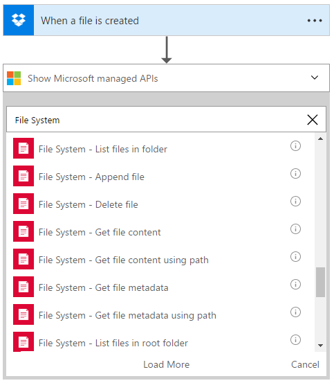
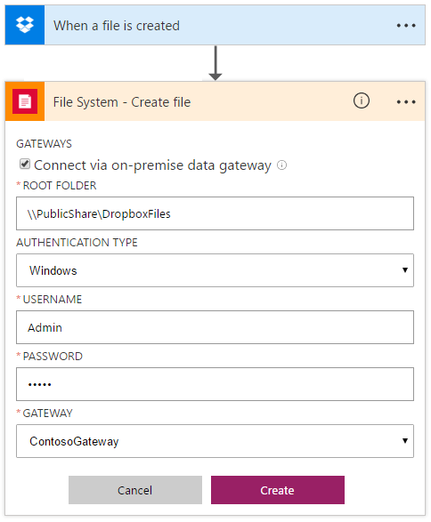

# Connect to on-premises file systems from logic apps with the File System connector

Hybrid cloud connectivity is central to logic apps, so to manage data and securely access on-premises resources, 
your logic apps can use the on-premises data gateway. In this article, we show how to connect to an on-premises 
file system with a basic scenario: copy a file that's uploaded to Dropbox to a file share, then send an email.

## Prerequisites

- Install and configure the latest [on-premises data gateway](https://www.microsoft.com/download/details.aspx?id=53127).
- Install the latest on-premises data gateway, version 1.15.6150.1 or above. [Connect to the on-premises data gateway](http://aka.ms/logicapps-gateway) lists the steps. The gateway must be installed on an on-premises machine before you can continue with the rest of the steps.

## Add trigger and actions for connecting to your file system

1. Create a logic app, and add this Dropbox trigger: **When a file is created** 
2. Under the trigger, choose **Next Step** > **Add an action**. 
3. In the search box, enter `file system` so you can view all supported actions 
for the File System connector.

   

2. Choose the **Create file** action, and create a connection to your file system.

   If you don't have an existing connection, you are prompted to create one.

   1. Choose **Connect via on-premises data gateway**. More properties appear.
   2. Select your root folder for your file system.
      
       > [!NOTE]
       > The root folder is the main parent folder, which is used for relative paths for all file-related actions. 
       > You can specify a local folder on the machine where the on-premises data gateway is installed, 
       > or the folder can be a network share that the machine can access.

   3. Enter the username and password for the gateway.
   4. Select the gateway that you previously installed.

       

3. After you provide all the details, choose **Create**. 

   Logic Apps configures and tests your connection, making sure that the connection works properly. 
   If the connection is set up correctly, you see options for the action that you previously selected. 
   The file system connector is now ready for use.

4. Specify that you want to copy files from Dropbox to the root folder for your on-premises file share.

   

5. After your logic app copies the file, add an Outlook action that sends an email 
so relevant users know about the new file. Enter the recipients, title, 
and body of the email. 

   In the dynamic content selector, you can choose data outputs 
   from the file connector so you can add more details to the email.

   

6. Save your logic app. Test your app by uploading a file to Dropbox. 
The file should get copied to the on-premises file share, and you should receive an email about the operation.

   > [!TIP] 
   > Learn how to [monitor your logic apps](../logic-apps/logic-apps-monitor-your-logic-apps.md).

Congratulations, you now have a working logic app that can connect to your on-premises file system. 
Try exploring other functionalities that the connector offers, for example:

- Create file
- List files in folder
- Append file
- Delete file
- Get file content
- Get file content using path
- Get file metadata
- Get file metadata using path
- List files in root folder
- Update file

## View the swagger
See the [swagger details](/connectors/fileconnector/). 

## Get help

To ask questions, answer questions, and learn what other Azure Logic Apps users 
are doing, visit the [Azure Logic Apps forum](https://social.msdn.microsoft.com/Forums/en-US/home?forum=azurelogicapps).

To help improve Azure Logic Apps and connectors, vote on or submit ideas at the 
[Azure Logic Apps user feedback site](http://aka.ms/logicapps-wish).

## Next steps

- [Connect to on-premises data](../logic-apps/logic-apps-gateway-connection.md) from logic apps
- Learn about [enterprise integration](../logic-apps/logic-apps-enterprise-integration-overview.md)
