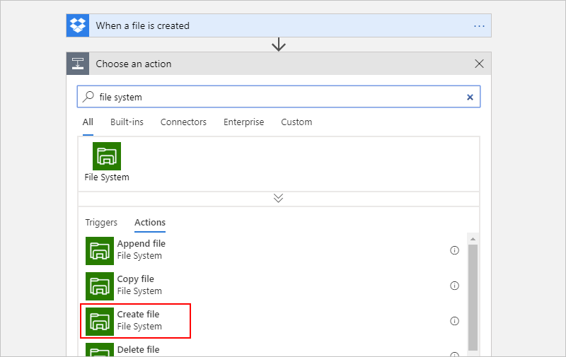
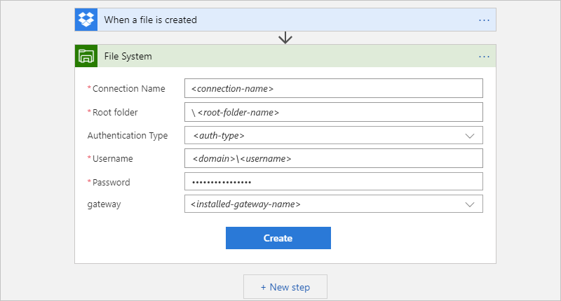
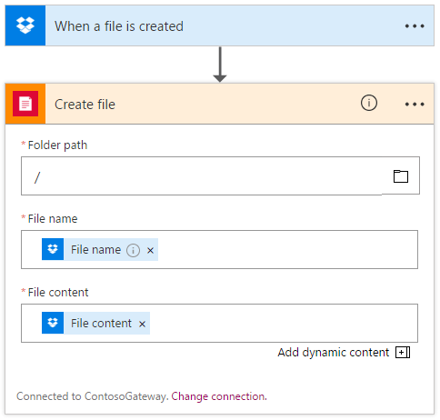
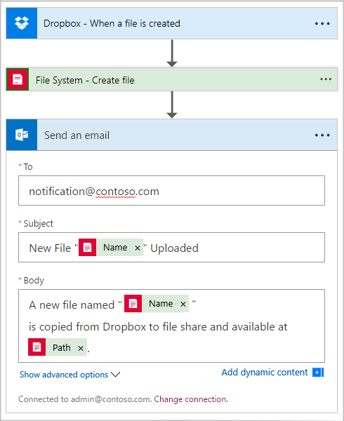

# Connect to on-premises file systems with Azure Logic Apps

With the File System connector and Azure Logic Apps, 
you can create automated tasks and workflows that 
create and manage files on an on-premises file share, 
for example:  

- Create, get, append, update, and delete files
- List files in folders or root folders.
- Get file content and metadata.

This article shows how you can connect to an on-premises 
file system as described by this example scenario: 
copy a file that's uploaded to Dropbox to a file share, 
and then send an email. To securely connect and access on-premises systems, 
logic apps use the [on-premises data gateway](../logic-apps/logic-apps-gateway-connection.md). 
If you're new to logic apps, review [What is Azure Logic Apps?](../logic-apps/logic-apps-overview.md)

## Prerequisites

* An Azure subscription. If you don't have an Azure subscription, 
<a href="https://azure.microsoft.com/free/" target="_blank">sign up for a free Azure account</a>. 

* Before you can connect logic apps to on-premises 
systems such as your file system server, you need to 
[install and set up an on-premises data gateway](../logic-apps/logic-apps-gateway-install.md). 
That way, you can specify to use your gateway installation when 
you create the file system connection from your logic app.

* A [Drobox account](https://www.dropbox.com/) and your user credentials

  Your credentials authorize your logic app to create 
  a connection and access your Drobox account. 

* Basic knowledge about [how to create logic apps](../logic-apps/quickstart-create-first-logic-app-workflow.md). 
For this example, you need a blank logic app.

## Add trigger

[!INCLUDE [Create connection general intro](../../includes/connectors-create-connection-general-intro.md)]

1. Sign in to the [Azure portal](https://portal.azure.com), 
and open your logic app in Logic App Designer, if not open already.

1. In the search box, enter "dropbox" as your filter. 
From the triggers list, select this trigger: 
**When a file is created** 

   

1. Sign in with your Dropbox account credentials, 
and authorize access to your Dropbox data for Azure Logic Apps. 

1. Provide the required information for your trigger.

   

## Add actions

1. Under the trigger, choose **Next step**. 
In the search box, enter "file system" as your filter. 
From the actions list, select this action: 
**Create file - File System**

   

1. If you don't already have a connection to your file system, 
you're prompted to create a connection.

   

   | Property | Required | Value | Description | 
   | -------- | -------- | ----- | ----------- | 
   | **Connection Name** | Yes | <*connection-name*> | The name you want for your connection | 
   | **Root folder** | Yes | <*root-folder-name*> | The root folder for your file system, such as a local folder on the computer where the on-premises data gateway is installed, or the folder for a network share that the computer can access. 
For example: `\\PublicShare\\DropboxFiles` 
The root folder is the main parent folder, which is used for relative paths for all file-related actions. | 
   | **Authentication Type** | No | <*auth-type*> | The type of authentication that your file system uses, for example, **Windows** | 
   | **Username** | Yes | <*domain*>\\<*username*> | The username for your previously installed data gateway | 
   | **Password** | Yes | <*your-password*> | The password for your previously installed data gateway | 
   | **gateway** | Yes | <*installed-gateway-name*> | The name for your previously installed gateway | 
   ||| 

1. When you're done, choose **Create**. 

   Logic Apps configures and tests your connection, 
   making sure that the connection works properly. 
   If the connection is set up correctly, 
   options appear for the action that you previously selected. 

1. In the **Create file** action, provide the details
for copying files from Dropbox to the root folder in your 
on-premises file share. To add outputs from previous steps, 
click inside the boxes, and select from available fields 
when the dynamic content list appears.

   

1. Now, add an Outlook action that sends an email 
so the appropriate users know about the new file. 
Enter the recipients, title, and body of the email. 
For testing, you can use your own email address.

   

1. Save your logic app. Test your app by uploading a file to Dropbox. 

   Your logic app should copy the file to your on-premises file share, 
   and send the recipients an email about the copied file.

## Connector reference

For technical details about triggers, actions, and limits, which are 
described by the connector's OpenAPI (formerly Swagger) description, 
review the connector's [reference page](/connectors/fileconnector/).

## Get support

* For questions, visit the 
[Azure Logic Apps forum](https://social.msdn.microsoft.com/Forums/en-US/home?forum=azurelogicapps).

* To help improve Azure Logic Apps and connectors, vote on or submit ideas at the 
[Azure Logic Apps User Voice site](http://aka.ms/logicapps-wish).

## Next steps

* Learn how to [connect to on-premises data](../logic-apps/logic-apps-gateway-connection.md) 
* Learn about other [Logic Apps connectors](../connectors/apis-list.md)
