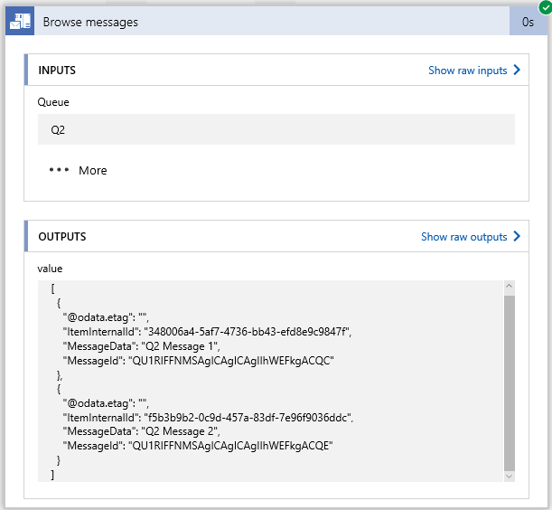

# Connect to an MQ Server from Logic Apps with the MQ Connector 

Microsoft Connector for MQ sends and retrieves messages stored in an MQ Server. This connector includes a Microsoft MQ client
to communicate with a remote MQ server across a TCP/IP network. This includes on-premises databases using the on-premises 
data gateway. This document is a starter guide for using the MQ connector. It is recommended to begin by browsing a single message 
on a queue, then proceed to trying the other actions.    

The MQ connector supports operations which are available as actions, the MQ connector cannot be configured as a trigger. 
The following actions are available: 
-	Browse a single message without deleting the message from the MQ Server
-	Browse a batch of messages without deleting the messages from the MQ Server
-	Receive a single message and delete the message from the MQ Server
-	Receive a batch of messages and delete the messages from the MQ Server
-	Send a single message to the MQ Server 

## Prerequisites

### On-premises Data Gateway
> [!NOTE]
> - If the MQ Server is located within a private network, then installing the On-premises Data Gateway is required. If the MQ Server 
> is publicly accessible or accessible within Azure, then no gateway is required.
> - The On-premises Data Gateway must have .Net Framework 4.6 installed for the MQ Connector to function.

1. Install the on-premises data gateway from https://powerbi.microsoft.com/en-us/gateway on a server within the private network 
(direct download link: https://go.microsoft.com/fwlink/?LinkId=820925). After the installation is finished, there is the opportunity
to configure the gateway to connect to Azure, during the configuration you will select a name for the gateway. When the configuration 
is complete, the following will be displayed:

2. Next a connection to the on-premises data gateway must be configured in Azure. In the **Azure start board**, select **+** (plus sign), 
and in the Search the marketplace box type on-prem, select **On-premises data gateway** in the drop down items that appear.

3. Click on the On-premises data gateway in the window that opens, then click the **Create** button.

4. Fill out the properties. The location should be configured for the same location that the Logic App will be running in. 
The Installation Name is the name of the on-premises gateway configured in step 1 – this field will automatically be populated 
for any gateways that have not had a connection gateway configured within Azure. Once the properties are configured, select **Create**.

## Create a Logic App

1. In the **Azure start board**, select **+** (plus sign), **Web + Mobile**, and then **Logic App**. 
2. Enter the **Name**, such as MQTestApp, **Subscription**, **Resource group**, and **Location** (use the location where the 
On-premises Data Gateway connection is configured). Select **Pin to dashboard**, and select **Create**. 

## Add a trigger
> [!NOTE]
> The MQ Connector does not support Triggers at this time, these instructions use the Recurrence trigger. 
1. The **Logic Apps Designer** will open, click **Recurrence** in the list of common triggers.
2. Click on **Edit** within the Recurrence Trigger. 
3. Set the **Frequency** to **Day**, and set the **Interval** to **7**. 

## Browse a single message
1. Click the **+ New step** box, and select **Add an action**.
2. In the search box type mq and then select **MQ – Browse message (Preview)**.

3. If there are no MQ Connections already configured, the connection configuration pane will be displayed. 
Check the box for **Connect via on-premise data gateway**. For the properties, the Server name is entered 
as a name or ip address followed by a colon and the port number. In the last field **gateway** – the dropdown 
box will display the gateway connections that have been configured. Fill in the properties and select **Create**.

4. There is an option to access a different queue name than what is defined in the connection. There are other 
entries to browse for a message based on various MQ Message properties. The IncludeInfo option indicates whether 
or not to include additional message information in the output. The Timeout value indicates how long to wait for
a message to arrive in an empty queue.  If nothing is entered, the first message in the queue is retrieved and there 
is no time spent waiting for a message to appear. 

5. Select **Save** and then select **Run**. The designer screen will go blank as the run is started.

6. After several seconds the steps of the run will be shown and you can look at the output. Click on the green 
circle with the checkmark in the top right to see details for the step. Click on See raw outputs to see further 
details regarding the output data.

Raw output:

7. When the **IncludeInfo** option is set to true, the following output is displayed. 

## Browse multiple messages
The **Browse messages** action includes a **BatchSize** option to indicate how many messages should be returned from 
the queue.  If **BatchSize** has no entry, all messages will be returned. The output that is returned is an array of messages.
1. When adding the **Browse messages** action, the first connection that was set up will be selected by default. 
Click on **Change connection** to either create a new connection or select a different connection.

2. The output of Browse messages appears as follows:

## Receive a single message
The **Receive message** action has the same inputs and outputs as the **Browse message** action. When using 
**Receive message** the message is deleted from the queue.

## Receive multiple messages
The **Receive messages** action has the same inputs and outputs as the **Browse messages** action. When using 
**Receive messages** the messages are deleted from the queue.

If there are no messages in the queue when doing a browse or a receive, the step will fail with the following output:

## Send a message
1. When adding the **Send message** action, the first connection that was set up will be selected by default. 
Click on **Change connection** to either create a new connection or select a different connection. The valid **Message Types**
are **Datagram, Reply, or Request**. 

2. The output of Send message looks like this:

## Technical Details

## Triggers
The MQ Connector does not have any Triggers at this time.

## Actions
An action is an operation carried out by the workflow defined in a Logic App. The MQ Connector includes the following actions:

| Action | Description |
| --- | --- |
| [BrowseMessage](logic-apps-MQ-Connector.md#Browse-Message-or-Receive-Message) |Non destructive retrieval of a single message from an MQ queue |
| [BrowseMessages](logic-apps-MQ-Connector.md#BrowseMessages-or-Receive-Messages) |Non destructive retrieval of a several messages from an MQ queue |
| [ReceiveMessage](logic-apps-MQ-Connector.md#BrowseMessage-or-Receive-Message) |Destructive retrieval of a single message from an MQ queue |
| [ReceiveMessages](logic-apps-MQ-Connector.md#BrowseMessages-or-Receive-Messages) |Destructive retrieval of a several messages from an MQ queue |
| [SendMessage](logic-apps-MQ-Connector.md#Send-Message) |Sends a single message to an MQ queue |

### Action Details
In this section, see the specific details about each action, including any required or optional input properties, and any corresponding
output associated with the connector.
#### Browse Message or Receive Message
Retrieves a single message from an MQ queue. The **Browse Message** does not delete the message from the MQ queue. The **Receive 
Message** action deletes the message from the MQ queue.

| Property Name | Display Name | Description |
| --- | --- | --- |
| Queue |Queue | Override the queue name defined in the connection properties |
| MessageId |MessageId |Base 64 string with the Message Id of the message to retrieve |
| CorrelationId |CorrelationId |Base 64 string with the Correlation Id of the message to retrieve |
| GroupId |GroupId |Base 64 string with the Group Id of the message to retrieve |
| MessageToken |MessageToken |Base 64 string with the Message Token of the message to retrieve |
| Offset |Offset |Offset in bytes of the data in the physical message |
| LogicalSequenceNumber |LogicalSequenceNumber |The message sequence number in the queue |
| IncludeInfo |IncludeInfo |A value of true or false indicating how many fields will be returned in the output |
| Timeout |Timeout | The amount of time to wait for a message to appear in the queue |

An asterisk (*) means the property is required.

##### Output Details
When **IncludeInfo** is set to false, only the **MessageData** and **MessageId** are returned. The remaining items are returned if
**IncludeInfo** is set to true.

| Property Name | Data Type |
| --- | --- |
| MessageData |string |
| MessageId |string |
| *When **IncludeInfo** is true:* |    |
| PutDateTime |string |
| UserIdentifier |string |
| PutApplicationName |string |
| PutApplicationType |string |
| Format |string |
| AccountingToken |string |
| Ccsid |string |
| LogicalSequenceNumber |string |
| MessageType |string |
| Offset |string |
| OriginalLength |string |
| Persistence |string |
| Priority |string |
| ReplyToQueueManager |string |

#### Browse Messages or Receive Messages
Retrieves several messages from an MQ queue. The **Browse Messages** does not delete the messages from the MQ queue. The **Receive 
Messages** action deletes the messages from the MQ queue. These actions add a property named **BatchSize** to indicate how many
messages to be received. If the **BatchSize** is not set, all messages meeting the query will be returned. The output that is 
returned is an array of messages.

| Property Name | Display Name | Description |
| --- | --- | --- |
| CorrelationId |CorrelationId |Base 64 string with the Correlation Id of the message to retrieve |
| GroupId |GroupId |Base 64 string with the Group Id of the message to retrieve |
| MessageId |MessageId |Base 64 string with the Message Id of the message to retrieve |
| Queue |Queue | Override the queue name defined in the connection properties |
| BatchSize |BatchSize | The maximum number of messages to retreive from the queue |
| IncludeInfo |IncludeInfo |A value of true or false indicating how many fields will be returned in the output |
| LogicalSequenceNumber |LogicalSequenceNumber |The message sequence number in the queue |
| MessageToken |MessageToken |Base 64 string with the Message Token of the message to retrieve |
| Offset |Offset |Offset in bytes of the data in the physical message |
| Timeout |Timeout | The amount of time to wait for a message to appear in the queue |

An asterisk (*) means the property is required.

##### Output Details
When **IncludeInfo** is set to false, only the **MessageData** and **MessageId** are returned. The remaining items are returned if
**IncludeInfo** is set to true.

| Property Name | Data Type |
| --- | --- |
| MessageData |string |
| MessageId |string |
| *When **IncludeInfo** is true:* |    |
| PutDateTime |string |
| UserIdentifier |string |
| PutApplicationName |string |
| PutApplicationType |string |
| Format |string |
| AccountingToken |string |
| Ccsid |string |
| LogicalSequenceNumber |string |
| MessageType |string |
| Offset |string |
| OriginalLength |string |
| Persistence |string |
| Priority |string |
| ReplyToQueueManager |string |

#### Send Message
Sends a message to an MQ queue. 

| Property Name | Display Name | Description |
| --- | --- | --- |
| Message * |Message |Message data |
| CorrelationId |CorrelationId |Base 64 string with the Correlation Id for the message | 
| MessageType |MessageType |Datagram, Reply, or Request |
| Queue |Queue | Override the queue name defined in the connection properties |
| CodeCharSetId |CodeCharSetId | The Character set for the message |
| MessageId |MessageId |Base 64 string with the Message Id of the message to retrieve |
| Offset |Offset |Offset in bytes of the data in the physical message |
| ReplyToQueue |ReplyToQueue | The Reply-to queue to include in the message |
| ReplyToQueueManager |ReplyToQueueManager | The Reply-to queue manager to include in the message |

An asterisk (*) means the property is required.

##### Output Details
When **IncludeInfo** is set to false, only the **MessageData** and **MessageId** are returned. The remaining item is returned if
**IncludeInfo** is set to true.

| Property Name | Data Type |
| --- | --- |
| MessageData |string |
| MessageId |string |
| CorrelationId |string |

