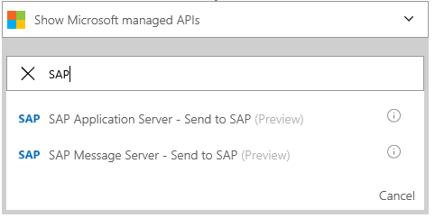

# Get started with the SAP Connector 

Hybrid cloud connectivity is at the heart of Logic Apps. On-premises data gateway enables you to manage data and securely access resources that are on-premises from Logic Apps. In this article, we demonstrate how to connect to an on-premises SAP system with a simple scenario: Request an IDOC over HTTP and send the response back.    

 > [!NOTE]
 > This SAP Connector supports the following SAP Systems
 > There is currently a limitation to time out in Logic Apps that block requests over 90 seconds
 > There is currently a limitation to how many fields to show in the file picker (paths may be added manually)
 >
 >

## Prerequisites
- Install and configure the latest [on-premises data gateway](https://www.microsoft.com/en-us/download/details.aspx?id=53127).  

    Install the latest on-premises data gateway, version 1.15.6150.1 or above, if you haven’t already. Instructions can be found in [this article](http://aka.ms/logicapps-gateway). The gateway must be installed on an on-premises machine before you can continue with the rest of the steps.

- Download and install the latest SAP Client library on the same machine where you installed the universal gateway

## Use SAP Connector

1. Let’s create an HTTP Request trigger, then, select the SAP connector action by typing “SAP” in the search field.    
 

2. Choose “SAP” (ApplicationHost or MessagingHost based on your SAP setup) and create a connection for it by using the universal gateway.
 - If you don't have an existing connection, you are prompted to create one.
 - Check “Connect via on-premises data gateway” option, you see additional fields shows up once the checkbox is selected.
 - Specify the connection name string
 - Select the gateway you installed from previous step or select “Install Gateway” to install a new gateway.   
    
  
  > [!NOTE]
  > There are two different SAP Connections, one for [Application Host](https://wiki.scn.sap.com/wiki/display/ABAP/ABAP+Application+Server) and another for [Messaging host](http://help.sap.com/saphelp_nw70/helpdata/en/40/c235c15ab7468bb31599cc759179ef/frameset.htm)
  >
  >

3. Once you have provided all the details, click “Create”. Logic Apps configure and test the connection to make sure it's working properly. If everything checks out, you see options for the card you selected previously, use the file picker to find the right IDOC category or manually type in the path and select the HTTP response in the body field.    
 

4. Create an HTTP Response by adding a new action, the response message should be from the SAP output

5. Save your Logic App and test it by sending an IDOC through the HTTP trigger URL

6. Once the IDOC is sent, wait for the response from the Logic App   

  > [!TIP]
  > Check out how to [monitor your Logic Apps](../logic-apps/logic-apps-monitor-your-logic-apps.md).
  >
  >

7. All done, now you have a working Logic App using the SAP connector. You can start exploring other functionalities it offers:
  - BAPI
  - RFC

## Next steps
- Learn about [Enterprise Integration Pack](../logic-apps/logic-apps-enterprise-integration-overview.md). 
- Create an [on-premises connection](../logic-apps/logic-apps-gateway-connection.md) to Logic Apps.