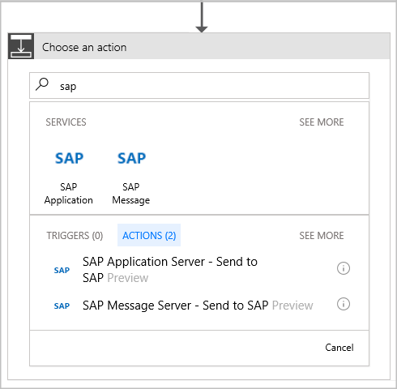
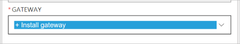
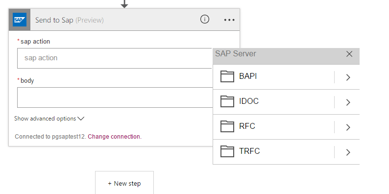

# Connect to an on-premises SAP system from logic apps with the SAP connector 

The on-premises data gateway enables you to manage data, and securely access resources that are on-premises. 
This topic shows how you can connect logic apps to an on-premises SAP system. In this example, your logic app 
requests an IDOC over HTTP and sends the response back.    

> [!NOTE]
> Current limitations: 
> - Your logic app times out if all steps required for the response don't finish within the 
> [request timeout limit](./logic-apps-limits-and-config.md). In this scenario, requests might get blocked. 
> - The file picker does not display all the available fields. In this scenario, you can manually add paths.

## Prerequisites

- Install and configure the latest [on-premises data gateway](https://www.microsoft.com/download/details.aspx?id=53127) version 1.15.6150.1 or newer. [How to connect to the on-premises data gateway in a logic app](http://aka.ms/logicapps-gateway) lists the steps. The gateway must be installed on an on-premises machine before you can proceed.

- Download and install the latest SAP client library on the same machine where you installed the data gateway. Use any of the following SAP versions: 
	- SAP Server
		- SAP ECC 6.0 Unicode
		- SAP ECC 6.0 Unicode with EHP 4.0
		- SAP ECC 6.0 with EHP 7.0 and all EHP previous versions
 
	- SAP Client
		- SAP .NET Connector (NCo) 3.0

## Add triggers and actions for connecting to your SAP system

The SAP connector has actions, but not triggers. 
So, we have to use another trigger at the start of the workflow. 

1. Add the Request/Response trigger, and then select **New step**.

2. Select **Add an action**, and then select the SAP connector by typing `SAP` in the search field:    

     

3. Select [**SAP Application Server**](https://wiki.scn.sap.com/wiki/display/ABAP/ABAP+Application+Server) 
or [**SAP Message Server**](http://help.sap.com/saphelp_nw70/helpdata/en/40/c235c15ab7468bb31599cc759179ef/frameset.htm), 
based on your SAP setup. If you don't have an existing connection, you are prompted to create one.

   1. Select **Connect via on-premises data gateway**, and enter the details for your SAP system:   

         

   2. Under **Gateway**, select an existing gateway, or to install a new gateway, select **Install Gateway**.

        
  
   3. After you enter all the details, select **Create**. 
   Logic Apps configures and tests the connection, making sure that the connection works properly.

4. Enter a name for your SAP connection.

5. The different SAP options are now available. To find your IDOC category, select from the list. 
Or manually type in the path, and select the HTTP response in the **body** field:

     

6. Add the action for creating an **HTTP Response**. 
The response message should be from the SAP output.

7. Save your logic app. Test it by sending an IDOC through the HTTP trigger URL. 
After the IDOC is sent, wait for the response from the logic app:   

     > [!TIP]
     > Check out how to [monitor your Logic Apps](../logic-apps/logic-apps-monitor-your-logic-apps.md).

Now that the SAP connector is added to your logic app, start exploring other functionalities:

- BAPI
- RFC

## Get help

To ask questions, answer questions, and learn what other Azure Logic Apps users 
are doing, visit the [Azure Logic Apps forum](https://social.msdn.microsoft.com/Forums/en-US/home?forum=azurelogicapps).

To help improve Azure Logic Apps and connectors, vote on or submit ideas at the 
[Azure Logic Apps user feedback site](http://aka.ms/logicapps-wish).

## Next steps

- Learn how to validate, transform, and other BizTalk-like functions in the [Enterprise Integration Pack](../logic-apps/logic-apps-enterprise-integration-overview.md). 
- [Connect to on-premises data](../logic-apps/logic-apps-gateway-connection.md) from logic apps
