# Connect to SAP systems from Azure Logic Apps

> [!IMPORTANT]
> The earlier SAP Application Server and SAP Message Server connectors are deprecated on February 29, 2020. 
> The current SAP connector consolidates these previous SAP connectors so that you don't have to change 
> the connection type, is fully compatible with previous connectors, provides many additional capabilities, 
> and continues to use the SAP .Net connector library (SAP NCo).
>
> For logic apps that use the older connectors, please [migrate to the latest connector](#migrate) 
> before the deprecation date. Otherwise, these logic apps will experience execution failures and 
> won't be able to send messages to your SAP system.

This article shows how you can access your on-premises SAP resources from inside a logic app by using the SAP connector. The connector works with SAP's classic releases such as R/3 and ECC systems on-premises. The connector also enables integration with SAP's newer HANA-based SAP systems, such as S/4 HANA, whether they're hosted on-premises or in the cloud. The SAP connector supports message or data integration to and from SAP NetWeaver-based systems through Intermediate Document (IDoc), Business Application Programming Interface (BAPI), or Remote Function Call (RFC).

The SAP connector uses the [SAP .NET Connector (NCo) library](https://support.sap.com/en/product/connectors/msnet.html) and provides these actions:

* **Send message to SAP**: Send IDoc over tRFC, call BAPI functions over RFC, or call RFC/tRFC in SAP systems.

* **When a message is received from SAP**: Receive IDoc over tRFC, call BAPI functions over tRFC, or call RFC/tRFC in SAP systems.

* **Generate schemas**: Generate schemas for the SAP artifacts for IDoc, BAPI, or RFC.

For these operations, the SAP connector supports basic authentication through usernames and passwords. The connector also supports [Secure Network Communications (SNC)](https://help.sap.com/doc/saphelp_nw70/7.0.31/e6/56f466e99a11d1a5b00000e835363f/content.htm?no_cache=true). SNC can be used for SAP NetWeaver single sign-on (SSO) or for additional security capabilities provided by an external security product.

This article shows how to create example logic apps that integrate with SAP while covering the previously described integration scenarios. For logic apps that use the older SAP connectors, this article shows how to migrate your logic apps to the latest SAP connector.

<a name="pre-reqs"></a>

## Prerequisites

To follow along with this article, you need these items:

* An Azure subscription. If you don't have an Azure subscription yet, [sign up for a free Azure account](https://azure.microsoft.com/free/).

* The logic app from where you want to access your SAP system and a trigger that starts your logic app's workflow. If you're new to logic apps, see [What is Azure Logic Apps?](../logic-apps/logic-apps-overview.md) and [Quickstart: Create your first logic app](../logic-apps/quickstart-create-first-logic-app-workflow.md).

* Your [SAP application server](https://wiki.scn.sap.com/wiki/display/ABAP/ABAP+Application+Server) or [SAP message server](https://help.sap.com/saphelp_nw70/helpdata/en/40/c235c15ab7468bb31599cc759179ef/frameset.htm).

* Message content you can send to your SAP server, such as a sample IDoc file, must be in XML format and include the namespace for the SAP action you want to use.

* To use the **When a message is received from SAP** trigger, you also need to perform these setup steps:

  * Set up your SAP gateway security permissions with this setting:

    `"TP=Microsoft.PowerBI.EnterpriseGateway HOST=<gateway-server-IP-address> ACCESS=*"`

  * Set up your SAP gateway security logging, which helps find Access Control List (ACL) errors and isn't enabled by default. Otherwise, you get the following error:

    `"Registration of tp Microsoft.PowerBI.EnterpriseGateway from host <host-name> not allowed"`

    For more information, see the SAP help topic, [Setting up gateway logging](https://help.sap.com/erp_hcm_ias2_2015_02/helpdata/en/48/b2a710ca1c3079e10000000a42189b/frameset.htm).

<a name="multi-tenant"></a>

### Multi-tenant Azure prerequisites

These prerequisites apply when your logic apps run in multi-tenant Azure, and you want to use the managed SAP connector, which doesn't run natively in an [integration service environment (ISE)](../logic-apps/connect-virtual-network-vnet-isolated-environment-overview.md). Otherwise, if you're using a Premium-level ISE and want to use the SAP connector that runs natively in the ISE, see [Integration service environment (ISE) prerequisites](#sap-ise).

The managed (non-ISE) SAP connector integrates with on-premises SAP systems through the [on-premises data gateway](../logic-apps/logic-apps-gateway-connection.md). For example, in send message scenarios, when a message is sent from a logic app to an SAP system, the data gateway acts as an RFC client and forwards the requests received from the logic app to SAP. Likewise, in receive message scenarios, the data gateway acts as an RFC server that receives requests from SAP and forwards them to the logic app.

* [Download and install the on-premises data gateway](../logic-apps/logic-apps-gateway-install.md) on your local computer. Then, [create an Azure gateway resource](../logic-apps/logic-apps-gateway-connection.md#create-azure-gateway-resource) for that gateway in the Azure portal. The gateway helps you securely access on-premises data and resources.

  As a best practice, make sure to use a supported version of the on-premises data gateway. Microsoft releases a new version every month. Currently, Microsoft supports the last six versions. If you experience an issue with your gateway, try [upgrading to the latest version](https://aka.ms/on-premises-data-gateway-installer), which might include updates to resolve your problem.

* [Download and install the latest SAP client library](#sap-client-library-prerequisites) on the same computer as the on-premises data gateway.

<a name="sap-ise"></a>

### Integration service environment (ISE) prerequisites

These prerequisites apply when your logic apps run in a Premium-level (not Developer-level) [integration service environment (ISE)](../logic-apps/connect-virtual-network-vnet-isolated-environment-overview.md), and you want to use the SAP connector that runs natively in an ISE. An ISE provides access to resources that are protected by an Azure virtual network and offers other ISE-native connectors that let logic apps directly access on-premises resources without using on-premises data gateway.

> [!NOTE]
> Although the SAP ISE connector is visible inside a Developer-level ISE, 
> attempts to install the connector won't succeed.

1. If you don't already have an Azure Storage account and a blob container, create that container by using either the [Azure portal](../storage/blobs/storage-quickstart-blobs-portal.md) or [Azure Storage Explorer](../storage/blobs/storage-quickstart-blobs-storage-explorer.md).

1. [Download and install the latest SAP client library](#sap-client-library-prerequisites) on your local computer. You should have the following assembly files:

   * libicudecnumber.dll
   * rscp4n.dll
   * sapnco.dll
   * sapnco_utils.dll

1. Create a .zip file that includes these assemblies and upload this package to your blob container in Azure Storage.

1. In either the Azure portal or Azure Storage Explorer, browse to the container location where you uploaded the .zip file.

1. Copy the URL for that location, making sure that you include the Shared Access Signature (SAS) token.

   Otherwise, the SAS token doesn't get authorized, and deployment for the SAP ISE connector will fail.

1. Before you can use the SAP ISE connector, you need to install and deploy the connector in your ISE.

   1. In the [Azure portal](https://portal.azure.com), find and open your ISE.
   
   1. On the ISE menu, select **Managed connectors** > **Add**. From the connectors list, find and select **SAP**.
   
   1. On the **Add a new managed connector** pane, in the **SAP package** box, paste the URL for the .zip file that has the SAP assemblies. *Make sure that you include the SAS token.*

   1. When you're done, select **Create**.

   For more information, see [Add ISE connectors](../logic-apps/add-artifacts-integration-service-environment-ise.md#add-ise-connectors-environment).

1. If your SAP instance and ISE are in different virtual networks, you also need to [peer those networks](../virtual-network/tutorial-connect-virtual-networks-portal.md) so that your ISE's virtual network is connected to your SAP instance's virtual network.

<a name="sap-client-library-prerequisites"></a>

### SAP client library prerequisites

* Make sure that you install the latest version, [SAP Connector (NCo 3.0) for Microsoft .NET 3.0.22.0 compiled with .NET Framework 4.0  - Windows 64-bit (x64)](https://softwaredownloads.sap.com/file/0020000001000932019). Earlier versions can result in compatibility problems. For more information, see [SAP client library versions](#sap-library-versions).

* By default, the SAP installer puts the assembly files in the default installation folder. You need to copy these assembly files to another location, based on your scenario as follows:

  For logic apps that run in an ISE, follow the steps described in the [integration service environment prerequisites](#sap-ise). For logic apps that run in multi-tenant Azure and use the on-premises data gateway, copy the assembly files from the default installation folder to the data gateway installation folder. If you run into problems with the data gateway, review the following issues:

  * You must install the 64-bit version for the SAP client library because the data gateway runs only on 64-bit systems. Otherwise, you get a "bad image" error because the data gateway host service doesn't support 32-bit assemblies.

  * If your SAP connection fails with the error message "Please check your account info and/or permissions and try again", the assembly files might be in the wrong location. Make sure that you copied the assembly files to the data gateway installation folder.

    To help you troubleshoot, [use the .NET assembly binding log viewer](https://docs.microsoft.com/dotnet/framework/tools/fuslogvw-exe-assembly-binding-log-viewer), which lets you check that the assembly files are in the correct location. Optionally, you can select the **Global Assembly Cache registration** option when you install the SAP client library.

<a name="sap-library-versions"></a>

#### SAP client library versions

Earlier SAP NCo versions might become deadlocked when more than one IDoc message is sent at the same time. This condition blocks all later messages that are sent to the SAP destination, which causes the messages to time out.

Here are the relationships between the SAP client library, the .NET Framework, the .NET runtime, and the gateway:

* Both the Microsoft SAP Adapter and the gateway host service use .NET Framework 4.5.

* The SAP NCo for .NET Framework 4.0 works with processes that use .NET runtime 4.0 to 4.7.1.

* The SAP NCo for .NET Framework 2.0 works with processes that use .NET runtime 2.0 to 3.5, but no longer works with the latest gateway.

### Secure Network Communications prerequisites

If you use the on-premises data gateway with the optional Secure Network Communications (SNC), which is supported only in multi-tenant Azure, you also need to configure these settings:

* If you use SNC with Single Sign On (SSO), make sure the data gateway is running as a user that's mapped against the SAP user. To change the default account, select **Change account**, and enter the user credentials.

  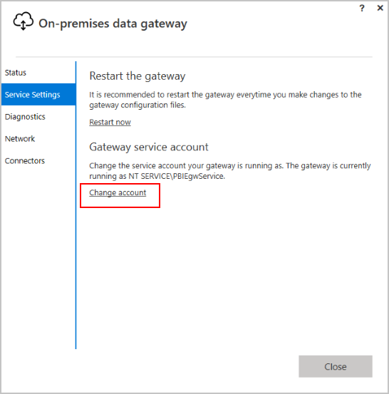

* If you enable SNC with an external security product, copy the SNC library or files on the same computer where the data gateway is installed. Some examples of SNC products include [sapseculib](https://help.sap.com/saphelp_nw74/helpdata/en/7a/0755dc6ef84f76890a77ad6eb13b13/frameset.htm), Kerberos, and NTLM.

For more information about enabling SNC for the data gateway, see [Enable Secure Network Communications](#secure-network-communications).

<a name="migrate"></a>

## Migrate to current connector

To migrate from an earlier managed (non-ISE) SAP connector to the current managed SAP connector, follow these steps:

1. If you haven't done so already, update your [on-premises data gateway](https://www.microsoft.com/download/details.aspx?id=53127) so that you have the latest version. For more information, see [Install an on-premises data gateway for Azure Logic Apps](../logic-apps/logic-apps-gateway-install.md).

1. In the logic app that uses the older SAP connector, delete the **Send to SAP** action.

1. From the latest SAP connector, add the **Send message to SAP** action. Before you can use this action, recreate the connection to your SAP system.

1. When you're done, save your logic app.

<a name="add-trigger"></a>

## Send message to SAP

This example uses a logic app that you can trigger with an HTTP request. The logic app sends an IDoc to an SAP server and returns a response to the requestor that called the logic app.

### Add an HTTP Request trigger

In Azure Logic Apps, every logic app must start with a [trigger](../logic-apps/logic-apps-overview.md#logic-app-concepts), which fires when a specific event happens or when a specific condition is met. Each time the trigger fires, the Logic Apps engine creates a logic app instance and starts running your app's workflow.

> [!NOTE]
> When a logic app receives IDoc packets from SAP, the [request trigger](https://docs.microsoft.com/azure/connectors/connectors-native-reqres) doesn't support the "plain" XML schema generated by SAP's WE60 IDoc documentation. However, the "plain" XML schema is supported for scenarios that send messages from logic apps *to* SAP. 
> You can use the request trigger with SAP's IDoc XML, but not with IDoc over RFC. Or, you can transform the XML to the necessary format. 

In this example, you create a logic app with an endpoint in Azure so that you can send *HTTP POST requests* to your logic app. When your logic app receives these HTTP requests, the trigger fires and runs the next step in your workflow.

1. In the [Azure portal](https://portal.azure.com), create a blank logic app, which opens the Logic App Designer.

1. In the search box, enter `http request` as your filter. From the **Triggers** list, select **When a HTTP request is received**.

   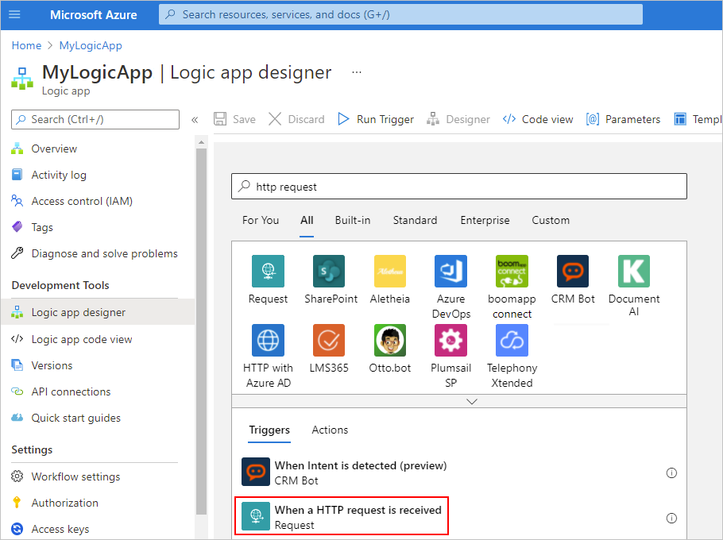

1. Now save your logic app so that you can generate an endpoint URL for your logic app. On the designer toolbar, select **Save**.

   The endpoint URL now appears in your trigger, for example:

   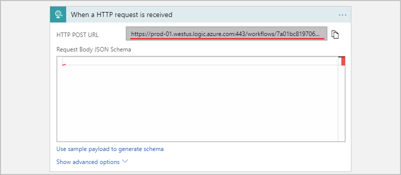

<a name="add-action"></a>

### Add an SAP action

In Azure Logic Apps, an [action](../logic-apps/logic-apps-overview.md#logic-app-concepts) is a step in your workflow that follows a trigger or another action. If you haven't added a trigger to your logic app yet and want to follow this example, [add the trigger described in this section](#add-trigger).

1. In the Logic App Designer, under the trigger, select **New step**.

   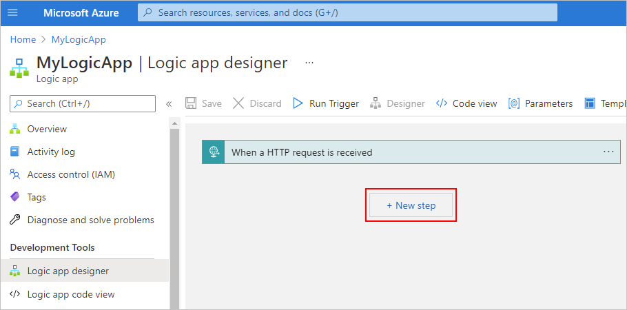

1. In the search box, enter `sap` as your filter. From the **Actions** list, select **Send message to SAP**.
  
   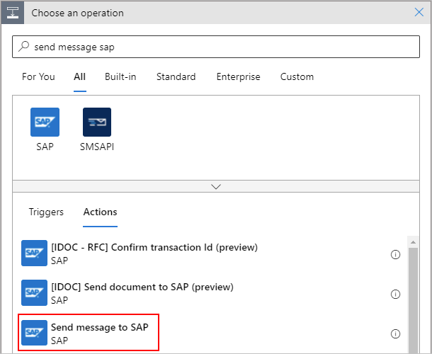

   Or, you can select the **Enterprise** tab, and select the SAP action.

   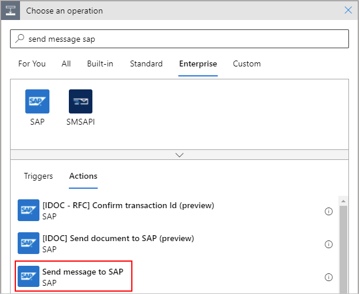

1. If your connection already exists, continue with the next step so you can set up your SAP action. However, if you're prompted for connection details, provide the information so that you can create a connection to your on-premises SAP server.

   1. Provide a name for the connection.

   1. If you're using the data gateway, follow these steps:
   
      1. In the **Data Gateway** section, under **Subscription**, first select the Azure subscription for the data gateway resource that you created in the Azure portal for your data gateway installation.
   
      1. Under **Connection Gateway**, select your data gateway resource in Azure.

   1. Continue providing information about the connection. For the **Logon Type** property, follow the step based on whether the property is set to **Application Server** or **Group**:
   
      * For **Application Server**, these properties, which usually appear optional, are required:

        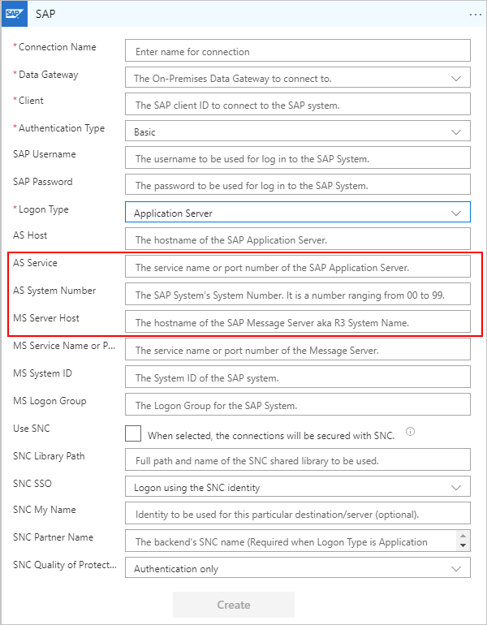

      * For **Group**, these properties, which usually appear optional, are required:

        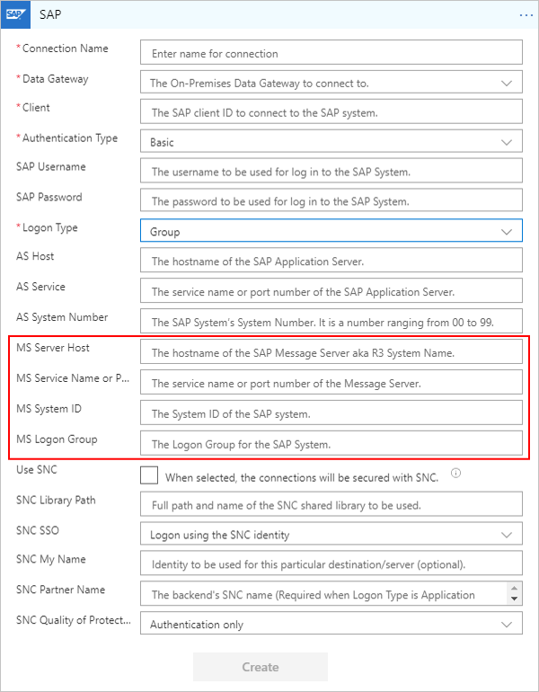  

      By default, strong typing is used to check for invalid values by performing XML validation against the schema. This behavior can help you detect issues earlier. The **Safe Typing** option is available for backward compatibility and only checks the string length. Learn more about the [Safe Typing option](#safe-typing).

   1. When you're finished, select **Create**.

      Logic Apps sets up and tests your connection to make sure that the connection works properly.

1. Now find and select an action from your SAP server.

   1. In the **SAP Action** box, select the folder icon. From the file list, find and select the SAP message you want to use. To navigate the list, use the arrows.

      This example selects an IDoc with the **Orders** type.

      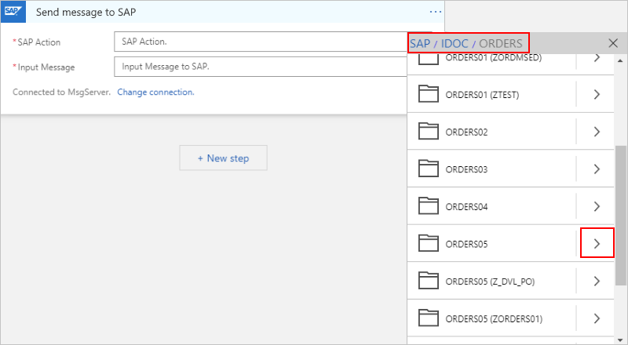

      If you can't find the action you want, you can manually enter a path, for example:

      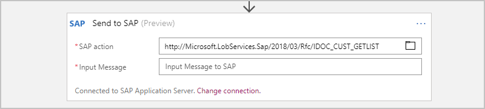

      > [!TIP]
      > Provide the value for **SAP Action** through the expression editor. 
      > That way, you can use the same action for different message types.

      For more information about IDoc operations, see [Message schemas for IDoc operations](https://docs.microsoft.com/biztalk/adapters-and-accelerators/adapter-sap/message-schemas-for-idoc-operations).

   1. Click inside the **Input Message** box so that the dynamic content list appears. From that list, under **When a HTTP request is received**, select the **Body** field.

      This step includes the body content from your HTTP Request trigger and sends that output to your SAP server.

      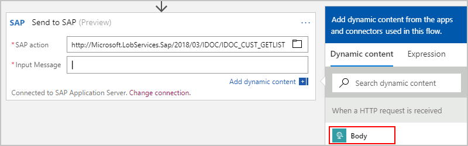

      When you're finished, your SAP action looks like this example:

      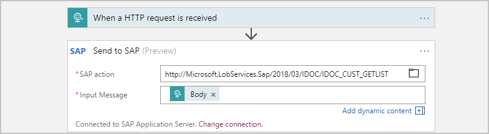

1. Save your logic app. On the designer toolbar, select **Save**.

<a name="add-response"></a>

### Add an HTTP response action

Now add a response action to your logic app's workflow and include the output from the SAP action. That way, your logic app returns the results from your SAP server to the original requestor.

1. In the Logic App Designer, under the SAP action, select **New step**.

1. In the search box, enter `response` as your filter. From the **Actions** list, select **Response**.

1. Click inside the **Body** box so that the dynamic content list appears. From that list, under **Send message to SAP**, select the **Body** field.

   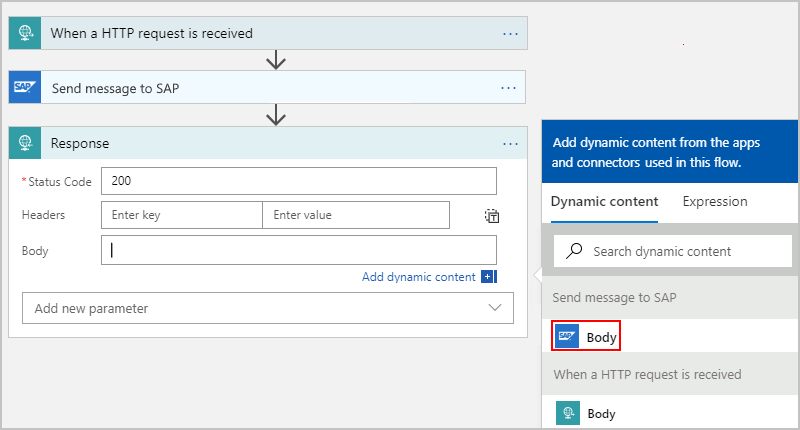

1. Save your logic app.

### Test your logic app

1. If your logic app isn't already enabled, on your logic app menu, select **Overview**. On the toolbar, select **Enable**.

1. On the designer toolbar, select **Run**. This step manually starts your logic app.

1. Trigger your logic app by sending an HTTP POST request to the URL in your HTTP Request trigger.
Include your message content with your request. To the send the request, you can use a tool such as [Postman](https://www.getpostman.com/apps).

   For this article, the request sends an IDoc file, which must be in XML format and include the namespace for the SAP action you're using, for example:

   ```xml
   <?xml version="1.0" encoding="UTF-8" ?>
   <Send xmlns="http://Microsoft.LobServices.Sap/2007/03/Idoc/2/ORDERS05//720/Send">
      <idocData>
         <...>
      </idocData>
   </Send>
   ```

1. After you send your HTTP request, wait for the response from your logic app.

   > [!NOTE]
   > Your logic app might time out if all the steps 
   > required for the response don't finish within the 
   > [request timeout limit](./logic-apps-limits-and-config.md). 
   > If this condition happens, requests might get blocked. 
   > To help you diagnose problems, learn how you can 
   > [check and monitor your logic apps](../logic-apps/monitor-logic-apps.md).

You've now created a logic app that can communicate with your SAP server. Now that you've set up an SAP connection for your logic app, you can explore other available SAP actions, such as BAPI and RFC.

<a name="receive-from-sap"></a>

## Receive message from SAP

This example uses a logic app that triggers when the app receives a message from an SAP system.

### Add an SAP trigger

1. In the Azure portal, create a blank logic app, which opens the Logic App Designer.

1. In the search box, enter `sap` as your filter. From the **Triggers** list, select **When a message is received from SAP**.

   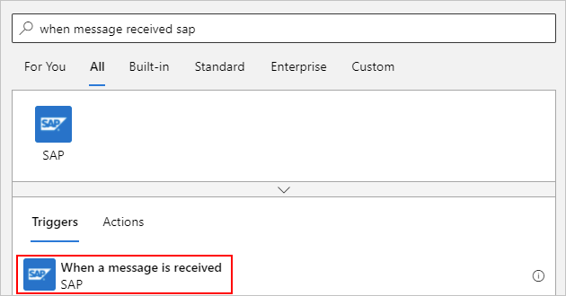

   Or, you can select the **Enterprise** tab, and then select the trigger:

   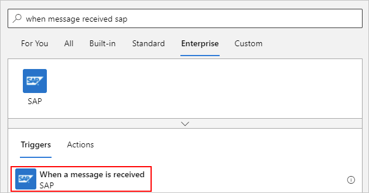

1. If your connection already exists, continue with the next step so you can set up your SAP action. However, if you're prompted for connection details, provide the information so that you can create a connection to your on-premises SAP server now.

   1. Provide a name for the connection.

   1. If you're using the data gateway, follow these steps:

      1. In the **Data Gateway** section, under **Subscription**, first select the Azure subscription for the data gateway resource that you created in the Azure portal for your data gateway installation.

      1. Under **Connection Gateway**, select your data gateway resource in Azure.

   1. Continue providing information about the connection. For the **Logon Type** property, follow the step based on whether the property is set to **Application Server** or **Group**:

      * For **Application Server**, these properties, which usually appear optional, are required:

        

      * For **Group**, these properties, which usually appear optional, are required:

        

      By default, strong typing is used to check for invalid values by performing XML validation against the schema. This behavior can help you detect issues earlier. The **Safe Typing** option is available for backward compatibility and only checks the string length. Learn more about the [Safe Typing option](#safe-typing).

   1. When you're finished, select **Create**.

      Logic Apps sets up and tests your connection to make sure that the connection works properly.

1. Provide the [required parameters](#parameters) based on your SAP system configuration.

   You can optionally provide one or more SAP actions. This list of actions specifies the messages that the trigger receives from your SAP server. An empty list specifies that the trigger receives all messages. If the list has more than one message, the trigger receives only the messages specified in the list. Any other messages sent from your SAP server are rejected.

   You can select an SAP action from the file picker:

   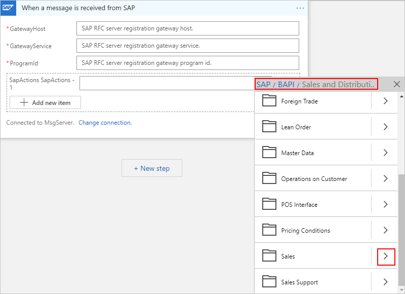  

   Or, you can manually specify an action:

   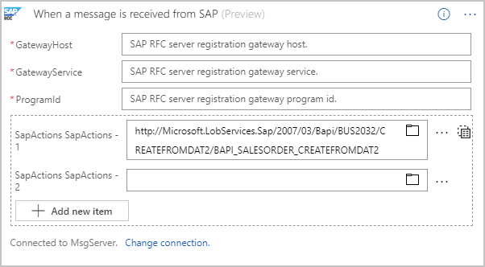

   Here's an example that shows how the action appears when you set up the trigger to receive more than one message.

   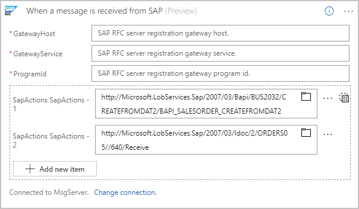

   For more information about the SAP action, see [Message schemas for IDoc operations](https://docs.microsoft.com/biztalk/adapters-and-accelerators/adapter-sap/message-schemas-for-idoc-operations)

1. Now save your logic app so you can start receiving messages from your SAP system. On the designer toolbar, select **Save**.

Your logic app is now ready to receive messages from your SAP system.

> [!NOTE]
> The SAP trigger isn't a polling trigger but is a webhook-based trigger instead. 
> If you're using the data gateway, the trigger is called from the data gateway 
> only when a message exists, so no polling is necessary.

<a name="parameters"></a>

#### Parameters

Along with simple string and number inputs, the SAP connector accepts the following table parameters (`Type=ITAB` inputs):

* Table direction parameters, both input and output, for older SAP releases.
* Changing parameters, which replace the table direction parameters for newer SAP releases.
* Hierarchical table parameters

### Test your logic app

1. To trigger your logic app, send a message from your SAP system.

1. On the logic app menu, select **Overview**. Review the **Runs history** for any new runs for your logic app.

1. Open the most recent run, which shows the message sent from your SAP system in the trigger outputs section.

## Receive IDoc packets from SAP

You can set up SAP to [send IDocs in packets](https://help.sap.com/viewer/8f3819b0c24149b5959ab31070b64058/7.4.16/en-US/4ab38886549a6d8ce10000000a42189c.html), which are batches or groups of IDocs. To receive IDoc packets, the SAP connector, and specifically the trigger, doesn't need extra configuration. However, to process each item in an IDoc packet after the trigger receives the packet, some additional steps are required to split the packet into individual IDocs.

Here's an example that shows how to extract individual IDocs from a packet by using the [`xpath()` function](./workflow-definition-language-functions-reference.md#xpath):

1. Before you start, you need a logic app with an SAP trigger. If you don't already have this logic app, follow the previous steps in this topic to [set up a logic app with an SAP trigger](#receive-from-sap).

   For example:

   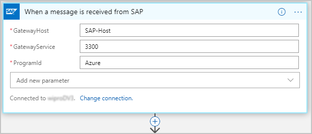

1. Get the root namespace from the XML IDoc that your logic app receives from SAP. To extract this namespace from the XML document, add a step that creates a local string variable and stores that namespace by using an `xpath()` expression:

   `xpath(xml(triggerBody()?['Content']), 'namespace-uri(/*)')`

   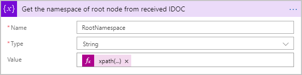

1. To extract an individual IDoc, add a step that creates an array variable and stores the IDoc collection by using another `xpath()` expression:

   `xpath(xml(triggerBody()?['Content']), '/*[local-name()="Receive"]/*[local-name()="idocData"]')`

   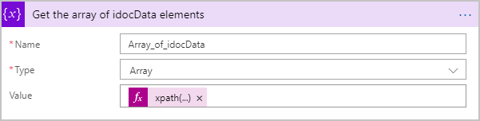

   The array variable makes each IDoc available for your logic app to process individually by enumerating over the collection. In this example, the logic app transfers each IDoc to an SFTP server by using a loop:

   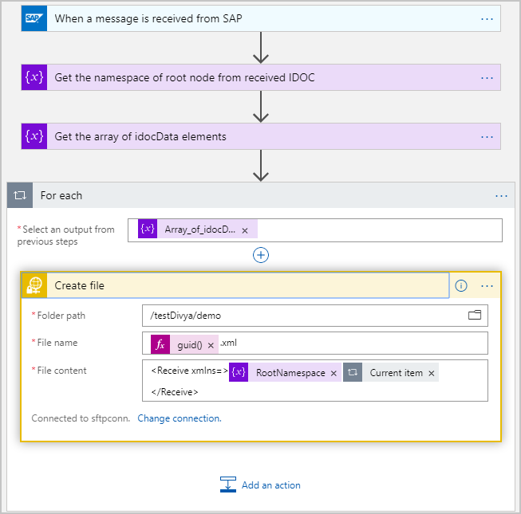

   Each IDoc must include the root namespace, which is the reason why the file content is wrapped inside a `<Receive></Receive` element along with the root namespace before sending the IDoc to the downstream app, or SFTP server in this case.

You can use the quickstart template for this pattern by selecting this template in the Logic App Designer when you create a new logic app.


## Generate schemas for artifacts in SAP

This example uses a logic app that you can trigger with an HTTP request. The SAP action sends a request to an SAP system to generate the schemas for specified IDoc and BAPI. Schemas that return in the response are uploaded to an integration account by using the Azure Resource Manager connector.

### Add an HTTP Request trigger

1. In the Azure portal, create a blank logic app, which opens the Logic App Designer.

1. In the search box, enter `http request` as your filter. From the **Triggers** list, select **When a HTTP request is received**.

   

1. Now save your logic app so you can generate an endpoint URL for your logic app.
On the designer toolbar, select **Save**.

   The endpoint URL now appears in your trigger, for example:

   

### Add an SAP action to generate schemas

1. In the Logic App Designer, under the trigger, select **New step**.

   

1. In the search box, enter `sap` as your filter. From the **Actions** list, select **Generate schemas**.
  
   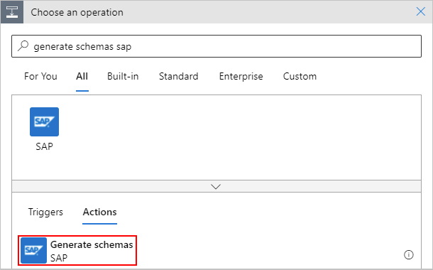

   Or, you can select the **Enterprise** tab, and select the SAP action.

   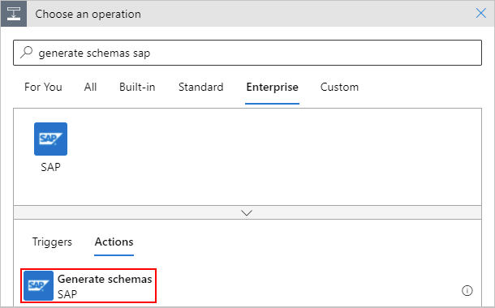

1. If your connection already exists, continue with the next step so you can set up your SAP action. However, if you're prompted for connection details, provide the information so that you can create a connection to your on-premises SAP server now.

   1. Provide a name for the connection.

   1. In the **Data Gateway** section, under **Subscription**, first select the Azure subscription for the data gateway resource that you created in the Azure portal for your data gateway installation. 
   
   1. Under **Connection Gateway**, select your data gateway resource in Azure.

   1. Continue providing information about the connection. For the **Logon Type** property, follow the step based on whether the property is set to **Application Server** or **Group**:
   
      * For **Application Server**, these properties, which usually appear optional, are required:

        

      * For **Group**, these properties, which usually appear optional, are required:

          

      By default, strong typing is used to check for invalid values by performing XML validation against the schema. This behavior can help you detect issues earlier. The **Safe Typing** option is available for backward compatibility and only checks the string length. Learn more about the [Safe Typing option](#safe-typing).

   1. When you're finished, select **Create**.

      Logic Apps sets up and tests your connection to make sure that the connection works properly.

1. Provide the path to the artifact for which you want to generate the schema.

   You can select the SAP action from the file picker:

   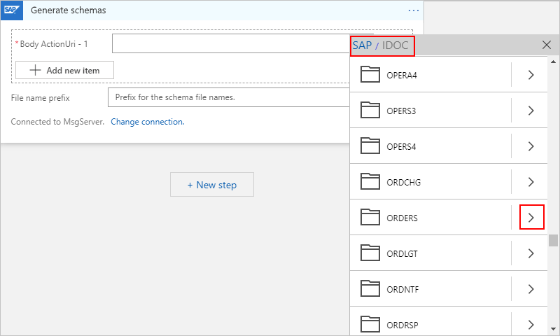  

   Or, you can manually enter the action:

   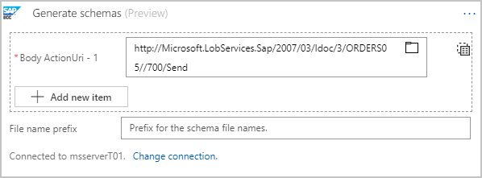

   To generate schemas for more than one artifact, provide the SAP action details for each artifact, for example:

   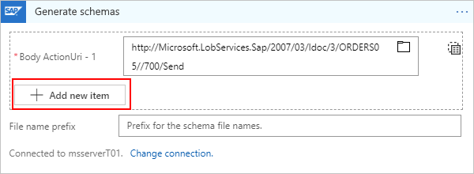

   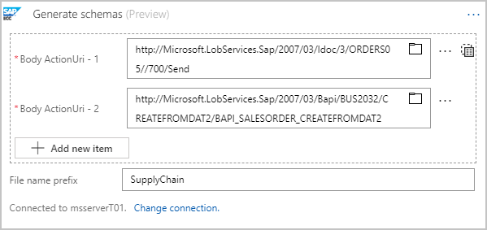

   For more information about the SAP action, see [Message schemas for IDoc operations](https://docs.microsoft.com/biztalk/adapters-and-accelerators/adapter-sap/message-schemas-for-idoc-operations).

1. Save your logic app. On the designer toolbar, select **Save**.

### Test your logic app

1. On the designer toolbar, select **Run** to trigger a run for your logic app.

1. Open the run, and check the outputs for the **Generate schemas** action.

   The outputs show the generated schemas for the specified list of messages.

### Upload schemas to an integration account

Optionally, you can download or store the generated schemas in repositories, such as a blob, storage, or integration account. Integration accounts provide a first-class experience with other XML actions, so this example shows how to upload schemas to an integration account for the same logic app by using the Azure Resource Manager connector.

1. In the Logic App Designer, under the trigger, select **New step**.

1. In the search box, enter `Resource Manager` as your filter. Select **Create or update a resource**.

   

1. Enter the details for the action, including your Azure subscription, Azure resource group, and integration account. To add SAP tokens to the fields, click inside the boxes for those fields, and select from the dynamic content list that appears.

   1. Open the **Add new parameter** list, and select the **Location** and **Properties** fields.

   1. Provide details for these new fields as shown in this example.

      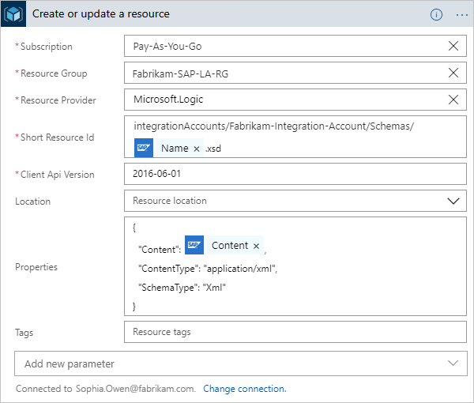

   The SAP **Generate schemas** action generates schemas as a collection, so the designer automatically adds a **For each** loop to the action. Here's an example that shows how this action appears:

   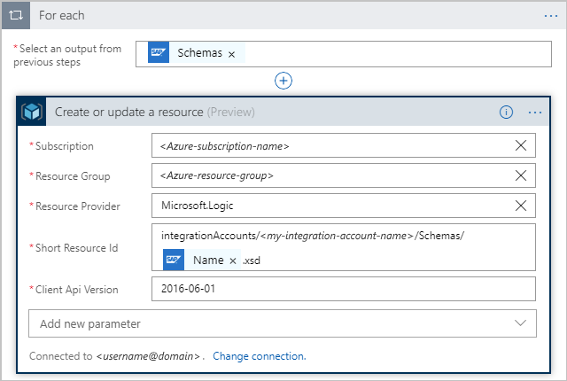

   > [!NOTE]
   > The schemas use base64-encoded format. 
   > To upload the schemas to an integration account, 
   > they must be decoded by using the `base64ToString()` function. 
   > Here's an example that shows the code for the `"properties"` element:
   >
   > ```json
   > "properties": {
   >    "Content": "@base64ToString(items('For_each')?['Content'])",
   >    "ContentType": "application/xml",
   >    "SchemaType": "Xml"
   > }
   > ```

1. Save your logic app. On the designer toolbar, select **Save**.

### Test your logic app

1. On the designer toolbar, select **Run** to manually trigger your logic app.

1. After a successful run, go to the integration account, and check that the generated schemas exist.

<a name="secure-network-communications"></a>

## Enable Secure Network Communications

Before you start, make sure that you met the previously listed [prerequisites](#pre-reqs), which apply only when you use the data gateway and your logic apps run in multi-tenant Azure:

* Make sure the on-premises data gateway is installed on a computer that's in the same network as your SAP system.

* For Single Sign On (SSO), the data gateway is running as a user that's mapped to an SAP user.

* The SNC library that provides the additional security functions is installed on the same machine as the data gateway. Some examples include [sapseculib](https://help.sap.com/saphelp_nw74/helpdata/en/7a/0755dc6ef84f76890a77ad6eb13b13/frameset.htm), Kerberos, and NTLM.

   To enable SNC for your requests to or from the SAP system, select the **Use SNC** check box in the SAP connection and provide these properties:

   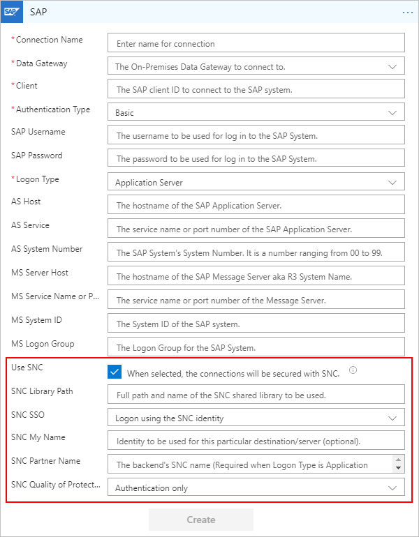

   | Property | Description |
   |----------| ------------|
   | **SNC Library Path** | The SNC library name or path relative to NCo installation location or absolute path. Examples are `sapsnc.dll` or `.\security\sapsnc.dll` or `c:\security\sapsnc.dll`. |
   | **SNC SSO** | When you connect through SNC, the SNC identity is typically used for authenticating the caller. Another option is to override so that user and password information can be used for authenticating the caller, but the line is still encrypted. |
   | **SNC My Name** | In most cases, this property can be omitted. The installed SNC solution usually knows its own SNC name. Only for solutions that support multiple identities, you might need to specify the identity to be used for this particular destination or server. |
   | **SNC Partner Name** | The name for the back-end SNC. |
   | **SNC Quality of Protection** | The quality of service to be used for SNC communication of this particular destination or server. The default value is defined by the back-end system. The maximum value is defined by the security product used for SNC. |
   |||

   > [!NOTE]
   > Don't set the environment variables SNC_LIB and SNC_LIB_64 on the machine where you have the data gateway and the SNC library. If set, they take precedence over the SNC library value passed through the connector.

<a name="safe-typing"></a>

## Safe typing

By default, when you create your SAP connection, strong typing is used to check for invalid values by performing XML validation against the schema. This behavior can help you detect issues earlier. The **Safe Typing** option is available for backward compatibility and only checks the string length. If you choose **Safe Typing**, the DATS type and TIMS type in SAP are treated as strings rather than as their XML equivalents, `xs:date` and `xs:time`, where `xmlns:xs="http://www.w3.org/2001/XMLSchema"`. Safe typing affects the behavior for all schema generation, the send message for both the "been sent" payload and the "been received" response, and the trigger. 

When strong typing is used (**Safe Typing** isn't enabled), the schema maps the DATS and TIMS types to more straightforward XML types:

```xml
<xs:element minOccurs="0" maxOccurs="1" name="UPDDAT" nillable="true" type="xs:date"/>
<xs:element minOccurs="0" maxOccurs="1" name="UPDTIM" nillable="true" type="xs:time"/>
```

When you send messages using strong typing, the DATS and TIMS response complies to the matching XML type format:

```xml
<DATE>9999-12-31</DATE>
<TIME>23:59:59</TIME>
```

When **Safe Typing** is enabled, the schema maps the DATS and TIMS types to XML string fields with length restrictions only, for example:

```xml
<xs:element minOccurs="0" maxOccurs="1" name="UPDDAT" nillable="true">
  <xs:simpleType>
    <xs:restriction base="xs:string">
      <xs:maxLength value="8" />
    </xs:restriction>
  </xs:simpleType>
</xs:element>
<xs:element minOccurs="0" maxOccurs="1" name="UPDTIM" nillable="true">
  <xs:simpleType>
    <xs:restriction base="xs:string">
      <xs:maxLength value="6" />
    </xs:restriction>
  </xs:simpleType>
</xs:element>
```

When messages are sent with **Safe Typing** enabled, the DATS and TIMS response looks like this example:

```xml
<DATE>99991231</DATE>
<TIME>235959</TIME>
```

## Advanced scenarios

### Confirm transaction explicitly

When you send transactions to SAP from Logic Apps, this exchange happens in two steps as described in the SAP document, [Transactional RFC Server Programs](https://help.sap.com/doc/saphelp_nwpi71/7.1/en-US/22/042ad7488911d189490000e829fbbd/content.htm?no_cache=true). By default, the **Send to SAP** action handles both the steps for the function transfer and for the transaction confirmation in a single call. The SAP connector gives you the option to decouple these steps. You can send an IDoc and rather than automatically confirm the transaction, you can use the explicit **Confirm transaction ID** action.

This capability to decouple the transaction ID confirmation is useful when you don't want to duplicate transactions in SAP, for example, in scenarios where failures might happen due to causes such as network issues. By confirming the transaction ID separately, the transaction is only completed one time in your SAP system.

Here is an example that shows this pattern:

1. Create a blank logic app and add an HTTP trigger.

1. From the SAP connector, add the **Send IDOC** action. Provide the details for the IDoc that you send to your SAP system.

1. To explicitly confirm the transaction ID in a separate step, in the **Confirm TID** field, select **No**. For the optional **Transaction ID GUID** field, you can either manually specify the value or have the connector automatically generate and return this GUID in the response from the Send IDOC action.

   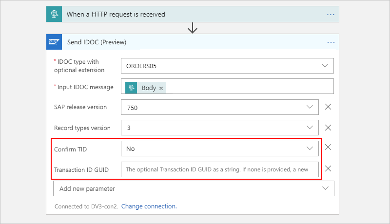

1. To explicitly confirm the transaction ID, add the **Confirm transaction ID** action. Click inside the **Transaction ID** box so that the dynamic content list appears. From that list, select the **Transaction ID** value that's returned from the **Send IDOC** action.

   

   After this step runs, the current transaction is marked complete at both ends, on the SAP connector side and on SAP system side.

## Known issues and limitations

Here are the currently known issues and limitations for the managed (non-ISE) SAP connector:

* The SAP trigger doesn't support data gateway clusters. In some failover cases, the data gateway node that communicates with the SAP system might differ from the active node, which results in unexpected behavior. For send scenarios, data gateway clusters are supported.

* The SAP connector currently doesn't support SAP router strings. The on-premises data gateway must exist on the same LAN as the SAP system you want to connect.

## Connector reference

For more technical details about this connector, such as triggers, actions, and limits as described by the connector's Swagger file, see the [connector's reference page](https://docs.microsoft.com/connectors/sap/).

> [!NOTE]
> For logic apps in an [integration service environment (ISE)](../logic-apps/connect-virtual-network-vnet-isolated-environment-overview.md), 
> this connector's ISE-labeled version uses the [ISE message limits](../logic-apps/logic-apps-limits-and-config.md#message-size-limits) instead.

## Next steps

* [Connect to on-premises systems](../logic-apps/logic-apps-gateway-connection.md) from Azure Logic Apps.
* Learn how to validate, transform, and use other message operations with the [Enterprise Integration Pack](../logic-apps/logic-apps-enterprise-integration-overview.md).
* Learn about other [Logic Apps connectors](../connectors/apis-list.md).
