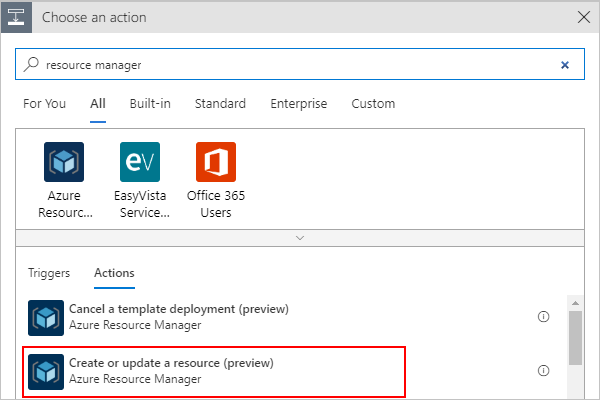
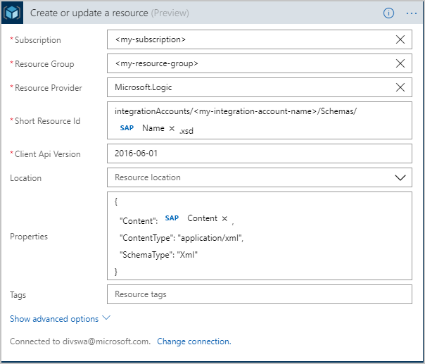
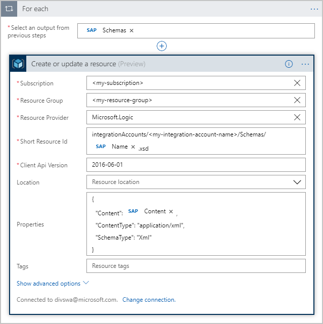

---
# required metadata
title: Connect to SAP systems - Azure Logic Apps | Microsoft Docs
description: How to access and manage SAP resources by automating workflows with Azure Logic Apps
author: ecfan
manager: jeconnoc
ms.author: estfan
ms.date: 09/14/2018
ms.topic: article
ms.service: logic-apps
services: logic-apps

# optional metadata
ms.reviewer: divswa, LADocs
ms.suite: integration
tags: connectors
---

# Connect to SAP systems from Azure Logic Apps

This article shows how you can access your on-premises SAP resources from inside a logic 
app by using the SAP ERP Central Component (ECC) connector. 
The SAP ECC connector supports message or data integration to and from SAP Netweaver based systems through Intermediate Document (IDoc) or Business Application Programming Interface (BAPI) or Remote Function Call (RFC).

The SAP ECC connector internally leverages <a href="https://help.sap.com/saphelp_nwpi71/helpdata/en/e9/23c80d66d08c4c8c044a3ea11ca90f/frameset.htm"> SAP .Net Connector (NCo) library</a>and provides following operations or actions:

- **Send to SAP** - Send IDoc or call BAPI functions over tRFC in SAP systems.
- **Receive from SAP** - Receive IDoc or BAPI function calls over tRFC from SAP systems.
- **Generate schemas** - Generate schemas for the SAP artifacts for IDoc or BAPI or RFC.

SAP connector integrates with on-premises SAP systems via [data gateway](https://www.microsoft.com/download/details.aspx?id=53127). In Send scenarios i.e when a message is sent from Logic Apps to SAP system, the data gateway acts as a RFC client and forwards the requests received from Logic Apps to SAP.

Likewise, in Receive scenarios, the data gateway acts as a RFC server, that receives requests from SAP and forwards to the Logic App. 

In this article, we are going to create examples of logic apps that integrate with SAP while covering the above integration scenarios.


## Prerequisites

To follow along with this article, you need these items:

* Azure subscription. If you don't have an Azure subscription yet, 
<a href="https://azure.microsoft.com/free/" target="_blank">sign up for a free Azure account</a>.

* The logic app from where you want to access your SAP 
system and a trigger that starts your logic app's workflow. 
If you're new to logic apps, review 
[What is Azure Logic Apps](../logic-apps/logic-apps-overview.md) and 
[Quickstart: Create your first logic app](../logic-apps/quickstart-create-first-logic-app-workflow.md).

* Your <a href="https://wiki.scn.sap.com/wiki/display/ABAP/ABAP+Application+Server" target="_blank">SAP Application Server</a> 
or <a href="https://help.sap.com/saphelp_nw70/helpdata/en/40/c235c15ab7468bb31599cc759179ef/frameset.htm" target="_blank">SAP Message Server</a>

* Download and install the latest 
[on-premises data gateway](https://www.microsoft.com/download/details.aspx?id=53127) 
on any on-premises computer. Make sure you set up 
your gateway in the Azure portal before you continue. 
The gateway helps you securely access data and 
resources are on premises. For more information, see 
[Install on-premises data gateway for Azure Logic Apps](../logic-apps/logic-apps-gateway-install.md).

* Download and install the latest SAP client library, which is currently 
<a href="https://softwaredownloads.sap.com/file/0020000000086282018" target="_blank">SAP Connector (NCo) 3.0.20.0 for Microsoft .NET Framework 4.0 and Windows 64bit (x64)</a>, 
on the same computer as the on-premises data gateway. Install this version or later 
for these reasons:

  * Earlier SAP NCo versions can become deadlocked when 
  more than one IDoc messages are sent at the same time. 
  This condition blocks all later messages that are sent 
  to the SAP destination, causing the messages to time out.

  * The on-premises data gateway runs only on 64-bit systems. 
  Otherwise, you get a "bad image" error because the data 
  gateway host service doesn't support 32-bit assemblies.

  * Both the data gateway host service and the Microsoft SAP Adapter 
  use .NET Framework 4.5. The SAP NCo for .NET Framework 4.0 
  works with processes that use .NET runtime 4.0 to 4.7.1. 
  The SAP NCo for .NET Framework 2.0 works with processes 
  that use .NET runtime 2.0 to 3.5 and no longer works 
  with the latest on-premises data gateway.

* Message content you can send to your SAP server, such as a sample IDoc file. 
This content must be in XML format and include the namespace 
for the SAP action you want to use.

<a name="add-trigger"></a>

## Send to SAP
This example uses a logic app that you can trigger with an HTTP request. 
The logic app sends an Intermediate Document (IDoc) to an SAP server, 
and returns a response to the requestor that called the logic app. 

### Add HTTP request trigger

In Azure Logic Apps, every logic app must start with a 
[trigger](../logic-apps/logic-apps-overview.md#logic-app-concepts), 
which fires when a specific event happens or when a 
specific condition is met. Each time the trigger fires, 
the Logic Apps engine creates a logic app instance 
and starts running your app's workflow.

In this example, you create a logic app with an endpoint in 
Azure so that you can send *HTTP POST requests* to your logic app. 
When your logic app receives these HTTP requests, 
the trigger fires and runs the next step in your workflow.

1. In the Azure portal, create a blank logic app, 
which opens the Logic App Designer. 

2. In the search box, enter "http request" as your filter. 
From the triggers list, select this trigger: 
**Request - When a HTTP request is received**

   

3. Now save your logic app so you can 
generate an endpoint URL for your logic app.
On the designer toolbar, choose **Save**. 

   The endpoint URL now appears in your trigger, 
   for example:

   

<a name="add-action"></a>

### Add SAP action

In Azure Logic Apps, an [action](../logic-apps/logic-apps-overview.md#logic-app-concepts) 
is a step in your workflow that follows a trigger or another action. 
If you haven't added a trigger to your logic app yet and want to follow 
this example, [add the trigger described in this section](#add-trigger).

1. In the Logic App Designer, under the trigger, 
choose **New step** > **Add an action**.

    

2. In the search box, enter "sap" as your filter. From the actions list, select the action **Send message to SAP**
  
   

   Alternately, instead of searching you can also go to the Enterprise tab and select the SAP action.

   

3. If you're prompted for connection details, create your SAP connection now. 
Otherwise, if your connection already exists, continue with the next step 
so you can set up your SAP action. 

   **Create on-premises SAP connection**

   1. Provide the connection information for your SAP server. 
   For the **Data Gateway** property, select the data gateway you created 
   in the Azure portal for your gateway installation.

   Of the properties marked as optional, following are required if **Logon Type** is **Application Server**

    

   Of the properties marked as optional, following are required if **Logon Type** is **Group**

    

   2. When you're done, choose **Create**. Logic Apps sets up and tests your connection, making sure that the connection works properly.

4. Now find and select an action from your SAP server. 

   1. In the **SAP action** box, choose the folder icon. 
   From the file picker control, find and select the SAP message you want to use. Use arrows to navigate down the hierarchy.

   This example selects an IDoc of type Order. 

   

   If you can't find the action you want, you can manually enter a path, for example:

   

   > [!TIP]
   > Provide the value for SAP Action via expression. That would allow you to use the same action for different type of messages.

   For more information about IDoc operations, see 
   [Message schemas for IDOC operations](https://docs.microsoft.com/biztalk/adapters-and-accelerators/adapter-sap/message-schemas-for-idoc-operations)

   2. Click inside the **Input Message** box so that the dynamic content list appears. 
   In that list, under **When a HTTP request is received**, select the **Body** field. 

   This step includes the body content from your HTTP request 
   trigger and sends that output to your SAP server.

   

   When you're done, your SAP action looks like this example:

   

5. Save your logic app. On the designer toolbar, choose **Save**.

<a name="add-response"></a>

### Add HTTP response action

Now add a response action to your logic app's 
workflow and include the output from the SAP action. 
That way, your logic app returns the results 
from your SAP server to the original requestor. 

1. In the Logic App Designer, under the SAP action, 
choose **New step** > **Add an action**.

2. In the search box, enter "response" as your filter. 
From the actions list, select this action: **Request - Response**

3. Click inside the **Body** box so that the dynamic content list appears. 
From that list, under **Send to SAP**, select the **Body** field. 

   

4. Save your logic app. 

### Test your logic app

1. If your logic app isn't already enabled, 
on your logic app menu, choose **Overview**. 
On the toolbar, choose **Enable**. 

2. On the Logic App Designer toolbar, 
choose **Run**. This step manually starts your logic app.

3. Trigger your logic app by sending an HTTP POST 
request to the URL in your HTTP request trigger, 
and include your message content with your request. 
To the send the request, you can use a tool such as 
[Postman](https://www.getpostman.com/apps). 

   For this article, the request sends an IDoc file, which must be in XML 
   format and include the namespace for the SAP action you're using, for example: 

   ``` xml
   <?xml version="1.0" encoding="UTF-8" ?>
   <Send xmlns="http://Microsoft.LobServices.Sap/2007/03/Idoc/2/ORDERS05//720/Send">
      <idocData>
         <...>
      </idocData>
   </Send>
   ```

4. After you send your HTTP request, wait for the response from your logic app.

> [!NOTE]
> Your logic app might time out if all the steps 
> required for the response don't finish within the 
> [request timeout limit](./logic-apps-limits-and-config.md). 
> If this condition happens, requests might get blocked. 
> To help you diagnose problems, learn how you can 
> [check and monitor your logic apps](../logic-apps/logic-apps-monitor-your-logic-apps.md).

Congratulations, you've now created a logic app that can 
communicate with your SAP server. Now that you've set up 
an SAP connection for your logic app, you can explore other 
available SAP actions, such as BAPI and RFC.


## Receive from SAP
This example uses a logic app that will be triggered when it receives a message from SAP system. 

### Add SAP trigger

1. In the Azure portal, create a blank logic app, 
which opens the Logic App Designer. 

2. In the search box, enter "sap" as your filter. 
From the triggers list, select this trigger: 
**When a message is received from SAP**

   

   Alternately, you can go to the Enterprise tab and select the trigger

   

3. If you're prompted for connection details, create your SAP connection now. 
Otherwise, if your connection already exists, continue with the next step 
so you can set up your SAP action. 

   **Create on-premises SAP connection**

   1. Provide the connection information for your SAP server. 
   For the **Data Gateway** property, select the data gateway you created 
   in the Azure portal for your gateway installation.

   Of the properties marked as optional, following are required if **Logon Type** is **Application Server**

    

   Of the properties marked as optional, following are required if **Logon Type** is **Group**

     

4. Provide the required parameters as per your SAP system configuration. Optionally, provide one or more SAP actions. This list of actions specifies messages the trigger would receive via data gateway from your SAP server. The list can be empty in which case the trigger would receive all messages. This list can have more than one message, in which case the trigger would receive only the messages specified in the list. Any other messages sent from SAP server will be rejected by the gateway.

   SAP action can be specified via file picker, or

     

   manually

    

   Here's an example of how the action looks when the trigger is configured to receive more than one message.

     

   For more information about SAP Action, see 
   [Message schemas for IDOC operations](https://docs.microsoft.com/biztalk/adapters-and-accelerators/adapter-sap/message-schemas-for-idoc-operations)

5. Now save your logic app so you can start receiving messages from your SAP system.
On the designer toolbar, choose **Save**. 

Your logic app is now ready to receive messages from your SAP system. 

Do note that SAP trigger is not a polling based, rather a webhook based trigger. Hence, the trigger is invoked from the gateway when there is a message for it.
No polling is needed.

### Test your logic app

1. Trigger your logic app by sending a message from your SAP system.

2. Check for any new runs for your logic app in the Runs history. Open the recent run and you should be able to see the message sent from the SAP system in the outputs of the SAP trigger.


## Generate schemas for artifacts in SAP
This example uses a logic app that you can trigger with an HTTP request. 
The SAP action sends a request to SAP system to generate the schemas for specified Intermediate Document (IDoc) and BAPI, 
schemas returned as response are uploaded to the Integration Account using Azure Resource Manager (ARM) connector.

### Add HTTP request trigger

1. In the Azure portal, create a blank logic app, 
which opens the Logic App Designer. 

2. In the search box, enter "http request" as your filter. 
From the triggers list, select this trigger: 
**Request - When a HTTP request is received**

   

3. Now save your logic app so you can 
generate an endpoint URL for your logic app.
On the designer toolbar, choose **Save**. 

   The endpoint URL now appears in your trigger, 
   for example:

   

### Add SAP action to generate schemas

1. In the Logic App Designer, under the trigger, 
choose **New step** > **Add an action**.

    

2. In the search box, enter "sap" as your filter. From the actions list, select the action **Generate schemas**
  
   

   Alternately, instead of searching you can also go to the Enterprise tab and select the SAP action.

   

3. If you're prompted for connection details, create your SAP connection now. 
Otherwise, if your connection already exists, continue with the next step 
so you can set up your SAP action. 

   **Create on-premises SAP connection**

   1. Provide the connection information for your SAP server. 
   For the **Data Gateway** property, select the data gateway you created 
   in the Azure portal for your gateway installation.

   Of the properties marked as optional, following are required if **Logon Type** is **Application Server**

    

   Of the properties marked as optional, following are required if **Logon Type** is **Group**

    

   2. When you're done, choose **Create**. Logic Apps sets up and tests your connection, making sure that the connection works properly.

4. Next provide the path to the artifact for which you want to generate the schema.

   SAP action can be specified via file picker, or

     

   manually

    

   You can generate schemas for more than one artifact by providing SAP action details for each of them. Here is an example

    

    

   For more information about SAP Action, see 
      [Message schemas for IDOC operations](https://docs.microsoft.com/biztalk/adapters-and-accelerators/adapter-sap/message-schemas-for-idoc-operations)

5. Save your logic app. On the designer toolbar, choose **Save**.

### Test your logic app

1. On the designer toolbar, choose **Run** to trigger a run for your logic app.

2. Open the run, and check the outputs of the **Generate schema** action. You should see the collection of schemas generated for the specified list of messages.

### Upload schemas to integration account
This step is optional. The schemas generated can be download or stored in repositories such as blob, storage, or integration account. Since integration account
provides first class experience with other XML actions, this example shows how to upload them to the integration account in the same logic app via Azure Resource Manager (ARM) connector.

1. In the Logic App Designer, under the trigger, choose **New step** > **Add an action**. In the search box, enter "resource manager" as your filter. Select the action **Create or update a resource**

    

2. Enter the details including your subscription, resource group and integration account. For other fields, follow the example below.

   

   Since the schemas generated by SAP **Generate schemas** action is a collection, the designer automatically puts a for-each for the action.
   Here's an example of how the action looks like

     

   > [!NOTE]
   > The schemas are in base64 encoded format. To upload them to integration account they need to be decoded using the function base64ToString. Here is how the code view of Properties look like
   > ```json
   > "properties": {
   >                "Content": "@base64ToString(items('For_each')?['Content'])",
   >                "ContentType": "application/xml",
   >                "SchemaType": "Xml"
   >            }
   > ```

3. Save your logic app. On the designer toolbar, choose **Save**.

### Test your logic app
1. On the designer toolbar, choose **Run** to manually trigger your logic app.

2. On a successful, run you can go to the integration account and verify the schemas generated are present.


## SAP connector known issues and limitations

Here is a list of known issues and limitations with the SAP connector. We are continually working to address them.

1. SAP trigger doesn's support receiving batch IDOCs from SAP. This may result in RFC connection failure between your SAP system and data gateway.
2. SAP trigger doesn’t support data gateway cluster. In some cases of fail-over, the data gateway node SAP system talks to may be different than the active node, resulting in unexpected behavior. For send scenarios, data gateway cluster is supported.
3. In Receive scenarios, returning a non null response is not supported. Logic app with trigger and a response action will result in unexpected behavior.
4. Only individual SAP connector Send message action will work with tRFC. Attempting to start a tRFC transaction with with one Send message action then either add more RFC calls or commit said transaction in further Send Message action(s) will result in unexpected behavior. 
5. RFCs with attachments are not supported for both Send to SAP and Generate schemas actions
6. f.	We do not have support for SAP router string at the moment in the SAP connector. With the current capabilities, the OPDG must be on the same LAN as the SAP system you wish to connect to.
7. Conversion of absent (null), empty, minimal, maximum values for DATS and TIMS SAP fields is subject to change in later update to OPDG.

## Get support

* For questions, visit the [Azure Logic Apps forum](https://social.msdn.microsoft.com/Forums/en-US/home?forum=azurelogicapps).
* To submit or vote on feature ideas, visit the 
[Logic Apps user feedback site](http://aka.ms/logicapps-wish).

## Next steps

* [Connect to on-premises systems](../logic-apps/logic-apps-gateway-connection.md) from logic apps
* Learn how to validate, transform, and other message operations with the 
[Enterprise Integration Pack](../logic-apps/logic-apps-enterprise-integration-overview.md)
* Learn about other [Logic Apps connectors](../connectors/apis-list.md)
