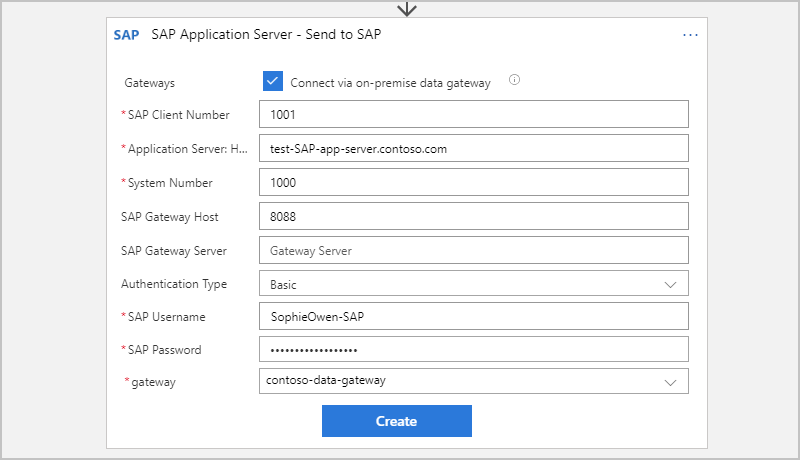

---
# required metadata
title: Connect to SAP systems - Azure Logic Apps | Microsoft Docs
description: Learn how to access SAP systems on premises with automated workflows in Azure Logic Apps
author: ecfan
manager: cfowler
ms.author: estfan
ms.date: 05/27/2018
ms.topic: article
ms.service: logic-apps
services: logic-apps

# optional metadata
ms.reviewer: klam, divswa, LADocs
ms.suite: integration
tags: connectors
---

# Access resources in on-premises SAP systems by automating workflows in Azure Logic Apps

This article shows how you can connect to on-premises SAP systems 
from inside a logic app so you can access resources by using 
the SAP Application Server and SAP Message Server connectors. 
That way, you can create logic apps that automate tasks and 
workflows for managing data and resources in your SAP systems. 

This example uses a logic app that you can trigger with 
an HTTP request. The logic app sends the request for an 
Intermediate Document (IDoc) action to an SAP server. 
The logic app then returns the results in an HTTP response 
to the initial requestor that called the logic app.

The current SAP connectors have actions, 
but not triggers, so this example uses the 
[HTTP request trigger](../connectors/connectors-native-reqres.md) 
as the first step in the logic app's workflow. For SAP 
connector-specific technical information, see these articles: 

* <a href="https://docs.microsoft.com/connectors/sapapplicationserver/" target="blank">SAP Application Server connector reference</a>
* <a href="https://docs.microsoft.com/connectors/sapmessageserver/" target="blank">SAP Message Server connector reference</a>

If you don't have an Azure subscription yet, 
<a href="https://azure.microsoft.com/free/" target="_blank">sign up for a free Azure account</a>. 

## Prerequisites

* The logic app where you want to access your SAP system 
and a trigger that starts your logic app's workflow. 
The SAP connectors currently provide only actions. 
If you're new to logic apps, review 
[What is Azure Logic Apps](../logic-apps/logic-apps-overview.md) and 
[Quickstart: Create your first logic app](../logic-apps/quickstart-create-first-logic-app-workflow.md).

* Your <a href="https://wiki.scn.sap.com/wiki/display/ABAP/ABAP+Application+Server" target="_blank">SAP Application Server</a> 
or <a href="https://help.sap.com/saphelp_nw70/helpdata/en/40/c235c15ab7468bb31599cc759179ef/frameset.htm" target="_blank">SAP Message Server</a>

* Download and install the latest 
[on-premises data gateway](https://www.microsoft.com/download/details.aspx?id=53127) 
on any on-premises computer. You must also set up your 
gateway in the Azure portal before you can continue. 
The gateway helps you securely access data and 
resources are on premises. For more information, see 
[Install on-premises data gateway for Azure Logic Apps](../logic-apps/logic-apps/logic-apps-gateway-install.md).

* Download and install the latest SAP client library, which is currently 
<a href="https://softwaredownloads.sap.com/file/0020000000086282018" target="_blank">SAP Connector (NCo) 3.0.20.0 for Microsoft .NET Framework 4.0 and Windows 64bit (x64)</a>. 
Install this SAP NCo on the same computer where you installed the on-premises data gateway. 

  * Make sure you install at least SAP NCo 3.0.20.0. 
  Earlier SAP NCo versions can become deadlocked when 
  more than one IDoc messages are sent at the same time. 
  This condition blocks all later messages that are sent 
  to the SAP destination, causing the messages to time out.

  * Make sure you select the SAP NCo for Windows 64-bit. 
  The on-premises data gateway runs only on 64-bit systems. 
  Otherwise, you get an "bad image" error because the data 
  gateway host service doesn't support 32-bit assemblies.

  * Make sure you select the SAP NCo for .NET Framework 4.0. 
  Both the data gateway host service and the Microsoft SAP 
  adapter use .NET Framework 4.5. 
  
    The SAP NCo for .NET Framework 4.0 works with processes 
    that use .NET runtime 4.0 to 4.7.1, while the SAP 
    NCo for .NET Framework 2.0 works with processes 
    that use .NET runtime 2.0 to 3.5 and no longer 
    works with the latest on-premises data gateway.

## Add HTTP request trigger

In Azure Logic Apps, every logic app must start with a 
[trigger](../logic-apps/logic-apps-overview.md#logic-app-concepts), 
which fires when a specific event happens or when a 
specific condition is met. Each time the trigger fires, 
the Logic Apps engine creates a logic app instance 
and starts running your app's workflow.

In this example, you create a logic app with an endpoint in 
Azure so that you can send *HTTP POST requests* to your logic app. 
When your logic app receives these HTTP requests, 
the trigger fires and runs the next step in your workflow.

1. In the Azure portal, create a blank logic app, 
which opens in the Logic App Designer. 

2. In the search box, enter "HTTP request" as your filter. 
From the triggers list, select this trigger: 
**Request - When a HTTP request is received**

   

3. Now save your logic app so you can 
generate an endpoint URL for your logic app.
On the designer toolbar, choose **Save**. 

   The endpoint URL now appears in your trigger, 
   for example:

   

## Add SAP action

In Azure Logic Apps, an [action](../logic-apps/logic-apps-overview.md#logic-app-concepts) 
is a step in your workflow that follows a trigger or another action. 
If you haven't added a trigger to your logic app yet and want to follow 
this example, [add the trigger described in this section](#add-trigger).

1. In the Logic App Designer, under the trigger, 
choose **New step** > **Add an action**.

    

2. In the search box, enter "sap server" as your filter. 
From the actions list, select the action for your SAP server: 

   * **SAP Application Server - Send to SAP**
   * **SAP Message Server - Send to SAP**

   This example uses this action: 
   **SAP Application Server - Send to SAP**

   

3. If you're prompted for connection details, create your SAP connection now. 
Otherwise, if your connection already exists, continue with the next step 
so you can set up your SAP action. 

   **Create on-premises SAP connection**

   1. For **Gateways**, select **Connect via on-premise data gateway** 
   so that the on-premises connection properties appear.

   2. Provide the connection information for your SAP server. 
   For the **gateway** property, select the data gateway you created 
   in the Azure portal for your gateway installation, for example:

      **SAP Application Server**

        

      **SAP Message Server**

       

   2. When you're done, choose **Create**.

      Logic Apps sets up and tests your connection, 
      making sure that the connection works properly.

4. Now find and select an action from your SAP server. 

   1. In the **SAP action** box, choose the folder icon. 
   From the folder list, find and select the action you want to use. 

      This example selects the **IDOC** folder for the IDoc action. 

      

      If you can't find the action you want, you can manually enter a path, 
      for example:

      

   2. Click inside the **Input Message** box so that the dynamic content list appears. 
   In that list, under **When a HTTP request is received**, select the **Body** field. 

      This step includes the body content from your HTTP request 
      trigger and sends that output to your SAP server.

      

      When you're done, your SAP action looks like this example:

      

6. Save your logic app. On the designer toolbar, choose **Save**.

## Add HTTP response action

Now add the response action and include the body output 
from the SAP action so your logic app can return the 
results from your SAP server back to the original requestor. 

1. In the Logic App Designer, under the SAP action, 
choose **New step** > **Add an action**.

2. In the search box, enter "response" as your filter. 
From the actions list, select this action: **Request - Response**

3. Click inside the **Body** box so that the dynamic content list appears. 
From that list, under **Send to SAP**, select the **Body** field. 

   

4. Save your logic app. 

5. To test your logic app, send an IDoc file with an HTTP 
POST request to the URL you created in the HTTP request trigger. 
Wait for a response from your logic app.

> [!NOTE]
> Your logic app might time out if all the steps 
> required for the response don't finish within the 
> [request timeout limit](./logic-apps-limits-and-config.md). 
> If this condition happens, requests might get blocked. 
> 
> To help you diagnose problems, learn how you can 
> [check and monitor your logic apps](../logic-apps/logic-apps-monitor-your-logic-apps.md).

Congratulations, you've now created a logic app that communicates 
and retrieves data from your SAP server. Now that you've set up 
an SAP connection for your logic app, you can explore other 
available file paths, such as BAPI, RFC, and TRFC.

## Connector reference

For technical details about the connector 
as described by the connectors' Swagger files, 
see these reference pages: 

* [SAP Application Server](/connectors/sapapplicationserver/)
* [SAP Message Server](/connectors/sapmessageserver/)

## Get support

* For questions, visit the [Azure Logic Apps forum](https://social.msdn.microsoft.com/Forums/en-US/home?forum=azurelogicapps).
* To submit or vote on feature ideas, visit the [Logic Apps user feedback site](http://aka.ms/logicapps-wish).

## Next steps

- Learn how to validate, transform, and other BizTalk-like functions in the [Enterprise Integration Pack](../logic-apps/logic-apps-enterprise-integration-overview.md). 
- 

## Next steps

* [Connect to on-premises systems](../logic-apps/logic-apps-gateway-connection.md) from logic apps
* Learn about other [Logic Apps connectors](../connectors/apis-list.md)
