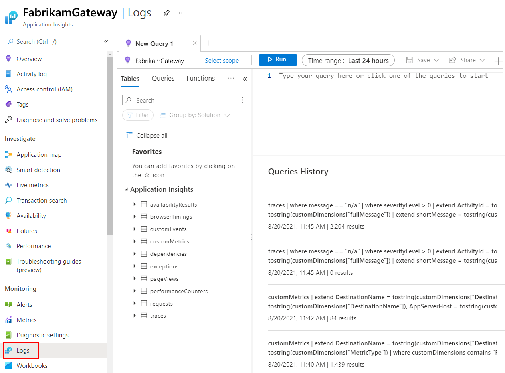
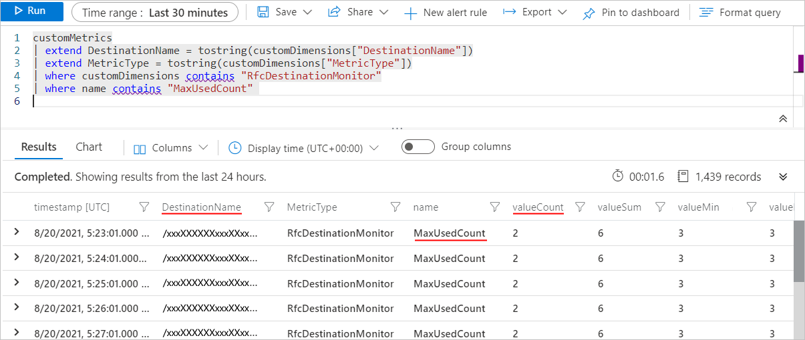
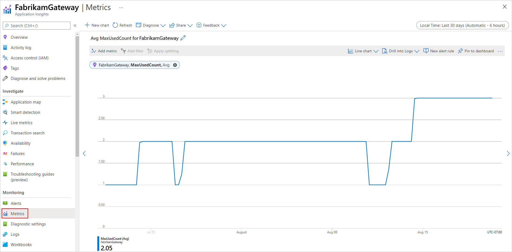
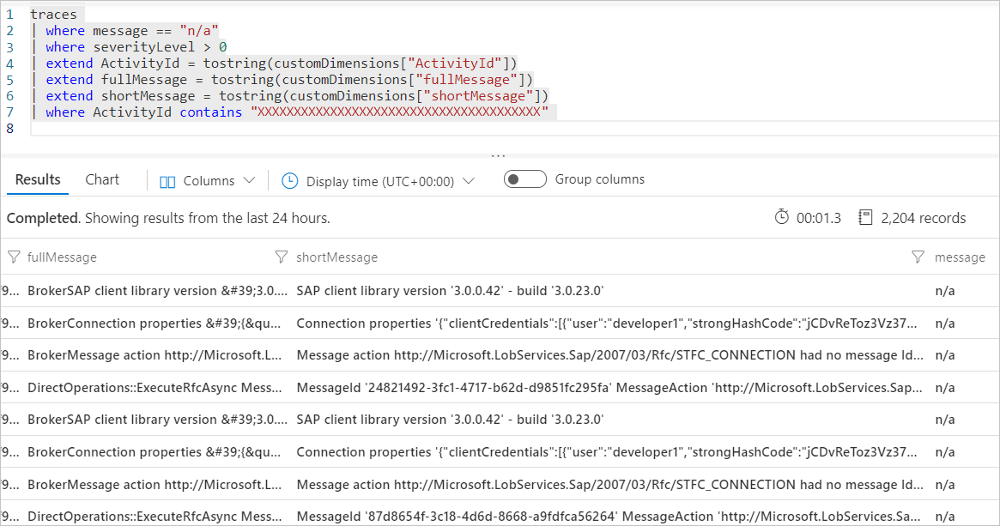

# Connect to SAP from workflows in Azure Logic Apps

[!INCLUDE [logic-apps-sku-consumption-standard](../../includes/logic-apps-sku-consumption-standard.md)]

This multipart how-to guide shows how to access your SAP server from a workflow in Azure Logic Apps using the SAP connector. You can use the SAP connector's operations to create automated workflows that run when triggered by events in your SAP server or in other systems and run actions to manage resources on your SAP server.

Both Standard and Consumption logic app workflows offer the SAP *managed* connector that's hosted and run in multi-tenant Azure. Standard workflows also offer the SAP *built-in* connector that's hosted and run in single-tenant Azure Logic Apps, but this connector is currently in preview and subject to the [Supplemental Terms of Use for Microsoft Azure Previews](https://azure.microsoft.com/support/legal/preview-supplemental-terms/). If you create and host a Consumption workflow in an integration service environment (ISE), you can also use the SAP connector's ISE-native version. For more information, see [Connector technical reference](#connector-technical-reference).

## SAP compatibility

The SAP connector is compatible with the following types of SAP systems:

* On-premises and cloud-based HANA-based SAP systems, such as S/4 HANA.

* Classic on-premises SAP systems, such as R/3 and ECC.

SAP must support the SAP system version that you want to connect. Otherwise, any issues that you might encounter might not be resolvable. For more information about SAP system versions and maintenance information, review the [SAP Product Availability Matrix (PAM)](http://support.sap.com/pam).

The SAP connector supports the following message and data integration types from SAP NetWeaver-based systems:

* Intermediate Document (IDoc)

* Business Application Programming Interface (BAPI)

* Remote Function Call (RFC) and Transactional RFC (tRFC)

The SAP connector uses the [SAP .NET Connector (NCo) library](https://support.sap.com/en/product/connectors/msnet.html).

To use the SAP connector operations, you have to first authenticate your connection and have the following options:

* You can provide a username and password.

* The SAP connector supports authentication with [SAP Secure Network Communications (SNC)](https://help.sap.com/viewer/e73bba71770e4c0ca5fb2a3c17e8e229/7.31.25/en-US/e656f466e99a11d1a5b00000e835363f.html).

You can use SNC for SAP NetWeaver single sign-on (SSO) or for security capabilities from external products. If you choose to use SNC, review the [SNC prerequisites](#snc-prerequisites) and the [SNC prerequisites for the ISE connector](#snc-prerequisites-ise).

## Connector technical reference

The SAP connector has different versions, based on [logic app type and host environment](../logic-apps/logic-apps-overview.md#resource-environment-differences).

| Logic app | Environment | Connector version |
|-----------|-------------|-------------------|
| **Consumption** | Multi-tenant Azure Logic Apps | Managed connector, which appears in the designer under the **Enterprise** label. For more information, review the following documentation: <br><br>- [SAP managed connector reference](/connectors/sap/) <br>- [Managed connectors in Azure Logic Apps](../connectors/managed.md) |
| **Consumption** | Integration service environment (ISE) | Managed connector, which appears in the designer under the **Enterprise** label, and the ISE-native version, which appears in the designer with the **ISE** label and has different message limits than the managed connector. <br><br>**Note**: Make sure to use the ISE-native version, not the managed version. <br><br>For more information, review the following documentation: <br><br>- [SAP managed connector reference](/connectors/sap/) <br>- [ISE message limits](../logic-apps/logic-apps-limits-and-config.md#message-size-limits) <br>- [Managed connectors in Azure Logic Apps](../connectors/managed.md) |
| **Standard** | Single-tenant Azure Logic Apps and App Service Environment v3 (Windows plans only) | Managed connector, which appears in the connector gallery under **Runtime** > **Shared**, and the built-in connector (preview), which appears in the connector gallery under **Runtime** > **In-App** and is [service provider-based](../logic-apps/custom-connector-overview.md#service-provider-interface-implementation). The built-in connector can directly access Azure virtual networks with a connection string without an on-premises data gateway. For more information, review the following documentation: <br><br>- [SAP managed connector reference](/connectors/sap/) <br>- [SAP built-in connector reference](/azure/logic-apps/connectors/built-in/reference/sap/) <br><br>- [Managed connectors in Azure Logic Apps](../connectors/managed.md) <br>- [Built-in connectors in Azure Logic Apps](../connectors/built-in.md) |

## Connector differences

The SAP built-in connector significantly differs from the SAP managed connector and SAP ISE-versioned connector in the following ways:

* On-premises connections don't require the on-premises data gateway.

  Instead, the SAP built-in connector communicates directly with your SAP server in the integrated virtual network, which avoids hops, latency, and failure points for a network gateway. Make sure that you upload or deploy the non-redistributable SAP client libraries with your logic app workflow application. For more information, see the [Prerequisites](#prerequisites) in this guide.

* Payload sizes up to 100 MB are supported, so you don't have to use a blob URI for large requests.

* Specific actions are available for **Call BAPI**, **Call RFC**, and **Send IDoc**. These dedicated actions provide a better experience for stateful BAPIs, RFC transactions, and IDoc deduplication, and don't use the older SOAP Windows Communication Foundation (WCF) messaging model.

  The **Call BAPI** action includes up to two responses with the returned JSON, the XML response from the called BAPI, and the BAPI commit or BAPI rollback response as well and if you use auto-commit. This capability addresses the problem with the SAP managed connector where the outcome from the auto-commit is silent and observable only through logs.

* Longer timeout at 5 minutes compared to managed connector and ISE-versioned connector.

  The SAP built-in connector doesn't use the shared or global connector infrastructure, which means timeouts are longer at 5 minutes compared to the SAP managed connector (two minutes) and the SAP ISE-versioned connector (four minutes). Long-running requests work without you having to implement the [long-running webhook-based request action pattern](logic-apps-scenario-function-sb-trigger.md).

* By default, the preview SAP built-in connector operations are *stateless*. However, you can [enable stateful mode (affinity) for these operations](../connectors/enable-stateful-affinity-built-in-connectors.md).

  In stateful mode, the SAP built-in connector supports high availability and horizontal scale-out configurations. By comparison, the SAP managed connector has restrictions regarding the on-premises data gateway limited to a single instance for triggers and to clusters only in failover mode for actions. For more information, see [SAP managed connector - Known issues and limitations](#known-issues-limitations).

* Standard logic app workflows require and use the SAP NCo 3.1 client library, not the SAP NCo 3.0 version. For more information, see [Prerequisites](#prerequisites).

* Standard logic app workflows provide application settings where you can specify a Personal Security Environment (PSE) and PSE password.

  This change prevents you from uploading multiple PSE files, which isn't supported and results in SAP connection failures. In Consumption logic app workflows, the SAP managed connector lets you specify these values through connection parameters, which allowed you to upload multiple PSE files and isn't supported, causing SAP connection failures.

* **Generate Schema** action

  * You can select from multiple operation types, such as BAPI, IDoc, RFC, and tRFC, versus the same action in the SAP managed connector, which uses the **SapActionUris** parameter and a file system picker experience.

  * You can directly provide a parameter name as a custom value. For example, you can specify the **RFC Name** parameter from the **Call RFC** action. By comparison, in the SAP managed connector, you had to provide a complex **Action URI** parameter name.

  * By design, this action doesn't support generating multiple schemas for RFCs, BAPIs, or IDocs in single action execution, which the SAP managed connector supports. This capability change now prevents attempts to send large amounts of content in a single call.

<a name="connector-parameters"></a>

## Connector parameters

Along with simple string and number inputs, the SAP connector accepts the following table parameters (`Type=ITAB` inputs):

* Table direction parameters, both input and output, for older SAP releases.
* Parameter changes, which replace the table direction parameters for newer SAP releases.
* Hierarchical table parameters.

<a name="known-issues-limitations"></a>

## Known issues and limitations

### SAP managed connector

* The SAP connector currently doesn't support SAP router strings. The on-premises data gateway must exist on a virtual network where the gateway can directly reach the SAP system that you want to connect.

* In general, the SAP trigger doesn't support data gateway clusters. In some failover cases, the data gateway node that communicates with the SAP system might differ from the active node, which results in unexpected behavior.

  * For send message scenarios, data gateway clusters in failover mode are supported.

  * Stateful [SAP actions](/connectors/sap/#actions) don't support data gateway clusters in load-balancing mode. Stateful communications must remain on the same data gateway cluster node. Either use the data gateway in non-cluster mode or in a cluster that's set up for failover only. For example, these actions include the following:

    * All actions that specify a **Session ID** value
    * **\[BAPI] Commit transaction**
    * **\[BAPI] Rollback transaction**
    * **\[BAPI - RFC] Close stateful session**
    * **\[BAPI - RFC] Create stateful session**

* In the action named **\[BAPI] Call method in SAP**, the auto-commit feature won't commit the BAPI changes if at least one warning exists in the **CallBapiResponse** object returned by the action. To commit BAPI changes despite any warnings, follow these steps:

  1. Create a session explicitly using the action named **\[BAPI - RFC] Create stateful session**.
  1. In the action named **\[BAPI] Call method in SAP**, disable the auto-commit feature.
  1. Call the action named **\[BAPI] Commit transaction** instead.

### SAP built-in connector

The preview SAP built-in connector trigger named **Register SAP RFC server for trigger** is available in the Azure portal, but the trigger currently can't receive calls from SAP when deployed in Azure. To fire the trigger, you can run the workflow locally in Visual Studio Code. For Visual Studio Code setup requirements and more information, see [Create a Standard logic app workflow in single-tenant Azure Logic Apps using Visual Studio Code](create-single-tenant-workflows-visual-studio-code.md). You must also set up the following environment variables on the computer where you install Visual Studio Code:
 
 - **WEBSITE_PRIVATE_IP**: Set this environment variable value to **127.0.0.1** as the localhost address. 
 - **WEBSITE_PRIVATE_PORTS**: Set this environment variable value to two free and usable ports on your local computer, separating the values with a comma (**,**), for example, **8080,8088**.

## Prerequisites

* An Azure account and subscription. If you don't have an Azure subscription yet, [sign up for a free Azure account](https://azure.microsoft.com/free/?WT.mc_id=A261C142F).

* The [SAP Application server](https://wiki.scn.sap.com/wiki/display/ABAP/ABAP+Application+Server) or [SAP Message server](https://help.sap.com/saphelp_nw70/helpdata/en/40/c235c15ab7468bb31599cc759179ef/frameset.htm) that you want to access from Azure Logic Apps.

  * Set up your SAP server and user account to allow using RFC.

    For more information, which includes the supported user account types and the minimum required authorization for each action type (RFC, BAPI, IDoc), review the following SAP note: [460089 - Minimum authorization profiles for external RFC programs](https://launchpad.support.sap.com/#/notes/460089).

  * Your SAP user account needs access to the `RFC_METADATA` function group and the respective function modules for the following operations:

    | Operations | Access to function modules |
    |------------|----------------------------|
    | RFC actions | `RFC_GROUP_SEARCH` and `DD_LANGU_TO_ISOLA` |
    | BAPI actions | `BAPI_TRANSACTION_COMMIT`, `BAPI_TRANSACTION_ROLLBACK`, `RPY_BOR_TREE_INIT`, `SWO_QUERY_METHODS`, and `SWO_QUERY_API_METHODS` |
    | IDoc actions | `IDOCTYPES_LIST_WITH_MESSAGES`, `IDOCTYPES_FOR_MESTYPE_READ`, `INBOUND_IDOCS_FOR_TID`, `OUTBOUND_IDOCS_FOR_TID`, `GET_STATUS_FROM_IDOCNR`, and `IDOC_RECORD_READ` |
    | [**Read SAP table**](/connectors/sap/#read-sap-table) action | Either `RFC BBP_RFC_READ_TABLE` or `RFC_READ_TABLE` |
    | Grant strict minimum access to SAP server for your SAP connection | `RFC_METADATA_GET` and `RFC_METADATA_GET_TIMESTAMP` |

* The logic app workflow from where you want to access your SAP server.

  * For a Consumption workflow in multi-tenant Azure Logic Apps, see [Multi-tenant prerequisites](#multi-tenant-prerequisites).

  * For a Standard workflow in single-tenant Azure Logic Apps, see [Single-tenant prerequisites](#single-tenant-prerequisites).

  * For a Consumption workflow in a Premium-level [integration service environment (ISE)](connect-virtual-network-vnet-isolated-environment-overview.md), see [ISE prerequisites](#ise-prerequisites).

    > [!NOTE]
    >
    > When you use a Premium-level ISE, use the ISE-native SAP connector, not the SAP managed connector, 
    > which doesn't natively run in an ISE. For more information, review the [ISE prerequisites](#ise-prerequisites).

* By default, the preview SAP built-in connector operations are *stateless*. To run these operations in stateful mode, see [Enable stateful mode for stateless built-in connectors](../connectors/enable-stateful-affinity-built-in-connectors.md).

* To use either the SAP managed connector trigger named **When a message is received from SAP** or the SAP built-in trigger named **Register SAP RFC server for trigger**, complete the following tasks:

  * Set up your SAP gateway security permissions or Access Control List (ACL). In the **Gateway Monitor** (T-Code SMGW) dialog box, which shows the **secinfo** and **reginfo** files, open the **Goto** menu, and select **Expert Functions** > **External Security** > **Maintenance of ACL Files**.

    The following permission setting is required:

    `P TP=LOGICAPP HOST=<on-premises-gateway-server-IP-address> ACCESS=*`

    This line has the following format:

    `P TP=<trading-partner-identifier-(program-name)-or-*-for-all-partners> HOST=<comma-separated-list-with-external-host-IP-or-network-names-that-can-register-the-program> ACCESS=<*-for-all-permissions-or-a-comma-separated-list-of-permissions>`

    If you don't configure the SAP gateway security permissions, you might receive the following error:

    **Registration of tp Microsoft.PowerBI.EnterpriseGateway from host <*host-name*> not allowed**

    For more information, review [SAP Note 1850230 - GW: "Registration of tp &lt;program ID&gt; not allowed"](https://userapps.support.sap.com/sap/support/knowledge/en/1850230).

  * Set up your SAP gateway security logging to help find Access Control List (ACL) issues. For more information, review the [SAP help topic for setting up gateway logging](https://help.sap.com/viewer/62b4de4187cb43668d15dac48fc00732/7.31.25/en-US/48b2a710ca1c3079e10000000a42189b.html).

  * In the **Configuration of RFC Connections** (T-Code SM59) dialog box, create an RFC connection with the **TCP/IP** type. Make sure that the **Activation Type** is set to **Registered Server Program**. Set the RFC connection's **Communication Type with Target System** value to **Unicode**.

  * If you use this SAP trigger with the **IDOC Format** parameter set to **FlatFile** along with the [Flat File Decode action](logic-apps-enterprise-integration-flatfile.md), you have to use the `early_terminate_optional_fields` property in your flat file schema by setting the value to `true`.

    This requirement is necessary because the flat file IDoc data record that's sent by SAP on the tRFC call `IDOC_INBOUND_ASYNCHRONOUS` isn't padded to the full SDATA field length. Azure Logic Apps provides the flat file IDoc original data without padding as received from SAP. Also, when you combine this SAP trigger with the **Flat File Decode** action, the schema that's provided to the action must match.

  > [!NOTE]
  >
  > In Consumption and Standard workflows, the SAP managed trigger named **When a message is received from SAP** 
  > uses the same URI location to both renew and unsubscribe from a webhook subscription. The renewal operation 
  > uses the HTTP `PATCH` method, while the unsubscribe operation uses the HTTP `DELETE` method. This behavior 
  > might make a renewal operation appear as an unsubscribe operation in your trigger's history, but the operation 
  > is still a renewal because the trigger uses `PATCH` as the HTTP method, not `DELETE`.
  >
  > In Standard workflows, the SAP built-in trigger named **Register SAP RFC server for trigger** uses the Azure 
  > Functions trigger instead, and shows only the actual callbacks from SAP.

* The message content to send to your SAP server, such as a sample IDoc file. This content must be in XML format and include the namespace of the [SAP action](/connectors/sap/#actions) that you want to use. You can [send IDocs with a flat file schema by wrapping them in an XML envelope](sap-create-example-scenario-workflows.md#send-flat-file-idocs).

<a name="network-prerequisites"></a>

### Network connectivity prerequisites

The SAP system requires network connectivity from the host of the SAP .NET Connector (NCo) library:

* For Consumption logic app workflows in multi-tenant Azure Logic Apps, the on-premises data gateway hosts the SAP .NET Connector (NCo) library. If you use an on-premises data gateway cluster, all nodes of the cluster require network connectivity to the SAP system.

* For Standard logic app workflows in single-tenant Azure Logic Apps, the logic app resource hosts the SAP .NET Connector (NCo) library. So, the logic app resource itself must enable virtual network integration, and that virtual network must have network connectivity to the SAP system.

* For Consumption logic app workflows in an ISE, the ISE virtual network hosts the SAP .NET Connector (NCo) library.

The SAP system-required network connectivity includes the following servers and services:

* SAP Application Server, Dispatcher service (for all Logon types)

  Your SAP system can include multiple SAP Application Servers. The host of the SAP .NET Connector (NCo) library requires access to each server and their services.

* SAP Message Server, Message service (for Logon type Group)

  The Message Server and service will redirect to one or more Application Server's Dispatcher services. The host of the SAP .NET Connector (NCo) library requires access to each server and their services.

* SAP Gateway Server, Gateway service

* SAP Gateway Server, Gateway secured service

  The SAP system-required network connectivity also includes this server and service to use with Secure Network Communications (SNC).

Redirection of requests from Application Server, Dispatcher service to Gateway Server, Gateway service automatically happens within the SAP .NET Connector (NCo) library. This redirection occurs even if only the Application Server, Dispatcher service information is provided in the connection parameters.

If you're using a load balancer in front of your SAP system, you must redirect all the services to their respective servers. 
For more information about SAP services and ports, review the [TCP/IP Ports of All SAP Products](https://help.sap.com/viewer/ports).

> [!NOTE]
>
> Make sure you enabled network connectivity from the host of the SAP .NET Connector (NCo) library and that the required 
> ports are open on firewalls and network security groups. Otherwise, you get errors such as **partner not reached** 
> from the **NI (network interface)** component and error text such as **WSAECONNREFUSED: Connection refused**.

<a name="sap-client-library-prerequisites"></a>

### SAP NCo client library prerequisites

To use the SAP connector, based on whether you have a Consumption or Standard workflow, you'll need install the SAP Connector NCo client library for Microsoft .NET 3.0 or 3.1, respectively. The following list describes the prerequisites for the SAP NCo client library, based on which workflow where you're using with the SAP connector:

* Version:

  * For Consumption logic app workflows that use the on-premises data gateway, make sure that you install the latest 64-bit version, [SAP Connector (NCo 3.0) for Microsoft .NET 3.0.25.0 compiled with .NET Framework 4.0  - Windows 64-bit (x64)](https://support.sap.com/en/product/connectors/msnet.html). SAP Connector (NCo 3.1) isn't currently supported as dual-version capability is unavailable. The data gateway runs only on 64-bit systems. Installing the unsupported 32-bit version results in a **"bad image"** error.

    Earlier versions of SAP NCo might experience the following issues:

    * When more than one IDoc message is sent at the same time, this condition blocks all later messages that are sent to the SAP destination, causing messages to time out.

    * Session activation might fail due to a leaked session. This condition might block calls sent by SAP to the logic app workflow trigger.

    * The on-premises data gateway (June 2021 release and newer releases) depends on the `SAP.Middleware.Connector.RfcConfigParameters.Dispose()` method in SAP NCo to free up resources.

    * After you upgrade the SAP server environment, you get the following exception message: **"The only destination &lt;some-GUID&gt; available failed when retrieving metadata from &lt;SAP-system-ID&gt; -- see log for details"**.

  * For Standard logic app workflows, you can install the latest 64-bit or 32-bit version for [SAP Connector (NCo 3.1) for Microsoft .NET 3.1.2.0 compiled with .NET Framework 4.6.2](https://support.sap.com/en/product/connectors/msnet.html). However, make sure that you install the version that matches the configuration in your Standard logic app resource. To check the version used by your logic app, follow these steps:

    1. In the [Azure portal](https://portal.azure.com), open your Standard logic app.

    1. On the logic app resource menu, under **Settings**, select **Configuration**.

    1. On the **Configuration** pane, under **Platform settings**, check whether the **Platform** value is set to 64-bit or 32-bit.

    1. Make sure to install the version of the [SAP Connector (NCo 3.1) for Microsoft .NET 3.1.2.0 compiled with .NET Framework 4.6.2](https://support.sap.com/en/product/connectors/msnet.html) that matches your platform configuration.

* From the client library's default installation folder, copy the assembly (.dll) files to another location, based on your scenario as follows. Or, optionally, if you're using only the SAP managed connector, when you install the SAP NCo client library, select **Global Assembly Cache registration**. The ISE zip archive and SAP built-in connector currently doesn't support GAC registration.

  * For a Consumption workflow that runs in multi-tenant Azure Logic Apps and uses your on-premises data gateway, copy the following assembly (.dll) files to the on-premises data gateway installation folder, for example, **C:\Program Files\On-Premises Data Gateway**. The SAP NCo 3.0 client library contains the following assemblies:

    - **libicudecnumber.dll**
    - **rscp4n.dll**
    - **sapnco.dll**
    - **sapnco_utils.dll**

    Make sure that you copy the assembly files to the data gateway's *installation folder*. Otherwise, your SAP connection might fail with the error message, **Please check your account info and/or permissions and try again**. You can troubleshoot further issues using the [.NET assembly binding log viewer](/dotnet/framework/tools/fuslogvw-exe-assembly-binding-log-viewer). This tool lets you check that your assembly files are in the correct location.

  * For Standard workflows, copy the following assembly (.dll) files to a location from where you can upload them to your logic app resource or project where you're building your workflow, either in the Azure portal or locally in Visual Studio Code, respectively. The SAP NCo 3.1 client library includes the following assemblies:

    - **rscp4n.dll**
    - **sapnco.dll**
    - **sapnco_utils.dll**

  * For a Consumption workflow in an ISE, follow the [ISE prerequisites](#ise-prerequisites) instead.

The following relationships exist between the SAP NCo client library, the .NET Framework, the .NET runtime, and the data gateway:

* The Microsoft SAP Adapter and the gateway host service both use .NET Framework 4.7.2.

* The SAP NCo for .NET Framework 4.0 works with processes that use .NET runtime 4.0 to 4.8.

* The SAP NCo for .NET Framework 2.0 works with processes that use .NET runtime 2.0 to 3.5, but no longer works with the latest gateway.

<a name="snc-prerequisites"></a>

### SNC prerequisites

### [Consumption](#tab/consumption)

<a name="snc-prerequisites-consumption"></a>

For Consumption workflows in multi-tenant Azure Logic Apps that use the on-premises data gateway, and optionally SNC, you must also configure the following settings.

* Make sure that your SNC library version and its dependencies are compatible with your SAP environment. To troubleshoot any library compatibility issues, you can use your on-premises data gateway and data gateway logs. 

* Make sure that you copied the following assembly (.dll) files in the SAP NCo 3.0 client library to the on-premises data gateway's *installation* folder, for example, **C:\Program Files\On-Premises Data Gateway**.

  - **libicudecnumber.dll**
  - **rscp4n.dll**
  - **sapnco.dll**
  - **sapnco_utils.dll**

* For the SAPGENPSE utility, you must specifically use **sapgenpse.exe**.

* If you provide a Personal Security Environment (PSE) with your connection, you don't need to copy and set up the PSE and SECUDIR for your on-premises data gateway.

* If you enable SNC through an external security product, such as [sapseculib](https://help.sap.com/saphelp_nw74/helpdata/en/7a/0755dc6ef84f76890a77ad6eb13b13/frameset.htm), Kerberos, or NTLM, make sure that the SNC library exists on the same computer as your data gateway installation. For this task, copy the SNC library's binary files to the same folder as the data gateway installation on your local computer, for example, **C:\Program Files\On-Premises Data Gateway**.

  > [!NOTE]
  >
  > On the computer with the data gateway installation and SNC library, don't set the 
  > environment variables for **SNC_LIB** and **SNC_LIB_64**. Otherwise, these variables 
  > take precedence over the SNC library value passed through the connector.

* To use SNC with single sign-on (SSO), make sure the data gateway service is running as a user who is mapped to an SAP user. To change the default account for the gateway service account, select **Change account**, and enter the user credentials.

  

For more information about enabling SNC, review [Enable Secure Network Communications (SNC)](#enable-secure-network-communications).

### [Standard](#tab/standard)

<a name="snc-prerequisites-standard"></a>

The SAP built-in connector supports only SNC X.509 authentication, not single sign-on (SSO) authentication. Make sure that you install the SNC and common crypto library assemblies as part of your [single-tenant prerequisites](#single-tenant-prerequisites) and [network connectivity prerequisites](#network-prerequisites). For more information about enabling SNC, review [Enable Secure Network Communications (SNC)](#enable-secure-network-communications).

For SNC from SAP, you'll need to download the following files and have them ready to upload to your logic app resource. 

- **rscp4n.dll**
- **sapnco.dll**
- **sapnco_utils.dll**

You'll also need the following files from the **CommonCryptoLib.sar** package available from the [**SAP for Me, Software Download Center**](https://me.sap.com/softwarecenter)(SAP sign-in required). For more information, see [Download **CommonCryptoLib.sar**](#download-common-crypto).

- **sapcrypto.dll**
- **sapgenpse.exe**
- **slcryptokernal.dll**

> [!NOTE]
>
> If you use a different SNC implementation, these library files might have different names. 
> In any case, **sapgenpse.exe** is required to use SNC with the SAP built-in connector.

<a name="download-common-crypto"></a>

#### Download CommonCryptoLib.sar

To get the required assemblies and other files for SNC from SAP, you can find these files in the **CommonCryptoLib.sar** package available from the [**SAP for Me, Software Download Center**](https://me.sap.com/softwarecenter)(SAP sign-in required). You can use any currently supported **CommonCryptoLib** library implementation, based on compatible versions specific to your SAP environment. However, Microsoft recommends that you use the latest version for the **CommonCryptoLib** library available from SAP, assuming that version is compatible with your SAP environment.

To download the current **CommonCryptoLib** package, follow these steps:

1. Sign in to the [**SAP for Me, Software Download Center**](https://me.sap.com/softwarecenter).

1. On the **Download Software** page, select the **Installation & Upgrades** tab, expand **By Alphabetical Index (A-Z)**, and select **C** > **SAP Cryptographic Software** > **Downloads** tab > **SapCryptoLib** > **Downloads** tab > **CommonCryptoLib 8** > **Downloads** tab.

1. From the **Items Available to Download** list, select **Windows on x64 64Bit** or **Windows Server on IA32 x32 Bit**, whichever matches Standard logic app platform configuration.

   Microsoft recommends the 64-bit version.

1. From the list, select the highest level patch.

   The current patch number varies based on the selected Windows version.

1. If you don't have the [`SAPCAR` utility](https://help.sap.com/docs/Convergent_Charging/d1d04c0d65964a9b91589ae7afc1bd45/467291d0dc104d19bba073a0380dc6b4.html) to extract the .sar file, follow these steps:

   1. In the [**SAP for Me, Software Download Center**](https://me.sap.com/softwarecenter), on the **Download Software** page, select the **Support Packages & Patches** tab, expand **By Alphabetical Index (A-Z)**, and select **S** > **SAPCAR** > **Downloads** tab.

   1. From the **Items Available to Download** list, select your operating system, and the **sapcar.exe** file for the **SAPCAR** utility.

   > [!TIP]
   >
   > If you're unfamiliar with the **SAPCAR** utility, review the following SAP blog post, 
   > [Easily extract SAR files](https://blogs.sap.com/2004/11/18/easily-extract-sar-files/).

   The following batch file is an improved version that extracts archives to a subdirectory with the same name:

   ```text
   @echo off
   cd %~dp1
   mkdir %~n1
   sapcar.exe -xvf %~nx1 -R %~n1
   pause
   ```

1. Include all the extracted .dll and .exe files, which the following list shows for the current SAP **CommonCryptoLib** package:

   - **sapcrypto.dll**
   - **sapgenpse.exe**
   - **slcryptokernal.dll**

### [ISE](#tab/ise)

<a name="snc-prerequisites-ise"></a>

The ISE-versioned SAP connector supports SNC X.509, not single sign-on (SSO) authentication. If you previously used the SAP connector without SNC, you can enable SNC for ISE-native SAP connections.

Before you redeploy an SAP connector to use SNC, or if you deployed the SAP connector without the SNC or SAPGENPSE libraries, you must delete all previously existing SAP connections and then the SAP connector. Multiple logic app workflows can use the same SAP connection. So, make sure that you delete any previously existing SAP connections from all logic app workflows in your ISE.

After you delete the SAP connections, you must delete the SAP connector from your ISE. You can still keep the logic app workflows that use this connector. After you redeploy the connector, you can then authenticate the new connection in your workflows' SAP operations.

1. To delete existing SAP connections, follow either path:

   * In the [Azure portal](https://portal.azure.com), open each logic app resource and workflow to delete the SAP connections.

     1. Open your logic app workflow in the designer.

     1. On your logic app menu, under **Development Tools**, select **API connections**.

     1. On the **API connections** page, select your SAP connection.

     1. On the connection's page menu, select **Delete**.

     1. Accept the confirmation prompt to delete the connection.

     1. Wait for the portal notification that the connection has been deleted.

   * In the [Azure portal](https://portal.azure.com), open your ISE resource to delete the SAP connections.

      1. On your ISE menu, under **Settings**, select **API connections**.

      1. On the **API connections** page, select your SAP connection.

      1. On the connection's page menu, select **Delete**.

      1. Accept the confirmation prompt to delete the connection.

      1. Wait for the portal notification that the connection has been deleted.

1. Delete the SAP connector from your ISE. You must delete all connections to this connector in all your logic app workflows before you can delete the connector. If you haven't already deleted all connections, review the previous steps.

   1. In the [Azure portal](https://portal.azure.com), open your ISE resource.

   1. On your ISE menu, under **Settings**, select **Managed connectors**.

   1. On the **Managed connectors** page, select the checkbox for the SAP connector.

   1. On the toolbar, select **Delete**.

   1. Accept the confirmation prompt to delete the connector.

   1. Wait for the portal notification that the connector has been deleted.

1. Deploy or redeploy the SAP connector in your ISE.

   1. Prepare a new zip archive file to use in your SAP connector deployment. You must include the SNC library and the SAPGENPSE utility.

      * You must use the 64-bit SNC library. There's no 32-bit support.

      * Your SNC library and dependencies must be compatible with your SAP environment. For how to check compatibility, the [ISE prerequisites](#ise-prerequisites).

   1. Copy all SNC, SAPGENPSE, and NCo libraries to the root folder of your zip archive. Don't put these binaries in a subfolder.

   1. For your new zip archive, follow the deployment steps in [ISE prerequisites](#ise-prerequisites).

1. For each workflow that uses the ISE-native SAP connector, [create a new SAP connection that enables SNC](#enable-secure-network-communications).

#### Certificate rotation

1. For all connections that use SAP ISE X.509 in your ISE, update the base64-encoded binary PSE.

1. In your copy of the PSE, import the new certificates.

1. Encode the PSE file as a base64-encoded binary.

1. Edit your SAP connection information, and save the new PSE file there.

   The connector detects the PSE change and updates its own copy during the next connection request.

---

### Azure Logic Apps environment prerequisites

### [Consumption](#tab/consumption)

<a name="multi-tenant-prerequisites"></a>

For a Consumption workflow in multi-tenant Azure Logic Apps, the SAP managed connector integrates with SAP systems through an [on-premises data gateway](logic-apps-gateway-connection.md). For example, in scenarios where your workflow sends a message to the SAP system, the data gateway acts as an RFC client and forwards the requests received from your workflow to SAP. Likewise, in scenarios where your workflow receives a message from SAP, the data gateway acts as an RFC server that receives requests from SAP and forwards them to your workflow.

1. On a host computer or virtual machine that exists in the same virtual network as the SAP system to which you're connecting, [download and install the on-premises data gateway](logic-apps-gateway-install.md).

   The data gateway helps you securely access on-premises data and resources. Make sure to use a supported version of the gateway. If you experience an issue with your gateway, try [upgrading to the latest version](https://aka.ms/on-premises-data-gateway-installer), which might include updates to resolve your problem.

1. In the Azure portal, [create an Azure gateway resource](logic-apps-gateway-connection.md#create-azure-gateway-resource) for your on-premises data gateway installation.

1. On the same local computer as your on-premises data gateway installation, [download and install the latest SAP NCo client library](#sap-client-library-prerequisites).

1. For the host computer with your on-premises data gateway installation, configure the network host names and service names resolution.

   * To use the host names or service names for connections from Azure Logic Apps, you have to set up name resolution for each SAP Application, Message, and Gateway server along with their services:

     * In the **%windir%\System32\drivers\etc\hosts** file or in the DNS server that's available to the host computer for your on-premises data gateway installation, set up the network host name resolution.

     * In the **%windir%\System32\drivers\etc\services** file, set up the service name resolution.

   * If you don't intend to use network host names or service names for the connection, you can use host IP addresses and service port numbers instead.

   * If you don't have a DNS entry for your SAP system, the following example shows a sample entry for the hosts file:

     ```text
     10.0.1.9           sapserver                   # SAP single-instance system host IP by simple computer name
     10.0.1.9           sapserver.contoso.com       # SAP single-instance system host IP by fully qualified DNS name
     ```

     The following list shows a sample set of entries for the services files:

     ```text
     sapdp00            3200/tcp              # SAP system instance 00 dialog (application) service port
     sapgw00            3300/tcp              # SAP system instance 00 gateway service port
     sapmsDV6           3601/tcp              # SAP system ID DV6 message service port
     ```

### [Standard](#tab/standard)

<a name="single-tenant-prerequisites"></a>

For a Standard workflow in single-tenant Azure Logic Apps, use the preview SAP *built-in* connector to directly access resources that are protected by an Azure virtual network. You can also use other built-in connectors that let workflows directly access on-premises resources without having to use the on-premises data gateway.

1. To use the SAP connector, you need to download the following files and have them read to upload to your Standard logic app resource. For more information, see [SAP NCo client library prerequisites](#sap-client-library-prerequisites):

   - **rscp4n.dll**
   - **sapnco.dll**
   - **sapnco_utils.dll**

1. For SNC from SAP, you need to download the following files and have them ready to upload to your logic app resource. For more information, see [SNC prerequisites](#snc-prerequisites-standard):

   - **sapcrypto.dll**
   - **sapgenpse.exe**
   - **slcryptokernal.dll**

#### Upload assemblies to Azure portal

1. In the [Azure portal](https://portal.azure.com), open your Standard logic app resource.

1. On the logic app menu, under **Workflows**, select **Assemblies**.

1. On the **Assemblies** page toolbar, select **Add**.

1. After the **Add Assembly** pane opens, for **Assembly Type**, select **Client/SDK Assembly (.NET Framework)**.

1. Under **Upload Files**, add the previously described required files that you downloaded:

   **SAP NCo**
   - **rscp4n.dll**
   - **sapnco.dll**
   - **sapnco_utils.dll**

   **CommonCryptoLib**
   - **sapcrypto.dll**
   - **sapgenpse.exe**
   - **slcryptokernal.dll**

1. When you're ready, select **Upload Files**.

   If the assembly file is 4 MB or smaller, you can either browse and select or drag and drop the file. For files larger than 4 MB, follow these steps instead:

   1. On the logic app menu, under **Development Tools**, select **Advanced Tools**.

   1. On the **Advanced Tools** page, select **Go**.

   1. On the **Kudu** toolbar, from the **Debug console** menu, select **CMD**.

   1. Open the following folders: **site** > **wwwroot**

   1. On the folder structure toolbar, select the plus (**+**) sign, and then select **New folder**.

   1. Create the following folder and subfolders: **lib** > **builtinOperationSdks** > **net472**

   1. In the **net472** folder, upload the assembly files larger than 4 MB.

#### SAP trigger requirements

The preview SAP built-in connector trigger named **Register SAP RFC server for trigger** is available in the Azure portal, but the trigger currently can't receive calls from SAP when deployed in Azure. To fire the trigger, you can run the workflow locally in Visual Studio Code. For Visual Studio Code setup requirements and more information, see [Create a Standard logic app workflow in single-tenant Azure Logic Apps using Visual Studio Code](create-single-tenant-workflows-visual-studio-code.md). You must also set up the following environment variables on the computer where you install Visual Studio Code:
 
 - **WEBSITE_PRIVATE_IP**: Set this environment variable value to **127.0.0.1** as the localhost address. 
 - **WEBSITE_PRIVATE_PORTS**: Set this environment variable value to two free and usable ports on your local computer, separating the values with a comma (**,**), for example, **8080,8088**.

### [ISE](#tab/ise)

<a name="ise-prerequisites"></a>

For a Consumption workflow in an ISE, the ISE provides access to resources that are protected by an Azure virtual network and offers other ISE-native connectors that let workflows directly access on-premises resources without having to use the on-premises data gateway.

> [!IMPORTANT]
>
> On August 31, 2024, the ISE resource will retire, due to its dependency on Azure Cloud Services (classic), 
> which retires at the same time. Before the retirement date, export any logic apps from your ISE to Standard 
> logic apps so that you can avoid service disruption. Standard logic app workflows run in single-tenant Azure 
> Logic Apps and provide the same capabilities plus more.
>
> Starting November 1, 2022, you can no longer create new ISE resources. However, ISE resources existing 
> before this date are supported through August 31, 2024. For more information, see the following resources:
>
> - [ISE Retirement - what you need to know](https://techcommunity.microsoft.com/t5/integrations-on-azure-blog/ise-retirement-what-you-need-to-know/ba-p/3645220)
> - [Single-tenant versus multi-tenant and integration service environment for Azure Logic Apps](single-tenant-overview-compare.md)
> - [Azure Logic Apps pricing](https://azure.microsoft.com/pricing/details/logic-apps/)
> - [Export ISE workflows to a Standard logic app](export-from-ise-to-standard-logic-app.md)
> - [Integration Services Environment will be retired on 31 August 2024 - transition to Logic Apps Standard](https://azure.microsoft.com/updates/integration-services-environment-will-be-retired-on-31-august-2024-transition-to-logic-apps-standard/)
> - [Cloud Services (classic) deployment model is retiring on 31 August 2024](https://azure.microsoft.com/updates/cloud-services-retirement-announcement/)

1. If you don't already have an Azure Storage account with a blob container, create a container using either the [Azure portal](../storage/blobs/storage-quickstart-blobs-portal.md) or [Azure Storage Explorer](../storage/blobs/quickstart-storage-explorer.md).

1. On your local computer, [download and install the latest SAP NCo client library](#sap-client-library-prerequisites). You should have the following assembly (.dll) files:

   * **libicudecnumber.dll**
   * **rscp4n.dll**
   * **sapnco.dll**
   * **sapnco_utils.dll**

1. From the root folder, create a .zip file that includes these assembly files. Upload the package to your blob container in Azure Storage.

   > [!NOTE]
   >
   > Don't use a subfolder inside the .zip file. Only assemblies in the archive's root folder 
   > are deployed with the SAP connector in your ISE.
   >
   > If you use SNC, also include the SNC assemblies and binaries in the same .zip file at the root. 
   > For more information, review the [SNC prerequisites for ISE](#snc-prerequisites-ise).

1. In either the Azure portal or Azure Storage Explorer, browse to the container location where you uploaded the .zip file.

1. Copy the URL for the container location. Make sure to include the Shared Access Signature (SAS) token, so the SAS token is authorized. Otherwise, deployment for the SAP ISE connector fails.

1. In your ISE, install and deploy the SAP connector. For more information, review [Add ISE connectors](add-artifacts-integration-service-environment-ise.md#add-ise-connectors-environment).

   1. In the [Azure portal](https://portal.azure.com), find and open your ISE.

   1. On the ISE menu, select **Managed connectors** &gt; **Add**. From the connectors list, find and select **SAP**.

   1. On the **Add a new managed connector** pane, in the **SAP package** box, paste the URL for the .zip file that has the SAP assemblies. Again, make sure to include the SAS token.

   1. Select **Create** to finish creating your ISE connector.

1. If your SAP instance and ISE are in different virtual networks, you also need to [peer those networks](../virtual-network/tutorial-connect-virtual-networks-portal.md) so they're connected. Review the [SNC prerequisites for ISE](#snc-prerequisites-ise).

1. Get the IP addresses for the SAP Application, Message, and Gateway servers that you plan to use for connecting from your workflow. Network name resolution isn't available for SAP connections in an ISE.

1. Get the port numbers for the SAP Application, Message, and Gateway services that you plan to use for connecting from your workflow. Service name resolution isn't available for SAP connections in an ISE.

---

<a name="enable-secure-network-communications"></a>

### Enable Secure Network Communications (SNC)

### [Consumption](#tab/consumption)

For a Consumption workflow that runs in multi-tenant Azure Logic Apps, you can enable SNC for authentication, which applies only when you use the data gateway. Before you start, make sure that you met all the necessary [prerequisites](logic-apps-using-sap-connector.md?tabs=multi-tenant#prerequisites) and [SNC prerequisites](logic-apps-using-sap-connector.md?tabs=multi-tenant#snc-prerequisites).

1. In the [Azure portal](https://portal.azure.com), open your Consumption logic app and workflow in the designer.

1. Add or edit an SAP managed connector operation.

1. In the SAP connection information box, provide the following [required information](/connectors/sap/#default-connection). The **Authentication Type** that you select changes the available options.

   

   > [!NOTE]
   >
   > The **SAP Username** and **SAP Password** fields are optional. If you don't provide a username 
   > and password, the connector uses the client certificate provided in a later step for authentication.

1. To enable SNC, in the SAP connection information box, provide the following required information instead:

   

   | Parameter | Description |
   |-----------|-------------|
   | **Use SNC** | Select the checkbox. |
   | **SNC Library** | Enter one of the following values: <br><br>- The name for your SNC library, for example, **sapsnc.dll** <br>- The relative path to the NCo installation location, for example, **.\security\sapsnc.dll** <br>- The absolute path to the NCo installation location, for example, **c:\security\sapsnc.dll** |
   | **SNC SSO** | Select either **Logon using the SNC identity** or **Logon with the username/password provided on RFC level**. <br><br>Typically, the SNC identity is used to authenticate the caller. You can choose to authenticate with a username and password instead, but this parameter value is still encrypted. |
   | **SNC My Name** | In most cases, you can omit this value. The installed SNC solution usually knows its own SNC name. In the case where your solution supports multiple identities, you might have to specify the identity to use for this particular destination or server. |
   | **SNC Partner Name** | Enter the name for the backend SNC, for example, **p:CN=DV3, OU=LA, O=MS, C=US**. |
   | **SNC Quality of Protection** | Select the quality of service to use for SNC communication with this particular destination or server. The default value is defined by the backend system. The maximum value is defined by the security product used for SNC. |
   | **SNC Certificate** | Enter the base64-encoded *public* key for the certificate to use for identifying your client to SAP. <br><br>**Note**: - Don't include the PEM header or footer. <br><br>- Don't enter the private key for the client certificate here. Your Personal Security Environment (PSE) must contain the matching private key for this certificate and might contain other private certificates. For more information, review the next parameter. |
   | **PSE** | Enter your SNC Personal Security Environment (PSE) as a base64-encoded binary. <br><br>- Your PSE must contain the private key for the client certificate where the thumbprint matches the public key for the client certificate in the **SNC Certificate** parameter. <br><br>- Although your PSE might contain multiple client certificates, to use different client certificates, create separate workflows instead. <br><br>- If you're using more than one SNC client certificate for your Standard logic app resource, you must provide the same PSE for all connections. Your PSE must contain the matching private key for the client certificate for each and all the connections. You must set the **SNC Certificate** parameter to match the specific private certificate for each connection. |

1. To finish creating your connection, select **Create**.

   If the parameters are correct, the connection is created. If there's a problem with the parameters, the connection creation dialog displays an error message. To troubleshoot connection parameter issues, you can use the on-premises data gateway installation and the gateway's local logs.

### [Standard](#tab/standard)

For a Standard workflow that runs in single-tenant Azure Logic Apps, you can enable SNC for authentication. Before you start, make sure that you met all the necessary [prerequisites](logic-apps-using-sap-connector.md?tabs=single-tenant#prerequisites) and [SNC prerequisites for single-tenant](logic-apps-using-sap-connector.md?tabs=single-tenant#snc-prerequisites).

1. In the [Azure portal](https://portal.azure.com), open your Standard logic app resource.

1. To specify your SNC Personal Security Environment (PSE) and PSE password, follow these steps:

   1. On your logic app resource menu, under **Settings**, select **Configuration**.

   1. On the **Application settings** tab, check whether the settings named **SAP_PSE** and **SAP__PSE_Password** already exist. If they don't exist, you have to add both settings. To add a new setting, select **New application setting**, provide the following required information, and select **OK** for each setting:

      | Name | Value | Description |
      |------|-------|-------------|
      | **SAP_PSE** | <*PSE-value*> | Enter your SNC Personal Security Environment (PSE) as a base64-encoded binary. <br><br>- Your PSE must contain the private key for the client certificate where the thumbprint matches the public key for the client certificate in the **SNC Certificate** parameter. <br><br>- Although your PSE might contain multiple client certificates, to use different client certificates, create separate workflows instead. <br><br>- The PSE must have no PIN. If necessary, set the PIN to empty using the SAPGENPSE utility. <br><br>- If you're using more than one SNC client certificate for your ISE, you must provide the same PSE for all connections. Your PSE must contain the matching private key for the client certificate for each and all the connections. You must set the **SNC Certificate** to match the specific private certificate for each connection. |
      | **SAP_PSE_Password** | <*PSE-password*> | The password, also known as PIN, for your PSE |

1. Now, either create or open the workflow you want to use in the designer. On your logic app resource menu, under **Workflows**, select **Workflows**.

1. In the designer, add or edit an SAP *built-in* connector operation.

1. In the SAP connection information box, provide the following [required information](/azure/logic-apps/connectors/built-in/reference/sap/#authentication). The **Authentication Type** that you select changes the available options.

   

1. To enable SNC, in the SAP connection information box, provide the [required information instead](/azure/logic-apps/connectors/built-in/reference/sap/#authentication).

   

   | Parameter | Description |
   |-----------| ------------|
   | **Authentication Type** | Select **Logon Using SNC**. |
   | **SNC Partner Name** | Enter the name for the backend SNC, for example, **p:CN=DV3, OU=LA, O=MS, C=US**. |
   | **SNC Quality of Protection** | Select the quality of service to use for SNC communication with this particular destination or server. The default value is defined by the backend system. The maximum value is defined by the security product used for SNC. |
   | **SNC Type** | Select the SNC authentication to use. |
   | **SNC Certificate** | Enter your SNC client's public certificate in base64-encoded format. <br><br>**Note**: - Don't include the PEM header or footer. <br><br>- Don't enter the private certificate here because the PSE might contain multiple private certificates. However, this **SNC Certificate** parameter identifies the certificates that this connection must use. |

1. To finish creating your connection, select **Create**.

### [ISE](#tab/ise)

For a Consumption workflow that runs in an ISE, you can enable SNC for authentication. Before you start, make sure that you met all the necessary [prerequisites](#prerequisites) and [SNC prerequisites for ISE](#snc-prerequisites-ise).

1. In the [Azure portal](https://portal.azure.com), open your ISE resource and logic app workflow in the designer.

1. Add or edit an *ISE-versioned* SAP connector operation. Make sure that the SAP connector operation displays the **ISE** label.

1. In the SAP connection information box, provide the following [required information](/connectors/sap/#default-connection). The **Authentication Type** that you select changes the available options.

   

   > [!NOTE]
   >
   > The **SAP Username** and **SAP Password** fields are optional. If you don't provide a username 
   > and password, the connector uses the client certificate provided in a later step for authentication.

1. To enable SNC, in the SAP connection information box, provide the following required information instead:

   

   | Parameter | Description |
   |-----------|-------------|
   | **Use SNC** | Select the checkbox. |
   | **SNC Library** | Enter the name for your SNC library, for example, **sapcrypto.dll**. |
   | **SNC Partner Name** | Enter the name for the backend SNC, for example, **p:CN=DV3, OU=LA, O=MS, C=US**. |
   | **SNC My Name** and **SNC Quality of Protection** | Optional: Enter these values, as necessary. |
   | **SNC Certificate** | Enter your SNC client's public certificate in base64-encoded format with the following guidance: <br><br>- Don't include the PEM header or footer. <br><br>- Don't enter the private certificate here because the Personal Security Environment (PSE) might contain multiple private certificates. However, this **SNC Certificate** parameter identifies the certificates that this connection must use. For more information, review the next parameter. |
   | **PSE** (Personal Security Environment) | Enter your SNC PSE as a base64-encoded binary with the following guidance: <br><br>- The PSE must contain the private client certificate where the thumbprint matches the public client certificate that you provided in the previous step. <br><br>- Although the PSE might contain multiple client certificates. to use different client certificates, create separate workflow apps instead. <br><br>- The PSE must have no PIN. If necessary, set the PIN to empty using the SAPGENPSE utility. <br><br>- If you're using more than one SNC client certificate for your ISE, you must provide the same PSE for all connections. The PSE must contain the client private certificate for each and all the connections. You must set the client public certificate parameter to match the specific private certificate for each connection used in your ISE. |

1. To finish creating your connection, select **Create**.

   If the parameters are correct, the connection is created. If there's a problem with the parameters, the connection creation dialog displays an error message. To troubleshoot connection parameter issues, you can use an on-premises data gateway and the gateway's local logs.

---

### Convert a binary PSE file into base64-encoded format

1. Use a PowerShell script, for example:

   ```powershell
   Param ([Parameter(Mandatory=$true)][string]$psePath, [string]$base64OutputPath)
   $base64String = [convert]::ToBase64String((Get-Content -path $psePath -Encoding byte))
   if ($base64OutputPath -eq $null)
   {
       Write-Output $base64String
   }
   else
   {
       Set-Content -Path $base64OutputPath -Value $base64String
       Write-Output "Output written to $base64OutputPath"
   } 
   ```

1. Save the script as a **pseConvert.ps1** file, and then invoke the script, for example:

   ```output
   .\pseConvert.ps1 -psePath "C:\Temp\SECUDIR\request.pse" -base64OutputPath "connectionInput.txt"
   Output written to connectionInput.txt 
   ```

   If you don't provide the output path parameter, the script's output to the console contains line breaks. Remove the line breaks in the base 64-encoded string for the connection input parameter.

<a name="test-sending-idocs-from-sap"></a>

### Set up and test sending IDocs to your workflow from SAP

Follow these steps only for testing your SAP configuration with your logic app workflow. Production environments require additional configuration. 

To send IDocs from SAP to your workflow, you need the following minimum configuration:

1. [Create an RFC destination.](#create-rfc-destination)
1. [Create an ABAP connection.](#create-abap-connection)
1. [Create a receiver port.](#create-receiver-port)
1. [Create a sender port.](#create-sender-port)
1. [Create a logical system partner.](#create-logical-system-partner)
1. [Create a partner profile.](#create-partner-profiles)
1. [Test sending messages.](#test-sending-messages)

#### Create RFC destination

This destination identifies your logic app workflow as the receiver port.

1. In SAP, open the **Configuration of RFC Connections** settings. You can use the **sm59** transaction code (T-Code) with the **/n** prefix.

1. Select **TCP/IP Connections** > **Create**.

1. Create a new RFC destination with the following settings:

   1. For **RFC Destination**, enter a name.

   1. On the **Technical Settings** tab, for **Activation Type**, select **Registered Server Program**.

   1. For **Program ID**, enter a value. In your SAP server, your workflow's trigger is registered using this identifier.

      > [!IMPORTANT]
      >
      > The SAP **Program ID** is case-sensitive. Make sure that you consistently use the same case format 
      > for your **Program ID** when you configure your workflow and SAP server. Otherwise, you might 
      > receive the following errors in the tRFC Monitor (T-Code SM58) when you attempt to send an IDoc to SAP:
      >
      > * **Function IDOC_INBOUND_ASYNCHRONOUS not found**
      > * **Non-ABAP RFC client (partner type ) not supported**
      >
      > For more information from SAP, review the following notes (login required):
      >
      > * [https://launchpad.support.sap.com/#/notes/2399329](https://launchpad.support.sap.com/#/notes/2399329)
      > * [https://launchpad.support.sap.com/#/notes/353597](https://launchpad.support.sap.com/#/notes/353597)

   1. On the **Unicode** tab, for **Communication Type with Target System**, select **Unicode**.

      > [!NOTE]
      >
      > SAP .NET Client libraries support only Unicode character encoding. If you get the error 
      > **Non-ABAP RFC client (partner type) not supported** when you send an IDoc from SAP to 
      > Azure Logic Apps, check that the **Communication Type with Target System** value is set to **Unicode**.

1. Save your changes.

1. Register your new **Program ID** with Azure Logic Apps by creating a logic app workflow that starts with the SAP managed trigger named **When a message is received**.

   That way, when you save your workflow, Azure Logic Apps registers the **Program ID** on the SAP Gateway.

1. In your workflow's trigger history, the on-premises data gateway SAP Adapter logs, if applicable, and the SAP Gateway trace logs, check the registration status.

   In the SAP Gateway monitor box (T-Code SMGW), under **Logged-On Clients**, the new registration appears as **Registered Server**.

1. To test your connection, under your new **RFC Destination**, select **Connection Test**.

#### Create ABAP connection

This destination identifies your SAP system as the sender port.

1. In SAP, open the **Configuration of RFC Connections** settings. You can use the **sm59** transaction code (T-Code) with the **/n** prefix.

1. Select **ABAP Connections** > **Create**.

1. For **RFC Destination**, enter the identifier for your test SAP system.

1. In **Technical Settings**, leave the target host empty to create a local connection to the SAP system.

1. Save your changes.

1. To test your connection, select **Connection Test**.

#### Create receiver port

1. In SAP, open the **Ports In IDOC processing** settings. You can use the **we21** transaction code (T-Code) with the **/n** prefix.

1. Select **Ports** > **Transactional RFC** > **Create**.

1. In the settings box that opens, select **own port name**. For your test port, enter a **Name**. Save your changes.

1. In the settings for your new receiver port, for **RFC destination**, enter the identifier for [your test RFC destination](#create-rfc-destination).

1. Save your changes.

#### Create sender port

1. In SAP, open the **Ports In IDOC processing** settings. You can use the **we21** transaction code (T-Code) with the **/n** prefix.

1. Select **Ports** > **Transactional RFC** > **Create**.

1. In the settings box that opens, select **own port name**.

1. For your test port, enter a **Name** that starts with **SAP**. Save your changes.

   All sender port names must start with the letters **SAP**, for example, **SAPTEST**.

1. In the settings for your new sender port, for **RFC destination**, enter the identifier for [your ABAP connection](#create-abap-connection).

1. Save your changes.

#### Create logical system partner

1. In SAP, open the **Change View "Logical Systems": Overview** settings. You can use the **bd54** transaction code (T-Code).

1. Accept the following warning message that appears: **Caution: The table is cross-client**

1. Above the list that shows your existing logical systems, select **New Entries**.

1. For your new logical system, enter a **Log.System** identifier and a short **Name** description. Save your changes.

1. When the **Prompt for Workbench** appears, create a new request by providing a description, or if you already created a request, skip this step.

1. After you create the workbench request, link that request to the table update request. To confirm that your table was updated, save your changes.

#### Create partner profiles

For production environments, you must create two partner profiles. The first profile is for the sender, which is your organization and SAP system. The second profile is for the receiver, which is your logic app resource and workflow.

1. In SAP, open the **Partner profiles** settings. You can use the **we20** transaction code (T-Code) with the **/n** prefix.

1. Under **Partner Profiles**, select **Partner Type LS** > **Create**.

1. Create a new partner profile with the following settings:

   | Setting | Description |
   |---------|-------------|
   | **Partner No.** | Enter [your logical system partner's identifier](#create-logical-system-partner). |
   | **Partn. Type** | Enter **LS**. |
   | **Agent** | Enter the identifier for the SAP user account to use when you register program identifiers for Azure Logic Apps or other non-SAP systems. |

1. Save your changes.

   If you haven't [created the logical system partner](#create-logical-system-partner), you get the error, **Enter a valid partner number**.

1. In your partner profile's settings, under **Outbound parmtrs.**, select **Create outbound parameter**.

1. Create a new outbound parameter with the following settings:

    * Enter your **Message Type**, for example, **CREMAS**.

    * Enter your [receiver port's identifier](#create-receiver-port).

    * Enter an IDoc size for **Pack. Size**. Or, to [send IDocs one at a time from SAP](sap-create-example-scenario-workflows.md#receive-idoc-packets-sap), select **Pass IDoc Immediately**.

1. Save your changes.

#### Test sending messages

1. In SAP, open the **Test Tool for IDoc Processing** settings. You can use the **we19** transaction code (T-Code) with the **/n** prefix.

1. Under **Template for test**, select **Via message type**. Enter your message type, for example, **CREMAS**. Select **Create**.

1. Confirm the **Which IDoc type?** message by selecting **Continue**.

1. Select the **EDIDC** node. Enter the appropriate values for your receiver and sender ports. Select **Continue**.

1. Select **Standard Outbound Processing**.

1. To start outbound IDoc processing, select **Continue**.

   When the tool finishes processing, the **IDoc sent to SAP system or external program** message appears.

1. To check for processing errors, use the **sm58** transaction code (T-Code) with the **/n** prefix.

## Create workflows for common SAP scenarios

For the how-to guide to creating workflows for common SAP integration workloads, see the following steps:

* [Receive message from SAP](sap-create-example-scenario-workflows.md#receive-messages-sap)
* [Receive IDoc packets from SAP](sap-create-example-scenario-workflows.md#receive-idoc-packets-sap)
* [Send IDocs to SAP](sap-create-example-scenario-workflows.md#send-idocs-sap)
* [Generate schemas for artifacts in SAP](sap-generate-schemas-for-artifacts.md)

## Create workflows for advanced SAP scenarios

* [Change language headers for sending data to SAP](sap-create-example-scenario-workflows.md#change-language-headers)
* [Confirm transaction separately and avoid duplicate IDocs](sap-create-example-scenario-workflows.md#confirm-transaction-explicitly)

## Find extended error logs (Managed connector only)

If you're using the SAP managed connector, you can find full error messages by checking your SAP Adapter's extended logs. You can also [enable an extended log file for the SAP connector](#set-up-extended-sap-logging).

* For on-premises data gateway releases from April 2020 and earlier, logs are disabled by default.

* For on-premises data gateway releases from June 2020 and later, you can [enable gateway logs in the app settings](/data-integration/gateway/service-gateway-tshoot#collect-logs-from-the-on-premises-data-gateway-app).

  * The default logging level is **Warning**.

  * If you enable  **Additional logging** in the **Diagnostics** settings of the on-premises data gateway app, the logging level is increased to **Informational**.

  * To increase the logging level to **Verbose**, update the following setting in your configuration file. Typically, the configuration file is located at `C:\Program Files\On-premises data gateway\Microsoft.PowerBI.DataMovement.Pipeline.GatewayCore.dll.config`.

    ```xml
    <setting name="SapTraceLevel" serializeAs="String">
       <value>Verbose</value>
    </setting>
    ```

<a name="set-up-extended-sap-logging"></a>

## Set up extended SAP logging in on-premises data gateway (Managed connector only)

If you use an [on-premises data gateway for Azure Logic Apps](logic-apps-gateway-install.md), you can configure an extended log file for the SAP connector. You can use your on-premises data gateway to redirect Event Tracing for Windows (ETW) events into rotating log files that are included in your gateway's logging .zip files.

You can [export all of your gateway's configuration and service logs](/data-integration/gateway/service-gateway-tshoot#collect-logs-from-the-on-premises-data-gateway-app) to a .zip file in from the gateway app's settings.

> [!NOTE]
> Extended logging might affect your workflow's performance when always enabled. As a best practice, 
> turn off extended log files after you're finished with analyzing and troubleshooting an issue.

### Capture ETW events

As an optional advanced logging task, you can directly capture ETW events, and then [consume the data in Azure Diagnostics in Event Hubs](../azure-monitor/agents/diagnostics-extension-stream-event-hubs.md) or [collect your data to Azure Monitor Logs](../azure-monitor/agents/diagnostics-extension-logs.md). For more information, review the [best practices for collecting and storing data](/azure/architecture/best-practices/monitoring#collecting-and-storing-data).

To work with the resulting ETL files, you can use [PerfView](https://github.com/Microsoft/perfview/blob/master/README.md), or you can write your own program. The following walkthrough uses PerfView:

1. In the PerfView menu, select **Collect** &gt; **Collect** to capture the events.

1. In the **Additional Provider** parameter, enter `*Microsoft-LobAdapter` to specify the SAP provider to capture SAP Adapter events. If you don't specify this information, your trace only includes general ETW events.

1. Keep the other default settings. If you want, you can change the file name or location in the **Data File** parameter.

1. Select **Start Collection** to begin your trace.

1. After you've reproduced your issue or collected enough analysis data, select **Stop Collection**.

1. To share your data with another party, such as Azure support engineers, compress the ETL file.

1. To view the content of your trace:

   1. In PerfView, select **File** &gt; **Open** and select the ETL file you just generated.

   1. In the PerfView sidebar, the **Events** section under your ETL file.

   1. Under **Filter**, filter by `Microsoft-LobAdapter` to only view relevant events and gateway processes.

<a name="test-workflow-logging"></a>

### Test your workflow

Based on whether you have a Consumption workflow in multi-tenant Azure Logic Apps or a Standard workflow in single-tenant Azure Logic Apps, follow the corresponding steps:

### [Consumption](#tab/consumption)

1. If your Consumption logic app resource isn't already enabled, on your logic app menu, select **Overview**. On the toolbar, select **Enable**.

1. On the designer toolbar, select **Run Trigger** > **Run** to manually start your workflow.

1. To trigger your workflow, send a message from your SAP system.

1. Return to your logic app's **Overview** pane. Under **Runs history**, find any new runs for your workflow.

1. Open the most recent run, which shows a manual run. Find and review the trigger outputs section.

### [Standard](#tab/standard)

1. If your Standard logic app resource is stopped or disabled, from your workflow, go to the logic app resource level, and select **Overview**. On the toolbar, select **Start**.

1. Return to the workflow level. On the workflow menu, select **Overview**. On the toolbar, select **Run** > **Run** to manually start your workflow.

1. To trigger your workflow, send a message from your SAP system.

1. Return to your workflow's **Overview** pane. Under **Run History**, find any new runs for your workflow.

1. Open the most recent run, which shows a manual run. Find and review the trigger outputs section.

### [ISE](#tab/ise)

See the steps for [SAP logging for Consumption logic apps in multi-tenant workflows](?tabs=multi-tenant#test-workflow-logging).

---

## Enable SAP client library (NCo) logging and tracing (Built-in connector only)

When you have to investigate any problems with this component, you can set up custom text file-based NCo tracing, which SAP or Microsoft support might request from you. By default, this capability is disabled because enabling this trace might negatively affect performance and quickly consume the application host's storage space.

You can control this tracing capability at the application level by using the following settings:

1. In the [Azure portal](https://portal.azure.com), open your Standard logic app resource.

1. On the resource menu, under **Settings**, select **Configuration** to review the application settings.

1. On the **Configuration** page, add the following application settings:

   * **SAP_RFC_TRACE_DIRECTORY**: The directory where to store the NCo trace files, for example, **C:\home\LogFiles\NCo**.

   * **SAP_RFC_TRACE_LEVEL**: The NCo trace level with **Level4** as the suggested value for typical verbose logging. SAP or Microsoft support might request that you set a [different trace level](#trace-levels).

   For more information about adding application settings, see [Edit host and app settings for Standard logic app workflows](edit-app-settings-host-settings.md#manage-app-settings).

1. Save your changes. This step restarts the application.

<a name="trace-levels"></a>

### Trace levels available

| Value | Description |
|-------|-------------|
| Level1 | The level for tracing remote function calls. |
| Level2 | The level for tracing remote function calls and public API method calls. |
| Level3 | The level for tracing remote function calls, public API method calls, and internal API method calls. |
| Level4 | The level for tracing remote function calls, public API method calls, internal API method calls, hex dumps for the RFC protocol, and network-related information. |
| Locking | Writes data to the trace files that shows when threads request, acquire, and release locks on objects. |
| Metadata | Traces the metadata involved in a remote function call for each call. |
| None | The level for suppressing all trace output. |
| ParameterData | Traces the container data sent and received during each remote function call. |
| Performance | Writes data to the trace files that can help with analyzing performance issues. |
| PublicAPI | Traces most methods of the public API, except for getters, setters, or related methods. |
| InternalAPI | Traces most methods of the internal API, except for getters, setters, or related methods. |
| RemoteFunctionCall | Traces remote function calls. |
| RfcData | Traces the bytes sent and received during each remote function call. |
| SessionProvider | Traces all methods of the currently used implementation of **ISessionProvider**. |
| SetValue | Writes information to the trace files regarding values set for parameters of functions, or fields of structures or tables. |

### View the trace

1. On Standard logic app resource menu, under **Development Tools**, select **Advanced Tools** > **Go**.

1. On the **Kudu** toolbar, select **Debug Console** > **CMD**.

1. Browse to the folder for the application setting named **$SAP_RFC_TRACE_DIRECTORY**.

   A new folder named **NCo**, or whatever folder name that you used, appears for the application setting value, **C:\home\LogFiles\NCo**, that you set earlier.

   After you open the **$SAP_RFC_TRACE_DIRECTORY** folder, you'll find a file named **dev_nco_rfc.log**, one or multiple files named **dev_nco_rfcNNNN.log**, and one or multiple files named **dev_nco_rfcNNNN.trc** where **NNNN** is a thread identifier.

1. To view the contant in a log or trace file, select the **Edit** button next to a file.

   > [!NOTE]
   >
   > If you download a log or trace file that your logic app workflow opened 
   > and is currently in use, your download might result in an empty file.

## Send SAP telemetry for on-premises data gateway to Azure Application Insights

With the August 2021 update for the on-premises data gateway, SAP connector operations can send telemetry data from the SAP NCo client library and traces from the Microsoft SAP Adapter to [Application Insights](../azure-monitor/app/app-insights-overview.md), which is a capability in Azure Monitor. This telemetry primarily includes the following data:

* Metrics and traces based on SAP NCo metrics and monitors.

* Traces from Microsoft SAP Adapter.

### Metrics and traces from SAP NCo client library

*Metrics* are numeric values that might or might not vary over a time period, based on the usage and availability of resources on the on-premises data gateway. You can use these metrics to better understand system health and to create alerts about the following activities:

* System health decline.
* Unusual events.
* Heavy system load.

This information is sent to the Application Insights table named **customMetrics**. By default, metrics are sent at 30-second intervals.

SAP NCo metrics and traces are based on SAP NCo metrics, specifically the following NCo classes:

* RfcDestinationMonitor.
* RfcConnectionMonitor.
* RfcServerMonitor.
* RfcRepositoryMonitor.

For more information about the metrics that each class provides, review the [SAP NCo documentation (sign-in required)](https://support.sap.com/en/product/connectors/msnet.html#section_512604546).

*Traces* include text information that is used with metrics. This information is sent to the Application Insights table named **traces**. By default, traces are sent at 10-minute intervals.

### Set up SAP telemetry for Application Insights

Before you can send SAP telemetry for your gateway installation to Application Insights, you need to have created and set up your Application Insights resource. For more information, review the following documentation:

* [Create an Application Insights resource (classic)](/previous-versions/azure/azure-monitor/app/create-new-resource)

* [Workspace-based Application Insights resources](../azure-monitor/app/create-workspace-resource.md)

To enable sending SAP telemetry to Application insights, follow these steps:

1. Download the NuGet package for **Microsoft.ApplicationInsights.EventSourceListener.dll** from this location: [https://www.nuget.org/packages/Microsoft.ApplicationInsights.EventSourceListener/2.14.0](https://www.nuget.org/packages/Microsoft.ApplicationInsights.EventSourceListener/2.14.0).

1. Add the downloaded file to your on-premises data gateway installation directory, for example, **C:\Program Files\On-Premises Data Gateway**.

1. In your on-premises data gateway installation directory, check that the **Microsoft.ApplicationInsights.dll** file has the same version number as the **Microsoft.ApplicationInsights.EventSourceListener.dll** file that you added. The gateway currently uses version 2.14.0.

1. In the **ApplicationInsights.config** file, add your [Application Insights instrumentation key](../azure-monitor/app/sdk-connection-string.md) by uncommenting the line with the `<InstrumentationKey></InstrumentationKey>` element. Replace the placeholder, *your-Application-Insights-instrumentation-key*, with your key, for example:

      ```xml
      <?xml version="1.0" encoding="utf-8"?>
      <ApplicationInsights schemaVersion="2014-05-30" xmlns="http://schemas.microsoft.com/ApplicationInsights/2013/Settings">
         <!-- Uncomment this element and insert your Application Insights key to receive ETW telemetry about your gateway <InstrumentationKey>*your-instrumentation-key-placeholder*</InstrumentationKey> -->
         <TelemetryModules>
            <Add Type="Microsoft.ApplicationInsights.Extensibility.Implementation.Tracing.DiagnosticsTelemetryModule, Microsoft.ApplicationInsights">
               <IsHeartbeatEnabled>false</IsHeartbeatEnabled>
            </Add>
            <Add Type="Microsoft.ApplicationInsights.EventSourceListener.EventSourceTelemetryModule, Microsoft.ApplicationInsights.EventSourceListener">
               <Sources>
                  <Add Name="Microsoft-LobAdapter" Level="Verbose" />
               </Sources>
            </Add>
         </TelemetryModules>
      </ApplicationInsights>
      ```

1. In the **ApplicationInsights.config** file, you can change the required traces `Level` value for your SAP connector operations, per your requirements, for example:

   ```xml
   <Add Type="Microsoft.ApplicationInsights.EventSourceListener.EventSourceTelemetryModule, Microsoft.ApplicationInsights.EventSourceListener">
      <Sources>
         <Add Name="Microsoft-LobAdapter" Level="Verbose" />
      </Sources>
   </Add>
   ```

   For more information, review the following documentation:

   * `Level` values: [EventLevel Enum](/dotnet/api/system.diagnostics.tracing.eventlevel)

   * [EventSource tracking](../azure-monitor/app/configuration-with-applicationinsights-config.md#eventsource-tracking)

   * [EventSource events](../azure-monitor/app/asp-net-trace-logs.md#use-eventsource-events)

1. After you apply your changes, restart the on-premises data gateway service.

### Review metrics in Application Insights

After your SAP operations run in your logic app workflow, you can review the telemetry that was sent to Application Insights.

1. In the Azure portal, open your Application Insights resource.

1. On the resource menu, under **Monitoring**, select **Logs**.

   The following screenshot shows the Azure portal with Application Insights, which is open to the **Logs** pane:

   [](./media/logic-apps-using-sap-connector/application-insights-query-panel.png#lightbox)

1. On the **Logs** pane, you can create a [query](/azure/data-explorer/kusto/query/) using the [Kusto Query Language (KQL)](/azure/data-explorer/kusto/concepts/) that's based on your specific requirements.

   You can use a query pattern similar to the following example query:

   ```Kusto
   customMetrics
   | extend DestinationName = tostring(customDimensions["DestinationName"])
   | extend MetricType = tostring(customDimensions["MetricType"])
   | where customDimensions contains "RfcDestinationMonitor"
   | where name contains "MaxUsedCount"
   ```

1. After you run your query, review the results.

   The following screenshot shows the example query's metrics results table:

   [](./media/logic-apps-using-sap-connector/application-insights-metrics.png#lightbox)

   * **MaxUsedCount** is "The maximal number of client connections that were simultaneously used by the monitored destination." as described in the [SAP NCo documentation (sign-in required)](https://support.sap.com/en/product/connectors/msnet.html#section_512604546). You can use this value to understand the number of simultaneously open connections.

   * The **valueCount** column shows **2** for each reading because metrics are generated at 30-second intervals. Application Insights aggregates these metrics by the minute.

   * The **DestinationName** column contains a character string that is a Microsoft SAP Adapter internal name.

     To better understand this Remote Function Call (RFC) destination, use this value with `traces`, for example:

     ```Kusto
     customMetrics
     | extend DestinationName = tostring(customDimensions["DestinationName"])
     | join kind=inner (traces
        | extend DestinationName = tostring(customDimensions["DestinationName"]),
        AppServerHost = tostring(customDimensions["AppServerHost"]),
        SncMode = tostring(customDimensions["SncMode"]),
        SapClient = tostring(customDimensions["Client"])
        | where customDimensions contains "RfcDestinationMonitor"
        )
        on DestinationName , $left.DestinationName == $right.DestinationName
     | where customDimensions contains "RfcDestinationMonitor"
     | where name contains "MaxUsedCount"
     | project AppServerHost, SncMode, SapClient, name, valueCount, valueSum, valueMin, valueMax
     ```

You can also create metric charts or alerts using those capabilities in Application Insights, for example:

[](./media/logic-apps-using-sap-connector/application-insights-metrics-chart.png#lightbox)

### Traces from Microsoft SAP Adapter

You can use traces sent from Microsoft SAP Adapter for issue post-analysis and to find any existing internal system errors that might or might not surface from SAP connector operations. These traces have `message` set to `"n\a"` because they come from an earlier event source framework that predates Application Insights, for example:

```Kusto
traces
| where message == "n/a"
| where severityLevel > 0
| extend ActivityId = tostring(customDimensions["ActivityId"])
| extend fullMessage = tostring(customDimensions["fullMessage"])
| extend shortMessage = tostring(customDimensions["shortMessage"])
| where ActivityId contains "8ad5952b-371e-4d80-b355-34e28df9b5d1"
```

The following screenshot shows the example query's traces results table:

[](./media/logic-apps-using-sap-connector/application-insights-traces.png#lightbox)

## Next steps

* [Create example workflows for common SAP scenarios](sap-create-example-scenario-workflows.md)
