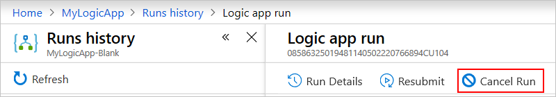
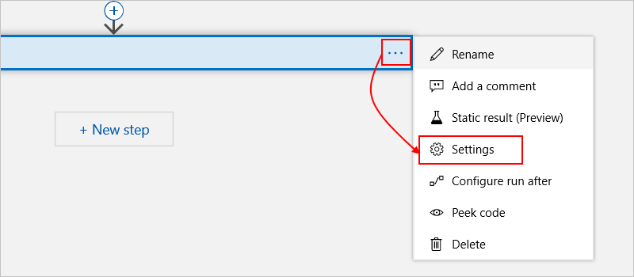
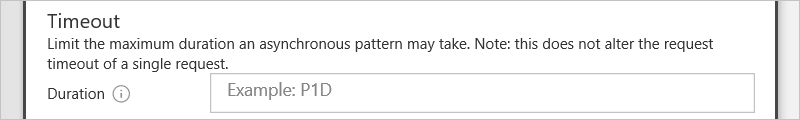
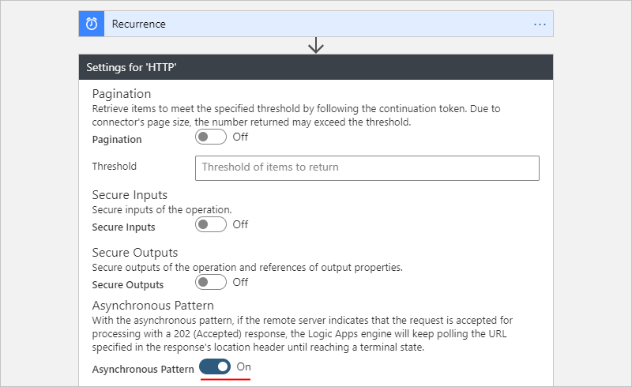
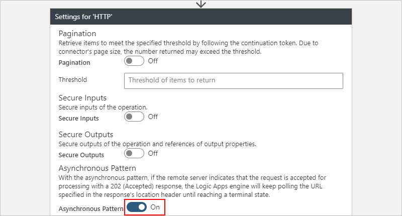

# Schema reference guide for trigger and action types in Azure Logic Apps

This reference describes the general types used for identifying triggers and actions in your logic app's underlying workflow definition, which is described and validated by the [Workflow Definition Language](../logic-apps/logic-apps-workflow-definition-language.md). To find specific connector triggers and actions that you can use in your logic apps, see the list under the [Connectors overview](/connectors/).

<a name="triggers-overview"></a>

## Triggers overview

Every workflow includes a trigger, which defines the calls that instantiate and start the workflow. Here are the general trigger categories:

* A *polling* trigger, which checks a service's endpoint at regular intervals

* A *push* trigger, which creates a subscription to an endpoint and provides a *callback URL* so the endpoint can notify the trigger when the specified event happens or data is available. The trigger then waits for the endpoint's response before firing.

Triggers have these top-level elements, although some are optional:  
  
```json
"<trigger-name>": {
   "type": "<trigger-type>",
   "inputs": { "<trigger-inputs>" },
   "recurrence": { 
      "frequency": "<time-unit>",
      "interval": <number-of-time-units>
   },
   "conditions": [ "<array-with-conditions>" ],
   "runtimeConfiguration": { "<runtime-config-options>" },
   "splitOn": "<splitOn-expression>",
   "operationOptions": "<operation-option>"
},
```

*Required*

| Value | Type | Description | 
|-------|------|-------------| 
| <*trigger-name*> | String | The name for the trigger | 
| <*trigger-type*> | String | The trigger type such as "Http" or "ApiConnection" | 
| <*trigger-inputs*> | JSON Object | The inputs that define the trigger's behavior | 
| <*time-unit*> | String | The unit of time that describes how often the trigger fires: "Second", "Minute", "Hour", "Day", "Week", "Month" | 
| <*number-of-time-units*> | Integer | A value that specifies how often the trigger fires based on the frequency, which is the number of time units to wait until the trigger fires again <p>Here are the minimum and maximum intervals: <p>- Month: 1-16 months </br>- Day: 1-500 days </br>- Hour: 1-12,000 hours </br>- Minute: 1-72,000 minutes </br>- Second: 1-9,999,999 seconds<p>For example, if the interval is 6, and the frequency is "Month", the recurrence is every 6 months. | 
|||| 

*Optional*

| Value | Type | Description | 
|-------|------|-------------| 
| <*array-with-conditions*> | Array | An array that contains one or more [conditions](#trigger-conditions) that determine whether to run the workflow. Available only for triggers. | 
| <*runtime-config-options*> | JSON Object | You can change trigger runtime behavior by setting `runtimeConfiguration` properties. For more information, see [Runtime configuration settings](#runtime-config-options). | 
| <*splitOn-expression*> | String | For triggers that return an array, you can specify an expression that [splits or *debatches*](#split-on-debatch) array items into multiple workflow instances for processing. | 
| <*operation-option*> | String | You can change the default behavior by setting the `operationOptions` property. For more information, see [Operation options](#operation-options). | 
|||| 

## Trigger types list

Each trigger type has a different interface and inputs that define the trigger's behavior. 

### Built-in triggers

| Trigger type | Description | 
|--------------|-------------| 
| [**HTTP**](#http-trigger) | Checks or *polls* any endpoint. This endpoint must conform to a specific trigger contract either by using a `202` asynchronous pattern or by returning an array. | 
| [**HTTPWebhook**](#http-webhook-trigger) | Creates a callable endpoint for your logic app but calls the specified URL to register or unregister. |
| [**Recurrence**](#recurrence-trigger) | Fires based on a defined schedule. You can set a future date and time for firing this trigger. Based on the frequency, you can also specify times and days for running your workflow. | 
| [**Request**](#request-trigger)  | Creates a callable endpoint for your logic app and is also known as a "manual" trigger. For example, see [Call, trigger, or nest workflows with HTTP endpoints](../logic-apps/logic-apps-http-endpoint.md). | 
||| 

### Managed API triggers

| Trigger type | Description | 
|--------------|-------------| 
| [**ApiConnection**](#apiconnection-trigger) | Checks or *polls* an endpoint by using [Microsoft-managed APIs or "connectors"](../connectors/introduction.md). | 
| [**ApiConnectionWebhook**](#apiconnectionwebhook-trigger) | Creates a callable endpoint for your logic app workflow by calling [Microsoft-managed APIs or "connectors"](../connectors/introduction.md) to subscribe and unsubscribe. | 
||| 

## Triggers - Detailed reference

<a name="apiconnection-trigger"></a>

### APIConnection trigger  

This trigger checks or *polls* an endpoint by using [Microsoft-managed APIs or "connectors"](../connectors/introduction.md) so the parameters for this trigger can differ based on the endpoint. Many sections in this trigger definition are optional. The trigger's behavior depends on whether or not sections are included.

```json
"<APIConnection_trigger_name>": {
   "type": "ApiConnection",
   "inputs": {
      "host": {
         "connection": {
            "name": "@parameters('$connections')['<connection-name>']['connectionId']"
         }
      },
      "method": "<method-type>",
      "path": "/<api-operation>",
      "retryPolicy": { "<retry-behavior>" },
      "queries": { "<query-parameters>" }
   },
   "recurrence": { 
      "frequency": "<time-unit>",
      "interval": <number-of-time-units>
   },
   "runtimeConfiguration": {
      "concurrency": {
         "runs": <max-runs>,
         "maximumWaitingRuns": <max-runs-queue>
      }
   },
   "splitOn": "<splitOn-expression>",
   "operationOptions": "<operation-option>"
}
```

*Required*

| Value | Type | Description |
|-------|------|-------------|
| <*APIConnection_trigger_name*> | String | The name for the trigger |
| <*connection-name*> | String | The name for the connection to the managed API that the workflow uses |
| <*method-type*> | String | The HTTP method for communicating with the managed API: "GET", "PUT", "POST", "PATCH", "DELETE" |
| <*api-operation*> | String | The API operation to call |
| <*time-unit*> | String | The unit of time that describes how often the trigger fires: "Second", "Minute", "Hour", "Day", "Week", "Month" |
| <*number-of-time-units*> | Integer | A value that specifies how often the trigger fires based on the frequency, which is the number of time units to wait until the trigger fires again <p>Here are the minimum and maximum intervals: <p>- Month: 1-16 months </br>- Day: 1-500 days </br>- Hour: 1-12,000 hours </br>- Minute: 1-72,000 minutes </br>- Second: 1-9,999,999 seconds<p>For example, if the interval is 6, and the frequency is "Month", the recurrence is every 6 months. |
||||

*Optional*

| Value | Type | Description | 
|-------|------|-------------| 
| <*retry-behavior*> | JSON Object | Customizes the retry behavior for intermittent failures, which have the 408, 429, and 5XX status code, and any connectivity exceptions. For more information, see [Retry policies](../logic-apps/logic-apps-exception-handling.md#retry-policies). | 
| <*query-parameters*> | JSON Object | Any query parameters to include with the API call. For example, the `"queries": { "api-version": "2018-01-01" }` object adds `?api-version=2018-01-01` to the call. | 
| <*max-runs*> | Integer | By default, workflow instances run at the same time (concurrently or in parallel) up to the [default limit](../logic-apps/logic-apps-limits-and-config.md#looping-debatching-limits). To change this limit by setting a new <*count*> value, see [Change trigger concurrency](#change-trigger-concurrency). | 
| <*max-runs-queue*> | Integer | When your workflow is already running the maximum number of instances, which you can change based on the `runtimeConfiguration.concurrency.runs` property, any new runs are put into this queue up to the [default limit](../logic-apps/logic-apps-limits-and-config.md#looping-debatching-limits). To change the default limit, see [Change waiting runs limit](#change-waiting-runs). | 
| <*splitOn-expression*> | String | For triggers that return arrays, this expression references the array to use so that you can create and run a workflow instance for each array item, rather than use a "for each" loop. <p>For example, this expression represents an item in the array returned within the trigger's body content: `@triggerbody()?['value']` |
| <*operation-option*> | String | You can change the default behavior by setting the `operationOptions` property. For more information, see [Operation options](#operation-options). |
||||

*Outputs*
 
| Element | Type | Description |
|---------|------|-------------|
| headers | JSON Object | The headers from the response |
| body | JSON Object | The body from the response |
| status code | Integer | The status code from the response |
|||| 

*Example*

This trigger definition checks for email every day inside the inbox for a work or school account:

```json
"When_a_new_email_arrives": {
   "type": "ApiConnection",
   "inputs": {
      "host": {
         "connection": {
            "name": "@parameters('$connections')['office365']['connectionId']"
         }
      },
      "method": "get",
      "path": "/Mail/OnNewEmail",
      "queries": {
          "fetchOnlyWithAttachment": false,
          "folderPath": "Inbox",
          "importance": "Any",
          "includeAttachments": false
      }
   },
   "recurrence": {
      "frequency": "Day",
      "interval": 1
   }
}
```

<a name="apiconnectionwebhook-trigger"></a>

### ApiConnectionWebhook trigger

This trigger sends a subscription request to an endpoint by using a [Microsoft-managed API](../connectors/introduction.md), provides a *callback URL* to where the endpoint can send a response, and waits for the endpoint to respond. For more information, see [Endpoint subscriptions](#subscribe-unsubscribe).

```json
"<ApiConnectionWebhook_trigger_name>": {
   "type": "ApiConnectionWebhook",
   "inputs": {
      "body": {
          "NotificationUrl": "@{listCallbackUrl()}"
      },
      "host": {
         "connection": {
            "name": "@parameters('$connections')['<connection-name>']['connectionId']"
         }
      },
      "retryPolicy": { "<retry-behavior>" },
      "queries": "<query-parameters>"
   },
   "runTimeConfiguration": {
      "concurrency": {
         "runs": <max-runs>,
         "maximumWaitingRuns": <max-run-queue>
      }
   },
   "splitOn": "<splitOn-expression>",
   "operationOptions": "<operation-option>"
}
```

*Required*

| Value | Type | Description | 
|-------|------|-------------| 
| <*connection-name*> | String | The name for the connection to the managed API that the workflow uses | 
| <*body-content*> | JSON Object | Any message content to send as payload to the managed API | 
||||

*Optional*

| Value | Type | Description |
|-------|------|-------------|
| <*retry-behavior*> | JSON Object | Customizes the retry behavior for intermittent failures, which have the 408, 429, and 5XX status code, and any connectivity exceptions. For more information, see [Retry policies](../logic-apps/logic-apps-exception-handling.md#retry-policies). |
| <*query-parameters*> | JSON Object | Any query parameters to include with the API call <p>For example, the `"queries": { "api-version": "2018-01-01" }` object adds `?api-version=2018-01-01` to the call. |
| <*max-runs*> | Integer | By default, workflow instances run at the same time (concurrently or in parallel) up to the [default limit](../logic-apps/logic-apps-limits-and-config.md#looping-debatching-limits). To change this limit by setting a new <*count*> value, see [Change trigger concurrency](#change-trigger-concurrency). |
| <*max-runs-queue*> | Integer | When your workflow is already running the maximum number of instances, which you can change based on the `runtimeConfiguration.concurrency.runs` property, any new runs are put into this queue up to the [default limit](../logic-apps/logic-apps-limits-and-config.md#looping-debatching-limits). To change the default limit, see [Change waiting runs limit](#change-waiting-runs). | 
| <*splitOn-expression*> | String | For triggers that return arrays, this expression references the array to use so that you can create and run a workflow instance for each array item, rather than use a "for each" loop. <p>For example, this expression represents an item in the array returned within the trigger's body content: `@triggerbody()?['value']` |
| <*operation-option*> | String | You can change the default behavior by setting the `operationOptions` property. For more information, see [Operation options](#operation-options). | 
|||| 

*Example*

This trigger definition subscribes to the Office 365 Outlook API, provides a callback URL to the API endpoint, and waits for the endpoint to respond when a new email arrives.

```json
"When_a_new_email_arrives_(webhook)": {
   "type": "ApiConnectionWebhook",
   "inputs": {
      "body": {
         "NotificationUrl": "@{listCallbackUrl()}" 
      },
      "host": {
         "connection": {
            "name": "@parameters('$connections')['office365']['connectionId']"
         }
      },
      "path": "/MailSubscription/$subscriptions",
      "queries": {
          "folderPath": "Inbox",
          "hasAttachment": "Any",
          "importance": "Any"
      }
   },
   "splitOn": "@triggerBody()?['value']"
}
```

<a name="http-trigger"></a>

### HTTP trigger

This trigger sends a request to the specified HTTP or HTTPS endpoint based on the specified recurrence schedule. The trigger then checks the response to determine whether the workflow runs. For more information, see [Call service endpoints over HTTP or HTTPS from Azure Logic Apps](../connectors/connectors-native-http.md).

```json
"HTTP": {
   "type": "Http",
   "inputs": {
      "method": "<method-type>",
      "uri": "<HTTP-or-HTTPS-endpoint-URL>",
      "headers": { "<header-content>" },
      "queries": "<query-parameters>",
      "body": "<body-content>",
      "authentication": { "<authentication-type-and-property-values>" },
      "retryPolicy": {
         "type": "<retry-behavior>"
      }
   },
   "recurrence": {
      "frequency": "<time-unit>",
      "interval": <number-of-time-units>
   },
   "runtimeConfiguration": {
      "concurrency": {
         "runs": <max-runs>,
         "maximumWaitingRuns": <max-runs-queue>
      }
   },
   "operationOptions": "<operation-option>"
}
```

*Required*

| Property | Value | Type | Description |
|----------|-------|------|-------------|
| `method` | <*method-type*> | String | The method to use for sending the outgoing request: "GET", "PUT", "POST", "PATCH", or "DELETE" |
| `uri` | <*HTTP-or-HTTPS-endpoint-URL*> | String | The HTTP or HTTPS endpoint URL where you want to send the outgoing request. Maximum string size: 2 KB <p>For an Azure service or resource, this URI syntax includes the resource ID and the path to the resource that you want to access. |
| `frequency` | <*time-unit*> | String | The unit of time that describes how often the trigger fires: "Second", "Minute", "Hour", "Day", "Week", "Month" |
| `interval` | <*number-of-time-units*> | Integer | A value that specifies how often the trigger fires based on the frequency, which is the number of time units to wait until the trigger fires again <p>Here are the minimum and maximum intervals: <p>- Month: 1-16 months </br>- Day: 1-500 days </br>- Hour: 1-12,000 hours </br>- Minute: 1-72,000 minutes </br>- Second: 1-9,999,999 seconds<p>For example, if the interval is 6, and the frequency is "Month", the recurrence is every 6 months. |
|||||

*Optional*

| Property | Value | Type | Description |
|----------|-------|------|-------------|
| `headers` | <*header-content*> | JSON Object | Any headers that you need to include with the request <p>For example, to set the language and type: <p>`"headers": { "Accept-Language": "en-us", "Content-Type": "application/json" }` |
| `queries` | <*query-parameters*> | JSON Object | Any query parameters that you need to use in the request <p>For example, the `"queries": { "api-version": "2018-01-01" }` object adds `?api-version=2018-01-01` to the request. |
| `body` | <*body-content*> | JSON Object | The message content to send as payload with the request |
| `authentication` | <*authentication-type-and-property-values*> | JSON Object | The authentication model that the request uses for authenticating outbound requests. For more information, see [Add authentication to outbound calls](../logic-apps/logic-apps-securing-a-logic-app.md#add-authentication-outbound). Beyond Scheduler, the `authority` property is supported. When not specified, the default value is `https://management.azure.com/`, but you can use a different value. |
| `retryPolicy` > `type` | <*retry-behavior*> | JSON Object | Customizes the retry behavior for intermittent failures, which have the 408, 429, and 5XX status code, and any connectivity exceptions. For more information, see [Retry policies](../logic-apps/logic-apps-exception-handling.md#retry-policies). |
| `runs` | <*max-runs*> | Integer | By default, workflow instances run at the same time (concurrently or in parallel) up to the [default limit](../logic-apps/logic-apps-limits-and-config.md#looping-debatching-limits). To change this limit by setting a new <*count*> value, see [Change trigger concurrency](#change-trigger-concurrency). |
| `maximumWaitingRuns` | <*max-runs-queue*> | Integer | When your workflow is already running the maximum number of instances, which you can change based on the `runtimeConfiguration.concurrency.runs` property, any new runs are put into this queue up to the [default limit](../logic-apps/logic-apps-limits-and-config.md#looping-debatching-limits). To change the default limit, see [Change waiting runs limit](#change-waiting-runs). |
| `operationOptions` | <*operation-option*> | String | You can change the default behavior by setting the `operationOptions` property. For more information, see [Operation options](#operation-options). |
|||||

*Outputs*

| Element | Type | Description |
|---------|------|-------------|
| `headers` | JSON Object | The headers from the response |
| `body` | JSON Object | The body from the response |
| `status code` | Integer | The status code from the response |
||||

*Requirements for incoming requests*

To work well with your logic app, the endpoint must conform to a specific trigger pattern or contract, and recognize these response properties:

| Property | Required | Description |
|----------|----------|-------------|
| Status code | Yes | The "200 OK" status code starts a run. Any other status code doesn't start a run. |
| Retry-after header | No | The number of seconds until your logic app polls the endpoint again |
| Location header | No | The URL to call at the next polling interval. If not specified, the original URL is used. |
|||| 

*Example behaviors for different requests*

| Status code | Retry after | Behavior | 
|-------------|-------------|----------|
| 200 | {none} | Run the workflow, then check again for more data after the defined recurrence. | 
| 200 | 10 seconds | Run the workflow, then check again for more data after 10 seconds. |  
| 202 | 60 seconds | Don't trigger the workflow. The next attempt happens in one minute, subject to the defined recurrence. If the defined recurrence is less than one minute, the retry-after header takes precedence. Otherwise, the defined recurrence is used. | 
| 400 | {none} | Bad request, don't run the workflow. If no `retryPolicy` is defined, then the default policy is used. After the number of retries has been reached, the trigger checks again for data after the defined recurrence. | 
| 500 | {none}| Server error, don't run the workflow. If no `retryPolicy` is defined, then the default policy is used. After the number of retries has been reached, the trigger checks again for data after the defined recurrence. | 
|||| 

<a name="http-webhook-trigger"></a>

### HTTPWebhook trigger  

This trigger makes your logic app callable by creating an endpoint that can register a subscription by calling the specified endpoint URL. When you create this trigger in your workflow, an outgoing request makes the call to register the subscription. That way, the trigger can start listening for events. When an operation makes this trigger invalid, an outgoing request automatically makes the call to cancel the subscription. For more information, see [Endpoint subscriptions](#subscribe-unsubscribe).

You can also specify [asynchronous limits](#asynchronous-limits) on an **HTTPWebhook** trigger. The trigger's behavior depends on the sections that you use or omit.

```json
"HTTP_Webhook": {
   "type": "HttpWebhook",
   "inputs": {
      "subscribe": {
         "method": "<method-type>",
         "uri": "<endpoint-subscribe-URL>",
         "headers": { "<header-content>" },
         "body": "<body-content>",
         "authentication": { "<authentication-type>" },
         "retryPolicy": { "<retry-behavior>" }
         },
      },
      "unsubscribe": {
         "method": "<method-type>",
         "url": "<endpoint-unsubscribe-URL>",
         "headers": { "<header-content>" },
         "body": "<body-content>",
         "authentication": { "<authentication-type>" }
      }
   },
   "runTimeConfiguration": {
      "concurrency": {
         "runs": <max-runs>,
         "maximumWaitingRuns": <max-runs-queue>
      }
   },
   "operationOptions": "<operation-option>"
}
```

Some values, such as <*method-type*>, are available for 
both the `"subscribe"` and `"unsubscribe"` objects.

*Required*

| Value | Type | Description | 
|-------|------|-------------| 
| <*method-type*> | String | The HTTP method to use for the subscription request: "GET", "PUT", "POST", "PATCH", or "DELETE" | 
| <*endpoint-subscribe-URL*> | String | The endpoint URL where to send the subscription request | 
|||| 

*Optional*

| Value | Type | Description | 
|-------|------|-------------| 
| <*method-type*> | String | The HTTP method to use for the cancellation request: "GET", "PUT", "POST", "PATCH", or "DELETE" | 
| <*endpoint-unsubscribe-URL*> | String | The endpoint URL where to send the cancellation request | 
| <*body-content*> | String | Any message content to send in the subscription or cancellation request | 
| <*authentication-type*> | JSON Object | The authentication model that the request uses for authenticating outbound requests. For more information, see [Add authentication to outbound calls](../logic-apps/logic-apps-securing-a-logic-app.md#add-authentication-outbound). |
| <*retry-behavior*> | JSON Object | Customizes the retry behavior for intermittent failures, which have the 408, 429, and 5XX status code, and any connectivity exceptions. For more information, see [Retry policies](../logic-apps/logic-apps-exception-handling.md#retry-policies). | 
| <*max-runs*> | Integer | By default, workflow instances all run at the same time (concurrently or in parallel) up to the [default limit](../logic-apps/logic-apps-limits-and-config.md#looping-debatching-limits). To change this limit by setting a new <*count*> value, see [Change trigger concurrency](#change-trigger-concurrency). | 
| <*max-runs-queue*> | Integer | When your workflow is already running the maximum number of instances, which you can change based on the `runtimeConfiguration.concurrency.runs` property, any new runs are put into this queue up to the [default limit](../logic-apps/logic-apps-limits-and-config.md#looping-debatching-limits). To change the default limit, see [Change waiting runs limit](#change-waiting-runs). | 
| <*operation-option*> | String | You can change the default behavior by setting the `operationOptions` property. For more information, see [Operation options](#operation-options). | 
|||| 

*Outputs* 

| Element | Type | Description |
|---------|------|-------------| 
| headers | JSON Object | The headers from the response | 
| body | JSON Object | The body from the response | 
| status code | Integer | The status code from the response | 
|||| 

*Example*

This trigger creates a subscription to the specified endpoint, provides a unique callback URL, and waits for newly published technology articles.

```json
"HTTP_Webhook": {
   "type": "HttpWebhook",
   "inputs": {
      "subscribe": {
         "method": "POST",
         "uri": "https://pubsubhubbub.appspot.com/subscribe",
         "body": {
            "hub.callback": "@{listCallbackUrl()}",
            "hub.mode": "subscribe",
            "hub.topic": "https://pubsubhubbub.appspot.com/articleCategories/technology"
         },
      },
      "unsubscribe": {
         "method": "POST",
         "url": "https://pubsubhubbub.appspot.com/subscribe",
         "body": {
            "hub.callback": "@{workflow().endpoint}@{listCallbackUrl()}",
            "hub.mode": "unsubscribe",
            "hub.topic": "https://pubsubhubbub.appspot.com/articleCategories/technology"
         }
      }
   }
}
```

<a name="recurrence-trigger"></a>

### Recurrence trigger  

This trigger runs based on the specified recurrence schedule and provides an easy way for creating a regularly running workflow.

```json
"Recurrence": {
   "type": "Recurrence",
   "recurrence": {
      "frequency": "<time-unit>",
      "interval": <number-of-time-units>,
      "startTime": "<start-date-time-with-format-YYYY-MM-DDThh:mm:ss>",
      "timeZone": "<time-zone>",
      "schedule": {
         // Applies only when frequency is Day or Week. Separate values with commas.
         "hours": [ <one-or-more-hour-marks> ], 
         // Applies only when frequency is Day or Week. Separate values with commas.
         "minutes": [ <one-or-more-minute-marks> ], 
         // Applies only when frequency is Week. Separate values with commas.
         "weekDays": [ "Monday, Tuesday, Wednesday, Thursday, Friday, Saturday, Sunday" ] 
      }
   },
   "runtimeConfiguration": {
      "concurrency": {
         "runs": <max-runs>,
         "maximumWaitingRuns": <max-runs-queue>
      }
   },
   "operationOptions": "<operation-option>"
}
```

*Required*

| Value | Type | Description | 
|-------|------|-------------| 
| <*time-unit*> | String | The unit of time that describes how often the trigger fires: "Second", "Minute", "Hour", "Day", "Week", "Month" | 
| <*number-of-time-units*> | Integer | A value that specifies how often the trigger fires based on the frequency, which is the number of time units to wait until the trigger fires again <p>Here are the minimum and maximum intervals: <p>- Month: 1-16 months </br>- Day: 1-500 days </br>- Hour: 1-12,000 hours </br>- Minute: 1-72,000 minutes </br>- Second: 1-9,999,999 seconds<p>For example, if the interval is 6, and the frequency is "Month", the recurrence is every 6 months. | 
|||| 

*Optional*

| Value | Type | Description | 
|-------|------|-------------| 
| <*start-date-time-with-format-YYYY-MM-DDThh:mm:ss*> | String | The start date and time in this format: <p>YYYY-MM-DDThh:mm:ss if you specify a time zone <p>-or- <p>YYYY-MM-DDThh:mm:ssZ if you don't specify a time zone <p>So for example, if you want September 18, 2017 at 2:00 PM, then specify "2017-09-18T14:00:00" and specify a time zone such as "Pacific Standard Time", or specify "2017-09-18T14:00:00Z" without a time zone. <p>**Note:** This start time has a maximum of 49 years in the future and must follow the [ISO 8601 date time specification](https://en.wikipedia.org/wiki/ISO_8601#Combined_date_and_time_representations) in [UTC date time format](https://en.wikipedia.org/wiki/Coordinated_Universal_Time), but without a [UTC offset](https://en.wikipedia.org/wiki/UTC_offset). If you don't specify a time zone, you must add the letter "Z" at the end without any spaces. This "Z" refers to the equivalent [nautical time](https://en.wikipedia.org/wiki/Nautical_time). <p>For simple schedules, the start time is the first occurrence, while for complex schedules, the trigger doesn't fire any sooner than the start time. For more information about start dates and times, see [Create and schedule regularly running tasks](../connectors/connectors-native-recurrence.md). | 
| <*time-zone*> | String | Applies only when you specify a start time because this trigger doesn't accept [UTC offset](https://en.wikipedia.org/wiki/UTC_offset). Specify the time zone that you want to apply. | 
| <*one-or-more-hour-marks*> | Integer or integer array | If you specify "Day" or "Week" for `frequency`, you can specify one or more integers from 0 to 23, separated by commas, as the hours of the day when you want to run the workflow. <p>For example, if you specify "10", "12" and "14", you get 10 AM, 12 PM, and 2 PM as the hour marks. | 
| <*one-or-more-minute-marks*> | Integer or integer array | If you specify "Day" or "Week" for `frequency`, you can specify one or more integers from 0 to 59, separated by commas, as the minutes of the hour when you want to run the workflow. <p>For example, you can specify "30" as the minute mark and using the previous example for hours of the day, you get 10:30 AM, 12:30 PM, and 2:30 PM. | 
| weekDays | String or string array | If you specify "Week" for `frequency`, you can specify one or more days, separated by commas, when you want to run the workflow: "Monday", "Tuesday", "Wednesday", "Thursday", "Friday", "Saturday", and "Sunday" | 
| <*max-runs*> | Integer | By default, workflow instances all run at the same time (concurrently or in parallel) up to the [default limit](../logic-apps/logic-apps-limits-and-config.md#looping-debatching-limits). To change this limit by setting a new <*count*> value, see [Change trigger concurrency](#change-trigger-concurrency). | 
| <*max-runs-queue*> | Integer | When your workflow is already running the maximum number of instances, which you can change based on the `runtimeConfiguration.concurrency.runs` property, any new runs are put into this queue up to the [default limit](../logic-apps/logic-apps-limits-and-config.md#looping-debatching-limits). To change the default limit, see [Change waiting runs limit](#change-waiting-runs). | 
| <*operation-option*> | String | You can change the default behavior by setting the `operationOptions` property. For more information, see [Operation options](#operation-options). | 
|||| 

*Example 1*

This basic recurrence trigger runs daily:

```json
"Recurrence": {
   "type": "Recurrence",
   "recurrence": {
      "frequency": "Day",
      "interval": 1
   }
}
```

*Example 2*

You can specify a start date and time for firing the trigger. This recurrence trigger starts on the specified date and then fires daily:

```json
"Recurrence": {
   "type": "Recurrence",
   "recurrence": {
      "frequency": "Day",
      "interval": 1,
      "startTime": "2017-09-18T00:00:00Z"
   }
}
```

*Example 3*

This recurrence trigger starts on September 9, 2017 at 2:00 PM, and fires weekly every Monday at 10:30 AM, 12:30 PM, and 2:30 PM Pacific Standard Time:

``` json
"Recurrence": {
   "type": "Recurrence",
   "recurrence": {
      "frequency": "Week",
      "interval": 1,
      "schedule": {
         "hours": [ 10, 12, 14 ],
         "minutes": [ 30 ],
         "weekDays": [ "Monday" ]
      },
      "startTime": "2017-09-07T14:00:00",
      "timeZone": "Pacific Standard Time"
   }
}
```

For more information plus examples for this trigger, see [Create and schedule regularly running tasks](../connectors/connectors-native-recurrence.md).

<a name="request-trigger"></a>

### Request trigger

This trigger makes your logic app callable by creating an endpoint that can accept incoming requests. For this trigger, provide a JSON schema that describes and validates the payload or inputs that the trigger receives from the incoming request. The schema also makes trigger properties easier to reference from later actions in the workflow.

To call this trigger, you must use the `listCallbackUrl` API, which is described in the [Workflow Service REST API](/rest/api/logic/workflows). To learn how to use this trigger as an HTTP endpoint, see [Call, trigger, or nest workflows with HTTP endpoints](../logic-apps/logic-apps-http-endpoint.md).

```json
"manual": {
   "type": "Request",
   "kind": "Http",
   "inputs": {
      "method": "<method-type>",
      "relativePath": "<relative-path-for-accepted-parameter>",
      "schema": {
         "type": "object",
         "properties": { 
            "<property-name>": {
               "type": "<property-type>"
            }
         },
         "required": [ "<required-properties>" ]
      }
   },
   "runTimeConfiguration": {
      "concurrency": {
         "runs": <max-runs>,
         "maximumWaitingRuns": <max-run-queue>
      },
   },
   "operationOptions": "<operation-option>"
}
```

*Required*

| Value | Type | Description | 
|-------|------|-------------| 
| <*property-name*> | String | The name of a property in the JSON schema, which describes the payload | 
| <*property-type*> | String | The property's type | 
|||| 

*Optional*

| Value | Type | Description | 
|-------|------|-------------| 
| <*method-type*> | String | The method that incoming requests must use to call your logic app: "GET", "PUT", "POST", "PATCH", "DELETE" |
| <*relative-path-for-accepted-parameter*> | String | The relative path for the parameter that your endpoint's URL can accept | 
| <*required-properties*> | Array | One or more properties that require values | 
| <*max-runs*> | Integer | By default, workflow instances all run at the same time (concurrently or in parallel) up to the [default limit](../logic-apps/logic-apps-limits-and-config.md#looping-debatching-limits). To change this limit by setting a new <*count*> value, see [Change trigger concurrency](#change-trigger-concurrency). | 
| <*max-runs-queue*> | Integer | When your workflow is already running the maximum number of instances, which you can change based on the `runtimeConfiguration.concurrency.runs` property, any new runs are put into this queue up to the [default limit](../logic-apps/logic-apps-limits-and-config.md#looping-debatching-limits). To change the default limit, see [Change waiting runs limit](#change-waiting-runs). | 
| <*operation-option*> | String | You can change the default behavior by setting the `operationOptions` property. For more information, see [Operation options](#operation-options). | 
|||| 

*Example*

This trigger specifies that an incoming request must use the HTTP POST method to call the trigger and includes a schema that validates input from the incoming request:

```json
"manual": {
   "type": "Request",
   "kind": "Http",
   "inputs": {
      "method": "POST",
      "schema": {
         "type": "object",
         "properties": {
            "customerName": {
               "type": "String"
            },
            "customerAddress": { 
               "type": "Object",
               "properties": {
                  "streetAddress": {
                     "type": "string"
                  },
                  "city": {
                     "type": "string"
                  }
               }
            }
         }
      }
   }
}
```

<a name="trigger-conditions"></a>

## Trigger conditions

For any trigger, and only triggers, you can include an array that contains one or more expressions for conditions that determine whether the workflow should run. To add the `conditions` property to a trigger in your workflow, open your logic app in the code view editor.

For example, you can specify that a trigger fires only when a website returns an internal server error by referencing the trigger's status code in the `conditions` property:

```json
"Recurrence": {
   "type": "Recurrence",
   "recurrence": {
      "frequency": "Hour",
      "interval": 1
   },
   "conditions": [ {
      "expression": "@equals(triggers().code, 'InternalServerError')"
   } ]
}
```

By default, a trigger fires only after getting a "200 OK" response. When an expression references a trigger's status code, the trigger's default behavior is replaced. So, if you want the trigger to fire for more than one status code, such as the "200" and "201" status code, you must include 
this expression as your condition:

`@or(equals(triggers().code, 200),equals(triggers().code, 201))` 

<a name="split-on-debatch"></a>

## Trigger multiple runs on an array

If your trigger receives an array for your workflow to process, sometimes a "for each" loop might take too long to process each array item. Instead, you can use the **SplitOn** property in your trigger to *debatch* the array. Debatching splits up the array items and starts a new workflow instance that runs for each array item. This approach is useful, for example, when you want to poll an endpoint that might return multiple new items between polling intervals.

If your trigger's Swagger file describes a payload that's an array, the **SplitOn** property is automatically added to your trigger. Otherwise, add this property inside the response payload that has 
the array you want to debatch.

Before you use the SplitOn capability, review the following considerations:

- If trigger concurrency is enabled, the [SplitOn limit](../logic-apps/logic-apps-limits-and-config.md#looping-debatching-limits) is significantly reduced. If the number of items exceeds this limit, the SplitOn capability is disabled.

- You can't use the SplitOn capability with a synchronous response pattern. Any workflow that uses the **SplitOn** property and includes a response action runs asynchronously and immediately sends a `202 ACCEPTED` response.

- For the maximum number of array items that **SplitOn** can process in a single workflow run, see [Limits and configuration](../logic-apps/logic-apps-limits-and-config.md#looping-debatching-limits).

*Example*

Suppose you have an HTTP trigger that calls an API and receives this response: 
  
```json
{
   "Status": "Succeeded",
   "Rows": [ 
      { 
         "id": 938109380,
         "name": "customer-name-one"
      },
      {
         "id": 938109381,
         "name": "customer-name-two"
      }
   ]
}
```

Your workflow needs only the content from the array in `Rows`, so you can create a trigger like this example:

``` json
"HTTP_Debatch": {
   "type": "Http",
    "inputs": {
        "uri": "https://mydomain.com/myAPI",
        "method": "GET"
    },
   "recurrence": {
      "frequency": "Second",
      "interval": 1
    },
    "splitOn": "@triggerBody()?.Rows"
}
```

> [!NOTE]
> If you use the `SplitOn` command, you can't get the properties that are outside the array. 
> So for this example, you can't get the `status` property in the response returned from the API.
> 
> To avoid a failure if the `Rows` property doesn't exist, this example uses the `?` operator.

Your workflow definition can now use `@triggerBody().name` to get the `name` values, which are `"customer-name-one"` from the first run and `"customer-name-two"` from the second run. So, your trigger outputs look like these examples:

```json
{
   "body": {
      "id": 938109380,
      "name": "customer-name-one"
   }
}
```

```json
{
   "body": {
      "id": 938109381,
      "name": "customer-name-two"
   }
}
```

<a name="actions-overview"></a>

## Actions overview

Azure Logic Apps provides various action types - each with different inputs that define an action's unique behavior. Actions have these high-level elements, though some are optional:

```json
"<action-name>": {
   "type": "<action-type>",
   "inputs": { 
      "<input-name>": { "<input-value>" },
      "retryPolicy": "<retry-behavior>" 
   },
   "runAfter": { "<previous-trigger-or-action-status>" },
   "runtimeConfiguration": { "<runtime-config-options>" },
   "operationOptions": "<operation-option>"
},
```

*Required*

| Value | Type | Description | 
|-------|------|-------------|
| <*action-name*> | String | The name for the action | 
| <*action-type*> | String | The action type, for example, "Http" or "ApiConnection"| 
| <*input-name*> | String | The name for an input that defines the action's behavior | 
| <*input-value*> | Various | The input value, which can be a string, integer, JSON object, and so on | 
| <*previous-trigger-or-action-status*> | JSON Object | The name and resulting status for the trigger or action that must run immediately before this current action can run | 
|||| 

*Optional*

| Value | Type | Description | 
|-------|------|-------------|
| <*retry-behavior*> | JSON Object | Customizes the retry behavior for intermittent failures, which have the 408, 429, and 5XX status code, and any connectivity exceptions. For more information, see Retry policies. | 
| <*runtime-config-options*> | JSON Object | For some actions, you can change the action's behavior at run time by setting `runtimeConfiguration` properties. For more information, see [Runtime configuration settings](#runtime-config-options). | 
| <*operation-option*> | String | For some actions, you can change the default behavior by setting the `operationOptions` property. For more information, see [Operation options](#operation-options). | 
|||| 

## Action types list

Here are some commonly used action types: 

* [Built-in action types](#built-in-actions) such as these examples and more: 

  * [**HTTP**](#http-action) for calling endpoints over HTTP or HTTPS

  * [**Response**](#response-action) for responding to requests

  * [**Execute JavaScript Code**](#run-javascript-code) for running JavaScript code snippets

  * [**Function**](#function-action) for calling Azure Functions

  * Data operation actions such as [**Join**](#join-action), [**Compose**](#compose-action), [**Table**](#table-action), [**Select**](#select-action), and others that create or transform data from various inputs

  * [**Workflow**](#workflow-action) for calling another logic app workflow

* [Managed API action types](#managed-api-actions) such as [**ApiConnection**](#apiconnection-action) and [**ApiConnectionWebHook**](#apiconnectionwebhook-action) that call various connectors and APIs managed by Microsoft, for example, Azure Service Bus, Office 365 Outlook, Power BI, Azure Blob Storage, OneDrive, GitHub, and more

* [Control workflow action types](#control-workflow-actions) such as [**If**](#if-action), [**Foreach**](#foreach-action), [**Switch**](#switch-action), [**Scope**](#scope-action), and [**Until**](#until-action), which contain other actions and help you organize workflow execution

<a name="built-in-actions"></a>

### Built-in actions

| Action type | Description | 
|-------------|-------------| 
| [**Compose**](#compose-action) | Creates a single output from inputs, which can have various types. | 
| [**Execute JavaScript Code**](#run-javascript-code) | Run JavaScript code snippets that fit within specific criteria. For code requirements and more information, see [Add and run code snippets with inline code](../logic-apps/logic-apps-add-run-inline-code.md). |
| [**Function**](#function-action) | Calls an Azure Function. | 
| [**HTTP**](#http-action) | Calls an HTTP endpoint. | 
| [**Join**](#join-action) | Creates a string from all the items in an array and separates those items with a specified delimiter character. | 
| [**Parse JSON**](#parse-json-action) | Creates user-friendly tokens from properties in JSON content. You can then reference those properties by including the tokens in your logic app. | 
| [**Query**](#query-action) | Creates an array from items in another array based on a condition or filter. | 
| [**Response**](#response-action) | Creates a response to an incoming call or request. | 
| [**Select**](#select-action) | Creates an array with JSON objects by transforming items from another array based on the specified map. | 
| [**Table**](#table-action) | Creates a CSV or HTML table from an array. | 
| [**Terminate**](#terminate-action) | Stops an actively running workflow. | 
| [**Wait**](#wait-action) | Pauses your workflow for a specified duration or until the specified date and time. | 
| [**Workflow**](#workflow-action) | Nests a workflow inside another workflow. | 
||| 

<a name="managed-api-actions"></a>

### Managed API actions

| Action type | Description | 
|-------------|-------------|  
| [**ApiConnection**](#apiconnection-action) | Calls an HTTP endpoint by using a [Microsoft-managed API](../connectors/introduction.md). | 
| [**ApiConnectionWebhook**](#apiconnectionwebhook-action) | Works like HTTP Webhook but uses a [Microsoft-managed API](../connectors/introduction.md). | 
||| 

<a name="control-workflow-actions"></a>

### Control workflow actions

These actions help you control workflow execution and include other actions. From outside a control workflow action, you can directly reference actions inside that control workflow action. For example, if you have an `Http` action inside a scope, you can reference the `@body('Http')` expression from anywhere in the workflow. However, actions that exist inside a control workflow action can only "run after" other actions that are in the same control workflow structure.

| Action type | Description | 
|-------------|-------------| 
| [**ForEach**](#foreach-action) | Run the same actions in a loop for every item in an array. | 
| [**If**](#if-action) | Run actions based on whether the specified condition is true or false. | 
| [**Scope**](#scope-action) | Run actions based on the group status from a set of actions. | 
| [**Switch**](#switch-action) | Run actions organized into cases when values from expressions, objects, or tokens match the values specified by each case. | 
| [**Until**](#until-action) | Run actions in a loop until the specified condition is true. | 
|||  

## Actions - Detailed reference

<a name="apiconnection-action"></a>

### APIConnection action

This action sends an HTTP request to a [Microsoft-managed API](../connectors/introduction.md) and requires information about the API and parameters plus a reference to a valid connection. 

``` json
"<action-name>": {
   "type": "ApiConnection",
   "inputs": {
      "host": {
         "connection": {
            "name": "@parameters('$connections')['<api-name>']['connectionId']"
         },
         "<other-action-specific-input-properties>"        
      },
      "method": "<method-type>",
      "path": "/<api-operation>",
      "retryPolicy": "<retry-behavior>",
      "queries": { "<query-parameters>" },
      "<other-action-specific-properties>"
    },
    "runAfter": {}
}
```

*Required*

| Value | Type | Description | 
|-------|------|-------------| 
| <*action-name*> | String | The name of the action provided by the connector | 
| <*api-name*> | String | The name of the Microsoft-managed API that is used for the connection | 
| <*method-type*> | String | The HTTP method for calling the API: "GET", "PUT", "POST", "PATCH", or "DELETE" | 
| <*api-operation*> | String | The API operation to call | 
|||| 

*Optional*

| Value | Type | Description | 
|-------|------|-------------| 
| <*other-action-specific-input-properties*> | JSON Object | Any other input properties that apply to this specific action | 
| <*retry-behavior*> | JSON Object | Customizes the retry behavior for intermittent failures, which have the 408, 429, and 5XX status code, and any connectivity exceptions. For more information, see [Retry policies](../logic-apps/logic-apps-exception-handling.md#retry-policies). | 
| <*query-parameters*> | JSON Object | Any query parameters to include with the API call. <p>For example, the `"queries": { "api-version": "2018-01-01" }` object adds `?api-version=2018-01-01` to the call. | 
| <*other-action-specific-properties*> | JSON Object | Any other properties that apply to this specific action | 
|||| 

*Example*

This definition describes the **Send an email** action for Office 365 Outlook connector, which is a Microsoft-managed API: 

```json
"Send_an_email": {
   "type": "ApiConnection",
   "inputs": {
      "body": {
         "Body": "Thank you for your membership!",
         "Subject": "Hello and welcome!",
         "To": "Sophie.Owen@contoso.com"
      },
      "host": {
         "connection": {
            "name": "@parameters('$connections')['office365']['connectionId']"
         }
      },
      "method": "POST",
      "path": "/Mail"
    },
    "runAfter": {}
}
```

<a name="apiconnection-webhook-action"></a>

### APIConnectionWebhook action

This action sends a subscription request over HTTP to an endpoint by using a [Microsoft-managed API](../connectors/introduction.md), provides a *callback URL* to where the endpoint can send a response, 
and waits for the endpoint to respond. For more information, see [Endpoint subscriptions](#subscribe-unsubscribe).

```json
"<action-name>": {
   "type": "ApiConnectionWebhook",
   "inputs": {
      "subscribe": {
         "method": "<method-type>",
         "uri": "<api-subscribe-URL>",
         "headers": { "<header-content>" },
         "body": "<body-content>",
         "authentication": { "<authentication-type>" },
         "retryPolicy": "<retry-behavior>",
         "queries": { "<query-parameters>" },
         "<other-action-specific-input-properties>"
      },
      "unsubscribe": {
         "method": "<method-type>",
         "uri": "<api-unsubscribe-URL>",
         "headers": { "<header-content>" },
         "body": "<body-content>",
         "authentication": { "<authentication-type>" },
         "<other-action-specific-properties>"
      },
   },
   "runAfter": {}
}
```

Some values, such as <*method-type*>, are available for both the `"subscribe"` and `"unsubscribe"` objects.

*Required*

| Value | Type | Description | 
|-------|------|-------------| 
| <*action-name*> | String | The name of the action provided by the connector | 
| <*method-type*> | String | The HTTP method to use for subscribing or unsubscribing from an endpoint: "GET", "PUT", "POST", "PATCH", or "DELETE" | 
| <*api-subscribe-URL*> | String | The URI to use for subscribing to the API | 
|||| 

*Optional*

| Value | Type | Description | 
|-------|------|-------------| 
| <*api-unsubscribe-URL*> | String | The URI to use for unsubscribing from the API | 
| <*header-content*> | JSON Object | Any headers to send in the request <p>For example, to set the language and type on a request: <p>`"headers": { "Accept-Language": "en-us", "Content-Type": "application/json" }` |
| <*body-content*> | JSON Object | Any message content to send in the request | 
| <*authentication-type*> | JSON Object | The authentication model that the request uses for authenticating outbound requests. For more information, see [Add authentication to outbound calls](../logic-apps/logic-apps-securing-a-logic-app.md#add-authentication-outbound). |
| <*retry-behavior*> | JSON Object | Customizes the retry behavior for intermittent failures, which have the 408, 429, and 5XX status code, and any connectivity exceptions. For more information, see [Retry policies](../logic-apps/logic-apps-exception-handling.md#retry-policies). | 
| <*query-parameters*> | JSON Object | Any query parameters to include with the API call <p>For example, the `"queries": { "api-version": "2018-01-01" }` object adds `?api-version=2018-01-01` to the call. | 
| <*other-action-specific-input-properties*> | JSON Object | Any other input properties that apply to this specific action | 
| <*other-action-specific-properties*> | JSON Object | Any other properties that apply to this specific action | 
|||| 

You can also specify limits on an **ApiConnectionWebhook** action in the same way as [HTTP asynchronous limits](#asynchronous-limits).

<a name="compose-action"></a>

### Compose action

This action creates a single output from multiple inputs, including expressions. Both the output and inputs can have any type that Azure Logic Apps natively supports, such as arrays, JSON objects, XML, and binary. You can then use the action's output in other actions. 

```json
"Compose": {
   "type": "Compose",
   "inputs": "<inputs-to-compose>",
   "runAfter": {}
},
```

*Required* 

| Value | Type | Description | 
|-------|------|-------------| 
| <*inputs-to-compose*> | Any | The inputs for creating a single output | 
|||| 

*Example 1*

<!-- markdownlint-disable MD038 -->
This action definition merges `abcdefg ` with a trailing space and the value `1234`:
<!-- markdownlint-enable MD038 -->

```json
"Compose": {
   "type": "Compose",
   "inputs": "abcdefg 1234",
   "runAfter": {}
},
```

Here's the output that this action creates:

`abcdefg 1234`

*Example 2*

This action definition merges a string variable that contains `abcdefg` and an integer variable that contains `1234`:

```json
"Compose": {
   "type": "Compose",
   "inputs": "@{variables('myString')}@{variables('myInteger')}",
   "runAfter": {}
},
```

Here's the output that this action creates:

`"abcdefg1234"`

<a name="run-javascript-code"></a>

### Execute JavaScript Code action

This action runs a JavaScript code snippet and returns the results through a token that subsequent actions in the workflow can reference.

```json
"Execute_JavaScript_Code": {
   "type": "JavaScriptCode",
   "inputs": {
      "code": "<JavaScript-code-snippet>",
      "explicitDependencies": {
         "actions": [ <preceding-actions> ],
         "includeTrigger": true
      }
   },
   "runAfter": {}
}
```

*Required*

| Value | Type | Description |
|-------|------|-------------|
| <*JavaScript-code-snippet*> | Varies | The JavaScript code that you want to run. For code requirements and more information, see [Run code snippets in workflows](logic-apps-add-run-inline-code.md). <p>In the `code` attribute, your code snippet can use the read-only `workflowContext` object as input. This object has subproperties that give your code access to the outputs from the trigger and any preceding actions in your workflow. For more information about the `workflowContext` object, see [Reference trigger and action results using the workflowContext object](logic-apps-add-run-inline-code.md#workflowcontext). |
||||

*Required in some cases*

The `explicitDependencies` attribute specifies that you want to explicitly include results from the trigger, previous actions, or both as dependencies for your code snippet. For more information about adding these dependencies, see [Add dependencies as parameters to an Inline Code action](logic-apps-add-run-inline-code.md#add-parameters). 

For the `includeTrigger` attribute, you can specify `true` or `false` values.

| Value | Type | Description |
|-------|------|-------------|
| <*preceding-actions*> | String array | An array with the action names in JSON format as dependencies. Make sure to use the action names that appear in your workflow definition where action names use underscores (**_**), not spaces (**" "**). |
||||

*Example 1*

This action runs code that gets your logic app workflow's name and returns the text "Hello world from \<logic-app-name>" as the result. In this example, the code references the workflow's name by accessing the `workflowContext.workflow.name` property through the read-only `workflowContext` object. For more information about using the `workflowContext` object, see [Reference trigger and action results in your code](../logic-apps/logic-apps-add-run-inline-code.md#workflowcontext).

```json
"Execute_JavaScript_Code": {
   "type": "JavaScriptCode",
   "inputs": {
      "code": "var text = \"Hello world from \" + workflowContext.workflow.name;\r\n\r\nreturn text;"
   },
   "runAfter": {}
}
```

*Example 2*

This action runs code in a logic app workflow that triggers when a new email arrives in an Outlook account. The workflow also uses the Office 365 Outlook **Send approval email** action that forwards the content from the received email along with a request for approval.

The code extracts the email addresses from the email message's `Body` property, and returns the addresses along with the `SelectedOption` property value from the approval action. The action explicitly includes the **Send approval email** action as a dependency in the `actions` object inside the `explicitDependencies` object.

```json
"Execute_JavaScript_Code": {
   "type": "JavaScriptCode",
   "inputs": {
      "code": "var myResult = /(([^<>()\\[\\]\\\\.,;:\\s@\"]+(\\.[^<>()\\[\\]\\\\.,;:\\s@\"]+)*)|(\".+\"))@((\\[[0-9]{1,3}\\.[0-9]{1,3}\\.[0-9]{1,3}\\.[0-9]{1,3}])|(([a-zA-Z\\-0-9]+\\.)+[a-zA-Z]{2,}))/g;\r\n\r\nvar email = workflowContext.trigger.outputs.body.Body;\r\n\r\nvar reply = workflowContext.actions.Send_approval_email.outputs.body.SelectedOption;\r\n\r\nreturn email.match(myResult) + \" - \" + reply;\r\n;",
      "explicitDependencies": {
         "actions": [
            "Send_approval_email"
         ]
      }
   },
   "runAfter": {}
}
```

<a name="function-action"></a>

### Function action

This action calls a previously created [Azure function](../azure-functions/functions-get-started.md).

```json
"<Azure-function-name>": {
   "type": "Function",
   "inputs": {
     "function": {
        "id": "<Azure-function-ID>"
      },
      "method": "<method-type>",
      "headers": { "<header-content>" },
      "body": { "<body-content>" },
      "queries": { "<query-parameters>" } 
   },
   "runAfter": {}
}
```

*Required*

| Value | Type | Description | 
|-------|------|-------------|  
| <*Azure-function-ID*> | String | The resource ID for the Azure function you want to call. Here's the format for this value:<p>"/subscriptions/<*Azure-subscription-ID*>/resourceGroups/<*Azure-resource-group*>/providers/Microsoft.Web/sites/<*Azure-function-app-name*>/functions/<*Azure-function-name*>" | 
| <*method-type*> | String | The HTTP method to use for calling the function: "GET", "PUT", "POST", "PATCH", or "DELETE" <p>If not specified, the default is the "POST" method. | 
||||

*Optional*

| Value | Type | Description | 
|-------|------|-------------|  
| <*header-content*> | JSON Object | Any headers to send with the call <p>For example, to set the language and type on a request: <p>`"headers": { "Accept-Language": "en-us", "Content-Type": "application/json" }` |
| <*body-content*> | JSON Object | Any message content to send in the request | 
| <*query-parameters*> | JSON Object | Any query parameters to include with the API call <p>For example, the `"queries": { "api-version": "2018-01-01" }` object adds `?api-version=2018-01-01` to the call. | 
| <*other-action-specific-input-properties*> | JSON Object | Any other input properties that apply to this specific action | 
| <*other-action-specific-properties*> | JSON Object | Any other properties that apply to this specific action | 
||||

When you save your logic app, the Logic Apps engine performs these checks on the referenced function:

* Your workflow must have access to the function.

* Your workflow can use only a standard HTTP trigger or generic JSON webhook trigger. 

  The Logic Apps engine gets and caches the trigger's URL, which is used at runtime. However, if any operation invalidates the cached URL, the **Function** action fails at runtime. To fix this issue, save the logic app again so that the logic app gets and caches the trigger URL again.

* The function can't have any route defined.

* Only "function" and "anonymous" authorization levels are allowed. 

*Example*

This action definition calls the previously created "GetProductID" function:

```json
"GetProductID": {
   "type": "Function",
   "inputs": {
     "function": {
        "id": "/subscriptions/<XXXXXXXXXXXXXXXXXXXX>/resourceGroups/myLogicAppResourceGroup/providers/Microsoft.Web/sites/InventoryChecker/functions/GetProductID"
      },
      "method": "POST",
      "headers": { 
          "x-ms-date": "@utcnow()"
       },
      "body": { 
          "Product_ID": "@variables('ProductID')"
      }
   },
   "runAfter": {}
}
```

<a name="http-action"></a>

### HTTP action

This action sends a request to the specified HTTP or HTTPS endpoint and checks the response to determine whether the workflow runs. For more information, see [Call service endpoints over HTTP or HTTPS from Azure Logic Apps](../connectors/connectors-native-http.md).

```json
"HTTP": {
   "type": "Http",
   "inputs": {
      "method": "<method-type>",
      "uri": "<HTTP-or-HTTPS-endpoint-URL>",
      "headers": { "<header-content>" },
      "queries": { "<query-parameters>" },
      "body": "<body-content>",
      "authentication": { "<authentication-type-and-property-values>" },
      "retryPolicy": {
         "type": "<retry-behavior>"
      },
   },
   "runAfter": {}
}
```

*Required*

| Property | Value | Type | Description |
|----------|-------|------|-------------|
| `method` | <*method-type*> | String | The method to use for sending the outgoing request: "GET", "PUT", "POST", "PATCH", or "DELETE" |
| `uri` | <*HTTP-or-HTTPS-endpoint-URL*> | String | The HTTP or HTTPS endpoint URL where you want to send the outgoing request. Maximum string size: 2 KB <p>For an Azure service or resource, this URI syntax includes the resource ID and the path to the resource that you want to access. |
|||||

*Optional*

| Property | Value | Type | Description |
|----------|-------|------|-------------|
| `headers` | <*header-content*> | JSON Object | Any headers that you need to include with the request <p>For example, to set the language and type: <p>`"headers": { "Accept-Language": "en-us", "Content-Type": "application/json" }` |
| `queries` | <*query-parameters*> | JSON Object | Any query parameters that you need to use in the request <p>For example, the `"queries": { "api-version": "2018-01-01" }` object adds `?api-version=2018-01-01` to the call. |
| `body` | <*body-content*> | JSON Object | The message content to send as payload with the request |
| `authentication` | <*authentication-type-and-property-values*> | JSON Object | The authentication model that the request uses for authenticating outbound requests. For more information, see [Add authentication to outbound calls](../logic-apps/logic-apps-securing-a-logic-app.md#add-authentication-outbound). Beyond Scheduler, the `authority` property is supported. When not specified, the default value is `https://management.azure.com/`, but you can use a different value. |
| `retryPolicy` > `type` | <*retry-behavior*> | JSON Object | Customizes the retry behavior for intermittent failures, which have the 408, 429, and 5XX status code, and any connectivity exceptions. For more information, see [Retry policies](../logic-apps/logic-apps-exception-handling.md#retry-policies). |
| <*other-action-specific-input-properties*> | <*input-property*> | JSON Object | Any other input properties that apply to this specific action |
| <*other-action-specific-properties*> | <*property-value*> | JSON Object | Any other properties that apply to this specific action |
|||||

*Example*

This action definition gets the latest news by sending a request to the specified endpoint:

```json
"HTTP": {
   "type": "Http",
   "inputs": {
      "method": "GET",
      "uri": "https://mynews.example.com/latest"
   }
}
```

<a name="join-action"></a>

### Join action

This action creates a string from all the items in an array and separates those items with the specified delimiter character. 

```json
"Join": {
   "type": "Join",
   "inputs": {
      "from": <array>,
      "joinWith": "<delimiter>"
   },
   "runAfter": {}
}
```

*Required*

| Value | Type | Description | 
|-------|------|-------------| 
| <*array*> | Array | The array or expression that provides the source items. If you specify an expression, enclose that expression with double quotes. | 
| <*delimiter*> | Single character string | The character that separates each item in the string | 
|||| 

*Example*

Suppose you have a previously created "myIntegerArray" variable that contains this integer array: 

`[1,2,3,4]` 

This action definition gets the values from the variable by using the `variables()` function in an expression and creates this string with those values, which are separated by a comma: `"1,2,3,4"`

```json
"Join": {
   "type": "Join",
   "inputs": {
      "from": "@variables('myIntegerArray')",
      "joinWith": ","
   },
   "runAfter": {}
}
```

<a name="parse-json-action"></a>

### Parse JSON action

This action creates user-friendly fields or *tokens* from the properties in JSON content. You can then access those properties in your logic app by using the tokens instead. For example, when you want to use JSON output from services such as Azure Service Bus and Azure Cosmos DB, you can include this action in your logic app so that you can more easily reference the data in that output.

```json
"Parse_JSON": {
   "type": "ParseJson",
   "inputs": {
      "content": "<JSON-source>",
         "schema": { "<JSON-schema>" }
      },
      "runAfter": {}
},
```

*Required*

| Value | Type | Description | 
|-------|------|-------------| 
| <*JSON-source*> | JSON Object | The JSON content you want to parse | 
| <*JSON-schema*> | JSON Object | The JSON schema that describes the underlying the JSON content, which the action uses for parsing the source JSON content. <p>**Tip**: In Logic Apps Designer, you can either provide the schema or provide a sample payload so that the action can generate the schema. | 
|||| 

*Example*

This action definition creates these tokens that you can use in your workflow but only in actions that run following the **Parse JSON** action:

`FirstName`, `LastName`, and `Email`

```json
"Parse_JSON": {
   "type": "ParseJson",
   "inputs": {
      "content": {
         "Member": {
            "Email": "Sophie.Owen@contoso.com",
            "FirstName": "Sophie",
            "LastName": "Owen"
         }
      },
      "schema": {
         "type": "object",
         "properties": {
            "Member": {
               "type": "object",
               "properties": {
                  "Email": {
                     "type": "string"
                  },
                  "FirstName": {
                     "type": "string"
                  },
                  "LastName": {
                     "type": "string"
                  }
               }
            }
         }
      }
   },
   "runAfter": { }
},
```

In this example, the "content" property specifies the JSON content for the action to parse. You can also provide this JSON content as the sample payload for generating the schema.

```json
"content": {
   "Member": { 
      "FirstName": "Sophie",
      "LastName": "Owen",
      "Email": "Sophie.Owen@contoso.com"
   }
},
```

The "schema" property specifies the JSON schema used for describing the JSON content:

```json
"schema": {
   "type": "object",
   "properties": {
      "Member": {
         "type": "object",
         "properties": {
            "FirstName": {
               "type": "string"
            },
            "LastName": {
               "type": "string"
            },
            "Email": {
               "type": "string"
            }
         }
      }
   }
}
```

<a name="query-action"></a>

### Query action

This action creates an array from items in another array based on a specified condition or filter.

```json
"Filter_array": {
   "type": "Query",
   "inputs": {
      "from": <array>,
      "where": "<condition-or-filter>"
   },
   "runAfter": {}
}
```

*Required*

| Value | Type | Description | 
|-------|------|-------------| 
| <*array*> | Array | The array or expression that provides the source items. If you specify an expression, enclose that expression with double quotes. |
| <*condition-or-filter*> | String | The condition used for filtering items in the source array <p>**Note**: If no values satisfy the condition, then the action creates an empty array. |
|||| 

*Example*

This action definition creates an array that has values greater than the specified value, which is two:

```json
"Filter_array": {
   "type": "Query",
   "inputs": {
      "from": [ 1, 3, 0, 5, 4, 2 ],
      "where": "@greater(item(), 2)"
   }
}
```

<a name="response-action"></a>

### Response action  

This action creates the payload for the response to an HTTP request. 

```json
"Response" {
    "type": "Response",
    "kind": "http",
    "inputs": {
        "statusCode": 200,
        "headers": { <response-headers> },
        "body": { <response-body> }
    },
    "runAfter": {}
},
```

*Required*

| Value | Type | Description | 
|-------|------|-------------| 
| <*response-status-code*> | Integer | The HTTP status code that is sent to the incoming request. The default code is "200 OK", but the code can be any valid status code that starts with 2xx, 4xx, or 5xx, but not with 3xxx. | 
|||| 

*Optional*

| Value | Type | Description | 
|-------|------|-------------| 
| <*response-headers*> | JSON Object | One or more headers to include with the response | 
| <*response-body*> | Various | The response body, which can be a string, JSON object, or even binary content from a previous action | 
|||| 

*Example*

This action definition creates a response to an HTTP request with the specified status code, message body, and message headers:

```json
"Response": {
   "type": "Response",
   "inputs": {
      "statusCode": 200,
      "body": {
         "ProductID": 0,
         "Description": "Organic Apples"
      },
      "headers": {
         "x-ms-date": "@utcnow()",
         "content-type": "application/json"
      }
   },
   "runAfter": {}
}
```

*Restrictions*

Unlike other actions, the **Response** action has special restrictions: 

* Your workflow can use the **Response** action only when the workflow starts with an HTTP request trigger, meaning your workflow must be triggered by an HTTP request.

* Your workflow can use the **Response** action anywhere *except* inside **Foreach** loops, **Until** loops, including sequential loops, and parallel branches. 

* The original request gets your workflow's response only when all actions required by the **Response** action are finished within the [HTTP timeout limit](../logic-apps/logic-apps-limits-and-config.md#http-limits).

  However, if your workflow calls another logic app as a nested workflow, the parent workflow waits until the nested workflow finishes, no matter how much time passes before the nested workflow finishes.

* When your workflow uses the **Response** action and a synchronous response pattern, the workflow can't also use the **splitOn** command in the trigger definition because that command creates multiple runs. Check for this case when the PUT method is used, and if true, return a "bad request" response.

  Otherwise, if your workflow uses the **splitOn** command and a **Response** action, the workflow runs asynchronously and immediately returns a "202 ACCEPTED" response.

* When your workflow's execution reaches the **Response** action, but the incoming request has already received a response, the **Response** action is marked as "Failed" due to the conflict. And as a result, your logic app run is also marked with "Failed" status.

<a name="select-action"></a>

### Select action

This action creates an array with JSON objects by transforming items from another array based on the specified map. The output array and source array always have the same number of items. Although you can't change the number of objects in the output array, you can add or remove properties and their values across those objects. The `select` property specifies at least one key-value pair that define the map for transforming items in the source array. A key-value pair represents a property and its value across all the objects in the output array.

```json
"Select": {
   "type": "Select",
   "inputs": {
      "from": <array>,
      "select": { 
          "<key-name>": "<expression>",
          "<key-name>": "<expression>"        
      }
   },
   "runAfter": {}
},
```

*Required* 

| Value | Type | Description | 
|-------|------|-------------| 
| <*array*> | Array | The array or expression that provides the source items. Make sure you enclose an expression with double quotes. <p>**Note**: If the source array is empty, the action creates an empty array. | 
| <*key-name*> | String | The property name assigned to the result from <*expression*> <p>To add a new property across all objects in the output array, provide a <*key-name*> for that property and an <*expression*> for the property value. <p>To remove a property from all objects in the array, omit the <*key-name*> for that property. | 
| <*expression*> | String | The expression that transforms the item in the source array and assigns the result to <*key-name*> | 
|||| 

The **Select** action creates an array as output, so any action that wants to use this output must either accept an array, or you must convert the array into the type that the consumer action accepts. For example, to convert the output array to a string, you can pass that array to the **Compose** action, and then reference the output from the **Compose** action in your other actions.

*Example*

This action definition creates a JSON object array from an integer array. The action iterates through the source array, gets each integer value by using the `@item()` expression, and assigns each value to the "`number`" property in each JSON object:

```json
"Select": {
   "type": "Select",
   "inputs": {
      "from": [ 1, 2, 3 ],
      "select": { 
         "number": "@item()" 
      }
   },
   "runAfter": {}
},
```

Here's the array that this action creates:

`[ { "number": 1 }, { "number": 2 }, { "number": 3 } ]`

To use this array output in other actions, pass this output into a **Compose** action:

```json
"Compose": {
   "type": "Compose",
   "inputs": "@body('Select')",
   "runAfter": {
      "Select": [ "Succeeded" ]
   }
},
```

You can then use the output from the **Compose** action in your other actions, for example, the **Office 365 Outlook - Send an email** action:

```json
"Send_an_email": {
   "type": "ApiConnection",
   "inputs": {
      "body": {
         "Body": "@{outputs('Compose')}",
         "Subject": "Output array from Select and Compose actions",
         "To": "<your-email@domain>"
      },
      "host": {
         "connection": {
            "name": "@parameters('$connections')['office365']['connectionId']"
         }
      },
      "method": "post",
      "path": "/Mail"
   },
   "runAfter": {
      "Compose": [ "Succeeded" ]
   }
},
```

<a name="table-action"></a>

### Table action

This action creates a CSV or HTML table from an array. For arrays with JSON objects, this action automatically creates the column headers from the objects' property names. For arrays with other data types, you must specify the column headers and values. For example, this array includes the "ID" and "Product_Name" properties that this action can use for the column header names:

`[ {"ID": 0, "Product_Name": "Apples"}, {"ID": 1, "Product_Name": "Oranges"} ]` 

```json
"Create_<CSV | HTML>_table": {
   "type": "Table",
   "inputs": {
      "format": "<CSV | HTML>",
      "from": <array>,
      "columns": [ 
         {
            "header": "<column-name>",
            "value": "<column-value>"
         },
         {
            "header": "<column-name>",
            "value": "<column-value>"
         } 
      ]
   },
   "runAfter": {}
}
```

*Required* 

| Value | Type | Description | 
|-------|------|-------------| 
| \<CSV *or* HTML>| String | The format for the table you want to create | 
| <*array*> | Array | The array or expression that provides the source items for the table <p>**Note**: If the source array is empty, the action creates an empty table. | 
|||| 

*Optional*

To specify or customize column headers and values, use the `columns` array. When `header-value` pairs have the same header name, their values appear in the same column under that header name. Otherwise, each unique header defines a unique column.

| Value | Type | Description | 
|-------|------|-------------| 
| <*column-name*> | String | The header name for a column | 
| <*column-value*> | Any | The value in that column | 
|||| 

*Example 1*

Suppose you have a previously created "myItemArray" variable that currently contains this array:

`[ {"ID": 0, "Product_Name": "Apples"}, {"ID": 1, "Product_Name": "Oranges"} ]`

This action definition creates a CSV table from the "myItemArray" variable. The expression used by the `from` property gets the array from "myItemArray" by using the `variables()` function:

```json
"Create_CSV_table": {
   "type": "Table",
   "inputs": {
      "format": "CSV",
      "from": "@variables('myItemArray')"
   },
   "runAfter": {}
}
```

Here's the CSV table that this action creates: 

```
ID,Product_Name 
0,Apples 
1,Oranges 
```

*Example 2*

This action definition creates an HTML table from the "myItemArray" variable. The expression used by the `from` property gets the array from "myItemArray" by using the `variables()` function:

```json
"Create_HTML_table": {
   "type": "Table",
   "inputs": {
      "format": "HTML",
      "from": "@variables('myItemArray')"
   },
   "runAfter": {}
}
```

Here's the HTML table that this action creates: 

<table><thead><tr><th>ID</th><th>Product_Name</th></tr></thead><tbody><tr><td>0</td><td>Apples</td></tr><tr><td>1</td><td>Oranges</td></tr></tbody></table>

*Example 3*

This action definition creates an HTML table from the "myItemArray" variable. However, this example overrides the default column header names with "Stock_ID" and "Description", and adds the word "Organic" to the values in the "Description" column.

```json
"Create_HTML_table": {
   "type": "Table",
   "inputs": {
      "format": "HTML",
      "from": "@variables('myItemArray')",
      "columns": [ 
         {
            "header": "Stock_ID",
            "value": "@item().ID"
         },
         {
            "header": "Description",
            "value": "@concat('Organic ', item().Product_Name)"
         }
      ]
    },
   "runAfter": {}
},
```

Here's the HTML table that this action creates: 

<table><thead><tr><th>Stock_ID</th><th>Description</th></tr></thead><tbody><tr><td>0</td><td>Organic Apples</td></tr><tr><td>1</td><td>Organic Oranges</td></tr></tbody></table>

<a name="terminate-action"></a>

### Terminate action

This action stops the run for a workflow instance, cancels any actions in progress, skips any remaining actions, and returns the specified status. For example, you can use the **Terminate** action when your logic app must exit completely from an error state. This action doesn't affect already completed actions and can't appear inside **Foreach** and **Until** loops, including sequential loops.

```json
"Terminate": {
   "type": "Terminate",
   "inputs": {
       "runStatus": "<status>",
       "runError": {
            "code": "<error-code-or-name>",
            "message": "<error-message>"
       }
   },
   "runAfter": {}
}
```

*Required*

| Value | Type | Description | 
|-------|------|-------------| 
| <*status*> | String | The status to return for the run: "Failed", "Cancelled", or "Succeeded" |
|||| 

*Optional*

The properties for the "runStatus" object apply only 
when the "runStatus" property is set to "Failed" status.

| Value | Type | Description | 
|-------|------|-------------| 
| <*error-code-or-name*> | String | The code or name for the error |
| <*error-message*> | String | The message or text that describes the error and any actions the app user can take | 
|||| 

*Example*

This action definition stops a workflow run, sets the run status to "Failed", 
and returns the status, an error code, and an error message:

```json
"Terminate": {
    "type": "Terminate",
    "inputs": {
        "runStatus": "Failed",
        "runError": {
            "code": "Unexpected response",
            "message": "The service received an unexpected response. Please try again."
        }
   },
   "runAfter": {}
}
```

<a name="wait-action"></a>

### Wait action

This action pauses workflow execution for the specified interval or until the specified time, but not both.

*Specified interval*

```json
"Delay": {
   "type": "Wait",
   "inputs": {
      "interval": {
         "count": <number-of-units>,
         "unit": "<interval>"
      }
   },
   "runAfter": {}
},
```

*Specified time*

```json
"Delay_until": {
   "type": "Wait",
   "inputs": {
      "until": {
         "timestamp": "<date-time-stamp>"
      }
   },
   "runAfter": {}
},
```

*Required*

| Value | Type | Description | 
|-------|------|-------------| 
| <*number-of-units*> | Integer | For the **Delay** action, the number of units to wait | 
| <*interval*> | String | For the **Delay** action, the interval to wait: "Second", "Minute", "Hour", "Day", "Week", "Month" | 
| <*date-time-stamp*> | String | For the **Delay Until** action, the date and time to resume execution. This value must use the [UTC date time format](https://en.wikipedia.org/wiki/Coordinated_Universal_Time). | 
|||| 

*Example 1*

This action definition pauses the workflow for 15 minutes:

```json
"Delay": {
   "type": "Wait",
   "inputs": {
      "interval": {
         "count": 15,
         "unit": "Minute"
      }
   },
   "runAfter": {}
},
```

*Example 2*

This action definition pauses the workflow until the specified time:

```json
"Delay_until": {
   "type": "Wait",
   "inputs": {
      "until": {
         "timestamp": "2017-10-01T00:00:00Z"
      }
   },
   "runAfter": {}
},
```

<a name="workflow-action"></a>

### Workflow action

This action calls another previously created logic app, which means you can include and reuse other logic app workflows. You can also use the outputs from the child or *nested* logic app in actions that follow the nested logic app, provided that the child logic app returns a response.

The Logic Apps engine checks access to the trigger you want to call, so make sure you can access that trigger. Also, the nested logic app must meet these criteria:

* A trigger makes the nested logic app callable, such as a [Request](#request-trigger) or [HTTP](#http-trigger) trigger

* The same Azure subscription as your parent logic app

* To use the outputs from the nested logic app in your parent logic app, the nested logic app must have a [Response](#response-action) action

```json
"<nested-logic-app-name>": {
   "type": "Workflow",
   "inputs": {
      "body": { "<body-content" },
      "headers": { "<header-content>" },
      "host": {
         "triggerName": "<trigger-name>",
         "workflow": {
            "id": "/subscriptions/<Azure-subscription-ID>/resourceGroups/<Azure-resource-group>/providers/Microsoft.Logic/<nested-logic-app-name>"
         }
      }
   },
   "runAfter": {}
}
```

*Required*

| Value | Type | Description | 
|-------|------|-------------| 
| <*nested-logic-app-name*> | String | The name for the logic app you want to call | 
| <*trigger-name*> | String | The name for the trigger in the nested logic app you want to call | 
| <*Azure-subscription-ID*> | String | The Azure subscription ID for the nested logic app |
| <*Azure-resource-group*> | String | The Azure resource group name for the nested logic app |
||||

*Optional*

| Value | Type | Description | 
|-------|------|-------------|  
| <*header-content*> | JSON Object | Any headers to send with the call | 
| <*body-content*> | JSON Object | Any message content to send with the call | 
||||

*Outputs*

This action's outputs vary based on the nested logic app's Response action. If the nested logic app doesn't include a Response action, the outputs are empty.

*Example*

After the "Start_search" action finishes successfully, this workflow action definition calls another logic app named "Get_product_information", which passes in the specified inputs:

```json
"actions": {
   "Start_search": { <action-definition> },
   "Get_product_information": {
      "type": "Workflow",
      "inputs": {
         "body": {
            "ProductID": "24601",
         },
         "host": {
            "id": "/subscriptions/XXXXXXXXXXXXXXXXXXXXXXXXXX/resourceGroups/InventoryManager-RG/providers/Microsoft.Logic/Get_product_information",
            "triggerName": "Find_product"
         },
         "headers": {
            "content-type": "application/json"
         }
      },
      "runAfter": { 
         "Start_search": [ "Succeeded" ]
      }
   }
},
```

## Control workflow action details

<a name="foreach-action"></a>

### Foreach action

This looping action iterates through an array and performs actions on each array item. By default, the "for each" loop runs in parallel up to a maximum number of loops. For this maximum, see [Limits and config](../logic-apps/logic-apps-limits-and-config.md#looping-debatching-limits). Learn [how to create "for each" loops](../logic-apps/logic-apps-control-flow-loops.md#foreach-loop).

```json
"For_each": {
   "type": "Foreach",
   "actions": { 
      "<action-1>": { "<action-definition-1>" },
      "<action-2>": { "<action-definition-2>" }
   },
   "foreach": "<for-each-expression>",
   "runAfter": {},
   "runtimeConfiguration": {
      "concurrency": {
         "repetitions": <count>
      }
    },
    "operationOptions": "<operation-option>"
}
```

*Required* 

| Value | Type | Description | 
|-------|------|-------------| 
| <*action-1...n*> | String | The names of the actions that run on each array item | 
| <*action-definition-1...n*> | JSON Object | The definitions of the actions that run | 
| <*for-each-expression*> | String | The expression that references each item in the specified array | 
|||| 

*Optional*

| Value | Type | Description | 
|-------|------|-------------| 
| <*count*> | Integer | By default, the "for each" loop iterations run at the same time (concurrently or in parallel) up to the [default limit](../logic-apps/logic-apps-limits-and-config.md#looping-debatching-limits). To change this limit by setting a new <*count*> value, see [Change "for each" loop concurrency](#change-for-each-concurrency). | 
| <*operation-option*> | String | To run a "for each" loop sequentially, rather than in parallel, set either <*operation-option*> to `Sequential` or <*count*> to `1`, but not both. For more information, see [Run "for each" loops sequentially](#sequential-for-each). | 
|||| 

*Example*

This "for each" loop sends an email for each item in the array, which contains attachments from an incoming email. The loop sends an email, including the attachment, to a person who reviews the attachment.

```json
"For_each": {
   "type": "Foreach",
   "actions": {
      "Send_an_email": {
         "type": "ApiConnection",
         "inputs": {
            "body": {
               "Body": "@base64ToString(items('For_each')?['Content'])",
               "Subject": "Review attachment",
               "To": "Sophie.Owen@contoso.com"
                },
            "host": {
               "connection": {
                  "id": "@parameters('$connections')['office365']['connectionId']"
               }
            },
            "method": "post",
            "path": "/Mail"
         },
         "runAfter": {}
      }
   },
   "foreach": "@triggerBody()?['Attachments']",
   "runAfter": {}
}
```

To specify only an array that is passed as output from the trigger, this expression gets the <*array-name*> array from the trigger body. To avoid a failure if the array doesn't exist, the expression uses the `?` operator:

`@triggerBody()?['<array-name>']` 

<a name="if-action"></a>

### If action

This action, which is a *conditional statement*, evaluates an expression that represents a condition and runs a different branch based on whether the condition is true or false. If the condition is true, the condition is marked with "Succeeded" status. Learn [how to create conditional statements](../logic-apps/logic-apps-control-flow-conditional-statement.md).

``` json
"Condition": {
   "type": "If",
   "expression": { "<condition>" },
   "actions": {
      "<action-1>": { "<action-definition>" }
   },
   "else": {
      "actions": {
        "<action-2>": { "<action-definition" }
      }
   },
   "runAfter": {}
}
```

| Value | Type | Description | 
|-------|------|-------------| 
| <*condition*> | JSON Object | The condition, which can be an expression, to evaluate | 
| <*action-1*> | JSON Object | The action to run when <*condition*> evaluates to true | 
| <*action-definition*> | JSON Object | The definition for the action | 
| <*action-2*> | JSON Object | The action to run when <*condition*> evaluates to false | 
|||| 

The actions in the `actions` or `else` objects get these statuses:

* "Succeeded" when they run and succeed
* "Failed" when they run and fail
* "Skipped" when the respective branch doesn't run

*Example*

This condition specifies that when the integer variable has a value greater than zero, the workflow checks a website. If the variable is zero or less, the workflow checks a different website.

```json
"Condition": {
   "type": "If",
   "expression": {
      "and": [ {
         "greater": [ "@variables('myIntegerVariable')", 0 ] 
      } ]
   },
   "actions": { 
      "HTTP - Check this website": {
         "type": "Http",
         "inputs": {
         "method": "GET",
            "uri": "http://this-url"
         },
         "runAfter": {}
      }
   },
   "else": {
      "actions": {
         "HTTP - Check this other website": {
            "type": "Http",
            "inputs": {
               "method": "GET",
               "uri": "http://this-other-url"
            },
            "runAfter": {}
         }
      }
   },
   "runAfter": {}
}
```  

#### How conditions use expressions

Here are some examples that show how you can use expressions in conditions:
  
| JSON | Result | 
|------|--------| 
| "expression": "@parameters('<*hasSpecialAction*>')" | For Boolean expressions only, the condition passes for any value that evaluates to true. <p>To convert other types to Boolean, use these functions: `empty()` or `equals()`. | 
| "expression": "@greater(actions('<*action*>').output.value, parameters('<*threshold*>'))" | For comparison functions, the action runs only when the output from <*action*> is more than the <*threshold*> value. | 
| "expression": "@or(greater(actions('<*action*>').output.value, parameters('<*threshold*>')), less(actions('<*same-action*>').output.value, 100))" | For logic functions and creating nested Boolean expressions, the action runs when the output from <*action*> is more than the <*threshold*> value or under 100. | 
| "expression": "@equals(length(actions('<*action*>').outputs.errors), 0))" | You can use array functions for checking whether the array has any items. The action runs when the `errors` array is empty. | 
||| 

<a name="scope-action"></a>

### Scope action

This action logically groups actions into *scopes*, which get their own status after the actions in that scope finish running. You can then use the scope's status to determine whether other actions run. Learn [how to create scopes](../logic-apps/logic-apps-control-flow-run-steps-group-scopes.md).

```json
"Scope": {
   "type": "Scope",
   "actions": {
      "<inner-action-1>": {
         "type": "<action-type>",
         "inputs": { "<action-inputs>" },
         "runAfter": {}
      },
      "<inner-action-2>": {
         "type": "<action-type>",
         "inputs": { "<action-inputs>" },
         "runAfter": {}
      }
   }
}
```

*Required*

| Value | Type | Description | 
|-------|------|-------------|  
| <*inner-action-1...n*> | JSON Object | One or more actions that run inside the scope |
| <*action-inputs*> | JSON Object | The inputs for each action |
|||| 

<a name="switch-action"></a>

### Switch action

This action, also known as a *switch statement*, organizes other actions into *cases*, and assigns a value to each case, except for the default case if one exists. When your workflow runs, the **Switch** action compares the value from an expression, object, or token against the values specified for each case. If the **Switch** action finds a matching case, your workflow runs only the actions for that case. Each time the **Switch** action runs, either only one matching case exists or no matches exist. If no matches exist, the **Switch** action runs the default actions. Learn [how to create switch statements](../logic-apps/logic-apps-control-flow-switch-statement.md).

``` json
"Switch": {
   "type": "Switch",
   "expression": "<expression-object-or-token>",
   "cases": {
      "Case": {
         "actions": {
           "<action-name>": { "<action-definition>" }
         },
         "case": "<matching-value>"
      },
      "Case_2": {
         "actions": {
           "<action-name>": { "<action-definition>" }
         },
         "case": "<matching-value>"
      }
   },
   "default": {
      "actions": {
         "<default-action-name>": { "<default-action-definition>" }
      }
   },
   "runAfter": {}
}
```

*Required*

| Value | Type | Description | 
|-------|------|-------------| 
| <*expression-object-or-token*> | Varies | The expression, JSON object, or token to evaluate | 
| <*action-name*> | String | The name of the action to run for the matching case | 
| <*action-definition*> | JSON Object | The definition for the action to run for the matching case | 
| <*matching-value*> | Varies | The value to compare with the evaluated result | 
|||| 

*Optional*

| Value | Type | Description | 
|-------|------|-------------| 
| <*default-action-name*> | String | The name of the default action to run when no matching case exists | 
| <*default-action-definition*> | JSON Object | The definition for the action to run when no matching case exists | 
|||| 

*Example*

This action definition evaluates whether the person responding to the approval request email selected the "Approve" option or the "Reject" option. Based on this choice, the **Switch** action runs the actions for the matching case, which is to send another email to the responder but with different wording in each case. 

``` json
"Switch": {
   "type": "Switch",
   "expression": "@body('Send_approval_email')?['SelectedOption']",
   "cases": {
      "Case": {
         "actions": {
            "Send_an_email": { 
               "type": "ApiConnection",
               "inputs": {
                  "Body": "Thank you for your approval.",
                  "Subject": "Response received", 
                  "To": "Sophie.Owen@contoso.com"
               },
               "host": {
                  "connection": {
                     "name": "@parameters('$connections')['office365']['connectionId']"
                  }
               },
               "method": "post",
               "path": "/Mail"
            },
            "runAfter": {}
         },
         "case": "Approve"
      },
      "Case_2": {
         "actions": {
            "Send_an_email_2": { 
               "type": "ApiConnection",
               "inputs": {
                  "Body": "Thank you for your response.",
                  "Subject": "Response received", 
                  "To": "Sophie.Owen@contoso.com"
               },
               "host": {
                  "connection": {
                     "name": "@parameters('$connections')['office365']['connectionId']"
                  }
               },
               "method": "post",
               "path": "/Mail"
            },
            "runAfter": {}     
         },
         "case": "Reject"
      }
   },
   "default": {
      "actions": { 
         "Send_an_email_3": { 
            "type": "ApiConnection",
            "inputs": {
               "Body": "Please respond with either 'Approve' or 'Reject'.",
               "Subject": "Please respond", 
               "To": "Sophie.Owen@contoso.com"
            },
            "host": {
               "connection": {
                  "name": "@parameters('$connections')['office365']['connectionId']"
               }
            },
            "method": "post",
            "path": "/Mail"
         },
         "runAfter": {} 
      }
   },
   "runAfter": {
      "Send_approval_email": [ 
         "Succeeded"
      ]
   }
}
```

<a name="until-action"></a>

### Until action

This loop action contains actions that run until the specified condition is true. The loop checks the condition as the last step after all other actions have run. You can include more than one action in the `"actions"` object, and the action must define at least one limit. Learn [how to create "until" loops](../logic-apps/logic-apps-control-flow-loops.md#until-loop). 

```json
 "Until": {
   "type": "Until",
   "actions": {
      "<action-name>": {
         "type": "<action-type>",
         "inputs": { "<action-inputs>" },
         "runAfter": {}
      },
      "<action-name>": {
         "type": "<action-type>",
         "inputs": { "<action-inputs>" },
         "runAfter": {}
      }
   },
   "expression": "<condition>",
   "limit": {
      "count": <loop-count>,
      "timeout": "<loop-timeout>"
   },
   "runAfter": {}
}
```

| Value | Type | Description | 
|-------|------|-------------| 
| <*action-name*> | String | The name for the action you want to run inside the loop | 
| <*action-type*> | String | The action type you want to run | 
| <*action-inputs*> | Various | The inputs for the action to run | 
| <*condition*> | String | The condition or expression to evaluate after all the actions in the loop finish running | 
| <*loop-count*> | Integer | The limit on the most number of loops that the action can run. For more information about the default limit and maximum limit, see [Limits and configuration for Azure Logic Apps](../logic-apps/logic-apps-limits-and-config.md#looping-debatching-limits). | 
| <*loop-timeout*> | String | The limit on the longest time that the loop can run. The default `timeout` value is `PT1H`, which is the required [ISO 8601 format](https://en.wikipedia.org/wiki/ISO_8601). |
|||| 

> [!NOTE]
> If the expression depends on the output from any action within the Until loop, make sure that you account for any failure that results from that action.

*Example*

This loop action definition sends an HTTP request to the specified URL until one of these conditions is met:

* The request gets a response with the "200 OK" status code.
* The loop has run 60 times.
* The loop has run for one hour.

```json
 "Run_until_loop_succeeds_or_expires": {
    "type": "Until",
    "actions": {
        "HTTP": {
            "type": "Http",
            "inputs": {
                "method": "GET",
                "uri": "http://myurl"
            },
            "runAfter": {}
        }
    },
    "expression": "@equals(outputs('HTTP')['statusCode'], 200)",
    "limit": {
        "count": 60,
        "timeout": "PT1H"
    },
    "runAfter": {}
}
```

<a name="subscribe-unsubscribe"></a>

## Webhooks and subscriptions

Webhook-based triggers and actions don't regularly check endpoints, but wait for specific events or data at those endpoints instead. These triggers and actions *subscribe* to the endpoints by providing a *callback URL* where the endpoint can send responses.

The `subscribe` call happens when the workflow changes in any way, for example, when credentials are renewed, or when the input parameters change for  a trigger or action. This call uses the same parameters as standard HTTP actions. 

The `unsubscribe` call automatically happens when an operation makes the trigger or action invalid, for example:

* Deleting or disabling the trigger. 
* Deleting or disabling the workflow. 
* Deleting or disabling the subscription. 

To support these calls, the `@listCallbackUrl()` expression returns a unique "callback URL" for the trigger or action. This URL represents a unique identifier for the endpoints that use the service's REST API. The parameters for this function are the same as the webhook trigger or action.

<a name="asynchronous-limits"></a>

## Change asynchronous duration

For both triggers and actions, you can limit the duration for the asynchronous pattern to a specific time interval by adding the `limit.timeout` property. That way, if the action hasn't finished when the interval lapses, the action's status is marked as `Cancelled` with the `ActionTimedOut` code. The `timeout` property uses [ISO 8601 format](https://en.wikipedia.org/wiki/ISO_8601#Combined_date_and_time_representations).

``` json
"<trigger-or-action-name>": {
   "type": "Workflow | Webhook | Http | ApiConnectionWebhook | ApiConnection",
   "inputs": {},
   "limit": {
      "timeout": "PT10S"
   },
   "runAfter": {}
}
```

<a name="runtime-config-options"></a>

## Runtime configuration settings

You can change the default runtime behavior for triggers and actions by adding these `runtimeConfiguration` properties to the trigger or action definition.

| Property | Type | Description | Trigger or action | 
|----------|------|-------------|-------------------| 
| `runtimeConfiguration.concurrency.runs` | Integer | Change the [*default limit*](../logic-apps/logic-apps-limits-and-config.md#looping-debatching-limits) on the number of workflow instances that can run at the same time (concurrently or in parallel). Adjusting this value can help limit the number of requests that backend systems receive. <p>Setting the `runs` property to `1` works the same way as setting the `operationOptions` property to `SingleInstance`. You can set either property, but not both. <p>To change the default limit, see [Change trigger concurrency](#change-trigger-concurrency) or [Trigger instances sequentially](#sequential-trigger). | All triggers | 
| `runtimeConfiguration.concurrency.maximumWaitingRuns` | Integer | Change the [*default limit*](../logic-apps/logic-apps-limits-and-config.md#looping-debatching-limits) on the number of workflow instances that must wait to run when your logic app is already running the maximum concurrent instances. <p>To change the default limit, see [Change waiting runs limit](#change-waiting-runs). | All triggers | 
| `runtimeConfiguration.concurrency.repetitions` | Integer | Change the [*default limit*](../logic-apps/logic-apps-limits-and-config.md#looping-debatching-limits) on the number of "for each" loop iterations that can run at the same time (concurrently or in parallel). <p>Setting the `repetitions` property to `1` works the same way as setting the `operationOptions` property to `SingleInstance`. You can set either property, but not both. <p>To change the default limit, see [Change "for each" concurrency](#change-for-each-concurrency) or [Run "for each" loops sequentially](#sequential-for-each). | Action: <p>[Foreach](#foreach-action) | 
| `runtimeConfiguration.paginationPolicy.minimumItemCount` | Integer | For specific actions that support and have pagination turned on, this value specifies the *minimum* number of results to retrieve. <p>To turn on pagination, see [Get bulk data, items, or results by using pagination](../logic-apps/logic-apps-exceed-default-page-size-with-pagination.md) | Action: Varied |
| `runtimeConfiguration.secureData.properties` | Array | On many triggers and actions, these settings hide inputs, outputs, or both from the logic app's run history. <p>To learn more about safeguarding this data, see [Hide inputs and outputs from run history](../logic-apps/logic-apps-securing-a-logic-app.md#secure-data-code-view). | Most triggers and actions |
| `runtimeConfiguration.staticResult` | JSON Object | For actions that support and have the [static result](../logic-apps/test-logic-apps-mock-data-static-results.md) setting turned on, the `staticResult` object has these attributes: <p>- `name`, which references the current action's static result definition name, which appears inside the `staticResults` attribute in your logic app workflow's `definition` attribute. For more information, see [Static results - Schema reference for Workflow Definition Language](../logic-apps/logic-apps-workflow-definition-language.md#static-results). <p> - `staticResultOptions`, which specifies whether static results are `Enabled` or not for the current action. <p>To turn on static results, see [Test logic apps with mock data by setting up static results](../logic-apps/test-logic-apps-mock-data-static-results.md) | Action: Varied |
||||| 

<a name="operation-options"></a>

## Operation options

You can change the default behavior for triggers and actions with the `operationOptions` property in trigger or action definition.

| Operation option | Type | Description | Trigger or action | 
|------------------|------|-------------|-------------------| 
| `DisableAsyncPattern` | String | Run HTTP-based actions synchronously, rather than asynchronously. <p><p>To set this option, see [Run actions synchronously](#disable-asynchronous-pattern). | Actions: <p>[ApiConnection](#apiconnection-action), <br>[HTTP](#http-action), <br>[Response](#response-action) | 
| `IncludeAuthorizationHeadersInOutputs` | String | For logic apps that [enable Azure Active Directory Open Authentication (Azure AD OAuth)](../logic-apps/logic-apps-securing-a-logic-app.md#enable-oauth) to authorize access for inbound calls to a request-based trigger endpoint, include the `Authorization` header from the OAuth access token in the trigger outputs. For more information, see [Include 'Authorization' header in request trigger outputs](../logic-apps/logic-apps-securing-a-logic-app.md#include-auth-header). | Triggers: <p>[Request](#request-trigger), <br>[HTTP Webhook](#http-webhook-trigger) | 
| `Sequential` | String | Run "for each" loop iterations one at a time, rather than all at the same time in parallel. <p>This option works the same way as setting the `runtimeConfiguration.concurrency.repetitions` property to `1`. You can set either property, but not both. <p><p>To set this option, see [Run "for each" loops sequentially](#sequential-for-each).| Action: <p>[Foreach](#foreach-action) | 
| `SingleInstance` | String | Run the trigger for each logic app instance sequentially and wait for the previously active run to finish before triggering the next logic app instance. <p><p>This option works the same way as setting the `runtimeConfiguration.concurrency.runs` property to `1`. You can set either property, but not both. <p>To set this option, see [Trigger instances sequentially](#sequential-trigger). | All triggers | 
| `SuppressWorkflowHeaders` | String | Don't send `x-ms-*` metadata headers in outbound requests. By default, the Azure Logic Apps service includes extra metadata headers with the `x-ms-` prefix in the header name as part of outbound requests. However, some legacy services won't accept requests with extra unknown headers, resulting in failed requests. | Actions: <p>[HTTP](#http-action), <br>[Function](#function-action), <br>APIManagement | 
| `SuppressWorkflowHeadersOnResponse` | String | Don't send `x-ms-*` metadata headers in responses to inbound trigger requests. By default, the Azure Logic Apps service sends responses to inbound requests that include extra metadata headers with the `x-ms-` prefix in the header name. However, some legacy services won't accept requests or responses with extra unknown headers, resulting in failed requests. | Triggers: <p>[Request](#request-trigger), <br>[HTTP Webhook](#http-webhook-trigger) | 
||||

<a name="change-trigger-concurrency"></a>

### Change trigger concurrency

By default, logic app workflow instances all run at the same time (concurrently or in parallel). This behavior means that each trigger instance fires before the previously active workflow instance finishes running. However, the number of concurrently running instances has a [default limit](../logic-apps/logic-apps-limits-and-config.md#looping-debatching-limits). When the number of concurrently running workflow instances reaches this limit, any other new instances must wait to run. This limit helps control the number of requests that backend systems receive.

When you turn on the trigger's concurrency control, trigger instances run in parallel up to the [default limit](../logic-apps/logic-apps-limits-and-config.md#looping-debatching-limits). To change this default concurrency limit, you can use either the code view editor or Logic Apps Designer because changing the concurrency setting through the designer adds or updates the `runtimeConfiguration.concurrency.runs` property in the underlying trigger definition and vice versa. This property controls the maximum number of new workflow instances that can run in parallel.

Before you enable concurrency on a trigger, review the following considerations:

* You can't disable concurrency after you enable the concurrency control.

* If the maximum number of concurrent trigger runs reaches the maximum degree of parallelism, subsequent trigger runs might experience throttling or "429 - Too many requests" errors. If you set up a [retry policy that handles 429 errors](handle-throttling-problems-429-errors.md), the trigger might experience a cycle of retry and throttling behavior that causes long delays in processing new trigger requests.

* When concurrency is enabled, the [SplitOn limit](../logic-apps/logic-apps-limits-and-config.md#looping-debatching-limits) is significantly reduced for [debatching arrays](#split-on-debatch). If the number of items exceeds this limit, the SplitOn capability is disabled.

* When concurrency is enabled, a long-running logic app instance might cause new logic app instances to enter a waiting state. This state prevents Azure Logic Apps from creating new instances and happens even when the number of concurrent runs is less than the specified maximum number of concurrent runs.

  * To interrupt this state, cancel the earliest instances that are *still running*.

    1. On your logic app's menu, select **Overview**.

    1. In the **Runs history** section, select the earliest instance that is still running, for example:

       

       > [!TIP]
       > To view only instances that are still running, open the **All** list, and select **Running**.

    1. Under **Logic app run**, select **Cancel run**.

       

  * To work around this possibility, add a timeout to any action that might hold up these runs. If you're working in the code editor, see [Change asynchronous duration](#asynchronous-limits). Otherwise, if you're using the designer, follow these steps:

    1. In your logic app workflow, select the action where you want to add a timeout. In the action's upper-right corner, select the ellipses (**...**) button, and then select **Settings**.

       

    1. Under **Timeout**, specify the timeout duration in [ISO 8601 format](https://en.wikipedia.org/wiki/ISO_8601#Combined_date_and_time_representations).

       

* To run your logic app sequentially, set the trigger's concurrency to `1` either by using the code view editor or the designer. Make sure that you don't also set the trigger's `operationOptions` property to `SingleInstance` in the code view editor. Otherwise, you get a validation error. For more information, see [Trigger instances sequentially](#sequential-trigger).

#### Edit in code view 

In the underlying trigger definition, add the `runtimeConfiguration.concurrency.runs` property, and set the value based on the [trigger concurrency limits](logic-apps-limits-and-config.md#concurrency-debatching). To run your workflow sequentially, set the property value to `1`.

This example limits concurrent runs to 10 instances:

```json
"<trigger-name>": {
   "type": "<trigger-name>",
   "recurrence": {
      "frequency": "<time-unit>",
      "interval": <number-of-time-units>,
   },
   "runtimeConfiguration": {
      "concurrency": {
         "runs": 10
      }
   }
}
```

For more information, see [Runtime configuration settings](#runtime-config-options).

#### Edit in Logic Apps Designer

1. In the trigger's upper-right corner, select the ellipses (**...**) button, and then select **Settings**.

1. Under **Concurrency Control**, set **Limit** to **On**. 

1. Drag the **Degree of Parallelism** slider to the value you want. To run your logic app sequentially, drag the slider value to **1**.

<a name="change-for-each-concurrency"></a>

### Change "for each" concurrency

By default, "for each" loop iterations all run at the same time (concurrently or in parallel). This behavior means that each iteration starts running before the previous iteration finishes running. However, the number of concurrently running iterations has a [default limit](../logic-apps/logic-apps-limits-and-config.md#looping-debatching-limits). When the number of concurrently running iterations reaches this limit, any other iterations must wait to run.

To change the default limit, you can use either the code view editor or Logic Apps Designer because changing the concurrency setting through the designer adds or updates the `runtimeConfiguration.concurrency.repetitions` property in the underlying "for each" action definition and vice versa. This property controls the maximum number of iterations that can run in parallel.

> [!NOTE] 
> If you set the "for each" action to run sequentially either by using the designer or the code view editor,
> don't set the action's `operationOptions` property to `Sequential` in the code view editor. Otherwise, 
> you get a validation error. For more information, see [Run "for each" loops sequentially](#sequential-for-each).

#### Edit in code view 

In the underlying "for each" definition, add or update the `runtimeConfiguration.concurrency.repetitions` property, which can have a value that ranges from `1` and `50`.

Here's an example that limits concurrent runs to 10 iterations:

```json
"For_each" {
   "type": "Foreach",
   "actions": { "<actions-to-run>" },
   "foreach": "<for-each-expression>",
   "runAfter": {},
   "runtimeConfiguration": {
      "concurrency": {
         "repetitions": 10
      }
   }
}
```

For more information, see [Runtime configuration settings](#runtime-config-options).

#### Edit in Logic Apps Designer

1. In the **For each** action, from the upper-right corner, select the ellipses (**...**) button, and then select **Settings**.

1. Under **Concurrency Control**, set **Concurrency Control** to **On**.

1. Drag the **Degree of Parallelism** slider to the value you want. To run your logic app sequentially, drag the slider value to **1**.

<a name="change-waiting-runs"></a>

### Change waiting runs limit

By default, logic app workflow instances all run at the same time (concurrently or in parallel). This behavior means that each trigger instance fires before the previously active workflow instance finishes running. However, the number of concurrently running instances has a [default limit](../logic-apps/logic-apps-limits-and-config.md#looping-debatching-limits). When the number of concurrently running workflow instances reaches this limit, any other new instances must wait to run.

The number of waiting runs also has a [default limit](../logic-apps/logic-apps-limits-and-config.md#looping-debatching-limits). When the number of waiting runs reaches this limit, the Logic Apps engine no longer accepts new runs. Request and webhook triggers return 429 errors, and recurring triggers start skipping polling attempts.

Not only can you [change the default limit on trigger concurrency](#change-trigger-concurrency), but you can also change the default limit on waiting runs. In the underlying trigger definition, add the `runtimeConfiguration.concurrency.maximumWaitingRuns` property, which can have a value that ranges from `1` to `100`.

```json
"<trigger-name>": {
   "type": "<trigger-name>",
   "recurrence": {
      "frequency": "<time-unit>",
      "interval": <number-of-time-units>,
   },
   "runtimeConfiguration": {
      "concurrency": {
         "maximumWaitingRuns": 50
      }
   }
}
```

For more information, see [Runtime configuration settings](#runtime-config-options).

<a name="sequential-trigger"></a>

### Trigger instances sequentially

To run each logic app workflow instance only after the previous instance finishes running, set the trigger to run sequentially. You can use either the code view editor or Logic Apps Designer because changing the concurrency setting through designer also adds or updates the `runtimeConfiguration.concurrency.runs` property in the underlying trigger definition and vice versa.

> [!NOTE] 
> When you set a trigger to run sequentially either by using the designer or the code view editor, 
> don't set the trigger's `operationOptions` property to `Sequential` in the code view editor. 
> Otherwise, you get a validation error. 

#### Edit in code view

In the trigger definition, set either of these properties, but not both. 

Set the `runtimeConfiguration.concurrency.runs` property to `1`:

```json
"<trigger-name>": {
   "type": "<trigger-name>",
   "recurrence": {
      "frequency": "<time-unit>",
      "interval": <number-of-time-units>,
   },
   "runtimeConfiguration": {
      "concurrency": {
         "runs": 1
      }
   }
}
```

*-or-*

Set the `operationOptions` property to `SingleInstance`:

```json
"<trigger-name>": {
   "type": "<trigger-name>",
   "recurrence": {
      "frequency": "<time-unit>",
      "interval": <number-of-time-units>,
   },
   "operationOptions": "SingleInstance"
}
```

For more information, see [Runtime configuration settings](#runtime-config-options) and [Operation options](#operation-options).

#### Edit in Logic Apps Designer

1. In the trigger's upper-right corner, select the ellipses (**...**) button, and then select **Settings**.

1. Under **Concurrency Control**, set **Limit** to **On**. 

1. Drag the **Degree of Parallelism** slider to the number `1`. 

<a name="sequential-for-each"></a>

### Run "for each" loops sequentially

To run a "for each" loop iteration only after the previous iteration finishes running, set the "for each" action to run sequentially. You can use either the code view editor or Logic Apps Designer because changing the action's concurrency through designer also adds or updates the `runtimeConfiguration.concurrency.repetitions` property in the underlying action definition and vice versa.

> [!NOTE] 
> When you set a "for each" action to run sequentially either by using the designer or code view editor,
> don't set the action's `operationOptions` property to `Sequential` in the code view editor. 
> Otherwise, you get a validation error. 

#### Edit in code view

In the action definition, set either of these properties, but not both. 

Set the `runtimeConfiguration.concurrency.repetitions` property to `1`:

```json
"For_each" {
   "type": "Foreach",
   "actions": { "<actions-to-run>" },
   "foreach": "<for-each-expression>",
   "runAfter": {},
   "runtimeConfiguration": {
      "concurrency": {
         "repetitions": 1
      }
   }
}
```

*-or-*

Set the `operationOptions` property to `Sequential`:

```json
"For_each" {
   "type": "Foreach",
   "actions": { "<actions-to-run>" },
   "foreach": "<for-each-expression>",
   "runAfter": {},
   "operationOptions": "Sequential"
}
```

For more information, see [Runtime configuration settings](#runtime-config-options) and [Operation options](#operation-options).

#### Edit in Logic Apps Designer

1. In the **For each** action's upper-right corner, select the ellipses (**...**) button, and then select **Settings**.

1. Under **Concurrency Control**, set **Concurrency Control** to **On**.

1. Drag the **Degree of Parallelism** slider to the number `1`.

<a name="disable-asynchronous-pattern"></a>

### Run actions in a synchronous operation pattern

By default, the HTTP action and APIConnection actions in Azure Logic Apps follow the standard [*asynchronous operation pattern*](/azure/architecture/patterns/async-request-reply), while the Response action follows the *synchronous operation pattern*. The asynchronous pattern specifies that after an action calls or sends a request to the specified endpoint, service, system, or API, the receiver immediately returns a ["202 ACCEPTED"](https://www.w3.org/Protocols/rfc2616/rfc2616-sec10.html#sec10.2.3) response. This code confirms that the receiver accepted the request but hasn't finished processing. The response can include a `location` header that specifies the URL and a refresh ID that the caller can use to continually poll or check the status for the asynchronous request until the receiver stops processing and returns a ["200 OK"](https://www.w3.org/Protocols/rfc2616/rfc2616-sec10.html#sec10.2.1) success response or other non-202 response. For more information, see [Asynchronous microservice integration enforces microservice autonomy](/azure/architecture/microservices/design/interservice-communication#synchronous-versus-asynchronous-messaging).

* In the Logic App Designer, the HTTP action, APIConnection actions, and Response action have the **Asynchronous Pattern** setting. When enabled, this setting specifies that the caller doesn't wait for processing to finish and can move on to the next action but continues checking the status until processing stops. If disabled, this setting specifies that the caller waits for processing to finish before moving on to the next action. To find this setting, follow these steps:

  1. On the HTTP action's title bar, select the ellipses (**...**) button, which opens the action's settings.

  1. Find the **Asynchronous Pattern** setting.

     

* In the action's underlying JavaScript Object Notation (JSON) definition, the HTTP action and APIConnection actions implicitly follow the asynchronous operation pattern.

In some scenarios, you might want an action to follow the synchronous pattern instead. For example, when you use the HTTP action, you might want to:

* [Avoid HTTP timeouts for long-running tasks](../connectors/connectors-native-http.md#avoid-http-timeouts)
* [Disable checking location headers](../connectors/connectors-native-http.md#disable-location-header-check)

In these cases, you can make an action run synchronously by using these options:

* Replace the polling version of that action with a webhook version, if available.

* Disable the action's asynchronous behavior by following either option:

  * In the Logic App Designer, [turn off the **Asynchronous Pattern** setting](#turn-off-asynchronous-pattern-setting).

  * In the action's underlying JSON definition, [add the `"DisableAsyncPattern"` operation option](#add-disable-async-pattern-option).

<a name="turn-off-asynchronous-pattern-setting"></a>

#### Turn off **Asynchronous Pattern** setting

1. In the Logic App Designer, on the action's title bar, select the ellipses (**...**) button, which opens the action's settings.

1. Find the **Asynchronous Pattern** setting, turn the setting to **Off** if enabled, and select **Done**.

   

<a name="add-disable-async-pattern-option"></a>

#### Disable asynchronous pattern in action's JSON definition

In the action's underlying JSON definition, add and set the ["operationOptions" property](#operation-options) to `"DisableAsyncPattern"` under the action's `"inputs"` section, for example:

```json
"<some-long-running-action>": {
   "type": "Http",
   "inputs": { "<action-inputs>" },
   "operationOptions": "DisableAsyncPattern",
   "runAfter": {}
}
```

<a name="authenticate-triggers-actions"></a>

## Authenticate triggers and actions

HTTP and HTTPS endpoints support different kinds of authentication. Based on the trigger or action that you use to make outbound calls or requests to access these endpoints, you can select from different ranges of authentication types. For more information, see [Add authentication to outbound calls](../logic-apps/logic-apps-securing-a-logic-app.md#add-authentication-outbound).

## Next steps

* Learn more about [Workflow Definition Language](../logic-apps/logic-apps-workflow-definition-language.md)
