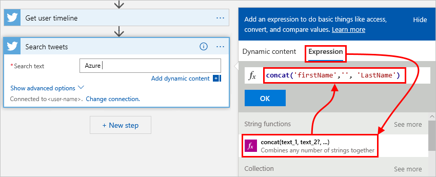

---
# required metadata
title: Schema reference for Workflow Definition Language - Azure Logic Apps | Microsoft Docs
description: Write custom workflow definitions for Azure Logic Apps with the Workflow Definition Language
services: logic-apps
ms.service: logic-apps
author: ecfan
ms.author: estfan
manager: jeconnoc
ms.topic: reference
ms.date: 04/30/2018

# optional metadata
ms.reviewer: klam, LADocs
ms.suite: integration
---

# Schema reference for Workflow Definition Language in Azure Logic Apps

When you create a logic app workflow with 
[Azure Logic Apps](../logic-apps/logic-apps-overview.md), 
your workflow's underlying definition describes the actual 
logic that runs for your logic app. This description 
follows a structure that's defined and validated 
by the Workflow Definition Language schema, which uses 
[JavaScript Object Notation (JSON)](https://www.json.org/). 
  
## Workflow definition structure

A workflow definition has at least one trigger that instantiates your logic app, 
plus one or more actions that your logic app runs. 

Here is the high-level structure for a workflow definition:  
  
```json
"definition": {
  "$schema": "<workflow-definition-language-schema-version>",
  "contentVersion": "<workflow-definition-version-number>",
  "parameters": { "<workflow-parameter-definitions>" },
  "triggers": { "<workflow-trigger-definitions>" },
  "actions": { "<workflow-action-definitions>" },
  "outputs": { "<workflow-output-definitions>" }
}
```
  
| Element | Required | Description | 
|---------|----------|-------------| 
| definition | Yes | The starting element for your workflow definition | 
| $schema | Only when externally referencing a workflow definition | The location for the JSON schema file that describes the Workflow Definition Language version, which you can find here: <p>`https://schema.management.azure.com/schemas/2016-06-01/Microsoft.Logic.json`</p> |   
| contentVersion | No | The version number for your workflow definition, which is "1.0.0.0" by default. To help identify and confirm the correct definition when deploying a workflow, specify a value to use. | 
| parameters | No | The definitions for one or more parameters that pass data into your workflow <p><p>Maximum parameters: 50 | 
| triggers | No | The definitions for one or more triggers that instantiate your workflow. You can define more than one trigger, but only with the Workflow Definition Language, not visually through the Logic Apps Designer. <p><p>Maximum triggers: 10 | 
| actions | No | The definitions for one or more actions to execute at workflow runtime <p><p>Maximum actions: 250 | 
| outputs | No | The definitions for the outputs that return from a workflow run <p><p>Maximum outputs: 10 |  
|||| 

## Parameters

In the `parameters` section, define all the workflow parameters 
that your logic app uses at deployment for accepting inputs. 
Both parameter declarations and parameter values are required at deployment. 
Before you can use these parameters in other workflow sections, 
make sure that you declare all the parameters in these sections. 

Here is the general structure for a parameter definition:  

```json
"parameters": {
  "<parameter-name>": {
    "type": "<parameter-type>",
    "defaultValue": "<default-parameter-value>",
    "allowedValues": [ <array-with-permitted-parameter-values> ],
    "metadata": { 
      "key": { 
        "name": "<key-value>"
      } 
    }
  }
},
```

| Element | Required | Type | Description |  
|---------|----------|------|-------------|  
| type | Yes | int, float, string, securestring, bool, array, JSON object, secureobject <p><p>**Note**: For all passwords, keys, and secrets, use the `securestring` and `secureobject` types because the `GET` operation doesn't return these types. | The type for the parameter |
| defaultValue | No | Same as `type` | The default parameter value when no value is specified when the workflow instantiates | 
| allowedValues | No | Same as `type` | An array with values that the parameter can accept |  
| metadata | No | JSON object | Any other parameter details, for example, the name or a readable description for your logic app, or design-time data used by Visual Studio or other tools |  
||||

## Triggers and actions  

In a workflow definition, the `triggers` and `actions` sections 
define the calls that happen during your workflow's execution. 
For syntax and more information about these sections, see 
[Workflow triggers and actions](../logic-apps/logic-apps-workflow-actions-triggers.md).
  
## Outputs 

In the `outputs` section, define the data that 
your workflow can return when finished running. 
For example, to track a specific status or value from each run, 
specify that the workflow output returns that data. 

> [!NOTE]
> When responding to incoming requests from a service's REST API, 
> do not use `outputs`. Instead, use the `Response` action type. 
> For more information, see [Workflow triggers and actions](../logic-apps/logic-apps-workflow-actions-triggers.md).

Here is the general structure for an output definition: 

```json
"outputs": {
  "<key-name>": {  
    "type": "<key-type>",  
    "value": "<key-value>"  
  }
} 
```

| Element | Required | Type | Description | 
|---------|----------|------|-------------| 
| <*key-name*> | Yes | String | The key name for the output return value |  
| type | Yes | int, float, string, securestring, bool, array, JSON object | The type for the output return value | 
| value | Yes | Same as `type` | The output return value |  
||||| 

To get the output from a workflow run, 
review the logic app's run history and 
details in the Azure portal or use the 
[Workflow REST API](https://docs.microsoft.com/rest/api/logic/workflows). 
You can also pass output to external systems, for example, 
Power BI so that you can create dashboards. 

<a name="expressions"></a>

## Expressions

With JSON, you can have literal values that exist at design time, for example:

```json
"customerName": "Sophia Owen", 
"rainbowColors": ["red", "orange", "yellow", "green", "blue", "indigo", "violet"], 
"rainbowColorsCount": 7 
```

You can also have values that don't exist until run time. 
To represent these values, you can use *expressions*, 
which are evaluated at run time. An expression is a sequence 
that can contain one or more [functions](#functions), 
[operators](#operators), variables, explicit values, 
or constants. In your workflow definition, 
you can use an expression anywhere in a JSON 
string value by prefixing the expression with the at-sign (\@). 
When evaluating an expression that represents a JSON value, 
the expression body is extracted by removing the \@ character, 
and always results in another JSON value. 

For example, for the previously defined `customerName` property, 
you can get the property value by using the 
[parameters()](../logic-apps/workflow-definition-language-functions-reference.md#parameters) 
function in an expression and assign that value to the `accountName` property:

```json
"customerName": "Sophia Owen", 
"accountName": "@parameters('customerName')"
```

*String interpolation* also lets you use multiple expressions inside 
strings that are wrapped by the \@ character and curly braces ({}). 
Here is the syntax:

```json
@{ "<expression1>", "<expression2>" }
```

The result is always a string, making this capability 
similar to the `concat()` function, for example: 

```json
"customerName": "First name: @{parameters('firstName')} Last name: @{parameters('lastName')}"
```

If you have a literal string that starts with the \@ character, 
prefix the \@ character with another \@ character as an escape character: \@\@

These examples show how expressions are evaluated:

| JSON value | Result |
|------------|--------| 
| "Sophia Owen" | Return these characters: 'Sophia Owen' |
| "array[1]" | Return these characters: 'array[1]' |
| "\@\@" | Return these characters as a one-character string: '\@' |   
| " \@" | Return these characters as a two-character string: ' \@' |
|||

For these examples, suppose you define "myBirthMonth" 
equal to "January" and "myAge" equal to the number 42:  
  
```json
"myBirthMonth": "January",
"myAge": 42
```

These examples show how the following expressions are evaluated:

| JSON expression | Result |
|-----------------|--------| 
| "\@parameters('myBirthMonth')" | Return this string: "January" |  
| "\@{parameters('myBirthMonth')}" | Return this string: "January" |  
| "\@parameters('myAge')" | Return this number: 42 |  
| "\@{parameters('myAge')}" | Return this number as a string: "42" |  
| "My age is \@{parameters('myAge')}" | Return this string: "My age is 42" |  
| "\@concat('My age is ', string(parameters('myAge')))" | Return this string: "My age is 42" |  
| "My age is \@\@{parameters('myAge')}" | Return this string, which includes the expression: "My age is \@{parameters('myAge')}` | 
||| 

When you're working visually in the Logic Apps Designer, 
you can create expressions through the Expression builder, 
for example: 



When you're done, the expression appears for the 
corresponding property in your workflow definition, 
for example, the `searchQuery` property here:

```json
"Search_tweets": {
  "inputs": {
    "host": {
      "connection": {
       "name": "@parameters('$connections')['twitter']['connectionId']"
      }
    }
  },
  "method": "get",
  "path": "/searchtweets",
  "queries": {
    "maxResults": 20,
    "searchQuery": "Azure @{concat('firstName','', 'LastName')}"
  }
},
```

<a name="operators"></a>

## Operators

In [expressions](#expressions) and [functions](#functions), 
operators perform specific tasks, such as reference a 
property or a value in an array. 

| Operator | Task | 
|----------|------|
| ' | To use a string literal as input or in expressions and functions, wrap the string only with single quotation marks, for example, `'<myString>'`. Do not use double quotation marks (""), which conflict with the JSON formatting around an entire expression. For example: <p>**Yes**: length('Hello') </br>**No**: length("Hello") <p>When you pass arrays or numbers, you don't need wrapping punctuation. For example: <p>**Yes**: length([1, 2, 3]) </br>**No**: length("[1, 2, 3]") | 
| [] | To reference a value at a specific position (index) in an array, use square brackets. For example, to get the second item in an array: <p>`myArray[1]` | 
| . | To reference a property in an object, use the dot operator. For example, to get the `name` property for a `customer` JSON object: <p>`"@parameters('customer').name"` | 
| ? | To reference null properties in an object without a runtime error, use the question mark operator. For example, to handle null outputs from a trigger, you can use this expression: <p>`@coalesce(trigger().outputs?.body?.<someProperty>, '<property-default-value>')` | 
||| 

<a name="functions"></a>

## Functions

Some expressions get their values from runtime actions 
that might not yet exist when a logic app starts to run. 
To reference or work with these values in expressions, 
you can use [*functions*](../logic-apps/workflow-definition-language-functions-reference.md) 
that the Workflow Definition Language provides. 

## Next steps

* Learn about [Workflow Definition Language actions and triggers](../logic-apps/logic-apps-workflow-actions-triggers.md)
* Learn about programmatically creating and managing logic apps with the [Workflow REST API](https://docs.microsoft.com/rest/api/logic/workflows)
