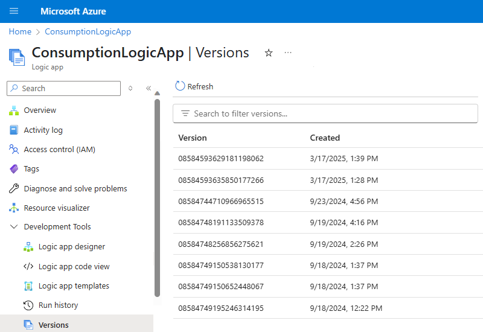
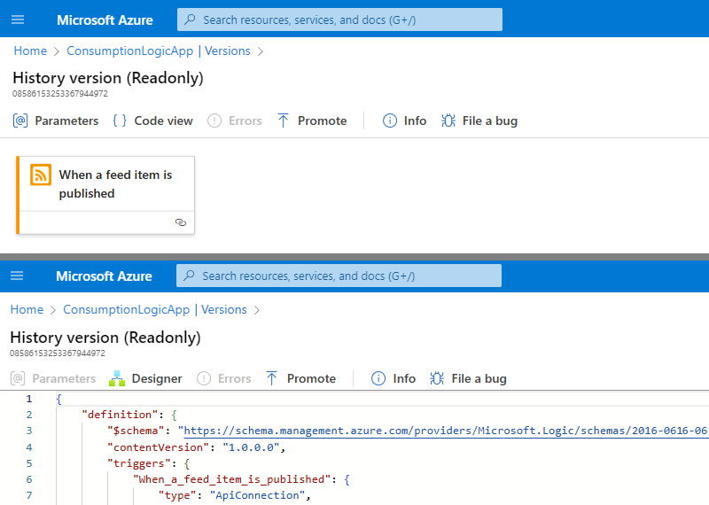
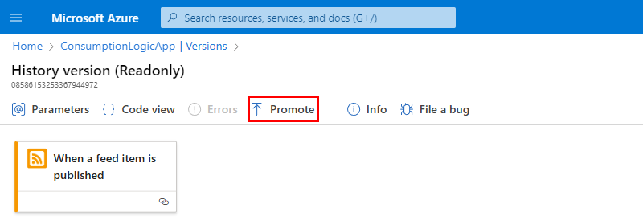
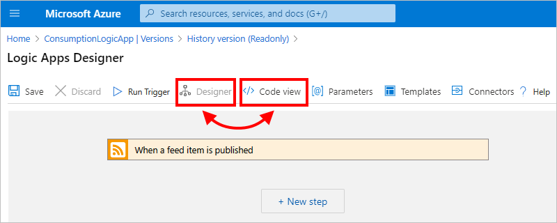

# Manage logic app workflows in the Azure portal

[!INCLUDE [logic-apps-sku-consumption](../../includes/logic-apps-sku-consumption.md)]

This guide shows how to manage Consumption logic app workflows through the Azure portal and perform tasks such as edit, disable, enable, and delete workflows. You can also [manage Consumption logic apps in Visual Studio](manage-logic-apps-with-visual-studio.md).

To manage Standard logic app workflows, see [Create a Standard workflow with single-tenant Azure Logic Apps in the Azure portal](create-single-tenant-workflows-azure-portal.md).

## Prerequisites

* An Azure account and subscription. If you don't have an Azure subscription, [sign up for a free Azure account](https://azure.microsoft.com/free/?WT.mc_id=A261C142F).

* An existing Consumption logic app workflow. To learn how to create a logic app in the Azure portal, see [Quickstart: Create an example Consumption logic app workflow in multi-tenant Azure Logic Apps - Azure portal](quickstart-create-example-consumption-workflow.md).

## Find and open a logic app

1. Sign in to the [Azure portal](https://portal.azure.com) with your Azure account.

1. In the portal search box, enter **logic apps**, and select **Logic apps**.

1. From the logic apps list, find your logic app by either browsing or filtering the list.

1. To open your logic app, select the app that you want to manage.

## View logic app properties

1. In the Azure portal, [find and open your logic app](#find-logic-app).

1. From your logic app's menu, under **Settings**, select **Properties**.

1. On the **Properties** pane, you can view and copy the following information about your logic app:

   * **Name**
   * **Resource ID**
   * **Resource group**
   * **Location**
   * **Type** 
   * **Subscription Name**
   * **Subscription ID**
   * **Access Endpoint**
   * **Runtime outgoing IP addresses**
   * **Access endpoint IP addresses**
   * **Connector outgoing IP addresses**

## View connections

When you create connections within a workflow using [managed connectors](../connectors/managed.md), these connections are actually separate Azure resources with their own resource definitions. To view and manage these connections, follow these steps:

1. In the Azure portal, [find and open your logic app](#find-logic-app).

1. From your logic app's menu, under **Development tools**, select **API Connections**.

1. On the **API Connections** pane, select a specific connection instance, which shows more information about that connection. To view the underlying connection resource definition, select **JSON View**.

## Disable or enable logic apps

To stop the trigger from firing the next time when the trigger condition is met, disable your logic app. In the Azure portal, you can enable or disable a [single logic app](#disable-enable-single-logic-app) or [multiple logic apps at the same time](#disable-or-enable-multiple-logic-apps). Disabling a logic app affects workflow instances in the following ways:

* Azure Logic Apps continues all in-progress and pending runs until they finish. Based on the volume or backlog, this process might take time to complete.

* Azure Logic Apps doesn't create or run new workflow instances.

* The trigger won't fire the next time that its conditions are met. However, the trigger state remembers the point at which the logic app was stopped. So, if you reactivate the logic app, the trigger fires for all the unprocessed items since the last run.

  To stop the trigger from triggering on unprocessed items since the last run, clear the trigger's state before you reactivate the logic app:

  1. In the logic app, edit any part of the workflow's trigger.
  1. Save your changes. This step resets your trigger's current state.
  1. [Reactivate your logic app](#disable-enable-single-logic-app).

* When a workflow is disabled, you can still resubmit runs.

### Disable or enable a single logic app

1. In the Azure portal, [find and open your logic app](#find-logic-app).

1. In your logic app's menu, select **Overview**.

   * To disable your logic app, on the Overview pane toolbar, select **Disable**.
   * To enable your logic app, on the Overview pane toolbar, select **Enable**.

     > [!NOTE]
     > If your logic app is already disabled, you only see the **Enable** option.
     > If your logic app is already enabled, you only see the **Disable** option.

1. To confirm whether your operation succeeded or failed, on the main Azure toolbar, open the **Notifications** list (bell icon).

### Disable or enable multiple logic apps

1. In the Azure portal's main search box, enter `logic apps`, and select **Logic apps**.

1. On the **Logic apps** page, review the logic app's **Status** column.

1. In the checkbox column, select the logic apps you want to stop or start.

   * To stop the selected running logic apps, on the Overview pane toolbar, select **Disable/Stop**. Confirm your selection.
   * To start the selected stopped logic apps, on the Overview pane toolbar, select **Enable/Start**.

1. To confirm whether your operation succeeded or failed, on main Azure toolbar, open the **Notifications** list (bell icon).

   > [!TIP]
   > If the correct status doesn't appear, refresh the page.

## Delete logic apps

You can delete a single logic app or multiple logic apps at the same time. Deleting a logic app affects workflow instances in the following ways:

* Azure Logic Apps makes a best effort to cancel any in-progress and pending runs.

  Even with a large volume or backlog, most runs are canceled before they finish or start. However, the cancellation process might take time to complete. Meanwhile, some runs might get picked up for execution while the service works through the cancellation process.

* Azure Logic Apps doesn't create or run new workflow instances.

* If you delete a workflow and then recreate the same workflow, the recreated workflow won't have the same metadata as the deleted workflow. You have to resave any workflow that called the deleted workflow. That way, the caller gets the correct information for the recreated workflow. Otherwise, calls to the recreated workflow fail with an `Unauthorized` error. This behavior also applies to workflows that use artifacts in integration accounts and workflows that call Azure functions.

1. In the Azure portal's main search box, enter `logic apps`, and select **Logic apps**.

1. From the **Logic apps** list, in the checkbox column, select a single or multiple logic apps to delete. On the toolbar, select **Delete**.

1. When the confirmation box appears, enter `yes`, and select **Delete**.

1. To confirm whether your operation succeeded or failed, on main Azure toolbar, open the **Notifications** list (bell icon).

## Manage logic app versions

You can use the Azure portal for version control of your logic apps. You can find your logic app's version history, and promote previous versions.

### Find and view previous versions

1. In the Azure portal, [find and open your logic app](#find-logic-app).

1. In your logic app's menu, under **Development Tools**, select **Versions**.

   

1. Select the **Version** of your logic app to manage from the list. You can enter the **Version** identifier in the search bar to filter the list.

1. On the **History version** page, you'll see the previous version's details in read-only mode. You can select between the Logic Apps **Designer** and **Code view** modes.

   

### Promote previous versions

1. In your logic app's version history, [find and select the version that you want to promote](#find-version-history).

1. On the **History version** page, select **Promote**.

   

1. On the **Logic Apps Designer** page that opens, edit the version that you're promoting as needed. You can switch between **Designer** and **Code view** modes. You can also update **Parameters**, **Templates**, and **Connectors**.

   

1. To save any updates and finishing promoting the previous version, select **Save**. (Or, to cancel your changes, select **Discard**.) 

   When you [view your logic app's version history](#find-version-history) again, the promoted version appears at the top of the list and has a new identifier.

## Next steps

* [Monitor logic apps](monitor-logic-apps.md)
