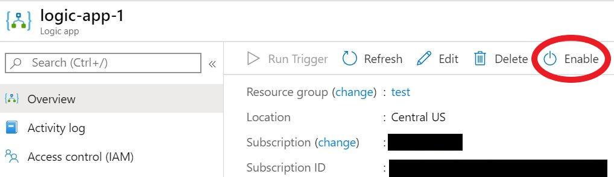
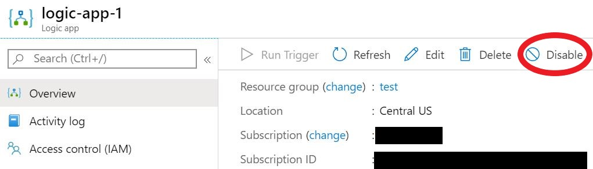
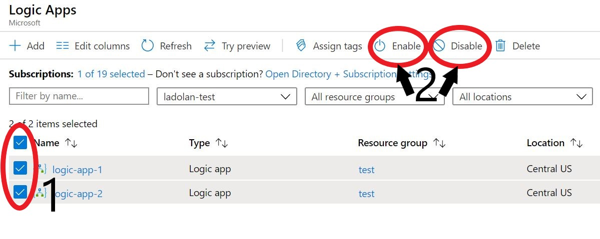
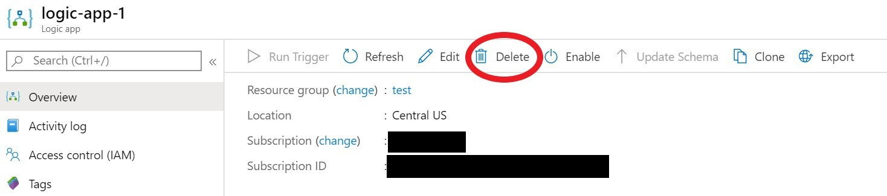
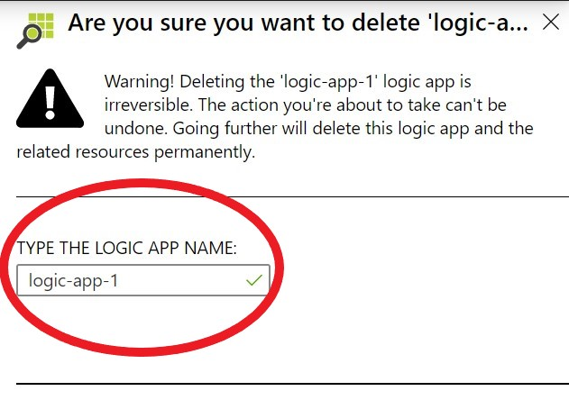
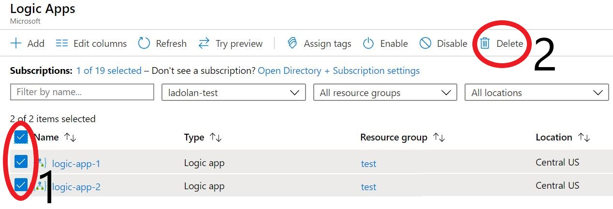

# Manage logic apps in the Azure portal

You can use the [Microsoft Azure portal](https://portal.azure.com) to create, edit, manage, and deploy logic apps. You can also [manage logic apps in Visual Studio](manage-logic-apps-with-visual-studio.md).

For guidance on creating logic apps in the Azure portal, see:

* [Quickstart: Create your first workflow by using Azure Logic Apps - Azure portal](quickstart-create-first-logic-app-workflow.md)
* [Create logic app workflows from prebuilt templates](logic-apps-create-logic-apps-from-templates.md)

## Prerequisites

* An Azure subscription. If you don't have an Azure subscription, [sign up for a free Azure account](https://azure.microsoft.com/free/).

## Find your logic apps

To find and open your logic app: 

1. Sign in to the [Azure portal](https://portal.azure.com) with your Azure subscription credentials.
2. In the search bar, enter and select **Logic Apps**.
3. On the **Logic Apps** page, find and select the logic app that you want to manage. The logic app's **Overview** pane will open.

You can refine the list of items shown on the **Logic Apps** page. Use the search boxes and drop-down menus to:

* Search for logic apps by name
* Filter logic apps by subscription, resource group, location, and tags
* Group logic apps by resource group, type, subscription, and location

## Find logic app properties

To view the properties for your logic app: 

1. [Find and open your logic app](#find-your-logic-apps) in the Azure portal.
2. In your logic app's menu, under **Settings**,  choose **Properties**.
3. In the **Properties** pane, you can view and copy the following information about your logic app:

    * **Name**
    * **Resource ID**
    * **Resource group**
    * **Location**
    * **Type** 
    * **Subscription Name**
    * **Subscription ID**
    * **Access Endpoint**
    * **Runtime outgoing IP addresses**
    * **Access endpoint IP addresses**
    * **Connector outgoing IP addresses**

## Disable or enable logic apps

You can enable or disable [a single logic app](#disable-or-enable-single-logic-app), or [multiple logic apps at the same time](#disable-or-enable-multiple-logic-apps).

After you disable a logic app, no new runs are instantiated. All in-progress and pending runs will continue until they complete (this process may take some time, depending on the number of runs).

You can also [enable or disable a logic app in Visual Studio](manage-logic-apps-with-visual-studio.md#disable-or-enable-logic-app).

### Trigger states for logic apps

A trigger for a disabled logic app won't fire the next time its conditions are met. The Logic Apps engine also won't create or run future workflow instances.

A logic app trigger's state remembers the point at which it was stopped. A trigger for a re-enabled logic app fires for all unprocessed items since its last run.

To prevent a logic app triggering for items while it was disabled, clear the trigger's state before you re-enable the logic app:

1. [Find and open your logic app](#find-your-logic-apps) in the Azure portal.
2. Edit any part of the logic app's trigger.
3. Save your changes. This step resets your trigger's current state.
4. [Re-enable your logic app](#disable-or-enable-single-logic-app).

### Disable or enable single logic app

To enable or disable a *single logic app* in the Azure portal:

1. [Find and open your logic app](#find-your-logic-apps) in the Azure portal.
2. In your logic app's menu, choose **Enable** or **Disable** (as seen in the following images). If your logic app is already enabled, you'll only see the **Disable** option. If your logic app is already disabled, you'll only see the **Enable** option.

    

    

3. You'll receive a notification to confirm that your command **Succeeded**, **Failed**, or was **Canceled** for the selected logic app.

### Disable or enable multiple logic apps

To enable or disable *multiple logic apps* at once in the Azure portal:

1. [Find the logic apps that you want to manage](#find-your-logic-apps) in the Azure portal. You can check if a logic app is currently enabled or disabled in the **Status** column of the **Logic Apps** page.
2. Select the checkboxes next to the logic apps that you want to enable or disable (step 1 in the following image).
3. In the menu, choose **Enable** or **Disable** (step 2 in the following image).

    

4. You'll receive a prompt asking whether you want to enable or disable all the selected resources. Choose **Yes** to confirm your changes, or choose **No** to abandon your changes. 
5. You'll receive a notification to confirm that your command **Succeeded**, **Failed**, or was **Canceled** for the selected items.

## Delete logic apps

You can [delete a single logic app](#delete-single-logic-app) or [delete multiple logic apps](#delete-multiple-logic-apps) in the Azure portal. 

> [!IMPORTANT]
> After you delete a logic app (or logic apps), no new runs are instantiated. All in-progress and pending runs will continue until they finish. This process might take some time to complete, depending on the number of runs.

### Delete single logic app

To delete a single logic app in the Azure portal:

1. [Find and open your logic app](#find-your-logic-apps) in the Azure portal.
2. In your logic app's menu, choose **Delete**.

    

3. You'll receive a prompt asking you to confirm that you want to delete your logic app. Enter the name of your logic app in the field **TYPE THE LOGIC APP NAME**. Then, choose **Delete** to delete your logic app, or choose **Cancel** to abandon your changes.

    

3. You'll receive a notification to confirm that your command **Succeeded**, **Failed**, or was **Canceled** for the selected logic app.

### Delete multiple logic apps

To delete multiple logic apps at once in the Azure portal:

1. [Find the logic apps that you want to manage](#find-your-logic-apps) in the Azure portal.
2. Select the checkboxes next to the logic apps that you want to delete (step 1 in the following image).
3. In the menu, choose **Delete** (step 2 in the following image).

    

4. You'll receive a prompt asking whether you want to delete all the selected resources. Choose **Yes** to confirm your changes, or choose **No** to abandon your changes. 
5. You'll receive a notification to confirm that your command **Succeeded**, **Failed**, or was **Canceled** for the selected items.
