# Manage logic apps in the Azure portal

You can manage logic apps using the [Azure portal](https://portal.azure.com) or [Visual Studio](manage-logic-apps-with-visual-studio.md). This article shows how to edit, disable, enable, or delete logic apps in the Azure portal. If you're new to Azure Logic Apps, see [What is Azure Logic Apps](logic-apps-overview.md)?

## Prerequisites

* An Azure subscription. If you don't have an Azure subscription, [sign up for a free Azure account](https://azure.microsoft.com/free/).

* An existing logic app. To learn how to create a logic app in the Azure portal, see [Quickstart: Create your first workflow by using Azure Logic Apps - Azure portal](quickstart-create-first-logic-app-workflow.md).

## Find your logic apps

To find and open your logic app, follow these steps:

1. Sign in to the [Azure portal](https://portal.azure.com) with your Azure account.

1. In the Azure search bar, enter `logic apps`, and select **Logic Apps**.

   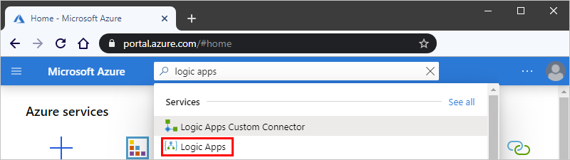

1. On the **Logic Apps** page, find and select the logic app that you want to manage.

   After the logic app's **Overview** pane opens, you can filter the list that appears on the **Logic Apps** page in these ways:

   * Search for logic apps by name
   * Filter logic apps by subscription, resource group, location, and tags
   * Group logic apps by resource group, type, subscription, and location

## View logic app properties

1. In the Azure portal, [find and open your logic app](#find-logic-app).

1. From your logic app's menu, under **Settings**, select **Properties**.

1. On the **Properties** pane, you can view and copy the following information about your logic app:

   * **Name**
   * **Resource ID**
   * **Resource group**
   * **Location**
   * **Type** 
   * **Subscription Name**
   * **Subscription ID**
   * **Access Endpoint**
   * **Runtime outgoing IP addresses**
   * **Access endpoint IP addresses**
   * **Connector outgoing IP addresses**

## Disable or enable logic apps

You can enable or disable a [single logic app](#disable-enable-single-logic-app) or [multiple logic apps at the same time](#disable-or-enable-multiple-logic-apps) in the Azure portal. You can also [enable or disable logic apps in Visual Studio](manage-logic-apps-with-visual-studio.md#disable-or-enable-logic-app).

Disabling your logic app affects your workflow instances and runs in these ways:

* All in-progress and pending runs continue until they finish. Depending on the number of these runs, this process might take some time.

* The Logic Apps engine won't create or run new workflow instances.

* The trigger won't fire the next time that its conditions are met.

* The trigger state remembers the point at which the logic app was stopped. So, if you re-enable the logic app, the trigger fires for all the unprocessed items since the last run.

  To stop your logic app from firing on unprocessed items since the last run, clear the trigger's state before you re-enable the logic app:

  1. In the Azure portal, [find and open your logic app](#find-logic-app).

  1. Edit any part of the logic app's trigger.

  1. Save your changes. This step resets your trigger's current state.

  1. [Re-enable your logic app](#disable-enable-single-logic-app).

### Disable or enable single logic app

1. In the Azure portal, [find and open your logic app](#find-logic-app).

1. In your logic app's menu, select **Overview**. Choose from these options:

   * On the toolbar, select **Disable**.

     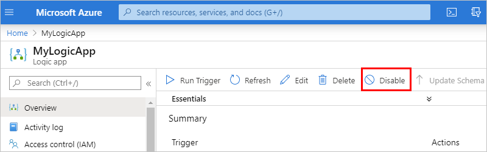

     If your logic app is already disabled, you only see the **Enable** option.

   * On the toolbar, select **Enable**.

     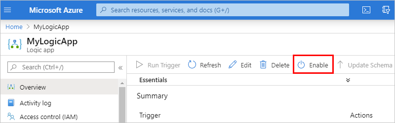

     If your logic app is already enabled, you only see the **Disable** option. 

   The Azure portal shows a notification on the main Azure toolbar that confirms whether your operation succeeded or failed.

   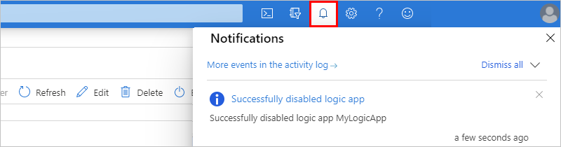

### Disable or enable multiple logic apps

1. In the Azure portal, [find the logic apps](#find-logic-app) that you want disable or enable.

1. To check whether a logic app is currently enabled or disabled, on the **Logic Apps** page, review the **Status** column for that logic app. 

   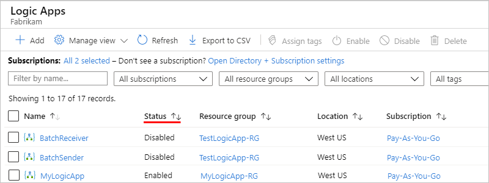

   If the **Status** column isn't visible, on the **Logic Apps** toolbar, select **Try preview**.

   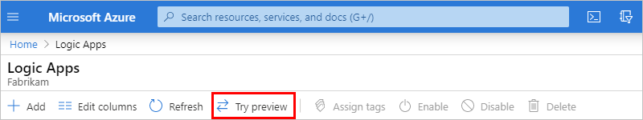

1. In the checkbox column, select the logic apps that you want to disable or enable. On the toolbar, select **Disable** or **Enable**.

   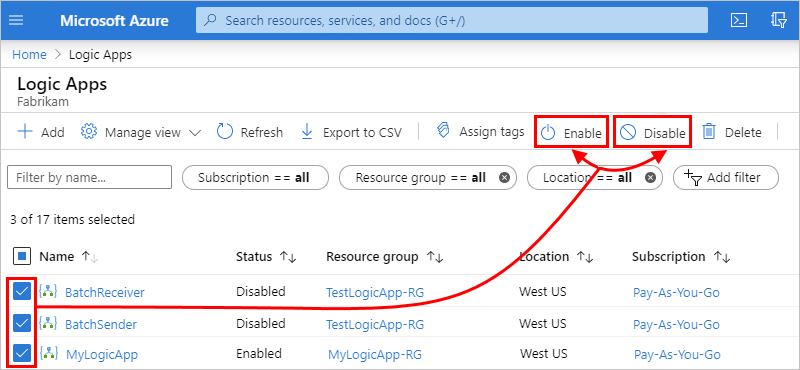

1. When the confirmation box appears, select **Yes** to continue.

   The Azure portal shows a notification on the main Azure toolbar that confirms whether your operation succeeded or failed.

## Delete logic apps

You can [delete a single logic app](#delete-single-logic-app) or [delete multiple logic apps at the same time](#delete-multiple-logic-apps) in the Azure portal. You can also [delete your logic app in Visual Studio](manage-logic-apps-with-visual-studio.md#delete-your-logic-app).

Deleting your logic app affects your workflow instances in these ways:

* All in-progress and pending runs continue until they finish. Depending on the number of these runs, this process might take some time.

* The Logic Apps engine won't create or run new workflow instances.

> [!NOTE]
> If you delete and recreate a child logic app, you must resave the parent logic app. The recreated child app will have different metadata.
> If you don't resave the parent logic app after recreating its child, your calls to the child logic app will fail with an error of "unauthorized." This behavior applies to parent-child logic apps, for example, those that use artifacts in integration accounts or call Azure functions.

### Delete single logic app

1. In the Azure portal, [find and open your logic app](#find-logic-app).

1. In your logic app's menu, select **Overview**. On your logic app's toolbar, select **Delete**.

   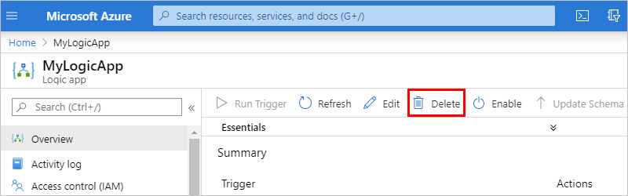

1. When the confirmation box appears, enter your logic app's name, and select **Delete**.

   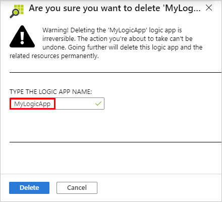

   The Azure portal shows a notification on the main Azure toolbar that confirms whether your operation succeeded or failed.

### Delete multiple logic apps

1. In the Azure portal, [find the logic apps that you want to delete](#find-logic-app).

1. In the checkbox column, select the logic apps that you want to delete. On the toolbar, select **Delete**.

   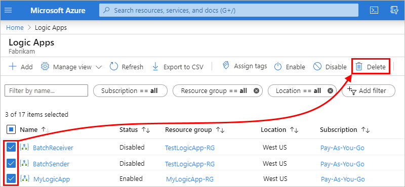

1. When the confirmation box appears, enter `yes`, and select **Delete**.

   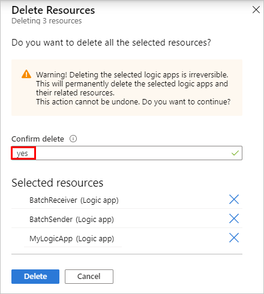

   The Azure portal shows a notification on the main Azure toolbar that confirms whether your operation succeeded or failed.

## Manage logic app versions

You can use the Azure portal for version control of your logic apps. You can find your logic app's version history, and promote previous versions.

### Find and view previous versions

1. In the Azure portal, [find the logic app that you want to manage](#find-logic-app).

1. In your logic app's menu, under **Development Tools**, select **Versions**.

   

1. Select the **Version** of your logic app to manage from the list. You can enter the **Version** identifier in the search bar to filter the list.

1. On the **History version** page, you'll see the previous version's details in read-only mode. You can select between the Logic Apps **Designer** and **Code view** modes.

   

### Promote previous versions

1. In your logic app's version history, [find and select the version that you want to promote](#find-version-history).

1. On the **History version** page, select **Promote**.

   

1. On the **Logic Apps Designer** page that opens, edit the version that you're promoting as needed. You can switch between **Designer** and **Code view** modes. You can also update **Parameters**, **Templates**, and **Connectors**.

   

1. To save any updates and finishing promoting the previous version, select **Save**. (Or, to cancel your changes, select **Discard**.) 

   When you [view your logic app's version history](#find-version-history) again, the promoted version appears at the top of the list and has a new identifier.

## Next steps

* [Monitor logic apps](monitor-logic-apps.md)
