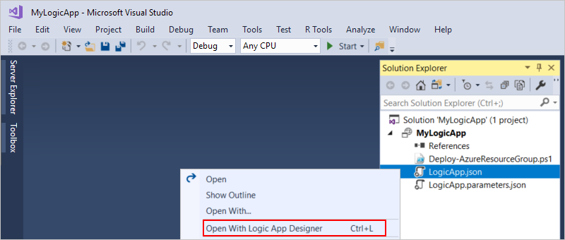
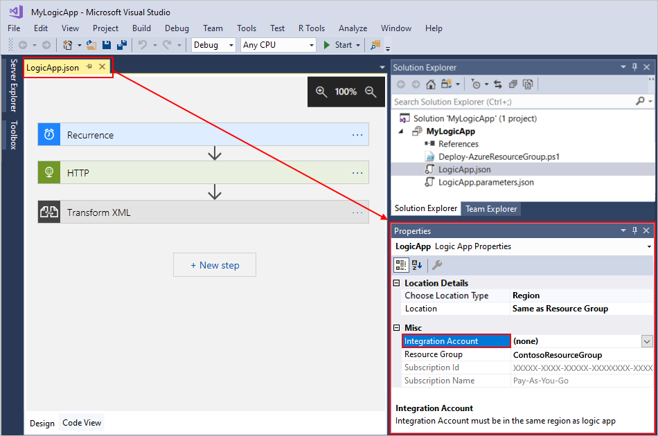
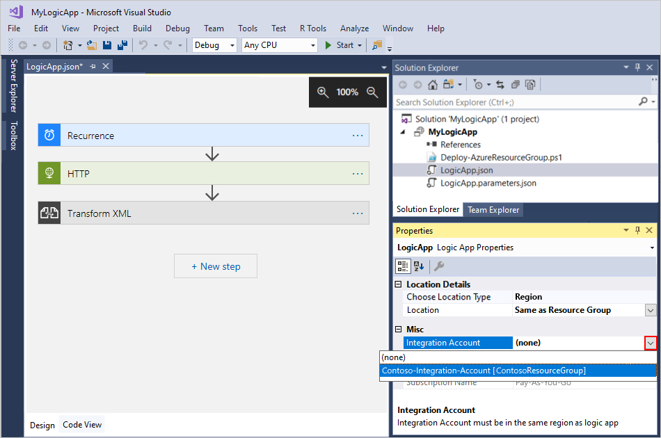
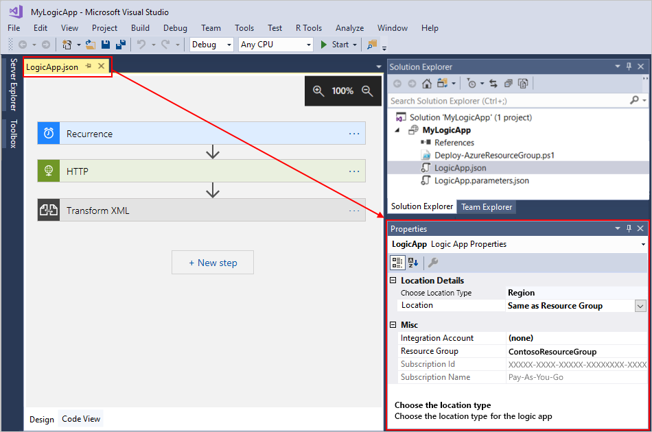
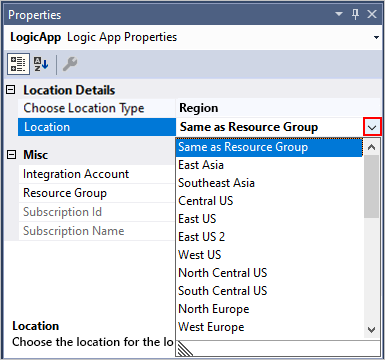
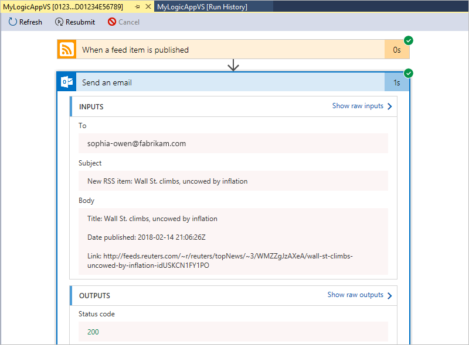
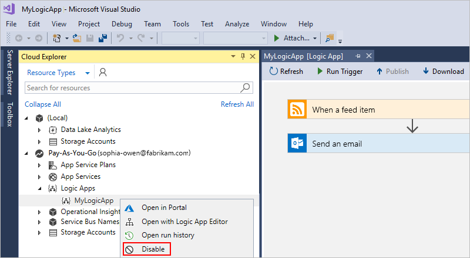
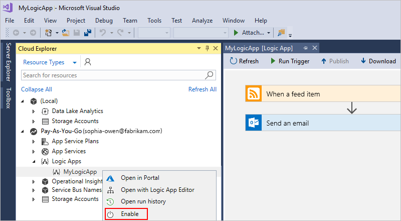

# Manage logic apps with Visual Studio (Deprecated)

[!INCLUDE [logic-apps-sku-consumption](~/reusable-content/ce-skilling/azure/includes/logic-apps-sku-consumption.md)]

[!INCLUDE [visual-studio-extension-deprecation](includes/visual-studio-extension-deprecation.md)]

You can create, edit, manage, and deploy automated workflows that integrate services, systems, apps, and data across enterprises and organizations by using [Azure Logic Apps](logic-apps-overview.md). Although you can perform these tasks in the Azure portal, you can also use a local development environment to create logic app projects that you can add to source control, publish different versions, and create Azure Resource Manager templates for different deployment environments.

## Prerequisites

* An Azure subscription. If you don't have an Azure subscription, [sign up for a free Azure account](https://azure.microsoft.com/free/?WT.mc_id=A261C142F).

* Download and install these tools, if you don't have them already:

  * [Visual Studio 2019 - Community edition or greater](https://aka.ms/download-visual-studio). The Azure Logic Apps extension is currently unavailable for Visual Studio 2022. This guide uses Visual Studio Community 2017, which is free.

    > [!IMPORTANT]
    >
    > When you install Visual Studio 2019, make sure that you select the **Azure development** workload.
    > For more information, see [Manage resources associated with your Azure accounts in Visual Studio Cloud Explorer](/visualstudio/azure/vs-azure-tools-resources-managing-with-cloud-explorer).

  * [Azure SDK (2.9.1 or later)](https://azure.microsoft.com/downloads/)

  * [Azure PowerShell](https://github.com/Azure/azure-powershell#installation)

  * The latest Azure Logic Apps Tools for the Visual Studio extension for [Visual Studio 2019](https://aka.ms/download-azure-logic-apps-tools-visual-studio-2019)

    You can either download and install Azure Logic Apps Tools directly from the Visual Studio Marketplace, or learn [how to install this extension from inside Visual Studio](/visualstudio/ide/finding-and-using-visual-studio-extensions). Make sure that you restart Visual Studio after you finish installing.

  * To use Azure Government subscriptions with Visual Studio, see [Quickstart: Connect to Azure Government with Visual Studio](../azure-government/documentation-government-connect-vs.md) for additional setup.

* Access to the web while using the embedded workflow designer for Azure Logic Apps

  The designer requires an internet connection to create resources in Azure and to read the properties and data from connectors in your logic app.

## Find logic apps

In Visual Studio, you can find all the logic apps that are associated with your Azure subscription and are deployed in the Azure portal by using Cloud Explorer.

1. Open Visual Studio. On the **View** menu, select **Cloud Explorer**.

1. In Cloud Explorer, select the **Account Management** icon. Select the Azure subscription associated with your logic apps, and select **Apply**. For example:

   

1. Next to the **Account Management** icon, select **Resource Types**. Under your Azure subscription, expand **Logic Apps** so that you can view all the deployed logic apps that are associated with your subscription.

Next, open your logic app in the Logic App Editor.

## Open logic apps in Visual Studio

In Visual Studio, you can open logic apps previously created and deployed either directly through the Azure portal or as Azure Resource Group projects with Visual Studio.

1. [Open Cloud Explorer and find your logic app](#find-logic-apps-vs).

1. From the logic app's shortcut menu, select **Open with Logic App Editor**.

   > [!TIP]
   >
   > If you don't have this command in Visual Studio 2019, check that you have the latest updates for Visual Studio.

   

   After the logic app opens in Logic Apps Designer, at the bottom of the designer, you can select **Code View** so that you can review the underlying logic app definition structure. If you want to create a deployment template for the logic app, learn [how to download an Azure Resource Manager template](#download-logic-app) for that logic app. Learn more about [Resource Manager templates](../azure-resource-manager/templates/overview.md).

## Download from Azure

You can [download](../azure-resource-manager/templates/export-template-portal.md#export-template-from-a-resource) logic apps from the [Azure portal](https://portal.azure.com) and save them as [Azure Resource Manager](../azure-resource-manager/management/overview.md) templates. You can then locally edit the templates with Visual Studio and customize logic apps for different deployment environments.  Downloading logic apps automatically *parameterizes* their definitions inside [Resource Manager templates](../azure-resource-manager/templates/overview.md), which also use JavaScript Object Notation (JSON).

1. In Visual Studio, using Cloud Explorer, [open the logic app that you want to download from Azure](#open-designer).

1. From the logic app's shortcut menu, select **Open with Logic App Editor**.

   > [!TIP]
   >
   > If you don't have this command in Visual Studio 2019, check that you have the latest updates for Visual Studio.

   The logic app opens in the workflow designer.

1. On the designer toolbar, select **Download**.

   

1. When you're prompted for a location, browse to that location and save the Resource Manager template for the logic app definition in JSON (.json) file format.

   Your logic app definition appears in the **`resources`** subsection inside the Resource Manager template. You can now edit the logic app definition and Resource Manager template with Visual Studio. You can also add the template as an [Azure Resource Group project](../azure-resource-manager/templates/create-visual-studio-deployment-project.md) to a Visual Studio solution. Learn about [Azure Resource Group projects for logic apps in Visual Studio](../logic-apps/quickstart-create-logic-apps-with-visual-studio.md).

## Link to integration account

To build logic apps for business-to-business (B2B) enterprise integration scenarios, you can link your logic app to a previously created [integration account](../logic-apps/logic-apps-enterprise-integration-create-integration-account.md) that exists in the same region as your logic app. An integration account contains B2B artifacts, such as trading partners, agreements, schemas, and maps, and lets your logic app use B2B connectors for XML validation and flat file encoding or decoding. Although you can [create this link by using the Azure portal](../logic-apps/logic-apps-enterprise-integration-create-integration-account.md#link-account), you can also use Visual Studio after meeting the [prerequisites](#requirements), and your logic app exists as a JSON (.json) file inside an [Azure Resource Group project](../azure-resource-manager/templates/create-visual-studio-deployment-project.md).

1. In Visual Studio, open the Azure Resource Group project that contains your logic app.

1. In Solution Explorer, open the **\<logic-app-name\>.json** file's shortcut menu, and select **Open With Logic App Designer**. (Keyboard: Ctrl + L)

   

   > [!TIP]
   >
   > If you don't have this command in Visual Studio 2019, check that you have the latest updates to Visual Studio and the Azure Logic Apps Tools extension.

1. Make sure that the workflow designer has focus by selecting the designer's tab or surface so that the Properties window shows the **Integration Account** property for your logic app.

   

   > [!TIP]
   >
   > If the Properties window isn't already open, from the **View** menu, select **Properties Window**. (Keyboard: Press F4)

1. Open the **Integration Account** property list, and select the integration account that you want to link to your logic app, for example:

   

1. When you're done, remember to save your Visual Studio solution.

When you set the **Integration Account** property in Visual Studio and save your logic app as an Azure Resource Manager template, that template also includes a parameter declaration for the selected integration account. For more information about template parameters and logic apps, see [Overview: Automate logic app deployment](../logic-apps/logic-apps-azure-resource-manager-templates-overview.md#template-parameters).

## Change deployment location

In Visual Studio, if your logic app exists as a JSON (.json) file within an [Azure Resource Group project](../azure-resource-manager/templates/create-visual-studio-deployment-project.md) that you use to automate deployment, that logic app is set to a location type and a specific location, which is an Azure region.

To change your logic app's location type or location, you have to open your logic app's workflow definition (.json) file from Solution Explorer by using the workflow designer. You can't change these properties by using Cloud Explorer.

1. In Visual Studio, open the Azure Resource Group project that contains your logic app.

1. In Solution Explorer, open the `<logic-app-name>.json` file's shortcut menu, and select **Open With Logic App Designer**. (Keyboard: Ctrl + L)

   

   > [!TIP]
   >
   > If you don't have this command in Visual Studio 2019, check that you have the latest updates to Visual Studio and the Azure Logic Apps Tools extension.

1. Make sure that the workflow designer has focus by selecting the designer's tab or surface so that the Properties window shows the **Choose Location Type** and **Location** properties for your logic app. 

   The project's location type is set to **Region**.

   

   > [!TIP]
   >
   > If the Properties window isn't already open, from the **View** menu, select **Properties Window**. (Keyboard: Press F4)

1. To change the specific location, open the **Location** property list. Based on the location type, select the location that you want, for example:

     

1. When you're done, remember to save your Visual Studio solution.

When you change the location type or location in Visual Studio and save your logic app as an Azure Resource Manager template, that template also includes parameter declarations for that location type and location. For more information about template parameters and logic apps, see [Overview: Automate logic app deployment](../logic-apps/logic-apps-azure-resource-manager-templates-overview.md#template-parameters).

## Refresh from Azure

If you edit your logic app in the Azure portal and want to keep those changes, make sure that you refresh that app's version in Visual Studio with those changes.

* In Visual Studio, on the workflow designer toolbar, select **Refresh**.

  -or-

* In Visual Studio Cloud Explorer, open your logic app's shortcut menu, and select **Refresh**.

## Publish logic app updates

When you're ready to deploy your logic app updates from Visual Studio to Azure, on the workflow designer toolbar, select **Publish**.

## Manually run your logic app

You can manually trigger a logic app deployed in Azure from Visual Studio. On the workflow designer toolbar, select **Run Trigger**.

## Review run history

To check the status and diagnose problems with logic app runs, you can review the details, such as inputs and outputs, for those runs in Visual Studio.

1. In Cloud Explorer, open your logic app's shortcut menu, and select **Open run history**.

   

1. To view the details for a specific run, double-click a run. For example:

   
  
   > [!TIP]
   >
   > To sort the table by property, select the column header for that property.

1. Expand the steps whose inputs and outputs you want to review, for example:

   

## Disable or enable logic apps

To stop the trigger from firing the next time when the trigger condition is met, disable your logic app. Disabling a logic app affects workflow instances in the following ways:

* Azure Logic Apps continues all in-progress and pending runs until they finish. Based on the volume or backlog, this process might take time to complete.

* Azure Logic Apps doesn't create or run new workflow instances.

* The trigger won't fire the next time that its conditions are met.

* The trigger state remembers the point at which the logic app was stopped. So, if you reactivate the logic app, the trigger fires for all the unprocessed items since the last run.

  To stop the trigger from firing on unprocessed items since the last run, clear the trigger's state before you reactivate the logic app:

  1. In the logic app, edit any part of the workflow's trigger.

  1. Save your changes. This step resets your trigger's current state.

  1. [Reactivate your logic app](#enable-logic-apps).

* When a workflow is disabled, you can still resubmit runs.

### Disable logic apps

In Cloud Explorer, open your logic app's shortcut menu, and select **Disable**.

### Enable logic apps

In Cloud Explorer, open your logic app's shortcut menu, and select **Enable**.

## Delete logic apps

Deleting a logic app affects workflow instances in following ways:

* Azure Logic Apps makes a best effort to cancel any in-progress and pending runs.

  Even with a large volume or backlog, most runs are canceled before they finish or start. However, the cancellation process might take time to complete. Meanwhile, some runs might get picked up for execution while the runtime works through the cancellation process.

* Azure Logic Apps doesn't create or run new workflow instances.

* If you delete a workflow and then recreate the same workflow, the recreated workflow won't have the same metadata as the deleted workflow. You have to resave any workflow that called the deleted workflow. That way, the caller gets the correct information for the recreated workflow. Otherwise, calls to the recreated workflow fail with an **`Unauthorized`** error. This behavior also applies to workflows that use artifacts in integration accounts and workflows that call Azure functions.

To delete your logic app from the Azure portal, in Cloud Explorer, open your logic app's shortcut menu, and select **Delete**.

## Troubleshooting

When you open your logic app project in the Logic Apps Designer, you might not get the option for selecting your Azure subscription. Instead, your logic app opens with an Azure subscription that's not the one you want to use. This behavior happens because after you open a logic app's .json file, Visual Studio caches the first selected subscription for future use. To resolve this problem, try one of these steps:

* Rename the logic app's .json file. The subscription cache depends on the file name.

* To remove previously selected subscriptions for *all* logic apps in your solution, delete the hidden Visual Studio settings folder (.vs) in your solution's directory. This location stores your subscription information.

## Next steps

In this article, you learned how to manage deployed logic apps with Visual Studio. Next, learn about customizing logic app definitions for deployment:

> [!div class="nextstepaction"]
> [Author logic app definitions in JSON](../logic-apps/logic-apps-author-definitions.md)
