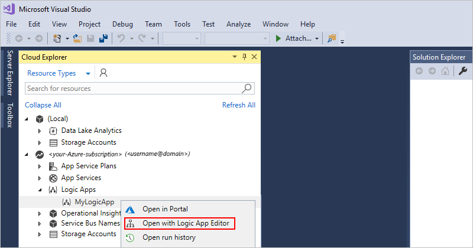
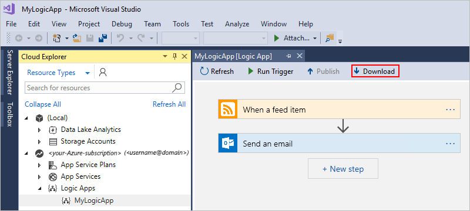
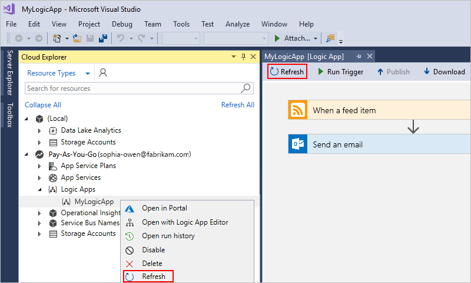
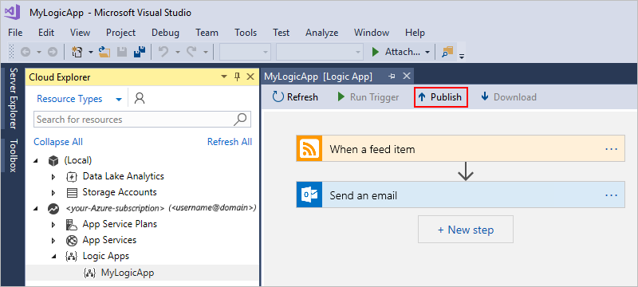
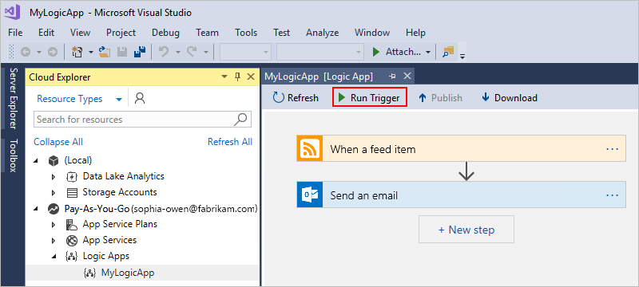
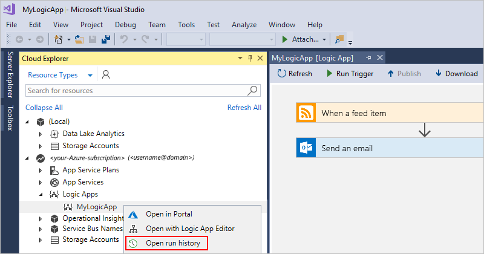
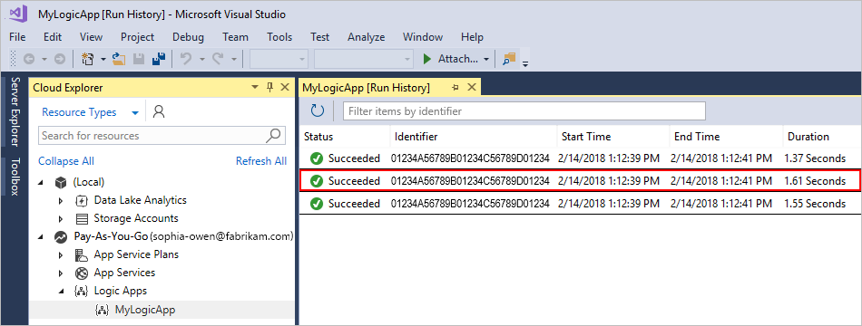
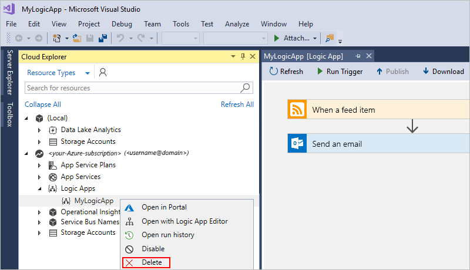

# Manage logic apps with Visual Studio

Although you can create, edit, manage, and deploy logic apps in the 
[Azure portal](https://portal.azure.com), 
you can also use Visual Studio when you want to add your logic apps 
to source control, publish different versions, and create 
[Azure Resource Manager](../azure-resource-manager/resource-group-overview.md) 
templates for various deployment environments. With Visual Studio Cloud Explorer, 
you can find and manage your logic apps along with other Azure resources. 
For example, you can open, download, edit, run, view run history, disable, 
and enable logic apps that are already deployed in the Azure portal. 
If you're new to working with Azure Logic Apps in Visual Studio, learn 
[how to create logic apps with Visual Studio](../logic-apps/quickstart-create-logic-apps-with-visual-studio.md).

> [!IMPORTANT]
> Deploying or publishing a logic app from Visual Studio 
> overwrites the version of that app in the Azure portal. 
> So if you make changes in the Azure portal that you want to keep, 
> make sure that you [refresh the logic app in Visual Studio](#refresh) 
> from the Azure portal before the next time you deploy or publish from Visual Studio.

## Prerequisites

* An Azure subscription. If you don't have an Azure subscription, 
[sign up for a free Azure account](https://azure.microsoft.com/free/).

* Download and install these tools, if you don't have them already: 

  * [Visual Studio 2019, 2017, or 2015 - Community edition or greater](https://aka.ms/download-visual-studio). 
  This quickstart uses Visual Studio Community 2017, which is free.

    > [!IMPORTANT]
    > When you install Visual Studio 2019 or 2017, make sure that 
    > you select the **Azure development** workload.
    > For more information, see 
    > [Manage resources associated with your Azure accounts in Visual Studio Cloud Explorer](https://docs.microsoft.com/visualstudio/azure/vs-azure-tools-resources-managing-with-cloud-explorer?view).

    To install Cloud Explorer for Visual Studio 2015, 
    [download Cloud Explorer from the Visual Studio Marketplace](https://marketplace.visualstudio.com/items?itemName=MicrosoftCloudExplorer.CloudExplorerforVisualStudio2015). 
    For more information, see [Manage resources associated with your Azure Accounts in Visual Studio Cloud Explorer (2015)](https://docs.microsoft.com/visualstudio/azure/vs-azure-tools-resources-managing-with-cloud-explorer?view=vs-2015).

  * [Azure SDK (2.9.1 or later)](https://azure.microsoft.com/downloads/) 

  * [Azure PowerShell](https://github.com/Azure/azure-powershell#installation)

  * Azure Logic Apps Tools for the Visual Studio version you want:

    * [Visual Studio 2019](https://aka.ms/download-azure-logic-apps-tools-visual-studio-2019)

    * [Visual Studio 2017](https://aka.ms/download-azure-logic-apps-tools-visual-studio-2017)

    * [Visual Studio 2015](https://aka.ms/download-azure-logic-apps-tools-visual-studio-2015)

    You can either download and install Azure Logic Apps Tools 
    directly from the Visual Studio Marketplace, or learn 
    [how to install this extension from inside Visual Studio](https://docs.microsoft.com/visualstudio/ide/finding-and-using-visual-studio-extensions). 
    Make sure that you restart Visual Studio after you finish installing.

* Access to the web while using the embedded Logic Apps Designer

  The designer requires an internet connection to create resources in Azure 
  and to read the properties and data from connectors in your logic app. 
  For example, if you use the Dynamics CRM Online connector, 
  the designer checks your CRM instance for available 
  default and custom properties.

## Find your logic apps

In Visual Studio, you can find all the logic 
apps that are associated with your Azure subscription 
and are deployed in the Azure portal by using Cloud Explorer.

1. Open Visual Studio. On the **View** menu, 
select **Cloud Explorer**.

1. In Cloud Explorer, choose **Account Management**. 
Select the Azure subscription associated with your logic apps, 
then choose **Apply**. For example:

   

1. Based on whether you're searching by **Resource Groups** 
or **Resource Types**, follow these steps:

   * **Resource Groups**: Under your Azure subscription, 
   Cloud Explorer shows all the resource groups that are 
   associated with that subscription. 
   Expand the resource group that contains your logic app, 
   then select your logic app.

   * **Resource Types**: Under your Azure subscription, 
   expand **Logic Apps**. After Cloud Explorer shows all 
   the deployed logic apps that are associated with your subscription, 
   select your logic app.

## Open in Visual Studio

In Visual Studio, you can open logic apps previously created 
and deployed either directly through the Azure portal 
or as Azure Resource Manager projects with Visual Studio.

1. Open Cloud Explorer, and find your logic app. 

1. On the logic app's shortcut menu, 
select **Open with Logic App Editor**.

   > [!TIP]
   > If you don't have this command in Visual Studio 2019, check that you have the latest updates for Visual Studio.

   This example shows logic apps by resource type, 
   so your logic apps appear under the **Logic Apps** section.

   

   After the logic app opens in Logic Apps Designer, 
   at the bottom of the designer, you can choose **Code View** 
   so that you can review the underlying logic app definition structure. 
   If you want to create a deployment template for the logic app, 
   learn [how to download an Azure Resource Manager template](#download-logic-app) 
   for that logic app. Learn more about 
   [Resource Manager templates](../azure-resource-manager/resource-group-overview.md#template-deployment).

## Download from Azure

You can download logic apps from the 
[Azure portal](https://portal.azure.com) 
and save them as [Azure Resource Manager](../azure-resource-manager/resource-group-overview.md) 
templates. You can then locally edit the templates with Visual Studio 
and customize logic apps for different deployment environments. 
Downloading logic apps automatically *parameterizes* their 
definitions inside [Resource Manager templates](../azure-resource-manager/resource-group-overview.md#template-deployment), 
which also use JavaScript Object Notation (JSON).

1. In Visual Studio, open Cloud Explorer, 
then find and select the logic app 
that you want to download from Azure.

2. On that app's shortcut menu, 
select **Open with Logic App Editor**.

   > [!TIP]
   > If you don't have this command in Visual Studio 2019, check that you have the latest updates for Visual Studio.

   The Logic App Designer opens and shows the logic app. 
   To review logic app's underlying definition and structure, 
   at the bottom of the designer, choose **Code View**. 

3. On the designer toolbar, choose **Download**.

   

4. When you're prompted for a location, 
browse to that location and save the 
Resource Manager template for the 
logic app definition in JSON (.json) file format. 

Your logic app definition appears in the `resources` 
subsection inside the Resource Manager template. 
You can now edit the logic app definition 
and Resource Manager template with Visual Studio. 
You can also add the template as an Azure Resource 
Manager project to a Visual Studio solution. 
Learn about [Resource Manager projects for logic apps in Visual Studio](../logic-apps/quickstart-create-logic-apps-with-visual-studio.md). 

## Refresh from Azure

If you edit your logic app in the Azure portal and want to keep those changes, 
make sure that you refresh that app's version in Visual Studio with those changes. 

* In Visual Studio, on the Logic App Designer toolbar, choose **Refresh**.

  -or-

* In Visual Studio Cloud Explorer, open your logic app's shortcut menu, 
and select **Refresh**.

## Publish logic app updates

When you're ready to deploy your logic app updates from Visual Studio to Azure, 
on the Logic App Designer toolbar, choose **Publish**.

## Manually run your logic app

You can manually trigger a logic app deployed in Azure from Visual Studio. 
On the Logic App Designer toolbar, choose **Run Trigger**.

## Review run history

To check the status and diagnose problems with logic app runs, 
you can review the details, such as inputs and outputs, 
for those runs in Visual Studio.

1. In Cloud Explorer, open your logic app's shortcut menu, 
and select **Open run history**.

   

1. To view the details for a specific run, 
double-click a run. For example:

   
  
   > [!TIP]
   > To sort the table by property, 
   > choose the column header for that property. 

1. Expand the steps whose inputs and outputs you want to review. 
For example:

   

## Disable or enable logic app

Without deleting your logic app, you can stop the trigger from 
firing the next time when the trigger condition is met. 
Disabling your logic app prevents the Logic Apps engine 
from creating and running future workflow instances for your logic app.
In Cloud Explorer, open your logic app's shortcut menu, 
and select **Disable**.

> [!NOTE]
> When you disable a logic app, no new runs are instantiated. 
> All in-progress and pending runs will continue until they finish, 
> which might take time to complete. 

When you're ready for your logic app to resume operation, 
you can reactivate your logic app. In Cloud Explorer, 
open your logic app's shortcut menu, and select **Enable**.

## Delete your logic app

To delete your logic app from the Azure portal, 
in Cloud Explorer, open your logic app's shortcut menu, 
and select **Delete**.

> [!NOTE]
> When you delete a logic app, no new runs are instantiated. 
> All in-progress and pending runs are canceled. 
> If you have thousands of runs, cancellation might 
> take significant time to complete. 

## Troubleshooting

When you open your logic app project in the Logic Apps Designer, 
you might not get the option for selecting your Azure subscription. 
Instead, your logic app opens with an Azure subscription that's not 
the one you want to use. This behavior happens because after you 
open a logic app's .json file, Visual Studio caches the first 
selected subscription for future use. To resolve this problem, 
try one of these steps:

* Rename the logic app's .json file. The subscription cache depends on the file name.

* To remove previously selected subscriptions for *all* logic apps in your solution, 
delete the hidden Visual Studio settings folder (.vs) in your solution's directory. 
This location stores your subscription information.

## Next steps

In this article, you learned how to manage deployed logic apps with Visual Studio. 
Next, learn about customizing logic app definitions for deployment:

> [!div class="nextstepaction"]
> [Author logic app definitions in JSON](../logic-apps/logic-apps-author-definitions.md)
