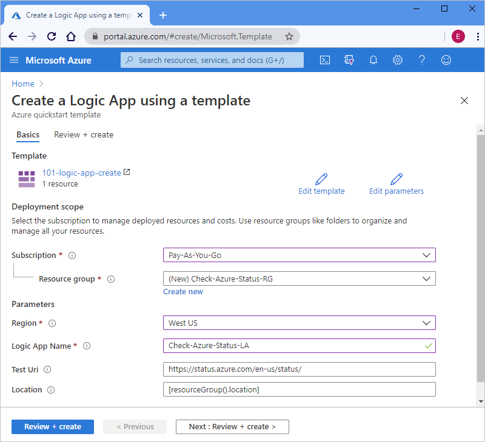

# Quickstart: Create and deploy a logic app workflow by using an ARM template

[Azure Logic Apps](../logic-apps/logic-apps-overview.md) is a cloud service that helps you create and run automated workflows that integrate data, apps, cloud-based services, and on-premises systems by selecting from [hundreds of connectors](/connectors/connector-reference/connector-reference-logicapps-connectors). This quickstart focuses on the process for deploying an Azure Resource Manager template (ARM template) to create a basic logic app that checks the status for Azure on an hourly schedule. 

[!INCLUDE [About Azure Resource Manager](../../includes/resource-manager-quickstart-introduction.md)]

If your environment meets the prerequisites and you're familiar with using ARM templates, select the **Deploy to Azure** button. The template will open in the Azure portal.

[](https://portal.azure.com/#create/Microsoft.Template/uri/https%3a%2f%2fraw.githubusercontent.com%2fAzure%2fazure-quickstart-templates%2fmaster%2f101-logic-app-create%2fazuredeploy.json)

## Prerequisites

If you don't have an Azure subscription, create a [free Azure account](https://azure.microsoft.com/free/?WT.mc_id=A261C142F) before you start.

## Review the template

This quickstart uses the [**Create a logic app**](https://azure.microsoft.com/resources/templates/101-logic-app-create/) template, which you can find in the [Azure Quickstart Templates Gallery](https://azure.microsoft.com/resources/templates) but is too long to show here. Instead, you can review the quickstart template's ["azuredeploy.json file"](https://github.com/Azure/azure-quickstart-templates/blob/master/101-logic-app-create/azuredeploy.json) in the templates gallery.

The quickstart template creates a logic app workflow that uses the Recurrence trigger, which is set to run every hour, and an HTTP [*built-in* action](../connectors/built-in.md), which calls a URL that returns the status for Azure. A built-in action is native to the Azure Logic Apps platform.

This template creates the following Azure resource:

* [**Microsoft.Logic/workflows**](/azure/templates/microsoft.logic/workflows), which creates the workflow for a logic app.

To find more quickstart templates for Azure Logic Apps, review the [Microsoft.Logic](https://azure.microsoft.com/resources/templates/?resourceType=Microsoft.Logic) templates in the gallery.

<a name="deploy-template"></a>

## Deploy the template

Follow the option that you want to use for deploying the quickstart template:

| Option | Description |
|--------|-------------|
| [Azure portal](../logic-apps/quickstart-create-deploy-azure-resource-manager-template.md?tabs=azure-portal#deploy-template) | If your Azure environment meets the prerequisites, and you're familiar with using ARM templates, these steps help you sign in directly to Azure and open the quickstart template in the Azure portal. For more information, see [Deploy resources with ARM templates and Azure portal](../azure-resource-manager/templates/deploy-portal.md). |
| [Azure CLI](../logic-apps/quickstart-create-deploy-azure-resource-manager-template.md?tabs=azure-cli#deploy-template) | The Azure command-line interface (Azure CLI) is a set of commands for creating and managing Azure resources. To run these commands, you need Azure CLI version 2.6 or later. To check your CLI version, type `az --version`. For more information, see these topics: <p><p>- [What is Azure CLI](/cli/azure/what-is-azure-cli) <br>- [Get started with Azure CLI](/cli/azure/get-started-with-azure-cli) |
| [Azure PowerShell](../logic-apps/quickstart-create-deploy-azure-resource-manager-template.md?tabs=azure-powershell#deploy-template) | Azure PowerShell provides a set of cmdlets that use the Azure Resource Manager model for managing your Azure resources. For more information, see these topics: <p><p>- [Azure PowerShell Overview](/powershell/azure/azurerm/overview) <br>- [Introducing the Azure PowerShell Az module](/powershell/azure/new-azureps-module-az) <br>- [Get started with Azure PowerShell](/powershell/azure/get-started-azureps) |
| [Azure Resource Management REST API](../logic-apps/quickstart-create-deploy-azure-resource-manager-template.md?tabs=rest-api#deploy-template) | Azure provides Representational State Transfer (REST) APIs, which are service endpoints that support HTTP operations (methods) that you use to create, retrieve, update, or delete access to service resources. For more information, see [Get started with Azure REST API](/rest/api/azure/). |
|||

<a name="deploy-azure-portal"></a>

#### [Portal](#tab/azure-portal)

1. Select the following image to sign in with your Azure account and open the quickstart template in the Azure portal:

   [](https://portal.azure.com/#create/Microsoft.Template/uri/https%3a%2f%2fraw.githubusercontent.com%2fAzure%2fazure-quickstart-templates%2fmaster%2f101-logic-app-create%2fazuredeploy.json)

1. In the portal, on the **Create a logic app using a template** page, enter or select these values:

   | Property | Value | Description |
   |----------|-------|-------------|
   | **Subscription** | <*Azure-subscription-name*> | The name for the Azure subscription to use |
   | **Resource group** | <*Azure-resource-group-name*> | The name for a new or existing Azure resource group. This example uses `Check-Azure-Status-RG`. |
   | **Region** | <*Azure-region*> | The Azure datacenter region to use your logic app. This example uses `West US`. |
   | **Logic App Name** | <*logic-app-name*> | The name to use for your logic app. This example uses `Check-Azure-Status-LA`. |
   | **Test Uri** | <*test-URI*> | The URI for the service to call based on a specific schedule. This example uses `https://status.azure.com/en-us/status/`, which is the Azure status page. |
   | **Location** |  <*Azure-region-for-all-resources*> | The Azure region to use for all resources, if different from the default value. This example uses the default value, `[resourceGroup().location]`, which is the resource group location. |
   ||||

   Here is how the page looks with the values used in this example:

   

1. When you're done, select **Review + create**.

1. Continue with the steps in [Review deployed resources](#review-deployed-resources).

#### [CLI](#tab/azure-cli)

```azurecli-interactive
read -p "Enter a project name name to use for generating resource names:" projectName &&
read -p "Enter the location, such as 'westus':" location &&
templateUri="https://raw.githubusercontent.com/Azure/azure-quickstart-templates/master/101-logic-app-create/azuredeploy.json" &&
resourceGroupName="${projectName}rg" &&
az group create --name $resourceGroupName --location "$location" &&
az deployment group create --resource-group $resourceGroupName --template-uri  $templateUri &&
echo "Press [ENTER] to continue ..." &&
read
```

For more information, see these topics:

* [Azure CLI: az deployment group](/cli/azure/deployment/group)
* [Deploy resources with ARM templates and Azure CLI](../azure-resource-manager/templates/deploy-cli.md)

#### [PowerShell](#tab/azure-powershell)

```azurepowershell-interactive
$projectName = Read-Host -Prompt "Enter a project name to use for generating resource names"
$location = Read-Host -Prompt "Enter the location, such as 'westus'"
$templateUri = "https://raw.githubusercontent.com/Azure/azure-quickstart-templates/master/101-logic-app-create/azuredeploy.json"

$resourceGroupName = "${projectName}rg"

New-AzResourceGroup -Name $resourceGroupName -Location "$location"
New-AzResourceGroupDeployment -ResourceGroupName $resourceGroupName -TemplateUri $templateUri

Read-Host -Prompt "Press [ENTER] to continue ..."
```

For more information, see these topics:

* [Azure PowerShell: New-AzResourceGroup](/powershell/module/az.resources/new-azresourcegroup)
* [Azure PowerShell: New-AzResourceGroupDeployment](/powershell/module/az.resources/new-azresourcegroupdeployment)
* [Deploy resources with ARM templates and Azure PowerShell](../azure-resource-manager/templates/deploy-powershell.md)

#### [REST API](#tab/rest-api)

1. If you don't want to use an existing Azure resource group, create a new resource group by following this syntax for the request that you send to the Resource Management REST API:

   ```http
   PUT https://management.azure.com/subscriptions/{subscriptionId}/resourcegroups/{resourceGroupName}?api-version=2019-10-01
   ```

   | Value | Description |
   |-------|-------------|
   | `subscriptionId`| The GUID for the Azure subscription that you want to use |
   | `resourceGroupName` | The name for the Azure resource group to create. This example uses `Check-Azure-Status-RG`. |
   |||

   For example:

   ```http
   PUT https://management.azure.com/subscriptions/xxxxXXXXxxxxXXXXX/resourcegroups/Check-Azure-Status-RG?api-version=2019-10-01
   ```

   For more information, see these topics:

   * [Azure REST API Reference - How to call Azure REST APIs](/rest/api/azure/)
   * [Resource Management REST API: Resource Groups - Create Or Update](/rest/api/resources/resourcegroups/createorupdate).

1. To deploy the quickstart template to your resource group, follow this syntax for the request that you send to the Resource Management REST API:

   ```http
   PUT https://management.azure.com/subscriptions/{subscriptionId}/resourcegroups/{resourceGroupName}/providers/Microsoft.Resources/deployments/{deploymentName}?api-version=2019-10-01
   ```

   | Value | Description |
   |-------|-------------|
   | `subscriptionId`| The GUID for the Azure subscription that you want to use |
   | `resourceGroupName` | The name for the Azure resource group to use. This example uses `Check-Azure-Status-RG`. |
   | `deploymentName` | The name to use for your deployment. This example uses `Check-Azure-Status-LA`. |
   |||

   For example:

   ```http
   PUT https://management.azure.com/subscriptions/xxxxXXXXxxxxXXXXX/resourcegroups/Check-Azure-Status-RG/providers/Microsoft.Resources/deployments/Check-Azure-Status-LA?api-version=2019-10-01
   ```

   For more information, see [Resource Management REST API: Deployments - Create Or Update](/rest/api/resources/deployments/createorupdate).

1. To provide the values to use for the deployment, such as the Azure region and links to the quickstart template and [parameter file](../azure-resource-manager/templates/template-parameters.md), which contains the values for the quickstart template to use at deployment, follow this syntax for the request body that you send to the Resource Management REST API:

   ```json
   {
      "location": "{Azure-region}",
      "properties": {
         "templateLink": {
            "uri": "{quickstart-template-URL}",
            "contentVersion": "1.0.0.0"
         },
         "parametersLink": {
            "uri": "{quickstart-template-parameter-file-URL}",
            "contentVersion": "1.0.0.0"
         },
         "mode": "Incremental"
      }
   }
   ```

   | Property | Value | Description |
   |----------|-------|-------------|
   | `location`| <*Azure-region*> | The Azure region to use for deployment. This example uses `West US`. |
   | `templateLink` : `uri` | <*quickstart-template-URL*> | The URL location for the quickstart template to use for deployment: <p><p>`https://raw.githubusercontent.com/Azure/azure-quickstart-templates/master/101-logic-app-create/azuredeploy.json`. |
   | `parametersLink` : `uri` | <*quickstart-template-parameter-file-URL*> | The URL location for the quickstart template's parameter file to use for deployment: <p><p>`https://raw.githubusercontent.com/Azure/azure-quickstart-templates/master/101-logic-app-create/azuredeploy.parameters.json` <p><p>For more information about the Resource Manager parameter file, see these topics: <p><p>- [Create Resource Manager parameter file](../azure-resource-manager/templates/parameter-files.md) <br>- [Tutorial: Use parameter files to deploy your ARM template](../azure-resource-manager/templates/template-tutorial-use-parameter-file.md) |
   | `mode` | <*deployment-mode*> | Run either a incremental update or complete update. This example uses `Incremental`, which is the default value. For more information, see [Azure Resource Manager deployment modes](../azure-resource-manager/templates/deployment-modes.md). |
   |||

   For example:

   ```json
   {
      "location": "West US",
      "properties": {
         "templateLink": {
            "uri": "https://raw.githubusercontent.com/Azure/azure-quickstart-templates/master/101-logic-app-create/azuredeploy.json",
            "contentVersion": "1.0.0.0"
         },
         "parametersLink": {
            "uri": "https://raw.githubusercontent.com/Azure/azure-quickstart-templates/master/101-logic-app-create/azuredeploy.parameters.json",
            "contentVersion": "1.0.0.0"
         },
         "mode": "Incremental"
      }
   }
   ```

For more information, see these topics:

* [Resource Management REST API](/rest/api/resources/)
* [Deploy resources with ARM templates and Resource Manager REST API](../azure-resource-manager/templates/deploy-rest.md)

---

<a name="review-deployed-resources"></a>

## Review deployed resources

To view the logic app, you can use the Azure portal, run a script that you create with Azure CLI or Azure PowerShell, or use the Logic App REST API.

### [Portal](#tab/azure-portal)

1. In the Azure portal search box, enter your logic app's name, which is `Check-Azure-Status-LA` in this example. From the results list, select your logic app.

1. In the Azure portal, find and select your logic app, which is `Check-Azure-Status-RG` in this example.

1. When the Logic App Designer opens, review the logic app created by the quickstart template.

1. To test the logic app, on the designer toolbar, select **Run**.

### [CLI](#tab/azure-cli)

```azurecli-interactive
echo "Enter your logic app name:" &&
read logicAppName &&
az logic workflow show --name $logicAppName &&
echo "Press [ENTER] to continue ..."
```

For more information, see [Azure CLI: az logic workflow show](/cli/azure/logic/workflow#az_logic_workflow_show).

### [PowerShell](#tab/azure-powershell)

```azurepowershell-interactive
$logicAppName = Read-Host -Prompt "Enter your logic app name"
Get-AzLogicApp -Name $logicAppName
Write-Host "Press [ENTER] to continue..."
```

For more information, see [Azure PowerShell: Get-AzLogicApp](/powershell/module/az.logicapp/get-azlogicapp).

### [REST API](#tab/rest-api)

```http
GET https://management.azure.com/subscriptions/{subscriptionId}/resourceGroups/{resourceGroupName}/providers/Microsoft.Logic/workflows/{workflowName}?api-version=2016-06-01
```

| Value | Description |
|-------|-------------|
| `subscriptionId`| The GUID for the Azure subscription where you deployed the quickstart template. |
| `resourceGroupName` | The name for the Azure resource group where you deployed the quickstart template. This example uses `Check-Azure-Status-RG`. |
| `workflowName` | The name for the logic app that you deployed. This example uses `Check-Azure-Status-LA`. |
|||

For example:

```http
GET https://management.azure.com/subscriptions/xxxxXXXXxxxxXXXXX/resourceGroups/Check-Azure-Status-RG/providers/Microsoft.Logic/workflows/Check-Azure-Status-LA?api-version=2016-06-01
```

For more information, see [Logic Apps REST API: Workflows - Get](/rest/api/logic/workflows/get).

---

## Clean up resources

If you plan to continue working with subsequent quickstarts and tutorials, you might want to keep these resources. When you no longer need the logic app, delete the resource group by using either the Azure portal, Azure CLI, Azure PowerShell, or Resource Management REST API.

### [Portal](#tab/azure-portal)

1. In the Azure portal, find and select the resource group that you want to delete, which is `Check-Azure-Status-RG` in this example.

1. On the resource group menu, select **Overview** if not already selected. On the overview page, select **Delete resource group**.

1. To confirm, enter the name for the resource group.

For more information, see [Delete resource group](../azure-resource-manager/management/delete-resource-group.md?tabs=azure-portal#delete-resource-group).

### [CLI](#tab/azure-cli)

```azurecli-interactive
echo "Enter your resource group name:" &&
read resourceGroupName &&
az group delete --name $resourceGroupName &&
echo "Press [ENTER] to continue ..."
```

For more information, see [Azure CLI: az group delete](/cli/azure/group#az_group_delete).

### [PowerShell](#tab/azure-powershell)

```azurepowershell-interactive
$resourceGroupName = Read-Host -Prompt "Enter the resource group name"
Remove-AzResourceGroup -Name $resourceGroupName
Write-Host "Press [ENTER] to continue..."
```

For more information, see [Azure PowerShell: Remove-AzResourceGroup](/powershell/module/azurerm.resources/remove-azurermresourcegroup).

### [REST API](#tab/rest-api)

```http
DELETE https://management.azure.com/subscriptions/{subscriptionId}/resourcegroups/{resourceGroupName}?api-version=2019-10-01
```

| Value | Description |
|-------|-------------|
| `subscriptionId`| The GUID for the Azure subscription where you deployed the quickstart template. |
| `resourceGroupName` | The name for the Azure resource group where you deployed the quickstart template. This example uses `Check-Azure-Status-RG`. |
|||

For example:

```http
GET https://management.azure.com/subscriptions/xxxxXXXXxxxxXXXXX/resourceGroups/Check-Azure-Status-RG?api-version=2019-10-01
```

For more information, see [Resource Management REST API: Resource Groups - Delete](/rest/api/resources/resourcegroups/delete).

---

## Next steps

> [!div class="nextstepaction"]
> [Tutorial: Create and deploy your first ARM template](../azure-resource-manager/templates/template-tutorial-create-first-template.md)
