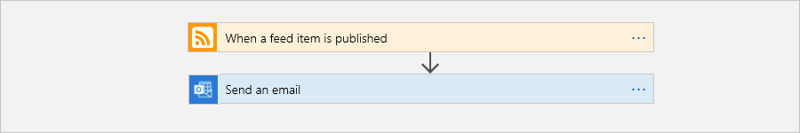
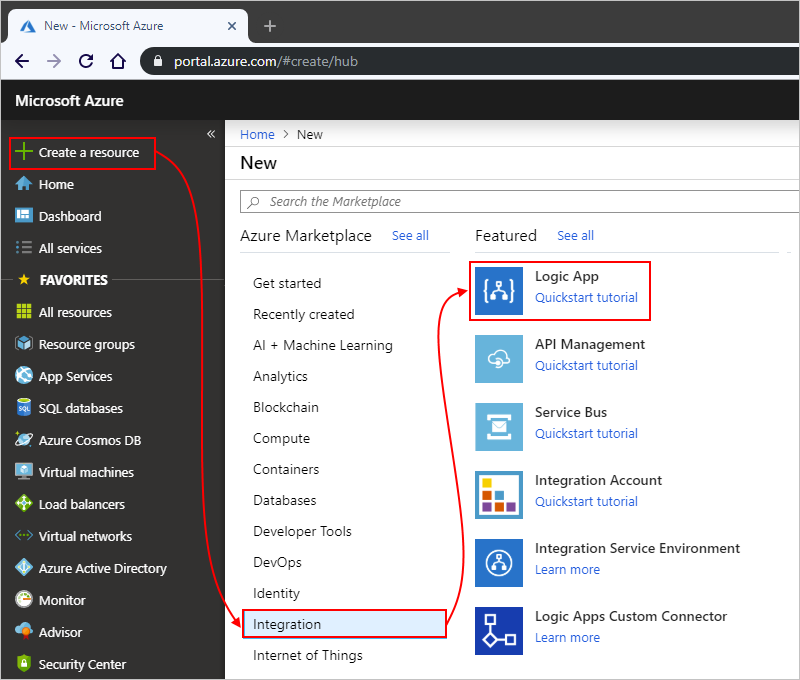
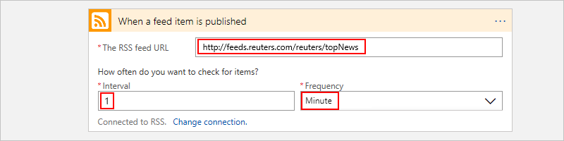
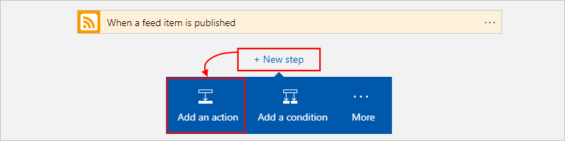
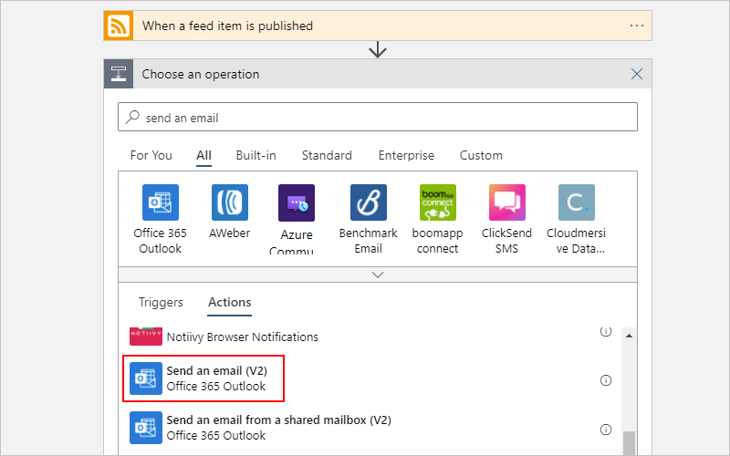
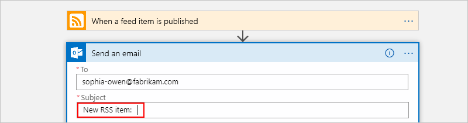
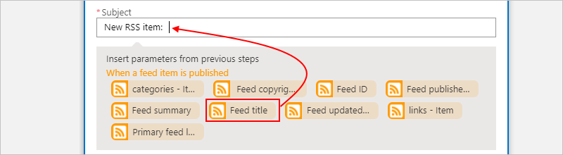
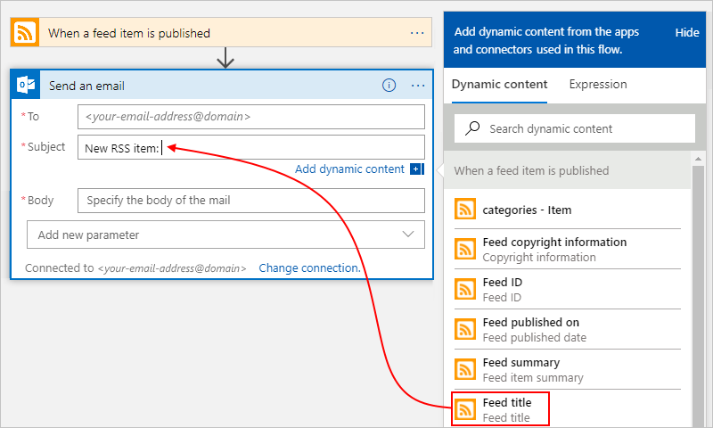
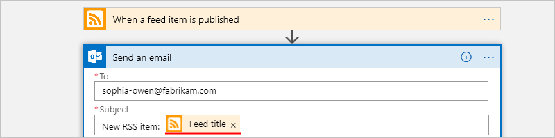
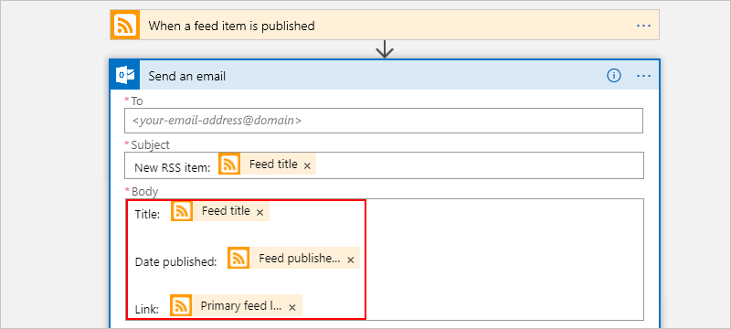

# Quickstart: Build your first logic app workflow - Azure portal

This quickstart introduces how to create your first automated workflow 
with [Azure Logic Apps](../logic-apps/logic-apps-overview.md). 
In this article, you create a logic app that regularly checks a website's RSS feed for new items. 
If new items exist, the logic app sends an email for each item. 
When you're done, your logic app looks like this workflow at a high level:



To follow this quickstart, you need an email account from a provider that's supported by Logic Apps, 
such as Office 365 Outlook, Outlook.com, or Gmail. For other providers, 
[review the connectors list here](https://docs.microsoft.com/connectors/). 
This logic app uses an Office 365 Outlook account. If you use another email account, 
the overall steps are the same, but your UI might slightly differ. 

Also, if you don't have an Azure subscription, 
<a href="https://azure.microsoft.com/free/" target="_blank">sign up for a free Azure account</a>.

## Sign in to the Azure portal

Sign in to the <a href="https://portal.azure.com" target="_blank">Azure portal</a> 
with your Azure account credentials.

## Create your logic app 

1. From the main Azure menu, choose 
**Create a resource** > **Enterprise Integration** > **Logic App**.

   

3. Under **Create logic app**, provide details about your logic app as shown here. 
After you're done, choose **Pin to dashboard** > **Create**.

   

   | Setting | Value | Description | 
   | ------- | ----- | ----------- | 
   | **Name** | MyFirstLogicApp | The name for your logic app | 
   | **Subscription** | <*your-Azure-subscription-name*> | The name for your Azure subscription | 
   | **Resource group** | My-First-LA-RG | The name for the [Azure resource group](../azure-resource-manager/resource-group-overview.md) used to organize related resources | 
   | **Location** | East US 2 | The region where to store your logic app information | 
   | **Log Analytics** | Off | Keep the **Off** setting for diagnostic logging. | 
   |||| 

3. After Azure deploys your app, the Logic Apps Designer opens and shows a page 
with an introduction video and commonly used triggers. Under **Templates**, 
choose **Blank Logic App**.

   

Next, add a [trigger](../logic-apps/logic-apps-overview.md#logic-app-concepts) 
that fires when a new RSS feed item appears. Every logic app must start with a trigger, 
which fires when a specific event happens or when a specific condition is met. 
Each time the trigger fires, the Logic Apps engine creates a logic app instance 
that starts and runs your workflow.

## Check RSS feed with a trigger

1. On the designer, enter "rss" in the search box. 
Select this trigger: **RSS - When a feed item is published**

   

2. Provide this information for your trigger as shown and described: 

   

   | Setting | Value | Description | 
   | ------- | ----- | ----------- | 
   | **The RSS feed URL** | ```http://feeds.reuters.com/reuters/topNews``` | The link for the RSS feed that you want to monitor | 
   | **Interval** | 1 | The number of intervals to wait between checks | 
   | **Frequency** | Minute | The unit of time for each interval between checks  | 
   |  |  |  | 

   Together, the interval and frequency define the schedule for your logic app's trigger. 
   This logic app checks the feed every minute.

3. To hide the trigger details for now, 
click inside the trigger's title bar.

   

4. Save your logic app. On the designer toolbar, choose **Save**. 

Your logic app is now live but doesn't do anything other than 
check the RSS feed. So, add an action that responds when the trigger fires.

## Send email with an action

Now add an [action](../logic-apps/logic-apps-overview.md#logic-app-concepts) 
that sends email when a new item appears in the RSS feed. 

1. Under the **When a feed item is published** trigger, 
choose **+ New step** > **Add an action**.

   

2. Under **Choose an action**, search for "send email", 
then select the "send email" action for the email provider that you want. 
To filter the actions list to a specific service, 
you can select the connector first under **Connectors**.

   

   * For Azure work or school accounts, 
   select Office 365 Outlook. 
   * For personal Microsoft accounts, 
   select Outlook.com.

3. If asked for credentials, sign in to your email account 
so that Logic Apps creates a connection to your email account.

4. In the **Send an email** action, 
specify the data that you want the email to include. 

   1. In the **To** box, enter the recipient's email address. 
   For testing purposes, you can use your own email address.

      For now, ignore the parameters list or 
      the **Add dynamic content** list that appears. 
      When you click inside some edit boxes, 
      this list appears and shows any available 
      parameters from the previous step that 
      you can include as inputs in your workflow.
      Your browser width determines which list appears.

   2. In the **Subject** box, enter this text with a trailing blank space: ```New RSS item: ```

      
 
   3. From either the parameters list or the **Add dynamic content** list, 
   select **Feed title** to include the RSS item title.

      For example, here's the parameters list:

      

      And here's the dynamic content list:

      

      When you're done, the email subject looks like this example:

      

      If a "For each" loop appears on the designer, 
      then you selected a field that contains an array, 
      for example, the **categories-item** field. 
      For these kinds of fields, the designer automatically 
      adds this loop around the action that references that field. 
      That way, your logic app performs the same action on each array item. 
      To remove the loop, choose the **ellipses** (**...**) 
      on the loop's title bar, then choose **Delete**.

   4. In the **Body** box, enter this text, 
   and select these fields for the email body. 
   To add blank lines in an edit box, press Shift + Enter. 

      

      | Setting | Description | 
      | ----- | ----------- | 
      | **Feed title** | The item's title | 
      | **Feed published on** | The item's publishing date and time | 
      | **Primary feed link** | The URL for the item | 
      ||| 
   
5. Save your logic app.

Next, test your logic app.

## Run your logic app

To manually start your logic app, on the designer toolbar bar, choose **Run**. 
Or, wait for your logic app to run on your specified schedule (every minute). 
If the RSS feed has new items, your logic app sends an email for each new item. 
But if the feed doesn't have new items, your logic app skips firing the trigger 
and waits for the next interval before checking again. 

For example, here is a sample email that this logic app sends:


If you don't get any emails, check your email's junk folder. 
Your email junk filter might redirect these kinds of mails. 

Congratulations, you've built and run your first logic app.

## Clean up resources

When no longer needed, delete the resource group that contains your logic app and related resources. 
On the main Azure menu, go to **Resource groups**, and select the resource group for your logic app. 
Choose **Delete resource group**. Enter the resource group name as confirmation, and choose **Delete**.


## Get support

* For questions, visit the [Azure Logic Apps forum](https://social.msdn.microsoft.com/Forums/en-US/home?forum=azurelogicapps).
* To submit or vote on feature ideas, visit the [Logic Apps user feedback site](http://aka.ms/logicapps-wish).

## Next steps

In this quickstart, you created your first logic app that checks for RSS updates 
based your specified schedule (every minute), and takes action (sends email) 
when updates exist. To learn more, continue with this tutorial that creates 
more advanced schedule-based workflows:

> [!div class="nextstepaction"]
> [Check traffic with a scheduled-based logic app](../logic-apps/tutorial-build-schedule-recurring-logic-app-workflow.md)