# Quickstart: Create your first Logic Apps workflow - Azure portal

This quickstart explains how to build your first workflow in [Azure Logic Apps](logic-apps-overview.md) through the [Azure portal](https://portal.azure.com). This introductory guide also explains basic concepts of the Logic Apps service, including how to create a new logic app, add a trigger and action to your logic app, and test your logic app. Follow this quickstart to build an example logic app that regularly checks an RSS feed and sends an email notification for new items. The following screenshot shows the high-level workflow of this example logic app:

If you'd like to learn how to create and manage your first logic app through other interfaces and apps, see these other Logic Apps quickstarts: 

* [Create and manage logic apps using the Azure Command-Line Interface (Azure CLI)](quickstart-logic-apps-azure-cli.md)
* [Create and manage logic apps in Visual Studio Code](quickstart-create-logic-apps-visual-studio-code.md)
* [Create and manage logic apps in Visual Studio](quickstart-create-logic-apps-with-visual-studio.md)

## Prerequisites

* An Azure account and subscription. If you don't have one, [sign up for a free Azure account](https://azure.microsoft.com/free/?WT.mc_id=A261C142F).

* An email account from a service that's supported by Logic Apps (such as Office 365 Outlook or Outlook.com). For other supported email providers, [review the list of connectors](/connectors/).

    > [!IMPORTANT]
    > If you're using the [Gmail connector](/connectors/gmail/), note that only G Suite accounts can use this connector without restriction in Logic Apps. 
    > If you have a consumer Gmail account, you can only use this connector with specific Google-approved services, unless you [create a Google client app to use for authentication with your Gmail connector](/connectors/gmail/#authentication-and-bring-your-own-application). 
    > For more information, see [Data security and privacy policies for Google connectors in Azure Logic Apps](../connectors/connectors-google-data-security-privacy-policy.md).

* If your logic app needs to communicate through a firewall that limits traffic to specific IP addresses, that firewall needs to allow access for *both* the [inbound](logic-apps-limits-and-config.md#inbound) and [outbound](logic-apps-limits-and-config.md#outbound) IP addresses used by the Logic Apps service or runtime in the Azure region where your logic app exists. If your logic app also uses [managed connectors](../connectors/managed.md), such as the Office 365 Outlook connector or SQL connector, or uses [custom connectors](/connectors/custom-connectors/), the firewall also needs to allow access for *all* the [managed connector outbound IP addresses](logic-apps-limits-and-config.md#outbound) in your logic app's Azure region.

## Create your logic app

1. Sign in to the [Azure portal](https://portal.azure.com) with your Azure account credentials.

1. In the Azure portal search box, enter `logic apps`, and select **Logic Apps**.

   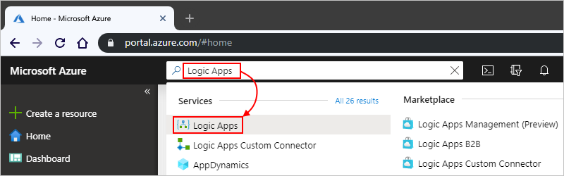

1. On the **Logic Apps** page, select **Add**.

   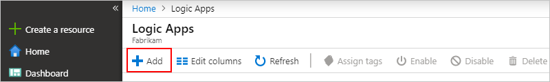

1. On the **Logic App** pane, provide basic details and settings for your logic app. Create a new [resource group](../azure-resource-manager/management/overview.md#terminology) for the purposes of this example logic app.

   | Property | Value | Description |
   |----------|-------|-------------|
   | **Name** | <*logic-app-name*> | Your logic app's name, which must be unique across regions. The name can contain only letters, numbers, hyphens (`-`), underscores (`_`), parentheses (`(`, `)`), and periods (`.`). This example uses "My-First-Logic-App". |
   | **Subscription** | <*Azure-subscription-name*> | The name of your Azure subscription. |
   | **Resource group** | <*Azure-resource-group-name*> | The name of the [Azure resource group](../azure-resource-manager/management/overview.md#terminology) in which you're creating the logic app. The resource group's name must be unique across regions. This example uses "My-First-LA-RG". |
   | **Location** | <*Azure-region*> | The Azure region where to store your logic app information. This example uses "West US". |
   | **Log Analytics** | Off | The setting for diagnostic logging, which is **Off** by default. For this example, keep the **Off** setting. |
   ||||

   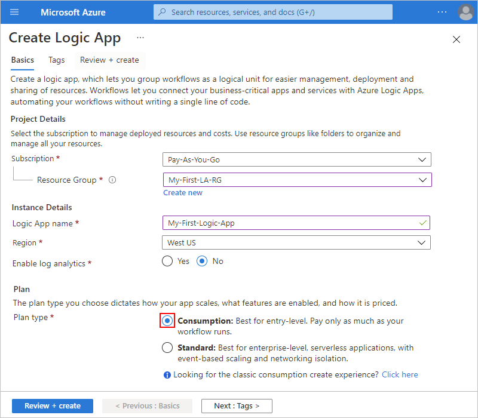

1. When you're ready, select **Review + Create**. Confirm the details that you provided, and select **Create**.

1. After Azure successfully deploys your app, select **Go to resource**. Or, you can find and select your logic app by typing the name in the search box.

   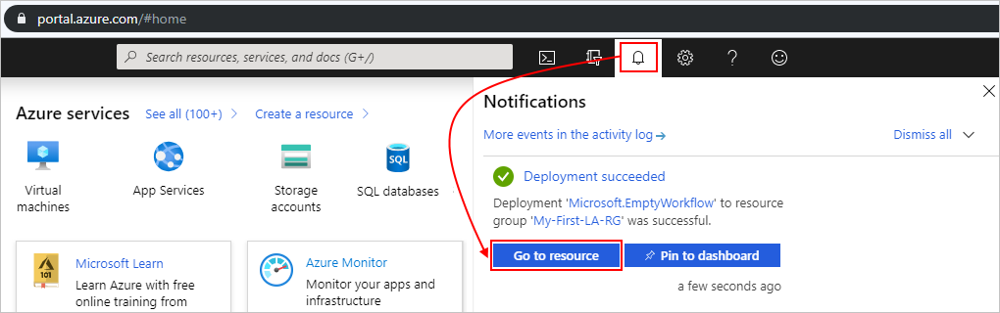

   The Logic Apps Designer opens and shows a page with an introduction video and commonly used triggers. Under **Templates**, select **Blank Logic App**.

   

Next, [add a trigger to your logic app](#add-rss-trigger).

## Add the RSS trigger

Every logic app must start with a [trigger](../logic-apps/logic-apps-overview.md#how-do-logic-apps-work), which fires when a specific event happens, or when a specific condition is met. Each time the trigger finds new items, it fires and the Logic Apps engine creates a logic app instance that starts and runs your workflow. If the trigger doesn't find new items, the trigger doesn't fire and doesn't create an instance or run the workflow at this check.

In this quickstart example, after you [create a logic app](#create-your-logic-app), you add a trigger that checks for new items in an RSS feed, and fires when there are new items. You can also create logic apps with different types of triggers, such as in the tutorial for [creating automatic approval-based workflows](tutorial-process-mailing-list-subscriptions-workflow.md).

1. In the **Logic App Designer**, under the search box, select **All**.

1. To find the RSS connector, in the search box, enter `rss`. From the **Triggers** list, select the RSS trigger, **When a feed item is published**.

   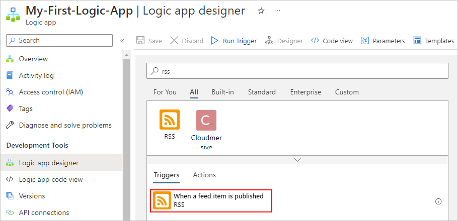

1. Provide the RSS feed URL for your trigger. Then, define your trigger's schedule by setting the interval and frequency.

   | Property | Value | Description |
   | -------- | ----- | ----------- |
   | **The RSS feed URL** | <*RSS-feed-URL*> | The URL of the RSS feed that you want to monitor. This example uses the Wall Street Journal's RSS feed at `https://feeds.a.dj.com/rss/RSSMarketsMain.xml`. However, for the purposes of this example, you can use any RSS feed that doesn't require HTTP authorization. Choose an RSS feed that publishes frequently, so you can test your logic app easily later. |
   | **Interval** | 1 | The number of intervals to wait between RSS feed checks. This example uses 1 minute intervals. |
   | **Frequency** | Minute | The unit of time for each interval between RSS feed checks. This example uses 1 minute intervals. |
   ||||

   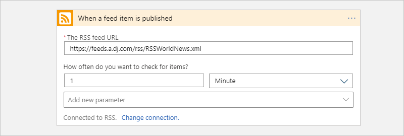

1. Collapse the trigger's details for now by clicking inside its title bar.

   

1. Save your logic app by selecting **Save** on the designer toolbar.

Your logic app is now live, however, it doesn't do anything other than check the RSS feed. Next, [add an action](#add-email-action) to define what happens when your trigger fires.

## Add the "send email" action

After you [add a trigger for your logic app](#add-rss-trigger), you must then add an [action](../logic-apps/logic-apps-overview.md#logic-app-concepts) to determine the response when your logic app checks the RSS feed and a new item appears. You can also create logic apps with much more complex actions, such as in the tutorial for [processing emails with Logic Apps, Azure Functions, and Azure Storage](./tutorial-process-email-attachments-workflow.md).

> [!NOTE]
> This example uses Office 365 Outlook as the email service. If you're using another supported email service in your logic app, the user interface might look different. However, the basic concepts for connecting to another email service remain the same.

1. Under the **When a feed item is published** trigger, select **New step**.

   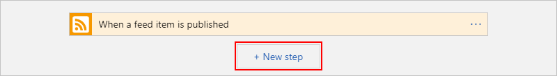

1. Under **Choose an action** and the search box, select **All**.

1. In the search box, enter `send an email` so that you can find connectors that offer this action. To filter the actions list to a specific app or service, you can select that app or service first.

   For example, if you're using a Microsoft work or school account and want to use Office 365 Outlook, select **Office 365 Outlook**. Or, if you're using a personal Microsoft account, you can select Outlook.com. This example continues with Office 365 Outlook:

   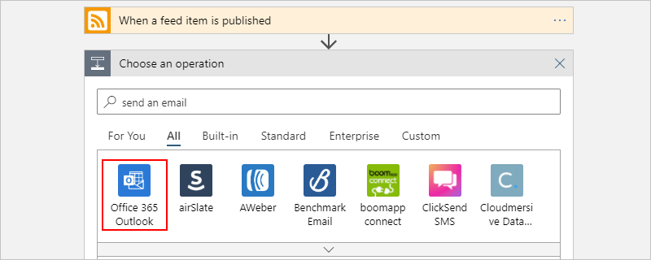

   You can now more easily find and select the action that you want to use, for example, `send an email`:

   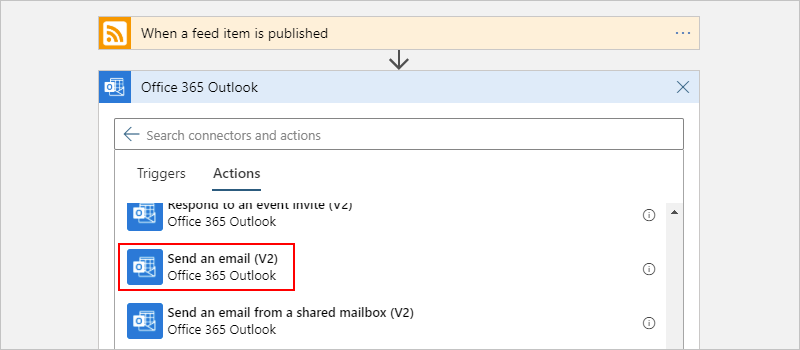

1. If your selected email connector prompts you to authenticate your identity, complete that step now. You must create a connection between your logic app and your email service for this example to work. 

    > [!NOTE]
    > This example shows manual authentication to the Office 365 Outlook connector. However, other connectors might support different authentication types.
    > You can also handle authentication for your logic apps in different ways, depending on your use case. For example, if you use use Azure Resource Manager templates for deployment, you can parameterize to improve security on inputs that change frequently, such as connection details. For more information, see these topics:
   > * [Template parameters for deployment](../logic-apps/logic-apps-azure-resource-manager-templates-overview.md#template-parameters)
   > * [Authorize OAuth connections](../logic-apps/logic-apps-deploy-azure-resource-manager-templates.md#authorize-oauth-connections)
   > * [Authenticate access with managed identities](../logic-apps/create-managed-service-identity.md)
   > * [Authenticate connections for logic app deployment](../logic-apps/logic-apps-azure-resource-manager-templates-overview.md#authenticate-connections)

1. In the **Send an email** action, specify what information to include in the email notification.

   1. In the **To** box, enter the recipient's email address. For this example, use your email address.

        > [!NOTE]
        > The **Add dynamic content** list appears when you click inside the **To** box, and certain other input boxes in the Logic Apps Designer. This example uses dynamic content in a later step. The **Add dynamic content** list shows any available outputs from the previous step, which you can use as inputs for the current action.

   1. In the **Subject** box, enter the subject for your email notification. For this example, enter the following text with a trailing blank space: `New RSS item: `

      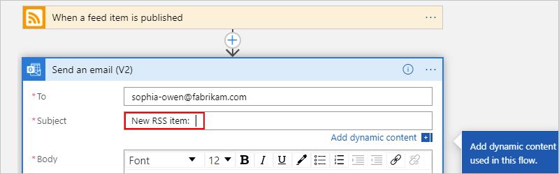

   1. From the **Add dynamic content** list, select **Feed title**, which is output from the trigger, **When a feed item is published**. Your email notification uses this output to get the title of the RSS item.

      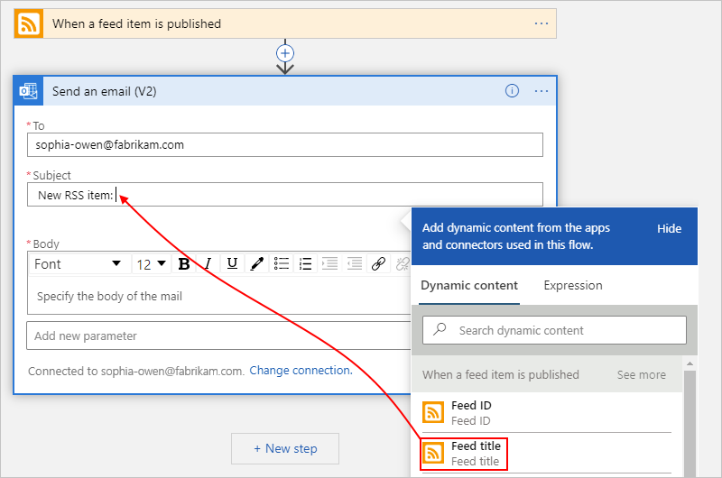

      > [!TIP]
      > In the dynamic content list, if no outputs appear from the **When a feed item is published** trigger, 
      > next to the action's header, select **See more**.
      > 
      > 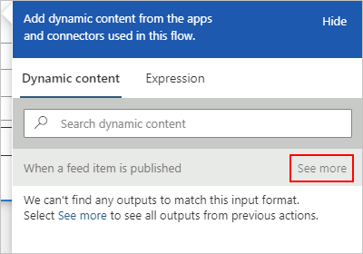

      When you're done, the email subject looks like this example:

      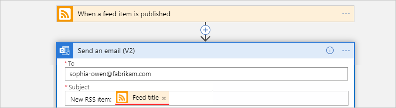

      If a "For each" loop appears on the designer, then you selected a token for an array; for example, the **categories-Item** token. For these kinds of tokens, the designer automatically adds this loop around the action that references that token. That way, your logic app performs the same action on each array item. To remove the loop, select the **ellipses** (**...**) on the loop's title bar, then select **Delete**.

   1. In the **Body** box, enter content for the email body. In this example, the content includes three properties with descriptive text for each: `Title:`, the **feed title** property; `Date published:`, the **Feed published on** property; and `Link:`, the **Primary feed link** property. To add blank lines in an edit box, press Shift + Enter.

      | Property | Description |
      |----------|-------------|
      | **Feed title** | The item's title |
      | **Feed published on** | The item's publishing date and time |
      | **Primary feed link** | The URL for the item |
      |||

      

1. Save your logic app. Select **Save** in the designer menu.

Next, [test that your logic app works](#test-logic-app).

## Run your logic app

After creating your example logic app, confirm that your workflow is configured correctly. You can wait for the logic app to check your RSS feed based on the specified schedule. Or, you can manually run your logic app by selecting **Run** on the Logic Apps Designer toolbar, as show in the following screenshot. 

If the RSS feed has new items, your logic app sends an email for each new item. Otherwise, your logic app waits until the next interval to check the RSS feed again. 

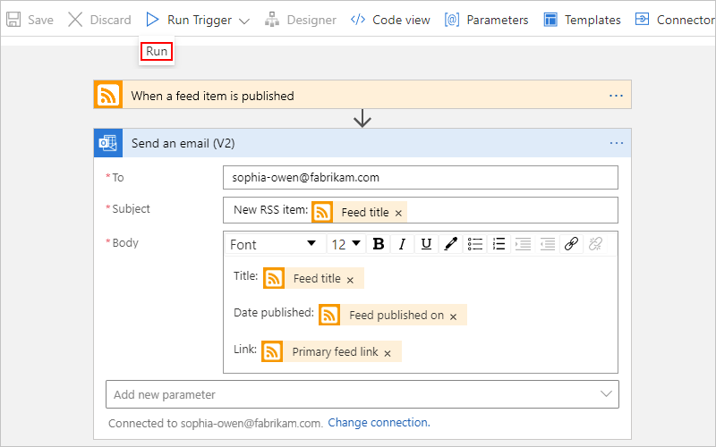

The following screenshot shows a sample email notification from this example logic app. The email includes the details for each RSS feed item selected in the designer, as well as the descriptive text added for each.

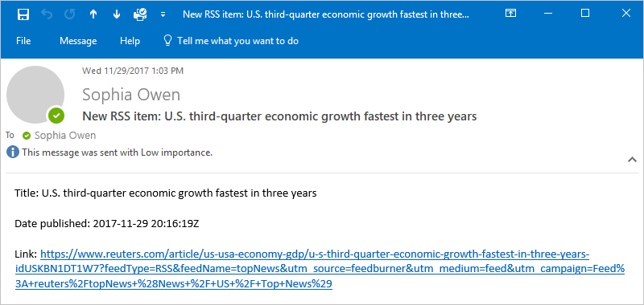

If you're not receiving notification emails from the logic app as expected:

* Check your email account's junk or spam folder, in case the message was incorrectly filtered.
* Make sure the RSS feed you're using has published items since the last scheduled or manual check.

## Clean up resources

When you're done testing this sample logic app, clean up the logic app and any related resources by deleting the resource group you created for this example.

> [!NOTE]
> When you [delete a logic app](manage-logic-apps-with-azure-portal.md#delete-logic-apps), no new runs are instantiated. All in-progress and pending runs are canceled. 
> If you have thousands of runs, cancellation might take significant time to complete.

1. In the Azure search box, enter `resource groups`, and then select **Resource groups**.

   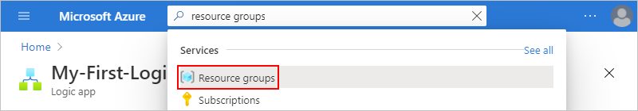

1. Find and select your logic app's resource group. On the **Overview** pane, select **Delete resource group**.

   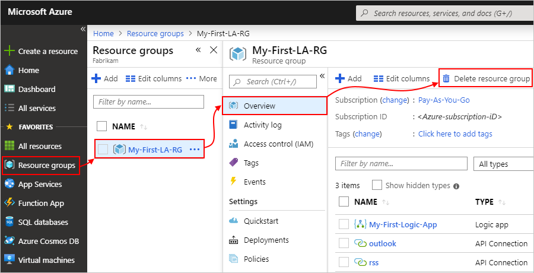

1. When the confirmation pane appears, enter the resource group name, and select **Delete**.

   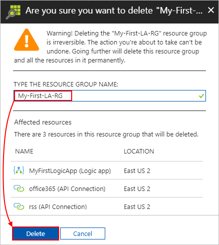

## Next steps

In this quickstart, you created your first logic app in the Azure portal to check an RSS feed for updates on a schedule, and send an email notification about each new feed item. 

To learn how to create more advanced schedule-based workflows in Logic Apps, see the following tutorial:

> [!div class="nextstepaction"]
> [Check traffic with a scheduled-based logic app](../logic-apps/tutorial-build-schedule-recurring-logic-app-workflow.md)