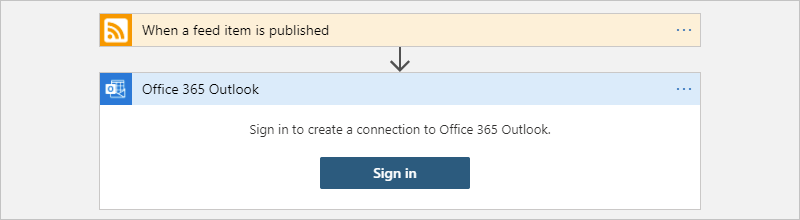

# Quickstart: Create an integration workflow with multi-tenant Azure Logic Apps and the Azure portal

[!INCLUDE [logic-apps-sku-consumption](../../includes/logic-apps-sku-consumption.md)]

This quickstart shows how to create an example automated workflow that integrates two services, an RSS feed for a website and an email account. More specifically, you create a [Consumption plan-based](logic-apps-pricing.md#consumption-pricing) logic app resource and workflow that uses the RSS connector and the Office 365 Outlook connector. This resource runs in [*multi-tenant* Azure Logic Apps](logic-apps-overview.md).

> [!NOTE]
> To create a workflow in a Standard logic app resource that runs in *single-tenant* Azure Logic Apps, review 
> [Create an integration workflow with single-tenant Azure Logic Apps](create-single-tenant-workflows-azure-portal.md). 
> For more information about multi-tenant versus single-tenant Azure Logic Apps, review 
> [Single-tenant versus multi-tenant and integration service environment](single-tenant-overview-compare.md).

The RSS connector has a trigger that checks an RSS feed, based on a schedule. The Office 365 Outlook connector has an action that sends an email for each new item. The connectors in this example are only two among the [hundreds of connectors](/connectors/connector-reference/connector-reference-logicapps-connectors) that you can use in a workflow. While this example is cloud-based, Azure Logic Apps supports workflows that connect apps, data, services, and systems across cloud, on premises, and hybrid environments.

The following screenshot shows the high-level example workflow:

As you progress through this quickstart, you'll learn these basic steps:

* Create a Consumption logic app resource that runs in multi-tenant Azure Logic Apps.
* Select the blank logic app template.
* Add a trigger that specifies when to run the workflow.
* Add an action that performs a task after the trigger fires.
* Run your workflow.

To create and manage a logic app resource using other tools, review these other Azure Logic Apps quickstarts:

* [Create and manage logic apps in Visual Studio Code](quickstart-create-logic-apps-visual-studio-code.md)
* [Create and manage logic apps in Visual Studio](quickstart-create-logic-apps-with-visual-studio.md)
* [Create and manage logic apps via the Azure CLI](quickstart-logic-apps-azure-cli.md)

## Prerequisites

* An Azure account and subscription. If you don't have a subscription, [sign up for a free Azure account](https://azure.microsoft.com/free/?WT.mc_id=A261C142F).

* An email account from a service that works with Azure Logic Apps, such as Office 365 Outlook or Outlook.com. For other supported email providers, review [Connectors for Azure Logic Apps](/connectors/connector-reference/connector-reference-logicapps-connectors).

  > [!NOTE]
  > If you want to use the [Gmail connector](/connectors/gmail/), only G Suite accounts can use this connector without restriction in Azure 
  > Logic Apps. If you have a consumer Gmail account, you can only use this connector with specific Google-approved services, unless you 
  > [create a Google client app to use for authentication with your Gmail connector](/connectors/gmail/#authentication-and-bring-your-own-application). 
  > For more information, see [Data security and privacy policies for Google connectors in Azure Logic Apps](../connectors/connectors-google-data-security-privacy-policy.md).

* If you have a firewall that limits traffic to specific IP addresses, set up your firewall to allow access for *both* the [inbound](logic-apps-limits-and-config.md#inbound) and [outbound](logic-apps-limits-and-config.md#outbound) IP addresses used by the Logic Apps service in the Azure region where you create your logic app workflow.

  This example uses the RSS and Office 365 Outlook connectors, which are [managed by Microsoft](../connectors/managed.md). These connectors require that you set up your firewall to allow access for *all* the [managed connector outbound IP addresses](/connectors/common/outbound-ip-addresses) in the Azure region for your logic app resource.

## Create a Consumption logic app resource

1. Sign in to the [Azure portal](https://portal.azure.com) with your Azure account.

1. In the Azure search box, enter `logic apps`, and select **Logic apps**.

   

1. On the **Logic apps** page, select **Add**.

   

1. On the **Create Logic App** pane, on the **Basics** tab, provide the following basic information about your logic app:

   | Property | Required | Value | Description |
   |----------|----------|-------|-------------|
   | **Subscription** | Yes | <*Azure-subscription-name*> | Your Azure subscription name. |
   | **Resource Group** | Yes | <*Azure-resource-group-name*> | The [Azure resource group](../azure-resource-manager/management/overview.md#terminology) where you create your logic app and related resources. This name must be unique across regions and can contain only letters, numbers, hyphens (**-**), underscores (**_**), parentheses (**()**), and periods (**.**).   This example creates a resource group named **My-First-LA-RG**. |
   | **Logic App name** | Yes | <*logic-app-name*> | Your logic app name, which must be unique across regions and can contain only letters, numbers, hyphens (`-`), underscores (`_`), parentheses (`(`, `)`), and periods (`.`).   This example creates a logic app named **My-First-Logic-App**. |
   |||||

1. Before you continue making selections, go to the **Plan** section. For **Plan type**, select **Consumption** so that you view only the settings that apply to the Consumption plan-based logic app type. The **Plan type** property specifies the logic app type and billing model to use.

   | Plan type | Description |
   |-----------|-------------|
   | **Standard** | This logic app type is the default selection and runs in single-tenant Azure Logic Apps and uses the [Standard billing model](logic-apps-pricing.md#standard-pricing). |
   | **Consumption** | This logic app type runs in global, multi-tenant Azure Logic Apps and uses the [Consumption billing model](logic-apps-pricing.md#consumption-pricing). |
   |||

1. Now continue making the following selections:

   | Property | Required | Value | Description |
   |----------|----------|-------|-------------|
   | **Region** | Yes | <*Azure-region*> | The Azure datacenter region for storing your app's information. This example deploys the sample logic app to the **West US** region in Azure. 
**Note**: If your subscription is associated with an [integration service environment](connect-virtual-network-vnet-isolated-environment-overview.md), this list includes those environments. |
   | **Enable log analytics** | Yes | **No** | This option appears and applies only when you select the **Consumption** logic app type. 

Change this option only when you want to enable diagnostic logging. For this quickstart, keep the default selection. |
   ||||

   > [!NOTE]
   >
   > If you selected an Azure region that supports availability zone redundancy, the **Zone redundancy** 
   > section is enabled. This preview section offers the choice to enable availability zone redundancy 
   > for your logic app. However, currently supported Azure regions don't include **West US**, 
   > so you can ignore this section for this example. For more information, see 
   > [Protect logic apps from region failures with zone redundancy and availability zones](set-up-zone-redundancy-availability-zones.md).

   When you're done, your settings look similar to this version:

   

1. When you're ready, select **Review + Create**.

1. On the validation page that appears, confirm all the information that you provided, and select **Create**.

## Select the blank template

1. After Azure successfully deploys your app, select **Go to resource**. Or, find and select your logic app resource by typing the name in the Azure search box.

   

   The designer's template page opens to show an introduction video and commonly used triggers.

1. Scroll down past the video and the section named **Start with a common trigger**.

1. Under **Templates**, select **Blank Logic App**.

   

   After you select the template, the designer shows an empty workflow.

## Add the trigger

A workflow always starts with a single [trigger](logic-apps-overview.md#how-do-logic-apps-work), which specifies the condition to meet before running any actions in the workflow. Each time the trigger fires, Azure Logic Apps creates and runs a workflow instance. If the trigger doesn't fire, no instance is created nor run. You can start a workflow by choosing from many different triggers.

This example uses an RSS trigger that checks an RSS feed, based on a schedule. If a new item exists in the feed, the trigger fires, and a new workflow instance starts to run. If multiple new items exist between checks, the trigger fires for each item, and a separate new workflow instance runs for each item.

1. Under the designer search box, select **All**.

1. In the designer search box, enter **rss**. From the **Triggers** list, select the RSS trigger, **When a feed item is published**.

   

1. In the trigger details, provide the following information:

   | Property | Required | Value | Description |
   |----------|----------|-------|-------------|
   | **The RSS feed URL** | Yes | <*RSS-feed-URL*> | The RSS feed URL to monitor. 

This example uses the Wall Street Journal's RSS feed at `https://feeds.a.dj.com/rss/RSSMarketsMain.xml`. However, you can use any RSS feed that doesn't require HTTP authorization. Choose an RSS feed that publishes frequently, so you can easily test your workflow. |
   | **Chosen property will be used to determine** | No | PublishDate | The property that determines which items are new. |
   | **Interval** | Yes | 1 | The number of intervals to wait between feed checks. 

This example uses `1` as the interval. |
   | **Frequency** | Yes | Minute | The unit of frequency to use for every interval. 

This example uses `Minute` as the frequency. |
   |||||

   

1. Collapse the trigger's details for now by clicking inside its title bar.

   

1. On the designer toolbar, select **Save** to save your logic app, which instantly goes live in the Azure portal.

   The trigger doesn't do anything other than check the RSS feed. So, you need to add an action that defines what happens when the trigger fires.

## Add an action

Following a trigger, an [action](logic-apps-overview.md#logic-app-concepts) is a subsequent step that runs some operation in the workflow. Any action can use the outputs from the previous step, which can be the trigger or another action. You can choose from many different actions, add multiple actions up to the [limit per workflow](logic-apps-limits-and-config.md#definition-limits), and even create different action paths.

This example uses an Office 365 Outlook action that sends an email each time that the trigger fires for a new RSS feed item. If multiple new items exist between checks, you receive multiple emails.

1. Under the **When a feed item is published** trigger, select **New step**.

   

1. Under the **Choose an operation** search box, select **All**.

1. In the search box, enter **send an email**. To filter the **Actions** list to a specific app or service, select the icon for that app or service first.

   For example, if you have a Microsoft work or school account and want to use Office 365 Outlook, select **Office 365 Outlook**. Or, if you have a personal Microsoft account, select **Outlook.com**. This example continues with Office 365 Outlook.

   > [!NOTE]
   > If you use a different supported email service in your workflow, the user interface might look 
   > slightly different. However, the basic concepts for connecting to another email service remain the same.

   

   You can now more easily find and select the action that you want, for example, **Send an email**:

   

1. If your selected email service prompts you to sign in and authenticate your identity, complete that step now.

   Many connectors require that you first create a connection and authenticate your identity before you can continue.

   

   > [!NOTE]
   > This example shows manual authentication for connecting to Office 365 Outlook. However, other services might 
   > support or use different authentication types. Based on your scenario, you can handle connection authentication 
   > in various ways.
   > 
   > For example, if you use use Azure Resource Manager templates for deployment, you can increase security on inputs 
   > that change often by parameterizing values such as connection details. For more information, review these topics:
   >
   > * [Template parameters for deployment](logic-apps-azure-resource-manager-templates-overview.md#template-parameters)
   > * [Authorize OAuth connections](logic-apps-deploy-azure-resource-manager-templates.md#authorize-oauth-connections)
   > * [Authenticate access with managed identities](create-managed-service-identity.md)
   > * [Authenticate connections for logic app deployment](logic-apps-azure-resource-manager-templates-overview.md#authenticate-connections)

1. In the **Send an email** action, specify the information to include in the email.

   1. In the **To** box, enter the receiver's email address. For this example, use your email address.

      > [!NOTE]
      > The **Add dynamic content** list appears when you click inside the **To** box and other boxes 
      > for certain input types. This list shows any outputs from previous steps that are available for 
      > you to select as inputs for the current action. You can ignore this list for now. The next step 
      > uses the dynamic content list.

   1. In the **Subject** box, enter the email subject. For this example, enter the following text with a trailing blank space: `New RSS item: `

      

   1. From the **Add dynamic content** list, under **When a feed item is published**, select **Feed title**.

      The feed title is a trigger output that references the title for the RSS item. Your email uses this output to show the RSS item's title.

      

      > [!TIP]
      > In the dynamic content list, if no outputs appear from the **When a feed item is published** trigger, 
      > next to the action's header, select **See more**.
      > 
      > 

      When you're done, the email subject looks like this example:

      

      > [!NOTE]
      > If a **For each** loop appears on the designer, then you selected an output that references an array, such as 
      > the **categories-Item** property. For this output type, the designer automatically adds the **For each** loop 
      > around the action that references the output. That way, your workflow performs the same action on each array item. 
      >
      > To remove the loop, on the loop's title bar, select the ellipses (**...**) button, then select **Delete**.

   1. In the **Body** box, enter email body content.
   
      For this example, the body includes the following properties, preceded by descriptive text for each property. To add blank lines in an edit box, press Shift + Enter.

      | Descriptive text | Property | Description |
      |------------------|----------|-------------|
      | `Title:` | **Feed title** | The item's title |
      | `Date published:` | **Feed published on** | The item's publishing date and time |
      | `Link:` | **Primary feed link** | The URL for the item |
      ||||

      

1. Save your logic app. On the designer toolbar, select **Save**.

## Run your workflow

To check that the workflow runs correctly, you can wait for the trigger to check the RSS feed based on the set schedule. Or, you can manually run the workflow by selecting **Run Trigger** on the designer toolbar, as shown in the following screenshot.

If the RSS feed has new items, your workflow sends an email for each new item. Otherwise, your workflow waits until the next interval to check the RSS feed again.

The following screenshot shows a sample email that's sent by the example workflow. The email includes the details from each trigger output that you selected plus the descriptive text that you included for each item.

## Troubleshoot problems

If you don't receive emails from the workflow as expected:

* Check your email account's junk or spam folder, in case the message was incorrectly filtered.

* Make sure the RSS feed you're using has published items since the last scheduled or manual check.

## Clean up resources

When you're done with this quickstart, delete the sample logic app resource and any related resources by deleting the resource group that you created for this example.

1. In the Azure search box, enter `resource groups`, and then select **Resource groups**.

   

1. Find and select your logic app's resource group. On the **Overview** pane, select **Delete resource group**.

   

1. When the confirmation pane appears, enter the resource group name, and select **Delete**.

   

## Next steps

In this quickstart, you created your first logic app workflow in the Azure portal to check an RSS feed, and send an email for each new item. To learn more about advanced scheduled workflows, see the following tutorial:

> [!div class="nextstepaction"]
> [Check traffic with a schedule-based logic app workflow](tutorial-build-schedule-recurring-logic-app-workflow.md)
