# Quickstart: Create and manage logic app workflow definitions with Visual Studio Code

With [Azure Logic Apps](../logic-apps/logic-apps-overview.md) and Visual Studio Code, you can create and manage logic apps that help you automate tasks, workflows, and processes for integrating apps, data, systems, and services across organizations and enterprises. This quickstart shows how you can create and edit the underlying workflow definitions, which use JavaScript Object Notation (JSON), for logic apps through a code-based experience. You can also work on existing logic apps that are already deployed to Azure.

Although you can perform these same tasks in the [Azure portal](https://portal.azure.com) and in Visual Studio, you can get started faster in Visual Studio Code when you're already familiar with logic app definitions and want to work directly in code. For example, you can disable, enable, delete, and refresh already created logic apps. Also, you can work on logic apps and integration accounts from any development platform where Visual Studio Code runs, such as Linux, Windows, and Mac.

For this article, you can create the same logic app from this [quickstart](../logic-apps/quickstart-create-first-logic-app-workflow.md), which focuses more on the basic concepts. In Visual Studio Code, the logic app looks like this example:

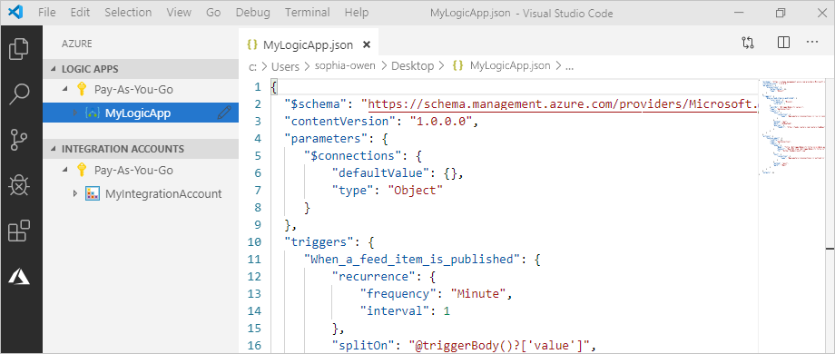

Before you start, make sure that you have these items:

* If you don't have an Azure account and subscription, [sign up for a free Azure account](https://azure.microsoft.com/free/).

* Basic knowledge about [logic app workflow definitions](../logic-apps/logic-apps-workflow-definition-language.md) and their structure as described with JSON

  If you're new to Logic Apps, try this [quickstart](../logic-apps/quickstart-create-first-logic-app-workflow.md), which creates your first logic apps in the Azure portal and focuses more on the basic concepts.

* Access to the web for signing in to Azure and your Azure subscription

* Download and install these tools, if you don't have them already:

  * [Visual Studio Code version 1.25.1 or later](https://code.visualstudio.com/), which is free

  * Visual Studio Code extension for Azure Logic Apps

    You can download and install this extension from the [Visual Studio Marketplace](https://marketplace.visualstudio.com/items?itemName=ms-azuretools.vscode-logicapps) or directly from inside Visual Studio Code. Make sure that you reload Visual Studio Code after installing.

    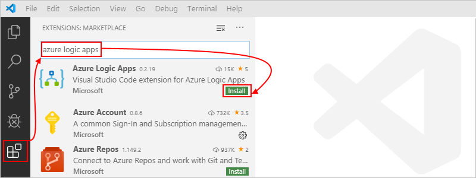

    To check that the extension installed correctly, select the Azure icon that appears in your Visual Studio Code toolbar.

    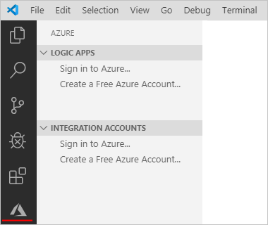

    For more information, see [Extension Marketplace](https://code.visualstudio.com/docs/editor/extension-gallery). To contribute to this extension's open-source version, visit the [Azure Logic Apps extension for Visual Studio Code on GitHub](https://github.com/Microsoft/vscode-azurelogicapps).

<a name="sign-in-azure"></a>

## Sign in to Azure

1. Open Visual Studio Code. On the Visual Studio Code toolbar, select the Azure icon.

   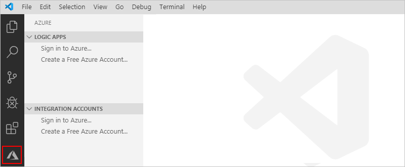

1. In the Azure window, under **Logic Apps**, select **Sign in to Azure**. When the Microsoft sign-in page prompts you, sign in with your Azure account.

   

   1. If sign in takes longer than usual, Visual Studio Code prompts you to sign in through a Microsoft authentication website by providing you a device code. To sign in with the code instead, select **Use Device Code**.

      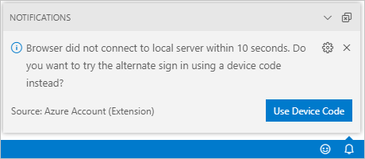

   1. To copy the code, select **Copy & Open**.

      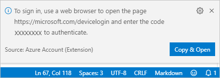

   1. To open a new browser window and continue to the authentication website, select **Open Link**.

      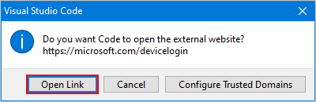

   1. On the **Sign in to your account** page, enter your authentication code, and select **Next**.

      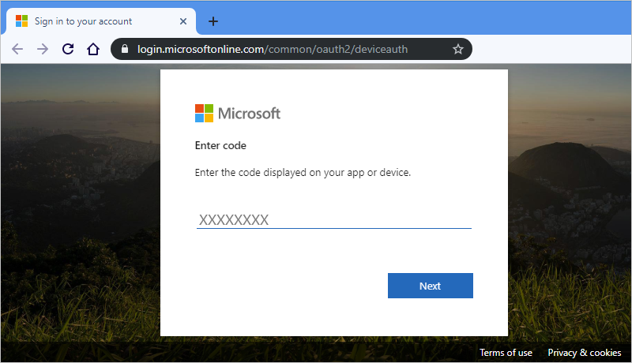

1. Select your Azure account. After you sign in, you can close your browser, and return to Visual Studio Code.

   In the Azure pane, the **Logic Apps** and **Integration Accounts** sections now show the Azure subscriptions that are associated with your account. However, if you don't see the subscriptions that you expect, or if the sections show too many subscriptions, follow these steps:

   1. Move your pointer over the **Logic Apps** label. When the toolbar appears, select **Select Subscriptions** (filter icon).

      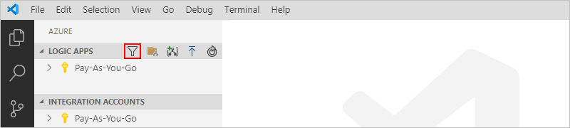

   1. From the list that appears, select the subscriptions that you want to appear.

1. Under **Logic Apps**, select the subscription that you want. The subscription node expands and shows any logic apps that exist in that subscription.

   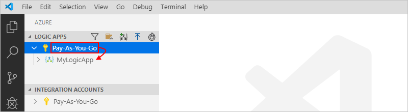

   > [!TIP]
   > Under **Integration Accounts**, selecting your subscription shows any integration accounts that exist in that subscription.

<a name="create-logic-app"></a>

## Create your logic app

1. If you haven't signed in to your Azure account and subscription yet from inside Visual Studio Code, follow the [previous steps to sign in now](#sign-in-azure).

1. In Visual Studio code, under **Logic Apps**, open your subscription's context menu, and select **Create Logic App**.

   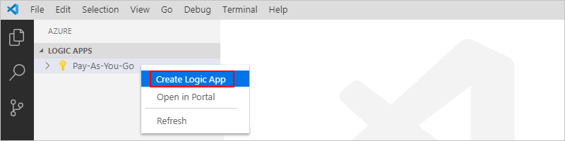

   A list appears and shows any Azure resource groups in your subscription.

1. From resource group list, select either **Create a new resource group** or an existing resource group. For this example, create a new resource group.

   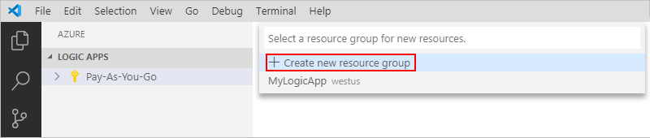

1. Provide a name for your Azure resource group, and press ENTER.

   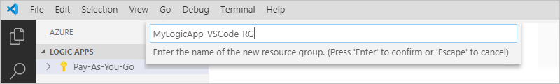

1. Select the Azure region where you want to save your logic app's metadata.

   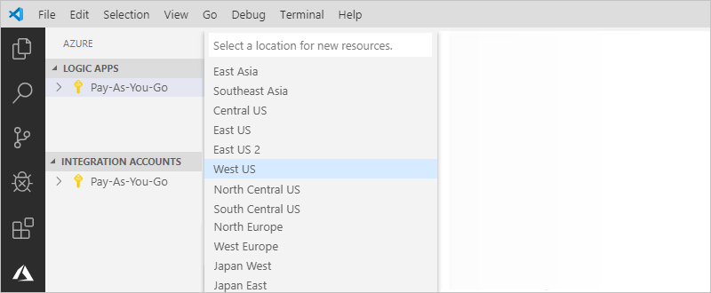

1. Provide a name for your logic app, and press Enter.

   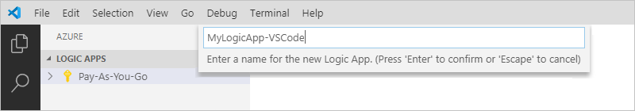

   In the Azure window, under your Azure subscription, your new and blank logic app appears. Visual Studio Code also opens a JSON (.logicapp.json) file, which includes a skeleton workflow definition for your logic app. Now you can start manually authoring your logic app's workflow definition in this JSON file. For technical reference about the structure and syntax for a workflow definition, see the [Workflow Definition Language schema for Azure Logic Apps](../logic-apps/logic-apps-workflow-definition-language.md).

   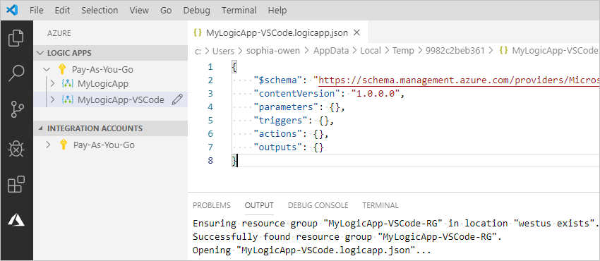

   For example, here is a sample logic app workflow definition, which starts with an RSS trigger and an Office 365 Outlook action. Usually, JSON elements appear alphabetically in each section. However, this sample shows these elements roughly in the order that the logic app's steps appear in the designer.

   > [!IMPORTANT]
   > If you want to reuse this sample logic app definition, you need an Office 365 organizational account, for example, @fabrikam.com. 
   > Make sure that you replace the fictitious email address with your own email address. To use a different email connector, 
   > such as Outlook.com or Gmail, replace the `Send_an_email_action` action with a similar action available from an 
   > [email connector that's supported by Azure Logic Apps](../connectors/apis-list.md).

   ```json
   {
      "$schema": "https://schema.management.azure.com/providers/Microsoft.Logic/schemas/2016-06-01/workflowdefinition.json#",
      "contentVersion": "1.0.0.0",
      "parameters": {
         "$connections": {
            "defaultValue": {},
            "type": "Object"
         }
      },
      "triggers": {
         "When_a_feed_item_is_published": {
            "recurrence": {
               "frequency": "Minute",
               "interval": 1
            },
            "splitOn": "@triggerBody()?['value']",
            "type": "ApiConnection",
            "inputs": {
               "host": {
                  "connection": {
                     "name": "@parameters('$connections')['rss']['connectionId']"
                  }
               },
               "method": "get",
               "path": "/OnNewFeed",
               "queries": {
                  "feedUrl": "http://feeds.reuters.com/reuters/topNews"
               }
            }
         }
      },
      "actions": {
         "Send_an_email_(V2)": {
            "runAfter": {},
            "type": "ApiConnection",
            "inputs": {
               "body": {
                  "Body": "<p>Title: @{triggerBody()?['title']}<br>\n<br>\nDate published: @{triggerBody()?['updatedOn']}<br>\n<br>\nLink: @{triggerBody()?['primaryLink']}</p>",
                  "Subject": "RSS item: @{triggerBody()?['title']}",
                  "To": "Esther.Fan@microsoft.com"
               },
               "host": {
                  "connection": {
                     "name": "@parameters('$connections')['office365']['connectionId']"
                  }
               },
               "method": "post",
               "path": "/v2/Mail"
            }
         }
      },
      "outputs": {}
   }
   ```

1. When you're done, save your logic app's workflow definition. (File menu > Save, or press Ctrl+S)

1. When you're prompted to upload your logic app to your Azure subscription, select **Upload**.

   This step publishes your logic app to the [Azure portal](https://portal.azure.com), which and makes your logic live and running in Azure.

   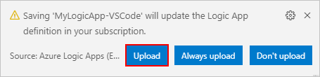

## View your logic app in design view

In Visual Studio Code, you can open your logic app in design view, but only in read-only form. Although you can't edit your logic app in the designer, you can use this view to visually check your logic app's workflow.

In the Azure window, under **Logic Apps**, open your logic app's context menu, and select **Open in Designer**.

The read-only designer opens in a separate window and shows your logic app's workflow, for example:

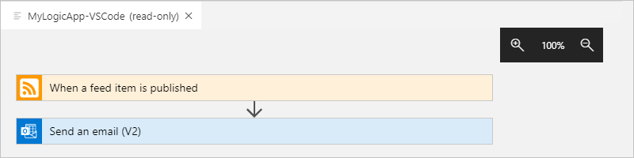

## View your logic app in Azure portal

To review your logic app in Azure portal, follow these steps:

1. Sign in to the [Azure portal](https://portal.azure.com) by using the same Azure account and subscription that's associated with your logic app.

1. In the Azure portal's search box, enter your logic apps' name. From the results list, select your logic app.

   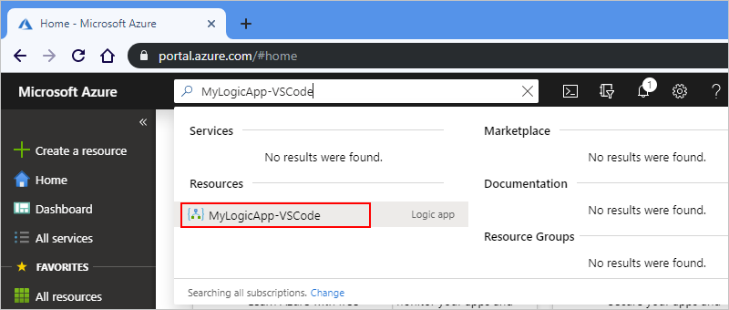

<a name="disable-enable-logic-app"></a>

## Disable or enable your logic app

In Visual Studio Code, when you edit a published logic app, your changes *overwrite* the already deployed app. To avoid breaking your logic app in production and minimize disruption, deactivate your logic app first. You can then reactive your logic app after you've confirmed that your logic app still works.

1. If you haven't signed in to your Azure account and subscription yet from inside Visual Studio Code, follow the [previous steps to sign in now](#sign-in-azure).

1. In the Azure window, under **Logic Apps**, expand your Azure subscription so that you can view all the logic apps in that subscription.

   1. To disable the logic app that you want, open the logic app's menu, and select **Disable**.

      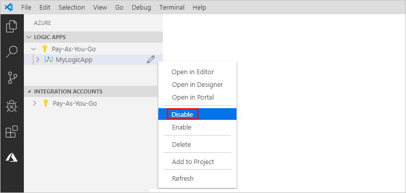

   1. When you're ready to reactivate your logic app, open the logic app's menu, and select **Enable**.

      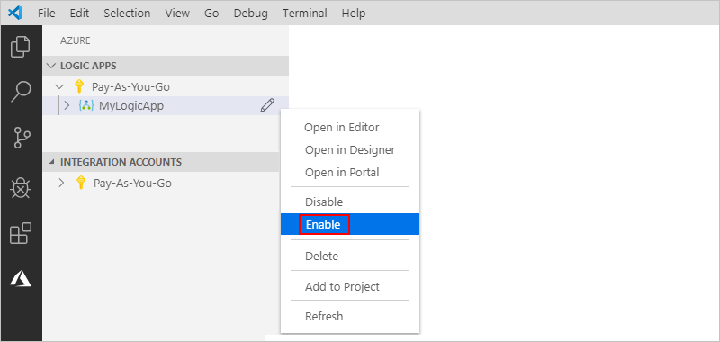

<a name="edit-logic-app"></a>

## Edit a published logic app

For a logic app that's already published in Azure, you can open and edit that logic app's workflow definition from inside Visual Studio Code.

> [!IMPORTANT] 
> Before you edit an actively running logic app in production, 
> avoid the risk in breaking that logic app and minimize disruption by 
> [disabling your logic app first](#disable-enable-logic-app).

1. If you haven't signed in to your Azure account and subscription yet from inside Visual Studio Code, follow the [previous steps to sign in now](#sign-in-azure).

1. In the Azure window, under **Logic Apps**, expand your Azure subscription, and select the logic app you want.

1. Open your logic app's menu, and select **Open in Editor**. Or, next to your logic app's name, select the edit icon.

   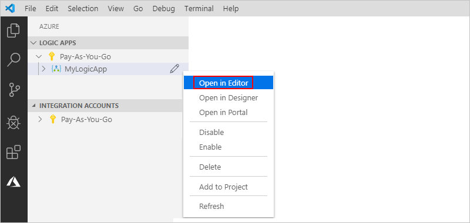

   Visual Studio Code opens the .logicapp.json file for your logic app's workflow definition.

   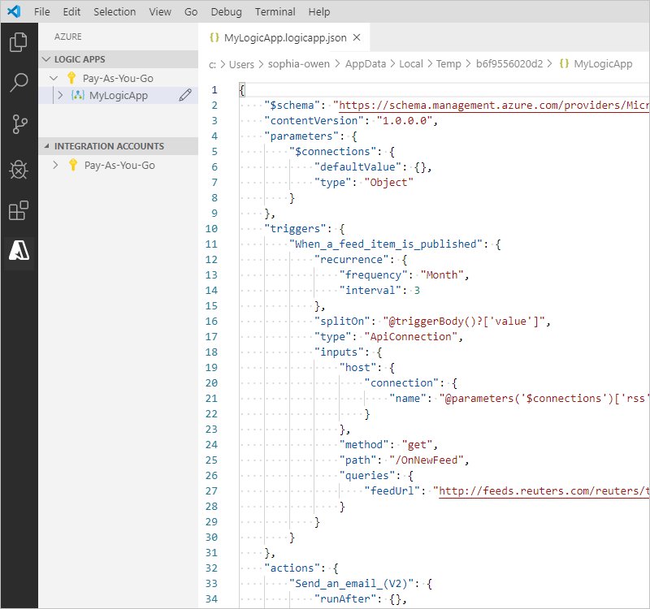

1. Make your changes in the logic app's workflow definition.

1. When you're done, save your changes. (File menu > Save, or press Ctrl+S)

1. When you're prompted to upload your changes and *overwrite* your existing logic app in the Azure portal, select **Upload**.

   This step publishes your updates to your logic app in the [Azure portal](https://portal.azure.com).

   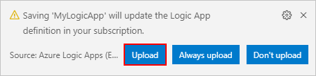

## Next steps

> [!div class="nextstepaction"]
> [Create logic apps with Visual Studio](../logic-apps/quickstart-create-logic-apps-with-visual-studio.md)