# Quickstart: Create and manage automated logic app workflows - Visual Studio Code

With [Azure Logic Apps](../logic-apps/logic-apps-overview.md) 
and Visual Studio Code, you can create and manage logic apps that help 
you automate tasks, workflows, and processes for integrating apps, 
data, systems, and services across organizations and enterprises. 
This quickstart shows how you can create and edit logic app workflow 
definitions by working with the workflow definition schema in 
JavaScript Object Notation (JSON) through a code-based experience. 
You can also work on existing logic apps already deployed to 
<a href="https://docs.microsoft.com/azure/guides/developer/azure-developer-guide" target="_blank">Azure</a> 
in the cloud. 

Although you can perform these same tasks in the 
<a href="https://portal.azure.com" target="_blank">Azure portal</a> 
and in Visual Studio, you can get started faster in Visual Studio 
Code when you're already familiar with logic app definitions and 
want to work directly in code. For example, you can disable, 
enable, delete, and refresh already created logic apps. Also, 
you can work on logic apps and integration accounts from any development 
platform where Visual Studio Code runs, such as Linux, Windows, and Mac.

For this article, you can create the same logic app as in the 
[quickstart for creating a logic app in the Azure portal](../logic-apps/quickstart-create-first-logic-app-workflow.md), 
which focuses more on the basic concepts. In Visual Studio Code, 
the logic app looks like this example:

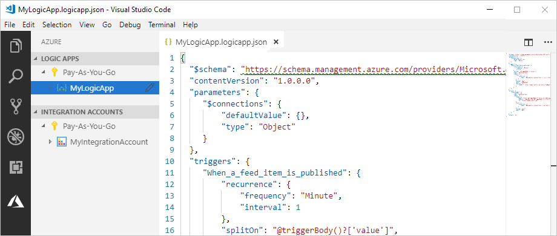

Before you start, make sure you have these items:

* If you don't have an Azure subscription, 
<a href="https://azure.microsoft.com/free/" target="_blank">sign up for a free Azure account</a>.

* Basic knowledge about [logic app workflow definitions](../logic-apps/logic-apps-workflow-definition-language.md) 
and their structure, which uses JavaScript Object Notation (JSON) 

  If you're new to Logic Apps, try the 
  quickstart that walks you through 
  [how to create your first logic app in the Azure portal](../logic-apps/quickstart-create-first-logic-app-workflow.md), 
  which focuses more on the basic concepts. 

* Access to the web for signing in to Azure and your Azure subscription

* Download and install these tools, if you don't have them already: 

  * <a href="https://code.visualstudio.com/" target="_blank">Visual Studio Code version 1.25.1 or later</a>, which is free

  * Visual Studio Code extension for Azure Logic Apps

    You can download and install this extension from the 
    [Visual Studio Marketplace](https://marketplace.visualstudio.com/items?itemName=ms-azuretools.vscode-logicapps) 
    or directly from inside Visual Studio Code. 
    Make sure you reload Visual Studio Code after installing. 

    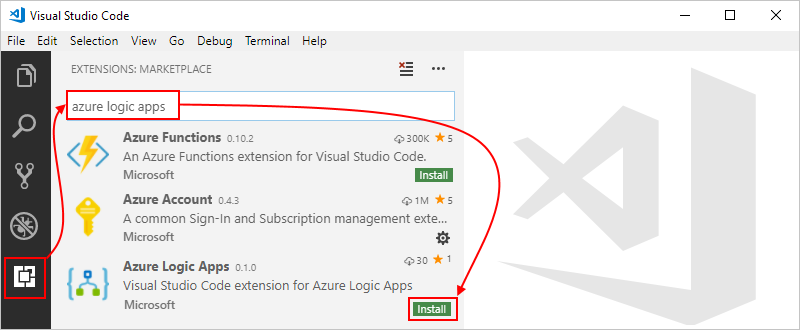

    To check that the extension installed correctly, 
    the Azure icon appears in your Visual Studio Code toolbar. 

    

    For more information, see 
    <a href="https://code.visualstudio.com/docs/editor/extension-gallery" target="_blank">Extension Marketplace</a>. You can also view and submit contributions to this extension's open-source version by visiting the 
    [Azure Logic Apps extension for Visual Studio Code on GitHub](https://github.com/Microsoft/vscode-azurelogicapps). 

<a name="sign-in-azure"></a>

## Sign in to Azure

1. Open Visual Studio Code. On the Visual Studio Code toolbar, 
select the Azure icon. 

   

1. In the Azure window, under **Logic Apps**, 
select **Sign in to Azure**. 

   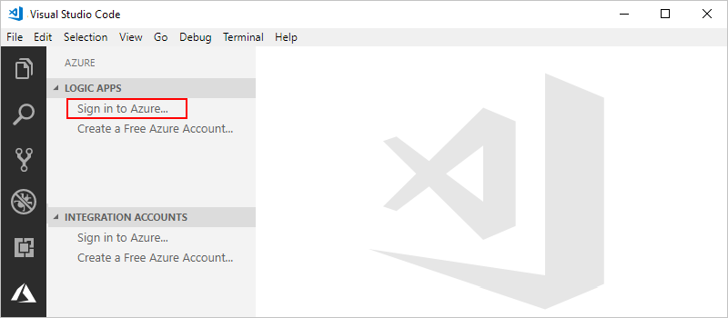

   You're now prompted to sign in by using 
   the provided authentication code. 

1. Copy the authentication code, and then choose **Copy & Open**, 
which opens a new browser window.

   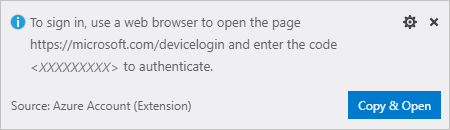

1. Enter your authentication code. When prompted, choose **Continue**.

   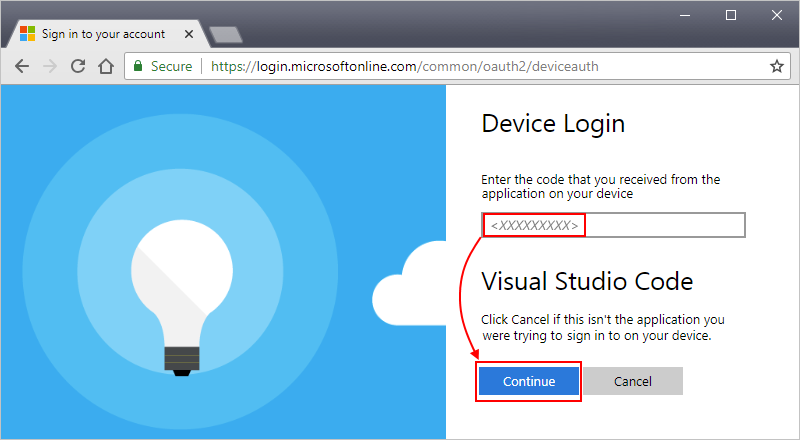

1. Select your Azure account. After you sign in, 
you can close your browser, and return to Visual Studio Code.

   In the Azure window, the Logic Apps pane and 
   Integration Accounts pane now show the Azure 
   subscriptions in your account. 

   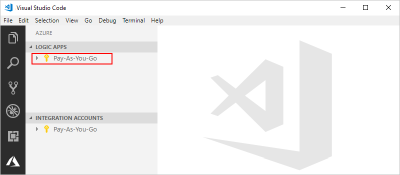

   If you don't see the subscriptions you expect, 
   next to **Logic Apps** label, choose **Select Subscriptions** 
   (filter icon). Find and select the subscriptions you want.

1. To view any existing logic apps or integration accounts in 
your Azure subscription, expand your subscription.

   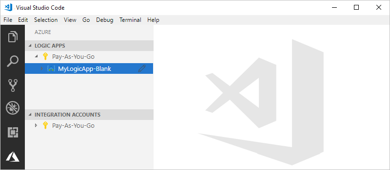

<a name="create-logic-app"></a>

## Create logic app

1. If you haven't signed in to your Azure subscription 
from inside Visual Studio Code, follow the steps in this 
article to [sign in now](#sign-in-azure).

1. From your subscription's context menu, select **Create**.

   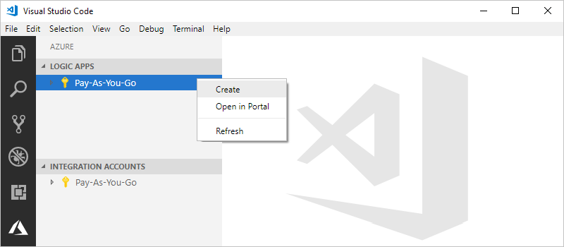

1. From the list that shows Azure resource groups in your subscription, 
select an existing resource group or **Create a new resource group**. 

   This example creates a new resource group:

   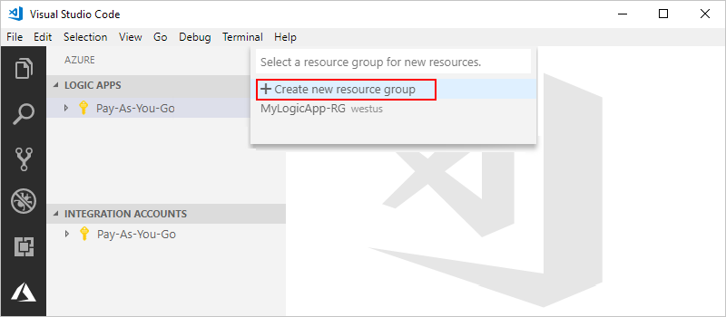

1. Provide a name for your Azure 
resource group, and then press ENTER.

   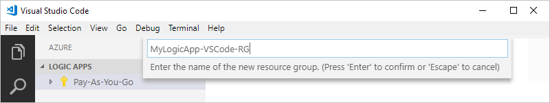

1. Select the datacenter location for 
where to save your logic app's metadata.

   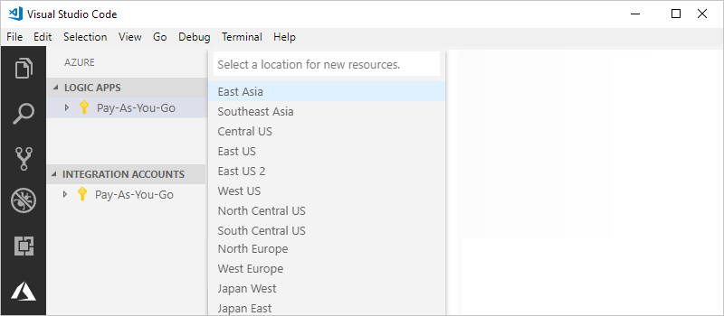

1. Provide a name for your logic app, and then press ENTER.

   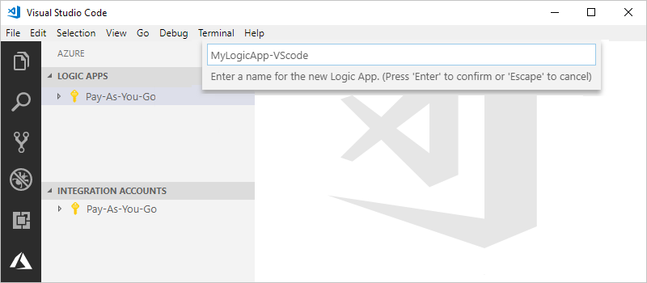

   Your new logic app now appears in the Azure window, 
   under your Azure subscription. Now you can start 
   creating your logic app's workflow definition.

1. From your logic app's shortcut menu, 
select **Open in Editor**. 

   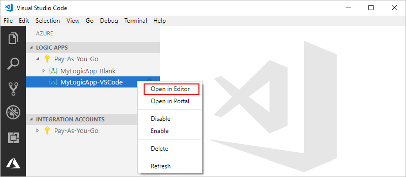

   Visual Studio Code opens a logic app workflow 
   definition template (.logicapp.json file) 
   so you can start creating your logic app's workflow.

   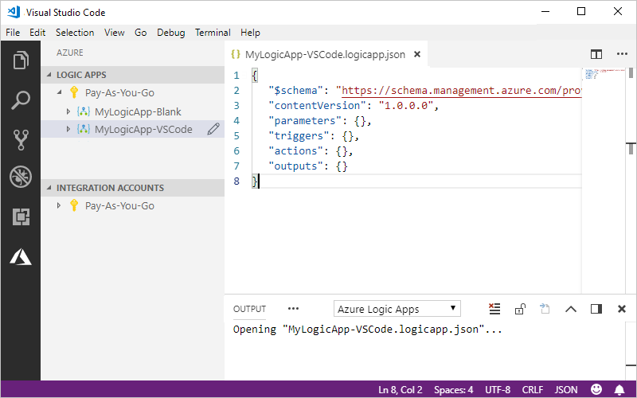

1. In the logic app workflow definition template file, 
start building your logic app's workflow definition. 
For technical reference, see the 
[Workflow Definition Language schema for Azure Logic Apps](../logic-apps/logic-apps-workflow-definition-language.md).

   Here is an example logic definition. Usually, JSON elements appear 
   alphabetically within each section, but this sample shows these 
   elements roughly in the order that the logic app's steps appear on the designer.

   ```json
   {
      "$schema": "https://schema.management.azure.com/providers/Microsoft.Logic/schemas/2016-06-01/workflowdefinition.json#",
      "contentVersion": "1.0.0.0",
      "parameters": {
         "$connections": {
            "defaultValue": {},
            "type": "Object"
         }
      },
      "triggers": {
         "When_a_feed_item_is_published": {
            "recurrence": {
               "frequency": "Minute",
               "interval": 1
            },
            "splitOn": "@triggerBody()?['value']",
            "type": "ApiConnection",
            "inputs": {
               "host": {
                  "connection": {
                     "name": "@parameters('$connections')['rss']['connectionId']"
                  }
               },
               "method": "get",
               "path": "/OnNewFeed",
               "queries": {
                  "feedUrl": "http://feeds.reuters.com/reuters/topNews"
               }
            }
         }
      },
      "actions": {
         "Send_an_email": {
            "runAfter": {},
            "type": "ApiConnection",
            "inputs": {
               "body": {
                  "Body": "Title: @{triggerBody()?['title']}\n\nDate published: @{triggerBody()?['publishDate']}\n\nLink: @{triggerBody()?['primaryLink']}",
                  "Subject": "New RSS item: @{triggerBody()?['title']}",
                  "To": "Sophie.Owen@contoso.com"
               },
               "host": {
                  "connection": {
                     "name": "@parameters('$connections')['outlook']['connectionId']"
                  }
               },
               "method": "post",
               "path": "/Mail"
            }
         }
      },
      "outputs": {}
   }   
   ```

1. When you're done, save your logic app definition file. 
When Visual Studio Code prompts you to confirm uploading 
your logic app definition to your Azure subscription, choose **Upload**.

   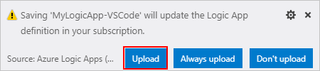

   After Visual Studio Code publishes your logic app to Azure, 
   you can find your app now live and running in the Azure portal. 

   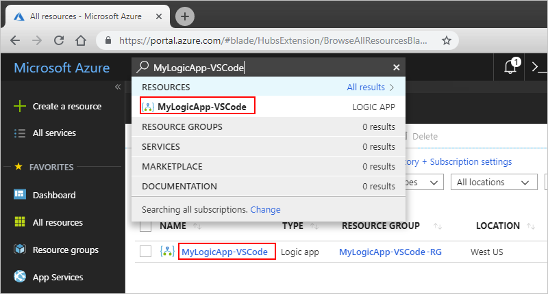

<a name="edit-logic-app"></a>

## Edit logic app

To work on an existing logic app that's already deployed in Azure, 
you can open that app's workflow definition file in Visual Studio Code.

1. If you haven't signed in to your Azure subscription 
from inside Visual Studio Code, follow the steps in this 
article to [sign in now](#sign-in-azure).

1. In the Azure window, under **Logic Apps**, 
expand your Azure subscription, and select the logic app you want. 

1. From your logic app's menu, select **Open in Editor**. 
Or, next to your logic app's name, choose the edit icon.

   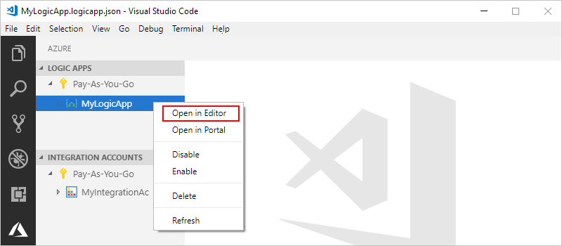

   Visual Studio Code opens the .logicapp.json file 
   for your logic app's workflow definition.

   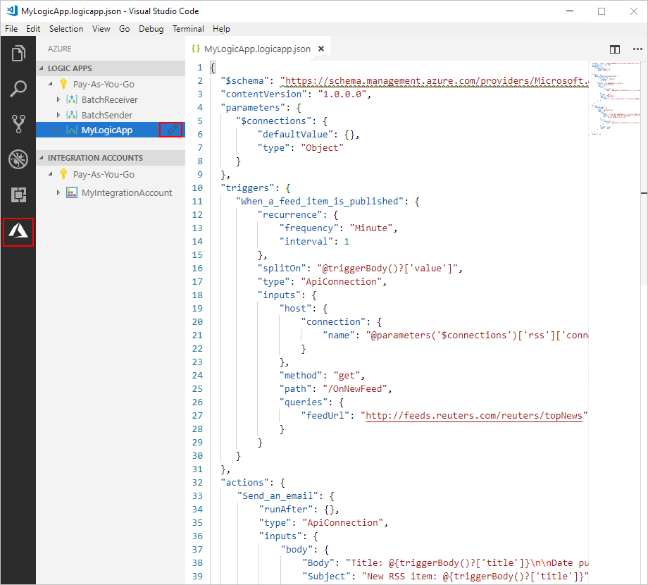

1. Make your changes in your logic app's definition.

1. When you're done, save your changes.

1. When Visual Studio Code prompts you to update your 
logic app definition in your Azure subscription, 
choose **Upload**. 

   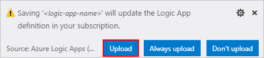

## Get support

* For questions, visit the <a href="https://social.msdn.microsoft.com/Forums/en-US/home?forum=azurelogicapps" target="_blank">Azure Logic Apps forum</a>.
* To submit or vote on feature ideas, visit the <a href="https://aka.ms/logicapps-wish" target="_blank">Logic Apps user feedback site</a>.

