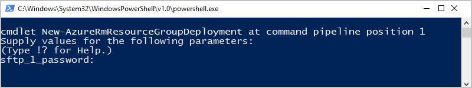

# Quickstart: Create automated tasks, processes, and workflows with Azure Logic Apps - Visual Studio

With [Azure Logic Apps](../logic-apps/logic-apps-overview.md) and Visual Studio, 
you can create workflows for automating tasks and processes that integrate apps, 
data, systems, and services across enterprises and organizations. This quickstart 
shows how you can design and build these workflows by creating logic apps in Visual 
Studio and deploying those apps to Azure. Although you can perform these tasks in 
the Azure portal, Visual Studio lets you add your logic apps to source control, 
publish different versions, and create Azure Resource Manager templates for 
different deployment environments.

If you're new to Azure Logic Apps and just want the basic concepts, try the 
[quickstart for creating a logic app in the Azure portal](../logic-apps/quickstart-create-first-logic-app-workflow.md). 
The Logic App Designer works similarly in both the Azure portal and Visual Studio.

In this quickstart, you create the same logic app with Visual Studio as the 
Azure portal quickstart. This logic app monitors a website's RSS feed and 
sends email for each new item in that feed. Your finished logic app 
looks like this high-level workflow:

## Prerequisites

* An Azure subscription. If you don't have an Azure subscription, 
[sign up for a free Azure account](https://azure.microsoft.com/free/).

* Download and install these tools, if you don't have them already:

  * [Visual Studio 2019, 2017, or 2015 - Community edition or greater](https://aka.ms/download-visual-studio). 
  This quickstart uses Visual Studio Community 2017.

    > [!IMPORTANT]
    > When you install Visual Studio 2019 or 2017, make sure 
    > that you select the **Azure development** workload.

  * [Microsoft Azure SDK for .NET (2.9.1 or later)](https://azure.microsoft.com/downloads/). 
  Learn more about [Azure SDK for .NET](https://docs.microsoft.com/dotnet/azure/dotnet-tools?view=azure-dotnet).

  * [Azure PowerShell](https://github.com/Azure/azure-powershell#installation)

  * Azure Logic Apps Tools for the Visual Studio version you want:

    * [Visual Studio 2019](https://aka.ms/download-azure-logic-apps-tools-visual-studio-2019)

    * [Visual Studio 2017](https://aka.ms/download-azure-logic-apps-tools-visual-studio-2017)

    * [Visual Studio 2015](https://aka.ms/download-azure-logic-apps-tools-visual-studio-2015)
  
    You can either download and install Azure Logic Apps Tools 
    directly from the Visual Studio Marketplace, or learn 
    [how to install this extension from inside Visual Studio](https://docs.microsoft.com/visualstudio/ide/finding-and-using-visual-studio-extensions). 
    Make sure that you restart Visual Studio after you finish installing.

* Access to the web while using the embedded Logic App Designer

  The designer needs an internet connection to create resources in Azure 
  and to read properties and data from connectors in your logic app. 
  For example, for Dynamics CRM Online connections, the designer 
  checks your CRM instance for default and custom properties.

* An email account that's supported by Logic Apps, such as 
Office 365 Outlook, Outlook.com, or Gmail. For other providers, 
[review the connectors list here](https://docs.microsoft.com/connectors/). 
This example uses Office 365 Outlook. If you use a different provider, 
the overall steps are the same, but your UI might slightly differ.

## Create Azure resource group project

To get started, create an [Azure Resource Group project](../azure-resource-manager/vs-azure-tools-resource-groups-deployment-projects-create-deploy.md). 
Learn more about [Azure resource groups and resources](../azure-resource-manager/resource-group-overview.md).

1. Start Visual Studio. Sign in with your Azure account.

1. On the **File** menu, select **New** > **Project**. (Keyboard: Ctrl+Shift+N)

   

1. Under **Installed**, select **Visual C#** or **Visual Basic**. 
Select **Cloud** > **Azure Resource Group**. Name your project, 
for example:

   

   > [!NOTE]
   > If **Cloud** or **Azure Resource Group** doesn't appear, 
   > make sure you install the Azure SDK for Visual Studio.

   If you're using Visual Studio 2019, follow these steps:

   1. In the **Create a new project** box, select the 
   **Azure Resource Group** project for Visual C# 
   or Visual Basic. Choose **Next**.

   1. Provide a name for the Azure resource group you want to use 
   and other project information. Choose **Create**.

1. From the template list, select the **Logic App** template. Choose **OK**.

   

   After Visual Studio creates your project, 
   Solution Explorer opens and shows your solution. 
   In your solution, the **LogicApp.json** file not only 
   stores your logic app definition but is also an Azure 
   Resource Manager template that you can use for deployment.

   

## Create blank logic app

When you have your Azure Resource Group project, 
create your logic app with the **Blank Logic App** template.

1. In Solution Explorer, open the **LogicApp.json** file's shortcut menu. 
Select **Open With Logic App Designer**. (Keyboard: Ctrl+L)

   

   > [!TIP]
   > If you don't have this command in Visual Studio 2019, check that you have the latest updates for Visual Studio.

   Visual Studio prompts you for your Azure subscription 
   and an Azure resource group for creating and deploying 
   resources for your logic app and connections.

1. For **Subscription**, select your Azure subscription. 
For **Resource group**, select **Create New** to create a new Azure resource group.

   

   | Setting | Example value | Description |
   | ------- | ------------- | ----------- |
   | User profile list | Contoso   jamalhartnett@contoso.com | By default, the account that you used to sign in |
   | **Subscription** | Pay-As-You-Go   (jamalhartnett@contoso.com) | The name for your Azure subscription and associated account |
   | **Resource Group** | MyLogicApp-RG   (West US) | The Azure resource group and location for storing and deploying your logic app's resources |
   | **Location** | MyLogicApp-RG2   (West US) | A different location if you don't want to use the resource group location |
   ||||

1. The Logic Apps Designer opens a page that shows an introduction 
video and commonly used triggers. Scroll down past the video and 
triggers to **Templates**, and select **Blank Logic App**.

   

## Build logic app workflow

Next, add an RSS [trigger](../logic-apps/logic-apps-overview.md#logic-app-concepts) 
that fires when a new feed item appears. Every logic app starts with a trigger, 
which fires when specific criteria is met. Each time the trigger fires, 
the Logic Apps engine creates a logic app instance that runs your workflow.

1. In Logic App Designer, under the search box, choose **All**.
In the search box, enter "rss". From the triggers list, 
select this trigger: **When a feed item is published - RSS**

   

1. After the trigger appears in the designer, finish building 
the logic app by following the workflow steps in the 
[Azure portal quickstart](../logic-apps/quickstart-create-first-logic-app-workflow.md#add-rss-trigger), 
then return to this article. When you're done, your logic app 
looks like this example:

   

1. Save your Visual Studio solution. (Keyboard: Ctrl + S)

## Deploy logic app to Azure

Before you can run and test your logic app, deploy the app to Azure from Visual Studio.

1. In Solution Explorer, on your project's shortcut menu, 
select **Deploy** > **New**. If prompted, sign in with your Azure account.

   

1. For this deployment, keep the default Azure subscription, 
resource group, and other settings. Choose **Deploy**.

   

1. If the **Edit Parameters** box appears, provide a 
resource name for your logic app. Save your settings.

   

   When deployment starts, your app's deployment status appears in 
   the Visual Studio **Output** window. If the status doesn't appear, 
   open the **Show output from** list, and select your Azure resource group.

   

   If your selected connectors need input from you, a PowerShell 
   window opens in the background and prompts for any necessary 
   passwords or secret keys. After you enter this information, 
   deployment continues.

   

   After deployment finishes, your logic app is live in the 
   Azure portal and runs on your specified schedule 
   (every minute). If the trigger finds new feed items, 
   the trigger fires, which creates a workflow instance 
   that runs your logic app's actions. Your logic app sends 
   email for each new item. Otherwise, if the trigger 
   doesn't find new items, the trigger doesn't fire and 
   "skips" instantiating the workflow. Your logic app 
   waits until the next interval before checking.

   Here are sample emails that this logic app sends. 
   If you don't get any emails, check your junk email folder.

   

Congratulations, you've successfully built and deployed your logic app with 
Visual Studio. To manage your logic app and review its run history, see 
[Manage logic apps with Visual Studio](../logic-apps/manage-logic-apps-with-visual-studio.md).

## Clean up resources

When you're done with your logic app, delete the resource 
group that contains your logic app and related resources.

1. Sign in to the [Azure portal](https://portal.azure.com) 
with the same account used to create your logic app.

1. On the main Azure menu, select **Resource groups**.
Select your logic app's resource group, and select **Overview**.

1. On the **Overview** page, choose **Delete resource group**. 
Enter the resource group name as confirmation, and choose **Delete**.

   

1. Delete the Visual Studio solution from your local computer.

## Next steps

In this article, you built, deployed, and ran your logic app with Visual Studio. 
To learn about managing and performing advanced deployment 
for logic apps with Visual Studio, see these articles:

> [!div class="nextstepaction"]
> * [Manage logic apps with Visual Studio](../logic-apps/manage-logic-apps-with-visual-studio.md)