# Quickstart: Create and automate tasks, processes, and workflows with Azure Logic Apps - Visual Studio

With [Azure Logic Apps](../logic-apps/logic-apps-overview.md) and Visual Studio, 
you can create workflows for automating tasks and processes that integrate apps, 
data, systems, and services across enterprises and organizations. 
This quickstart shows how you can design and build these workflows 
by creating logic apps in Visual Studio and deploying those apps to 
<a href="https://docs.microsoft.com/azure/guides/developer/azure-developer-guide" target="_blank">Azure</a> in the cloud. 
And although you can perform these tasks in the 
<a href="https://portal.azure.com" target="_blank">Azure portal</a>, 
Visual Studio lets you add logic apps to source control, publish different versions, 
and create Azure Resource Manager templates for different deployment environments. 

If you're new to Azure Logic Apps and just want the basic concepts, try the 
[quickstart for creating a logic app in the Azure portal](../logic-apps/quickstart-create-first-logic-app-workflow.md) instead. 
The Logic App Designer in both the Azure portal and Visual Studio work similarly. 

Here, you create the same logic app as in the Azure portal quickstart 
but with Visual Studio. This logic app monitors a website's RSS feed 
and sends email for each new item posted on the site. 
When you're done, your logic app looks like this high-level workflow:

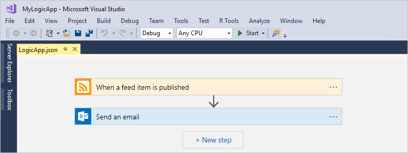

Before you start, make sure that you have these items:

* If you don't have an Azure subscription, 
<a href="https://azure.microsoft.com/free/" target="_blank">sign up for a free Azure account</a>.

* Download and install these tools, if you don't have them already: 

  * <a href="https://www.visualstudio.com/downloads" target="_blank">Visual Studio 2017 or Visual Studio 2015 - Community edition or greater</a>. 
  This quickstart uses Visual Studio Community 2017, which is free.

  * <a href="https://azure.microsoft.com/downloads/" target="_blank">Microsoft Azure SDK for .NET (2.9.1 or later)</a> 
  and <a href="https://github.com/Azure/azure-powershell#installation" target="_blank">Azure PowerShell</a>. 
  Learn more about <a href="https://docs.microsoft.com/dotnet/azure/dotnet-tools?view=azure-dotnet">Azure SDK for .NET</a>.

  * <a href="https://marketplace.visualstudio.com/items?itemName=VinaySinghMSFT.AzureLogicAppsToolsforVisualStudio-18551" target="_blank">Azure Logic Apps Tools for Visual Studio 2017</a> 
  or the <a href="https://marketplace.visualstudio.com/items?itemName=VinaySinghMSFT.AzureLogicAppsToolsforVisualStudio" target="_blank">Visual Studio 2015 version</a>
  
    You can either download and install Azure Logic Apps Tools 
    directly from the Visual Studio Marketplace, or learn 
    <a href="https://docs.microsoft.com/visualstudio/ide/finding-and-using-visual-studio-extensions" target="_blank">how to install this extension from inside Visual Studio</a>. 
    Make sure that you restart Visual Studio after you finish installing.

* An email account that's supported by Logic Apps, 
such as Office 365 Outlook, Outlook.com, or Gmail. For other providers, 
<a href="https://docs.microsoft.com/connectors/" target="_blank">review the connectors list here</a>. 
This logic app uses Office 365 Outlook. If you use a different provider, 
the overall steps are the same, but your UI might slightly differ.

* Access to the web while using the embedded Logic App Designer

  The designer requires an internet connection to create resources in Azure 
  and to read the properties and data from connectors in your logic app. 
  For example, if you use the Dynamics CRM Online connector, 
  the designer checks your CRM instance for available 
  default and custom properties.

## Create Azure resource group project

To get started, create an [Azure Resource Group project](../azure-resource-manager/vs-azure-tools-resource-groups-deployment-projects-create-deploy.md). 
Learn more about [Azure resource groups and resources](../azure-resource-manager/resource-group-overview.md).

1. Start Visual Studio and sign in with your Azure account.

2. On the **File** menu, select **New** > **Project**. (Keyboard: Ctrl+Shift+N)

   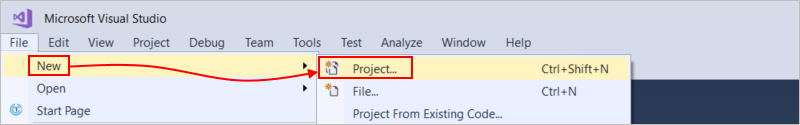

3. Under **Installed**, select **Visual C#** or **Visual Basic**. 
Select **Cloud** > **Azure Resource Group**. Name your project, 
for example:

   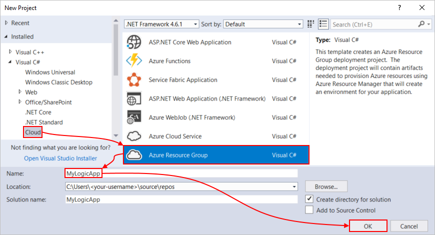

4. Select the **Logic App** template. 

   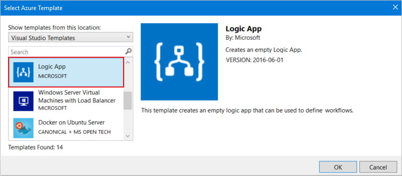

   After Visual Studio creates your project, 
   Solution Explorer opens and shows your solution. 

   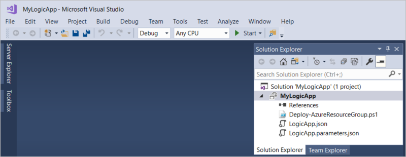

   In your solution, the **LogicApp.json** file not only 
   stores the definition for your logic app but is also 
   an Azure Resource Manager template that you can set up for deployment.

## Create blank logic app

After you create your Azure Resource Group project, 
create and build your logic app starting 
from the **Blank Logic App** template.

1. In Solution Explorer, open the shortcut menu for the **LogicApp.json** file. 
Select **Open With Logic App Designer**. (Keyboard: Ctrl+L)

   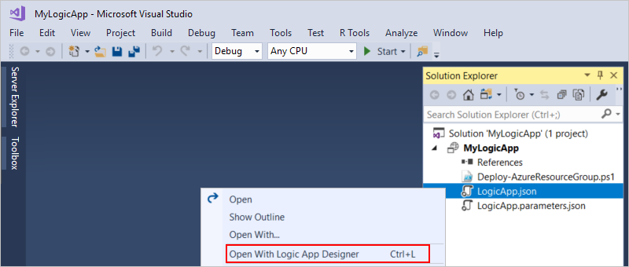

2. For **Subscription**, select the Azure subscription that you to use. 
For **Resource Group**, select **Create New...**, 
which creates a new Azure resource group. 

   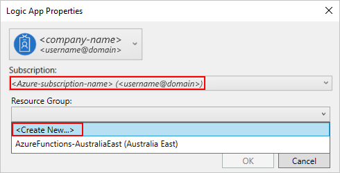

   Visual Studio needs your Azure subscription 
   and a resource group for creating and deploying 
   resources associated with your logic app and connections. 

   | Setting | Example value | Description | 
   | ------- | ------------- | ----------- | 
   | User profile list | Contoso   jamalhartnett@contoso.com | By default, the account that you used to sign in | 
   | **Subscription** | Pay-As-You-Go   (jamalhartnett@contoso.com) | The name for your Azure subscription and associated account |
   | **Resource Group** | MyLogicApp-RG   (West US) | The Azure resource group and location for storing and deploying resources for your logic app | 
   | **Location** | MyLogicApp-RG2   (West US) | A different location if you don't want to use the resource group location |
   ||||

3. The Logic Apps Designer opens and shows a page with 
an introduction video and commonly used triggers. 
Scroll past the video and triggers. Under **Templates**, 
select **Blank Logic App**.

   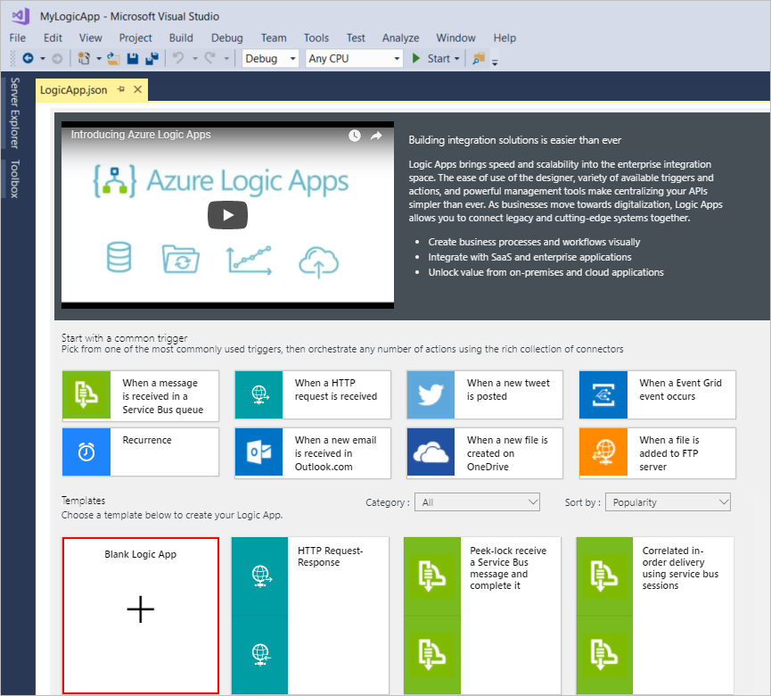

## Build logic app workflow

Next, add a [trigger](../logic-apps/logic-apps-overview.md#logic-app-concepts) 
that fires when a new RSS feed item appears. Every logic app must start with a trigger, 
which fires when specific criteria is met. Each time the trigger fires, 
the Logic Apps engine creates a logic app instance that runs your workflow.

1. In Logic App Designer, enter "rss" in the search box. 
Select this trigger: **When a feed item is published**

   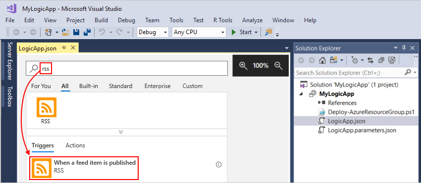

   The trigger now appears in the designer:

   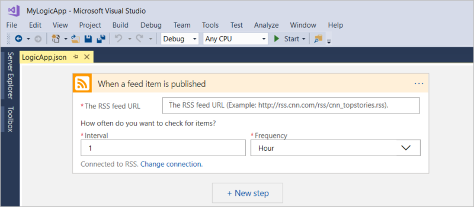

2. To finish building the logic app, follow the workflow steps in the 
[Azure portal quickstart](../logic-apps/quickstart-create-first-logic-app-workflow.md#add-rss-trigger), 
then return to this article.

   When you're done, your logic app looks like this example: 

   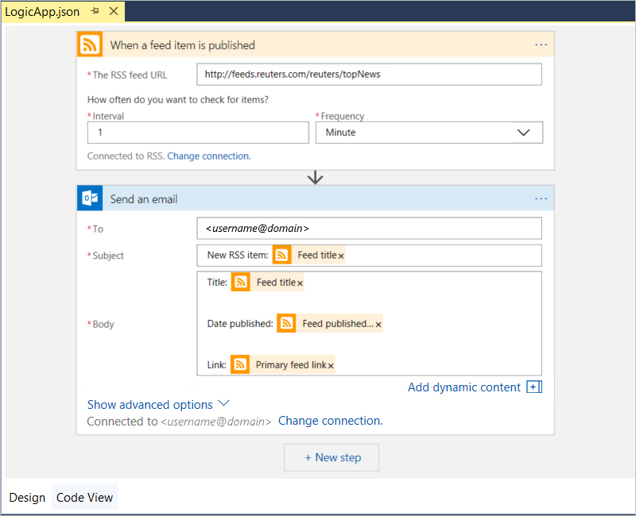

3. To save your logic app, save your Visual Studio solution. 
(Keyboard: Ctrl + S)

Now, before you can test your logic app, deploy your app to Azure.

## Deploy logic app to Azure

Before you can run your logic app, 
deploy the app from Visual Studio to Azure, 
which just takes a few steps.

1. In Solution Explorer, on your project's shortcut menu, 
select **Deploy** > **New**. If prompted, 
sign in with your Azure account.

   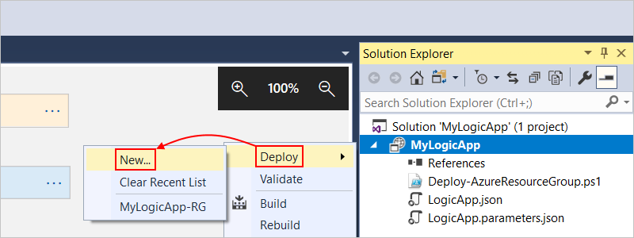

2. For this deployment, keep the Azure subscription, 
resource group, and other default settings. 
When you're ready, choose **Deploy**. 

   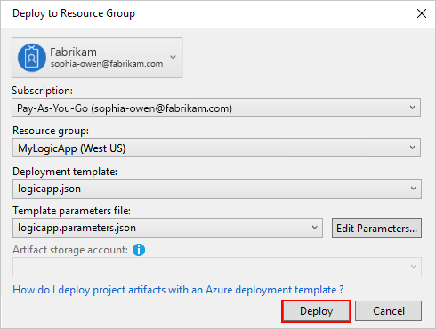

3. If the **Edit Parameters** box appears, 
provide the resource name for the logic app to use at deployment, 
then save your settings, for example:

   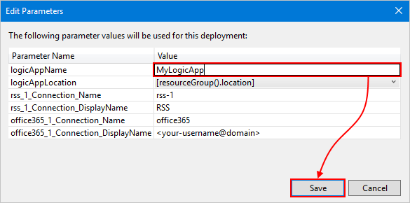

   When deployment starts, your app's deployment status 
   appears in the Visual Studio **Output** window. 
   If the status doesn't appear, 
   open the **Show output from** list, 
   and select your Azure resource group.

   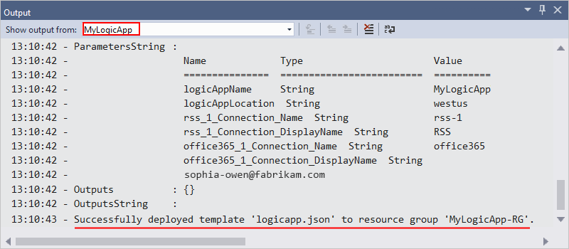

   After deployment finishes, your logic app is 
   live in the Azure portal and checks the RSS 
   feed based on your specified schedule (every minute). 
   If the RSS feed has new items, your logic 
   app sends an email for each new item. 
   Otherwise, your logic app waits until 
   the next interval before checking again. 

   For example, here are sample emails that this logic app sends. 
   If you don't get any emails, check your junk email folder. 

   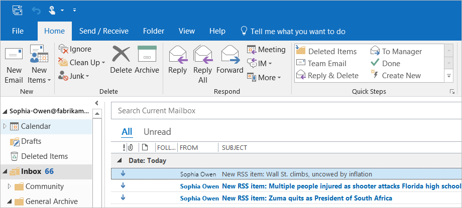

   Technically, when the trigger checks the RSS 
   feed and finds new items, the trigger fires, 
   and the Logic Apps engine creates an 
   instance of your logic app workflow 
   that runs the actions in the workflow.
   If the trigger doesn't find new items, 
   the trigger doesn't fire and "skips" 
   instantiating the workflow.

Congratulations, you've now successfully built and 
deployed your logic app with Visual Studio! 
To manage your logic app and review its run history, 
see [Manage logic apps with Visual Studio](../logic-apps/manage-logic-apps-with-visual-studio.md).

## Clean up resources

When no longer needed, delete the resource group that 
contains your logic app and related resources.

1. Sign in to the <a href="https://portal.azure.com" target="_blank">Azure portal</a> 
with the same account used to create your logic app. 

2. On the main Azure menu, select **Resource groups**.
Select the resource group for your logic app, and then select **Overview**.

3. On the **Overview** page, choose **Delete resource group**. 
Enter the resource group name as confirmation, 
and choose **Delete**.

   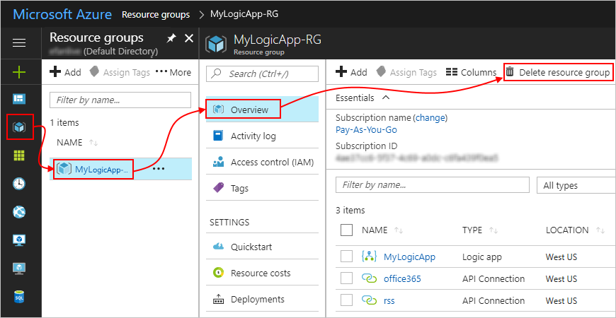

4. Delete the Visual Studio solution from your local computer.

## Get support

* For questions, visit the <a href="https://social.msdn.microsoft.com/Forums/en-US/home?forum=azurelogicapps" target="_blank">Azure Logic Apps forum</a>.
* To submit or vote on feature ideas, visit the <a href="http://aka.ms/logicapps-wish" target="_blank">Logic Apps user feedback site</a>.

## Next steps

In this article, you built, deployed, and ran your logic app with Visual Studio. 
To learn more about managing and performing advanced deployment 
for logic apps with Visual Studio, see these articles:

> [!div class="nextstepaction"]
> * [Manage logic apps with Visual Studio](../logic-apps/manage-logic-apps-with-visual-studio.md)
> * [Create deployment templates for logic apps with Visual Studio](../logic-apps/logic-apps-create-deploy-template.md)
