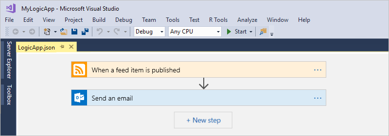
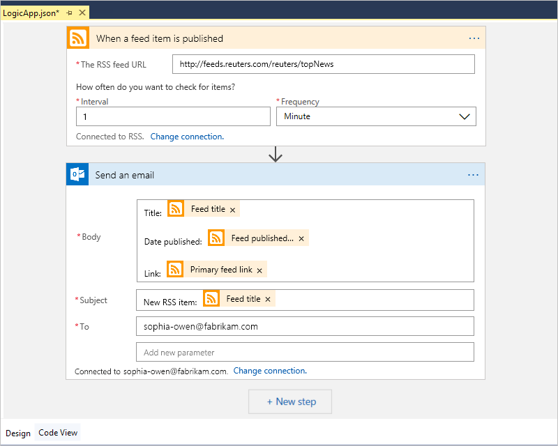
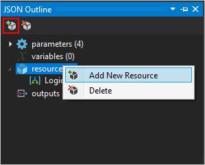
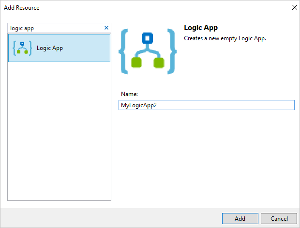
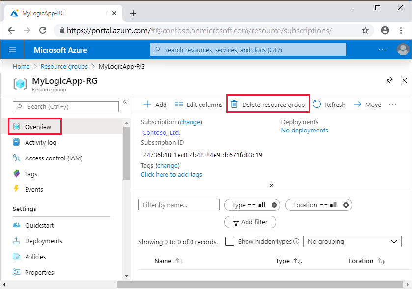

# Quickstart: Create automated integration workflows with multi-tenant Azure Logic Apps and Visual Studio

[!INCLUDE [logic-apps-sku-consumption](../../includes/logic-apps-sku-consumption.md)]

This quickstart shows how to design, develop, and deploy automated workflows that integrate apps, data, systems, and services across enterprises and organizations by using multi-tenant [Azure Logic Apps](../logic-apps/logic-apps-overview.md) and Visual Studio. Although you can perform these tasks in the Azure portal, Visual Studio lets you add your logic apps to source control, publish different versions, and create Azure Resource Manager templates for different deployment environments. For more information about multi-tenant versus single-tenant model, review [Single-tenant versus multi-tenant and integration service environment](single-tenant-overview-compare.md).

If you're new to Azure Logic Apps and just want the basic concepts, try the [quickstart for creating an example Consumption logic app workflow in the Azure portal](quickstart-create-example-consumption-workflow.md). The workflow designer works similarly in both the Azure portal and Visual Studio.

In this quickstart, you create the same logic app workflow with Visual Studio as the Azure portal quickstart. You can also learn to [create an example logic app workflow in Visual Studio Code](quickstart-create-logic-apps-visual-studio-code.md), and [create and manage logic app workflows using the Azure CLI](quickstart-logic-apps-azure-cli.md). This logic app workflow monitors a website's RSS feed and sends email for each new item in that feed. Your finished logic app workflow looks like the following high-level workflow:

## Prerequisites

* An Azure account and subscription. If you don't have a subscription, [sign up for a free Azure account](https://azure.microsoft.com/free/). If you have an Azure Government subscription, follow these additional steps to [set up Visual Studio for Azure Government Cloud](#azure-government).

* Download and install these tools, if you don't have them already:

  * [Visual Studio 2019, 2017, or 2015 - Community edition](https://aka.ms/download-visual-studio), which is free. The Azure Logic Apps extension is currently unavailable for Visual Studio 2022. This quickstart uses Visual Studio Community 2017.

    > [!IMPORTANT]
    > If you use Visual Studio 2019 or 2017, make sure that you select the **Azure development** workload. 

  * [Microsoft Azure SDK for .NET (2.9.1 or later)](https://azure.microsoft.com/downloads/). Learn more about [Azure SDK for .NET](/dotnet/azure/intro).

  * [Azure PowerShell](https://github.com/Azure/azure-powershell#installation)

  * The corresponding Azure Logic Apps Tools for the Visual Studio extension, currently unavailable for Visual Studio 2022:

    * [Visual Studio 2019](https://aka.ms/download-azure-logic-apps-tools-visual-studio-2019)

    * [Visual Studio 2017](https://aka.ms/download-azure-logic-apps-tools-visual-studio-2017)

    * [Visual Studio 2015](https://aka.ms/download-azure-logic-apps-tools-visual-studio-2015)

    You can either download and install Azure Logic Apps Tools directly from the Visual Studio Marketplace, or learn [how to install this extension from inside Visual Studio](/visualstudio/ide/finding-and-using-visual-studio-extensions). Make sure that you restart Visual Studio after you finish installing.

* Access to the web while using the embedded workflow designer

  The designer needs an internet connection to create resources in Azure and to read properties and data from connectors in your logic app.

* An email account that's supported by Azure Logic Apps, such as Outlook for Microsoft 365, Outlook.com, or Gmail. For other providers, review the [connectors list here](/connectors/). This example uses Office 365 Outlook. If you use a different provider, the overall steps are the same, but your UI might slightly differ.

  > [!IMPORTANT]
  > If you want to use the Gmail connector, only G-Suite business accounts can use this connector without restriction in logic apps. 
  > If you have a Gmail consumer account, you can use this connector with only specific Google-approved services, or you can 
  > [create a Google client app to use for authentication with your Gmail connector](/connectors/gmail/#authentication-and-bring-your-own-application). 
  > For more information, see [Data security and privacy policies for Google connectors in Azure Logic Apps](../connectors/connectors-google-data-security-privacy-policy.md).

* If your logic app workflow needs to communicate through a firewall that limits traffic to specific IP addresses, that firewall needs to allow access for *both* the [inbound](logic-apps-limits-and-config.md#inbound) and [outbound](logic-apps-limits-and-config.md#outbound) IP addresses used by the Azure Logic Apps service or runtime in the Azure region where your logic app resource exists. If your logic app workflow also uses [managed connectors](../connectors/managed.md), such as the Office 365 Outlook connector or SQL connector, or uses [custom connectors](/connectors/custom-connectors/), the firewall also needs to allow access for *all* the [managed connector outbound IP addresses](logic-apps-limits-and-config.md#outbound) in your logic app resource's Azure region.

## Set up Visual Studio for Azure Government

### Visual Studio 2017

You can use the [Azure Environment Selector Visual Studio extension](https://devblogs.microsoft.com/azuregov/introducing-the-azure-environment-selector-visual-studio-extension/), which you can download and install from the [Visual Studio Marketplace](https://marketplace.visualstudio.com/items?itemName=SteveMichelotti.AzureEnvironmentSelector).

### Visual Studio 2019

To work with Azure Government subscriptions in Azure Logic Apps, you need to [add a discovery endpoint for Azure Government Cloud to Visual Studio](../azure-government/documentation-government-connect-vs.md). However, *before you sign in to Visual Studio with your Azure Government account*, you need to rename the JSON file that's generated after you add the discovery endpoint by following these steps:

1. Close Visual Studio.

1. Find the generated JSON file named `Azure U.S. Government-A3EC617673C6C70CC6B9472656832A26.Configuration` at this location:

   `%localappdata%\.IdentityService\AadConfigurations`
 
1. Rename the JSON file to `AadProvider.Configuration.json`.

1. Restart Visual Studio.

1. Continue with the steps to sign in with your Azure Government account.

To revert this setup, delete the JSON file at the following location, and restart Visual Studio:

`%localappdata%\.IdentityService\AadConfigurations\AadProvider.Configuration.json`

## Create Azure resource group project

To get started, create an [Azure Resource Group project](../azure-resource-manager/templates/create-visual-studio-deployment-project.md). Learn more about [Azure resource groups and resources](../azure-resource-manager/management/overview.md).

1. Start Visual Studio. Sign in with your Azure account.

1. On the **File** menu, select **New** > **Project**. (Keyboard: Ctrl + Shift + N)

   

1. Under **Installed**, select **Visual C#** or **Visual Basic**. Select **Cloud** > **Azure Resource Group**. Name your project, for example:

   

   > [!NOTE]
   > Resource group names can contain only letters, numbers, 
   > periods (`.`), underscores (`_`), hyphens (`-`), and 
   > parentheses (`(`, `)`), but can't *end* with periods (`.`).
   >
   > If **Cloud** or **Azure Resource Group** doesn't appear, 
   > make sure you install the Azure SDK for Visual Studio.

   If you're using Visual Studio 2019, follow these steps:

   1. In the **Create a new project** box, select the **Azure Resource Group** project for Visual C# or Visual Basic. Select **Next**.

   1. Provide a name for the Azure resource group you want to use and other project information. Select **Create**.

1. From the template list, select the **Logic App** template. Select **OK**.

   

   After Visual Studio creates your project, Solution Explorer opens and shows your solution. In your solution, the **LogicApp.json** file not only stores your logic app definition but is also an Azure Resource Manager template that you can use for deployment.

   

## Create blank logic app

When you have your Azure Resource Group project, create your logic app with the **Blank Logic App** template.

1. In Solution Explorer, open the **LogicApp.json** file's shortcut menu. Select **Open With Logic App Designer**. (Keyboard: Ctrl + L)

   

   > [!TIP]
   > If you don't have this command in Visual Studio 2019, check that you have the latest updates for Visual Studio.

   Visual Studio prompts you for your Azure subscription and an Azure resource group for creating and deploying resources for your logic app and connections.

1. For **Subscription**, select your Azure subscription. For **Resource group**, select **Create New** to create another Azure resource group.

   

   | Setting | Example value | Description |
   | ------- | ------------- | ----------- |
   | User account | Fabrikam   sophia-owen@fabrikam.com | The account that you used when you signed in to Visual Studio |
   | **Subscription** | Pay-As-You-Go   (sophia-owen@fabrikam.com) | The name for your Azure subscription and associated account |
   | **Resource Group** | MyLogicApp-RG   (West US) | The Azure resource group and location for storing and deploying your logic app's resources |
   | **Location** | **Same as Resource Group** | The location type and specific location for deploying your logic app. The location type is either an Azure region or an existing [integration service environment (ISE)](connect-virtual-network-vnet-isolated-environment.md). 
For this quickstart, keep the location type set to **Region** and the location set to **Same as Resource Group**. 
**Note**: After you create your resource group project, you can [change the location type and the location](manage-logic-apps-with-visual-studio.md#change-location), but different location type affects your logic app in various ways. |
   ||||

1. The workflow designer opens a page that shows an introduction video and commonly used triggers. Scroll down past the video and triggers to **Templates**, and select **Blank Logic App**.

   

## Build logic app workflow

Next, add an RSS [trigger](../logic-apps/logic-apps-overview.md#logic-app-concepts) that fires when a new feed item appears. Every logic app starts with a trigger, which fires when specific criteria is met. Each time the trigger fires, the Azure Logic Apps engine creates a logic app instance that runs your workflow.

1. In workflow designer, under the search box, select **All**. In the search box, enter "rss". From the triggers list, select this trigger: **When a feed item is published**

   

1. After the trigger appears in the designer, finish building the logic app workflow by following the workflow steps in the [Azure portal quickstart](../logic-apps/quickstart-create-example-consumption-workflow.md#add-rss-trigger), then return to this article. When you're done, your logic app looks like this example:

   

1. Save your Visual Studio solution. (Keyboard: Ctrl + S)

## Deploy logic app to Azure

Before you can run and test your logic app, deploy the app to Azure from Visual Studio.

1. In Solution Explorer, on your project's shortcut menu, select **Deploy** > **New**. If prompted, sign in with your Azure account.

   

1. For this deployment, keep the default Azure subscription, resource group, and other settings. Select **Deploy**.

   

1. If the **Edit Parameters** box appears, provide a resource name for your logic app. Save your settings.

   

   When deployment starts, your app's deployment status appears in the Visual Studio **Output** window. If the status doesn't appear, open the **Show output from** list, and select your Azure resource group.

   

   If your selected connectors need input from you, a PowerShell window opens in the background and prompts for any necessary passwords or secret keys. After you enter this information, deployment continues.

   

   After deployment finishes, your logic app is live in the Azure portal and runs on your specified schedule (every minute). If the trigger finds new feed items, the trigger fires and creates a workflow instance that runs your logic app workflow's actions. Your workflow sends email for each new item. Otherwise, if the trigger doesn't find new items, the trigger doesn't fire and "skips" instantiating the workflow. Your workflow waits until the next interval before checking.

   Here are sample emails that this workflow sends. If you don't get any emails, check your junk email folder.

   

Congratulations, you've successfully built and deployed your logic app workflow with Visual Studio. To manage your logic app workflow and review its run history, see [Manage logic apps with Visual Studio](manage-logic-apps-with-visual-studio.md).

## Add new logic app

When you have an existing Azure Resource Group project, you can add a new blank logic app to that project by using the JSON Outline window.

1. In Solution Explorer, open the `<logic-app-name>.json` file.

1. From the **View** menu, select **Other Windows** > **JSON Outline**.

1. To add a resource to the template file, select **Add Resource** at the top of the JSON Outline window. Or in the JSON Outline window, open the **resources** shortcut menu, and select **Add New Resource**.

   

1. In the **Add Resource** dialog box, in the search box, find `logic app`, and select **Logic App**. Name your logic app resource, and select **Add**.

   

## Clean up resources

When you're done with your logic app, delete the resource group that contains your logic app and related resources.

1. Sign in to the [Azure portal](https://portal.azure.com) with the same account used to create your logic app.

1. On the Azure portal menu, select **Resource groups**, or search for and select **Resource groups** from any page. Select your logic app's resource group.

1. On the **Overview** page, select **Delete resource group**. Enter the resource group name as confirmation, and select **Delete**.

   

1. Delete the Visual Studio solution from your local computer.

## Next steps

In this article, you built, deployed, and ran your logic app workflow with Visual Studio. To learn about managing and performing advanced deployment for logic apps with Visual Studio, see these articles:

> [!div class="nextstepaction"]
> [Manage logic apps with Visual Studio](../logic-apps/manage-logic-apps-with-visual-studio.md)
