# Create workflows for common SAP integration scenarios in Azure Logic Apps

[!INCLUDE [logic-apps-sku-consumption-standard](../../includes/logic-apps-sku-consumption-standard.md)]

This how-to guide shows how to create example logic app workflows for some common SAP integration scenarios using Azure Logic Apps and the SAP connector.

Both Standard and Consumption logic app workflows offer the SAP *managed* connector that's hosted and run in multi-tenant Azure. Standard workflows also offer the preview SAP *built-in* connector that's hosted and run in single-tenant Azure Logic Apps, but this connector is currently in preview and subject to the [Supplemental Terms of Use for Microsoft Azure Previews](https://azure.microsoft.com/support/legal/preview-supplemental-terms/). If you create and host a Consumption workflow in an integration service environment (ISE), you can also use the SAP connector's ISE-native version. For more information, see [Connector technical reference](logic-apps-using-sap-connector.md#connector-technical-reference).

## Prerequisites

- Before you start, make sure to [review and meet the SAP connector requirements](logic-apps-using-sap-connector.md#prerequisites) for your specific scenario.

- The preview SAP built-in connector trigger named **Register SAP RFC server for trigger** is available in the Azure portal, but the trigger currently can't receive calls from SAP when deployed in Azure. To fire the trigger, you can run the workflow locally in Visual Studio Code. For Visual Studio Code setup requirements and more information, see [Create a Standard logic app workflow in single-tenant Azure Logic Apps using Visual Studio Code](create-single-tenant-workflows-visual-studio-code.md).

<a name="receive-messages-sap"></a>

## Receive messages from SAP

The following example logic app workflow triggers when the workflow's SAP trigger receives a message from an SAP server.

<a name="add-sap-trigger"></a>

### Add an SAP trigger

Based on whether you have a Consumption workflow in multi-tenant Azure Logic Apps or a Standard workflow in single-tenant Azure Logic Apps, follow the corresponding steps:

### [Consumption](#tab/consumption)

1. In the [Azure portal](https://portal.azure.com), open your Consumption logic app and blank workflow in the designer.

1. In the designer, [follow these general steps to add the SAP managed connector trigger named **When a message is received**](create-workflow-with-trigger-or-action.md?tabs=consumption#add-trigger).

1. If prompted, provide the following [connection information](/connectors/sap/#default-connection) for your on-premises SAP server. When you're done, select **Create**. Otherwise, continue with the next step to set up your SAP trigger.

   | Parameter | Required | Description |
   |-----------|----------|-------------|
   | **Connection name** | Yes | Enter a name for the connection. |
   | **Data Gateway** | Yes | 1. For **Subscription**, select the Azure subscription for the data gateway resource that you created in the Azure portal for your data gateway installation. <br><br>2. For **Connection Gateway**, select your data gateway resource in Azure. |
   | **Client** | Yes | The SAP client ID to use for connecting to your SAP server |
   | **Authentication Type** | Yes | The authentication type to use for your connection, which must be **Basic** (username and password). To create an SNC connection, see [Enable Secure Network Communications (SNC)](logic-apps-using-sap-connector.md?tabs=single-tenant#enable-secure-network-communications). |
   | **SAP Username** | Yes | The username for your SAP server |
   | **SAP Password** | Yes | The password for your SAP server |
   | **Logon Type** | Yes | Select either **Application Server** or **Group** (Message Server), and then configure the corresponding required parameters, even though they appear optional: <br><br>**Application Server**: <br>- **AS Host**: The host name for your SAP Application Server <br>- **AS Service**: The service name or port number for your SAP Application Server <br>- **AS System Number**: Your SAP server's system number, which ranges from 00 to 99 <br><br>**Group**: <br>- **MS Server Host**: The host name for your SAP Message Server <br>- **MS Service Name or Port Number**: The service name or port number for your SAP Message Server <br>- **MS System ID**: The system ID for your SAP server <br>- **MS Logon Group**: The logon group for your SAP server. On your SAP server, you can find or edit the **Logon Group** value by opening the **CCMS: Maintain Logon Groups** (T-Code SMLG) dialog box. For more information, review [SAP Note 26317 - Set up for LOGON group for automatic load balancing](https://service.sap.com/sap/support/notes/26317). |
   | **Safe Typing** | No | This option available for backward compatibility and only checks the string length. By default, strong typing is used to check for invalid values by performing XML validation against the schema. This behavior can help you detect issues earlier. Learn more about the [Safe Typing setting](#safe-typing). |
   | **Use SNC** | No | To create an SNC connection, see [Enable Secure Network Communications (SNC)](logic-apps-using-sap-connector.md?tabs=single-tenant#enable-secure-network-communications). |

   For other optional available connection parameters, see [Default connection information](/connectors/sap/#default-connection).

   After Azure Logic Apps sets up and tests your connection, the trigger information box appears. For more information about any connection problems that might happen, see [Troubleshoot connections](#troubleshoot-connections).

1. Based on your SAP server configuration and scenario, provide the necessary parameter values for the [**When a message is received** trigger](/connectors/sap/#when-a-message-is-received), and add any other available trigger parameters that you want to use in your scenario.

   > [!NOTE]
   >
   > This SAP trigger is a webhook-based trigger, not a polling trigger, and doesn't include options to specify 
   > a polling schedule. For example, when you use the managed SAP connector with the on-premises data gateway, 
   > the trigger is called from the data gateway only when a message arrives, so no polling is necessary.

   | Parameter | Required | Description |
   |-----------|----------|-------------|
   | **GatewayHost** | Yes | The registration gateway host for the SAP RFC server |
   | **GatewayService** | Yes | The registration gateway service for the SAP RFC server |
   | **ProgramId** | Yes | The registration gateway program ID for the SAP RFC server. <br><br>**Note**: This value is case-sensitive. Make sure that you consistently use the same case format for the **Program ID** value when you configure your logic app workflow and SAP server. Otherwise, when you attempt to send an IDoc to SAP, the tRFC Monitor (T-Code SM58) might show the following errors (links require SAP login): <br><br>- [**Function IDOC_INBOUND_ASYNCHRONOUS not found** (2399329)](https://launchpad.support.sap.com/#/notes/2399329)<br>- [**Non-ABAP RFC client (partner type) not supported** (353597)](https://launchpad.support.sap.com/#/notes/353597) |
   | **DegreeOfParallelism** | No | The number of calls to process in parallel. To add this parameter and change the value, from the **Add new parameter** list, select **DegreeOfParallelism**, and enter the new value. |
   | **SapActions** | No | Filter the messages that you receive from your SAP server based on a [list of SAP actions](#filter-with-sap-actions). To add this parameter, from the **Add new parameter** list, select **SapActions**. In the new **SapActions** section, for the **SapActions - 1** parameter, use the file picker to select an SAP action or manually specify an action. For more information about the SAP action, see [Message schemas for IDoc operations](/biztalk/adapters-and-accelerators/adapter-sap/message-schemas-for-idoc-operations). |
   | **IDoc Format** | No | The format to use for receiving IDocs. To add this parameter, from the **Add new parameter** list, select **IDoc Format**. <br><br>- To receive IDocs as SAP plain XML, from the **IDoc Format** list, select **SapPlainXml**. <br><br>- To receive IDocs as a flat file, from the **IDoc Format** list, select **FlatFile**. <br><br>- **Note**: If you also use the [Flat File Decode action](logic-apps-enterprise-integration-flatfile.md) in your workflow, in your flat file schema, you have to use the **early_terminate_optional_fields** property and set the value to **true**. This requirement is necessary because the flat file IDoc data record that's sent by SAP on the tRFC call named `IDOC_INBOUND_ASYNCHRONOUS` isn't padded to the full SDATA field length. Azure Logic Apps provides the flat file IDoc original data without padding as received from SAP. Also, when you combine this SAP trigger with the Flat File Decode action, the schema that's provided to the action must match. |
   | **Receive IDOCS with unreleased segments** | No | Receive IDocs with or without unreleased segments. To add this parameter and change the value, from the **Add new parameter** list, select **Receive IDOCS with unreleased segments**, and select **Yes** or **No**. |
   | **SncPartnerNames** | No | The list of SNC partners that have permissions to call the trigger at the SAP client library level. Only the listed partners are authorized by the SAP server's SNC connection. To add this parameter, from the **Add new parameter** list, select **SncPartnerNames**. Make sure to enter each name separated by a vertical bar (**\|**). |

   The following example shows a basically configured SAP managed trigger in a Consumption workflow:

   

   The following example shows an SAP managed trigger where you can filter messages by selecting SAP actions:

   

   Or, by manually specifying an action:

   

   The following example shows how the action appears when you set up the trigger to receive more than one message:

   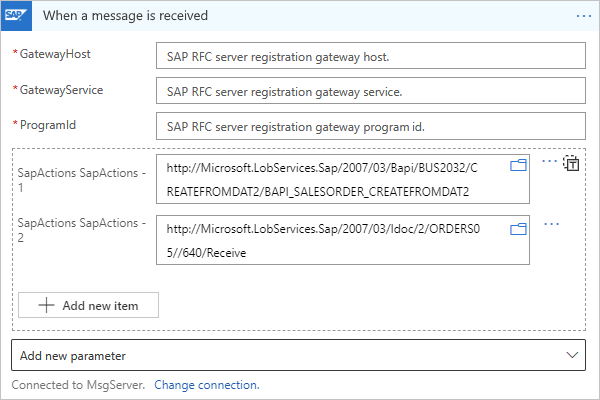

1. Save your workflow so you can start receiving messages from your SAP server. On the designer toolbar, select **Save**.

   Your workflow is now ready to receive messages from your SAP server.

1. After the trigger fires and runs your workflow, review the workflow's trigger history to confirm that trigger registration succeeded.

### [Standard](#tab/standard)

The preview SAP built-in connector trigger named **Register SAP RFC server for trigger** is available in the Azure portal, but the trigger currently can't receive calls from SAP when deployed in Azure. To fire the trigger, you can run the workflow locally in Visual Studio Code. For Visual Studio Code setup requirements and more information, see [Create a Standard logic app workflow in single-tenant Azure Logic Apps using Visual Studio Code](create-single-tenant-workflows-visual-studio-code.md).

> [!NOTE]
>
> The SAP built-in trigger is a non-polling, Azure Functions-based trigger, not a SOAP-based, 
> webhook trigger like the SAP managed trigger. So, the trigger doesn't include options to specify 
> a polling schedule. The trigger is called only when a message arrives, so no polling is necessary. 
>
> To send a response following the SAP built-in trigger, make sure to add the 
> [**Respond to SAP server** action](/azure/logic-apps/connectors/built-in/reference/sap/#respond-to-sap-server.-(preview)) 
> to your workflow, rather than use the **Response** action, which applies only to workflows that start with the **Request** 
> trigger named **When a HTTP request is received** and follow the Request-Response pattern.

1. In Visual Studio Code, open your Standard logic app and a blank workflow in the designer.

1. In the designer, [follow these general steps to find and add the SAP built-in trigger named **Register SAP RFC server for trigger**](create-workflow-with-trigger-or-action.md?tabs=standard#add-trigger).

1. If prompted, provide the following connection information for your on-premises SAP server. When you're done, select **Create**. Otherwise, continue with the next step to set up your SAP trigger.

   | Parameter | Required | Description |
   |-----------|----------|-------------|
   | **Connection name** | Yes | Enter a name for the connection. |
   | **Client** | Yes | The SAP client ID to use for connecting to your SAP server |
   | **Authentication Type** | Yes | The authentication type to use for your connection. To create an SNC connection, see [Enable Secure Network Communications (SNC)](logic-apps-using-sap-connector.md?tabs=single-tenant#enable-secure-network-communications). |
   | **SAP Username** | Yes | The username for your SAP server |
   | **SAP Password** | Yes | The password for your SAP server |
   | **Logon Type** | Yes | Select either **Application Server** or **Group**, and then configure the corresponding required parameters, even though they appear optional: <br><br>**Application Server**: <br>- **Server Host**: The host name for your SAP Application Server <br>- **Service**: The service name or port number for your SAP Application Server <br>- **System Number**: Your SAP server's system number, which ranges from 00 to 99 <br><br>**Group**: <br>- **Server Host**: The host name for your SAP Message Server <br>- **Service Name or Port Number**: The service name or port number for your SAP Message Server <br>- **System ID**: The system ID for your SAP server <br>- **Logon Group**: The logon group for your SAP server. On your SAP server, you can find or edit the **Logon Group** value by opening the **CCMS: Maintain Logon Groups** (T-Code SMLG) dialog box. For more information, review [SAP Note 26317 - Set up for LOGON group for automatic load balancing](https://service.sap.com/sap/support/notes/26317). |
   | **Language** | Yes | The language to use for sending data to your SAP server. The value is either **Default** (English) or one of the [permitted values](/azure/logic-apps/connectors/built-in/reference/sap/#parameters-21). <br><br>**Note**: The SAP built-in connector saves this parameter value as part of the SAP connection parameters. For more information, see [Change language headers for sending data to SAP](#change-language-headers). |

   After Azure Logic Apps sets up and tests your connection, the SAP trigger information box appears. For more information about any connection problems that might happen, see [Troubleshoot connections](#troubleshoot-connections).

1. Based on your SAP server configuration and scenario, provide the following trigger information, and add any available trigger parameters that you want to use in your scenario.

   | Parameter | Required | Description |
   |-----------|----------|-------------|
   | **IDoc Format** | Yes | The format to use for receiving IDocs. <br><br>- To receive IDocs as SAP plain XML, from the **IDoc Format** list, select **SapPlainXml**. <br><br>- To receive IDocs as a flat file, from the **IDoc Format** list, select **FlatFile**. <br><br>**Note**: If you also use the [Flat File Decode action](logic-apps-enterprise-integration-flatfile.md) in your workflow, in your flat file schema, you have to use the **early_terminate_optional_fields** property and set the value to **true**. This requirement is necessary because the flat file IDoc data record that's sent by SAP on the tRFC call named `IDOC_INBOUND_ASYNCHRONOUS` isn't padded to the full SDATA field length. Azure Logic Apps provides the flat file IDoc original data without padding as received from SAP. Also, when you combine this SAP trigger with the Flat File Decode action, the schema that's provided to the action must match. |
   | **SAP RFC Server Degree of Parallelism** | Yes | The number of calls to process in parallel |
   | **Allow Unreleased Segment** | Yes | Receive IDocs with or without unreleased segments. From the list, select **Yes** or **No**. |
   | **SAP Gateway Host** | Yes | The registration gateway host for the SAP RFC server |
   | **SAP Gateway Service** | Yes | The registration gateway service for the SAP RFC server |
   | **SAP RFC Server Program ID** | Yes | The registration gateway program ID for the SAP RFC server. <br><br>**Note**: This value is case-sensitive. Make sure that you consistently use the same case format for the **Program ID** value when you configure your logic app workflow and SAP server. Otherwise, when you attempt to send an IDoc to SAP, the tRFC Monitor (T-Code SM58) might show the following errors (links require SAP login): <br><br>- [**Function IDOC_INBOUND_ASYNCHRONOUS not found** (2399329)](https://launchpad.support.sap.com/#/notes/2399329)<br>- [**Non-ABAP RFC client (partner type) not supported** (353597)](https://launchpad.support.sap.com/#/notes/353597) |
   | **SAP SNC partners names** | No | The list of SNC partners that have permissions to call the trigger at the SAP client library level. Only the listed partners are authorized by the SAP server's SNC connection. To add this parameter, from the **Add new parameter** list, select **SAP SNC partners names**. Make sure to enter each name separated by a vertical bar (**\|**). |

   The following example shows a basically configured SAP built-in trigger in a Standard workflow:

   

1. Save your workflow so you can start receiving messages from your SAP server. On the designer toolbar, select **Save**.

   Your workflow is now ready to receive messages from your SAP server.

---

<a name="receive-idoc-packets-sap"></a>

## Receive IDoc packets from SAP

To receive IDoc packets, which are batches or groups of IDocs, the SAP trigger doesn't need extra configuration. However, to process each item in an IDoc packet after the trigger receives the packet, you have to implement a few more steps to split the packet into individual IDocs by setting up SAP to [send IDocs in packets](https://help.sap.com/viewer/8f3819b0c24149b5959ab31070b64058/7.4.16/4ab38886549a6d8ce10000000a42189c.html). 

The following example workflow shows how to extract individual IDocs from a packet by using the [`xpath()` function](workflow-definition-language-functions-reference.md#xpath):

1. Before you start, you need a Consumption or Standard logic app workflow with an SAP trigger. If your workflow doesn't already start with this trigger, follow the previous steps in this guide to [add the SAP trigger that can receive messages to your workflow](#receive-messages-sap).

1. To immediately reply to your SAP server with the SAP request status, add the following response action, based on whether you use an SAP managed trigger or SAP built-in trigger:

   - SAP managed trigger: For this trigger, [add a Response action to your workflow](../connectors/connectors-native-reqres.md#add-a-response-action).

     In the Response action, use one of the following status codes (`statusCode`):

     | Status code | Description |
     |-------------|-------------|
     | **202 Accepted** | The request was accepted for processing, but processing isn't complete yet. |
     | **204 No Content** | The server successfully fulfilled the request, and there's no additional content to send in the response payload body. |
     | **200 OK** | This status code always contains a payload, even if the server generates a payload body of zero length. |

   - SAP built-in trigger: For this trigger, add the [**Respond to SAP server** action](/azure/logic-apps/connectors/built-in/reference/sap/#respond-to-sap-server.-(preview)) to your workflow.

   > [!NOTE]
   >
   > As a best practice, add the response action immediately after the trigger to free up the communication channel with your SAP server.

1. Get the root namespace from the XML IDoc that your workflow receives from SAP.

   1. To extract this namespace from the XML document and store the namespace in a local string variable, add the **Initialize variable** action.

   1. Rename the action's title to **Get namespace for root node in received IDoc**.

   1. Provide a name for the variable, and set the type to **String**.

   1. In the action's **Value** parameter, select inside the edit box, open the expression or function editor, and create the following expression using the [`xpath()` function](workflow-definition-language-functions-reference.md#xpath):

      `xpath(xml(triggerBody()?['Content']), 'namespace-uri(/*)')`

      **Consumption workflow**

      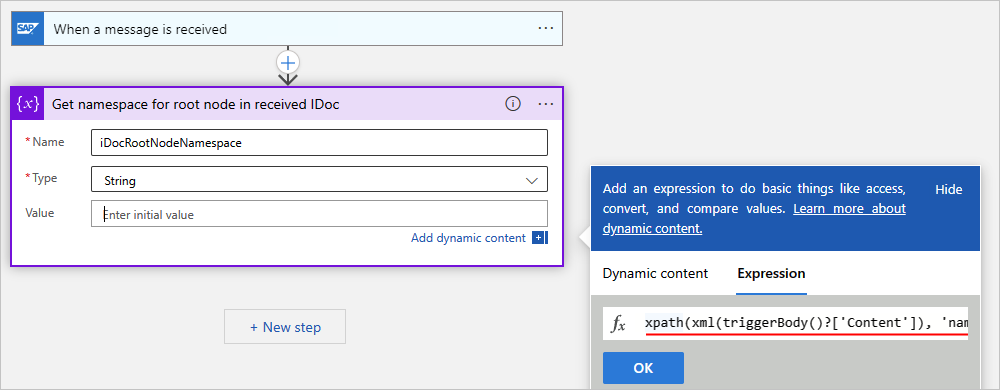

      **Standard workflow**

      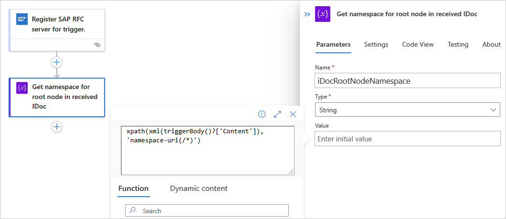

      When you're done, the expression resolves and now appears as the following format:

      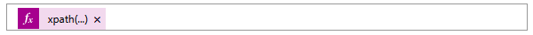

1. To extract an individual IDoc by storing the IDoc collection in a local array variable, follow these steps:

   1. Add another **Initialize variable** action.

   1. Rename the action's title to **Get array with IDoc data elements**.

   1. Provide a name for the variable, and set the type to **Array**.

      The array variable makes each IDoc available for your workflow to process individually by enumerating over the collection. 

   1. In the action's **Value** parameter, select inside the edit box, open the expression or function editor, and create the following `xpath()` expression:

      `xpath(xml(triggerBody()?['Content']), '/*[local-name()="Receive"]/*[local-name()="idocData"]')`

      When you're done, the expression resolves and now appears as the following format:

      **Consumption workflow**

      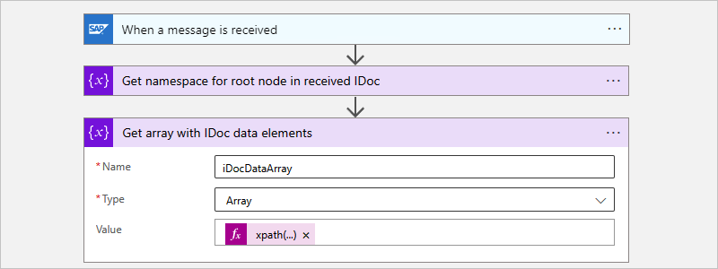

      In this example, the following workflow transfers each IDoc to an SFTP server by using a **Control** action named **For each** and the SFTP-SSH action named **Create file**. Each IDoc must include the root namespace, which is the reason why the file content is wrapped inside a `<Receive></Receive>` element along with the root namespace before sending the IDoc to the downstream app, or SFTP server in this case.

      

      > [!NOTE]
      > For Consumption workflows, this pattern is available as a quickstart template, which you can select 
      > from the template gallery when you create a Consumption logic app resource and blank workflow. Or, 
      > when the workflow designer is open, on designer toolbar, select **Templates**.
      >
      > 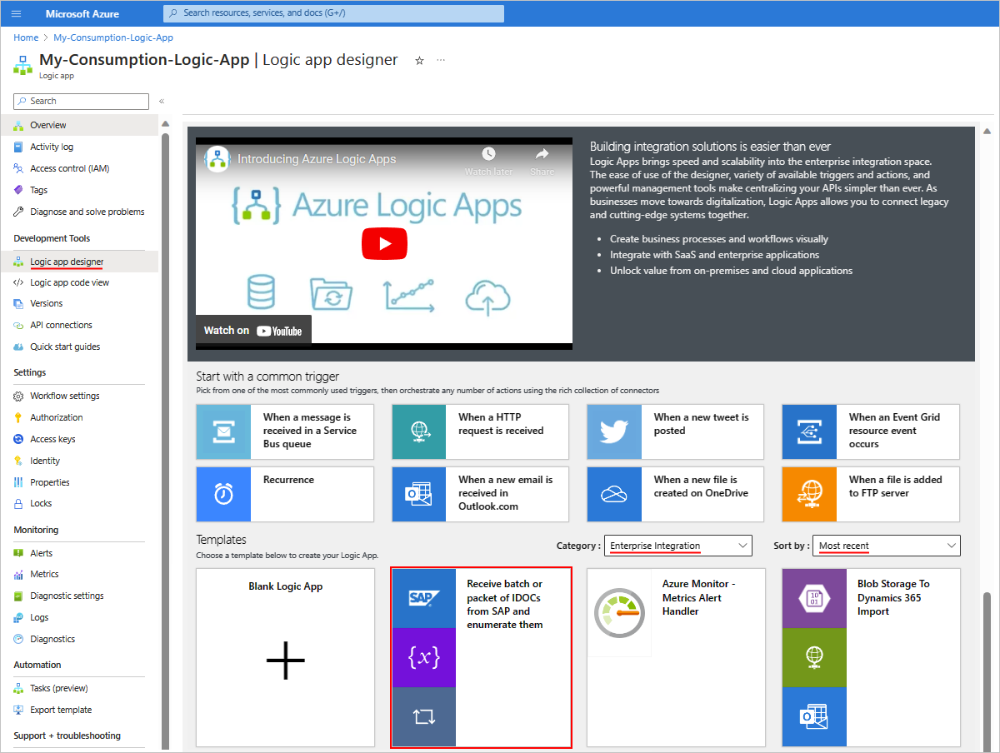

      **Standard workflow**

      

      In this example, the following workflow transfers each IDoc to an SFTP server by using a **Control** action named **For each** and the SFTP-SSH action named **Create file**. Each IDoc must include the root namespace, which is the reason why the file content is wrapped inside a `<Receive></Receive>` element along with the root namespace before sending the IDoc to the downstream app, or SFTP server in this case.

      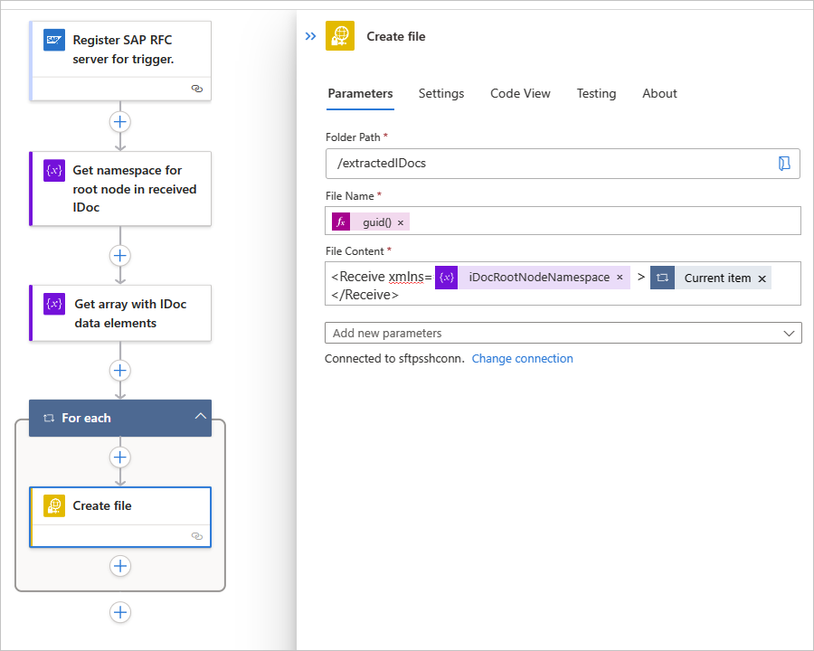

---

<a name="filter-with-sap-actions"></a>

## Filter received messages with SAP actions

If you use the SAP managed connector or ISE-versioned SAP connector, under the trigger in your workflow, set up a way to explicitly filter out any unwanted actions from your SAP server, based on the root node namespace in the received XML payload. You can provide a list (array) with a single or multiple SAP actions. By default, this array is empty, which means that your workflow receives all the messages from your SAP server without filtering. When you set up the array filter, the trigger receives messages only from the specified SAP action types and rejects all other messages from your SAP server. However, this filter doesn't affect whether the typing of the received payload is weak or strong. Any SAP action filtering happens at the level of the SAP Adapter for your on-premises data gateway. For more information, review [how to test sending IDocs to Azure Logic Apps from SAP](logic-apps-using-sap-connector.md#test-sending-idocs-from-sap).

## Set up asynchronous request-reply pattern for triggers

The SAP managed connector supports Azure's [asynchronous request-reply pattern](/azure/architecture/patterns/async-request-reply) for Azure Logic Apps triggers. You can use this pattern to create successful requests that would otherwise fail with the default synchronous request-reply pattern.

> [!NOTE]
>
> In workflows with multiple **Response** actions, all **Response** actions must use the same request-reply pattern. 
> For example, if your workflow uses a switch control with multiple possible **Response** actions, you must set up 
> all the **Response** actions to use the same request-reply pattern, either synchronous or asynchronous.

If you enable an asynchronous response for your **Response** action, your workflow can respond with a **202 Accepted** reply after accepting a request for processing. The reply contains a location header that you can use to retrieve the final state of your request.

To configure an asynchronous request-reply pattern for your workflow using the SAP connector, follow these steps:

1. In the designer, open your logic app workflow. Confirm that your workflow starts with an SAP trigger.

1. In your workflow, find the **Response** action, and open that action's **Settings**.

1. Based on whether you have a Consumption or Standard workflow, follow the corresponding steps:

   - Consumption: Under **Asynchronous Response**, turn the setting from **Off** to **On**, and select **Done**.
   - Standard: Expand **Networking**, and under **Asynchronous Response**, turn the setting from **Off** to **On**.

1. Save your workflow.

<a name="send-idocs-sap"></a>

## Send IDocs to SAP

To create a logic app workflow that sends an IDoc to an SAP server and returns a response, follow these examples:

1. [Create a logic app workflow that's triggered by an HTTP request.](#add-request-trigger)
1. [Add an SAP action to your workflow for sending an IDoc to SAP.](#add-sap-action-send-idoc)
1. [Add a response action to your workflow.](#add-response-action)
1. [Create a remote function call (RFC) request-response pattern, if you're using an RFC to receive replies from SAP ABAP.](#create-rfc-request-response-pattern)
1. [Test your workflow.](#test-workflow)

<a name="add-request-trigger"></a>

### Add the Request trigger

To have your workflow receive IDocs from SAP over XML HTTP, you can use the [Request built-in trigger](../connectors/connectors-native-reqres.md). This trigger creates an endpoint with a URL where your SAP server can send HTTP POST requests to your workflow. When your workflow receives these requests, the trigger fires and runs the next step in your workflow.

To receive IDocs over Common Programming Interface Communication (CPIC) as plain XML or as a flat file, review the section, [Receive message from SAP](#receive-messages-sap).

Based on whether you have a Consumption workflow in multi-tenant Azure Logic Apps or a Standard workflow in single-tenant Azure Logic Apps, follow the corresponding steps:

### [Consumption](#tab/consumption)

1. In the [Azure portal](https://portal.azure.com), create a Consumption logic app resource and a blank workflow in the designer.

1. In the designer, [follow these general steps to find and add the Request built-in trigger named **When a HTTP request is received**](create-workflow-with-trigger-or-action.md?tabs=consumption#add-trigger).

   

1. Save your workflow. On the designer toolbar, select **Save**.

   This step generates an endpoint URL where your trigger can receive requests from your SAP server, for example:

   

### [Standard](#tab/standard)

1. In the [Azure portal](https://portal.azure.com), create a Standard logic app resource and a blank workflow in the designer.

1. In the designer, [follow these general steps to find and add the Request built-in trigger named **When a HTTP request is received**](create-workflow-with-trigger-or-action.md?tabs=standard#add-trigger).

   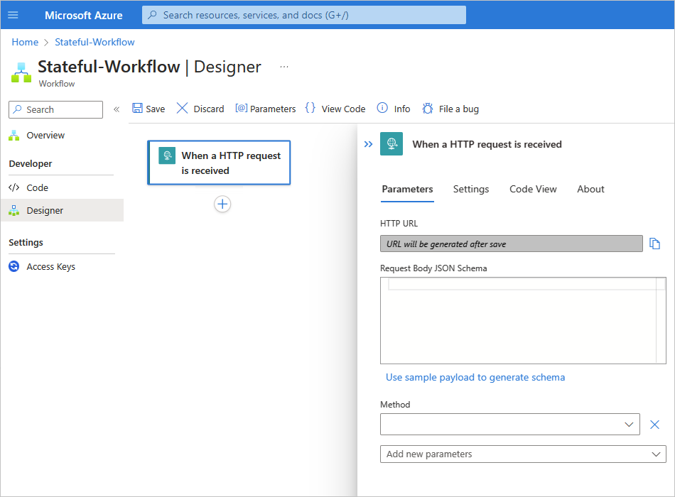

1. Save your workflow. On the designer toolbar, select **Save**.

   This step generates an endpoint URL where your trigger can receive requests from your SAP server, for example:

   

---

<a name="add-sap-action-send-idoc"></a>

### Add an SAP action to send an IDoc

Next, create an action to send your IDoc to SAP when the workflow's request trigger fires. Based on whether you have a Consumption workflow in multi-tenant Azure Logic Apps or a Standard workflow in single-tenant Azure Logic Apps, follow the corresponding steps:

### [Consumption](#tab/consumption)

1. In the workflow designer, under the Request trigger, select **New step**.

1. In the designer, [follow these general steps to find and add the SAP managed action named **Send message to SAP**](create-workflow-with-trigger-or-action.md?tabs=consumption#add-action).

1. If prompted, provide the following [connection information](/connectors/sap/#default-connection) for your on-premises SAP server. When you're done, select **Create**. Otherwise, continue with the next step to set up the SAP action.

   | Parameter | Required | Description |
   |-----------|----------|-------------|
   | **Connection name** | Yes | Enter a name for the connection. |
   | **Data Gateway** | Yes | 1. For **Subscription**, select the Azure subscription for the data gateway resource that you created in the Azure portal for your data gateway installation. <br><br>2. For **Connection Gateway**, select your data gateway resource in Azure. |
   | **Client** | Yes | The SAP client ID to use for connecting to your SAP server |
   | **Authentication Type** | Yes | The authentication type to use for your connection, which must be **Basic** (username and password). To create an SNC connection, see [Enable Secure Network Communications (SNC)](logic-apps-using-sap-connector.md?tabs=single-tenant#enable-secure-network-communications). |
   | **SAP Username** | Yes | The username for your SAP server |
   | **SAP Password** | Yes | The password for your SAP server |
   | **Logon Type** | Yes | Select either **Application Server** or **Group** (Message Server), and then configure the corresponding required parameters, even though they appear optional: <br><br>**Application Server**: <br>- **AS Host**: The host name for your SAP Application Server <br>- **AS Service**: The service name or port number for your SAP Application Server <br>- **AS System Number**: Your SAP server's system number, which ranges from 00 to 99 <br><br>**Group**: <br>- **MS Server Host**: The host name for your SAP Message Server <br>- **MS Service Name or Port Number**: The service name or port number for your SAP Message Server <br>- **MS System ID**: The system ID for your SAP server <br>- **MS Logon Group**: The logon group for your SAP server. On your SAP server, you can find or edit the **Logon Group** value by opening the **CCMS: Maintain Logon Groups** (T-Code SMLG) dialog box. For more information, review [SAP Note 26317 - Set up for LOGON group for automatic load balancing](https://service.sap.com/sap/support/notes/26317). |
   | **Safe Typing** | No | This option available for backward compatibility and only checks the string length. By default, strong typing is used to check for invalid values by performing XML validation against the schema. This behavior can help you detect issues earlier. Learn more about the [Safe Typing setting](#safe-typing). |
   | **Use SNC** | No | To create an SNC connection, see [Enable Secure Network Communications (SNC)](logic-apps-using-sap-connector.md?tabs=single-tenant#enable-secure-network-communications). |

   For other optional available connection parameters, see [Default connection information](/connectors/sap/#default-connection).

   After Azure Logic Apps sets up and tests your connection, the SAP action information box appears. For more information about any connection problems that might happen, see [Troubleshoot connections](#troubleshoot-connections).

   

1. In the **Send message to SAP** action, find and select an available SAP action on your SAP server to send the IDoc.

   The **Send message to SAP** action is generic and can send a message for BAPI, IDoc, RFC, or tRFC, but you must first select the message type and SAP action to use.

   1. In the **SAP Action** parameter's edit box, select the folder icon. From the list that opens, select **BAPI**, **IDOC**, **RFC**, or **TRFC**. This example selects **IDOC**. If you select a different type, the available SAP actions change based on your selection.

      > [!NOTE]
      >
      > If you get a **Bad Gateway (500)** error or **Bad request (400)** error, see [500 Bad Gateway or 400 Bad Request error](#bad-gateway-request).

      

   1. Browse the SAP action types folders using the arrows to find and select the SAP action that you want to use.

      This example selects **ORDERS** > **ORDERS05** > **720** > **Send**.

      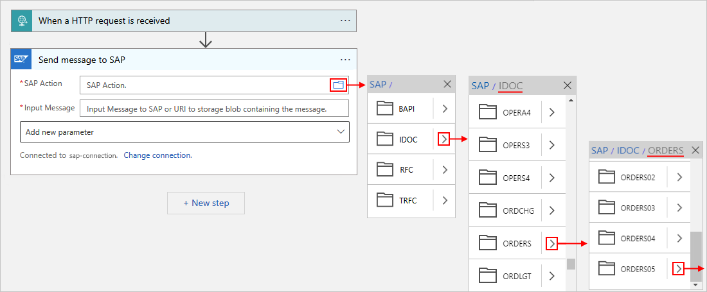

      If you can't find the action you want, you can manually enter a path, for example:

      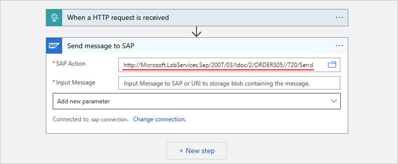

      > [!TIP]
      >
      > For the **SAP Action** parameter, you can use the expression editor to provide the parameter value. 
      > That way, you can use the same SAP action for different message types.

      For more information about IDoc messages, review [Message schemas for IDoc operations](/biztalk/adapters-and-accelerators/adapter-sap/message-schemas-for-idoc-operations).

   1. In the **Send message to SAP** action, include the body output from the Request trigger.

      1. In the **Input Message** parameter, select inside the edit box to open the dynamic content list.

      1. From the dynamic content list, under **When a HTTP request is received**, select **Body**. The **Body** field contains the body output from the Request trigger. 

         > [!NOTE]
         > If the **Body** field doesn't appear in the list, next to the **When a HTTP request is received** label, select **See more**.

      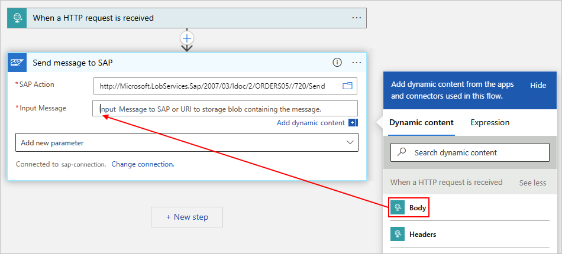

      The **Send message to SAP** action now includes the body content from the Request trigger and sends that output to your SAP server, for example:

      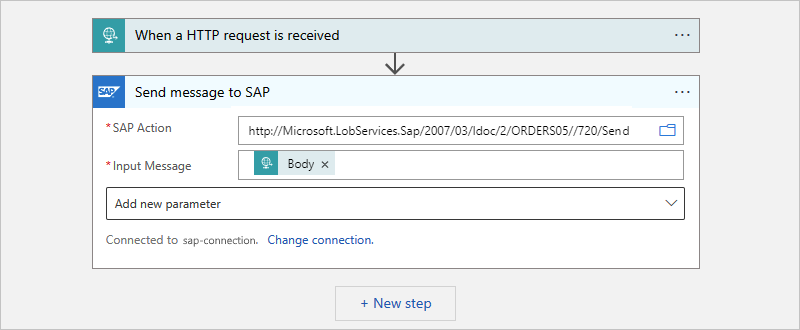

1. Save your workflow.

### [Standard](#tab/standard)

1. In the workflow designer, under the Request trigger, select the plus sign (**+**) > **Add an action**.

1. In the designer, [follow these general steps to find and add the SAP built-in action named **[IDoc] Send document to SAP**](create-workflow-with-trigger-or-action.md?tabs=standard#add-action).

   Rather than have a generic action to send messages with different types, the preview SAP built-in connector provides individual actions for BAPI, IDoc, RFC, and so on. For example, these actions include **[BAPI] Call method in SAP** and **[RFC] Call function in SAP**.

1. If prompted, provide the following connection information for your on-premises SAP server. When you're done, select **Create**. Otherwise, continue with the next step to set up the SAP action.

   | Parameter | Required | Description |
   |-----------|----------|-------------|
   | **Connection name** | Yes | Enter a name for the connection. |
   | **Client** | Yes | The SAP client ID to use for connecting to your SAP server |
   | **Authentication Type** | Yes | The authentication type to use for your connection. To create an SNC connection, see [Enable Secure Network Communications (SNC)](logic-apps-using-sap-connector.md?tabs=single-tenant#enable-secure-network-communications). |
   | **SAP Username** | Yes | The username for your SAP server |
   | **SAP Password** | Yes | The password for your SAP server |
   | **Logon Type** | Yes | Select either **Application Server** or **Group**, and then configure the corresponding required parameters, even though they appear optional: <br><br>**Application Server**: <br>- **Server Host**: The host name for your SAP Application Server <br>- **Service**: The service name or port number for your SAP Application Server <br>- **System Number**: Your SAP server's system number, which ranges from 00 to 99 <br><br>**Group**: <br>- **Server Host**: The host name for your SAP Message Server <br>- **Service Name or Port Number**: The service name or port number for your SAP Message Server <br>- **System ID**: The system ID for your SAP server <br>- **Logon Group**: The logon group for your SAP server. On your SAP server, you can find or edit the **Logon Group** value by opening the **CCMS: Maintain Logon Groups** (T-Code SMLG) dialog box. For more information, review [SAP Note 26317 - Set up for LOGON group for automatic load balancing](https://service.sap.com/sap/support/notes/26317). |
   | **Language** | Yes | The language to use for sending data to your SAP server. The value is either **Default** (English) or one of the [permitted values](/azure/logic-apps/connectors/built-in/reference/sap/#parameters-21). <br><br>**Note**: The SAP built-in connector saves this parameter value as part of the SAP connection parameters. For more information, see [Change language headers for sending data to SAP](#change-language-headers). |

   After Azure Logic Apps sets up and tests your connection, the SAP action information box appears. For more information about any connection problems that might happen, see [Troubleshoot connections](#troubleshoot-connections).

   ![Screenshot shows a Standard workflow with the SAP built-in action named [IDoc] Send document to SAP.](./media/sap-create-example-scenario-workflows/sap-send-idoc-standard.png)

1. In the **[IDoc] Send document to SAP** action, provide the information required for the action to send an IDoc to your SAP server, for example:

   1. For the **IDoc Format** parameter, select **SapPlainXML**.

      1. In the **Plain XML IDoc** parameter, select inside the edit box, and open the dynamic content list (lightning icon). 

      1. From the dynamic content list, under **When a HTTP request is received**, select **Body**. The **Body** field contains the body output from the Request trigger. 

         > [!NOTE]
         > If the **Body** field doesn't appear in the list, next to the **When a HTTP request is received** label, select **See more**.

      

      The **[IDoc] Send document to SAP** action now includes the body content from the Request trigger and sends that output to your SAP server, for example:

      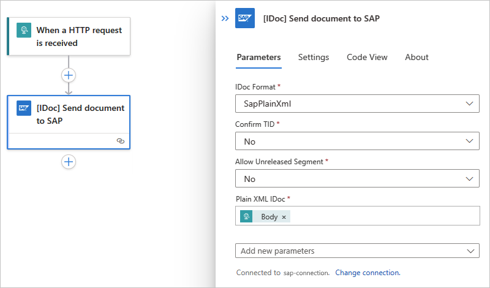

1. Save your workflow.

---

<a name="send-flat-file-idocs"></a>

#### Send flat file IDocs to SAP server (Managed connector only)

To send an IDoc using a flat file schema when you use the SAP managed connector, you can wrap the IDoc in an XML envelope and [follow the general steps to add an SAP action to send an IDoc](#add-sap-action-send-idoc), but with the following changes.

> [!NOTE]
>
> If you're using the SAP built-in connector, make sure that you don't wrap a flat file IDoc in an XML envelope.

### Wrap IDoc with XML envelope

1. In the SAP action that you use to send the message, use the following URI:

   **`http://Microsoft.LobServices.Sap/2007/03/Idoc/SendIdoc`**

1. Format your input message with an XML envelope.

The following example shows a sample XML payload:

```xml
<SendIdoc xmlns="http://Microsoft.LobServices.Sap/2007/03/Idoc/">
  <idocData>EDI_DC 3000000001017945375750 30INVOIC011BTSVLINV30KUABCABCFPPC LDCA X004010810 4 SAPMSX LSEDI ABCABCFPPC 000d3ae4-723e-1edb-9ca4-cc017365c9fd 20210217054521INVOICINVOIC01ZINVOIC2RE 20210217054520
E2EDK010013000000001017945375000001E2EDK01001000000010 ABCABC1.00000 0060 INVO9988298128 298.000 298.000 LB Z4LR EN 0005065828 L
E2EDKA1 3000000001017945375000002E2EDKA1 000000020 RS ABCABCFPPC 0005065828 ABCABCABC ABCABC Inc. Limited Risk Distributor ABCABC 1950 ABCABCABCA Blvd ABCABAABCAB L5N8L9 CA ABCABC E ON V-ABCABC LDCA
E2EDKA1 3000000001017945375000003E2EDKA1 000000020 AG 0005065828 ABCABCFPPC ABCABC ABCABC ABCABC - FPP ONLY 88 ABCABC Crescent ABCABAABCAB L5R 4A2 CA ABCABC 111 111 1111 E ON ABCABCFPPC EN
E2EDKA1 3000000001017945375000004E2EDKA1 000000020 RE 0005065828 ABCABCFPPC ABCABC ABCABC ABCABC - FPP ONLY 88 ABCABC Crescent ABCABAABCAB L5R 4A2 CA ABCABC 111 111 1111 E ON ABCABCFPPC EN
E2EDKA1 3000000001017945375000005E2EDKA1 000000020 RG 0005065828 ABCABCFPPC ABCABC ABCABC ABCABC - FPP ONLY 88 ABCABC Crescent ABCABAABCAB L5R 4A2 CA ABCABC 111 111 1111 E ON ABCABCFPPC EN
E2EDKA1 3000000001017945375000006E2EDKA1 000000020 WE 0005001847 41 ABCABC ABCABC INC (ABCABC) DC A. ABCABCAB 88 ABCABC CRESCENT ABCABAABCAB L5R 4A2 CA ABCABC 111-111-1111 E ON ABCABCFPPC EN
E2EDKA1 3000000001017945375000007E2EDKA1 000000020 Z3 0005533050 ABCABCABC ABCABC Inc. ABCA Bank Swift Code -ABCABCABCAB Sort Code - 1950 ABCABCABCA Blvd. Acc No -1111111111 ABCABAABCAB L5N8L9 CA ABCABC E ON ABCABCFPPC EN
E2EDKA1 3000000001017945375000008E2EDKA1 000000020 BK 1075 ABCABCABC ABCABC Inc 1950 ABCABCABCA Blvd ABCABAABCAB ON L5N 8L9 CA ABCABC (111) 111-1111 (111) 111-1111 ON
E2EDKA1 3000000001017945375000009E2EDKA1 000000020 CR 1075 CONTACT ABCABCABC 1950 ABCABCABCA Blvd ABCABAABCAB ON L5N 8L9 CA ABCABC (111) 111-1111 (111) 111-1111 ON
E2EDK02 3000000001017945375000010E2EDK02 000000020 0099988298128 20210217
E2EDK02 3000000001017945375000011E2EDK02 000000020 00140-N6260-S 20210205
E2EDK02 3000000001017945375000012E2EDK02 000000020 0026336270425 20210217
E2EDK02 3000000001017945375000013E2EDK02 000000020 0128026580537 20210224
E2EDK02 3000000001017945375000014E2EDK02 000000020 01740-N6260-S
E2EDK02 3000000001017945375000015E2EDK02 000000020 900IAC
E2EDK02 3000000001017945375000016E2EDK02 000000020 901ZSH
E2EDK02 3000000001017945375000017E2EDK02 000000020 9078026580537 20210217
E2EDK03 3000000001017945375000018E2EDK03 000000020 02620210217
E2EDK03 3000000001017945375000019E2EDK03 000000020 00120210224
E2EDK03 3000000001017945375000020E2EDK03 000000020 02220210205
E2EDK03 3000000001017945375000021E2EDK03 000000020 01220210217
E2EDK03 3000000001017945375000022E2EDK03 000000020 01120210217
E2EDK03 3000000001017945375000023E2EDK03 000000020 02420210217
E2EDK03 3000000001017945375000024E2EDK03 000000020 02820210418
E2EDK03 3000000001017945375000025E2EDK03 000000020 04820210217
E2EDK17 3000000001017945375000026E2EDK17 000000020 001DDPDelivered Duty Paid
E2EDK17 3000000001017945375000027E2EDK17 000000020 002DDPdestination
E2EDK18 3000000001017945375000028E2EDK18 000000020 00160 0 Up to 04/18/2021 without deduction
E2EDK28 3000000001017945375000029E2EDK28 000000020 CA BOFACATT Bank of ABCABAB ABCABC ABCABAB 50127217 ABCABCABC ABCABC Inc.
E2EDK28 3000000001017945375000030E2EDK28 000000020 CA 026000082 ABCAbank ABCABC ABCABAB 201456700OLD ABCABCABC ABCABC Inc.
E2EDK28 3000000001017945375000031E2EDK28 000000020 GB ABCAGB2L ABCAbank N.A ABCABA E14, 5LB GB63ABCA18500803115593 ABCABCABC ABCABC Inc. GB63ABCA18500803115593
E2EDK28 3000000001017945375000032E2EDK28 000000020 CA 020012328 ABCABANK ABCABC ABCABAB ON M5J 2M3 2014567007 ABCABCABC ABCABC Inc.
E2EDK28 3000000001017945375000033E2EDK28 000000020 CA 03722010 ABCABABC ABCABABC Bank of Commerce ABCABAABCAB 64-04812 ABCABCABC ABCABC Inc.
E2EDK28 3000000001017945375000034E2EDK28 000000020 IE IHCC In-House Cash Center IHCC1075 ABCABCABC ABCABC Inc.
E2EDK28 3000000001017945375000035E2EDK28 000000020 CA 000300002 ABCAB Bank of ABCABC ABCABAB 0021520584OLD ABCABCABC ABCABC Inc.
E2EDK28 3000000001017945375000036E2EDK28 000000020 US USCC US Cash Center (IHC) city USCC1075 ABCABCABC ABCABC Inc.
E2EDK29 3000000001017945375000037E2EDK29 000000020 0064848944US A CAD CA ABCABC CA United States US CA A Air Air
E2EDKT1 3000000001017945375000038E2EDKT1 000000020 ZJ32E EN
E2EDKT2 3000000001017945375000039E2EDKT2 000038030 GST/HST877845941RT0001 *
E2EDKT2 3000000001017945375000040E2EDKT2 000038030 QST1021036966TQ0001 *
E2EDKT1 3000000001017945375000041E2EDKT1 000000020 Z4VL
E2EDKT2 3000000001017945375000042E2EDKT2 000041030 0.000 *
E2EDKT1 3000000001017945375000043E2EDKT1 000000020 Z4VH
E2EDKT2 3000000001017945375000044E2EDKT2 000043030 *
E2EDK14 3000000001017945375000045E2EDK14 000000020 008LDCA
E2EDK14 3000000001017945375000046E2EDK14 000000020 00710
E2EDK14 3000000001017945375000047E2EDK14 000000020 00610
E2EDK14 3000000001017945375000048E2EDK14 000000020 015Z4F2
E2EDK14 3000000001017945375000049E2EDK14 000000020 0031075
E2EDK14 3000000001017945375000050E2EDK14 000000020 021M
E2EDK14 3000000001017945375000051E2EDK14 000000020 0161075
E2EDK14 3000000001017945375000052E2EDK14 000000020 962M
E2EDP010013000000001017945375000053E2EDP01001000000020 000011 2980.000 EA 298.000 LB MOUSE 298.000 Z4TN 4260
E2EDP02 3000000001017945375000054E2EDP02 000053030 00140-N6260-S 00000120210205 DFUE
E2EDP02 3000000001017945375000055E2EDP02 000053030 0026336270425 00001120210217
E2EDP02 3000000001017945375000056E2EDP02 000053030 0168026580537 00001020210224
E2EDP02 3000000001017945375000057E2EDP02 000053030 9100000 00000120210205 DFUE
E2EDP02 3000000001017945375000058E2EDP02 000053030 911A 00000120210205 DFUE
E2EDP02 3000000001017945375000059E2EDP02 000053030 912PP 00000120210205 DFUE
E2EDP02 3000000001017945375000060E2EDP02 000053030 91300 00000120210205 DFUE
E2EDP02 3000000001017945375000061E2EDP02 000053030 914CONTACT ABCABCABC 00000120210205 DFUE
E2EDP02 3000000001017945375000062E2EDP02 000053030 963 00000120210205 DFUE
E2EDP02 3000000001017945375000063E2EDP02 000053030 965 00000120210205 DFUE
E2EDP02 3000000001017945375000064E2EDP02 000053030 9666336270425 00000120210205 DFUE
E2EDP02 3000000001017945375000065E2EDP02 000053030 9078026580537 00001020210205 DFUE
E2EDP03 3000000001017945375000066E2EDP03 000053030 02920210217
E2EDP03 3000000001017945375000067E2EDP03 000053030 00120210224
E2EDP03 3000000001017945375000068E2EDP03 000053030 01120210217
E2EDP03 3000000001017945375000069E2EDP03 000053030 02520210217
E2EDP03 3000000001017945375000070E2EDP03 000053030 02720210217
E2EDP03 3000000001017945375000071E2EDP03 000053030 02320210217
E2EDP03 3000000001017945375000072E2EDP03 000053030 02220210205
E2EDP19 3000000001017945375000073E2EDP19 000053030 001418VVZ
E2EDP19 3000000001017945375000074E2EDP19 000053030 002RJR-00001 AB ABCABCABC Mouse FORBUS BLUETOOTH
E2EDP19 3000000001017945375000075E2EDP19 000053030 0078471609000
E2EDP19 3000000001017945375000076E2EDP19 000053030 003889842532685
E2EDP19 3000000001017945375000077E2EDP19 000053030 011CN
E2EDP26 3000000001017945375000078E2EDP26 000053030 00459064.20
E2EDP26 3000000001017945375000079E2EDP26 000053030 00352269.20
E2EDP26 3000000001017945375000080E2EDP26 000053030 01052269.20
E2EDP26 3000000001017945375000081E2EDP26 000053030 01152269.20
E2EDP26 3000000001017945375000082E2EDP26 000053030 0126795.00
E2EDP26 3000000001017945375000083E2EDP26 000053030 01552269.20
E2EDP26 3000000001017945375000084E2EDP26 000053030 00117.54
E2EDP26 3000000001017945375000085E2EDP26 000053030 00252269.20
E2EDP26 3000000001017945375000086E2EDP26 000053030 940 2980.000
E2EDP26 3000000001017945375000087E2EDP26 000053030 939 2980.000
E2EDP05 3000000001017945375000088E2EDP05 000053030 + Z400MS List Price 52269.20 17.54 1 EA CAD 2980
E2EDP05 3000000001017945375000089E2EDP05 000053030 + XR1 Tax Jur Code Level 6795.00 13.000 52269.20
E2EDP05 3000000001017945375000090E2EDP05 000053030 + Tax Subtotal1 6795.00 2.28 1 EA CAD 2980
E2EDP05 3000000001017945375000091E2EDP05 000053030 + Taxable Amount + TaxSubtotal1 59064.20 19.82 1 EA CAD 2980
E2EDP04 3000000001017945375000092E2EDP04 000053030 CX 13.000 6795.00 7000000000
E2EDP04 3000000001017945375000093E2EDP04 000053030 CX 0 0 7001500000
E2EDP04 3000000001017945375000094E2EDP04 000053030 CX 0 0 7001505690
E2EDP28 3000000001017945375000095E2EDP28 000053030 00648489440000108471609000 CN CN ABCAB ZZ 298.000 298.000 LB US 400 United Stat KY
E2EDPT1 3000000001017945375000096E2EDPT1 000053030 0001E EN
E2EDPT2 3000000001017945375000097E2EDPT2 000096040 AB ABCABCABC Mouse forBus Bluetooth EN/XC/XD/XX Hdwr Black For Bsnss *
E2EDS01 3000000001017945375000098E2EDS01 000000020 0011
E2EDS01 3000000001017945375000099E2EDS01 000000020 01259064.20 CAD
E2EDS01 3000000001017945375000100E2EDS01 000000020 0056795.00 CAD
E2EDS01 3000000001017945375000101E2EDS01 000000020 01159064.20 CAD
E2EDS01 3000000001017945375000102E2EDS01 000000020 01052269.20 CAD
E2EDS01 3000000001017945375000103E2EDS01 000000020 94200000 CAD
E2EDS01 3000000001017945375000104E2EDS01 000000020 9440.00 CAD
E2EDS01 3000000001017945375000105E2EDS01 000000020 9450.00 CAD
E2EDS01 3000000001017945375000106E2EDS01 000000020 94659064.20 CAD
E2EDS01 3000000001017945375000107E2EDS01 000000020 94752269.20 CAD
E2EDS01 3000000001017945375000108E2EDS01 000000020 EXT
Z2XSK010003000000001017945375000109Z2XSK01000000108030 Z400 52269.20
Z2XSK010003000000001017945375000110Z2XSK01000000108030 XR1 13.000 6795.00 CX
</idocData>
</SendIdoc>
```

<a name="add-response-action"></a>

### Add a response action

Now, set up your workflow to return the results from your SAP server to the original requestor. For this task, follow these steps:

### [Consumption](#tab/consumption)

1. In the workflow designer, under the SAP action, select **New step**.

1. In the designer, [follow these general steps to find and add the Request built-in action named **Response**](create-workflow-with-trigger-or-action.md?tabs=consumption#add-action).

1. In the **Response** action, for the **Body** parameter, select inside the edit box to open the dynamic content list.

1. From the dynamic content list, under **Send message to SAP**, select **Body**. The **Body** field contains the body output from the SAP action.

   

1. Save your workflow.

### [Standard](#tab/standard)

1. In the workflow designer, under the SAP action, select the plus sign (**+**) > **Add an action**.

1. In the designer, [follow these general steps to find and add the Request built-in action named **Response**](create-workflow-with-trigger-or-action.md?tabs=standard#add-action).

   > [!NOTE]
   >
   > If you use the SAP built-in trigger, which is an Azure Functions-based trigger, not a webhook trigger, add the 
   > [**Respond to SAP server** action](/azure/logic-apps/connectors/built-in/reference/sap/#respond-to-sap-server.-(preview)) 
   > to your workflow and include the output from the SAP action.

1. In the **Response** action, for the **Body** parameter, select inside the edit box to open the dynamic content list appears.

1. From the dynamic content list, under **[IDoc] Send document to SAP**, find and select **Body**. The **Body** field contains the body output from the SAP action.

   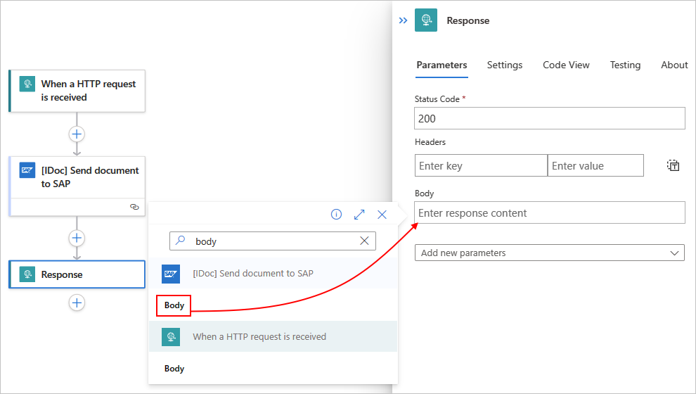

1. Save your workflow.

---

<a name="create-rfc-request-response-pattern"></a>

### Create a remote function call (RFC) request-response pattern

For the Consumption workflows that use the SAP managed connector and ISE-versioned SAP connector, if you have to receive replies by using a remote function call (RFC) to Azure Logic Apps from SAP ABAP, you must implement a request and response pattern. To receive IDocs in your workflow when you use the [Request trigger](../connectors/connectors-native-reqres.md), make sure that the workflow's first action is a [Response action](../connectors/connectors-native-reqres.md#add-response) that uses the **200 OK** status code without any content. This recommended step immediately completes the SAP Logical Unit of Work (LUW) asynchronous transfer over tRFC, which leaves the SAP CPIC conversation available again. You can then add more actions to your workflow for processing the received IDoc without blocking later transfers.

> [!NOTE]
>
> The SAP trigger receives IDocs over tRFC, which doesn't have a response parameter, by design.

To implement a request and response pattern, you must first discover the RFC schema using the [`generate schema` command](sap-generate-schemas-for-artifacts.md). The generated schema has two possible root nodes: 

* The request node, which is the call that you receive from SAP
* The response node, which is your reply back to SAP

In the following example, the `STFC_CONNECTION` RFC module generates a request and response pattern. The request XML is parsed to extract a node value where SAP requests `<ECHOTEXT>`. The response inserts the current timestamp as a dynamic value. You receive a similar response when you send a `STFC_CONNECTION` RFC from a logic app workflow to SAP.

```xml
<STFC_CONNECTIONResponse xmlns="http://Microsoft.LobServices.Sap/2007/03/Rfc/">
  <ECHOTEXT>@{first(xpath(xml(triggerBody()?['Content']), '/*[local-name()="STFC_CONNECTION"]/*[local-name()="REQUTEXT"]/text()'))}</ECHOTEXT>
  <RESPTEXT>Azure Logic Apps @{utcNow()}</RESPTEXT>
</STFC_CONNECTIONResponse>
```

<a name="test-workflow"></a>

### Test your workflow

### [Consumption](#tab/consumption)

1. If your Consumption logic app resource isn't already enabled, on your logic app menu, select **Overview**. On the toolbar, select **Enable**.

1. On the designer toolbar, select **Run Trigger** > **Run** to manually start your workflow.

1. To simulate a webhook trigger payload, send an HTTP POST request to the endpoint URL that's specified by your workflow's Request trigger. Make sure to include your message content with your request. To send the request, use a tool such as the [Postman API client](https://www.postman.com/api-platform/api-client/).

   For this example, the HTTP POST request sends an IDoc file, which must be in XML format and include the namespace for the SAP action that you selected, for example:

   ```xml
   <?xml version="1.0" encoding="UTF-8" ?>
   <Send xmlns="http://Microsoft.LobServices.Sap/2007/03/Idoc/2/ORDERS05//720/Send">
     <idocData>
       <...>
     </idocData>
   </Send>
   ```

1. After you send your HTTP request, wait for the response from your workflow.

   > [!NOTE]
   >
   > Your workflow might time out if all the steps required for the response don't finish within the [request timeout limit](logic-apps-limits-and-config.md). 
   > If this condition happens, requests might get blocked. To help you diagnose problems, learn how you can [check and monitor your logic app workflows](monitor-logic-apps.md).

You've now created a workflow that can communicate with your SAP server. Now that you've set up an SAP connection for your workflow, you can try experimenting with BAPI and RFC.

### [Standard](#tab/standard)

1. If your Standard logic app resource is stopped or disabled, from your workflow, go to the logic app resource level, and select **Overview**. On the toolbar, select **Start**.

1. Return to the workflow level. On the workflow menu, select **Overview**. On the toolbar, select **Run** > **Run** to manually start your workflow.

1. To simulate a webhook trigger payload, send an HTTP POST request to the endpoint URL that's specified by your workflow's Request trigger. Make sure to your message content with your request. To send the request, use a tool such as the [Postman API client](https://www.postman.com/api-platform/api-client/).

   For this example, the HTTP POST request sends an IDoc file, which must be in XML format and include the namespace for the SAP action that you selected, for example:

   ```xml
   <?xml version="1.0" encoding="UTF-8" ?>
   <Send xmlns="http://Microsoft.LobServices.Sap/2007/03/Idoc/2/ORDERS05//720/Send">
     <idocData>
       <...>
     </idocData>
   </Send>
   ```

1. After you send the HTTP request, wait for the response from your workflow.

   > [!NOTE]
   >
   > Your workflow might time out if all the steps required for the response don't finish within the [request timeout limit](logic-apps-limits-and-config.md). 
   > If this condition happens, requests might get blocked. To help you diagnose problems, learn [how to check and monitor your logic app workflows](monitor-logic-apps.md).

You've now created a workflow that can communicate with your SAP server. Now that you've set up an SAP connection for your workflow, you can try experimenting with BAPI and RFC.

---

<a name="safe-typing"></a>

## Safe typing

By default, when you create a connection for the SAP managed operation, strong typing is used to check for invalid values by performing XML validation against the schema. This behavior can help you detect issues earlier. The **Safe Typing** option is available for backward compatibility and only checks the string length. If you choose **Safe Typing**, the DATS type and TIMS type in SAP are treated as strings rather than as their XML equivalents, `xs:date` and `xs:time`, where `xmlns:xs="http://www.w3.org/2001/XMLSchema"`. Safe typing affects the behavior for all schema generation, the send message for both the "been sent" payload and the "been received" response, and the trigger.

When strong typing is used (**Safe Typing** isn't enabled), the schema maps the DATS and TIMS types to more straightforward XML types:

```xml
<xs:element minOccurs="0" maxOccurs="1" name="UPDDAT" nillable="true" type="xs:date"/>
<xs:element minOccurs="0" maxOccurs="1" name="UPDTIM" nillable="true" type="xs:time"/>
```

When you send messages using strong typing, the DATS and TIMS response complies with the matching XML type format:

```xml
<DATE>9999-12-31</DATE>
<TIME>23:59:59</TIME>
```

When **Safe Typing** is enabled, the schema maps the DATS and TIMS types to XML string fields with length restrictions only, for example:

```xml
<xs:element minOccurs="0" maxOccurs="1" name="UPDDAT" nillable="true">
  <xs:simpleType>
    <xs:restriction base="xs:string">
      <xs:maxLength value="8" />
    </xs:restriction>
  </xs:simpleType>
</xs:element>
<xs:element minOccurs="0" maxOccurs="1" name="UPDTIM" nillable="true">
  <xs:simpleType>
    <xs:restriction base="xs:string">
      <xs:maxLength value="6" />
    </xs:restriction>
  </xs:simpleType>
</xs:element>
```

When messages are sent with **Safe Typing** enabled, the DATS and TIMS response looks like this example:

```xml
<DATE>99991231</DATE>
<TIME>235959</TIME>
```

<a name="advanced-scenarios"></a>

## Advanced scenarios

<a name="change-language-headers"></a>

### Change language headers for sending data to SAP

When you connect to SAP from Azure Logic Apps, English is the default language used by the SAP connection for sending data to your SAP server. However, the SAP managed connector and SAP built-in connector handle changing and saving the language used in different ways.

* When you create a connection with SAP built-in connector, the connection parameters let you specify and save the language parameter value as part of the SAP connection parameters.

* When you create a connection with the SAP managed connector, the connection parameters don't have language parameter. So, during this time, you can't specify or the language to use for sending data to your SAP server. Instead, at both workflow design time and run time, the connector uses your web browser's local language from each request that's sent to your server. For example, if your browser is set to Portuguese, Azure Logic Apps creates and tests the SAP connection with Portuguese, but doesn't save the connection with that language.

  However, you can set the language for your connection by using the [standard HTTP header `Accept-Language`](https://www.w3.org/Protocols/rfc2616/rfc2616-sec14.html#sec14.4) with your inbound requests. Most web browsers add an `Accept-Language` header based on your locale settings. The web browser applies this header when you create a new SAP connection in the workflow designer. So, you can either update your web browser's settings to use your preferred language, or you can create your SAP connection using Azure Resource Manager instead of the workflow designer.

  For example, you can send a request with the `Accept-Language` header to your logic app workflow by using the Request trigger named **When a HTTP request is received**. All the actions in your workflow receive the header. Then, SAP uses the specified languages in its system messages, such as BAPI error messages. If you don't pass an `Accept-Language` header at run time, by default, English is used.

  If you use the `Accept-Language` header, you might get the following error: **Please check your account info and/or permissions and try again.** In this case, check the SAP component's error logs instead. The error actually happens in the SAP component that uses the header, so you might get one of these error messages:

  * **"SAP.Middleware.Connector.RfcLogonException: Select one of the installed languages"**

  * **"SAP.Middleware.Connector.RfcAbapMessageException: Select one of the installed languages"**

<a name="confirm-transaction-explicitly"></a>

## Confirm transaction separately and explicitly

When you send transactions to SAP from Azure Logic Apps, this exchange happens in two steps as described in the SAP document, [Transactional RFC Server Programs](https://help.sap.com/doc/saphelp_nwpi71/7.1/22/042ad7488911d189490000e829fbbd/content.htm?no_cache=true).

By default, the SAP managed connector action named [**Send message to SAP**](/connectors/sap/#send-message-to-sap) handles both the steps to transfer the function and confirm the transaction in a single call. You also have the option to decouple these steps. The capability to decouple the transfer and confirmation steps is useful for scenarios where you don't want to duplicate transactions in SAP. Such scenarios include failures that happen due to causes such as network issues.

You can send an IDoc without automatically confirming the transaction using the SAP managed connector action named [**[IDOC] Send document to SAP**](/connectors/sap/#[idoc]-send-document-to-sap-(preview)). You can then explicitly confirm the transaction using the SAP managed connector action named [**[IDOC - RFC] Confirm transaction Id**](/connectors/sap/#[idoc---rfc]-confirm-transaction-id-(preview)). When your workflow separately confirms the transaction in a different step, the SAP system completes the transaction only once.

In Standard workflows, the SAP built-in connector also has actions that separately handle the transfer and confirmation steps, specifically, [**[IDoc] Send document to SAP**](/azure/logic-apps/connectors/built-in/reference/sap/#[idoc]-send-document-to-sap-(preview)) and [**[IDOC - RFC] Confirm transaction Id**](/azure/logic-apps/connectors/built-in/reference/sap/#[idoc---rfc]-confirm-transaction-id-(preview)).

The following example workflow shows this pattern:

1. Create and open a Consumption or Standard logic app with a blank workflow in the designer. Add the Request trigger.

1. To help avoid sending duplicate IDocs to SAP, [follow these alternative steps to create and use an IDoc transaction ID in your SAP actions](#create=transaction-ID-variable).

1. Add the SAP action named **[IDOC] Send document to SAP** to your workflow. Provide the information for the IDoc that you send to your SAP system plus the following values:

   | Parameter | Value | Description |
   |-----------|-------|-------------|
   | **Confirm TID** | **No** | Don't automatically confirm the transaction ID, which explicitly happens in a separate step. |
   | **Transaction Id GUID** | <*IDoc-transaction-ID*> | If this parameter doesn't automatically appear, open the **Add new parameters** list, and select the parameter. <br><br>You can either manually specify this value, or the connector can automatically generate this GUID as an output from the **[IDOC] Send document to SAP** action. This example leaves this parameter empty to automatically generate the GUID. |

   **Consumption workflow**

   

   **Standard workflow**

   

1. On the SAP action named **[IDOC] Send document to SAP**, open **Settings** to review the **Retry Policy**.

   The **Default** option is the recommended policy, but you can select a custom policy for your specific needs. If you choose to use a custom policy, set up at least one retry to overcome temporary network outages.

1. Now, add the SAP action named **[IDOC - RFC] Confirm transaction Id**.

   1. In the **Transaction ID** parameter, select inside the edit box to open the dynamic content list.

   1. From the list, under **[IDOC] Send document to SAP**, select the **Transaction Id** value, which is the output from the previous SAP action.

      **Consumption workflow**

      

      **Standard workflow**

      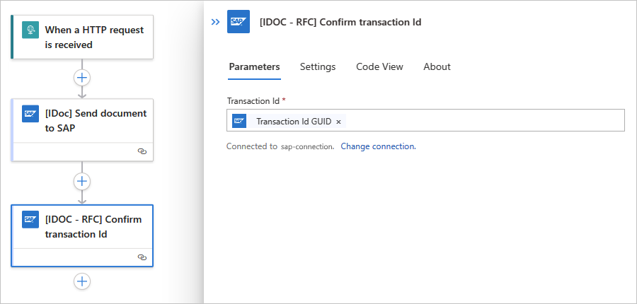

   After this step runs, the current transaction is marked complete at both ends, on the SAP connector side and on SAP system side.

<a name="create=transaction-ID-variable"></a>

### Avoid sending duplicate IDocs with a transaction ID variable

If you experience a problem with your workflow sending duplicate IDocs to SAP, you can create a string variable that serves as an IDoc transaction identifier. You can then use this identifier to help prevent duplicate network transmissions in conditions such as temporary outages, network issues, or lost acknowledgments.

1. In the designer, after you add the Request trigger, and before you add the SAP action named **[IDOC] Send document to SAP**, add the action named **Initialize variable** to your workflow.

1. Rename the action to **Create IDoc transaction ID**.

1. In the action information box, provide the following parameter values:

   | Parameter | Value | Description |
   |-----------|-------|-------------|
   | **Name** | <*variable-name*> | A name for your variable, for example, **IDocTransactionID** |
   | **Type** | **String** | The variable type |
   | **Value** | `guid()` | Select inside the edit box, open the expression or function editor, and enter **guid()**. Save your changes. <br><br>The **Value** parameter is now set to the **guid()** function, which generates a GUID.|

   **Consumption workflow**

   

   **Standard workflow**

   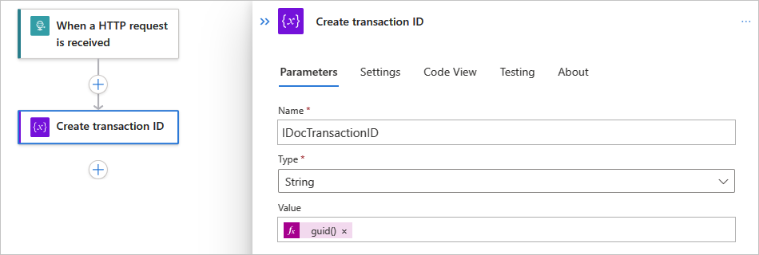

   > [!NOTE]
   >
   > SAP systems forget a transaction identifier after a specified time, or 24 hours by default. As a result, SAP never fails 
   > to confirm a transaction identifier if the ID or GUID is unknown. If confirmation for a transaction identifier fails, 
   > this failure indicates that communcation with the SAP system failed before SAP was able to acknowledge the confirmation.

1. Add the SAP action named **[IDOC] Send document to SAP** to your workflow. Provide the information for the IDoc that you send to your SAP system plus the following values:

   | Parameter | Value | Description |
   |-----------|-------|-------------|
   | **Confirm TID** | **No** | Don't automatically confirm the transaction ID, which explicitly happens in a separate step. |
   | **Transaction Id GUID** | <*IDoc-transaction-ID*> | If this parameter doesn't automatically appear, open the **Add new parameters** list, and select the parameter. To select the transaction ID variable that you created, follow these steps: <br><br> 1. In the **Transaction Id GUID** parameter, select inside the edit box to open the dynamic content list. <br><br>2. From the list, under **Variables**, select the variable that you previously created, which is **IDocTransactionID** in this example. |

   **Consumption workflow**

   

   **Standard workflow**

   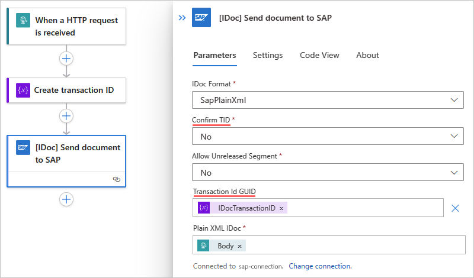

1. For the SAP managed action named **[IDOC] Send document to SAP**, open **Settings** to review the **Retry Policy**.

   The **Default** option is the recommended policy, but you can select a custom policy for your specific needs. If you choose to use a custom policy, set up at least one retry to overcome temporary network outages.

   > [!NOTE]
   >
   > Only managed connector actions currently have the Retry Policy setting, not built-in, service provider-based connectors.

1. Now, add the SAP action named **[IDOC - RFC] Confirm transaction Id**.

   1. In the **Transaction ID** parameter, select inside the edit box to open the dynamic content list.

   1. From the list, under **Variables**, enter the name for the variable that you created, which is **IDocTransactionID** in this example.

      **Consumption workflow**

      

      **Standard workflow**

      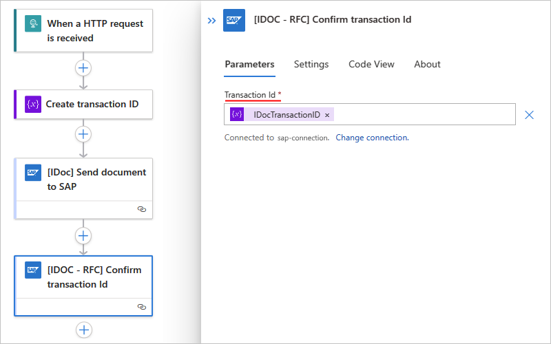

1. Optionally, validate the deduplication in your test environment.

    1. Add another SAP action named **[IDOC] Send document to SAP**. In the **Transaction ID** parameter, select the **Transaction ID** GUID that you used in the previous step.
    
    1. To validate which IDoc number gets assigned after each call to the action named **[IDOC] Send document to SAP**, add the action named **[IDOC] Get IDOC list for transaction** to your workflow with the same **Transaction ID** and the **Receive** direction.

       If the same IDoc number is returned for both calls, the IDoc was deduplicated.

If you send the same IDoc twice, you can validate that SAP can identify the duplication of the tRFC call, and resolve the two calls to a single inbound IDoc message.

<a name="troubleshoot"></a>

## Troubleshoot problems

<a name="troubleshoot-connections"></a>

### Connection problems

During connection creation, if you receive the following error, a problem exists with your installation of the SAP NCo client library: 

**Test connection failed. Error 'Failed to process request. Error details: 'could not load file or assembly 'sapnco, Version=3.0.0.42, Culture=neutral, PublicKeyToken 50436dca5c7f7d23' or one of its dependencies. The system cannot find the file specified.'.'**

Make sure to [install the required version of the SAP NCo client library and meet all other prerequisites](logic-apps-using-sap-connector.md#sap-client-library-prerequisites).

<a name="bad-gateway-request"></a>

### 500 Bad Gateway or 400 Bad Request error

If you receive a **500 Bad Gateway** or **400 Bad Request** error with a message similar to **service 'sapgw00' unknown**, the network service name resolution to port number is failing, for example:

```json
{
   "body": {
      "error": {
         "code": 500,
         "source": "EXAMPLE-FLOW-NAME.eastus.environments.microsoftazurelogicapps.net",
         "clientRequestId": "00000000-0000-0000-0000-000000000000",
         "message": "BadGateway",
         "innerError": {
            "error": {
               "code": "UnhandledException",
               "message": "\nERROR service 'sapgw00' unknown\nTIME Wed Nov 11 19:37:50 2020\nRELEASE 721\nCOMPONENT NI (network interface)\nVERSION 40\nRC -3\nMODULE ninti.c\nLINE 933\nDETAIL NiPGetServByName: 'sapgw00' not found\nSYSTEM CALL getaddrinfo\nCOUNTER 1\n\nRETURN CODE: 20"
            }
         }
      }
   }
}
```

* **Option 1:** In your API connection and trigger configuration, replace your gateway service name with its port number. In the example error, `sapgw00` needs to be replaced with a real port number, for example, `3300`. This is the only available option for ISE.

* **Option 2:** If you're using the on-premises data gateway, you can add the gateway service name to the port mapping in `%windir%\System32\drivers\etc\services` and then restart the on-premises data gateway service, for example:

  ```text
  sapgw00  3300/tcp
  ```

You might get a similar error when SAP Application server or Message server name resolves to the IP address. For ISE, you must specify the IP address for your SAP Application server or Message server. For the on-premises data gateway, you can instead add the name to the IP address mapping in `%windir%\System32\drivers\etc\hosts`, for example:

```text
10.0.1.9 SAPDBSERVER01 # SAP System Server VPN IP by computer name
10.0.1.9 SAPDBSERVER01.someguid.xx.xxxxxxx.cloudapp.net # SAP System Server VPN IP by fully qualified computer name
```

<a name="errors-sending-idoc-packets"></a>

## Errors sending IDoc packets from SAP to your trigger

If you can't send IDoc packets from SAP to your trigger, review the Transactional RFC (tRFC) call rejection message in the SAP tRFC (T-Code SM58) dialog box. In the SAP interface, you might get the following error messages, which are clipped due to the substring limits on the **Status Text** field.

### The segment or group definition E2EDK36001 was not found in the IDoc meta

This error message means expected failures happen with other errors. For example, the failure to generate an IDoc XML payload because its segments aren't released by SAP. As a result, the segment type metadata required for conversion is missing.

To have these segments released by SAP, contact the ABAP engineer for your SAP system.

### The RequestContext on the IReplyChannel was closed without a reply being sent

For SAP managed connector and ISE-versioned SAP connector, this error message means unexpected failures happen when the catch-all handler for the channel terminates the channel due to an error, and rebuilds the channel to process other messages.

> [!NOTE]
>
> The SAP managed trigger and ISE-versioned SAP triggers are webhooks that use the SOAP-based SAP adapter. However, the SAP built-in trigger is an Azure Functions-based trigger that doesn't use a SOAP SAP adapter and doesn't get this error message.

- To acknowledge that your workflow received the IDoc, [add a Response action](../connectors/connectors-native-reqres.md#add-a-response-action) that returns a **200 OK** status code. Leave the body empty and don't change or add to the headers. The IDoc is transported through tRFC, which doesn't allow for a response payload.

- To reject the IDoc instead, respond with any HTTP status code other than **200 OK**. The SAP Adapter then returns an exception back to SAP on your behalf. You should only reject the IDoc to signal transport errors back to SAP, such as a misrouted IDoc that your application can't process. You shouldn't reject an IDoc for application-level errors, such as issues with the data contained in the IDoc. If you delay transport acceptance for application-level validation, you might experience negative performance due to blocking your connection from transporting other IDocs.

- If you receive this error message and experience systemic failures calling Azure Logic Apps, check that you've configured the network settings for your on-premises data gateway service for your specific environment. For example, if your network environment requires the use of a proxy to call Azure endpoints, you need to configure your on-premises data gateway service to use your proxy. For more information, review [Proxy Configuration](/dotnet/framework/network-programming/proxy-configuration).

- If you receive this error message and experience intermittent failures calling Azure Logic Apps, you might need to increase your retry count or also retry interval by following these steps:

  1. Check the SAP settings in your on-premises data gateway service configuration file named **Microsoft.PowerBI.EnterpriseGateway.exe.config**.

     1. Under the `configuration` root node, add a `configSections` element, if none exist.

     1. Under the `configSections` node, add a `section` element with the following attributes, if none exist: `name="SapAdapterSection" type="Microsoft.Adapters.SAP.Common.SapAdapterSection, Microsoft.Adapters.SAP.Common"`

        > [!IMPORTANT]
        >
        > Don't change the attributes in existing `section` elements, if such elements already exist.

        Your `configSections` element looks like the following version, if no other section or section group is declared in the gateway service configuration:

        ```xml
        <configSections>
          <section name="SapAdapterSection" type="Microsoft.Adapters.SAP.Common.SapAdapterSection, Microsoft.Adapters.SAP.Common"/>
        </configSections>
        ```

     1. Under the `configuration` root node, add an `SapAdapterSection` element, if none exists.

     1. Under the `SapAdapterSection` node, add a `Broker` element with the following attributes, if none exist: `WebhookRetryDefaultDelay="00:00:00.10" WebhookRetryMaximumCount="2"`

        > [!IMPORTANT]
        > Change the attributes for the `Broker` element, even if the element already exists.

        The `SapAdapterSection` element looks like the following version, if no other element or attribute is declared in the SAP adapter configuration:

        ```xml
        <SapAdapterSection>
          <Broker WebhookRetryDefaultDelay="00:00:00.10" WebhookRetryMaximumCount="2" />
        </SapAdapterSection>
        ```

        The retry count setting looks like `WebhookRetryMaximumCount="2"`. The retry interval setting looks like `WebhookRetryDefaultDelay="00:00:00.10"` where the timespan format is `HH:mm:ss.ff`.

     > [!NOTE]
     > For more information about the configuration file, review [Configuration file schema for .NET Framework](/dotnet/framework/configure-apps/file-schema/).

  1. Save your changes.

  1. If you're using the on-premises data gateway, restart your gateway.

## Next steps

- [Generate schemas for artifacts in SAP](sap-generate-schemas-for-artifacts.md)