# Send related messages in order by using a sequential convoy in Azure Logic Apps with Azure Service Bus

When you need to send correlated messages in a specific order, you can follow the [*sequential convoy* pattern](https://docs.microsoft.com/azure/architecture/patterns/sequential-convoy) when using [Azure Logic Apps](../logic-apps/logic-apps-overview.md) by using the [Azure Service Bus connector](../connectors/connectors-create-api-servicebus.md). Correlated messages have a property that defines the relationship between those messages, such as the ID for the [session](../service-bus-messaging/message-sessions.md) in Service Bus.

For example, suppose that you have 10 messages for a session named "Session 1", and you have 5 messages for a session named "Session 2" that are all sent to the same [Service Bus queue](../service-bus-messaging/service-bus-queues-topics-subscriptions.md). You can create a logic app that processes messages from the queue so that all messages from "Session 1" are handled by a single trigger run and all messages from "Session 2" are handled by the next trigger run.

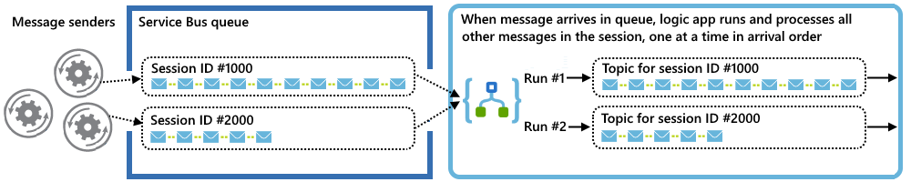

This article shows how to create a logic app that implements this pattern by using the **Correlated in-order delivery using service bus sessions** template. This template defines a logic app workflow that starts with the Service Bus connector's **When a message is received in a queue (peek-lock)** trigger, which receives messages from a [Service Bus queue](../service-bus-messaging/service-bus-queues-topics-subscriptions.md). Here are the high-level steps that this logic app performs:

* Initialize a session based on a message that the trigger reads from the Service Bus queue.

* Read and process all the messages from the same session in the queue during the current workflow run.

To review this template's JSON file, see [GitHub: service-bus-sessions.json](https://github.com/Azure/logicapps/blob/master/templates/service-bus-sessions.json).

For more information, see [Sequential convoy pattern - Azure Architecture Cloud Design Patterns](https://docs.microsoft.com/azure/architecture/patterns/sequential-convoy).

## Prerequisites

* An Azure subscription. If you don't have a subscription, [sign up for a free Azure account](https://azure.microsoft.com/free/).

* A Service Bus namespace and a [Service Bus queue](../service-bus-messaging/service-bus-queues-topics-subscriptions.md), which is a messaging entity that you'll use in your logic app. These items and your logic app need to use the same Azure subscription. Make sure that you select **Enable sessions** when you create your queue. If you don't have these items, learn [how to create your Service Bus namespace and a queue](../service-bus-messaging/service-bus-create-namespace-portal.md).

  [!INCLUDE [Warning about creating infinite loops](../../includes/connectors-infinite-loops.md)]

* Basic knowledge about how to create logic apps. If you're new to Azure Logic Apps, try the quickstart, [Create your first automated workflow](../logic-apps/quickstart-create-first-logic-app-workflow.md).

<a name="permissions-connection-string"></a>

## Check access to Service Bus namespace

If you're not sure whether your logic app has permissions to access your Service Bus namespace, confirm those permissions.

1. Sign in to the [Azure portal](https://portal.azure.com). Find and select your Service Bus *namespace*.

1. On the namespace menu, under **Settings**, select **Shared access policies**. Under **Claims**, check that you have **Manage** permissions for that namespace.

   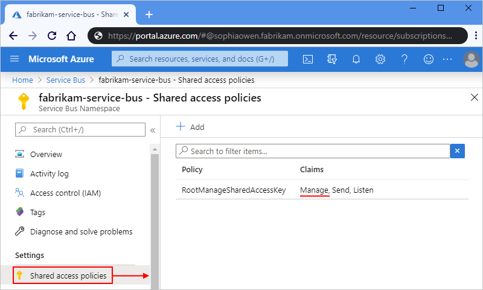

1. Now get the connection string for your Service Bus namespace. You can use this string later when you create a connection to the namespace from your logic app.

   1. On the **Shared access policies** pane, under **Policy**, select **RootManageSharedAccessKey**.
   
   1. Next to your primary connection string, select the copy button. Save the connection string for later use.

      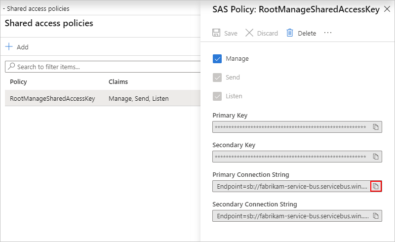

   > [!TIP]
   > To confirm whether your connection string is associated with 
   > your Service Bus namespace or a messaging entity, such as a queue, 
   > search the connection string for the `EntityPath` parameter. 
   > If you find this parameter, the connection string is for a specific entity, 
   > and isn't the correct string to use with your logic app.

## Create logic app

In this section, you create a logic app by using the **Correlated in-order delivery using service bus sessions** template, which includes the trigger and actions for implementing this workflow pattern. You also create a connection to your Service Bus namespace and specify the name for the Service Bus queue that you want to use.

1. In the [Azure portal](https://portal.azure.com), create a blank logic app. From the Azure home page, select **Create a resource** > **Integration** > **Logic App**.

1. After the template gallery appears, scroll past the video and the common triggers sections. From the **Templates** section, select the template, **Correlated in-order delivery using service bus sessions**.

   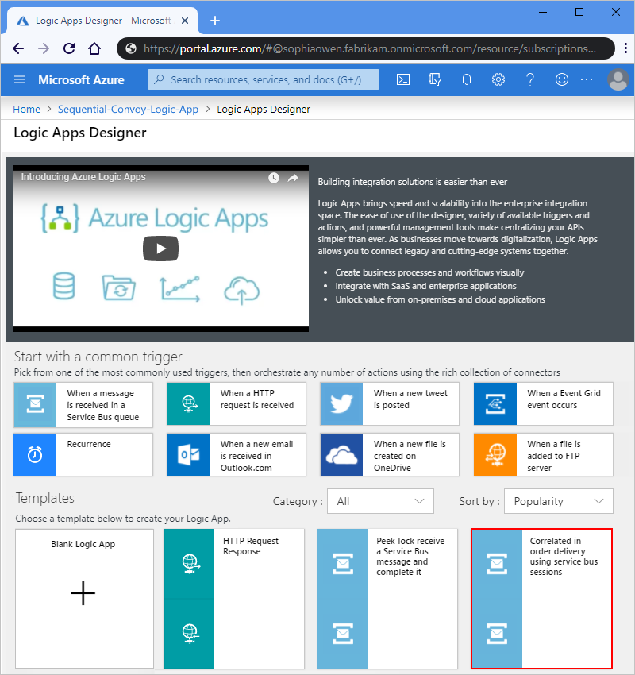

1. When the confirmation box appears, select **Use this template**.

1. On the Logic App Designer, in the **Service Bus** shape, select **Continue**, and then select the plus sign (**+**) that appears in the shape.

   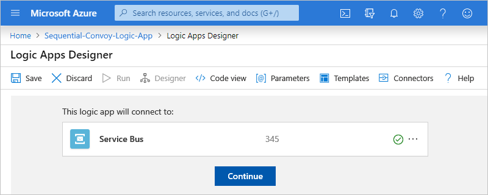

1. Now create a Service Bus connection by choosing either option:

   * To use the connection string that you copied earlier from your Service Bus namespace, follow these steps:

     1. Select **Manually enter connection information**.

     1. For **Connection Name**, provide a name for your connection. For **Connection String**, paste your namespace connection string, and select **Create**, for example:

        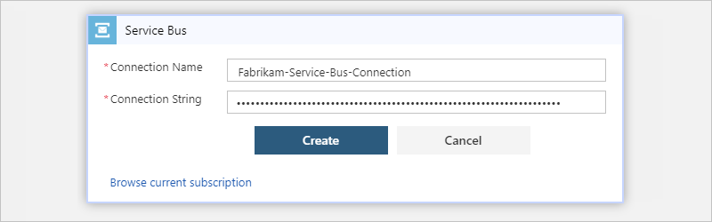

        > [!TIP]
        > If you don't have this connection string, learn how to 
        > [find and copy the Service Bus namespace connection string](#permissions-connection-string).

   * To select a Service Bus namespace from your current Azure subscription, follow these steps:

     1. For **Connection Name**, provide a name for your connection. For **Service Bus Namespace**, select your Service Bus namespace, for example:

        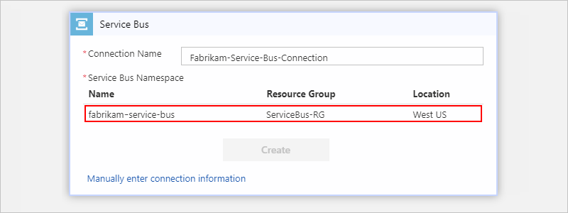

     1. When the next pane appears, select your Service Bus policy, and select **Create**.

        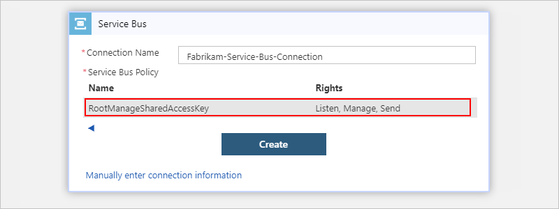

1. When you're done, select **Continue**.

   The Logic App Designer now shows the **Correlated in-order delivery using service bus sessions** template, which contains a pre-populated workflow with a trigger and actions, including two scopes that implement error handling that follow the `Try-Catch` pattern.

Now you can either learn more about the trigger and actions in the template, or jump ahead to [provide the values for the logic app template](#complete-template).

<a name="template-summary"></a>

## Template summary

Here is the top-level workflow in the **Correlated in-order delivery using service bus sessions** template when the details are collapsed:

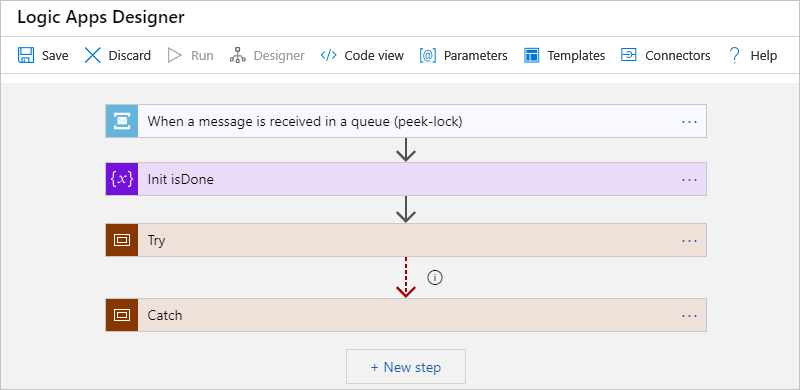

| Name | Description |
|------|-------------|
| **`When a message is received in a queue (peek-lock)`** | Based on the specified recurrence, this Service Bus trigger checks the specified Service Bus queue for any messages. If a message exists in the queue, the trigger fires, which creates and runs a workflow instance. <p><p>The term *peek-lock* means that the trigger sends a request to retrieve a message from the queue. If a message exists, the trigger retrieves and locks the message so that no other processing happens on that message until the lock period expires. For details, [Initialize the session](#initialize-session). |
| **`Init isDone`** | This [**Initialize variable** action](../logic-apps/logic-apps-create-variables-store-values.md#initialize-variable) creates a Boolean variable that's set to `false` and indicates when the following conditions are true: <p><p>- No more messages in the session are available to read. <br>- The session lock no longer needs to be renewed so that the current workflow instance can finish. <p><p>For details, see [Initialize the session](#initialize-session). |
| **`Try`** | This [**Scope** action](../logic-apps/logic-apps-control-flow-run-steps-group-scopes.md) contains the actions that run to process a message. If a problem happens in the `Try` scope, the subsequent `Catch` **Scope** action handles that problem. For more information, see ["Try" scope](#try-scope). |
| **`Catch`**| This [**Scope** action](../logic-apps/logic-apps-control-flow-run-steps-group-scopes.md) contains the actions that run if a problem happens in the preceding `Try` scope. For more information, see ["Catch" scope](#catch-scope). |
|||

<a name="try-scope"></a>

### "Try" scope

Here is the top-level flow in the `Try` [scope action](../logic-apps/logic-apps-control-flow-run-steps-group-scopes.md) when the details are collapsed:

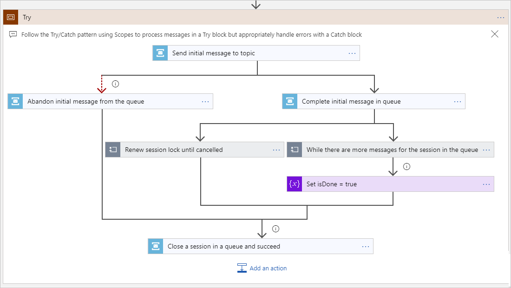

| Name | Description |
|------|-------------|
| **`Send initial message to topic`** | You can replace this action with whatever action that you want to handle the first message from the session in the queue. The session ID specifies the session. <p><p>For this template, a Service Bus action sends the first message to a Service Bus topic. For details, see [Handle the initial message](#handle-initial-message). |
| (parallel branch) | This [parallel branch action](../logic-apps/logic-apps-control-flow-branches.md) creates two paths: <p><p>- Branch #1: Continue processing the message. For more information, see [Branch #1: Complete initial message in queue](#complete-initial-message). <p><p>- Branch #2: Abandon the message if something goes wrong, and release for pickup by another trigger run. For more information, see [Branch #2: Abandon initial message from queue](#abandon-initial-message). <p><p>Both paths join up later in the **Close session in a queue and succeed** action, described in the next row. |
| **`Close a session in a queue and succeed`** | This Service Bus action joins the previously described branches and closes the session in the queue after either of the following events happen: <p><p>- The workflow finishes processing available messages in the queue. <br>- The workflow abandons the initial message because something went wrong. <p><p>For details, see [Close a session in a queue and succeed](#close-session-succeed). |
|||

<a name="complete-initial-message"></a>

#### Branch #1: Complete initial message in queue

| Name | Description |
|------|-------------|
| `Complete initial message in queue` | This Service Bus action marks a successfully retrieved message as complete and removes the message from the queue to prevent reprocessing. For details, see [Handle the initial message](#handle-initial-message). |
| `While there are more messages for the session in the queue` | This [**Until** loop](../logic-apps/logic-apps-control-flow-loops.md#until-loop) continues to get messages while messages exists or until one hour passes. For more information about the actions in this loop, see [While there are more messages for the session in the queue](#while-more-messages-for-session). |
| **`Set isDone = true`** | When no more messages exist, this [**Set variable** action](../logic-apps/logic-apps-create-variables-store-values.md#set-variable) sets `isDone` to `true`. |
| **`Renew session lock until cancelled`** | This [**Until** loop](../logic-apps/logic-apps-control-flow-loops.md#until-loop) makes sure that the session lock is held by this logic app while messages exist or until one hour passes. For more information about the actions in this loop, see [Renew session lock until cancelled](#renew-session-while-messages-exist). |
|||

<a name="abandon-initial-message"></a>

#### Branch #2: Abandon initial message from the queue

If the action that handles the first message fails, the Service Bus action, **Abandon initial message from the queue**, releases the message for another workflow instance run to pick up and process. For details, see [Handle the initial message](#handle-initial-message).

<a name="catch-scope"></a>

### "Catch" scope

If actions in the `Try` scope fail, the logic app must still close the session. The `Catch` [scope action](../logic-apps/logic-apps-control-flow-run-steps-group-scopes.md) runs when the `Try` scope action results in the status, `Failed`, `Skipped`, or `TimedOut`. The scope returns an error message that includes the session ID where the problem happened, and terminates the logic app.

Here is the top-level flow in the `Catch` scope action when the details are collapsed:

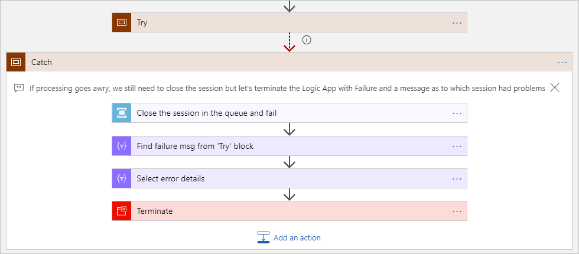

| Name | Description |
|------|-------------|
| **`Close a session in a queue and fail`** | This Service Bus action closes the session in the queue so that the session lock doesn't stay open. For details, see [Close a session in a queue and fail](#close-session-fail). |
| **`Find failure msg from 'Try' block`** | This [**Filter Array** action](../logic-apps/logic-apps-perform-data-operations.md#filter-array-action) creates an array from the inputs and outputs from all the actions inside the `Try` scope based on the specified criteria. In this case, this action returns the outputs from the actions that resulted in `Failed` status. For details, see [Find failure msg from 'Try' block](#find-failure-message). |
| **`Select error details`** | This [**Select** action](../logic-apps/logic-apps-perform-data-operations.md#select-action) creates an array that contains JSON objects based on the specified criteria. These JSON objects are built from the values in the array created by the previous action, `Find failure msg from 'Try' block`. In this case, this action returns an array that contains a JSON object created from the error details returned from the previous action. For details, see [Select error details](#select-error-details). |
| **`Terminate`** | This [**Terminate** action](../logic-apps/logic-apps-workflow-actions-triggers.md#terminate-action) stops the run for the workflow, cancels any actions in progress, skips any remaining actions, and returns the specified status, the session ID, and the error result from the `Select error details` action. For details, see [Terminate logic app](#terminate-logic-app). |
|||

<a name="complete-template"></a>

## Complete the template

To provide the values for the trigger and actions in the **Correlated in-order delivery using service bus sessions** template, follow these steps. You have to provide all the required values, which are marked by an asterisk (**\***), before you can save your logic app.

<a name="initialize-session"></a>

### Initialize the session

* For the **When a message is received in a queue (peek-lock)** trigger, provide this information so that the template can initialize a session by using the **Session id** property, for example:

  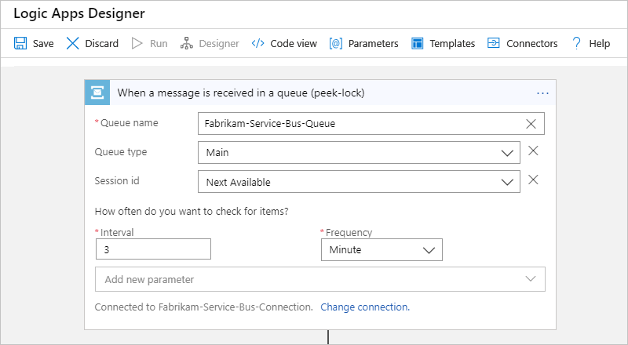

  > [!NOTE]
  > Initially, the polling interval is set to three minutes so that the logic app doesn't 
  > run more frequently than you expect and result in unanticipated billing charges. Ideally, 
  > set the interval and frequency to 30 seconds so that the logic app triggers immediately 
  > when a message arrives.

  | Property | Required for this scenario | Value | Description |
  |----------|----------------------------|-------|-------------|
  | **Queue name** | Yes | <*queue-name*> | The name for your previously created Service Bus queue. This example uses "Fabrikam-Service-Bus-Queue". |
  | **Queue type** | Yes | **Main** | Your primary Service Bus queue |
  | **Session id** | Yes | **Next available** | This option gets a session for each trigger run, based on the session ID from the message in the Service Bus queue. The session is also locked so that no other logic app or other client can process messages that are related to this session. The workflow's subsequent actions process all the messages that are associated with that session, as described later in this article. <p><p>Here is more information about the other **Session id** options: <p>- **None**: The default option, which results in no sessions and can't be used for implementing the sequential convoy pattern. <p>- **Enter custom value**: Use this option when you know the session ID that you want to use, and you always want to run the trigger for that session ID. <p>**Note**: The Service Bus connector can save a limited number of unique sessions at a time from Azure Service Bus to the connector cache. If the session count exceeds this limit, old sessions are removed from the cache. For more information, see [Exchange messages in the cloud with Azure Logic Apps and Azure Service Bus](../connectors/connectors-create-api-servicebus.md#connector-reference). |
  | **Interval** | Yes | <*number-of-intervals*> | The number of time units between recurrences before checking for a message. |
  | **Frequency** | Yes | **Second**, **Minute**, **Hour**, **Day**, **Week**, or **Month** | The unit of time for the recurrence to use when checking for a message. <p>**Tip**: To add a **Time zone** or **Start time**, select these properties from the **Add new parameter** list. |
  |||||

  For more trigger information, see [Service Bus - When a message is received in a queue (peek-lock)](https://docs.microsoft.com/connectors/servicebus/#when-a-message-is-received-in-a-queue-(peek-lock)). The trigger outputs a [ServiceBusMessage](https://docs.microsoft.com/connectors/servicebus/#servicebusmessage).

After initializing the session, the workflow uses the **Initialize variable** action to create a Boolean variable that initially set to `false` and indicates when the following conditions are true: 

* No more messages in the session are available to read.

* The session lock no longer needs to be renewed so that the current workflow instance can finish.

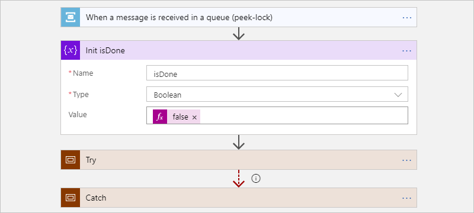

Next, in the **Try** block, the workflow performs actions on the first message that's read.

<a name="handle-initial-message"></a>

### Handle the initial message

The first action is a placeholder Service Bus action, **Send initial message to topic**, which you can replace with any other action that you want to handle the first message from the session in the queue. The session ID specifies the session from where the message originated.

The placeholder Service Bus action sends the first message to a Service Bus topic that's specified by the **Session Id** property. That way, all the messages that are associated with a specific session go to the same topic. All **Session Id** properties for subsequent actions in this template use the same session ID value.

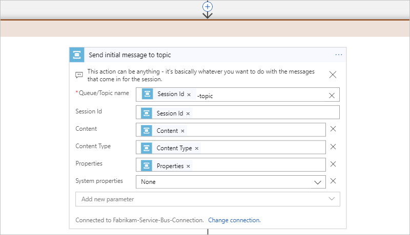

1. In the Service Bus action, **Complete initial message in queue**, provide the name for your Service Bus queue, and keep all the other default property values in the action.

   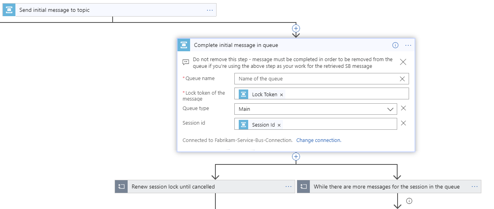

1. In the Service Bus action, **Abandon initial message from the queue**, provide the name for your Service Bus queue, and keep all the other default property values in the action.

   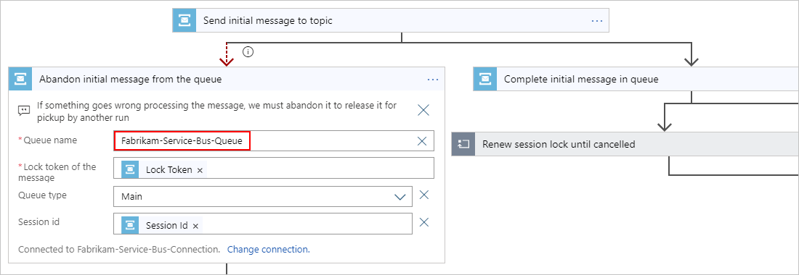

Next, you'll provide the necessary information for the actions that follow the **Complete initial message in queue** action. You'll start with the actions in the **While there are more messages for the session in the queue** loop.

<a name="while-more-messages-for-session"></a>

### While there are more messages for the session in the queue

This [**Until** loop](../logic-apps/logic-apps-control-flow-loops.md#until-loop) runs these actions while messages exist in the queue or until one hour passes. To change the loop's time limit, edit the loop's **Timeout** property value.

* Get additional messages from the queue while messages exist.

* Check the number of remaining messages. If messages still exist, continue processing messages. If no more messages exist, the workflow sets the `isDone` variable to `true`, and exits the loop.

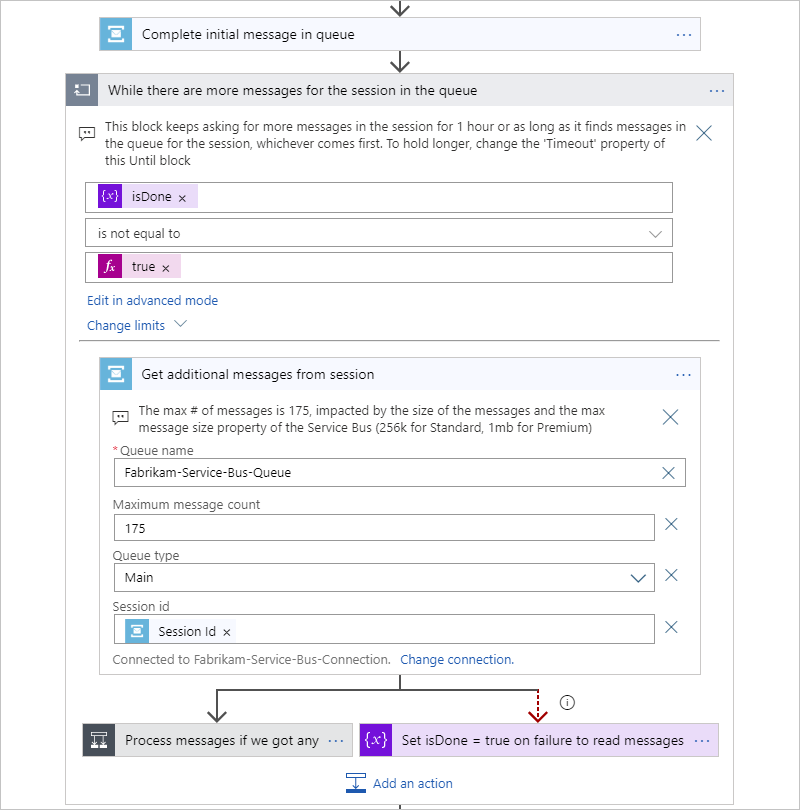

1. In the Service Bus action, **Get additional messages from session**, provide the name for your Service Bus queue. Otherwise, keep all the other default property values in the action.

   > [!NOTE]
   > By default, the maximum number of messages is set to `175`, but this limit 
   > is affected by the message size and maximum message size property in Service Bus. 
   > Currently, this limit is 256K for Standard and 1 MB for Premium.

   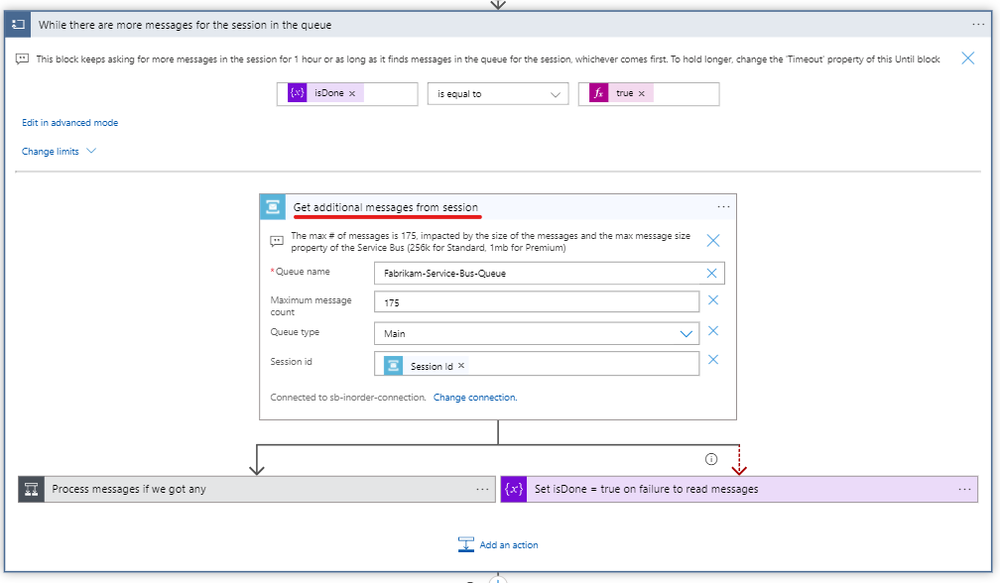

   Next, the workflow splits into these parallel branches:

   * If an error or failure happens while checking for additional messages, set the `isDone` variable to `true`.

   * The **Process messages if we got any** condition checks whether the number of remaining messages is zero. If false and more messages exist, continue processing. If true and no more messages exist, the workflow sets the `isDone` variable to `true`.

   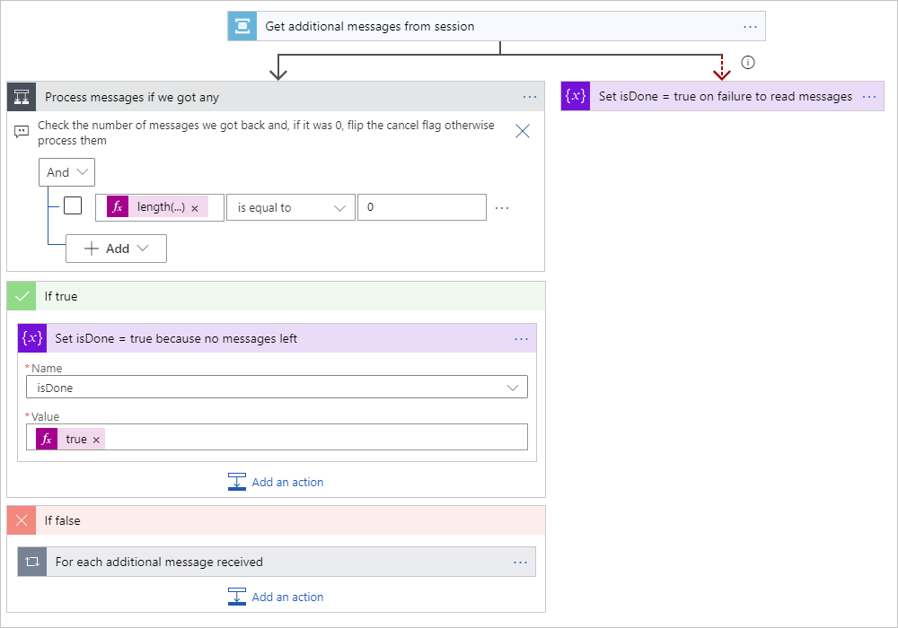

   In the **If false** section, a **For each** loop processes each message in first-in, first-out order (FIFO). In the loop's **Settings**, the **Concurrency Control** setting is set to `1`, so only a single message is processed at a time.

   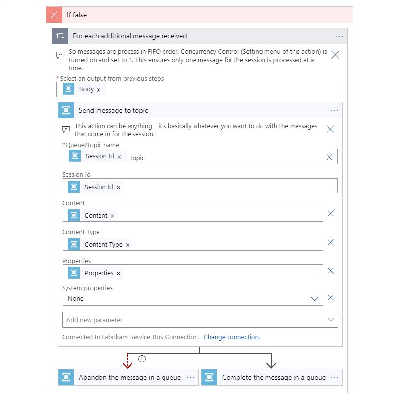

1. For the Service Bus actions, **Complete the message in a queue** and **Abandon the message in a queue**, provide the name for your Service Bus queue.

   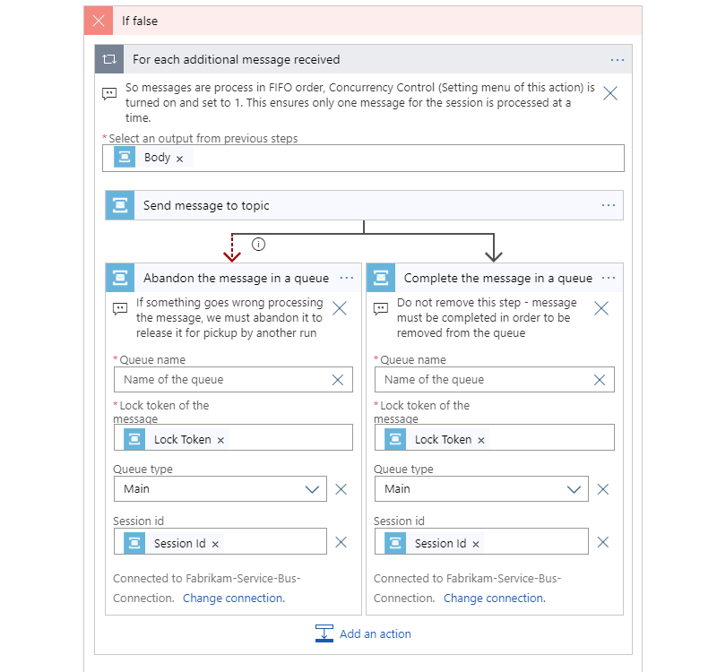

   After the **While there are more messages for the session in the queue** is done, the workflow sets the `isDone` variable to `true`.

Next, you'll provide the necessary information for the actions in the **Renew session lock until cancelled** loop.

<a name="renew-session-while-messages-exist"></a>

### Renew session lock until cancelled

This [**Until** loop](../logic-apps/logic-apps-control-flow-loops.md#until-loop) makes sure that the session lock is held by this logic app while messages exist in the queue or until one hour passes by running these actions. To change the loop's time limit, edit the loop's **Timeout** property value.

* Delay for 25 seconds or an amount of time that's less than the lock timeout duration for the queue that's being processed. The smallest lock duration is 30 seconds, so the default value is enough. However, you can optimize the number of times that the loop runs by adjusting appropriately.

* Check whether the `isDone` variable is set to `true`.

  * If `isDone` is not set to `true`, the workflow is still processing messages, so the workflow renews the lock on the session in the queue, and checks the loop condition again.

    You need to provide the name for your Service Bus queue in the Service Bus action, [**Renew lock on the session in a queue**](#renew-lock-on-session).

  * If `isDone` is set to `true`, the workflow doesn't renew the lock on the session in the queue, and exits the loop.

  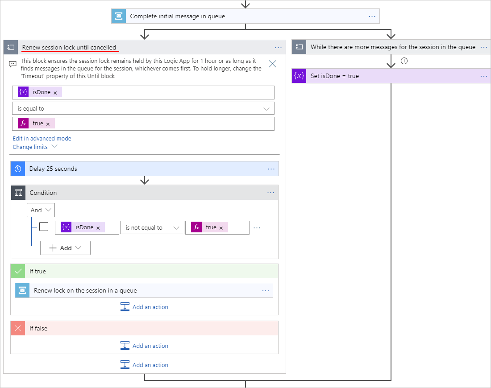

<a name="renew-lock-on-session"></a>

#### Renew lock on the session in a queue

This Service Bus action renews the lock on the session in the queue while the workflow is still processing messages.

* In the Service Bus action, **Renew lock on the session in a queue**, provide the name for your Service Bus queue.

  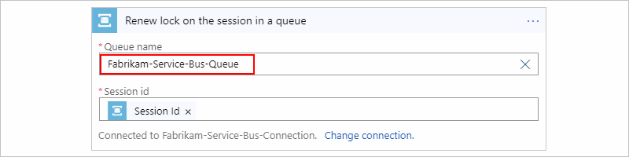

Next, you'll provide the necessary information for the Service Bus action, **Close a session in a queue and succeed**.

<a name="close-session-succeed"></a>

### Close a session in a queue and succeed

This Service Bus action closes the session in the queue after either the workflow finishes processing all the available messages in the queue, or the workflow abandons the initial message.

* In the Service Bus action, **Close a session in a queue and succeed**, provide the name for your Service Bus queue.

  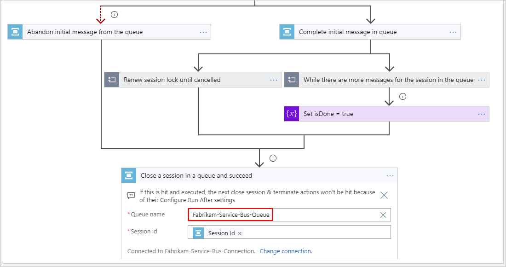

The following sections describe the actions in the `Catch` section, which handle errors and exceptions that happen in your workflow.

<a name="close-session-fail"></a>

### Close a session in a queue and fail

This Service Bus action always runs as the first action in the `Catch` scope and closes the session in the queue.

* In the Service Bus action, **Close a session in a queue and fail**, provide the name for your Service Bus queue.

  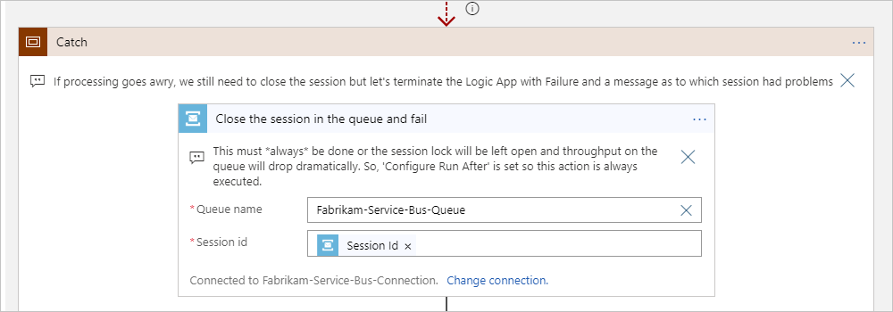

Next, the workflow creates an array that has the inputs and outputs from all the actions in the `Try` scope so that the logic app can access information about the error or failure that happened.

<a name="find-failure-message"></a>

### Find failure msg from 'Try' block

This [**Filter Array** action](../logic-apps/logic-apps-perform-data-operations.md#filter-array-action) creates an array that has the inputs and outputs from all the actions inside the `Try` scope based on the specified criteria by using the [`result()` function](../logic-apps/workflow-definition-language-functions-reference.md#result). In this case, this action returns the outputs from the actions that have `Failed` status by using the [`equals()` function](../logic-apps/workflow-definition-language-functions-reference.md#equals) and [`item()` function](../logic-apps/workflow-definition-language-functions-reference.md#item).

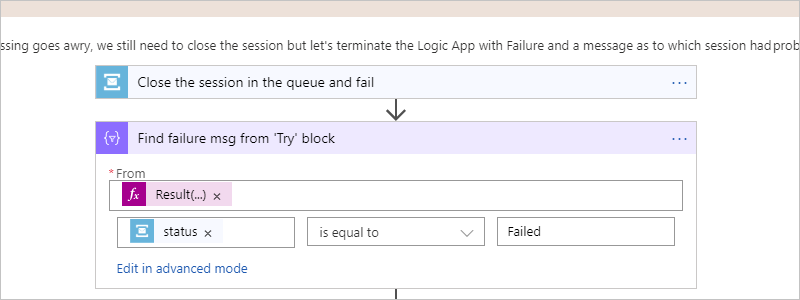

Here's the JSON definition for this action:

```json
"Find_failure_msg_from_'Try'_block": {
   "inputs": {
      "from": "@Result('Try')",
      "where": "@equals(item()['status'], 'Failed')"
   },
   "runAfter": {
      "Close_the_session_in_the_queue_and_fail": [
         "Succeeded"
      ]
   },
   "type": "Query"
},
```

Next, the workflow creates an array with a JSON object that contains the error information in the array returned from the `Find failure msg from 'Try' block` action.

<a name="select-error-details"></a>

### Select error details

This [**Select** action](../logic-apps/logic-apps-perform-data-operations.md#select-action) creates an array that contains JSON objects based on the input array that's output from the previous action, `Find failure msg from 'Try' block`. Specifically, this action returns an array that has only the specified properties for each object in the array. In this case, the array contains the action name and error result properties.

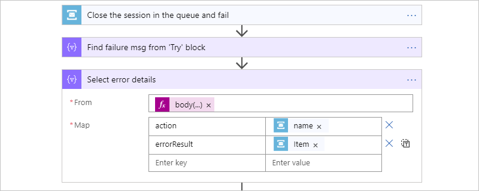

Here's the JSON definition for this action:

```json
"Select_error_details": {
   "inputs": {
      "from": "@body('Find_failure_msg_from_''Try''_block')[0]['outputs']",
      "select": {
         "action": "@item()['name']",
         "errorResult": "@item()"
      }
   },
   "runAfter": {
      "Find_failure_msg_from_'Try'_block": [
         "Succeeded"
      ]
   },
   "type": "Select"
},
```

Next, the workflow stops the logic app run and returns the run status along with more information about the error or failure that happened.

<a name="terminate-logic-app"></a>

### Terminate logic app run

This [**Terminate** action](../logic-apps/logic-apps-workflow-actions-triggers.md#terminate-action) stops the logic app run and returns `Failed` as the status for the logic app's run along with the session ID and the error result from the `Select error details` action.

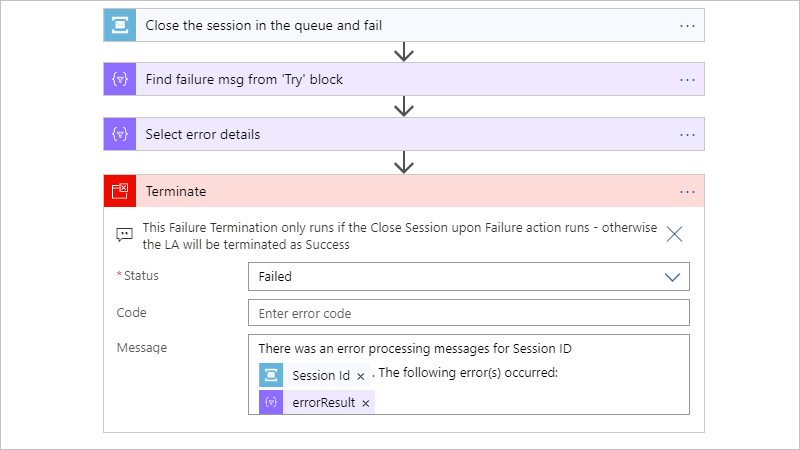

Here's the JSON definition for this action:

```json
"Terminate": {
   "description": "This Failure Termination only runs if the Close Session upon Failure action runs - otherwise the LA will be terminated as Success",
   "inputs": {
      "runError": {
         "code": "",
         "message": "There was an error processing messages for Session ID @{triggerBody()?['SessionId']}. The following error(s) occurred: @{body('Select_error_details')['errorResult']}"
         },
         "runStatus": "Failed"
      },
      "runAfter": {
         "Select_error_details": [
            "Succeeded"
         ]
      },
      "type": "Terminate"
   }
},
```

## Save and run logic app

After you complete the template, you can now save your logic app. On the designer toolbar, select **Save**.

To test your logic app, send messages to your Service Bus queue. 

## Next steps

* Learn more about the [Service Bus connector's triggers and actions](https://docs.microsoft.com/connectors/servicebus/)
