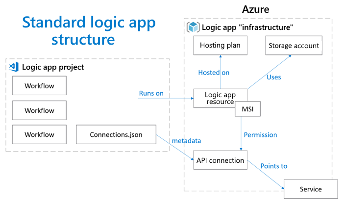

# Set up DevOps deployment for Standard logic app workflows in single-tenant Azure Logic Apps

[!INCLUDE [logic-apps-sku-standard](../../includes/logic-apps-sku-standard.md)]

This article shows how to deploy a Standard logic app project to single-tenant Azure Logic Apps from Visual Studio Code to your infrastructure by using DevOps tools and processes. Based on whether you prefer GitHub or Azure DevOps for deployment, choose the path and tools that work best for your scenario. You can use the included samples that contain example logic app projects plus examples for Azure deployment using either GitHub or Azure DevOps. For more information about DevOps for single-tenant, review [DevOps deployment overview for single-tenant Azure Logic Apps](devops-deployment-single-tenant-azure-logic-apps.md).

## Prerequisites

- An Azure account with an active subscription. If you don't have an Azure subscription, [create a free account](https://azure.microsoft.com/free/?WT.mc_id=A261C142F).

- A Standard logic app project created with [Visual Studio Code and the Azure Logic Apps (Standard) extension](create-single-tenant-workflows-visual-studio-code.md#prerequisites).

  If you haven't already set up your logic app project or infrastructure, you can use the included sample projects to deploy an example app and infrastructure, based on the source and deployment options you prefer to use. For more information about these sample projects and the resources included to run the example logic app, review [Deploy your infrastructure](#deploy-infrastructure).

- If you want to deploy to Azure, you need an existing **Logic App (Standard)** resource created in Azure. To quickly create an empty logic app resource, review [Create single-tenant based logic app workflows - Portal](create-single-tenant-workflows-azure-portal.md).

<a name="deploy-infrastructure"></a>

## Deploy infrastructure resources

If you haven't already set up a logic app project or infrastructure, you can use the following sample projects to deploy an example app and infrastructure, based on the source and deployment options you prefer to use:

- [GitHub sample for single-tenant Azure Logic Apps](https://github.com/Azure/logicapps/tree/master/github-sample)

  This sample includes an example logic app project for single-tenant Azure Logic Apps plus examples for Azure deployment and GitHub Actions.

- [Azure DevOps sample for single-tenant Azure Logic Apps](https://github.com/Azure/logicapps/tree/master/azure-devops-sample)

  This sample includes an example logic app project for single-tenant Azure Logic Apps plus examples for Azure deployment and Azure Pipelines.
  
Both samples include the following resources that a logic app uses to run.

| Resource name | Required | Description |
|---------------|----------|-------------|
| Logic App (Standard) | Yes | This Azure resource contains the workflows that run in single-tenant Azure Logic Apps. |
| Functions Premium or App Service hosting plan | Yes | This Azure resource specifies the hosting resources to use for running your logic app, such as compute, processing, storage, networking, and so on. <p><p>**Important**: In the current experience, the **Logic App (Standard)** resource requires the [**Workflow Standard** hosting plan](logic-apps-pricing.md#standard-pricing), which is based on the Functions Premium hosting plan. |
| Azure storage account | Yes, for both stateful and stateless workflows | This Azure resource stores the metadata, keys for access control, state, inputs, outputs, run history, and other information about your workflows. |
| Application Insights | Optional | This Azure resource provides monitoring capabilities for your workflows. |
| API connections | Optional, if none exist | These Azure resources define any managed API connections that your workflows use to run managed connector operations, such as Office 365, SharePoint, and so on. <p><p>**Important**: In your logic app project, the **connections.json** file contains metadata, endpoints, and keys for any managed API connections and Azure functions that your workflows use. To use different connections and functions in each environment, make sure that you parameterize the **connections.json** file and update the endpoints. <p><p>For more information, review [API connection resources and access policies](#api-connection-resources). |
| Azure Resource Manager (ARM) template | Optional | This Azure resource defines a baseline infrastructure deployment that you can reuse or [export](../azure-resource-manager/templates/template-tutorial-export-template.md). |
||||

<a name="api-connection-resources"></a>

## API connection resources and access policies

In single-tenant Azure Logic Apps, every managed or API connection resource in your workflows requires an associated access policy. This policy needs your logic app's identity to provide the correct permissions for accessing the managed connector infrastructure. The included sample projects include an ARM template that includes all the necessary infrastructure resources, including these access policies.

The following diagram shows the dependencies between your logic app project and infrastructure resources:



<a name="deploy-logic-app-resources"></a>  

## Deploy logic app resources (zip deploy)

After you push your logic app project to your source repository, you can set up build and release pipelines either inside or outside Azure that deploy logic apps to infrastructure.

### Build your project

To set up a build pipeline based on your logic app project type, complete the corresponding actions in the following table:

| Project type | Description and steps |
|--------------|-----------------------|
| Nuget-based | The NuGet-based project structure is based on the .NET Framework. To build these projects, make sure to follow the build steps for .NET Standard. For more information, review the documentation for [Create a NuGet package using MSBuild](/nuget/create-packages/creating-a-package-msbuild). |
| Bundle-based | The extension bundle-based project isn't language-specific and doesn't require any language-specific build steps. You can use any method to zip your project files. <br><br>**Important**: Make sure that your .zip file contains the actual build artifacts, including all workflow folders, configuration files such as host.json, connections.json, and any other related files. |
|||

### Before release to Azure

The managed API connections inside your logic app project's **connections.json** file are created specifically for local use in Visual Studio Code. Before you can release your project artifacts from Visual Studio Code to Azure, you have to update these artifacts. To use the managed API connections in Azure, you have to update their authentication methods so that they're in the correct format to use in Azure.

#### Update authentication type

For each managed API connection that uses authentication, you have to update the **authentication** object from the local format in Visual Studio Code to the Azure portal format, as shown by the first and second code examples, respectively:

**Visual Studio Code format**

```json
{
   "managedApiConnections": {
      "sql": {
         "api": {
            "id": "/subscriptions/xxxxxxxxxxxxxxxxxxxxxxxxxxxxxx/providers/Microsoft.Web/locations/westus/managedApis/sql"
      },
      "connection": {
         "id": "/subscriptions/xxxxxxxxxxxxxxxxxxxxxxxxxxxxxx/resourceGroups/ase/providers/Microsoft.Web/connections/sql-8"
      },
      "connectionRuntimeUrl": "https://xxxxxxxxxxxxxx.01.common.logic-westus.azure-apihub.net/apim/sql/xxxxxxxxxxxxxxxxxxxxxxxxx/",
      "authentication": {
         "type": "Raw",
         "scheme": "Key",
         "parameter": "@appsetting('sql-connectionKey')"
      }
   }
}
```

**Azure portal format**

```json
{
   "managedApiConnections": {
      "sql": {
         "api": {
            "id": "/subscriptions/xxxxxxxxxxxxxxxxxxxxxxxxxxxxxx/providers/Microsoft.Web/locations/westus/managedApis/sql"
      },
      "connection": {
         "id": "/subscriptions/xxxxxxxxxxxxxxxxxxxxxxxxxxxxxx/resourceGroups/ase/providers/Microsoft.Web/connections/sql-8"
      },
      "connectionRuntimeUrl": "https://xxxxxxxxxxxxxx.01.common.logic-westus.azure-apihub.net/apim/sql/xxxxxxxxxxxxxxxxxxxxxxxxx/",
      "authentication": {
         "type": "ManagedServiceIdentity",
      }
   }
}
```

#### Create API connections as needed

If you're deploying your logic app workflow to an Azure region or subscription different from your local development environment, you must also make sure to create these managed API connections before deployment. Azure Resource Manager template (ARM template) deployment is the easiest way to create managed API connections.
  
The following example shows a SQL managed API connection resource definition in an ARM template:

```json
{
   "type": "Microsoft.Web/connections",
   "apiVersion": "2016–06–01",
   "location": "[parameters('location')]",
   "name": "[parameters('connectionName')]",
   "properties": {
      "displayName": "sqltestconnector",
      "api": {
         "id": "/subscriptions/xxxxxxxxxxxxxxxxxxxxxxxxxxxxxx/providers/Microsoft.Web/locations/{Azure-region-location}/managedApis/sql"
      },
      "parameterValues": {
         "authType": "windows", 
         "database": "TestDB",
         "password": "TestPassword",
         "server": "TestServer",
         "username": "TestUserName"
      }
   }
}
```

To find the values that you need to use in the **properties** object for completing the connection resource definition, you can use the following API for a specific connector:

`GET https://management.azure.com/subscriptions/{Azure-subscription-ID}/providers/Microsoft.Web/locations/{Azure-region-location}/managedApis/{connector-name}?api-version=2016-06-01`

In the response, find the **connectionParameters** object, which contains all the information necessary for you to complete resource definition for that specific connector. The following example shows an example resource definition for a SQL managed connection:

```json
{
   "type": "Microsoft.Web/connections",
   "apiVersion": "2016–06–01",
   "location": "[parameters('location')]",
   "name": "[parameters('connectionName')]",
   "properties": {
      "displayName": "sqltestconnector",
      "api": {
         "id": "/subscriptions/{Azure-subscription-ID}/providers/Microsoft.Web/locations/{Azure-region-location}/managedApis/sql"
      },
      "parameterValues": {
         "authType": "windows",
         "database": "TestDB",
         "password": "TestPassword",
         "server": "TestServer",
         "username": "TestUserName"
      }
   }
}
```

As an alternative, you can capture and review the network trace for when you create a connection using the workflow designer in Azure Logic Apps. Find the `PUT` call that's sent to the connector's managed API as previously described, and review the request body for all the necessary information.

### Release to Azure

To set up a release pipeline that deploys to Azure, follow the associated steps for GitHub, Azure DevOps, or Azure CLI.

> [!NOTE]
> Azure Logic Apps currently doesn't support Azure deployment slots.

#### [GitHub](#tab/github)

For GitHub deployments, you can deploy your logic app by using [GitHub Actions](https://docs.github.com/actions), for example, the GitHub Actions in Azure Functions. This action requires that you pass through the following information:

- The logic app name to use for deployment
- The zip file that contains your actual build artifacts, including all workflow folders, configuration files such as host.json, connections.json, and any other related files.
- Your [publish profile](../azure-functions/functions-how-to-github-actions.md#generate-deployment-credentials), which is used for authentication

```yaml
- name: 'Run Azure Functions Action'
  uses: Azure/functions-action@v1
  id: fa
  with:
   app-name: 'MyLogicAppName'
   package: 'MyBuildArtifact.zip'
   publish-profile: 'MyLogicAppPublishProfile'
```

For more information, review the [Continuous delivery by using GitHub Action](../azure-functions/functions-how-to-github-actions.md) documentation.

#### [Azure DevOps](#tab/azure-devops)

For Azure DevOps deployments, you can deploy your logic app by using the [Azure Function App Deploy task](/azure/devops/pipelines/tasks/deploy/azure-function-app?view=azure-devops&preserve-view=true) in Azure Pipelines. This action requires that you pass through the following information:

- The logic app name to use for deployment
- The zip file that contains your actual build artifacts, including all workflow folders, configuration files such as host.json, connections.json, and any other related files.
- Your [publish profile](../azure-functions/functions-how-to-github-actions.md#generate-deployment-credentials), which is used for authentication

```yaml
- task: AzureFunctionApp@1
  displayName: 'Deploy logic app workflows'
  inputs:
     azureSubscription: 'MyServiceConnection'
     appType: 'functionAppLinux' ## Default: functionApp 
     appName: 'MyLogicAppName'
     package: 'MyBuildArtifact.zip'
     deploymentMethod: 'zipDeploy'
```

For more information, review the [Deploy an Azure Function using Azure Pipelines](/azure/devops/pipelines/targets/azure-functions-windows) documentation.

#### [Azure CLI](#tab/azure-cli)

If you use other deployment tools, you can deploy your single-tenant based logic app by using the Azure CLI. Before you start, you need to have the following items:

- The latest Azure CLI extension installed on your local computer.

  - If you don't have this extension, review the [installation guide for your operating system or platform](/cli/azure/install-azure-cli).

  - If you're not sure that you have the latest version, follow the [steps to check your environment and CLI version](#check-environment-cli-version).

- The *preview* single-tenant Azure Logic Apps (Standard) extension for Azure CLI.

  If you don't have this extension, follow the [steps to install the extension](#install-logic-apps-cli-extension). Although single-tenant Azure Logic Apps is generally available, the single-tenant Azure Logic Apps extension for Azure CLI is still in preview.

- An Azure resource group to use for deploying your logic app.

  If you don't have this resource group, follow the [steps to create the resource group](#create-resource-group).

- An Azure storage account to use with your logic app for data and run history retention.

  If you don't have this storage account, follow the [steps to create a storage account](/cli/azure/storage/account#az-storage-account-create).

<a name="check-environment-cli-version"></a>

##### Check environment and CLI version

1. Sign in to the [Azure portal](https://portal.azure.com). In a terminal or command window, confirm that your subscription is active by running the command, [`az login`](/cli/azure/authenticate-azure-cli):

   ```azurecli-interactive
   az login
   ```

1. In a terminal or command window, check your version of the Azure CLI version by running the command, `az`, with the following required parameter:

   ```azurecli-interactive
   az --version
   ```

1. If you don't have the latest Azure CLI version, update your installation by following the [installation guide for your operating system or platform](/cli/azure/install-azure-cli).

   For more information about the latest version, review the [most recent release notes](/cli/azure/release-notes-azure-cli?tabs=azure-cli).

<a name="install-logic-apps-cli-extension"></a>

##### Install Azure Logic Apps (Standard) extension for Azure CLI

Currently, only the *preview* version for this extension is available. If you haven't previously installed this extension, run the command, `az extension add`, with the following required parameters:

```azurecli-interactive
az extension add --yes --source "https://aka.ms/logicapp-latest-py2.py3-none-any.whl"
```

To get the latest extension, which is version 0.1.2, run these commands to remove the existing extension and then install the latest version from the source:

```azurecli-interactive
az extension remove --name logicapp
az extension add --yes --source "https://aka.ms/logicapp-latest-py2.py3-none-any.whl"
```

> [!NOTE]
> If a new extension version is available, the current and later versions show a message. 
> While this extension is in preview, you can use the following command to upgrade to the 
> latest version without manually removing and installing again:
>
> `az logicapp upgrade`

<a name="create-resource-group"></a>

#### Create resource group

If you haven't already set up a resource group for your logic app, create the group by running the command, `az group create`. Unless you already set a default subscription for your Azure account, make sure to use the `--subscription` parameter with your subscription name or identifier. Otherwise, you don't have to use the `--subscription` parameter.

> [!TIP]
> To set a default subscription, run the following command, and replace `MySubscription` with your subscription name or identifier.
>
> `az account set --subscription MySubscription`

For example, the following command creates a resource group named `MyResourceGroupName` using the Azure subscription named `MySubscription` in the location `eastus`:

```azurecli
az group create --name MyResourceGroupName 
   --subscription MySubscription 
   --location eastus
```

If your resource group is successfully created, the output shows the `provisioningState` as `Succeeded`:

```output
<...>
   "name": "testResourceGroup",
   "properties": {
      "provisioningState": "Succeeded"
    },
<...>
```

<a name="deploy-logic-app"></a>

##### Deploy logic app

To deploy your zipped artifact to an Azure resource group, run the command, `az logicapp deployment`, with the following required parameters:

> [!IMPORTANT]
> Make sure that your zip file contains your project's artifacts at the root level. These artifacts include all workflow folders, 
> configuration files such as host.json, connections.json, and any other related files. Don't add any extra folders nor put any artifacts 
> into folders that don't already exist in your project structure. For example, this list shows an example MyBuildArtifacts.zip file structure:
>
> ```output
> MyStatefulWorkflow1-Folder
> MyStatefulWorkflow2-Folder
> connections.json
> host.json
> ```

```azurecli-interactive
az logicapp deployment source config-zip --name MyLogicAppName 
   --resource-group MyResourceGroupName --subscription MySubscription 
   --src MyBuildArtifact.zip
```

---

### After release to Azure

Each API connection has access policies. After the zip deployment completes, you must open your logic app resource in the Azure portal, and create access policies for each API connection to set up permissions for the deployed logic app. The zip deployment doesn't create app settings for you. So, after deployment, you must create these app settings based on the **local.settings.json** file in your local Visual Studio Code project.

## Next steps

- [DevOps deployment for single-tenant Azure Logic Apps](devops-deployment-single-tenant-azure-logic-apps.md)

We'd like to hear about your experiences with the single-tenant Azure Logic Apps!

- For bugs or problems, [create your issues in GitHub](https://github.com/Azure/logicapps/issues).
- For questions, requests, comments, and other feedback, [use this feedback form](https://aka.ms/logicappsdevops).
